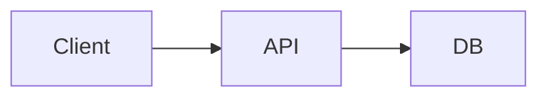
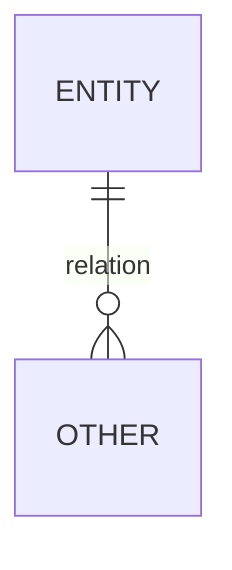
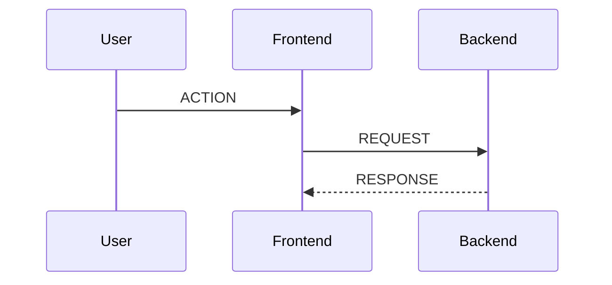

> Duplicate this file to start. Replace all placeholders in CAPITALS.

## Project Overview

- Name: PROJECT_NAME
- One‑liner: ONE_SENTENCE_VALUE
- Repo: REPO_URL
- Demo: DEMO_URL (optional)

## Goals of the Project

- GOAL_1
- GOAL_2
- Non‑goals: OUT_OF_SCOPE

## System Architecture Overview

| Layer | Technology | Notes |
|------|------------|-------|
| Frontend | TECH | WHY |
| Backend | TECH | WHY |
| Database | TECH | WHY |
| Realtime | TECH | WHY |
| Payments | TECH | WHY |

### Architecture Diagram

## Key Features

- FEATURE_DOMAIN: bullets of capabilities

## API Architecture

- DOMAIN: `/api/...` endpoints

## Database Design

## Flows

## Challenges & Solutions

| Challenge | Solution |
|-----------|---------|
| PROBLEM | FIX + TRADEOFF |

## Best Practices

- Security: MEASURES
- Performance: CACHING/OPTIMIZATION
- DX: TOOLING_CHOICES

## Conclusion

- Outcomes/metrics
- Next steps

