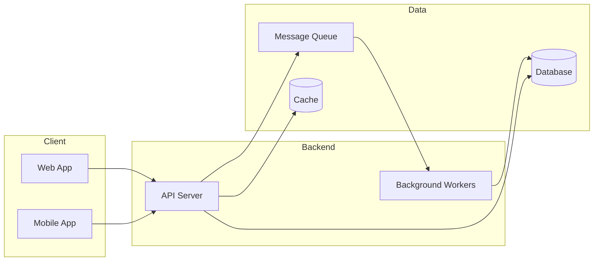
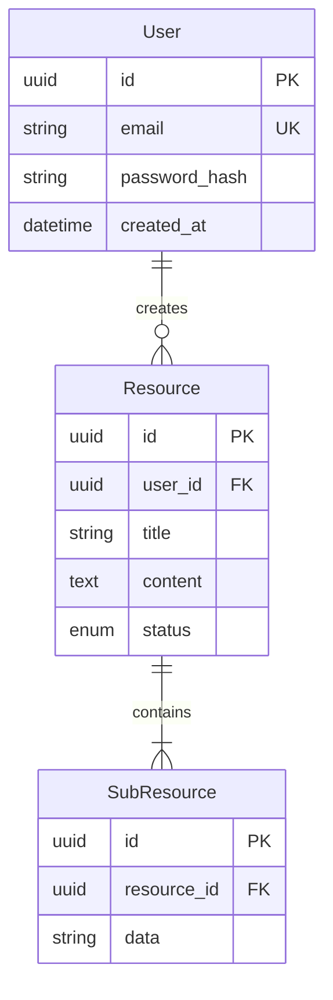
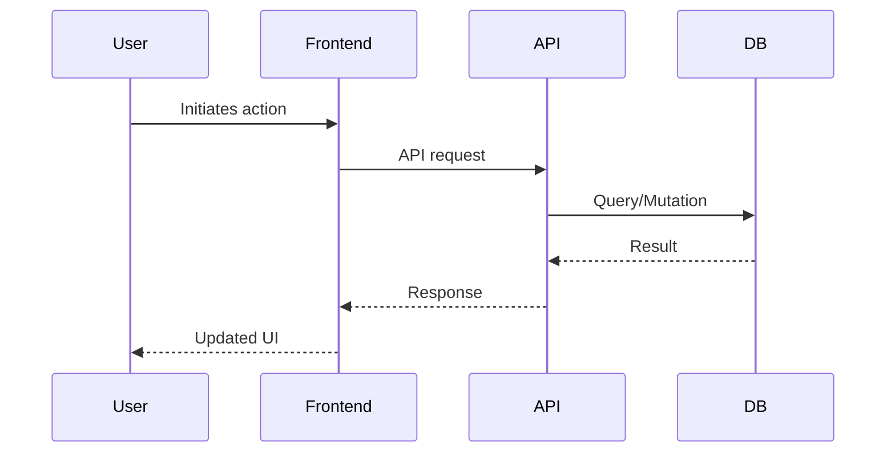
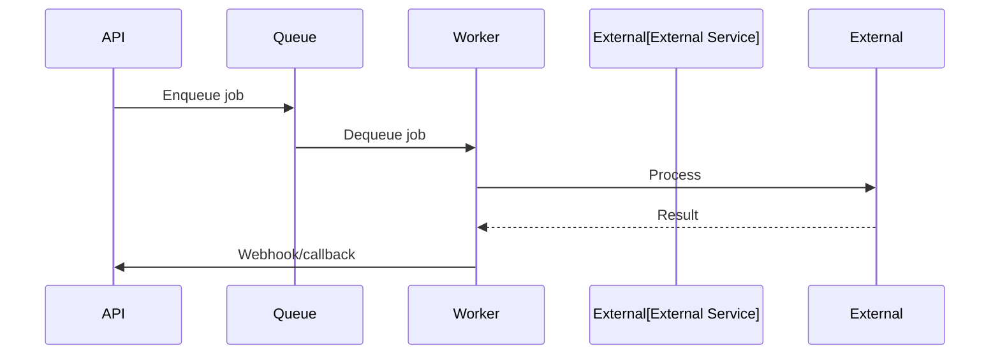

<Note>
**How to use**: Copy everything below this note into a new file, then replace all `PLACEHOLDER_TEXT` values with your project details.
</Note>

---

## 📋 Project Overview

| | |
|---|---|
| **Project Name** | YOUR_PROJECT_NAME |
| **One-liner** | One sentence describing what it does and who it's for |
| **GitHub** | [Repository](YOUR_GITHUB_URL) |
| **Live Demo** | [Demo](YOUR_DEMO_URL) *(optional)* |
| **Team Size** | X people |
| **Your Role** | YOUR_ROLE (e.g., Full-Stack Developer, Backend Lead) |
| **Timeline** | X weeks/months |

---

## 🎯 Goals

### What We Built
- GOAL_1: What problem does this solve?
- GOAL_2: Who benefits and how?
- GOAL_3: Any specific metrics we aimed for?

### Non-Goals (Scope Boundaries)
- NON_GOAL_1: What we explicitly didn't build
- NON_GOAL_2: What's planned for v2

---

## 🏗️ System Architecture

### Tech Stack

| Layer | Technology | Why We Chose It |
|-------|------------|-----------------|
| **Frontend** | TECH | REASON |
| **Backend** | TECH | REASON |
| **Database** | TECH | REASON |
| **Cache** | TECH | REASON |
| **Auth** | TECH | REASON |
| **Payments** | TECH *(if applicable)* | REASON |
| **Real-time** | TECH *(if applicable)* | REASON |
| **Deployment** | TECH | REASON |

### Architecture Diagram

---

## ⭐ Key Features

### Feature Domain 1 (e.g., Authentication)
- Feature bullet point with brief description
- Another feature with technical detail if relevant
- OAuth integration with Google/GitHub

### Feature Domain 2 (e.g., Core Functionality)
- Main feature of your application
- Supporting feature
- Edge case handling

### Feature Domain 3 (e.g., Admin/Analytics)
- Admin dashboard capabilities
- Reporting features
- Monitoring/observability

---

## 🔌 API Design

### Endpoint Groups

**Domain 1 (e.g., Users)**
| Method | Endpoint | Description |
|--------|----------|-------------|
| `POST` | `/api/auth/register` | Create new user |
| `POST` | `/api/auth/login` | Authenticate user |
| `GET` | `/api/users/me` | Get current user profile |

**Domain 2 (e.g., Core Resource)**
| Method | Endpoint | Description |
|--------|----------|-------------|
| `GET` | `/api/resources` | List resources with pagination |
| `POST` | `/api/resources` | Create new resource |
| `GET` | `/api/resources/:id` | Get single resource |
| `PATCH` | `/api/resources/:id` | Update resource |
| `DELETE` | `/api/resources/:id` | Delete resource |

---

## 🗄️ Database Design

### Key Design Decisions
- **Decision 1**: Why we structured data this way
- **Decision 2**: Indexing strategy for performance
- **Decision 3**: Any denormalization trade-offs

---

## 🔄 Key Flows

### Main User Flow

### Background Processing Flow

---

## 🔧 Challenges & Solutions

| # | Challenge | Why It Was Hard | Solution | Trade-off |
|---|-----------|-----------------|----------|-----------|
| 1 | CHALLENGE_1 | DIFFICULTY | SOLUTION | TRADE_OFF |
| 2 | CHALLENGE_2 | DIFFICULTY | SOLUTION | TRADE_OFF |
| 3 | CHALLENGE_3 | DIFFICULTY | SOLUTION | TRADE_OFF |
| 4 | CHALLENGE_4 | DIFFICULTY | SOLUTION | TRADE_OFF |
| 5 | CHALLENGE_5 | DIFFICULTY | SOLUTION | TRADE_OFF |

### Deep Dive: Most Interesting Challenge

Describe your most technically interesting challenge in detail:

**The Problem**: What was happening? What was the impact?

**Investigation**: How did you debug/analyze it?

**Solution**: What did you implement? Show code snippets if helpful.

**Result**: What improved? Any metrics?

---

## ✅ Best Practices Applied

### Security
- [ ] Input validation and sanitization
- [ ] SQL injection prevention (parameterized queries)
- [ ] XSS protection
- [ ] CSRF tokens
- [ ] Rate limiting
- [ ] Secure password hashing (bcrypt/argon2)
- [ ] HTTPS everywhere
- [ ] Secrets in environment variables

### Performance
- [ ] Database indexing on frequently queried columns
- [ ] Query optimization (EXPLAIN ANALYZE)
- [ ] Caching strategy (Redis/CDN)
- [ ] Lazy loading / code splitting
- [ ] Image optimization
- [ ] Connection pooling

### Developer Experience
- [ ] TypeScript for type safety
- [ ] ESLint + Prettier for code quality
- [ ] Pre-commit hooks (Husky)
- [ ] CI/CD pipeline (GitHub Actions)
- [ ] Comprehensive README
- [ ] API documentation (Swagger/OpenAPI)

### Observability
- [ ] Structured logging (JSON format)
- [ ] Error tracking (Sentry)
- [ ] Health check endpoints
- [ ] Metrics collection (Prometheus/DataDog)

---

## 📊 Results & Metrics

| Metric | Value | Notes |
|--------|-------|-------|
| **Response Time (p95)** | X ms | Target was Y ms |
| **Uptime** | X% | Over N months |
| **Concurrent Users** | X | Load tested |
| **Database Size** | X GB | After N months |
| **Deploy Frequency** | X/week | CI/CD automated |

---

## 🎓 Learnings & Next Steps

### What Went Well
- LEARNING_1
- LEARNING_2

### What I'd Do Differently
- IMPROVEMENT_1
- IMPROVEMENT_2

### Future Roadmap
- [ ] FEATURE_1 for v2
- [ ] FEATURE_2 for v2
- [ ] PERFORMANCE_IMPROVEMENT

---

## 🔗 Links

- **GitHub**: [Repository](YOUR_GITHUB_URL)
- **Demo**: [Live App](YOUR_DEMO_URL)
- **Documentation**: [Docs](YOUR_DOCS_URL)
- **Related Blog Post**: [Article](YOUR_BLOG_URL)