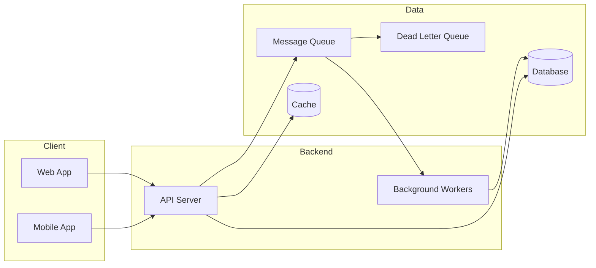
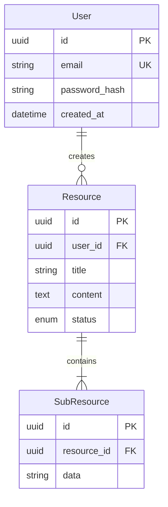
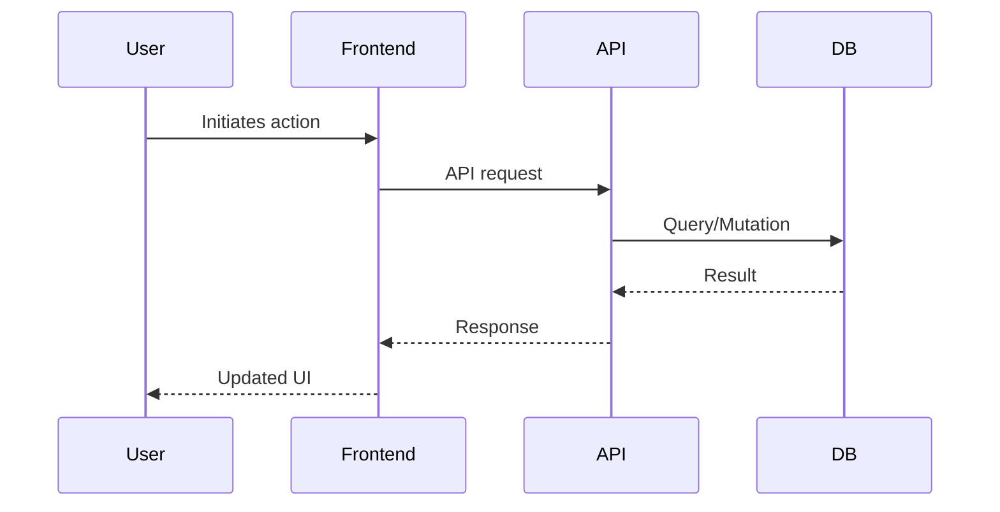
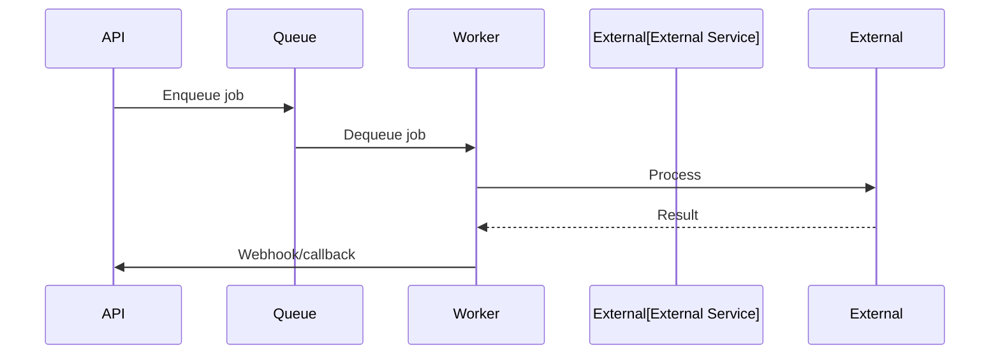

<Note>
**How to use**: Copy everything below this note into a new `.mdx` file named after your project (e.g., `my-marketplace.mdx`), then replace all `PLACEHOLDER_TEXT` values with your project details. Each placeholder includes inline guidance -- read it before replacing. The sections are ordered to match the evaluation rubric, so fill them in order and your narrative will flow naturally.
</Note>

---

## Project Overview

| | |
|---|---|
| **Project Name** | YOUR_PROJECT_NAME |
| **One-liner** | A single sentence that describes the problem solved and for whom -- not a feature list. Example: "A marketplace that synchronizes inventory across 3 warehouses in real time so sellers never oversell." |
| **GitHub** | [Repository](YOUR_GITHUB_URL) -- make sure your README is polished; evaluators will click this link |
| **Live Demo** | [Demo](YOUR_DEMO_URL) -- if not deployed, link a 2-minute Loom walkthrough video |
| **Team Size** | X people |
| **Your Role** | YOUR_ROLE -- be specific: "Led backend architecture and payment integration" beats "Full-stack developer" |
| **Timeline** | X weeks/months -- include whether this was full-time or part-time |

---

## Goals

### What We Built
- GOAL_1: What problem does this solve? Frame as user pain, not technology. Example: "Sellers lose 15% of orders because inventory is out of sync."
- GOAL_2: Who benefits and how? Name the user personas explicitly.
- GOAL_3: Any specific, measurable targets? Example: "p95 latency under 200ms at 10K concurrent users."

### Non-Goals (Scope Boundaries)
- NON_GOAL_1: What you explicitly did not build -- and briefly why. Example: "Mobile app (deferred; 85% of sellers manage inventory from desktop)."
- NON_GOAL_2: What is planned for v2. This shows you scoped deliberately, not accidentally.

<Tip>
Listing non-goals is one of the strongest signals of engineering maturity. It shows you can say "no" to scope -- the skill that separates mid-level from senior engineers.
</Tip>

---

## System Architecture

### Tech Stack

For each row, the "Why" column should answer three questions: Why this? What did you consider instead? What trade-off did you accept?

| Layer | Technology | Why We Chose It | What We Considered |
|-------|------------|-----------------|-------------------|
| **Frontend** | TECH | REASON -- include the specific constraint that drove this choice | ALTERNATIVE_1, ALTERNATIVE_2 -- why they lost |
| **Backend** | TECH | REASON | ALTERNATIVE |
| **Database** | TECH | REASON -- mention ACID, consistency, or query pattern requirements | ALTERNATIVE |
| **Cache** | TECH | REASON -- what is cached and why (sessions, queries, static assets) | ALTERNATIVE |
| **Auth** | TECH | REASON -- JWT vs sessions, why this pattern fits your scaling model | ALTERNATIVE |
| **Payments** | TECH *(if applicable)* | REASON -- PCI scope implications | ALTERNATIVE |
| **Real-time** | TECH *(if applicable)* | REASON -- connection management strategy | ALTERNATIVE |
| **Deployment** | TECH | REASON -- cost, team familiarity, scaling model | ALTERNATIVE |

### Architecture Diagram

Replace this template with your actual architecture. Include failure boundaries -- show where retries, circuit breakers, or dead letter queues live. A diagram without error handling suggests you have not thought about production reliability.

```mermaid
flowchart LR
    subgraph Client
        Web[Web App]
        Mobile[Mobile App]
    end
    
    subgraph Backend
        API[API Server]
        Worker[Background Workers]
    end
    
    subgraph Data
        DB[(Database)]
        Cache[(Cache)]
        Queue[Message Queue]
        DLQ[Dead Letter Queue]
    end
    
    Web & Mobile --> API
    API --> DB & Cache
    API --> Queue --> Worker
    Queue --> DLQ
    Worker --> DB
```

<Tip>
Label your diagram arrows with the actual protocol or endpoint where possible (e.g., "REST/HTTPS", "WebSocket", "AMQP"). This helps reviewers trace data flow without guessing.
</Tip>

---

## Key Features

Group features by domain. For each bullet, include the engineering decision, not just the feature name. "JWT authentication" is a checkbox; "JWT with 15-minute access tokens and rotating refresh tokens in HttpOnly cookies, chosen over sessions because we needed stateless horizontal scaling" is an engineering decision.

### Feature Domain 1 (e.g., Authentication)
- FEATURE -- what pattern or approach you used and why
- FEATURE -- any non-obvious decision (e.g., why OAuth with specific providers)
- FEATURE -- how edge cases are handled (e.g., account linking when user signs up with email then tries OAuth)

### Feature Domain 2 (e.g., Core Functionality)
- FEATURE -- the main value proposition of the application
- FEATURE -- supporting capability with the concurrency or consistency challenge it introduces
- FEATURE -- how you handle the edge case that most implementations get wrong

### Feature Domain 3 (e.g., Admin/Analytics)
- FEATURE -- admin dashboard with the aggregation strategy (materialized views, read replicas, or separate analytics store)
- FEATURE -- reporting with the data freshness trade-off (real-time vs. eventual)
- FEATURE -- observability and monitoring (what you alert on and why)

---

## API Design

Group endpoints by bounded context (Users, Products, Orders), not by HTTP method. Highlight the interesting design decisions -- you do not need to list every CRUD endpoint if the pattern is standard. Focus on endpoints that have non-obvious behavior, authorization rules, or idempotency requirements.

### Endpoint Groups

**Domain 1 (e.g., Users)**
| Method | Endpoint | Description | Notes |
|--------|----------|-------------|-------|
| `POST` | `/api/auth/register` | Create new user | Rate limited: 5 req/min per IP |
| `POST` | `/api/auth/login` | Authenticate user | Returns JWT + sets refresh token cookie |
| `GET` | `/api/users/me` | Get current user profile | Scoped by JWT claims, no path param to prevent IDOR |

**Domain 2 (e.g., Core Resource)**
| Method | Endpoint | Description | Notes |
|--------|----------|-------------|-------|
| `GET` | `/api/resources` | List resources with pagination | Cursor-based pagination for stable ordering |
| `POST` | `/api/resources` | Create new resource | Idempotency key required in header |
| `GET` | `/api/resources/:id` | Get single resource | Includes cache headers (ETag, max-age) |
| `PATCH` | `/api/resources/:id` | Update resource | Optimistic locking via version field |
| `DELETE` | `/api/resources/:id` | Soft-delete resource | Sets `deleted_at` timestamp, does not remove row |

<Tip>
Adding a "Notes" column to your endpoint table is a small touch that signals production experience. Idempotency keys, rate limits, soft deletes, and cache headers are the details that distinguish a portfolio project from a production system.
</Tip>

---

## 🗄️ Database Design

```mermaid
erDiagram
    User ||--o{ Resource : creates
    User {
        uuid id PK
        string email UK
        string password_hash
        datetime created_at
    }
    Resource ||--|{ SubResource : contains
    Resource {
        uuid id PK
        uuid user_id FK
        string title
        text content
        enum status
    }
    SubResource {
        uuid id PK
        uuid resource_id FK
        string data
    }
```

### Key Design Decisions
- **Decision 1**: Why you structured data this way. Were there normalization trade-offs? Did you denormalize for read performance? What consistency risks did that introduce?
- **Decision 2**: Indexing strategy. Which columns are indexed and why? Did you run `EXPLAIN ANALYZE` to validate? Include the before/after query times if you have them.
- **Decision 3**: Any denormalization trade-offs. Example: "Denormalized seller name into OrderItem to avoid a join on the order listing page. Trade-off: seller name changes require a background job to update historical orders, introducing eventual consistency."

---

## 🔄 Key Flows

### Main User Flow

```mermaid
sequenceDiagram
    participant User
    participant Frontend
    participant API
    participant DB
    
    User->>Frontend: Initiates action
    Frontend->>API: API request
    API->>DB: Query/Mutation
    DB-->>API: Result
    API-->>Frontend: Response
    Frontend-->>User: Updated UI
```

### Background Processing Flow

```mermaid
sequenceDiagram
    participant API
    participant Queue
    participant Worker
    participant External[External Service]
    
    API->>Queue: Enqueue job
    Queue->>Worker: Dequeue job
    Worker->>External: Process
    External-->>Worker: Result
    Worker->>API: Webhook/callback
```

---

## Challenges and Solutions

This is the most valuable section of your case study. Write it first, write it well, and expect interviewers to ask follow-up questions about every row.

For each challenge, be specific about the symptom (not just the category), the root cause, and the alternatives you considered before choosing your solution.

| # | Challenge | Why It Was Hard | Alternatives Considered | Solution | Trade-off |
|---|-----------|-----------------|------------------------|----------|-----------|
| 1 | CHALLENGE_1 -- describe the specific symptom | DIFFICULTY -- what made the obvious solution insufficient | ALT_1, ALT_2 | SOLUTION | TRADE_OFF -- what cost did you accept |
| 2 | CHALLENGE_2 | DIFFICULTY | ALT_1, ALT_2 | SOLUTION | TRADE_OFF |
| 3 | CHALLENGE_3 | DIFFICULTY | ALT_1, ALT_2 | SOLUTION | TRADE_OFF |
| 4 | CHALLENGE_4 | DIFFICULTY | ALT_1, ALT_2 | SOLUTION | TRADE_OFF |
| 5 | CHALLENGE_5 | DIFFICULTY | ALT_1, ALT_2 | SOLUTION | TRADE_OFF |

<Warning>
Avoid generic challenges like "deployment was hard" or "state management was tricky." Describe the specific failure: "Two buyers could purchase the last item simultaneously because our inventory check and decrement were not atomic." Specificity is credibility.
</Warning>

### Deep Dive: Most Interesting Challenge

Pick your most technically interesting challenge and expand it into a narrative. This is the section that turns a good case study into a memorable one.

**The Problem**: What was happening? What was the user-facing impact? How did you discover it -- monitoring, user reports, load testing?

**Investigation**: How did you debug and analyze it? What tools did you use (database query plans, flame graphs, distributed tracing)? What hypotheses did you form and discard?

**Solution**: What did you implement? Show a focused code snippet if it illustrates the key insight -- not boilerplate, just the critical logic. Explain why this approach won over the alternatives.

**Result**: What improved? Quantify with before/after metrics. Example: "Query time dropped from 3.2s to 45ms after adding a composite index on (seller_id, created_at)."

---

## Best Practices Applied

Only check boxes for practices you actually implemented. Evaluators will ask you to elaborate -- claiming a practice you did not implement is worse than leaving the box unchecked.

### Security
- [ ] Input validation and sanitization -- specify the library (Joi, Zod, express-validator) and where validation runs (server-side on every POST/PATCH, client-side for UX)
- [ ] SQL injection prevention (parameterized queries or ORM with query builder)
- [ ] XSS protection -- Content-Security-Policy headers, output encoding
- [ ] CSRF tokens on all state-changing requests
- [ ] Rate limiting -- specify the limits (e.g., 100 req/min per IP on auth endpoints, 1000 req/min on read endpoints)
- [ ] Secure password hashing (bcrypt with cost factor 12+ or argon2id)
- [ ] HTTPS everywhere, including internal service communication
- [ ] Secrets in environment variables, never committed to version control

### Performance
- [ ] Database indexing on frequently queried columns -- include evidence from `EXPLAIN ANALYZE`
- [ ] Query optimization -- mention specific queries you improved and the before/after times
- [ ] Caching strategy -- specify what is cached (sessions in Redis, static assets on CDN, query results with TTL)
- [ ] Lazy loading and code splitting by route
- [ ] Image optimization (WebP format, responsive sizes, CDN delivery)
- [ ] Connection pooling -- specify pool size and how you determined it

### Developer Experience
- [ ] TypeScript for type safety across the full stack
- [ ] ESLint + Prettier with a shared config enforced in CI
- [ ] Pre-commit hooks (Husky + lint-staged) to catch issues before they reach the repo
- [ ] CI/CD pipeline (GitHub Actions or similar) with automated tests and preview deployments
- [ ] Comprehensive README with setup instructions, architecture overview, and contribution guide
- [ ] API documentation (Swagger/OpenAPI or Postman collection)

### Observability
- [ ] Structured logging (JSON format) with correlation IDs for request tracing
- [ ] Error tracking (Sentry with source maps in production)
- [ ] Health check endpoints for load balancer probes
- [ ] Metrics collection (Prometheus/Datadog) -- at minimum: request count, latency histogram, error rate

---

## Results and Metrics

Quantitative metrics are what turn a project description into evidence. If you do not have production metrics, use load test results and be transparent about it.

| Metric | Value | Target | How Measured |
|--------|-------|--------|-------------|
| **Response Time (p50)** | X ms | Y ms | Application Performance Monitoring (APM) or load test tool |
| **Response Time (p95)** | X ms | Y ms | Include the p95 to show tail latency, not just averages |
| **Uptime** | X% | Y% | Over N months of operation |
| **Concurrent Users** | X | Y | Load tested with k6/Artillery/JMeter -- specify the tool |
| **Database Size** | X GB | -- | After N months of operation |
| **Deploy Frequency** | X/week | -- | CI/CD automated; include time from merge to production |
| **Error Rate** | X% | Under Y% | 4xx and 5xx combined, or broken out separately |

---

## Learnings and Next Steps

### What Went Well
- LEARNING_1 -- what architectural or process decision paid off, and why
- LEARNING_2 -- what technology choice exceeded expectations

### What I Would Do Differently
Frame each item as a trade-off you now understand better, not as a mistake.
- IMPROVEMENT_1 -- Example: "Would adopt a monorepo with Turborepo from the start; splitting repos caused versioning headaches across shared types."
- IMPROVEMENT_2 -- Example: "Would introduce feature flags earlier to decouple deployment from release, reducing risk of big-bang launches."

### Future Roadmap
Prioritize by impact, not by ease. Show you are thinking about the product roadmap, not just the code.
- [ ] FEATURE_1 for v2 -- why this is the highest-impact next step
- [ ] FEATURE_2 for v2 -- what user feedback or data drives this priority
- [ ] PERFORMANCE_IMPROVEMENT -- what bottleneck this addresses

---

## Links

- **GitHub**: [Repository](YOUR_GITHUB_URL) -- ensure your README is polished and includes setup instructions
- **Demo**: [Live App](YOUR_DEMO_URL) -- if not deployed, link a short video walkthrough
- **Documentation**: [Docs](YOUR_DOCS_URL) -- API docs, architecture docs, or ADRs
- **Related Blog Post**: [Article](YOUR_BLOG_URL) -- if you wrote about a specific challenge or decision, link it here

---

## Interview Deep-Dive

Use these questions to pressure-test your case study before presenting it in an interview. If you cannot answer these confidently, your case study has gaps.

<AccordionGroup>
  <Accordion title="How would you defend every row in your tech stack table if the interviewer challenges each choice?">
    **Strong Answer:**
    - For each technology in your stack, you need the three-part answer: why this, what you considered, and what trade-off you accepted. For example, if you chose PostgreSQL, you should be able to say: "We chose PostgreSQL over MongoDB because our payment flow required multi-table ACID transactions. We accepted slower writes and more rigid schema migrations in exchange for data integrity guarantees. We considered DynamoDB but rejected it because the access patterns were relational, not key-value."
    - The key is demonstrating that every choice was a deliberate decision, not a default. "I used React because I know it" is honest but weak. "I used React with Next.js because 60% of our user acquisition comes from organic search, and SSR was non-negotiable for SEO" shows product awareness driving technical decisions.
    - A strong candidate can also identify which choices they would change in hindsight. "If I rebuilt this today, I would evaluate Remix over Next.js because our data loading patterns turned out to be more loader-centric than component-centric" shows growth.

    **Follow-up: What if the interviewer says your tech stack is overengineered for the problem scope?**

    The right response is not defensive. Acknowledge the tension directly: "You are right that a simpler stack could have worked for the MVP. We chose this architecture because we anticipated scaling to X users within six months based on our user research. The trade-off was slower initial development velocity -- we spent two weeks on infrastructure that a simpler approach would not have needed. If I were doing this again with tighter time constraints, I would start with a monolith and extract services only when we hit measurable pain points like deployment coupling or team contention."
  </Accordion>

  <Accordion title="Walk me through a scenario where your architecture fails under 10x the expected load. What breaks first?">
    **Strong Answer:**
    - Start by identifying the weakest link in the chain. In most web applications, the database is the first bottleneck -- connection pool exhaustion, slow queries under high concurrency, or lock contention on hot rows. For example: "At 10x load, our PostgreSQL connection pool of 20 connections would saturate. Each request holds a connection for the duration of the transaction, and under high concurrency, requests would queue and eventually timeout."
    - Then walk through the cascade: database saturation causes API response times to spike, which causes the load balancer health checks to fail, which takes nodes out of rotation, which concentrates load on remaining nodes, which accelerates the failure.
    - Finish with what you would do about it: "To handle 10x, I would add read replicas for query-heavy endpoints, implement connection pooling with PgBouncer, add a caching layer for frequently accessed data, and introduce circuit breakers on the API to shed load gracefully instead of cascading failures."
    - The strongest candidates also mention what they would measure first. "Before scaling, I would run load tests to identify the actual bottleneck rather than guessing. In my experience, the bottleneck is rarely where you expect it."

    **Follow-up: How would you design a load test that reveals these bottlenecks before production?**

    "I would use a tool like k6 or Locust to simulate realistic user behavior, not just raw HTTP requests. The test should model actual user flows -- login, browse, add to cart, checkout -- because sequential flows stress connection pools and session management differently than isolated endpoint hits. I would run the test with monitoring enabled on database connections, CPU, memory, and p95 latency. The goal is to find the inflection point where latency degrades non-linearly -- that is your real capacity ceiling."
  </Accordion>

  <Accordion title="Your 'Challenges and Solutions' section lists five challenges. Which one taught you the most, and what would you do differently now?">
    **Strong Answer:**
    - Pick the challenge that changed how you think, not just the hardest one. For example: "The inventory race condition taught me the most. We initially used application-level locking, which worked in development but failed under concurrent load in staging. The root cause was that our read-then-write pattern had a window where two requests could read the same inventory count before either wrote the decrement."
    - Explain the progression of your understanding: "We first tried database-level pessimistic locks, which solved correctness but killed throughput. Then we moved to optimistic locking with version numbers, which maintained throughput but introduced a UX trade-off -- one buyer in a race sees a 'sold out' error after clicking buy."
    - What you would do differently: "Knowing what I know now, I would design the inventory system with eventual consistency from the start -- reserve inventory at cart-add time with a TTL, and release it if the checkout does not complete within 15 minutes. This is how most large e-commerce platforms handle it, and it avoids the race entirely at the cost of slight over-reservation."

    **Follow-up: How do you decide between optimistic and pessimistic concurrency control in a new project?**

    "The decision depends on the contention profile. If conflicts are rare -- say less than 1% of transactions -- optimistic locking is almost always better because you avoid the throughput cost of holding locks. If conflicts are frequent, like a flash sale where hundreds of users target the same item, pessimistic locking or a queue-based approach is more predictable. The key metric is the retry rate under optimistic locking. If retries exceed 5-10%, the overhead of retries starts to exceed the cost of holding locks."
  </Accordion>

  <Accordion title="If an interviewer looks at your database ERD and asks why you chose this normalization level, what is your answer?">
    **Strong Answer:**
    - Start with the principle: "Our default was third normal form because it eliminates update anomalies and keeps the schema honest. Every denormalization was a deliberate trade-off with a specific read performance justification."
    - Give a concrete example: "We denormalized the seller name into the OrderItem table to avoid a three-table join on the order listing page, which is our highest-traffic read query. The trade-off is that when a seller changes their display name, we need a background job to update all historical order items. We accepted this because seller name changes happen maybe once a month, but order listings are hit thousands of times per hour."
    - Show awareness of alternatives: "We also considered using a materialized view for the order listing query instead of denormalization. The advantage is that the source data stays normalized and the view is refreshed on a schedule. We rejected it because our PostgreSQL version at the time did not support concurrent refresh without locking the view, which would block reads during the refresh window."

    **Follow-up: How do you monitor for data inconsistencies introduced by denormalization?**

    "We run a nightly consistency check job that compares denormalized fields against their source tables and flags mismatches. It is a simple SQL query that joins the denormalized table back to the source and checks for differences. If mismatches exceed a threshold, it triggers an alert and a repair job. The key insight is that denormalization is a promise you are making to keep two copies of data in sync -- and you need a mechanism to verify that promise, because eventually the sync will break."
  </Accordion>
</AccordionGroup>