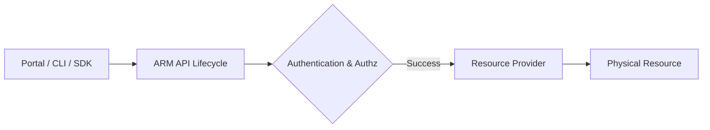
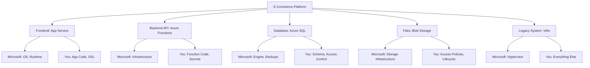

# Azure Fundamentals & Architecture

This chapter will take you from absolute zero to understanding Azure's core architecture. We assume you know NOTHING about cloud computing, and we'll build your knowledge step by step with real-world analogies, detailed explanations, and practical examples.

## What You'll Learn

By the end of this chapter, you'll understand:
- What cloud computing actually is (and why it exists)
- How Azure's physical infrastructure works
- The shared responsibility model (who does what)
- How to choose between different service models
- Azure's global architecture (regions, zones, datacenters)
- Core design principles (CAP theorem, availability, consistency)
- How to make architectural decisions confidently

---

## Introduction: What is Cloud Computing?

Let's start at the very beginning. What IS the cloud, and why does it exist?

### The Problem Before Cloud Computing

Imagine you want to start a website for your business in 2005 (before cloud computing existed):

**Step 1: Buy Hardware**
```
Cost: $10,000+ per server
- Physical server (Dell, HP)
- Storage drives
- Networking equipment
- Cables, racks, power supplies

Timeline: 4-8 weeks to arrive
```

**Step 2: Find a Place to Put It**
```
Options:
A) Your office closet
   - Risk: Power outage = website down
   - Risk: Fire, flood, theft
   - No backup power or cooling

B) Rent datacenter space ($500-2000/month)
   - Must sign long-term contract (1-3 years)
   - Must pay even if you shut down
```

**Step 3: Install and Configure**
```
Tasks:
- Install operating system (Windows/Linux)
- Configure networking
- Install web server software
- Set up databases
- Configure backups
- Set up monitoring

Skills needed: System administrator
Timeline: 1-2 weeks
```

**Step 4: Maintain Forever**
```
Ongoing work:
- Apply security patches monthly
- Replace failed hardware
- Upgrade when traffic grows
- Monitor 24/7 for outages
- Handle backups manually

Cost: 1-2 full-time IT staff
```

**The Big Problems:**
1. **Huge upfront cost** ($10,000+ before you have any customers)
2. **Slow** (2+ months from idea to website)
3. **Fixed capacity** (bought 1 server, but what if you need 10? Or only need 0.5?)
4. **Your problem if it breaks** (hardware failure at 2 AM? You fix it)
5. **Wasted money** (server sitting idle 90% of time, but you paid full price)

### The Cloud Solution

Now imagine the same scenario in 2025 with Azure:

**Step 1: Create Virtual Server**
```
Cost: $0 upfront, pay ~$0.01/hour (~$7/month for small server)
Timeline: 5 minutes
Method: Click a few buttons in a web browser
```

**Step 2: No Datacenter Needed**
```
Microsoft's responsibility:
- 300+ datacenters worldwide
- Backup power (generators + batteries)
- Physical security (guards, cameras, locks)
- Fire suppression, cooling systems
- Network connectivity
- Hardware replacement

Your cost: $0 (included in the hourly rate)
```

**Step 3: Pre-Configured Software**
```
Available:
- Choose operating system from a menu
- Web server software pre-installed (if you want)
- Database already running (if you want)
- Automatic backups (if you want)
- Monitoring built-in

Timeline: Already done (part of the 5 minutes)
```

**Step 4: Automatic Maintenance**
```
Microsoft handles:
- Security patches (automatic)
- Hardware failures (automatic replacement)
- Scaling (add more servers automatically)
- 24/7 monitoring (built-in)

Your time investment: Hours per month, not days per week
```

**The Cloud Benefits:**
1. **No upfront cost** (pay only for what you use, like electricity)
2. **Instant** (5 minutes from idea to working website)
3. **Flexible capacity** (need more? Add instantly. Need less? Remove instantly)
4. **Microsoft's problem if hardware breaks** (they replace it, you don't even notice)
5. **Save money** (only pay when running; stop paying when not needed)

### Real-World Analogy: Owning vs. Renting

**Buying Your Own Server = Owning a Car**
- Buy the car ($30,000)
- Maintenance costs (oil, tires, repairs)
- Insurance
- Parking space
- Sits unused in driveway 90% of the time
- Your problem if it breaks

**Using Azure = Taking an Uber**
- Pay only when you need a ride
- No maintenance
- No insurance
- No parking
- If the car breaks, they send another one
- Scale instantly (need 10 cars for a wedding? Done)

### What is Microsoft Azure?

**Azure** is Microsoft's cloud computing platform. Think of it as:

1. **A giant worldwide network of datacenters** (300+ buildings full of computers)
2. **Software that lets you rent those computers** (by the hour, by the second)
3. **Pre-built services** (databases, networking, AI, etc.)
4. **Tools to manage everything** (web portal, command-line, APIs)

**What makes it "cloud" computing?**
- **On-demand**: Get resources when you need them, instantly
- **Self-service**: No need to call Microsoft and wait
- **Pay-as-you-go**: Like electricity, pay only for what you use
- **Elastic**: Scale up and down automatically
- **Managed**: Microsoft maintains the physical infrastructure

### Why Would YOU Use Azure? (Real Scenarios)

**Scenario 1: You're building a startup**
```
Challenge: Need a website, but have $0 for hardware
Solution:
- Azure free tier gives you free compute for 12 months
- Pay ~$20/month for a small website
- If startup fails, you stop paying (vs. $10,000 wasted on servers)
- If startup succeeds, scale to millions of users instantly
```

**Scenario 2: Your company has seasonal traffic**
```
Challenge: Black Friday traffic is 100x normal days
Old way:
- Buy 100 servers for Black Friday ($500,000)
- Servers sit unused 364 days/year
- Still must pay for power, cooling, maintenance

Azure way:
- Run 1 server normally ($100/month = $1,200/year)
- Auto-scale to 100 servers for Black Friday (1 day)
- Cost for Black Friday: $100 × 100 servers × 1 day ≈ $330
- Total yearly cost: $1,200 + $330 = $1,530 (vs. $500,000)
```

**Scenario 3: You need global presence**
```
Challenge: Users in US, Europe, and Asia need fast access
Old way:
- Build datacenters in 3 continents ($5+ million)
- Hire staff in each location
- Network them together

Azure way:
- Deploy to 3 Azure regions with a few clicks
- Microsoft already has datacenters there
- Global network already built
- Cost: ~$300/month (vs. $5 million)
```

### Key Cloud Concepts (Explained Simply)

Before we dive into Azure specifics, let's define the essential terms:

**Virtual Machine (VM)**
> A virtual machine is a software-based computer running on physical hardware. Think of it like this: Microsoft has a massive physical server. Using virtualization software, they split that one physical server into 10 "virtual" servers. Each virtual server thinks it's a real computer with its own CPU, memory, and storage.
>
> **Analogy**: It's like splitting a large house into 10 separate apartments. Each apartment has its own kitchen, bathroom, and living space, even though they're all in the same building.

**Server**
> A computer designed to run 24/7, serving requests from other computers. Your laptop is a client (makes requests), a server responds to requests.
>
> **Example**: When you visit a website, your browser (client) sends a request to a web server, which sends back the web page.

**Datacenter**
> A building full of servers, networking equipment, power systems, and cooling systems. Azure has 300+ datacenters worldwide.
>
> **Analogy**: Like a massive parking garage, but instead of cars, it's filled with thousands of computers running 24/7.

**Computing Power**
> The ability to run programs and process data. Measured in CPU cores (like having multiple workers) and RAM (like having a larger desk to work on).

**Storage**
> Where data is permanently saved. Like a hard drive, but in the cloud.
>
> **Types you'll learn**:
> - Blob Storage: For files (images, videos, documents)
> - Disk Storage: For virtual machine hard drives
> - Database Storage: For structured data (customer info, orders)

**Network**
> How computers talk to each other. In Azure, you'll create virtual networks (like a private network in the cloud).

---

## Cloud Economics: The Financial "Why"

To truly understand the cloud from a professional perspective, you must understand the money. Why do CFOs love the cloud while engineers sometimes fear the bill?

### CAPEX vs. OPEX

In traditional business, large purchases are treated as **Capital Expenditure (CAPEX)**. In the cloud, costs are **Operating Expenditure (OPEX)**.

| Feature | CAPEX (On-Premises) | OPEX (Cloud) |
|---------|---------------------|--------------|
| **Upfront Cost** | High (buy servers, building) | Zero (pay as you go) |
| **Commitment** | Fixed (stuck with what you bought) | Dynamic (stop paying anytime) |
| **Tax Treatment** | Depreciated over 3-5 years | Deducted as expense in same year |
| **Risk** | High (tech becomes obsolete) | Low (switch to newer tech instantly) |
| **Analogy** | Buying a house | Staying in a hotel |

### Total Cost of Ownership (TCO)

A common mistake beginners make is comparing the monthly cost of an Azure VM ($50) to the price of a physical server ($3,000) and thinking "The cloud is expensive!".

This ignores the **Total Cost of Ownership**. The TCO includes "Hidden Costs" that Microsoft covers for you:

1. **Power & Cooling**: Electricity isn't free. Servers need lots of it, and 24/7 HVAC.
2. **Floor Space**: The rent for the room where the server sits.
3. **IT Labor**: Salary of people to rack servers, replace failed drives, and manage the physical network.
4. **Opportunity Cost**: The time your engineer spends fixing hardware is time they *aren't* building features that make you money.

> [!IMPORTANT]
> **Pro Insight: The Agility Premium**
> You aren't just paying for a computer; you're paying for the ability to get 1,000 computers in 5 minutes. This "agility" allows businesses to experiment and fail fast without losing millions in hardware.

---

## How Azure Actually Works (Behind the Scenes)

Let's demystify what happens when you click "Create Virtual Machine" in Azure.

### The Physical Layer

**What Microsoft Actually Has:**

```
Azure Datacenter (East US Region):
├── Building
│   ├── Size: 20-40 acres (equivalent to 15-30 football fields)
│   ├── Power: 10-20 megawatts (enough for a small city)
│   ├── Backup power: Diesel generators + UPS batteries
│   ├── Cooling: Massive HVAC systems (servers get HOT)
│   └── Security: Guards, cameras, biometric access
│
├── Server Racks (thousands of them)
│   └── Each rack contains:
│       ├── 40-50 servers (each server = powerful computer)
│       ├── Networking switches
│       ├── Power distribution units
│       └── Total: 50,000-80,000 servers per datacenter
│
└── Your Virtual Machine
    └── Actually runs on: 1 slice of 1 server
        ├── Your VM shares physical server with ~10 other VMs
        ├── Hypervisor software keeps them isolated
        └── You never know (or care) which physical server
```

**When You Create a VM:**

1. **You click "Create VM" in Azure portal**
2. **Azure's software** (called the fabric controller):
   - Finds a physical server with available capacity
   - Might be in any rack in the datacenter
   - Allocates portion of CPU/RAM to your VM
3. **Hypervisor** (Microsoft Hyper-V):
   - Creates a virtual machine on that physical server
   - Gives your VM 2 vCPUs, 4 GB RAM (or whatever you requested)
   - Ensures your VM is isolated from other VMs on same server
4. **Your VM boots up**:
   - Installs the operating system you chose
   - Connects to the virtual network you specified
   - Assigns an IP address
   - Ready to use in 2-5 minutes

**The Magic**: You never think about which physical server, which rack, which row. Azure handles all of that. You just get a working computer.

### The Virtualization Layer

**What is Virtualization?**

Imagine a physical server with these specs:
- 64 CPU cores
- 512 GB RAM
- 10 TB storage

Without virtualization, only ONE application can use this server. If your app only needs 2 CPUs and 4 GB RAM, you're wasting 62 CPUs and 508 GB RAM.

**With virtualization:**
```
Physical Server (64 cores, 512 GB RAM)
├── VM 1: 2 cores, 4 GB RAM (Your web server)
├── VM 2: 4 cores, 16 GB RAM (Someone else's database)
├── VM 3: 2 cores, 4 GB RAM (Another customer's app)
├── VM 4: 8 cores, 32 GB RAM (Another customer's server)
├── ... (20+ more VMs)
└── Hypervisor manages them all, keeps them isolated

Result:
- You pay only for 2 cores and 4 GB RAM
- Microsoft sells the same physical server to 30 customers
- Everyone gets their own isolated "computer"
- Much cheaper for you, more profitable for Microsoft (win-win)
```

**Security Concern**: "Wait, I'm sharing a server with strangers?"

**Answer**: Yes, BUT:
- The hypervisor provides **hardware-level isolation**
- You cannot access another VM's memory or data
- It's like living in an apartment building:
  - You share the building with neighbors
  - But you can't access their apartment
  - You can't hear their conversations (proper isolation)
  - You have your own key (security)

Microsoft has run Azure this way since 2010 with billions of VMs created. The isolation is extremely secure (hardware-enforced, not just software).


> [!TIP]
> **Jargon Alert: Data Residency**
> The physical location where your data is stored. Some countries (like Germany or China) have strict laws requiring citizen data to never leave the country's borders. Azure lets you choose which region stores your data.

> [!WARNING]
> **Gotcha: Region Availability**
> Not all Azure services are available in all regions. Always check the "Azure Products by Region" page before architecting a solution, especially for newer services.

---

## Management Architecture: Azure Resource Manager (ARM)

When you click a button in the Portal, run a command in the CLI, or deploy a Bicep file, you are interacting with **Azure Resource Manager (ARM)**. Understanding ARM is the key to moving from a "user" to a "pro" architect.

### The Management Plane vs. Data Plane

This is a fundamental concept in cloud engineering.

1. **Management Plane (ARM)**: This is the "control room." It's where you create, update, and delete resources. When you change a VM's size or update a firewall rule, you are talking to the Management Plane.
2. **Data Plane**: This is the "resource itself." It's the traffic flowing *through* your VM, the queries hitting your database, or the files being uploaded to storage.

> [!IMPORTANT]
> **Pro Tip: Partitioning Failure**
> A failure in the Management Plane means you cannot *change* things (e.g., you can't create a new VM). However, your existing resources (the Data Plane) usually continue to run unaffected.

### How ARM Works

When you send a request to Azure, it always goes through the same pipeline:



1. **Consistent API**: Whether you use the Portal or a script, they all talk to the same ARM API (`management.azure.com`).
2. **Authentication**: ARM checks *who* you are (Entra ID).
3. **Authorization**: ARM checks *what* you can do (RBAC).
4. **Resource Providers**: ARM forwards the request to the specific service (e.g., `Microsoft.Compute` for VMs).

### Why Professionals Love ARM

- **Declarative Templates**: You describe *what* you want (e.g., "I want a Linux VM with 4GB RAM") rather than *how* to build it step-by-step.
- **Idempotency**: You can run the same deployment 100 times. If the resource already exists and matches your description, ARM does nothing. If it's missing, ARM creates it.
- **Resource Groups**: Logical containers that allow you to manage the lifecycle of an entire application as a single unit.

---

## 1. The Shared Responsibility Model

The foundation of cloud computing rests on understanding **where Microsoft's responsibility ends and yours begins**.

### Why This Model Exists

Think about renting an apartment:

**Landlord's Responsibilities:**
- Building structure (walls, roof, foundation)
- Building systems (heating, plumbing, electricity)
- Common areas (hallways, elevators)
- Building security (locks on main entrance)

**Your Responsibilities:**
- What's inside your apartment (furniture, belongings)
- Locking your own door
- Who you let in
- What you do inside

**Cloud computing works the same way**. Microsoft owns the "building" (datacenters, servers, network), but YOU own what runs on top (your applications, your data).

### The Critical Question: "If Something Goes Wrong, Who Fixes It?"

Let's make this crystal clear with real scenarios:

**Scenario 1: Physical server catches fire**
- **Who fixes it?** Microsoft
- **Why?** It's their hardware in their datacenter
- **What do you do?** Nothing. Azure automatically moves your VM to another server. You might not even notice.

**Scenario 2: Your website gets hacked due to SQL injection**
- **Who fixes it?** YOU
- **Why?** You wrote the application code with the vulnerability
- **What does Microsoft do?** Nothing. Your code, your problem.

**Scenario 3: Operating system needs a security patch**
- **Who fixes it?** Depends on the service!
  - **IaaS (VM)**: YOU must install the patch
  - **PaaS (App Service)**: Microsoft installs it automatically
  - **SaaS (Office 365)**: Microsoft handles everything

This is why understanding the service models is SO important.

---

### The Three Service Models (IaaS, PaaS, SaaS)

Let's understand each model deeply, with real-world analogies.

### IaaS (Infrastructure as a Service)

**What it is**: You rent virtual hardware (VMs, disks, networks). Microsoft gives you a "blank computer" in the cloud.

**Real-World Analogy: Renting an Unfurnished Apartment**
```
Landlord provides:
- Building (datacenter)
- Walls and roof (server hardware)
- Utilities hookups (network connectivity)

You provide:
- All furniture (operating system)
- Decorations (applications)
- Everything inside (data)
- Your own locks (firewall rules)
```

**Azure IaaS Services**: Virtual Machines, Virtual Networks, Load Balancers, Managed Disks

<Tabs>
  <Tab title="IaaS (VMs)">
    **Infrastructure as a Service**

    ```
    Microsoft Manages:
    ✓ Physical datacenter (building, power, cooling)
    ✓ Physical network (cables, routers, switches)
    ✓ Physical hosts (the actual server hardware)
    ✓ Hypervisor (software that runs virtual machines)

    You Manage:
    ✓ Operating System (Windows/Linux)
    ✓ Applications (web servers, databases, your code)
    ✓ Data (everything you store)
    ✓ Network configuration (NSGs, firewall rules)
    ✓ Identity and access (who can log in)
    ✓ Patching and updates (YOU must install security patches)
    ```

    **Example**: Azure Virtual Machines
    - You're responsible for OS patches, antivirus, application updates
    - Microsoft ensures the physical hardware and hypervisor are secure

    **When to Use IaaS:**
    ✅ Need full control over the operating system
    ✅ Running legacy applications that need specific OS versions
    ✅ Need to install custom software
    ✅ Migrating from on-premises (lift-and-shift)

    **Real Example:**
    ```
    Company has 10-year-old accounting software
    - Only runs on Windows Server 2012 R2
    - Uses specific printer drivers
    - Requires 32-bit DLL files

    Solution: Azure VM running Windows Server 2012 R2
    Why: PaaS doesn't support custom OS versions
    Trade-off: Company must manage security patches themselves
    ```
  </Tab>

  <Tab title="PaaS (App Service)">
    **Platform as a Service**

    **What it is**: You bring your application code. Microsoft handles everything else (OS, runtime, scaling, patching).

    **Real-World Analogy: Renting a Furnished Apartment**
    ```
    Landlord provides:
    - Building (datacenter)
    - Furniture (operating system)
    - Appliances (runtime: Node.js, .NET, Python)
    - Maintenance (automatic OS updates)
    - Utilities included (scaling, load balancing)

    You provide:
    - Your belongings (your application code)
    - Your data
    - Who has keys (access control)
    ```

    **Azure PaaS Services**: App Service, Azure Functions, Azure SQL Database, Cosmos DB

    ```
    Microsoft Manages:
    ✓ Everything in IaaS +
    ✓ Operating System (you never see it)
    ✓ Middleware/Runtime (Node.js, .NET, Python, Java)
    ✓ Patching and updates (automatic, zero downtime)
    ✓ Scaling infrastructure (add more servers automatically)
    ✓ Load balancing (distribute traffic)
    ✓ High availability (automatically replicate across zones)

    You Manage:
    ✓ Applications (your code)
    ✓ Data (what you store)
    ✓ Network configuration (firewall rules, VNet integration)
    ✓ Identity and access (who can access your app/data)
    ```

    **Example**: Azure App Service, Azure SQL Database
    - Microsoft patches the OS and database engine
    - You configure firewall rules and manage access control

    **When to Use PaaS:**
    ✅ Building modern web applications
    ✅ Want to focus on code, not infrastructure
    ✅ Need automatic scaling
    ✅ Faster time-to-market
    ✅ Don't need OS-level control

    **Real Example:**
    ```
    Startup building a web application
    - Team of 3 developers
    - No system administrators
    - Need to ship features fast
    - Traffic is unpredictable

    Solution: Azure App Service (PaaS)
    Benefits:
    - Deploy code in 5 minutes (vs. 2 hours to set up a VM)
    - Microsoft handles OS patches (saves 10 hours/month)
    - Automatic scaling (handles traffic spikes without manual intervention)
    - Built-in monitoring and logging
    - Cost: $50-100/month (vs. $200/month for VM + admin time)

    Trade-off: Can't install custom OS-level software, but they don't need to
    ```

    **Key Insight:**
    PaaS = Less control, Less responsibility

    You CANNOT:
    - Install custom software on the OS
    - Change OS settings
    - Access the underlying VM

    You CAN:
    - Deploy code instantly
    - Scale automatically
    - Focus on features, not infrastructure
  </Tab>

  <Tab title="SaaS (Office 365)">
    **Software as a Service**

    **What it is**: You use the application. Microsoft runs EVERYTHING.

    **Real-World Analogy: Staying in a Hotel**
    ```
    Hotel provides:
    - Building (datacenter)
    - Furniture (operating system)
    - Appliances (application runtime)
    - Room service (the actual application)
    - Cleaning (updates, maintenance)
    - Everything

    You provide:
    - Your luggage (your data)
    - Who stays in room (user access)
    ```

    **Azure SaaS Services**: Microsoft 365 (Office), Dynamics 365 (CRM), Microsoft Teams

    ```
    Microsoft Manages:
    ✓ Everything except:

    You Manage:
    ✓ Data (emails, documents, your content)
    ✓ User access (who has an account)
    ✓ Devices (what devices can access)
    ✓ Information protection (data classification, DLP policies)
    ```

    **Example**: Microsoft 365, Dynamics 365
    - Microsoft runs everything
    - You control who has access and what data they can see

    **When to Use SaaS:**
    ✅ Need a complete application (email, CRM, etc.)
    ✅ Don't want to manage ANY infrastructure
    ✅ Want instant setup
    ✅ Need automatic updates
    ✅ Standard features are sufficient

    **Real Example:**
    ```
    Company needs email for 100 employees

    Old way (self-hosted Exchange):
    - Buy Exchange Server license ($700)
    - Buy server hardware ($5,000)
    - Hire IT admin ($60,000/year salary)
    - Install, configure, maintain
    - Total: $65,700 first year + ongoing costs

    SaaS way (Microsoft 365):
    - $6/user/month × 100 users = $600/month
    - Total: $7,200/year
    - Zero maintenance
    - Zero infrastructure
    - Automatic updates
    - Includes Word, Excel, OneDrive, Teams

    Savings: $58,500 first year
    ```

    **Key Insight:**
    SaaS = No control, No responsibility

    You CANNOT:
    - Modify the application
    - Install plugins (usually)
    - Access underlying infrastructure
    - Control update schedule

    You CAN:
    - Use the application immediately
    - Configure settings
    - Manage users
    - Focus entirely on your business
  </Tab>
</Tabs>

---

### Choosing the Right Service Model: Decision Tree

How do you decide between IaaS, PaaS, and SaaS? Ask these questions:

```
Question 1: Does a SaaS solution exist for your need?
├─ Yes (email, CRM, etc.) → Use SaaS
│   └─ Example: Microsoft 365, Salesforce
│
└─ No (custom application) → Continue to Question 2

Question 2: Do you need to control the operating system?
├─ Yes (legacy app, custom drivers, specific OS version)
│   └─ Use IaaS (Virtual Machines)
│       └─ Example: Old accounting software, SAP installation
│
└─ No (modern application) → Continue to Question 3

Question 3: Is your application modern (web app, API, microservice)?
├─ Yes → Use PaaS (App Service, Functions, Containers)
│   └─ Benefits: Faster, cheaper, less maintenance
│
└─ No (not sure, complex requirements) → Start with IaaS, migrate to PaaS later
    └─ You can always move VM workloads to PaaS when ready
```

**Rule of Thumb**: Start with PaaS whenever possible. Only drop to IaaS when you have a specific requirement that PaaS can't meet.

### Real-World Example: E-Commerce Application

Let's say you're building an e-commerce platform. Here's how responsibility splits:



<Warning>
**Common Misconception #1**: "Microsoft backs up my data automatically"

**Reality**:
- ✅ Azure SQL: Yes, automatic backups (7-35 days retention)
- ❌ VMs: No automatic backup (you must configure Azure Backup)
- ❌ Blob Storage: Replication ≠ Backup (deleted files replicate deletion)

**Lesson**: Always verify backup strategy for each service.
</Warning>

<Warning>
**Common Misconception #2**: "PaaS means I don't worry about security"

**Reality**:
- Microsoft secures the **platform**
- You secure your **application** (SQL injection, XSS, etc.)
- You manage **access** (authentication, authorization)
- You configure **firewall rules** and network isolation

**Real Incident**:
```
Company deployed web app on App Service
Assumed "PaaS = secure"
Never implemented input validation
SQL injection vulnerability exploited
Database compromised

Root Cause: Application security is YOUR responsibility, always
```
</Warning>

### Best Practice: RACI Matrix

For every Azure service you use, document:

| Task | You | Microsoft | Notes |
|------|-----|-----------|-------|
| Physical security | I | R/A | Microsoft data centers |
| Database engine patches | I | R/A | Automatic updates |
| Database schema design | R/A | - | Your responsibility |
| TDE encryption | R/A | C | You enable, Microsoft provides |
| Firewall rules | R/A | - | Your network security |
| Performance tuning | R/A | C | Your queries, Microsoft provides tools |

**Legend**: R = Responsible, A = Accountable, C = Consulted, I = Informed

---

## 2. Azure Global Infrastructure

Azure operates in **60+ regions** worldwide—more than any other cloud provider. Understanding this geography is crucial for designing resilient, compliant, and performant systems.

### The Hierarchy: Geography → Region → Availability Zone

<div className="flex justify-center my-4">
  <div className="w-full max-w-4xl">
    ```mermaid
    graph TB
        A[Geography: United States] --> B[Region: East US]
        A --> C[Region: West US]
        A --> D[Region: Central US]

        B --> B1[AZ 1]
        B --> B2[AZ 2]
        B --> B3[AZ 3]

        C --> C1[AZ 1]
        C --> C2[AZ 2]
        C --> C3[AZ 3]

        style A fill:#0078D4
        style B fill:#50E6FF
        style C fill:#50E6FF
        style D fill:#50E6FF
    ```
  </div>
</div>

### Geography

A **Geography** is a discrete market that preserves data residency and compliance boundaries.

**Examples**:
- United States
- Europe
- Asia Pacific
- Australia
- Government (US Gov, China)

**Why it matters**:
- GDPR compliance requires data to stay in EU geography
- Healthcare data must stay in specific regions
- Government workloads require sovereign clouds

### Region

A **Region** is a set of datacenters deployed within a latency-defined perimeter, connected through a dedicated low-latency network.

**Key Characteristics**:
- Minimum 3 datacenters per region (for AZ support)
- Separated by at least **300 miles** from paired region
- Connected via Microsoft's private backbone (not public internet)

**Example Regions**:
- East US (Virginia)
- West Europe (Netherlands)
- Southeast Asia (Singapore)
- Australia East (New South Wales)

### Regional Pairs

Every region is paired with another region **within the same geography** for disaster recovery.

| Primary Region | Paired Region | Distance |
|---------------|---------------|----------|
| East US | West US | ~2,500 miles |
| North Europe (Ireland) | West Europe (Netherlands) | ~600 miles |
| Southeast Asia (Singapore) | East Asia (Hong Kong) | ~1,600 miles |

**Benefits of Regional Pairs**:

1. **Sequential Updates**: During platform updates, only one region in a pair is updated at a time
2. **Prioritized Recovery**: In a massive outage, one region from each pair gets priority
3. **Data Residency**: Pairs are in the same geography (compliance requirement)
4. **Replication**: Some services automatically replicate to paired region (GRS storage)

<Info>
**Pro Tip**: Always deploy production workloads across regional pairs for maximum resilience.
</Info>

### When a Region Goes Dark: Failure Scenarios

In the world of professional cloud engineering, we don't ask *if* a region will fail, but *when* and *what* we do about it.

#### 1. How You Find Out: Azure Service Health
Azure doesn't just "go down" silently. **Azure Service Health** is the set of tools that keeps you informed:
- **Azure Status**: The public page showing the status of all services globally. (The "Is the cloud broken?" page).
- **Service Health**: A personalized dashboard showing only the issues affecting *your* resources.
- **Resource Health**: A deep dive into why a *specific* resource (like your VM) is unavailable.

#### 2. The Architectural Response
How you handle a region failure depends on your **RTO (Recovery Time Objective)** and **RPO (Recovery Point Objective)**:

- **Active-Passive (Failover)**: Your app runs in Region A. You have a "sleeping" copy in Region B. If A fails, you wake up B and point traffic there.
- **Active-Active (Multi-Region)**: Your app runs in both Region A and B simultaneously. If A fails, traffic just shifts to B with zero downtime.

#### 3. What Microsoft Does
During a regional outage, Microsoft activates the **Regional Pair Recovery** protocol. They prioritize the recovery of one region in every pair to ensure that at least one location in every geography is back online as fast as possible.

---

### Availability Zones (AZs)

**Availability Zones** are physically separate datacenters within the same region.

**Characteristics**:
- **Minimum 3 AZs** per supported region
- **Independent** power, cooling, and networking
- **Connected** via high-speed private fiber (&lt;2ms latency)
- **Fault isolated**: Failure in one AZ doesn't affect others

<div className="flex justify-center my-4">
  <div className="w-full max-w-4xl">
    ```mermaid
    graph TB
        subgraph "Region: East US"
            AZ1[Availability Zone 1]
            AZ2[Availability Zone 2]
            AZ3[Availability Zone 3]
        end

        subgraph "AZ 1 Components"
            AZ1 --> DC1[Datacenter 1]
            DC1 --> P1[Power Grid 1]
            DC1 --> N1[Network Path 1]
        end

        subgraph "AZ 2 Components"
            AZ2 --> DC2[Datacenter 2]
            DC2 --> P2[Power Grid 2]
            DC2 --> N2[Network Path 2]
        end

        subgraph "AZ 3 Components"
            AZ3 --> DC3[Datacenter 3]
            DC3 --> P3[Power Grid 3]
            DC3 --> N3[Network Path 3]
        end

        AZ1 -.High-speed fiber.-> AZ2
        AZ2 -.High-speed fiber.-> AZ3
        AZ3 -.High-speed fiber.-> AZ1
    ```
  </div>
</div>

**Services Supporting AZs**:
- ✅ Virtual Machines (zone-redundant or zonal)
- ✅ Managed Disks (zone-redundant storage)
- ✅ Azure SQL Database (zone-redundant)
- ✅ AKS (Azure Kubernetes Service)
- ✅ Load Balancers (zone-redundant)

**Availability SLA**:
- Single VM (Premium SSD): **99.9%** uptime
- VMs across 2+ AZs: **99.99%** uptime
- VMs across regions: **99.999%** uptime (if you architect correctly)

### Sovereign Clouds

Azure operates **isolated clouds** for government and special requirements:

| Cloud | Purpose | Regions |
|-------|---------|---------|
| **Azure Government** | US federal, state, local governments | 8 regions (Virginia, Texas, Arizona, etc.) |
| **Azure China** | Operated by 21Vianet (not Microsoft) | 4 regions (Beijing, Shanghai, etc.) |
| **Azure Germany** | GDPR compliance (deprecated, use EU regions) | Migrated to EU |

---

## 3. Physical Infrastructure Deep Dive

Ever wonder what's inside an Azure datacenter? Let's peek behind the curtain.

### Datacenter Architecture

A typical Azure datacenter contains:
- **50,000 - 80,000 servers** per datacenter
- **10-20 MW power** capacity per datacenter
- **20-40 acres** of space
- **PUE (Power Usage Effectiveness)**: ~1.18 (industry-leading efficiency)

### Scale and Numbers

<CardGroup cols={2}>
  <Card title="Total Servers" icon="server">
    **4+ million servers** globally across all Azure datacenters
  </Card>
  <Card title="Network Capacity" icon="network-wired">
    **>200 Tbps** inter-region backbone capacity
  </Card>
  <Card title="Storage" icon="database">
    **1+ exabyte** of storage capacity deployed
  </Card>
  <Card title="Power" icon="bolt">
    **>1 GW** total power consumption (equivalent to a small city)
  </Card>
</CardGroup>

### Power and Cooling

**Power Strategy**:
```
Primary Power Source
    ↓
Utility Grid (99.9% uptime)
    ↓ (if failure)
Diesel Generators (activate in &lt;10 seconds)
    ↓ (while generators start)
UPS Systems (battery backup for 5-10 minutes)
```

**Cooling Innovations**:
- **Free cooling**: Using outside air when temperature permits (60-70% of the time)
- **Adiabatic cooling**: Evaporative cooling using water mist
- **Two-phase immersion cooling**: Servers submerged in liquid (experimental)
- **Project Natick**: Underwater datacenters (better cooling, renewable energy)

<Tip>
**Fun Fact**: Azure's underwater datacenter (Project Natick) ran for 2 years submerged off Scotland's coast. Results showed **8x fewer failures** than land-based datacenters due to controlled environment and absence of oxygen/humidity.
</Tip>

### Security Layers

Azure datacenters have **physical security** that rivals military facilities:

```
Layer 1: Perimeter
- 10-foot walls with barbed wire
- Security guards 24/7
- Vehicle barriers

Layer 2: Facility Entry
- Biometric access (hand geometry scanners)
- Security checkpoints
- Man-traps (doors that prevent tailgating)

Layer 3: Datacenter Floor
- Additional biometric authentication
- Video surveillance
- Motion detectors

Layer 4: Server Racks
- Locked racks
- Individual server lockdown
- Tamper-evident seals

Layer 5: Data Destruction
- Drives are shredded (not resold)
- Multi-step data destruction process
- Certificates of destruction
```

---

## 4. Design Principles: CAP Theorem

The **CAP Theorem** is fundamental to understanding distributed systems and how Azure services are designed.

### CAP Theorem Explained

<Tabs>
  <Tab title="Consistency">
    **Consistency**: All nodes see the same data at the same time

    After a write completes, all subsequent reads return the updated value.

    **Example**: Banking transactions
    - You withdraw $100 from ATM
    - Your balance must immediately reflect this across all systems
    - Wrong balance = customer overdraft
  </Tab>

  <Tab title="Availability">
    **Availability**: Every request receives a response (success or failure)

    The system remains operational even if some nodes fail.

    **Example**: Social media feed
    - User posts a status update
    - System acknowledges immediately
    - Post appears eventually (slight delay OK)
  </Tab>

  <Tab title="Partition Tolerance">
    **Partition Tolerance**: System continues despite network failures

    The system operates even when network messages are lost or delayed.

    **Example**: Multi-region deployment
    - Network between US and Europe fails
    - Both regions continue serving requests
    - Data syncs when connection restored
  </Tab>
</Tabs>

### The Fundamental Truth

<Warning>
**You can only pick 2 out of 3**

Since network failures WILL happen (partition tolerance is mandatory), you must choose:
- **CP**: Consistency + Partition Tolerance (sacrifice availability)
- **AP**: Availability + Partition Tolerance (sacrifice consistency)
</Warning>

### CP Systems: Consistency + Partition Tolerance

**Philosophy**: "Better to return an error than wrong data"

**Azure SQL Database is CP**:

```
Write Operation Flow:

1. Client writes to Primary Replica
2. Primary writes to transaction log
3. Primary replicates to Secondary Replicas (synchronous)
4. Waits for acknowledgment from majority (quorum)
5. Only then commits transaction
6. Returns success to client

If Network Partition Occurs:
❌ Can't reach secondaries
❌ Transaction is BLOCKED
❌ Client receives error
✅ System remains consistent
```

**When to Use CP**:
- Banking transactions (wrong balance = business failure)
- Inventory management (can't oversell items)
- Booking systems (seats, tickets, hotel rooms)
- Any scenario where correctness > availability

**Azure CP Services**:
- Azure SQL Database
- PostgreSQL/MySQL
- SQL Managed Instance

### AP Systems: Availability + Partition Tolerance

**Philosophy**: "Better to return slightly stale data than no data"

**Cosmos DB is AP** (with tunable consistency):

```
Write Operation Flow (Eventual Consistency):

1. Client writes to nearest region
2. Region acknowledges IMMEDIATELY (&lt;10ms)
3. Asynchronous replication to other regions
4. Client continues (doesn't wait)

If Network Partition Occurs:
✅ All regions continue operating independently
✅ Each region serves requests
⚠️  Data temporarily inconsistent
✅ When partition heals, data converges
```

**When to Use AP**:
- Social media feeds (brief staleness OK)
- Product catalogs (price updates can be delayed)
- User profiles (minor delays acceptable)
- Telemetry/analytics data

**Azure AP Services**:
- Cosmos DB (Eventual/Session consistency)
- Azure Cache for Redis (replication is async)
- Table Storage

### Cosmos DB: Five Consistency Levels

Cosmos DB uniquely offers a **spectrum** between CP and AP:

<AccordionGroup>
  <Accordion title="1. Strong Consistency (CP-like)" icon="lock">
    **Guarantee**: Read always returns latest write

    **Latency**: Highest (wait for all regions)

    **Use Case**: Banking, critical financial data

    **Trade-off**: Lower throughput, higher cost (2x RU consumption)
  </Accordion>

  <Accordion title="2. Bounded Staleness" icon="clock">
    **Guarantee**: Read lags by max K versions or T time

    **Example**: Data is max 10 seconds old or 1000 versions behind

    **Use Case**: Stock prices, metrics with acceptable lag

    **Trade-off**: Medium latency
  </Accordion>

  <Accordion title="3. Session Consistency (Most Popular)" icon="user">
    **Guarantee**: Within a session, you read your own writes

    **Why Popular (80% of customers use this)**:
    - User sees their own changes immediately
    - Other users see changes eventually
    - Perfect UX/performance balance

    **Use Case**: Shopping carts, user profiles, most web apps

    **Example**:
    ```
    User A updates profile picture
      → Sees new picture immediately
    User B viewing User A's profile
      → Sees new picture within 100-500ms
    ```
  </Accordion>

  <Accordion title="4. Consistent Prefix" icon="list-ol">
    **Guarantee**: Never see out-of-order writes

    **Use Case**: Chat messages, activity feeds, audit logs

    **Example**:
    ```
    Messages: A → B → C
    ✅ You might see: A or A,B or A,B,C
    ❌ You'll never see: B,A or C,B,A
    ```
  </Accordion>

  <Accordion title="5. Eventual Consistency (AP)" icon="infinity">
    **Guarantee**: Eventually all replicas converge

    **Latency**: Lowest (&lt;5ms writes)

    **Use Case**: View counts, likes, analytics

    **Trade-off**: Highest throughput, lowest cost
  </Accordion>
</AccordionGroup>

### Real-World Decision Framework

```
Question 1: Can stale data cause correctness issues?
├─ Yes → Strong or Bounded Staleness
└─ No → Session, Consistent Prefix, or Eventual

Question 2: Must users see their own writes immediately?
├─ Yes → Session or stronger
└─ No → Consistent Prefix or Eventual

Question 3: Must events be ordered?
├─ Yes → Consistent Prefix or stronger
└─ No → Eventual

Question 4: Geographic distribution?
├─ Single region → Strong (low latency cost)
├─ Multi-region, high traffic → Session
└─ Multi-region, highest traffic → Eventual
```

### Example: E-Commerce Architecture

```
Product Catalog:
Service: Cosmos DB
Consistency: Eventual
Why: High read volume, slight staleness OK
SLA: 99.99% availability

Shopping Cart:
Service: Cosmos DB
Consistency: Session
Why: User must see their own cart immediately
SLA: 99.99% availability

Inventory (during checkout):
Service: Cosmos DB
Consistency: Bounded Staleness (5 seconds)
Why: Can tolerate small overselling window
SLA: 99.99% availability

Order Processing:
Service: Azure SQL
Consistency: Strong (ACID)
Why: Financial correctness required
SLA: 99.995% availability

Analytics Dashboard:
Service: Synapse Analytics
Consistency: Eventual
Why: Approximate data sufficient for reports
SLA: 99.9% availability
```

---

## 5. The Principle of Least Privilege

**Every user, service, and application should have ONLY the minimum permissions necessary.**

### Why Least Privilege Matters

<Tabs>
  <Tab title="Scenario 1: Excessive Privileges">
    **Developer has Owner role on subscription**

    Account compromised (phished):
    ```
    ❌ Attacker has subscription-wide access
    ❌ Can delete ALL resources
    ❌ Can exfiltrate ALL data
    ❌ Can create backdoor admin accounts
    ❌ Blast radius: ENTIRE SUBSCRIPTION

    Recovery: Days to weeks
    Cost: Millions
    ```
  </Tab>

  <Tab title="Scenario 2: Least Privilege">
    **Developer has Contributor on Dev resource group only**

    Account compromised:
    ```
    ✅ Attacker limited to dev resources
    ✅ Cannot access production
    ✅ Cannot delete subscription
    ✅ Blast radius: Single resource group

    Recovery: Hours
    Cost: Minimal
    ```
  </Tab>
</Tabs>

<Warning>
**Real Incident: Capital One Breach (2019)**

**Root Cause**: Overly permissive IAM role
- EC2 instance had role to list ALL S3 buckets
- Should have been scoped to specific buckets only
- Attacker gained access to instance
- Exfiltrated 100 million customer records

**Lesson**: Limit permissions to minimum required
**Cost**: $80 million settlement
</Warning>

### Azure RBAC Fundamentals

**Role Assignment = Principal + Role + Scope**

<div className="flex justify-center my-4">
  <div className="w-full max-w-4xl">
    ```mermaid
    graph LR
        A[Security Principal] -->|assigned| B[Role Definition]
        B -->|at| C[Scope]

        A --> A1[User]
        A --> A2[Group]
        A --> A3[Service Principal]
        A --> A4[Managed Identity]

        B --> B1[Owner]
        B --> B2[Contributor]
        B --> B3[Reader]
        B --> B4[Custom]

        C --> C1[Management Group]
        C --> C2[Subscription]
        C --> C3[Resource Group]
        C --> C4[Resource]
    ```
  </div>
</div>

### Built-in Roles

```
Owner
├── All permissions
├── Can assign roles to others
├── Full control
└── Use: Very few users (subscription admins)

Contributor
├── Create, modify, delete resources
├── CANNOT assign roles
├── Cannot manage access
└── Use: Developers in dev/test

Reader
├── View resources only
├── Cannot modify
├── Cannot view secrets
└── Use: Auditors, stakeholders

Specialized Roles:
├── Virtual Machine Contributor (VMs only)
├── Storage Blob Data Contributor (blob data only)
├── Key Vault Secrets Officer (secrets only)
└── SQL DB Contributor (databases only)
```

### Scope Hierarchy

```
Management Group (highest level)
  ↓ inherits permissions
Subscription
  ↓ inherits permissions
Resource Group
  ↓ inherits permissions
Resource (lowest level)

Permissions accumulate downward
Child scopes inherit parent permissions
Cannot override parent (only add)
```

**Example**:
```
User Alice:
- Reader at Subscription level
- Contributor at "Dev" Resource Group level

Result:
✅ Can view all resources in subscription
✅ Can modify resources in Dev RG only
❌ Cannot modify resources in Prod RG
```

---

## 6. Hands-On Lab: Deploy Your First Resource

Let's put theory into practice. We'll deploy a simple web application using the Azure Portal and Azure CLI.

### Lab Prerequisites

- Azure account (free tier works)
- Azure CLI installed (or use Azure Cloud Shell)
- Basic command-line knowledge

### Step 1: Create a Resource Group

**Via Azure Portal**:
1. Navigate to portal.azure.com
2. Search for "Resource Groups"
3. Click "+ Create"
4. Fill in:
   - Subscription: Your subscription
   - Resource group: `rg-demo-dev`
   - Region: `East US`
5. Click "Review + Create" → "Create"

**Via Azure CLI**:
```bash
az group create \
  --name rg-demo-dev \
  --location eastus \
  --tags Environment=Dev Project=Demo
```

### Step 2: Deploy an App Service

```bash
# Create App Service Plan (hosting environment)
az appservice plan create \
  --name plan-demo-dev \
  --resource-group rg-demo-dev \
  --sku F1 \
  --is-linux

# Create Web App
az webapp create \
  --name webapp-demo-${RANDOM} \
  --resource-group rg-demo-dev \
  --plan plan-demo-dev \
  --runtime "NODE|18-lts"

# Deploy sample code
az webapp deployment source config \
  --name webapp-demo-${RANDOM} \
  --resource-group rg-demo-dev \
  --repo-url https://github.com/Azure-Samples/nodejs-docs-hello-world \
  --branch master \
  --manual-integration

# Get the URL
az webapp show \
  --name webapp-demo-${RANDOM} \
  --resource-group rg-demo-dev \
  --query defaultHostName \
  --output tsv
```

### Step 3: Verify Deployment

Visit the URL from the last command. You should see "Hello World!"

### Step 4: View Logs

```bash
# Stream live logs
az webapp log tail \
  --name webapp-demo-${RANDOM} \
  --resource-group rg-demo-dev
```

### Step 5: Clean Up

```bash
# Delete everything
az group delete \
  --name rg-demo-dev \
  --yes \
  --no-wait
```

<Warning>
**Cost Alert**: Always delete resources after labs to avoid charges!
</Warning>

---

## 7. Interview Questions

### Beginner Level

<AccordionGroup>
  <Accordion title="Q1: What is the difference between a region and an availability zone?">
    **Answer**:

    **Region**: A geographic area containing multiple datacenters (minimum 3). Each region is separated by hundreds of miles from its paired region.

    **Availability Zone**: Physically separate datacenters within the same region, each with independent power, cooling, and networking. Connected via high-speed private fiber (&lt;2ms latency).

    **Analogy**: Region = City, Availability Zone = Different buildings in that city
  </Accordion>

  <Accordion title="Q2: Explain the shared responsibility model for PaaS">
    **Answer**:

    In PaaS (like Azure App Service):
    - **Microsoft manages**: Physical infrastructure, OS, runtime, patching
    - **You manage**: Application code, data, access control, network configuration

    **Example**: With Azure SQL Database, Microsoft patches the database engine, but you're responsible for designing the schema, managing firewall rules, and securing data access.
  </Accordion>

  <Accordion title="Q3: What is the purpose of regional pairs?">
    **Answer**:

    Regional pairs provide:
    1. **Sequential updates**: Only one region updated at a time (no double outage)
    2. **Disaster recovery**: One region prioritized for recovery in massive outage
    3. **Data residency**: Both regions in same geography (compliance)
    4. **Auto-replication**: Some services (GRS storage) replicate to paired region

    **Example**: East US is paired with West US (2,500 miles apart)
  </Accordion>
</AccordionGroup>

### Intermediate Level

<AccordionGroup>
  <Accordion title="Q4: Design a highly available web application. What Azure services would you use?">
    **Answer**:

    ```
    Architecture:
    1. Azure Front Door (global load balancer)
       └─> Multiple regions (active-active)

    2. Per-region deployment:
       - Azure Application Gateway (regional LB)
       - App Service with Availability Zones
       - Azure SQL with zone-redundancy
       - Redis Cache (zone-redundant)

    3. Data layer:
       - Azure SQL with geo-replication
       - Blob Storage with GRS (geo-redundant)

    4. Monitoring:
       - Application Insights (distributed tracing)
       - Azure Monitor (alerts)

    SLA Calculation:
    - App Service (AZ): 99.95%
    - Azure SQL (zone-redundant): 99.995%
    - Combined: 99.945% ≈ 4.8 hours downtime/year
    ```
  </Accordion>

  <Accordion title="Q5: When would you choose Cosmos DB over Azure SQL?">
    **Answer**:

    **Choose Cosmos DB when**:
    - Global distribution required (multi-region writes)
    - Massive scale (>1TB, millions RPS)
    - Low latency required (&lt;10ms reads)
    - Schema flexibility needed (NoSQL)
    - Tunable consistency acceptable

    **Choose Azure SQL when**:
    - ACID transactions required
    - Complex queries with JOINs
    - Strong consistency mandatory
    - Existing SQL code/expertise
    - Cost-sensitive (Cosmos DB more expensive)

    **Hybrid Approach**: Use both
    - Azure SQL for transactional data (orders)
    - Cosmos DB for high-scale reads (product catalog)
  </Accordion>
</AccordionGroup>

### Advanced Level

<AccordionGroup>
  <Accordion title="Q6: You have a global application with users in US, Europe, and Asia. A network partition occurs between US and Europe. How do you design for this?">
    **Answer**:

    **Strategy**: Active-Active Multi-Region with Conflict Resolution

    ```
    1. Architecture:
       - Cosmos DB with multi-region writes
       - Session consistency per region
       - Conflict resolution policy (Last Write Wins or Custom)

    2. During Partition:
       - US region serves US users independently
       - EU region serves EU users independently
       - Writes go to local region (no cross-region dependency)

    3. When Partition Heals:
       - Cosmos DB automatically reconciles conflicts
       - Use LWW (Last Write Wins) for simple cases
       - Use custom merge logic for complex scenarios

    4. Trade-offs:
       ✅ Always available (no downtime)
       ⚠️  Eventual consistency (conflicts possible)
       ✅ Low latency (local writes)
       ❌ Higher cost (multi-region writes)

    5. Alternative (CP approach):
       - Use Azure SQL with readable secondaries
       - Accept downtime during partition
       - Manual failover when needed
       ✅ Strong consistency
       ❌ Downtime during partition
    ```
  </Accordion>

  <Accordion title="Q7: A developer accidentally deleted production resources. How do you prevent this?">
    **Answer**:

    **Defense in Depth Strategy**:

    ```
    Layer 1: RBAC (Principle of Least Privilege)
    - Developers: Contributor on Dev RG only
    - Ops: Contributor on Prod (with conditions)
    - No one has Owner except 2-3 admins

    Layer 2: Resource Locks
    - Apply CanNotDelete lock on production RGs
    - Apply ReadOnly lock on critical resources
    - Locks require Owner role to remove

    Layer 3: Azure Policy
    - Deny deletion during business hours
    - Require approval for prod changes
    - Enforce tagging (Environment=Production)

    Layer 4: Privileged Identity Management (PIM)
    - Just-in-Time access elevation
    - Time-limited (2-4 hours)
    - Approval workflow required
    - All actions audited

    Layer 5: Monitoring & Alerts
    - Alert on any deletion in production
    - Alert on role assignments
    - Log Analytics query: AzureActivity | where OperationName contains "Delete"

    Layer 6: Backup & Recovery
    - Azure Backup for VMs (daily)
    - Soft delete for SQL/Cosmos (30 days)
    - GRS storage (geo-replicated)
    - Test restore procedures monthly

    Layer 7: Infrastructure as Code
    - All resources in Terraform/Bicep
    - Can recreate environment from code
    - Version controlled in Git
    ```
  </Accordion>
</AccordionGroup>

---

## 8. Key Takeaways

<CardGroup cols={2}>
  <Card title="Shared Responsibility" icon="handshake">
    Understand where Microsoft's responsibility ends and yours begins. Data is ALWAYS your responsibility.
  </Card>
  <Card title="Global Infrastructure" icon="globe">
    Leverage regions, AZs, and regional pairs for resilience. Always deploy production across multiple AZs.
  </Card>
  <Card title="CAP Theorem" icon="triangle-exclamation">
    Choose CP (consistency) for financial systems, AP (availability) for social media. Cosmos DB offers a spectrum.
  </Card>
  <Card title="Least Privilege" icon="shield-halved">
    Grant minimum permissions needed. Use groups, managed identities, and JIT access.
  </Card>
  <Card title="Design for Failure" icon="exclamation-triangle">
    Assume everything will fail. Build redundancy, implement retries, and test disaster recovery.
  </Card>
  <Card title="Automate Everything" icon="robot">
    Use Infrastructure as Code. Manual changes lead to configuration drift and errors.
  </Card>
</CardGroup>

---

## Next Steps

Now that you understand Azure's architecture and design principles, you're ready to dive into **Identity & Access Management** in Chapter 2.

You'll learn:
- Azure Active Directory deep dive
- RBAC implementation strategies
- Conditional Access policies
- Privileged Identity Management
- Managed Identities for secure service authentication

<Card title="Continue to Chapter 2" icon="arrow-right" href="/courses/azure-cloud-engineering/02-identity-access-management">
  Master Azure AD, RBAC, and zero-trust security architecture
</Card>
