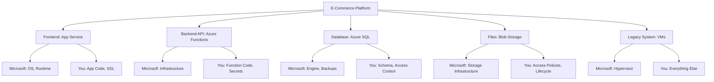

# Azure Fundamentals & Architecture

Before diving into specific services, you need to understand **how Azure works**, its global infrastructure, and the architectural principles that guide every decision you'll make as a cloud engineer.


> [!TIP]
> **Jargon Alert: Data Residency**
> The physical location where your data is stored. Some countries (like Germany or China) have strict laws requiring citizen data to never leave the country's borders.

> [!WARNING]
> **Gotcha: Region Availability**
> Not all Azure services are available in all regions. Always check the "Azure Products by Region" page before architecting a solution, especially for newer services.

---

## 1. The Shared Responsibility Model

The foundation of cloud computing rests on understanding **where Microsoft's responsibility ends and yours begins**.

### The Three Service Models

<Tabs>
  <Tab title="IaaS (VMs)">
    **Infrastructure as a Service**

    ```
    Microsoft Manages:
    ✓ Physical datacenter
    ✓ Physical network
    ✓ Physical hosts
    ✓ Hypervisor

    You Manage:
    ✓ Operating System
    ✓ Applications
    ✓ Data
    ✓ Network configuration (NSGs)
    ✓ Identity and access
    ✓ Patching and updates
    ```

    **Example**: Azure Virtual Machines
    - You're responsible for OS patches, antivirus, application updates
    - Microsoft ensures the physical hardware and hypervisor are secure
  </Tab>

  <Tab title="PaaS (App Service)">
    **Platform as a Service**

    ```
    Microsoft Manages:
    ✓ Everything in IaaS +
    ✓ Operating System
    ✓ Middleware/Runtime
    ✓ Patching and updates

    You Manage:
    ✓ Applications
    ✓ Data
    ✓ Network configuration
    ✓ Identity and access
    ```

    **Example**: Azure App Service, Azure SQL Database
    - Microsoft patches the OS and database engine
    - You configure firewall rules and manage access control
  </Tab>

  <Tab title="SaaS (Office 365)">
    **Software as a Service**

    ```
    Microsoft Manages:
    ✓ Everything except:

    You Manage:
    ✓ Data
    ✓ User access
    ✓ Devices
    ✓ Information protection
    ```

    **Example**: Microsoft 365, Dynamics 365
    - Microsoft runs everything
    - You control who has access and what data they can see
  </Tab>
</Tabs>

### Real-World Example: E-Commerce Application

Let's say you're building an e-commerce platform. Here's how responsibility splits:



<Warning>
**Common Misconception #1**: "Microsoft backs up my data automatically"

**Reality**:
- ✅ Azure SQL: Yes, automatic backups (7-35 days retention)
- ❌ VMs: No automatic backup (you must configure Azure Backup)
- ❌ Blob Storage: Replication ≠ Backup (deleted files replicate deletion)

**Lesson**: Always verify backup strategy for each service.
</Warning>

<Warning>
**Common Misconception #2**: "PaaS means I don't worry about security"

**Reality**:
- Microsoft secures the **platform**
- You secure your **application** (SQL injection, XSS, etc.)
- You manage **access** (authentication, authorization)
- You configure **firewall rules** and network isolation

**Real Incident**:
```
Company deployed web app on App Service
Assumed "PaaS = secure"
Never implemented input validation
SQL injection vulnerability exploited
Database compromised

Root Cause: Application security is YOUR responsibility, always
```
</Warning>

### Best Practice: RACI Matrix

For every Azure service you use, document:

| Task | You | Microsoft | Notes |
|------|-----|-----------|-------|
| Physical security | I | R/A | Microsoft data centers |
| Database engine patches | I | R/A | Automatic updates |
| Database schema design | R/A | - | Your responsibility |
| TDE encryption | R/A | C | You enable, Microsoft provides |
| Firewall rules | R/A | - | Your network security |
| Performance tuning | R/A | C | Your queries, Microsoft provides tools |

**Legend**: R = Responsible, A = Accountable, C = Consulted, I = Informed

---

## 2. Azure Global Infrastructure

Azure operates in **60+ regions** worldwide—more than any other cloud provider. Understanding this geography is crucial for designing resilient, compliant, and performant systems.

### The Hierarchy: Geography → Region → Availability Zone

<div className="flex justify-center my-4">
  <div className="w-full max-w-4xl">
    ```mermaid
    graph TB
        A[Geography: United States] --> B[Region: East US]
        A --> C[Region: West US]
        A --> D[Region: Central US]

        B --> B1[AZ 1]
        B --> B2[AZ 2]
        B --> B3[AZ 3]

        C --> C1[AZ 1]
        C --> C2[AZ 2]
        C --> C3[AZ 3]

        style A fill:#0078D4
        style B fill:#50E6FF
        style C fill:#50E6FF
        style D fill:#50E6FF
    ```
  </div>
</div>

### Geography

A **Geography** is a discrete market that preserves data residency and compliance boundaries.

**Examples**:
- United States
- Europe
- Asia Pacific
- Australia
- Government (US Gov, China)

**Why it matters**:
- GDPR compliance requires data to stay in EU geography
- Healthcare data must stay in specific regions
- Government workloads require sovereign clouds

### Region

A **Region** is a set of datacenters deployed within a latency-defined perimeter, connected through a dedicated low-latency network.

**Key Characteristics**:
- Minimum 3 datacenters per region (for AZ support)
- Separated by at least **300 miles** from paired region
- Connected via Microsoft's private backbone (not public internet)

**Example Regions**:
- East US (Virginia)
- West Europe (Netherlands)
- Southeast Asia (Singapore)
- Australia East (New South Wales)

### Regional Pairs

Every region is paired with another region **within the same geography** for disaster recovery.

| Primary Region | Paired Region | Distance |
|---------------|---------------|----------|
| East US | West US | ~2,500 miles |
| North Europe (Ireland) | West Europe (Netherlands) | ~600 miles |
| Southeast Asia (Singapore) | East Asia (Hong Kong) | ~1,600 miles |

**Benefits of Regional Pairs**:

1. **Sequential Updates**: During platform updates, only one region in a pair is updated at a time
2. **Prioritized Recovery**: In a massive outage, one region from each pair gets priority
3. **Data Residency**: Pairs are in the same geography (compliance requirement)
4. **Replication**: Some services automatically replicate to paired region (GRS storage)

<Info>
**Pro Tip**: Always deploy production workloads across regional pairs for maximum resilience.
</Info>

### Availability Zones (AZs)

**Availability Zones** are physically separate datacenters within the same region.

**Characteristics**:
- **Minimum 3 AZs** per supported region
- **Independent** power, cooling, and networking
- **Connected** via high-speed private fiber (&lt;2ms latency)
- **Fault isolated**: Failure in one AZ doesn't affect others

<div className="flex justify-center my-4">
  <div className="w-full max-w-4xl">
    ```mermaid
    graph TB
        subgraph "Region: East US"
            AZ1[Availability Zone 1]
            AZ2[Availability Zone 2]
            AZ3[Availability Zone 3]
        end

        subgraph "AZ 1 Components"
            AZ1 --> DC1[Datacenter 1]
            DC1 --> P1[Power Grid 1]
            DC1 --> N1[Network Path 1]
        end

        subgraph "AZ 2 Components"
            AZ2 --> DC2[Datacenter 2]
            DC2 --> P2[Power Grid 2]
            DC2 --> N2[Network Path 2]
        end

        subgraph "AZ 3 Components"
            AZ3 --> DC3[Datacenter 3]
            DC3 --> P3[Power Grid 3]
            DC3 --> N3[Network Path 3]
        end

        AZ1 -.High-speed fiber.-> AZ2
        AZ2 -.High-speed fiber.-> AZ3
        AZ3 -.High-speed fiber.-> AZ1
    ```
  </div>
</div>

**Services Supporting AZs**:
- ✅ Virtual Machines (zone-redundant or zonal)
- ✅ Managed Disks (zone-redundant storage)
- ✅ Azure SQL Database (zone-redundant)
- ✅ AKS (Azure Kubernetes Service)
- ✅ Load Balancers (zone-redundant)

**Availability SLA**:
- Single VM (Premium SSD): **99.9%** uptime
- VMs across 2+ AZs: **99.99%** uptime
- VMs across regions: **99.999%** uptime (if you architect correctly)

### Sovereign Clouds

Azure operates **isolated clouds** for government and special requirements:

| Cloud | Purpose | Regions |
|-------|---------|---------|
| **Azure Government** | US federal, state, local governments | 8 regions (Virginia, Texas, Arizona, etc.) |
| **Azure China** | Operated by 21Vianet (not Microsoft) | 4 regions (Beijing, Shanghai, etc.) |
| **Azure Germany** | GDPR compliance (deprecated, use EU regions) | Migrated to EU |

---

## 3. Physical Infrastructure Deep Dive

Ever wonder what's inside an Azure datacenter? Let's peek behind the curtain.

### Datacenter Architecture

A typical Azure datacenter contains:
- **50,000 - 80,000 servers** per datacenter
- **10-20 MW power** capacity per datacenter
- **20-40 acres** of space
- **PUE (Power Usage Effectiveness)**: ~1.18 (industry-leading efficiency)

### Scale and Numbers

<CardGroup cols={2}>
  <Card title="Total Servers" icon="server">
    **4+ million servers** globally across all Azure datacenters
  </Card>
  <Card title="Network Capacity" icon="network-wired">
    **>200 Tbps** inter-region backbone capacity
  </Card>
  <Card title="Storage" icon="database">
    **1+ exabyte** of storage capacity deployed
  </Card>
  <Card title="Power" icon="bolt">
    **>1 GW** total power consumption (equivalent to a small city)
  </Card>
</CardGroup>

### Power and Cooling

**Power Strategy**:
```
Primary Power Source
    ↓
Utility Grid (99.9% uptime)
    ↓ (if failure)
Diesel Generators (activate in &lt;10 seconds)
    ↓ (while generators start)
UPS Systems (battery backup for 5-10 minutes)
```

**Cooling Innovations**:
- **Free cooling**: Using outside air when temperature permits (60-70% of the time)
- **Adiabatic cooling**: Evaporative cooling using water mist
- **Two-phase immersion cooling**: Servers submerged in liquid (experimental)
- **Project Natick**: Underwater datacenters (better cooling, renewable energy)

<Tip>
**Fun Fact**: Azure's underwater datacenter (Project Natick) ran for 2 years submerged off Scotland's coast. Results showed **8x fewer failures** than land-based datacenters due to controlled environment and absence of oxygen/humidity.
</Tip>

### Security Layers

Azure datacenters have **physical security** that rivals military facilities:

```
Layer 1: Perimeter
- 10-foot walls with barbed wire
- Security guards 24/7
- Vehicle barriers

Layer 2: Facility Entry
- Biometric access (hand geometry scanners)
- Security checkpoints
- Man-traps (doors that prevent tailgating)

Layer 3: Datacenter Floor
- Additional biometric authentication
- Video surveillance
- Motion detectors

Layer 4: Server Racks
- Locked racks
- Individual server lockdown
- Tamper-evident seals

Layer 5: Data Destruction
- Drives are shredded (not resold)
- Multi-step data destruction process
- Certificates of destruction
```

---

## 4. Design Principles: CAP Theorem

The **CAP Theorem** is fundamental to understanding distributed systems and how Azure services are designed.

### CAP Theorem Explained

<Tabs>
  <Tab title="Consistency">
    **Consistency**: All nodes see the same data at the same time

    After a write completes, all subsequent reads return the updated value.

    **Example**: Banking transactions
    - You withdraw $100 from ATM
    - Your balance must immediately reflect this across all systems
    - Wrong balance = customer overdraft
  </Tab>

  <Tab title="Availability">
    **Availability**: Every request receives a response (success or failure)

    The system remains operational even if some nodes fail.

    **Example**: Social media feed
    - User posts a status update
    - System acknowledges immediately
    - Post appears eventually (slight delay OK)
  </Tab>

  <Tab title="Partition Tolerance">
    **Partition Tolerance**: System continues despite network failures

    The system operates even when network messages are lost or delayed.

    **Example**: Multi-region deployment
    - Network between US and Europe fails
    - Both regions continue serving requests
    - Data syncs when connection restored
  </Tab>
</Tabs>

### The Fundamental Truth

<Warning>
**You can only pick 2 out of 3**

Since network failures WILL happen (partition tolerance is mandatory), you must choose:
- **CP**: Consistency + Partition Tolerance (sacrifice availability)
- **AP**: Availability + Partition Tolerance (sacrifice consistency)
</Warning>

### CP Systems: Consistency + Partition Tolerance

**Philosophy**: "Better to return an error than wrong data"

**Azure SQL Database is CP**:

```
Write Operation Flow:

1. Client writes to Primary Replica
2. Primary writes to transaction log
3. Primary replicates to Secondary Replicas (synchronous)
4. Waits for acknowledgment from majority (quorum)
5. Only then commits transaction
6. Returns success to client

If Network Partition Occurs:
❌ Can't reach secondaries
❌ Transaction is BLOCKED
❌ Client receives error
✅ System remains consistent
```

**When to Use CP**:
- Banking transactions (wrong balance = business failure)
- Inventory management (can't oversell items)
- Booking systems (seats, tickets, hotel rooms)
- Any scenario where correctness > availability

**Azure CP Services**:
- Azure SQL Database
- PostgreSQL/MySQL
- SQL Managed Instance

### AP Systems: Availability + Partition Tolerance

**Philosophy**: "Better to return slightly stale data than no data"

**Cosmos DB is AP** (with tunable consistency):

```
Write Operation Flow (Eventual Consistency):

1. Client writes to nearest region
2. Region acknowledges IMMEDIATELY (&lt;10ms)
3. Asynchronous replication to other regions
4. Client continues (doesn't wait)

If Network Partition Occurs:
✅ All regions continue operating independently
✅ Each region serves requests
⚠️  Data temporarily inconsistent
✅ When partition heals, data converges
```

**When to Use AP**:
- Social media feeds (brief staleness OK)
- Product catalogs (price updates can be delayed)
- User profiles (minor delays acceptable)
- Telemetry/analytics data

**Azure AP Services**:
- Cosmos DB (Eventual/Session consistency)
- Azure Cache for Redis (replication is async)
- Table Storage

### Cosmos DB: Five Consistency Levels

Cosmos DB uniquely offers a **spectrum** between CP and AP:

<AccordionGroup>
  <Accordion title="1. Strong Consistency (CP-like)" icon="lock">
    **Guarantee**: Read always returns latest write

    **Latency**: Highest (wait for all regions)

    **Use Case**: Banking, critical financial data

    **Trade-off**: Lower throughput, higher cost (2x RU consumption)
  </Accordion>

  <Accordion title="2. Bounded Staleness" icon="clock">
    **Guarantee**: Read lags by max K versions or T time

    **Example**: Data is max 10 seconds old or 1000 versions behind

    **Use Case**: Stock prices, metrics with acceptable lag

    **Trade-off**: Medium latency
  </Accordion>

  <Accordion title="3. Session Consistency (Most Popular)" icon="user">
    **Guarantee**: Within a session, you read your own writes

    **Why Popular (80% of customers use this)**:
    - User sees their own changes immediately
    - Other users see changes eventually
    - Perfect UX/performance balance

    **Use Case**: Shopping carts, user profiles, most web apps

    **Example**:
    ```
    User A updates profile picture
      → Sees new picture immediately
    User B viewing User A's profile
      → Sees new picture within 100-500ms
    ```
  </Accordion>

  <Accordion title="4. Consistent Prefix" icon="list-ol">
    **Guarantee**: Never see out-of-order writes

    **Use Case**: Chat messages, activity feeds, audit logs

    **Example**:
    ```
    Messages: A → B → C
    ✅ You might see: A or A,B or A,B,C
    ❌ You'll never see: B,A or C,B,A
    ```
  </Accordion>

  <Accordion title="5. Eventual Consistency (AP)" icon="infinity">
    **Guarantee**: Eventually all replicas converge

    **Latency**: Lowest (&lt;5ms writes)

    **Use Case**: View counts, likes, analytics

    **Trade-off**: Highest throughput, lowest cost
  </Accordion>
</AccordionGroup>

### Real-World Decision Framework

```
Question 1: Can stale data cause correctness issues?
├─ Yes → Strong or Bounded Staleness
└─ No → Session, Consistent Prefix, or Eventual

Question 2: Must users see their own writes immediately?
├─ Yes → Session or stronger
└─ No → Consistent Prefix or Eventual

Question 3: Must events be ordered?
├─ Yes → Consistent Prefix or stronger
└─ No → Eventual

Question 4: Geographic distribution?
├─ Single region → Strong (low latency cost)
├─ Multi-region, high traffic → Session
└─ Multi-region, highest traffic → Eventual
```

### Example: E-Commerce Architecture

```
Product Catalog:
Service: Cosmos DB
Consistency: Eventual
Why: High read volume, slight staleness OK
SLA: 99.99% availability

Shopping Cart:
Service: Cosmos DB
Consistency: Session
Why: User must see their own cart immediately
SLA: 99.99% availability

Inventory (during checkout):
Service: Cosmos DB
Consistency: Bounded Staleness (5 seconds)
Why: Can tolerate small overselling window
SLA: 99.99% availability

Order Processing:
Service: Azure SQL
Consistency: Strong (ACID)
Why: Financial correctness required
SLA: 99.995% availability

Analytics Dashboard:
Service: Synapse Analytics
Consistency: Eventual
Why: Approximate data sufficient for reports
SLA: 99.9% availability
```

---

## 5. The Principle of Least Privilege

**Every user, service, and application should have ONLY the minimum permissions necessary.**

### Why Least Privilege Matters

<Tabs>
  <Tab title="Scenario 1: Excessive Privileges">
    **Developer has Owner role on subscription**

    Account compromised (phished):
    ```
    ❌ Attacker has subscription-wide access
    ❌ Can delete ALL resources
    ❌ Can exfiltrate ALL data
    ❌ Can create backdoor admin accounts
    ❌ Blast radius: ENTIRE SUBSCRIPTION

    Recovery: Days to weeks
    Cost: Millions
    ```
  </Tab>

  <Tab title="Scenario 2: Least Privilege">
    **Developer has Contributor on Dev resource group only**

    Account compromised:
    ```
    ✅ Attacker limited to dev resources
    ✅ Cannot access production
    ✅ Cannot delete subscription
    ✅ Blast radius: Single resource group

    Recovery: Hours
    Cost: Minimal
    ```
  </Tab>
</Tabs>

<Warning>
**Real Incident: Capital One Breach (2019)**

**Root Cause**: Overly permissive IAM role
- EC2 instance had role to list ALL S3 buckets
- Should have been scoped to specific buckets only
- Attacker gained access to instance
- Exfiltrated 100 million customer records

**Lesson**: Limit permissions to minimum required
**Cost**: $80 million settlement
</Warning>

### Azure RBAC Fundamentals

**Role Assignment = Principal + Role + Scope**

<div className="flex justify-center my-4">
  <div className="w-full max-w-4xl">
    ```mermaid
    graph LR
        A[Security Principal] -->|assigned| B[Role Definition]
        B -->|at| C[Scope]

        A --> A1[User]
        A --> A2[Group]
        A --> A3[Service Principal]
        A --> A4[Managed Identity]

        B --> B1[Owner]
        B --> B2[Contributor]
        B --> B3[Reader]
        B --> B4[Custom]

        C --> C1[Management Group]
        C --> C2[Subscription]
        C --> C3[Resource Group]
        C --> C4[Resource]
    ```
  </div>
</div>

### Built-in Roles

```
Owner
├── All permissions
├── Can assign roles to others
├── Full control
└── Use: Very few users (subscription admins)

Contributor
├── Create, modify, delete resources
├── CANNOT assign roles
├── Cannot manage access
└── Use: Developers in dev/test

Reader
├── View resources only
├── Cannot modify
├── Cannot view secrets
└── Use: Auditors, stakeholders

Specialized Roles:
├── Virtual Machine Contributor (VMs only)
├── Storage Blob Data Contributor (blob data only)
├── Key Vault Secrets Officer (secrets only)
└── SQL DB Contributor (databases only)
```

### Scope Hierarchy

```
Management Group (highest level)
  ↓ inherits permissions
Subscription
  ↓ inherits permissions
Resource Group
  ↓ inherits permissions
Resource (lowest level)

Permissions accumulate downward
Child scopes inherit parent permissions
Cannot override parent (only add)
```

**Example**:
```
User Alice:
- Reader at Subscription level
- Contributor at "Dev" Resource Group level

Result:
✅ Can view all resources in subscription
✅ Can modify resources in Dev RG only
❌ Cannot modify resources in Prod RG
```

---

## 6. Hands-On Lab: Deploy Your First Resource

Let's put theory into practice. We'll deploy a simple web application using the Azure Portal and Azure CLI.

### Lab Prerequisites

- Azure account (free tier works)
- Azure CLI installed (or use Azure Cloud Shell)
- Basic command-line knowledge

### Step 1: Create a Resource Group

**Via Azure Portal**:
1. Navigate to portal.azure.com
2. Search for "Resource Groups"
3. Click "+ Create"
4. Fill in:
   - Subscription: Your subscription
   - Resource group: `rg-demo-dev`
   - Region: `East US`
5. Click "Review + Create" → "Create"

**Via Azure CLI**:
```bash
az group create \
  --name rg-demo-dev \
  --location eastus \
  --tags Environment=Dev Project=Demo
```

### Step 2: Deploy an App Service

```bash
# Create App Service Plan (hosting environment)
az appservice plan create \
  --name plan-demo-dev \
  --resource-group rg-demo-dev \
  --sku F1 \
  --is-linux

# Create Web App
az webapp create \
  --name webapp-demo-${RANDOM} \
  --resource-group rg-demo-dev \
  --plan plan-demo-dev \
  --runtime "NODE|18-lts"

# Deploy sample code
az webapp deployment source config \
  --name webapp-demo-${RANDOM} \
  --resource-group rg-demo-dev \
  --repo-url https://github.com/Azure-Samples/nodejs-docs-hello-world \
  --branch master \
  --manual-integration

# Get the URL
az webapp show \
  --name webapp-demo-${RANDOM} \
  --resource-group rg-demo-dev \
  --query defaultHostName \
  --output tsv
```

### Step 3: Verify Deployment

Visit the URL from the last command. You should see "Hello World!"

### Step 4: View Logs

```bash
# Stream live logs
az webapp log tail \
  --name webapp-demo-${RANDOM} \
  --resource-group rg-demo-dev
```

### Step 5: Clean Up

```bash
# Delete everything
az group delete \
  --name rg-demo-dev \
  --yes \
  --no-wait
```

<Warning>
**Cost Alert**: Always delete resources after labs to avoid charges!
</Warning>

---

## 7. Interview Questions

### Beginner Level

<AccordionGroup>
  <Accordion title="Q1: What is the difference between a region and an availability zone?">
    **Answer**:

    **Region**: A geographic area containing multiple datacenters (minimum 3). Each region is separated by hundreds of miles from its paired region.

    **Availability Zone**: Physically separate datacenters within the same region, each with independent power, cooling, and networking. Connected via high-speed private fiber (&lt;2ms latency).

    **Analogy**: Region = City, Availability Zone = Different buildings in that city
  </Accordion>

  <Accordion title="Q2: Explain the shared responsibility model for PaaS">
    **Answer**:

    In PaaS (like Azure App Service):
    - **Microsoft manages**: Physical infrastructure, OS, runtime, patching
    - **You manage**: Application code, data, access control, network configuration

    **Example**: With Azure SQL Database, Microsoft patches the database engine, but you're responsible for designing the schema, managing firewall rules, and securing data access.
  </Accordion>

  <Accordion title="Q3: What is the purpose of regional pairs?">
    **Answer**:

    Regional pairs provide:
    1. **Sequential updates**: Only one region updated at a time (no double outage)
    2. **Disaster recovery**: One region prioritized for recovery in massive outage
    3. **Data residency**: Both regions in same geography (compliance)
    4. **Auto-replication**: Some services (GRS storage) replicate to paired region

    **Example**: East US is paired with West US (2,500 miles apart)
  </Accordion>
</AccordionGroup>

### Intermediate Level

<AccordionGroup>
  <Accordion title="Q4: Design a highly available web application. What Azure services would you use?">
    **Answer**:

    ```
    Architecture:
    1. Azure Front Door (global load balancer)
       └─> Multiple regions (active-active)

    2. Per-region deployment:
       - Azure Application Gateway (regional LB)
       - App Service with Availability Zones
       - Azure SQL with zone-redundancy
       - Redis Cache (zone-redundant)

    3. Data layer:
       - Azure SQL with geo-replication
       - Blob Storage with GRS (geo-redundant)

    4. Monitoring:
       - Application Insights (distributed tracing)
       - Azure Monitor (alerts)

    SLA Calculation:
    - App Service (AZ): 99.95%
    - Azure SQL (zone-redundant): 99.995%
    - Combined: 99.945% ≈ 4.8 hours downtime/year
    ```
  </Accordion>

  <Accordion title="Q5: When would you choose Cosmos DB over Azure SQL?">
    **Answer**:

    **Choose Cosmos DB when**:
    - Global distribution required (multi-region writes)
    - Massive scale (>1TB, millions RPS)
    - Low latency required (&lt;10ms reads)
    - Schema flexibility needed (NoSQL)
    - Tunable consistency acceptable

    **Choose Azure SQL when**:
    - ACID transactions required
    - Complex queries with JOINs
    - Strong consistency mandatory
    - Existing SQL code/expertise
    - Cost-sensitive (Cosmos DB more expensive)

    **Hybrid Approach**: Use both
    - Azure SQL for transactional data (orders)
    - Cosmos DB for high-scale reads (product catalog)
  </Accordion>
</AccordionGroup>

### Advanced Level

<AccordionGroup>
  <Accordion title="Q6: You have a global application with users in US, Europe, and Asia. A network partition occurs between US and Europe. How do you design for this?">
    **Answer**:

    **Strategy**: Active-Active Multi-Region with Conflict Resolution

    ```
    1. Architecture:
       - Cosmos DB with multi-region writes
       - Session consistency per region
       - Conflict resolution policy (Last Write Wins or Custom)

    2. During Partition:
       - US region serves US users independently
       - EU region serves EU users independently
       - Writes go to local region (no cross-region dependency)

    3. When Partition Heals:
       - Cosmos DB automatically reconciles conflicts
       - Use LWW (Last Write Wins) for simple cases
       - Use custom merge logic for complex scenarios

    4. Trade-offs:
       ✅ Always available (no downtime)
       ⚠️  Eventual consistency (conflicts possible)
       ✅ Low latency (local writes)
       ❌ Higher cost (multi-region writes)

    5. Alternative (CP approach):
       - Use Azure SQL with readable secondaries
       - Accept downtime during partition
       - Manual failover when needed
       ✅ Strong consistency
       ❌ Downtime during partition
    ```
  </Accordion>

  <Accordion title="Q7: A developer accidentally deleted production resources. How do you prevent this?">
    **Answer**:

    **Defense in Depth Strategy**:

    ```
    Layer 1: RBAC (Principle of Least Privilege)
    - Developers: Contributor on Dev RG only
    - Ops: Contributor on Prod (with conditions)
    - No one has Owner except 2-3 admins

    Layer 2: Resource Locks
    - Apply CanNotDelete lock on production RGs
    - Apply ReadOnly lock on critical resources
    - Locks require Owner role to remove

    Layer 3: Azure Policy
    - Deny deletion during business hours
    - Require approval for prod changes
    - Enforce tagging (Environment=Production)

    Layer 4: Privileged Identity Management (PIM)
    - Just-in-Time access elevation
    - Time-limited (2-4 hours)
    - Approval workflow required
    - All actions audited

    Layer 5: Monitoring & Alerts
    - Alert on any deletion in production
    - Alert on role assignments
    - Log Analytics query: AzureActivity | where OperationName contains "Delete"

    Layer 6: Backup & Recovery
    - Azure Backup for VMs (daily)
    - Soft delete for SQL/Cosmos (30 days)
    - GRS storage (geo-replicated)
    - Test restore procedures monthly

    Layer 7: Infrastructure as Code
    - All resources in Terraform/Bicep
    - Can recreate environment from code
    - Version controlled in Git
    ```
  </Accordion>
</AccordionGroup>

---

## 8. Key Takeaways

<CardGroup cols={2}>
  <Card title="Shared Responsibility" icon="handshake">
    Understand where Microsoft's responsibility ends and yours begins. Data is ALWAYS your responsibility.
  </Card>
  <Card title="Global Infrastructure" icon="globe">
    Leverage regions, AZs, and regional pairs for resilience. Always deploy production across multiple AZs.
  </Card>
  <Card title="CAP Theorem" icon="triangle-exclamation">
    Choose CP (consistency) for financial systems, AP (availability) for social media. Cosmos DB offers a spectrum.
  </Card>
  <Card title="Least Privilege" icon="shield-halved">
    Grant minimum permissions needed. Use groups, managed identities, and JIT access.
  </Card>
  <Card title="Design for Failure" icon="exclamation-triangle">
    Assume everything will fail. Build redundancy, implement retries, and test disaster recovery.
  </Card>
  <Card title="Automate Everything" icon="robot">
    Use Infrastructure as Code. Manual changes lead to configuration drift and errors.
  </Card>
</CardGroup>

---

## Next Steps

Now that you understand Azure's architecture and design principles, you're ready to dive into **Identity & Access Management** in Chapter 2.

You'll learn:
- Azure Active Directory deep dive
- RBAC implementation strategies
- Conditional Access policies
- Privileged Identity Management
- Managed Identities for secure service authentication

<Card title="Continue to Chapter 2" icon="arrow-right" href="/courses/azure-cloud-engineering/02-identity-access-management">
  Master Azure AD, RBAC, and zero-trust security architecture
</Card>
