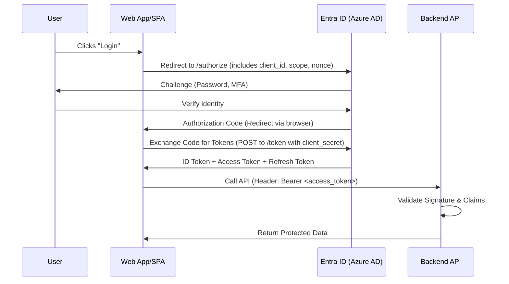

# Identity & Access Management

Identity is the **new security perimeter**. In the cloud, your identity system is more important than your firewall. Master Azure Active Directory (Azure AD) and you master Azure security.


---

## What You'll Learn

By the end of this chapter, you'll understand:
- What identity and access management actually means (from absolute basics)
- Why identity is the "new perimeter" in cloud security
- How authentication and authorization work (with real examples)
- Azure Active Directory fundamentals and architecture
- Role-Based Access Control (RBAC) from scratch
- Multi-Factor Authentication (MFA) and conditional access
- When and how to use different authentication methods

---

## Introduction: What is Identity & Access Management? (Start Here if You're New)

### The Simple Explanation

**Identity & Access Management (IAM) = Controlling WHO can do WHAT**

Think of it like your house:
- **Identity** = Keys (prove who you are)
- **Access Management** = Locks on different rooms (control what you can access)

### Real-World Analogy: Office Building Security

**Before entering an office building:**

```
Step 1: Identity (Prove who you are)
├── Show your employee badge (authentication)
├── Security guard checks photo matches your face
└── Badge has your name and employee ID

Step 2: Access (What can you do)
├── Badge gives access to certain floors only
├── Your floor: Marketing (5th floor) ✅
├── Other floors: Engineering (3rd floor) ❌
├── CEO's office: ❌ (even though you're on same floor)
└── Conference rooms: ✅ (shared access)

Result:
- You proved WHO you are (identity)
- System knows WHAT you can access (permissions)
```

**This is exactly how Azure IAM works:**
- Your username/password = Employee badge (proves identity)
- Azure AD = Security system (manages identities)
- RBAC = Floor/room access rules (manages permissions)

### Why Does Identity Matter in the Cloud?

**Old Security Model (2005): Castle and Moat**
```
Your Company Network (The Castle):
├── Firewall (The Moat) → Strong perimeter defense
├── Inside the network → Everyone trusted
└── Outside the network → Everyone blocked

Problem:
- Once attacker gets inside → They have access to everything
- Employees work from home → How do they get "inside"?
- SaaS apps (Office 365, Salesforce) → Outside your network!
```

**Modern Security Model (2025): Zero Trust**
```
Assume NOTHING is trusted:
├── Inside network ≠ Trusted
├── Every request requires authentication
├── Every action requires authorization
└── Identity is the new perimeter

Result:
- Attacker steals one password → Only accesses what that user can access
- Employee works from home → Uses identity to access (no VPN needed)
- SaaS apps → Use identity federation (single sign-on)
```

**Why This Matters:**
In the cloud, there is NO "inside" or "outside" network. Your app might run in Azure, your data might be in Office 365, your users might be anywhere in the world. **Identity** is the ONLY way to control access.

### Authentication vs Authorization (The Most Confused Concepts)

People mix these up constantly. Here's the clear difference:

**Authentication = Proving WHO you are**
```
Question: "Are you really Alice?"
Methods:
- Password: Something you know
- Phone code: Something you have
- Fingerprint: Something you are

Result: Yes, you are Alice ✅
```

**Authorization = What are you ALLOWED to do**
```
Question: "What can Alice do?"
Check permissions:
- Can Alice read this file? ✅
- Can Alice delete this database? ❌
- Can Alice create VMs? ✅

Result: Alice can do X, Y, Z but not A, B, C
```

**Real-World Example: Bank**

**Authentication (Proving identity):**
```
You walk into a bank
Bank teller asks:
1. "What's your account number?" (something you know)
2. "Show me your driver's license" (something you have)
3. "Sign here" (something you are - handwriting)

You prove you ARE account holder #12345 ✅
```

**Authorization (What you can do):**
```
Now that bank knows you're account holder #12345:
- Withdraw from YOUR account: ✅
- Withdraw from SOMEONE ELSE'S account: ❌
- Access YOUR safe deposit box: ✅
- Access the bank vault: ❌

Your identity determines your permissions
```

**In Azure:**

**Authentication:**
```
User: alice@company.com
Password: ********
MFA code from phone: 123456

Azure AD verifies: Yes, this is Alice ✅
```

**Authorization (RBAC):**
```
Check what Alice can do:
- Read resources in resource group "dev": ✅
- Create VMs in resource group "dev": ✅
- Delete resources in resource group "prod": ❌
- Read billing information: ❌

Azure RBAC enforces these permissions
```

### The Problem IAM Solves

**Scenario: Company with 100 employees using Azure**

**Without Proper IAM (Chaos):**
```
Problems:
1. Everyone shares one admin password
   - Password leaked → Everyone compromised
   - Someone leaves company → Must change password for everyone

2. No audit trail
   - Database deleted → Who did it? No idea
   - Compliance audit → Can't prove who accessed what

3. Too much access
   - Junior dev has same access as CTO
   - Intern can delete production database
   - Contractor can see payroll data

4. Manual management
   - New employee → Manually grant 20 permissions
   - Employee changes role → Manually update permissions
   - Employee leaves → Manually revoke access (if you remember!)

Result: Security nightmare, compliance failure, eventual data breach
```

**With Proper IAM (Controlled):**
```
Solutions:
1. Each person has unique identity
   - alice@company.com (Developer)
   - bob@company.com (DBA)
   - charlie@company.com (Intern)
   - Password leaked → Only one account compromised

2. Complete audit trail
   - Database deleted → Logs show: bob@company.com at 2:45 PM
   - Compliance audit → Full report of who accessed what and when

3. Principle of least privilege
   - Developers: Can deploy to dev environment ✅
   - Developers: Cannot access production ❌
   - DBAs: Can access databases ✅
   - DBAs: Cannot create VMs ❌
   - Interns: Read-only access to dev ✅

4. Automated management
   - New employee → Assign to "Developers" group → Auto-gets all permissions
   - Role change → Change group membership → Permissions auto-update
   - Employee leaves → Disable account → All access revoked instantly

Result: Secure, compliant, auditable, scalable
```

### Cost of Poor IAM: Real Breach Example

**Capital One Data Breach (2019):**
```
What Happened:
- Former employee had excessive permissions
- Used those permissions to access 100 million customer records
- Downloaded credit card applications, social security numbers

Root Cause:
- Overly permissive IAM policies
- No principle of least privilege
- Poor access review processes

Cost:
- $80 million fine from regulators
- $190 million settlement to customers
- Reputation damage (priceless)

Total: $270+ million

Prevention Cost:
- Proper IAM implementation: ~$100,000
- Regular access reviews: ~$20,000/year
- ROI: 2,700x return on investment (preventing $270M loss)
```

### The Four Key Questions of IAM

Every IAM system answers these questions:

**1. Who are you? (Authentication)**
```
Methods:
- Username + Password (something you know)
- MFA code from phone (something you have)
- Biometric (something you are)
- Certificate (something you possess)

Result: Identity verified ✅
```

**2. What can you do? (Authorization)**
```
Permissions:
- Role: Developer
- Resources: resource-group-dev
- Actions: Can create, read, update (not delete)

Result: Permissions defined ✅
```

**3. Are you still allowed? (Conditional Access)**
```
Checks:
- Is your device managed? ✅
- Are you in a trusted location? ✅
- Is it normal hours? ✅
- Is there suspicious activity? ❌ → Block

Result: Access granted or denied based on context
```

**4. What did you do? (Auditing)**
```
Logs:
- alice@company.com
- Created VM "web-server-01"
- In resource group "production"
- At 2024-01-22 14:32:05 UTC
- From IP: 203.0.113.42

Result: Complete audit trail ✅
```

### Identity in Azure: The Big Picture

```
Your Identity Journey in Azure:

Step 1: Identity Provider (Azure AD)
├── Stores all identities (users, groups, service principals)
├── Handles authentication (username/password, MFA)
└── Issues security tokens (proof of who you are)

Step 2: Access Control (Azure RBAC)
├── Defines roles (Reader, Contributor, Owner)
├── Assigns roles to identities
└── Enforces permissions (can you do this action?)

Step 3: Conditional Access (Azure AD Premium)
├── Evaluates context (location, device, risk)
├── Applies policies (allow, block, require MFA)
└── Adapts to threats (if risky login, require MFA)

Step 4: Auditing (Azure Monitor)
├── Logs all authentication attempts
├── Logs all actions taken
└── Provides compliance reports
```

### Common Mistakes Beginners Make

❌ **Mistake 1**: Sharing accounts
```
Bad:
- Team shares "admin@company.com" account
- Everyone knows the password

Why bad:
- No accountability (who made that change?)
- One compromise = everyone compromised
- Can't revoke access for one person
```
✅ **Correct**: Each person has unique identity

❌ **Mistake 2**: Giving everyone admin rights
```
Bad:
- "Making someone admin is easier than figuring out exact permissions"
- Everyone is Owner on everything

Why bad:
- Intern can delete production
- Contractor can see payroll
- Huge blast radius when account compromised
```
✅ **Correct**: Principle of least privilege (minimum permissions needed)

❌ **Mistake 3**: Never reviewing access
```
Bad:
- Grant permissions when needed
- Never remove them
- People accumulate permissions over years

Result:
- Former employee still has access (left 2 years ago!)
- Person changed roles but kept old permissions
- Service accounts no longer used but still active
```
✅ **Correct**: Regular access reviews (quarterly/annually)

❌ **Mistake 4**: No MFA
```
Bad:
- "Passwords are enough"
- "MFA is annoying"

Reality:
- 99.9% of account compromises use stolen passwords
- MFA blocks these attacks
```
✅ **Correct**: Require MFA for all users (especially admins)

### Decision Tree: Choosing Authentication Methods

```
Question 1: What type of identity?
├─ Human user → Continue to Question 2
└─ Application/Service → Use Managed Identity or Service Principal

Question 2: How sensitive is the access?
├─ Admin access → Require MFA + Conditional Access
├─ Regular access → Require MFA
└─ Read-only public data → Password only (acceptable)

Question 3: What authentication method?
├─ Passwordless options:
│   ├─ Windows Hello for Business (biometric)
│   ├─ FIDO2 security keys (hardware token)
│   └─ Microsoft Authenticator (push notification)
│
└─ Password + MFA:
    ├─ Authenticator app (best)
    ├─ SMS/Phone call (better than nothing)
    └─ Hardware token (most secure)

Question 4: Do you need conditional access?
├─ Require managed devices? → Azure AD Premium P1
├─ Require specific locations? → Azure AD Premium P1
├─ Block risky sign-ins? → Azure AD Premium P2
└─ Basic MFA only → Azure AD Free
```

---

## 1. Azure Active Directory Deep Dive

**Azure Active Directory (Azure AD)** is Microsoft's cloud-based identity and access management service. It's NOT the same as on-premises Active Directory.

### Azure AD vs Active Directory (AD DS)

| Feature | Azure AD | Active Directory (AD DS) |
|---------|----------|--------------------------|
| **Protocol** | SAML, OAuth 2.0, OpenID Connect | Kerberos, LDAP |
| **Structure** | Flat (no OUs or GPOs) | Hierarchical (OUs, GPOs) |
| **Authentication** | Cloud-native, MFA-enabled | On-premises, password-based |
| **Management** | REST API, PowerShell, Portal | ADUC, Group Policy |
| **Use Case** | Cloud applications, SaaS | On-premises domain services |
| **Federation** | Built-in SSO | Requires AD FS |

<Warning>
**Common Mistake**: Trying to use Azure AD like on-premises AD

Azure AD is **designed for modern authentication**:
- No LDAP queries (use Microsoft Graph API)
- Different mindset: API-first, cloud-first
</Warning>

> [!TIP]
> **Jargon Alert: Service Principal**
> Think of a **Service Principal** as a "user account for an application." Just like you have a username/password, an app needs an identity to log in.
>
> A **Managed Identity** is just a Service Principal that Azure creates and rotates the password for automatically. (Always use Managed Identities when possible!)

### Azure AD Architecture

<div className="flex justify-center my-4">
  <div className="w-full max-w-4xl">
    ```mermaid
    graph TB
        subgraph "Azure AD Tenant"
            A[Users] --> B[Azure AD]
            C[Groups] --> B
            D[Service Principals] --> B
            E[Managed Identities] --> B
        end

        B --> F[Azure Resources]
        B --> G[Office 365]
        B --> H[Third-Party SaaS]
        B --> I[Custom Apps]

        subgraph "Authentication Methods"
            B --> J[Password + MFA]
            B --> K[Passwordless: FIDO2]
            B --> L[Certificate-based]
            B --> M[Windows Hello]
        end

        style B fill:#0078D4
    ```
  </div>
</div>

### Azure AD Editions

<Tabs>
  <Tab title="Free">
    **Included with Azure subscription**

    Features:
    - User and group management
    - Basic security reports
    - Single Sign-On (SSO) to Azure, Office 365
    - Self-service password change
    - Device registration

    **Best for**: Small businesses, dev/test
  </Tab>

  <Tab title="Premium P1">
    **$6/user/month**

    Everything in Free, plus:
    - Conditional Access
    - Self-service password reset (SSPR)
    - Azure AD Connect Health
    - Dynamic groups
    - Group-based licensing

    **Best for**: Medium businesses, basic security requirements
  </Tab>

  <Tab title="Premium P2">
    **$9/user/month**

    Everything in P1, plus:
    - **Privileged Identity Management (PIM)**
    - **Identity Protection** (risk-based policies)
    - Access Reviews
    - Entitlement Management

    **Best for**: Enterprises, strict compliance requirements

    <Info>
    **Most enterprises use P2** for PIM alone. The ability to have just-in-time admin access is worth the cost.
    </Info>
  </Tab>
</Tabs>

---

## 2. Authentication Protocols

Understanding how Azure AD authenticates users is crucial for troubleshooting and designing secure applications.

### OAuth 2.0 & OpenID Connect: The Pro's Perspective

While basic diagrams show the flow, a cloud engineer needs to understand **what is inside the envelope**.

#### The Token Trinity

Azure AD issues three distinct types of tokens. Using the wrong one is a common security failure.

| Token | Purpose | Handled By | Typical Lifetime |
|-------|---------|------------|------------------|
| **ID Token** | Proves identity (OIDC) | Your Application | 1 hour |
| **Access Token** | Authorizes access | The Resource (API) | 1 hour |
| **Refresh Token** | Gets new tokens | Your Application | 90 days (rolling) |

> [!WARNING]
> **Security Gotcha: ID Token vs. Access Token**
> Never use an **ID Token** to authorize API calls. ID tokens are meant for your app to know "who logged in." Access tokens are meant for the API to know "what this user can do." If you send an ID token to a backend, you're bypassing authorization checks.

#### Anatomy of a JWT Token
Both ID and Access tokens are **JWT (JSON Web Tokens)**. They are Base64 encoded, not encrypted. Anyone who has the token can read it (using `jwt.ms`).

**Key Claims inside an Azure AD Token:**
- `aud` (Audience): The intended recipient of the token. If this doesn't match your app/API ID, **reject it**.
- `scp` (Scope): The permissions granted (e.g., `User.Read`).
- `roles`: The RBAC roles assigned to the user.
- `exp` (Expiry): When the token dies.
- `nonce`: Prevents replay attacks (essential for security).

#### OpenID Connect (OIDC) flow in Entra ID



> [!TIP]
> **Pro Tip: Managed Identities**
> If your application runs *inside* Azure (e.g., on a VM or App Service), use **Managed Identities**. You don't have to manage `client_id` or `client_secret` variables. Azure handles the token exchange securely in the background, eliminating the risk of leaking secrets in your code.

### SAML 2.0

**SAML** is the older protocol, still widely used for enterprise SSO.

<Tabs>
  <Tab title="When to use SAML">
    - Enterprise SSO to legacy apps
    - Applications that don't support OAuth/OIDC
    - Compliance requirements (some regulations mandate SAML)
  </Tab>

  <Tab title="When to use OIDC/OAuth">
    - Modern web/mobile applications
    - API access
    - Single Page Applications (SPAs)
    - Better developer experience
  </Tab>
</Tabs>

---

## 3. Multi-Factor Authentication (MFA)

**MFA is non-negotiable**. Passwords alone are compromised in 80% of breaches.

### MFA Methods in Azure AD

<CardGroup cols={2}>
  <Card title="Microsoft Authenticator" icon="mobile">
    **Best method** (push notification or code)

    - Passwordless authentication supported
    - Number matching (prevents MFA fatigue)
    - Risk-based authentication
  </Card>

  <Card title="FIDO2 Security Keys" icon="key">
    **Most secure** (hardware token)

    - Phishing-resistant
    - Passwordless
    - Hardware-based cryptography
  </Card>

  <Card title="SMS / Voice Call" icon="phone">
    **Least secure** (avoid if possible)

    - Vulnerable to SIM swapping
    - SMS interception
    - Use only as backup
  </Card>

  <Card title="OATH Hardware Tokens" icon="shield">
    **Enterprise standard**

    - YubiKey, RSA tokens
    - Time-based codes
    - No network required
  </Card>
</CardGroup>

### Conditional Access + MFA

**Don't require MFA for everyone, everywhere**. Use Conditional Access for smart MFA:

```
Policy: Smart MFA
Conditions:
  - User is NOT on corporate network
  - User accessing from unknown device
  - Sign-in risk: Medium or High

Actions:
  - Require MFA
  - Require compliant device
```

**Real-World Example**:
```
Scenario 1: Office Network
User: alice@company.com
Location: Corporate network (trusted IP)
Device: Company laptop (Intune-managed)
Action: ✅ No MFA required (trusted environment)

Scenario 2: Home Network
User: alice@company.com
Location: Home (untrusted)
Device: Personal laptop
Action: ⚠️  Require MFA

Scenario 3: Coffee Shop
User: alice@company.com
Location: Public WiFi (untrusted)
Device: Personal phone
Risk: High (Azure AD detects anomaly)
Action: ❌ Block access OR require re-authentication + MFA
```

---

## 4. Role-Based Access Control (RBAC)

RBAC is how you control **who can do what** in Azure.

### The RBAC Formula

```
Who (Security Principal) + What (Role) + Where (Scope) = Permission
```

> [!WARNING]
> **Gotcha: RBAC Propagation Delay**
> After assigning an RBAC role, it can take **up to 30 minutes** for permissions to propagate across all Azure regions. If a user says "I still can't access it," they might just need to wait a few minutes and refresh their token (re-login).

<div className="flex justify-center my-4">
  <div className="w-full max-w-4xl">
    ```mermaid
    graph LR
        A[Security Principal] -->|assigned| B[Role Definition]
        B -->|at| C[Scope]
        C --> D[Permission Granted]

        A --> A1[User: alice@company.com]
        A --> A2[Group: Developers]
        A --> A3[Service Principal]
        A --> A4[Managed Identity]

        B --> B1[Owner]
        B --> B2[Contributor]
        B --> B3[Reader]
        B --> B4[VM Contributor]

        C --> C1[Subscription]
        C --> C2[Resource Group]
        C --> C3[Resource]
    ```
  </div>
</div>

### Built-in Roles Deep Dive

<AccordionGroup>
  <Accordion title="Owner" icon="crown">
    **Full control + can assign roles**

    Permissions:
    - All actions: `*`
    - Can grant access to others
    - Can delete resources

    **Use sparingly**: 2-3 subscription admins maximum

    ```json
    {
      "Name": "Owner",
      "Actions": ["*"],
      "NotActions": [],
      "DataActions": ["*"],
      "AssignableScopes": ["/"]
    }
    ```
  </Accordion>

  <Accordion title="Contributor" icon="user-pen">
    **Can create and manage resources, but NOT assign roles**

    Permissions:
    - All resource operations
    - CANNOT assign roles
    - CANNOT modify IAM

    **Use case**: Developers, operators

    **Important**: Contributor can still cause damage (delete resources)
  </Accordion>

  <Accordion title="Reader" icon="eye">
    **View-only access**

    Permissions:
    - Read all resources
    - CANNOT modify anything
    - CANNOT view secrets/keys

    **Use case**: Auditors, stakeholders, new team members
  </Accordion>

  <Accordion title="Specialized Roles" icon="briefcase">
    Azure has **300+ built-in roles** for specific services:

    **Compute**:
    - Virtual Machine Contributor
    - Virtual Machine Administrator Login
    - Disk Snapshot Contributor

    **Storage**:
    - Storage Blob Data Contributor
    - Storage Blob Data Reader
    - Storage Queue Data Contributor

    **Networking**:
    - Network Contributor
    - DNS Zone Contributor

    **Security**:
    - Key Vault Administrator
    - Security Admin
    - Security Reader

    **Best Practice**: Use specialized roles instead of Contributor when possible
  </Accordion>
</AccordionGroup>

### Scope Hierarchy & Inheritance

```
Management Group (org-wide policies)
    ↓ inherits
Subscription (billing boundary)
    ↓ inherits
Resource Group (lifecycle boundary)
    ↓ inherits
Resource (individual service)
```

**Inheritance Rules**:
- Permissions **accumulate** downward
- Child inherits parent permissions
- Cannot **remove** inherited permissions (only add)
- Explicit **Deny** doesn't exist in Azure RBAC (unlike AWS)

**Example**:
```bash
# Alice has these assignments:
# 1. Reader at Subscription level
# 2. Contributor at "Dev" Resource Group

# Effective permissions:
Subscription scope:
  ✅ Can view all resources
  ❌ Cannot modify anything

Dev Resource Group:
  ✅ Can view AND modify resources
  ✅ Can create new resources
  ❌ Cannot assign roles (not Owner)

✅ Can view resources (inherited from Subscription)
  ❌ Cannot modify (no Contributor role)
```

---

### RBAC vs. ABAC: Moving Beyond Roles

While RBAC is great for 90% of scenarios, large-scale enterprises often hit a "Role Explosion" problem—creating hundreds of custom roles for every tiny variation. This is where **Attribute-Based Access Control (ABAC)** comes in.

| Feature | RBAC (Role-Based) | ABAC (Attribute-Based) |
|---------|-------------------|----------------------|
| **Decision Factor** | Who you are (Role) | Key-Value pairs (Attributes/Tags) |
| **Logic** | "Bob is a Developer" | "User has Project=X" AND "Resource has Project=X" |
| **Flexibility** | Static | Dynamic |
| **Use Case** | Most Azure environments | Large-scale micro-segmentation |

#### How ABAC Works in Azure (Role Assignment Conditions)
In Azure, ABAC is implemented as **conditions** added to a standard Role Assignment.

**Example Scenario:**
You want to allow developers to delete blobs in Storage, but ONLY if the blob has a tag `Project=Phoenix`.

**RBAC Way**: Create a custom role for Project Phoenix? No, that's brittle.
**ABAC Way**:
1. Assign `Storage Blob Data Contributor` to the Developer group.
2. Add an **ABAC Condition**: `(Target Resource Tag 'Project' EQUAL TO 'Phoenix')`

> [!IMPORTANT]
> **Pro Tip: ABAC for Dev/Test**
> ABAC is extremely powerful for "Sandboxing." You can grant a user Contributor access to a whole subscription, but add an ABAC condition that they can only modify resources with a tag matching their own Username. This creates a "dynamic sandbox" without managing thousands of separate resource groups.

---

### Custom RBAC Roles

When built-in roles don't fit, create custom roles.

**Example: Database Administrator Role**

```json
{
  "Name": "SQL Database Administrator",
  "Description": "Manage SQL databases but not delete them",
  "Actions": [
    "Microsoft.Sql/servers/databases/read",
    "Microsoft.Sql/servers/databases/write",
    "Microsoft.Sql/servers/databases/backups/*",
    "Microsoft.Sql/servers/databases/auditingSettings/*",
    "Microsoft.Sql/servers/databases/securityAlertPolicies/*"
  ],
  "NotActions": [
    "Microsoft.Sql/servers/databases/delete"
  ],
  "AssignableScopes": [
    "/subscriptions/{subscription-id}"
  ]
}
```

**Creating Custom Role via CLI**:
```bash
az role definition create --role-definition @custom-role.json
```

**Best Practices for Custom Roles**:
1. Start with built-in role, copy and modify
2. Use least privilege (only required actions)
3. Test in dev before production
4. Document the purpose and use cases
5. Review quarterly (remove unused permissions)

---

## 5. Managed Identities

**Managed Identities** eliminate the need for credentials in code. This is **huge** for security.

### The Problem Managed Identities Solve

<Tabs>
  <Tab title="❌ Without Managed Identity">
    **The old way: Service Principal with secret**

    ```csharp
    // BAD: Credentials in code
    var credential = new ClientSecretCredential(
        tenantId: "00000000-0000-0000-0000-000000000000",
        clientId: "your-client-id",
        clientSecret: "your-secret-here" // 🚨 Secret in code!
    );

    var client = new BlobServiceClient(
        new Uri("https://storage.blob.core.windows.net"),
        credential
    );
    ```

    **Problems**:
    - ❌ Secret stored somewhere (code, config, Key Vault)
    - ❌ Secret can be stolen (Git commits, logs)
    - ❌ Must rotate secrets (manual process)
    - ❌ Secrets expire (app breaks)
    - ❌ Overhead managing secrets
  </Tab>

  <Tab title="✅ With Managed Identity">
    **The new way: No credentials at all**

    ```csharp
    // GOOD: No credentials needed!
    var credential = new DefaultAzureCredential();

    var client = new BlobServiceClient(
        new Uri("https://storage.blob.core.windows.net"),
        credential
    );

    // That's it! Azure handles authentication automatically
    ```

    **Benefits**:
    - ✅ No secrets in code
    - ✅ No secrets to rotate
    - ✅ Azure manages credentials
    - ✅ Automatic rotation
    - ✅ Cannot be stolen from code
  </Tab>
</Tabs>

### Types of Managed Identities

<CardGroup cols={2}>
  <Card title="System-Assigned" icon="link">
    **Tied to resource lifecycle**

    - Created when resource is created
    - Deleted when resource is deleted
    - One-to-one relationship
    - Cannot be shared

    **Use case**: Single VM accessing storage
  </Card>

  <Card title="User-Assigned" icon="users">
    **Independent lifecycle**

    - Created separately
    - Can be shared across resources
    - Survives resource deletion
    - Reusable

    **Use case**: Multiple VMs accessing same resources
  </Card>
</CardGroup>

### Hands-On: Enable Managed Identity

**Scenario**: VM needs to read from Key Vault

**Step 1: Enable Managed Identity on VM**
```bash
az vm identity assign \
  --name MyVM \
  --resource-group MyRG
```

**Step 2: Grant VM Access to Key Vault**
```bash
# Get VM's identity
IDENTITY=$(az vm identity show \
  --name MyVM \
  --resource-group MyRG \
  --query principalId \
  --output tsv)

# Grant access to Key Vault
az keyvault set-policy \
  --name MyVault \
  --object-id $IDENTITY \
  --secret-permissions get list
```

**Step 3: Access Key Vault from VM (no credentials!)**
```python
from azure.identity import DefaultAzureCredential
from azure.keyvault.secrets import SecretClient

# No credentials in code!
credential = DefaultAzureCredential()
client = SecretClient(
    vault_url="https://myvault.vault.azure.net",
    credential=credential
)

# Get secret
secret = client.get_secret("DatabasePassword")
print(secret.value)
```

### How Managed Identity Works Internally

<div className="flex justify-center my-4">
  <div className="w-full max-w-4xl">
    ```mermaid
    sequenceDiagram
        participant VM
        participant IMDS as Azure IMDS
        participant AzureAD
        participant KeyVault

        VM->>IMDS: 1. Request token (http://169.254.169.254)
        IMDS->>IMDS: 2. Verify caller is legitimate VM
        IMDS->>AzureAD: 3. Request token for VM identity
        AzureAD->>IMDS: 4. Return access token
        IMDS->>VM: 5. Return access token
        VM->>KeyVault: 6. Call API with token
        KeyVault->>KeyVault: 7. Validate token signature
        KeyVault->>VM: 8. Return secret
    ```
  </div>
</div>

**IMDS (Instance Metadata Service)**:
- Special endpoint: `http://169.254.169.254`
- Only accessible from within Azure resources
- Provides metadata + OAuth tokens
- No authentication required (network isolation provides security)

---

## 6. Conditional Access

**Conditional Access** is Azure AD's policy engine for enforcing security controls based on conditions.

### Conditional Access Components

```
IF (Condition)
THEN (Control)
```

<Tabs>
  <Tab title="Conditions">
    **What triggers the policy?**

    - **User/Group**: Specific users or groups
    - **Cloud App**: Which app is being accessed
    - **Device Platform**: Windows, iOS, Android, macOS
    - **Location**: IP ranges, countries
    - **Client App**: Browser, mobile app, legacy auth
    - **Sign-in Risk**: Low, Medium, High (from Identity Protection)
    - **Device State**: Compliant, domain-joined, hybrid-joined
  </Tab>

  <Tab title="Controls">
    **What action to take?**

    **Grant Controls** (allow access with conditions):
    - Require MFA
    - Require compliant device
    - Require hybrid-joined device
    - Require approved client app
    - Require app protection policy

    **Session Controls** (ongoing monitoring):
    - Sign-in frequency (re-auth every X hours)
    - Persistent browser session
    - App enforced restrictions
    - Conditional Access App Control (CASB)
  </Tab>
</Tabs>

### Essential Conditional Access Policies

<AccordionGroup>
  <Accordion title="Policy 1: Require MFA for All Users" icon="shield-halved">
    **Baseline security policy**

    ```
    Name: Require MFA for All Users
    Conditions:
      - Users: All users
      - Cloud apps: All cloud apps

    Grant:
      - Require MFA

    State: Enabled (Report-only first, then enforce)
    ```

    **Why**: Passwords are compromised daily. MFA blocks 99.9% of automated attacks.

    **Exceptions**: Service accounts (use managed identities instead)
  </Accordion>

  <Accordion title="Policy 2: Block Legacy Authentication" icon="ban">
    **Critical security policy**

    ```
    Name: Block Legacy Authentication
    Conditions:
      - Users: All users
      - Cloud apps: All cloud apps
      - Client apps: Exchange ActiveSync, Other clients

    Grant:
      - Block access

    State: Enabled
    ```

    **Why**: Legacy protocols (POP, IMAP, SMTP) don't support MFA. Used in 97% of credential attacks.

    **Before enabling**: Audit sign-in logs to ensure no legitimate legacy auth usage
  </Accordion>

  <Accordion title="Policy 3: Require Compliant Device for Admins" icon="user-shield">
    **Protect privileged accounts**

    ```
    Name: Admins Require Compliant Device
    Conditions:
      - Users: All admin roles
      - Cloud apps: Azure portal, Microsoft 365 admin

    Grant:
      - Require device to be marked as compliant
      - Require MFA
      - Require all selected controls

    State: Enabled
    ```

    **Why**: Admin accounts are high-value targets. Ensure they're only accessed from managed devices.

    **Requires**: Microsoft Intune (device management)
  </Accordion>

  <Accordion title="Policy 4: Block Access from Unknown Locations" icon="location-dot">
    **Geo-based restrictions**

    ```
    Name: Block Access from High-Risk Countries
    Conditions:
      - Users: All users (except break-glass accounts)
      - Cloud apps: All cloud apps
      - Locations: Countries where company doesn't operate

    Grant:
      - Block access

    State: Enabled (after VPN solution for travelers)
    ```

    **Why**: If you don't have employees in certain countries, block them entirely.

    **Caution**: Legitimate users traveling? Provide VPN that routes through approved locations.
  </Accordion>

  <Accordion title="Policy 5: Require MFA for Azure Management" icon="screwdriver-wrench">
    **Protect infrastructure access**

    ```
    Name: Azure Management Requires MFA
    Conditions:
      - Users: All users
      - Cloud apps: Microsoft Azure Management

    Grant:
      - Require MFA

    State: Enabled
    ```

    **Why**: Azure portal, CLI, PowerShell access should always require MFA.

    **Scope**: Applies to portal, Azure CLI, PowerShell, APIs
  </Accordion>
</AccordionGroup>

### Conditional Access Best Practices

<Steps>
  <Step title="Start with Report-Only Mode">
    Enable policies in "Report-only" mode first. Review sign-in logs for 1-2 weeks to see impact.
  </Step>

  <Step title="Create Break-Glass Accounts">
    Create 2 emergency admin accounts excluded from ALL Conditional Access policies.

    Store credentials in physical safe. Test quarterly.
  </Step>

  <Step title="Layer Policies">
    Don't create one massive policy. Create multiple focused policies that layer security.
  </Step>

  <Step title="Monitor Sign-In Logs">
    Review blocked sign-ins weekly. Are legitimate users being blocked?
  </Step>

  <Step title="Document Exceptions">
    If you exclude users/groups from policies, document why and review quarterly.
  </Step>
</Steps>

---

## 7. Privileged Identity Management (PIM)

**PIM** provides just-in-time (JIT) privileged access. Admins are elevated only when needed, for a limited time.

### The Problem PIM Solves

<Tabs>
  <Tab title="❌ Without PIM">
    **Permanent admin access**

    ```
    Alice: Owner role on Production subscription (permanent)

    Risks:
    - Alice's account compromised → attacker has Owner access
    - Alice doesn't need Owner 99% of the time
    - Can accidentally delete resources
    - No approval workflow
    - Hard to audit (always elevated)

    Blast radius: MAXIMUM
    ```
  </Tab>

  <Tab title="✅ With PIM">
    **Just-in-time admin access**

    ```
    Alice: Eligible for Owner role (not active)

    When Alice needs elevated access:
    1. Requests activation (via portal/API)
    2. Provides justification: "Deploy hotfix for incident #12345"
    3. Optional: Approval from manager
    4. Elevated to Owner for 4 hours (configurable)
    5. All actions logged
    6. Auto-demoted after 4 hours

    Benefits:
    ✅ Reduced attack surface (not always admin)
    ✅ Auditable (who elevated when and why)
    ✅ Time-limited (automatic expiration)
    ✅ Approval workflow (for sensitive roles)

    Blast radius: MINIMAL (only when elevated)
    ```
  </Tab>
</Tabs>

### PIM Configuration

**Step 1: Make Users Eligible (Not Active)**
```bash
# Instead of assigning role permanently:
az role assignment create \
  --assignee alice@company.com \
  --role Owner \
  --scope /subscriptions/{sub-id}

# Make them ELIGIBLE via PIM:
# (Done via Azure Portal: Azure AD > PIM > Azure Resources)
```

**Step 2: Configure Role Settings**
```
Role: Owner
Activation:
  - Maximum duration: 4 hours
  - Require justification: Yes
  - Require approval: Yes (for Owner role)
  - Approvers: Security team
  - Require MFA: Yes

Assignment:
  - Maximum eligible duration: 180 days (then re-justify)
  - Require justification on assignment: Yes
```

**Step 3: User Activates Role**
```
User: Alice
Role: Owner
Duration: 4 hours
Justification: "Deploy emergency hotfix for incident INC-12345"
Approval: Required
Approver: Bob (Security Lead)

Workflow:
1. Alice requests activation (Portal or API)
2. Bob receives notification
3. Bob approves (or denies)
4. Alice elevated for 4 hours
5. After 4 hours: Auto-demotion
6. All logged in Azure AD audit logs
```

### PIM Access Reviews

**Quarterly Access Review**:
```
Review: Owner role eligibility
Scope: All users eligible for Owner
Frequency: Quarterly
Reviewers: Resource owners

Questions:
1. Does this user still need this role?
2. Should we reduce their maximum duration?
3. Should we add more approvers?

Actions:
- Remove access (no longer needed)
- Reduce duration (4 hours → 2 hours)
- Add approval requirement
```

**Automation**:
```bash
# Export PIM assignments
az rest --method GET \
  --url "https://management.azure.com/subscriptions/{sub-id}/providers/Microsoft.Authorization/roleEligibilityScheduleInstances?api-version=2020-10-01" \
  --query "value[?roleDefinitionId contains 'Owner']"

# Alert on long-running activations
# (via Log Analytics query)
```

---

## 8. Azure AD Connect (Hybrid Identity)

Most enterprises have on-premises Active Directory. **Azure AD Connect** synchronizes identities to Azure AD.

### Synchronization Methods

<Tabs>
  <Tab title="Password Hash Sync">
    **Most common method**

    How it works:
    1. Azure AD Connect runs on-premises
    2. Reads user objects from AD DS
    3. **Hashes** the password hash (double hash)
    4. Syncs to Azure AD
    5. Users can sign in to cloud apps with AD password

    **Benefits**:
    - Simple to set up
    - No additional infrastructure
    - Works even if on-premises AD is down
    - Supports leaked credential detection

    **Use case**: Most organizations
  </Tab>

  <Tab title="Pass-through Authentication">
    **Authentication happens on-premises**

    How it works:
    1. User signs in to Azure AD
    2. Azure AD sends request to on-premises agent
    3. Agent validates against on-premises AD
    4. Result sent back to Azure AD

    **Benefits**:
    - Passwords never leave on-premises
    - Real-time password validation
    - Supports on-premises password policies

    **Drawbacks**:
    - Requires on-premises availability
    - More complex (agents, high availability)

    **Use case**: Strict compliance (passwords must stay on-prem)
  </Tab>

  <Tab title="Federation (ADFS)">
    **Trust-based authentication**

    How it works:
    1. User signs in to Azure AD
    2. Azure AD redirects to AD FS
    3. AD FS validates credentials
    4. Issues SAML token
    5. User redirected back with token

    **Benefits**:
    - Most control over authentication
    - Custom MFA providers
    - Smart card authentication

    **Drawbacks**:
    - Most complex
    - Requires AD FS infrastructure (HA, WAP)
    - More points of failure

    **Use case**: Legacy requirements, smart cards
  </Tab>
</Tabs>

### Azure AD Connect Best Practices

<CardGroup cols={2}>
  <Card title="High Availability" icon="server">
    - Deploy Azure AD Connect in **staging mode** (second server)
    - Automatic failover if primary fails
    - Regular backups of config
  </Card>

  <Card title="Selective Sync" icon="filter">
    - Don't sync all AD objects
    - Filter by OU (sync only users who need cloud access)
    - Reduces Azure AD clutter
  </Card>

  <Card title="Monitoring" icon="chart-line">
    - Azure AD Connect Health (monitors sync)
    - Alerts on sync errors
    - Export sync logs to Log Analytics
  </Card>

  <Card title="Password Writeback" icon="rotate">
    - Allow self-service password reset (SSPR)
    - Changes in Azure AD written back to AD DS
    - Requires P1 license
  </Card>
</CardGroup>

---

## 9. Hands-On Lab: Implement Zero-Trust Identity

Let's implement a complete zero-trust identity architecture.

### Lab Objectives

- Configure Azure AD with MFA
- Implement Conditional Access policies
- Configure PIM for just-in-time access
- Set up managed identity for app authentication

### Step 1: Enable Security Defaults (Quick Win)

```bash
# Security Defaults enables:
# - MFA for all users
# - Blocks legacy authentication
# - Requires MFA for Azure portal

# Enable via Azure AD Portal:
# Azure AD > Properties > Manage Security Defaults > Enable
```

<Info>
**Security Defaults vs Conditional Access**:
- Security Defaults: Free, basic protection, all-or-nothing
- Conditional Access: Premium P1, granular policies, recommended for production
</Info>

### Step 2: Create Conditional Access Policies

**Policy 1: Require MFA for Azure Portal**
```bash
# Via Portal: Azure AD > Security > Conditional Access > New Policy

Name: Require MFA for Azure Portal
Assignments:
  Users: All users
  Cloud apps: Microsoft Azure Management
Access controls:
  Grant: Require MFA
Enable policy: On
```

**Policy 2: Block Legacy Authentication**
```bash
Name: Block Legacy Authentication
Assignments:
  Users: All users
  Cloud apps: All
  Conditions:
    Client apps: Exchange ActiveSync, Other clients
Access controls:
  Block access
Enable policy: Report-only (test first)
```

### Step 3: Configure PIM

```bash
# Enable PIM (requires Azure AD Premium P2)

# 1. Make user eligible for role (not active)
# Portal: Azure AD > PIM > Azure AD Roles > Add assignments
User: alice@company.com
Role: Global Administrator
Assignment type: Eligible
Duration: 180 days

# 2. Configure role settings
Role: Global Administrator
Activation:
  - Max duration: 4 hours
  - Require justification: Yes
  - Require MFA: Yes
  - Require approval: Yes
```

### Step 4: Create Managed Identity Application

```bash
# Create web app with managed identity
az webapp create \
  --name webapp-demo-$RANDOM \
  --resource-group rg-demo \
  --plan plan-demo \
  --runtime "DOTNETCORE|6.0"

# Enable system-assigned managed identity
az webapp identity assign \
  --name webapp-demo-$RANDOM \
  --resource-group rg-demo

# Create Key Vault
az keyvault create \
  --name kv-demo-$RANDOM \
  --resource-group rg-demo \
  --location eastus

# Grant webapp access to Key Vault
IDENTITY=$(az webapp identity show \
  --name webapp-demo-$RANDOM \
  --resource-group rg-demo \
  --query principalId -o tsv)

az keyvault set-policy \
  --name kv-demo-$RANDOM \
  --object-id $IDENTITY \
  --secret-permissions get list
```

### Step 5: Test Managed Identity

**Application Code** (ASP.NET Core):
```csharp
using Azure.Identity;
using Azure.Security.KeyVault.Secrets;

var builder = WebApplication.CreateBuilder(args);

// No credentials in code!
var credential = new DefaultAzureCredential();
var keyVaultUri = "https://kv-demo-12345.vault.azure.net";
var secretClient = new SecretClient(new Uri(keyVaultUri), credential);

builder.Services.AddSingleton(secretClient);

var app = builder.Build();

app.MapGet("/secret", async (SecretClient client) =>
{
    var secret = await client.GetSecretAsync("DatabasePassword");
    return $"Secret retrieved at {DateTime.UtcNow}";
});

app.Run();
```

### Step 6: Verify Zero-Trust Architecture

<Steps>
  <Step title="Test MFA">
    Sign in to Azure Portal from untrusted location. Verify MFA is required.
  </Step>

  <Step title="Test PIM">
    As Alice, activate Global Admin role. Verify approval workflow and time limit.
  </Step>

  <Step title="Test Managed Identity">
    Access `/secret` endpoint. Verify app can read Key Vault without credentials in code.
  </Step>

  <Step title="Review Logs">
    Check sign-in logs for Conditional Access policy enforcement.
  </Step>
</Steps>

---

## Security Best Practices: The Principal Engineer's Checklist

If you are designing high-stakes infrastructure, these are the "non-negotiable" rules of the road.

### 1. Zero Trust: "Never Trust, Always Verify"
In a Zero Trust architecture, we assume the internal network is already compromised.
- **Micro-segmentation**: Don't just rely on one big VNet. Use Subnets and NSGs to isolate layers.
- **Explicit Verification**: Every access request must be authenticated, authorized, and validated for risk.
- **Least Privilege**: Grant the absolute minimum access required. If a developer only needs to READ logs, don't give them Contributor.

### 2. Conditional Access "Gotchas"
- **The Catch-22**: Be careful not to create a policy that blocks YOU from the portal. Always exclude at least one "Emergency Access" account (more on this below).
- **Report-Only Mode**: Always test new policies in "Report-Only" mode for a week before enforcing them. Check the logs to see who *would* have been blocked.
- **Location Spoofing**: Remember that VPNs and Tor can be used to bypass location-based policies. Use "Sign-in Risk" as a secondary check.

### 3. Identity vs. Network Security
Identity is the new perimeter, but network security is still important.
- **Private Link**: Use Private Link to ensure your database is never exposed to the public internet, even if someone steals an identity token.
- **Bastion**: Don't open RDP/SSH ports (3389/22) to the internet. Use Azure Bastion for secure management access.

---

## Troubleshooting: "I'm Locked Out of My Own Subscription"

It happens to the best of us. A misconfigured Conditional Access policy or a lost MFA device can lock you out. Here is the pro's recovery plan.

### Scenario: The MFA Lockout
**The Problem**: You lost your phone, and you are the only Global Admin.
**The Solution**:
1. **The Break-Glass Account**: Every tenant should have 1-2 "Emergency Access" accounts that are **excluded** from all Conditional Access policies and have a long, complex password stored in a physical safe.
2. **Microsoft Support**: If you don't have a break-glass account, you'll need to call Microsoft. Prepare for a long identity verification process involving your corporate documents.

### Scenario: The Subscription-Level Lockout (RBAC)
**The Problem**: Someone accidentally removed all "Owner" assignments from the subscription.
**The Solution**:
- An **Account Admin** (the person who pays the bill) can elevate themselves to access the subscription via the Azure Enterprise Portal or by contacting support to reset the "Elevate Access" toggle in Entra ID properties.

> [!CAUTION]
> **Warning: The "Elevate Access" Toggle**
> A Global Admin can toggle a setting in Entra ID to grant themselves "User Access Administrator" at the Root (/) scope. This allows them to see and fix every subscription in the tenant. **This is a massive security risk** and should only be used in true emergencies, then immediately toggled off and audited.

---

## 10. Interview Questions

### Beginner Level

<AccordionGroup>
  <Accordion title="Q1: What's the difference between Azure AD and Active Directory?">
    **Answer**:

    **Azure AD** (modern, cloud-native):
    - Protocol: OAuth 2.0, OIDC, SAML
    - Structure: Flat (no OUs)
    - Use: Cloud apps, SaaS, Azure resources
    - Management: REST API, Graph API

    **Active Directory DS** (traditional, on-premises):
    - Protocol: Kerberos, LDAP
    - Structure: Hierarchical (OUs, GPOs)
    - Use: Domain services, on-prem apps
    - Management: ADUC, Group Policy

    **Key Point**: They serve different purposes. Azure AD is NOT a replacement for AD DS in the cloud.
  </Accordion>

  <Accordion title="Q2: Why use managed identities instead of service principals?">
    **Answer**:

    **Managed Identities**:
    - ✅ No credentials to manage
    - ✅ Automatic rotation by Azure
    - ✅ Cannot be stolen from code
    - ✅ Lifecycle tied to resource

    **Service Principals with Secrets**:
    - ❌ Secret stored somewhere (Key Vault, config)
    - ❌ Must manually rotate (every 90 days)
    - ❌ Can be leaked (Git, logs)
    - ❌ Overhead to manage

    **Use Service Principal only when**: Running outside Azure (on-premises, other clouds)
  </Accordion>

  <Accordion title="Q3: What is the purpose of Conditional Access?">
    **Answer**:

    **Conditional Access** enforces security controls based on context:

    **Instead of**: "All users always need MFA"
    **Use**: "Users need MFA WHEN accessing from untrusted location OR unknown device"

    **Benefits**:
    - Better user experience (less MFA fatigue)
    - Stronger security (context-aware)
    - Granular control (per app, user, location)

    **Requires**: Azure AD Premium P1
  </Accordion>
</AccordionGroup>

### Intermediate Level

<AccordionGroup>
  <Accordion title="Q4: Design a secure identity architecture for a healthcare company">
    **Answer**:

    ```
    Healthcare Company (HIPAA Compliance):

    1. Identity Foundation:
       - Azure AD Premium P2 (required for PIM)
       - Hybrid identity: Azure AD Connect with PHS
       - All users synced from on-premises AD

    2. Authentication:
       - MFA required for all users (no exceptions)
       - FIDO2 security keys for admins
       - Passwordless (Windows Hello) for employees
       - Block legacy authentication (HIPAA requirement)

    3. Conditional Access Policies:
       Policy 1: Healthcare Apps Require Compliant Device
         - Apps: EHR system, patient portal
         - Require: Intune-managed device + MFA

       Policy 2: Block Access from Non-US Locations
         - All users (except travelers with VPN)
         - Block: Countries outside US

       Policy 3: Admins Require Privileged Workstation
         - Admin roles only
         - Require: Privileged Access Workstation (PAW)

    4. Privileged Access:
       - PIM for all admin roles
       - Maximum activation: 2 hours
       - Approval required for Global Admin
       - Access reviews every 90 days

    5. Application Authentication:
       - Managed identities for all Azure resources
       - No service principals with secrets
       - Key Vault for any external integrations

    6. Monitoring:
       - Azure AD Identity Protection (risk-based policies)
       - Sign-in logs → Log Analytics → Sentinel
       - Alert on:
         - MFA failures
         - Legacy auth attempts
         - High-risk sign-ins
         - Admin activations

    7. Compliance:
       - Audit logs retained 1 year (HIPAA requirement)
       - Access reviews documented
       - BAA signed with Microsoft
       - Data encryption at rest + in transit
    ```
  </Accordion>

  <Accordion title="Q5: How do you handle a compromised admin account?">
    **Answer**:

    **Incident Response Playbook**:

    ```
    Phase 1: Detection (0-5 minutes)
    - Alert from Azure AD Identity Protection: High-risk sign-in
    - Unusual admin activity detected
    - User reports suspicious activity

    Phase 2: Contain (5-15 minutes)
    1. Revoke all active sessions:
       az ad user revoke-sign-in-sessions \
         --id compromised-user@company.com

    2. Disable account:
       az ad user update \
         --id compromised-user@company.com \
         --account-enabled false

    3. Revoke PIM activations (if active)

    4. Reset password (generate strong random)

    5. Block sign-ins via Conditional Access:
       - Create policy targeting this user
       - Block all access

    Phase 3: Investigate (15 minutes - 1 hour)
    1. Review sign-in logs:
       - When was account compromised?
       - What actions were taken?
       - What resources were accessed?

    2. Check audit logs:
       - Role assignments changed?
       - Resources deleted?
       - Data exported?

    3. Check Azure Activity logs:
       - What resources were modified?
       - Any backdoor accounts created?

    Phase 4: Eradicate (1-2 hours)
    1. Review all role assignments:
       - Remove any added by attacker
       - Check for new service principals

    2. Scan for backdoors:
       - New admin accounts
       - New managed identities
       - Modified NSG rules (opened RDP/SSH)

    3. Rotate credentials:
       - Any secrets accessed? Rotate them
       - Service principals used? Rotate secrets

    Phase 5: Recover (2-4 hours)
    1. Create new account for user (if needed)
    2. Re-enable with stronger security:
       - Require MFA enrollment
       - Issue FIDO2 security key
       - Shorter PIM activation time

    Phase 6: Post-Incident (1 week)
    1. Root cause analysis (how was account compromised?)
    2. Update Conditional Access policies
    3. Security training for user
    4. Document lessons learned
    5. Update incident response playbook

    Prevention (ongoing):
    - PIM (limits damage window)
    - Conditional Access (trusted devices only)
    - FIDO2 keys (phishing-resistant)
    - Identity Protection (detects compromises)
    ```
  </Accordion>
</AccordionGroup>

### Advanced Level

> [!NOTE]
> Advanced interview questions for Identity Architecture are being updated to reflect the latest Zero Trust standards. Check back soon!

---

## 11. Key Takeaways

<CardGroup cols={2}>
  <Card title="Identity is the Perimeter" icon="shield">
    Focus on identity security above all. MFA, Conditional Access, and PIM are non-negotiable.
  </Card>

  <Card title="Managed Identities" icon="key">
    Never use credentials in code. Always use managed identities for Azure resources.
  </Card>

  <Card title="Least Privilege" icon="user-lock">
    Grant minimum permissions required. Use PIM for just-in-time elevation.
  </Card>

  <Card title="Conditional Access" icon="filter">
    Context-aware security is smarter than blanket rules. Tailor policies to risk.
  </Card>

  <Card title="Monitor Everything" icon="chart-line">
    Log all authentication events. Use Identity Protection for risk detection.
  </Card>

  <Card title="Zero Trust" icon="ban">
    Never trust, always verify. Assume breach and verify every access request.
  </Card>
</CardGroup>

---

## Next Steps

You've mastered Azure identity and access management. Next, we'll dive into **Networking Fundamentals** in Chapter 3a.

<Card title="Continue to Chapter 3a" icon="arrow-right" href="/courses/azure-cloud-engineering/03a-networking-fundamentals">
  Master Azure VNets, NSGs, and Subnetting
</Card>
