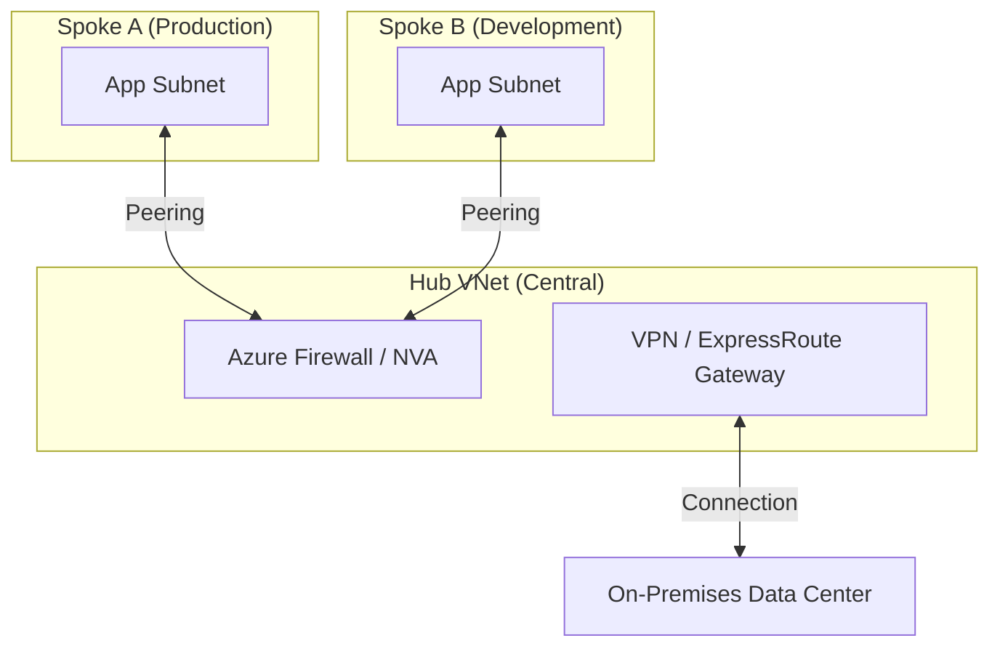

# Networking Fundamentals

This chapter will teach you everything about networking in Azure, starting from absolute basics. We'll explain what networking actually is, why it matters, and how to build secure, scalable network architectures from scratch.

## What You'll Learn

By the end of this chapter, you'll understand:
- What networking is and why applications need it (from scratch)
- IP addresses, subnets, and CIDR notation explained simply
- Virtual Networks (VNets) and how they work
- Network Security Groups (NSGs) and firewall rules
- Private vs Public networking (when to use each)
- How to design secure network architectures
- Common networking patterns and best practices

---

## What is Networking? (Start Here if You're New)

Let's start with the absolute basics.

### The Simple Explanation

**Networking = How computers talk to each other**

When you:
- Visit a website → Your computer talks to a web server
- Send an email → Your email app talks to an email server
- Watch a video → Your device talks to a video streaming server

ALL of this requires networking.

### Real-World Analogy: Postal System

Think of networking like the postal system:

**Postal System:**
- Every house has an address (123 Main Street)
- Mail is delivered based on address
- Post office routes mail to correct destination
- Can send letters anywhere in the world

**Computer Networking:**
- Every computer has an IP address (192.168.1.10)
- Data is delivered based on IP address
- Routers route data to correct destination
- Can send data anywhere on the internet

### Why Do Applications Need Networking?

**Without Networking:**
```
Problems:
1. Your laptop can run apps, but NO ONE ELSE can access them
2. Cannot download files from internet
3. Cannot send/receive emails
4. Cannot watch YouTube videos
5. Apps on same computer can't even talk to each other efficiently

Result: Computer is isolated, useless for modern apps
```

**With Networking:**
```
Solutions:
1. Other people can access your apps (website, API)
2. Can download anything from anywhere
3. Can communicate globally
4. Can stream content
5. Apps can communicate efficiently

Result: Computers connected, can do everything
```

### What is an IP Address?

**IP Address = The unique address of a computer on a network**

Just like your home address (123 Main Street, New York, NY 10001), every computer needs an address so others can find it.

**Two Types of IP Addresses:**

**IPv4 (What we'll use):**
```
Format: Four numbers separated by dots
Example: 192.168.1.100

Each number: 0-255
Total possible: ~4.3 billion addresses
Problem: We're running out! (Why IPv6 was created)
```

**IPv6 (The future):**
```
Format: Eight groups of hexadecimal numbers
Example: 2001:0db8:85a3:0000:0000:8a2e:0370:7334

Total possible: 340 undecillion addresses (basically infinite)
Azure supports it, but we'll focus on IPv4 for simplicity
```

### Public vs Private IP Addresses

This is CRITICAL to understand:

**Public IP Addresses:**
```
What: Addresses accessible from the internet
Who assigns: Internet Service Providers (ISPs)
Example: 20.52.123.45
Cost: You must PAY for public IPs in Azure (~$3-5/month each)

Use cases:
- Website that anyone can visit
- API that mobile apps call
- Public-facing load balancer

Analogy: Your home's street address (anyone can send mail)
```

**Private IP Addresses:**
```
What: Addresses only accessible within your network
Who assigns: You (Azure assigns automatically in your VNet)
Example: 10.0.1.100
Cost: FREE

Ranges reserved for private use:
- 10.0.0.0 to 10.255.255.255
- 172.16.0.0 to 172.31.255.255
- 192.168.0.0 to 192.168.255.255

Use cases:
- Database servers (should NEVER be public)
- Internal APIs
- Backend servers
- Anything that doesn't need internet access

Analogy: Apartment numbers within a building (only residents know them)
```

**Example: E-Commerce Website**

```
Public IP (20.52.123.45):
- Load balancer (customers connect to this)
- Only this IP is exposed to internet

Private IPs (inside your Azure network):
- 10.0.1.10: Web server 1
- 10.0.1.11: Web server 2
- 10.0.2.20: Application server 1
- 10.0.2.21: Application server 2
- 10.0.3.30: Database server
- 10.0.3.31: Database replica

Security:
- Internet can ONLY reach the load balancer (public IP)
- Load balancer forwards to web servers (private IPs)
- Web servers call app servers (private IPs)
- App servers query database (private IPs)
- Database is NEVER exposed to internet

Result: Only one entry point, everything else protected
```

### What is a Virtual Network (VNet)?

**VNet = Your private network in Azure's datacenter**

**Real-World Analogy: Office Building**

```
Physical Office Building:
- Building has many floors
- Each floor has many rooms
- Private hallways connect rooms
- Security at building entrance
- Visitors need badge to enter

Azure Virtual Network (VNet):
- VNet has many subnets
- Each subnet has many VMs
- Private network connects VMs
- Firewall at VNet boundary
- Traffic needs permission to enter

Just like you wouldn't let anyone walk into your office,
you don't let any traffic into your VNet without permission.
```

**Key VNet Concepts:**

**1. Address Space (The size of your network)**
```
You choose a range of IP addresses for your VNet

Example: 10.0.0.0/16
Translation: "My network starts at 10.0.0.0 and has 65,536 addresses"

Available addresses: 10.0.0.0 to 10.0.255.255

Think of it like buying land:
- /16 = Large plot (65,536 addresses) - Enterprise
- /20 = Medium plot (4,096 addresses) - Growing startup
- /24 = Small plot (256 addresses) - Small team

You divide this land into subnets (like rooms in a building)
```

**2. Subnets (Dividing your network into sections)**
```
Why subnets?
- Organize resources by function (web tier, app tier, database tier)
- Apply different security rules to each
- Isolate services from each other

Example VNet (10.0.0.0/16):
├─ Subnet 1: Web Servers (10.0.1.0/24)
│   └─ 256 addresses for web servers
├─ Subnet 2: App Servers (10.0.2.0/24)
│   └─ 256 addresses for application servers
├─ Subnet 3: Database (10.0.3.0/24)
│   └─ 256 addresses for databases
└─ Subnet 4: Management (10.0.4.0/24)
    └─ 256 addresses for admin/monitoring tools

Each subnet has its own security rules!
```

### Understanding CIDR Notation (The /16, /24 Numbers)

**CIDR (Classless Inter-Domain Routing)** is just a way to specify how many IP addresses you have.

**The Simple Rule:**
```
The number after the "/" tells you how many bits are FIXED

/8  = First 8 bits fixed  = 16,777,216 addresses (huge!)
/16 = First 16 bits fixed = 65,536 addresses (typical VNet)
/24 = First 24 bits fixed = 256 addresses (typical subnet)
/32 = All 32 bits fixed   = 1 address (specific machine)

REMEMBER: Smaller number after / = MORE addresses
         Larger number after / = FEWER addresses
```

**Visual Example:**

```
IP Address: 10.0.1.100

Written in CIDR:
- 10.0.1.100/32  = Just this ONE computer (all bits fixed)
- 10.0.1.0/24    = 256 computers (last number can be 0-255)
- 10.0.0.0/16    = 65,536 computers (last TWO numbers can vary)

Subnet Example:
10.0.1.0/24 means:
- Network starts at: 10.0.1.0
- Network ends at: 10.0.1.255
- Total addresses: 256
- Usable addresses: 251 (Azure reserves 5)

Which addresses are included?
✅ 10.0.1.0, 10.0.1.1, 10.0.1.2 ... 10.0.1.255
❌ 10.0.0.x (different subnet)
❌ 10.0.2.x (different subnet)
```

**Quick Reference Table:**

| CIDR | Addresses | Typical Use |
|------|-----------|-------------|
| /8   | 16.7 million | Entire cloud provider |
| /16  | 65,536 | **VNet address space** |
| /20  | 4,096 | Large subnet (Kubernetes) |
| /24  | 256 | **Standard subnet** |
| /26  | 64 | Small subnet |
| /28  | 16 | Tiny subnet (gateways) |
| /32  | 1 | Single IP address |


---

## Under the Hood: The "Magic" of SDN

How does Azure move billions of packets per second between virtual machines without a physical router for every customer? This is the power of **Software Defined Networking (SDN)**.

### The Virtual Filter (Host Agent)
When your VM sends a packet, it doesn't just hit a wire. It hits the **Azure Virtual Filtering Platform (VFP)**, which is an extension of the Hyper-V switch in the physical host.

1. **Stateful Inspection**: The Host Agent checks if this packet matches your NSG rules. 
2. **Encapsulation**: If allowed, the packet is wrapped (encapsulated) in a VXLAN/NVGRE tunnel. 
3. **The Global Backbone**: The packet travels over the physical datacenter network.
4. **Decapsulation**: The destination host unwraps the packet and delivers it to the target VM.

### The WireServer (168.63.129.16)
You will see this IP address in your network logs frequently. It is the **Azure WireServer**. It is a "magic" IP that exists in every subnet but doesn't live on any specific machine. It provides:
- **DNS**: Resolving internal Azure names.
- **DHCP**: Assigning IP addresses to your VMs.
- **Health Probes**: Checking if your VMs are alive for the Load Balancer.

> [!IMPORTANT]
> **Pro Tip: Don't Block the Magic**
> If you create a custom NSG that blocks `168.63.129.16`, your VM's health probes will fail, it will lose its IP address, and it will effectively "disappear" from the network. Always allow this IP in your custom configurations.

---

## Network Security: How to Control Traffic

Now that you understand IP addresses and VNets, let's learn how to SECURE them.

### What is a Firewall?

**Firewall = A security guard that controls what traffic is allowed**

**Real-World Analogy: Building Security**

```
Physical Building:
- Security guard at entrance
- Checks ID of everyone entering
- Has a list of allowed visitors
- Rejects unknown people
- Allows deliveries only at loading dock

Network Firewall:
- Firewall at network boundary
- Checks source IP of all traffic
- Has a list of allowed connections
- Rejects blocked traffic
- Allows specific ports only

Same concept: Control who/what gets in
```

### Network Security Groups (NSGs)

**NSG = Azure's firewall for VNets and VMs**

**How NSGs Work:**

```
NSG = A list of security rules

Each rule specifies:
1. Priority (lower number = checked first)
2. Source (where traffic is coming from)
3. Destination (where traffic is going to)
4. Port (which port: 80=web, 443=HTTPS, 22=SSH, etc.)
5. Action (ALLOW or DENY)

Traffic is checked against rules in priority order.
First matching rule wins.
```

**Example NSG Rules:**

```
Rule 100 (highest priority):
- Source: My office IP (203.0.113.5)
- Destination: 10.0.1.0/24 (web servers)
- Port: 22 (SSH)
- Action: ALLOW
- Why: Allow me to SSH from my office

Rule 200:
- Source: Internet (*)
- Destination: 10.0.1.0/24 (web servers)
- Port: 443 (HTTPS)
- Action: ALLOW
- Why: Allow anyone to access website over HTTPS

Rule 300:
- Source: Internet (*)
- Destination: 10.0.3.0/24 (database servers)
- Port: * (any)
- Action: DENY
- Why: NEVER allow internet to reach database directly

Rule 1000 (lowest priority):
- Source: *
- Destination: *
- Port: *
- Action: DENY
- Why: Default deny everything else
```

### Real-World Example: 3-Tier Web Application

Let's design a complete network architecture:

```
E-Commerce Application Architecture:

VNet: 10.0.0.0/16 (65,536 addresses)

Subnet 1: Public (10.0.1.0/24)
├─ Load Balancer (10.0.1.10) - PUBLIC IP: 20.52.123.45
└─ NSG Rules:
    100: Allow Internet → 443 (HTTPS)
    1000: Deny all else

Subnet 2: Web Tier (10.0.2.0/24)
├─ Web Server 1 (10.0.2.10)
├─ Web Server 2 (10.0.2.11)
└─ NSG Rules:
    100: Allow Load Balancer → 80, 443
    200: Deny Internet → * (block direct internet access)
    300: Allow App Tier → return traffic
    1000: Deny all else

Subnet 3: App Tier (10.0.3.0/24)
├─ App Server 1 (10.0.3.10)
├─ App Server 2 (10.0.3.11)
└─ NSG Rules:
    100: Allow Web Tier → 8080 (app port)
    200: Allow Database Tier → return traffic
    300: Deny Internet → * (not accessible from internet)
    1000: Deny all else

Subnet 4: Database Tier (10.0.4.0/24)
├─ Primary Database (10.0.4.10)
├─ Replica Database (10.0.4.11)
└─ NSG Rules:
    100: Allow App Tier → 5432 (PostgreSQL)
    200: Allow Admin Subnet → 5432 (for maintenance)
    300: Deny Internet → * (NEVER accessible from internet)
    1000: Deny all else

Subnet 5: Management (10.0.5.0/24)
├─ Bastion Host (10.0.5.10)
└─ NSG Rules:
    100: Allow My Office IP → 22, 3389 (SSH, RDP)
    200: Deny Internet → *
    1000: Deny all else

Traffic Flow:
1. Customer → Public IP (20.52.123.45)
2. Load Balancer → Web Server (10.0.2.10)
3. Web Server → App Server (10.0.3.10)
4. App Server → Database (10.0.4.10)
5. Database returns data same path

Security:
✅ Only load balancer is public
✅ Each tier can only talk to adjacent tiers
✅ Database is completely isolated from internet
✅ Admin access only from management subnet
```

---

## 1. IP Addressing & Subnetting Strategy

Correctly planning your IP address space is the single most critical step. You cannot easily change a VNet's address space after peering it.

### CIDR Deep Dive
Azure uses Classless Inter-Domain Routing (CIDR) notation.

> [!TIP]
> **Jargon Alert: CIDR Block**
> A way to state "IP Address + Network Size".
> `10.0.0.0/16` means "Start at 10.0.0.0, and the first 16 bits are fixed." The remaining 16 bits are for your devices.

### Subnet Calculation Cheat Sheet

| CIDR | Total IPs | Usable IPs (Azure) | Use Case |
|------|-----------|--------------------|----------|
| `/16` | 65,536 | 65,531 | **VNet Address Space** (Standard enterprise size) |
| `/20` | 4,096 | 4,091 | **Large Subnet** (AKS Clusters) |
| `/24` | 256 | 251 | **Standard Subnet** (Web tier, App tier) |
| `/26` | 64 | 59 | **Gateway Subnet** (VPN/ExpressRoute) |
| `/27` | 32 | 27 | **Azure Bastion** (Required size) |
| `/29` | 8 | 3 | **Tiny Subnet** (Azure Firewall management) |

> [!WARNING]
> **Gotcha: Azure's 5 Reserved IPs**
> In every subnet, Azure reserves 5 IP addresses:
> 1. `x.x.x.0`: Network address
> 2. `x.x.x.1`: Default gateway
> 3. `x.x.x.2`: Azure DNS mapping
> 4. `x.x.x.3`: Azure DNS mapping
> 5. `x.x.x.255`: Broadcast address (Azure doesn't support broadcast)
>
> **Implication**: A `/29` subnet only has 3 usable IPs!

---

## 2. Network Security Groups (NSG) vs Application Security Groups (ASG)

### Network Security Groups (NSG)
The firewall for your subnet or network interface (NIC). It contains a list of Allow/Deny rules.

**Key Rules**:
- **Priority**: Lower number = Higher priority (100 overrides 200).
- **5-Tuple**: Source IP, Source Port, Dest IP, Dest Port, Protocol.
- **Stateful**: If you allow traffic IN, the response OUT is automatically allowed.

### Application Security Groups (ASG)
ASGs allow you to group VMs by their *function* rather than their IP address.

**The Problem**:
You have 10 web servers. You want to allow Port 80 to all of them.
*Traditional Way*: Create an NSG rule for each IP, or put them all in one tidy subnet.
*ASG Way*: Tag the NICs with "WebASG". Create ONE NSG rule: "Allow Internet to WebASG".

> [!NOTE]
> **Deep Dive: When to use ASGs?**
> Use ASGs when you have multiple fast-changing workloads in a single subnet and need granular micro-segmentation. If you just have tiered subnets (Web, App, DB), standard subnet-level NSGs are usually cleaner.


---

## 3. Secure Access: Service Endpoints vs Private Link

This is a favorite interview topic. Both secure access to PaaS (SQL, Storage), but differently.

| Feature | Service Endpoints | Private Link (Private Endpoint) |
|---------|-------------------|---------------------------------|
| **Traffic Path** | Optimized route over Azure backbone | Private IP inside your VNet |
| **PaaS IP** | Public IP | **Private IP** (e.g., 10.0.1.5) |
| **On-Prem Access** | No (unless forced tunneling) | **Yes** (via VPN/ExpressRoute) |
| **Data Exfiltration**| Harder to block | **protected** (maps to specific instance) |
| **Cost** | Free | $/hour + Data processing charge |

### Service Endpoints
"leaves" your VNet to talk to the Public PaaS resource, but Azure recognizes the traffic is coming from your subnet.

### Packet Path Analysis: Service Endpoints vs. Private Link

To truly master this, you must understand where the packet goes.

**Service Endpoint Packet Path**:
1. VM (10.0.1.5) → **Next Hop**: "VirtualNetwork"
2. Traffic hits the Azure Backbone.
3. Source IP is changed (Internal SNAT) to a Microsoft-owned Public IP.
4. Destination is the **Regional Public IP** of the Storage/SQL service.
5. **Security**: The PaaS resource must have its firewall configured to "Allow access from Virtual Network X".

**Private Link Packet Path**:
1. VM (10.0.1.5) → **Next Hop**: 10.0.1.10 (The Private Endpoint IP)
2. Traffic **never leaves your VNet**.
3. Destination is a **Local Private IP** sitting inside your subnet.
4. **Security**: The PaaS resource's public network access can be set to **DISABLED**. It is literally invisible to the internet.

> [!IMPORTANT]
> **Pro Tip: DNS is the Hard Part**
> When you use Private Link, your app still wants to talk to `mystorage.blob.core.windows.net`. You need a **Private DNS Zone** linked to your VNet so that `mystorage.blob.core.windows.net` resolves to `10.0.1.10` instead of the public IP.

---

---

## 4. Subnet Delegation

Some Azure services require a "Delegated Subnet". This means they take full control of that subnet—you cannot put anything else in it.

**Services requiring delegation**:
- Azure NetApp Files
- Azure SQL Managed Instance
- App Service VNet Integration (Standard)
- Azure Databricks

> [!WARNING]
> **Gotcha: Subnet Delegation sizing**
> Once delegated, resizing is painful. Azure SQL Managed Instance requires a minimum `/27`, but Microsoft recommends `/26` or `/25` for scaling. If you start too small, you have to rebuild the cluster.

---

### Hub-and-Spoke Topology

This is the standard architecture for enterprise Azure environments. Instead of peering every VNet to every other VNet (which creates a "Spaghetti Network"), you use a Central Hub.



**Why professionals use Hub-and-Spoke**:
1. **Shared Services**: Place your Firewall, VPN Gateway, and Domain Controllers in the Hub to save money and simplify management.
2. **Security**: All traffic between Spokes (Spoke A to Spoke B) must pass through the Hub's Firewall ("East-West" traffic filtering).
3. **No Transitivity**: By default, Spoke A cannot talk to Spoke B. This provides excellent isolation for Dev/Test vs Production.

---

## Troubleshooting: "My VM Can't Talk to XXX"

Networking is the most common cause of deployment failures. Use this checklist to debug like a pro.

### 1. The NSG Check
- **Inbound vs. Outbound**: Did you allow port 80 Inbound? Great. Did you also allow port 80 Outbound from the source?
- **Priority**: Is there a higher priority rule (e.g., Priority 100 Deny All) blocking your rule (Priority 200 Allow HTTP)?
- **Effective Rules**: Using the portal, go to the VM → Networking → **Effective security rules**. This shows the final result of ALL NSGs combined.

### 2. The Next Hop Check
- **UDRs (User Defined Routes)**: Is there a routing table sending your traffic to a Firewall (NVA) that is dropping it?
- **VNet Peering**: Is the peering status `Connected`? If it's `Initiated`, you forgot to create the peering link on the other side.
- **Transitivity**: Are you trying to talk to Spoke B from Spoke A through a Hub? Remember, peering is NOT transitive. You need a device in the Hub to route the traffic.

### 3. The PaaS Connectivity Check
- **NSG vs. Firewall**: If using Service Endpoints, did you add the Subnet to the SQL/Storage firewall?
- **Private DNS**: If using Private Link, does `ping mystorage.blob.core.windows.net` return a **private** IP or a **public** IP? If public, your DNS is broken.

> [!TIP]
> **Pro Tool: Connection Troubleshoot**
> In **Azure Network Watcher**, use the "Connection Troubleshoot" tool. It will tell you exactly where the packet is being dropped—is it an NSG, a Route, or the OS firewall inside the VM?
