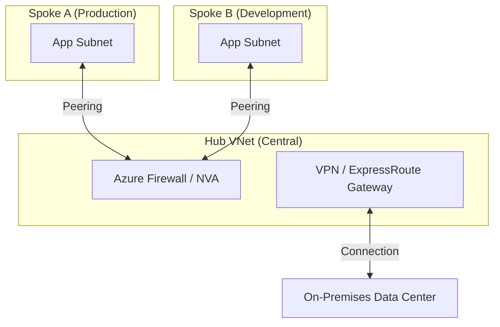

# Networking Fundamentals

This chapter will teach you everything about networking in Azure, starting from absolute basics. We'll explain what networking actually is, why it matters, and how to build secure, scalable network architectures from scratch.

## What You'll Learn

By the end of this chapter, you'll understand:
- What networking is and why applications need it (from scratch)
- IP addresses, subnets, and CIDR notation explained simply
- Virtual Networks (VNets) and how they work
- Network Security Groups (NSGs) and firewall rules
- Private vs Public networking (when to use each)
- How to design secure network architectures
- Common networking patterns and best practices

---

## What is Networking? (Start Here if You're New)

Let's start with the absolute basics.

### The Simple Explanation

**Networking = How computers talk to each other**

When you:
- Visit a website → Your computer talks to a web server
- Send an email → Your email app talks to an email server
- Watch a video → Your device talks to a video streaming server

ALL of this requires networking.

### Real-World Analogy: Postal System

Think of networking like the postal system:

**Postal System:**
- Every house has an address (123 Main Street)
- Mail is delivered based on address
- Post office routes mail to correct destination
- Can send letters anywhere in the world

**Computer Networking:**
- Every computer has an IP address (192.168.1.10)
- Data is delivered based on IP address
- Routers route data to correct destination
- Can send data anywhere on the internet

### Why Do Applications Need Networking?

**Without Networking:**
```
Problems:
1. Your laptop can run apps, but NO ONE ELSE can access them
2. Cannot download files from internet
3. Cannot send/receive emails
4. Cannot watch YouTube videos
5. Apps on same computer can't even talk to each other efficiently

Result: Computer is isolated, useless for modern apps
```

**With Networking:**
```
Solutions:
1. Other people can access your apps (website, API)
2. Can download anything from anywhere
3. Can communicate globally
4. Can stream content
5. Apps can communicate efficiently

Result: Computers connected, can do everything
```

### What is an IP Address?

**IP Address = The unique address of a computer on a network**

Just like your home address (123 Main Street, New York, NY 10001), every computer needs an address so others can find it.

**Two Types of IP Addresses:**

**IPv4 (What we'll use):**
```
Format: Four numbers separated by dots
Example: 192.168.1.100

Each number: 0-255
Total possible: ~4.3 billion addresses
Problem: We're running out! (Why IPv6 was created)
```

**IPv6 (The future):**
```
Format: Eight groups of hexadecimal numbers
Example: 2001:0db8:85a3:0000:0000:8a2e:0370:7334

Total possible: 340 undecillion addresses (basically infinite)
Azure supports it, but we'll focus on IPv4 for simplicity
```

### Public vs Private IP Addresses

This is CRITICAL to understand:

**Public IP Addresses:**
```
What: Addresses accessible from the internet
Who assigns: Internet Service Providers (ISPs)
Example: 20.52.123.45
Cost: You must PAY for public IPs in Azure (~$3-5/month each)

Use cases:
- Website that anyone can visit
- API that mobile apps call
- Public-facing load balancer

Analogy: Your home's street address (anyone can send mail)
```

**Private IP Addresses:**
```
What: Addresses only accessible within your network
Who assigns: You (Azure assigns automatically in your VNet)
Example: 10.0.1.100
Cost: FREE

Ranges reserved for private use:
- 10.0.0.0 to 10.255.255.255
- 172.16.0.0 to 172.31.255.255
- 192.168.0.0 to 192.168.255.255

Use cases:
- Database servers (should NEVER be public)
- Internal APIs
- Backend servers
- Anything that doesn't need internet access

Analogy: Apartment numbers within a building (only residents know them)
```

**Example: E-Commerce Website**

```
Public IP (20.52.123.45):
- Load balancer (customers connect to this)
- Only this IP is exposed to internet

Private IPs (inside your Azure network):
- 10.0.1.10: Web server 1
- 10.0.1.11: Web server 2
- 10.0.2.20: Application server 1
- 10.0.2.21: Application server 2
- 10.0.3.30: Database server
- 10.0.3.31: Database replica

Security:
- Internet can ONLY reach the load balancer (public IP)
- Load balancer forwards to web servers (private IPs)
- Web servers call app servers (private IPs)
- App servers query database (private IPs)
- Database is NEVER exposed to internet

Result: Only one entry point, everything else protected
```

### What is a Virtual Network (VNet)?

**VNet = Your private network in Azure's datacenter**

**Real-World Analogy: Office Building**

```
Physical Office Building:
- Building has many floors
- Each floor has many rooms
- Private hallways connect rooms
- Security at building entrance
- Visitors need badge to enter

Azure Virtual Network (VNet):
- VNet has many subnets
- Each subnet has many VMs
- Private network connects VMs
- Firewall at VNet boundary
- Traffic needs permission to enter

Just like you wouldn't let anyone walk into your office,
you don't let any traffic into your VNet without permission.
```

**Key VNet Concepts:**

**1. Address Space (The size of your network)**
```
You choose a range of IP addresses for your VNet

Example: 10.0.0.0/16
Translation: "My network starts at 10.0.0.0 and has 65,536 addresses"

Available addresses: 10.0.0.0 to 10.0.255.255

Think of it like buying land:
- /16 = Large plot (65,536 addresses) - Enterprise
- /20 = Medium plot (4,096 addresses) - Growing startup
- /24 = Small plot (256 addresses) - Small team

You divide this land into subnets (like rooms in a building)
```

**2. Subnets (Dividing your network into sections)**
```
Why subnets?
- Organize resources by function (web tier, app tier, database tier)
- Apply different security rules to each
- Isolate services from each other

Example VNet (10.0.0.0/16):
├─ Subnet 1: Web Servers (10.0.1.0/24)
│   └─ 256 addresses for web servers
├─ Subnet 2: App Servers (10.0.2.0/24)
│   └─ 256 addresses for application servers
├─ Subnet 3: Database (10.0.3.0/24)
│   └─ 256 addresses for databases
└─ Subnet 4: Management (10.0.4.0/24)
    └─ 256 addresses for admin/monitoring tools

Each subnet has its own security rules!
```

### Understanding CIDR Notation (The /16, /24 Numbers)

**CIDR (Classless Inter-Domain Routing)** is just a way to specify how many IP addresses you have.

**The Simple Rule:**
```
The number after the "/" tells you how many bits are FIXED

/8  = First 8 bits fixed  = 16,777,216 addresses (huge!)
/16 = First 16 bits fixed = 65,536 addresses (typical VNet)
/24 = First 24 bits fixed = 256 addresses (typical subnet)
/32 = All 32 bits fixed   = 1 address (specific machine)

REMEMBER: Smaller number after / = MORE addresses
         Larger number after / = FEWER addresses
```

**Visual Example:**

```
IP Address: 10.0.1.100

Written in CIDR:
- 10.0.1.100/32  = Just this ONE computer (all bits fixed)
- 10.0.1.0/24    = 256 computers (last number can be 0-255)
- 10.0.0.0/16    = 65,536 computers (last TWO numbers can vary)

Subnet Example:
10.0.1.0/24 means:
- Network starts at: 10.0.1.0
- Network ends at: 10.0.1.255
- Total addresses: 256
- Usable addresses: 251 (Azure reserves 5)

Which addresses are included?
✅ 10.0.1.0, 10.0.1.1, 10.0.1.2 ... 10.0.1.255
❌ 10.0.0.x (different subnet)
❌ 10.0.2.x (different subnet)
```

**Quick Reference Table:**

| CIDR | Addresses | Typical Use |
|------|-----------|-------------|
| /8   | 16.7 million | Entire cloud provider |
| /16  | 65,536 | **VNet address space** |
| /20  | 4,096 | Large subnet (Kubernetes) |
| /24  | 256 | **Standard subnet** |
| /26  | 64 | Small subnet |
| /28  | 16 | Tiny subnet (gateways) |
| /32  | 1 | Single IP address |


---

## Under the Hood: The "Magic" of SDN

How does Azure move billions of packets per second between virtual machines without a physical router for every customer? This is the power of **Software Defined Networking (SDN)**.

**Real-World Analogy: The Invisible Mail Room**

Think of Azure SDN like a massive corporate mail room that you never see. When you send a letter (packet) from your desk (VM), you just write the recipient's name. The mail room figures out which building, floor, and desk to deliver it to -- you never deal with the physical routing. If the recipient moves desks, the mail room updates its records automatically. That is SDN: the physical network hardware is decoupled from the routing logic, which is managed entirely in software.

### The Virtual Filter (Host Agent)
When your VM sends a packet, it doesn't just hit a wire. It hits the **Azure Virtual Filtering Platform (VFP)**, which is an extension of the Hyper-V switch in the physical host.

1. **Stateful Inspection**: The Host Agent checks if this packet matches your NSG rules. This happens at wire speed -- your NSG rules are compiled into efficient lookup tables on the physical host, not evaluated one-by-one like a script.
2. **Encapsulation**: If allowed, the packet is wrapped (encapsulated) in a VXLAN/NVGRE tunnel. This is how Azure keeps your traffic isolated from other tenants on the same physical network -- your packet rides inside another packet, like a letter inside an envelope.
3. **The Global Backbone**: The packet travels over the physical datacenter network. Azure's backbone network spans over 250,000 km of fiber optic cable connecting all regions.
4. **Decapsulation**: The destination host unwraps the packet and delivers it to the target VM.

**Why this matters for you**: Understanding SDN explains why Azure networking "just works" across availability zones and regions. It also explains why certain operations (like changing NSG rules) take 1-2 minutes to propagate -- the new rules need to be compiled and pushed to the VFP on every physical host running your VMs.

### The WireServer (168.63.129.16)
You will see this IP address in your network logs frequently. It is the **Azure WireServer**. It is a "magic" IP that exists in every subnet but doesn't live on any specific machine. It provides:
- **DNS**: Resolving internal Azure names.
- **DHCP**: Assigning IP addresses to your VMs.
- **Health Probes**: Checking if your VMs are alive for the Load Balancer.

> [!IMPORTANT]
> **Pro Tip: Don't Block the Magic**
> If you create a custom NSG that blocks `168.63.129.16`, your VM's health probes will fail, it will lose its IP address, and it will effectively "disappear" from the network. Always allow this IP in your custom configurations.

---

## Network Security: How to Control Traffic

Now that you understand IP addresses and VNets, let's learn how to SECURE them.

### What is a Firewall?

**Firewall = A security guard that controls what traffic is allowed**

**Real-World Analogy: Building Security**

```
Physical Building:
- Security guard at entrance
- Checks ID of everyone entering
- Has a list of allowed visitors
- Rejects unknown people
- Allows deliveries only at loading dock

Network Firewall:
- Firewall at network boundary
- Checks source IP of all traffic
- Has a list of allowed connections
- Rejects blocked traffic
- Allows specific ports only

Same concept: Control who/what gets in
```

### Network Security Groups (NSGs)

**NSG = Azure's firewall for VNets and VMs**

**How NSGs Work:**

```
NSG = A list of security rules

Each rule specifies:
1. Priority (lower number = checked first)
2. Source (where traffic is coming from)
3. Destination (where traffic is going to)
4. Port (which port: 80=web, 443=HTTPS, 22=SSH, etc.)
5. Action (ALLOW or DENY)

Traffic is checked against rules in priority order.
First matching rule wins.
```

**Example NSG Rules:**

```
Rule 100 (highest priority):
- Source: My office IP (203.0.113.5)
- Destination: 10.0.1.0/24 (web servers)
- Port: 22 (SSH)
- Action: ALLOW
- Why: Allow me to SSH from my office

Rule 200:
- Source: Internet (*)
- Destination: 10.0.1.0/24 (web servers)
- Port: 443 (HTTPS)
- Action: ALLOW
- Why: Allow anyone to access website over HTTPS

Rule 300:
- Source: Internet (*)
- Destination: 10.0.3.0/24 (database servers)
- Port: * (any)
- Action: DENY
- Why: NEVER allow internet to reach database directly

Rule 1000 (lowest priority):
- Source: *
- Destination: *
- Port: *
- Action: DENY
- Why: Default deny everything else
```

### Real-World Example: 3-Tier Web Application

Let's design a complete network architecture:

```
E-Commerce Application Architecture:

VNet: 10.0.0.0/16 (65,536 addresses)

Subnet 1: Public (10.0.1.0/24)
├─ Load Balancer (10.0.1.10) - PUBLIC IP: 20.52.123.45
└─ NSG Rules:
    100: Allow Internet → 443 (HTTPS)
    1000: Deny all else

Subnet 2: Web Tier (10.0.2.0/24)
├─ Web Server 1 (10.0.2.10)
├─ Web Server 2 (10.0.2.11)
└─ NSG Rules:
    100: Allow Load Balancer → 80, 443
    200: Deny Internet → * (block direct internet access)
    300: Allow App Tier → return traffic
    1000: Deny all else

Subnet 3: App Tier (10.0.3.0/24)
├─ App Server 1 (10.0.3.10)
├─ App Server 2 (10.0.3.11)
└─ NSG Rules:
    100: Allow Web Tier → 8080 (app port)
    200: Allow Database Tier → return traffic
    300: Deny Internet → * (not accessible from internet)
    1000: Deny all else

Subnet 4: Database Tier (10.0.4.0/24)
├─ Primary Database (10.0.4.10)
├─ Replica Database (10.0.4.11)
└─ NSG Rules:
    100: Allow App Tier → 5432 (PostgreSQL)
    200: Allow Admin Subnet → 5432 (for maintenance)
    300: Deny Internet → * (NEVER accessible from internet)
    1000: Deny all else

Subnet 5: Management (10.0.5.0/24)
├─ Bastion Host (10.0.5.10)
└─ NSG Rules:
    100: Allow My Office IP → 22, 3389 (SSH, RDP)
    200: Deny Internet → *
    1000: Deny all else

Traffic Flow:
1. Customer → Public IP (20.52.123.45)
2. Load Balancer → Web Server (10.0.2.10)
3. Web Server → App Server (10.0.3.10)
4. App Server → Database (10.0.4.10)
5. Database returns data same path

Security:
✅ Only load balancer is public
✅ Each tier can only talk to adjacent tiers
✅ Database is completely isolated from internet
✅ Admin access only from management subnet
```

---

## 1. IP Addressing & Subnetting Strategy

Correctly planning your IP address space is the single most critical step. You cannot easily change a VNet's address space after peering it.

### CIDR Deep Dive
Azure uses Classless Inter-Domain Routing (CIDR) notation.

> [!TIP]
> **Jargon Alert: CIDR Block**
> A way to state "IP Address + Network Size".
> `10.0.0.0/16` means "Start at 10.0.0.0, and the first 16 bits are fixed." The remaining 16 bits are for your devices.

### Subnet Calculation Cheat Sheet

| CIDR | Total IPs | Usable IPs (Azure) | Use Case |
|------|-----------|--------------------|----------|
| `/16` | 65,536 | 65,531 | **VNet Address Space** (Standard enterprise size) |
| `/20` | 4,096 | 4,091 | **Large Subnet** (AKS Clusters) |
| `/24` | 256 | 251 | **Standard Subnet** (Web tier, App tier) |
| `/26` | 64 | 59 | **Gateway Subnet** (VPN/ExpressRoute) |
| `/27` | 32 | 27 | **Azure Bastion** (Required size) |
| `/29` | 8 | 3 | **Tiny Subnet** (Azure Firewall management) |

> [!WARNING]
> **Gotcha: Azure's 5 Reserved IPs**
> In every subnet, Azure reserves 5 IP addresses:
> 1. `x.x.x.0`: Network address
> 2. `x.x.x.1`: Default gateway
> 3. `x.x.x.2`: Azure DNS mapping
> 4. `x.x.x.3`: Azure DNS mapping
> 5. `x.x.x.255`: Broadcast address (Azure doesn't support broadcast)
>
> **Implication**: A `/29` subnet only has 3 usable IPs!

---

## 2. Network Security Groups (NSG) vs Application Security Groups (ASG)

### Network Security Groups (NSG)
The firewall for your subnet or network interface (NIC). It contains a list of Allow/Deny rules.

**Key Rules**:
- **Priority**: Lower number = Higher priority (100 overrides 200).
- **5-Tuple**: Source IP, Source Port, Dest IP, Dest Port, Protocol.
- **Stateful**: If you allow traffic IN, the response OUT is automatically allowed.

### Application Security Groups (ASG)
ASGs allow you to group VMs by their *function* rather than their IP address.

**The Problem**:
You have 10 web servers. You want to allow Port 80 to all of them.
*Traditional Way*: Create an NSG rule for each IP, or put them all in one tidy subnet.
*ASG Way*: Tag the NICs with "WebASG". Create ONE NSG rule: "Allow Internet to WebASG".

> [!NOTE]
> **Deep Dive: When to use ASGs?**
> Use ASGs when you have multiple fast-changing workloads in a single subnet and need granular micro-segmentation. If you just have tiered subnets (Web, App, DB), standard subnet-level NSGs are usually cleaner.


---

## 3. Secure Access: Service Endpoints vs Private Link

This is a favorite interview topic. Both secure access to PaaS (SQL, Storage), but differently.

| Feature | Service Endpoints | Private Link (Private Endpoint) |
|---------|-------------------|---------------------------------|
| **Traffic Path** | Optimized route over Azure backbone | Private IP inside your VNet |
| **PaaS IP** | Public IP | **Private IP** (e.g., 10.0.1.5) |
| **On-Prem Access** | No (unless forced tunneling) | **Yes** (via VPN/ExpressRoute) |
| **Data Exfiltration**| Harder to block | **protected** (maps to specific instance) |
| **Cost** | Free | $/hour + Data processing charge |

### Service Endpoints
"Leaves" your VNet to talk to the Public PaaS resource, but Azure recognizes the traffic is coming from your subnet. Think of it as a VIP fast lane on the highway -- you still use the public road (Azure backbone), but the destination (Storage, SQL) sees your VIP badge (subnet identity) and lets you in through a private gate.

**Cost Tip**: Service Endpoints are completely free. If your workloads are Azure-only (no on-premises access needed) and you don't need data exfiltration protection, start with Service Endpoints. You can always upgrade to Private Link later -- but Private Link costs approximately $7.30/month per endpoint plus $0.01/GB of data processed.

### Packet Path Analysis: Service Endpoints vs. Private Link

To truly master this, you must understand where the packet goes.

**Service Endpoint Packet Path**:
1. VM (10.0.1.5) → **Next Hop**: "VirtualNetwork"
2. Traffic hits the Azure Backbone.
3. Source IP is changed (Internal SNAT) to a Microsoft-owned Public IP.
4. Destination is the **Regional Public IP** of the Storage/SQL service.
5. **Security**: The PaaS resource must have its firewall configured to "Allow access from Virtual Network X".

**Private Link Packet Path**:
1. VM (10.0.1.5) → **Next Hop**: 10.0.1.10 (The Private Endpoint IP)
2. Traffic **never leaves your VNet**.
3. Destination is a **Local Private IP** sitting inside your subnet.
4. **Security**: The PaaS resource's public network access can be set to **DISABLED**. It is literally invisible to the internet.

> [!IMPORTANT]
> **Pro Tip: DNS is the Hard Part**
> When you use Private Link, your app still wants to talk to `mystorage.blob.core.windows.net`. You need a **Private DNS Zone** linked to your VNet so that `mystorage.blob.core.windows.net` resolves to `10.0.1.10` instead of the public IP.

---

---

## 4. Subnet Delegation

Some Azure services require a "Delegated Subnet". This means they take full control of that subnet—you cannot put anything else in it.

**Services requiring delegation**:
- Azure NetApp Files
- Azure SQL Managed Instance
- App Service VNet Integration (Standard)
- Azure Databricks

**Real-World Analogy**: Subnet Delegation is like reserving an entire floor of an office building for one company. They need full control of the floor plan -- where walls go, how wiring runs, which doors are locked. You cannot put another company's desks on that floor. The tradeoff is clear: you lose flexibility in exchange for giving that service exactly the environment it needs to function correctly.

**Practical Tip**: When planning your VNet address space, always pre-allocate dedicated subnets for services you might need later (SQL Managed Instance, Databricks). Adding a delegated subnet to an existing VNet is straightforward, but running out of address space because you planned too tightly is a painful and disruptive fix.

> [!WARNING]
> **Gotcha: Subnet Delegation sizing**
> Once delegated, resizing is painful. Azure SQL Managed Instance requires a minimum `/27`, but Microsoft recommends `/26` or `/25` for scaling. If you start too small, you have to rebuild the cluster.

---

### Hub-and-Spoke Topology

This is the standard architecture for enterprise Azure environments. Instead of peering every VNet to every other VNet (which creates a "Spaghetti Network"), you use a Central Hub.


```mermaid
graph TD
    subgraph "Hub VNet (Central)"
        H[Azure Firewall / NVA]
        G[VPN / ExpressRoute Gateway]
    end

    subgraph "Spoke A (Production)"
        A[App Subnet]
    end

    subgraph "Spoke B (Development)"
        B[App Subnet]
    end

    A <-->|Peering| H
    B <-->|Peering| H
    G <-->|Connection| OnPrem[On-Premises Data Center]
```

**Why professionals use Hub-and-Spoke**:
1. **Shared Services**: Place your Firewall, VPN Gateway, and Domain Controllers in the Hub to save money and simplify management. Without this pattern, you would need a separate Firewall in every VNet -- at $900+/month each, that adds up fast.
2. **Security**: All traffic between Spokes (Spoke A to Spoke B) must pass through the Hub's Firewall ("East-West" traffic filtering). This gives your security team a single chokepoint to inspect, log, and control all inter-application traffic.
3. **No Transitivity**: By default, Spoke A cannot talk to Spoke B. This provides excellent isolation for Dev/Test vs Production. A compromised dev workload cannot pivot laterally into production without going through the Hub's firewall first.

**Cost Consideration**: A Hub-Spoke architecture with Azure Firewall Standard costs roughly $900/month for the firewall alone, plus VNet peering costs ($0.01/GB for intra-region peering). For small teams with 1-2 VNets, this is overkill. The breakeven point is typically around 3-4 spoke VNets -- at that point, the centralized management and security benefits outweigh the firewall cost.

**Common Pitfall**: Forgetting that VNet peering is not transitive. If Spoke A peers with Hub, and Spoke B peers with Hub, Spoke A and Spoke B cannot talk to each other unless you configure a Network Virtual Appliance (NVA) or Azure Firewall in the Hub to route traffic between them. This catches teams who assume peering works like a switch.

---

## Troubleshooting: "My VM Can't Talk to XXX"

Networking is the most common cause of deployment failures. Experienced Azure engineers spend more time debugging networking than any other category. Use this checklist to debug systematically instead of guessing.

**The Golden Rule of Network Debugging**: Start at the source, verify each hop, and work toward the destination. Never skip steps -- the problem is almost always in the most boring, obvious place.

### 1. The NSG Check
- **Inbound vs. Outbound**: Did you allow port 80 Inbound on the destination? Great. Did you also check that port 80 Outbound is allowed from the source? NSGs are applied at both ends, and the default rules block differently than you might expect.
- **Priority**: Is there a higher priority rule (e.g., Priority 100 Deny All) blocking your rule (Priority 200 Allow HTTP)? Lower priority numbers are evaluated first. A common mistake is adding an Allow rule at priority 200 without realizing there is a Deny All at priority 100.
- **Effective Rules**: Using the portal, go to the VM -> Networking -> **Effective security rules**. This shows the final result of ALL NSGs combined (both subnet-level and NIC-level). This is the single most useful debugging tool for NSG issues.
- **NSG Flow Logs**: If you need to see exactly which packets are being allowed or denied, enable NSG Flow Logs. They write to a storage account and can be analyzed with Traffic Analytics. Cost: ~$0.50/GB of log data, but invaluable for diagnosing intermittent issues.

```bash
# Quick CLI check: see effective NSG rules for a specific VM NIC
az network nic show-effective-nsg \
  --resource-group myRG \
  --name myVM-nic \
  --output table
```

### 2. The Next Hop Check
- **UDRs (User Defined Routes)**: Is there a routing table sending your traffic to a Firewall (NVA) that is dropping it?
- **VNet Peering**: Is the peering status `Connected`? If it's `Initiated`, you forgot to create the peering link on the other side.
- **Transitivity**: Are you trying to talk to Spoke B from Spoke A through a Hub? Remember, peering is NOT transitive. You need a device in the Hub to route the traffic.

### 3. The PaaS Connectivity Check
- **NSG vs. Firewall**: If using Service Endpoints, did you add the Subnet to the SQL/Storage firewall?
- **Private DNS**: If using Private Link, does `ping mystorage.blob.core.windows.net` return a **private** IP or a **public** IP? If public, your DNS is broken.

> [!TIP]
> **Pro Tool: Connection Troubleshoot**
> In **Azure Network Watcher**, use the "Connection Troubleshoot" tool. It will tell you exactly where the packet is being dropped -- is it an NSG, a Route, or the OS firewall inside the VM? This is the CLI equivalent:
> ```bash
> az network watcher test-connectivity \
>   --resource-group myRG \
>   --source-resource mySourceVM \
>   --dest-resource myDestVM \
>   --dest-port 443
> ```
> The output shows every hop and where the packet was blocked. Save yourself hours of manual debugging by using this first.

**Practical Tip: The 5-Minute Networking Debug Checklist**

When "My VM can't talk to X" hits your inbox, run through this in order:
1. Can the VM resolve the hostname? (`nslookup target.host` from inside the VM)
2. Is the port open on the destination? (`az network nic show-effective-nsg` on both source and destination)
3. Is there a route override? (`az network nic show-effective-route-table` on the source NIC)
4. Is the destination actually listening? (SSH into the destination and run `ss -tlnp` or `netstat -tlnp`)
5. Is there an OS-level firewall? (Check `iptables` on Linux or Windows Firewall on Windows)

90% of networking issues are caught by steps 1-3. The remaining 10% are OS-level firewalls that people forget they configured.

---

## Interview Deep-Dive

<AccordionGroup>
  <Accordion title="You are designing a network for a 3-tier web application. The security team insists on zero internet exposure for the database tier. Walk me through your VNet design.">
    **Strong Candidate Answer:**

    - **VNet sizing:** I would start with a /16 address space (10.0.0.0/16 = 65,536 addresses) even if we only need 50 addresses today. Expanding a VNet address space after peering is established is disruptive and sometimes impossible. Over-allocating IP space costs nothing in Azure.
    - **Subnet layout:** Four subnets minimum. Public subnet (10.0.1.0/24) for the Application Gateway with WAF. Web tier subnet (10.0.2.0/24) for the frontend VMs or App Service VNet Integration. App tier subnet (10.0.3.0/24) for API servers. Database subnet (10.0.4.0/24) for the Azure SQL Private Endpoint. I would also pre-allocate a /27 for AzureBastionSubnet and a /26 for future AKS if the application might be containerized later.
    - **NSG strategy for zero internet exposure on DB tier:** The database subnet NSG allows inbound only from the app tier subnet on port 1433 (SQL) and from the management subnet on port 1433 for DBA access. The default outbound rule is overridden with a deny-all, and a specific allow rule for Azure Monitor endpoints (for diagnostics). No internet inbound, no internet outbound.
    - **Private Endpoints instead of Service Endpoints:** For the Azure SQL Database, I would deploy a Private Endpoint into the database subnet, giving it a private IP like 10.0.4.10. Then I disable public network access on the SQL server entirely. This means the database literally does not exist on the public internet -- there is no public IP to attack.
    - **The DNS gotcha:** After creating the Private Endpoint, your application still resolves mydb.database.windows.net to the old public IP unless you configure a Private DNS Zone (privatelink.database.windows.net) linked to the VNet. Forgetting this step means traffic goes over the public internet despite having a Private Endpoint. I have seen this misconfiguration in production audits multiple times.

    **Follow-up: The app team says Private Endpoints add $7.30/month per endpoint plus data processing charges. They want to use Service Endpoints instead to save money. How do you argue for Private Endpoints?**

    Service Endpoints route traffic over the Azure backbone but the PaaS resource still has a public IP. An attacker who compromises a different Azure subscription could potentially reach your SQL server because Service Endpoints authorize by subnet, not by specific resource. Private Endpoints map to a specific SQL server instance -- data exfiltration to a rogue SQL server in another subscription is architecturally impossible. For $7.30/month, you get defense against data exfiltration, on-premises access via VPN/ExpressRoute (Service Endpoints do not support this without forced tunneling), and compliance teams will not flag it during audits. The $87.60/year cost is trivial compared to a single compliance finding.
  </Accordion>

  <Accordion title="Explain how NSG rules are evaluated. Two NSGs are applied -- one on the subnet and one on the NIC. A packet matches an allow rule on the subnet NSG but a deny rule on the NIC NSG. What happens?">
    **Strong Candidate Answer:**

    - **Evaluation order for inbound traffic:** Subnet NSG is evaluated first, then NIC NSG. Both must allow the traffic. If the subnet NSG allows and the NIC NSG denies, the packet is dropped. Think of it as two security checkpoints in series -- you must pass both.
    - **Evaluation order for outbound traffic:** NIC NSG is evaluated first, then subnet NSG. Again, both must allow.
    - **Within a single NSG, rules are evaluated by priority (lowest number first).** If a priority 100 rule allows port 443 from any source, and a priority 200 rule denies port 443 from a specific IP, the allow at priority 100 wins because it is evaluated first and the first match terminates evaluation.
    - **The stateful behavior people forget:** NSGs are stateful. If you allow inbound traffic on port 443 (priority 100, inbound, allow), the return traffic (outbound response to the client) is automatically allowed regardless of outbound rules. You do not need a matching outbound rule for responses. However, if you initiate a new outbound connection (for example, your VM calling an external API), that requires an explicit outbound allow rule.
    - **Real-world debugging approach:** When traffic is blocked and I cannot figure out why, I go to the VM's Networking blade in the portal and click "Effective security rules." This shows the merged result of both NSGs with the final allow/deny verdict for every rule. It has saved me hours of manual rule comparison. For intermittent issues, I enable NSG Flow Logs to capture every packet decision.

    **Follow-up: You have 50 VMs across 3 subnets. How do you manage NSG rules at scale without creating maintenance nightmares?**

    The pattern is to use Application Security Groups (ASGs) instead of IP-based rules. Tag all web server NICs with a "WebServers" ASG, all app server NICs with "AppServers" ASG, and all database NICs with "DatabaseServers" ASG. Then your NSG rules reference ASGs instead of IP ranges: "Allow AppServers to DatabaseServers on port 5432." When you add a new VM, you just assign it to the correct ASG -- no NSG rule changes needed. This scales to hundreds of VMs without rule table explosion. Combine this with Azure Policy to enforce that every NIC must be associated with at least one ASG.
  </Accordion>

  <Accordion title="Compare the Hub-and-Spoke network topology with Azure Virtual WAN. When would you choose one over the other?">
    **Strong Candidate Answer:**

    - **Hub-and-Spoke (manual):** You build and manage the hub VNet yourself, deploy your own Azure Firewall ($912/month) or third-party NVA, configure VNet peering manually, and manage route tables for spoke-to-spoke communication. You have full control over every routing decision and firewall rule.
    - **Azure Virtual WAN:** Microsoft manages the hub infrastructure. You get automatic spoke-to-spoke routing (transit connectivity works out of the box), integrated VPN and ExpressRoute gateways, and a simpler management experience. The Virtual Hub cost is approximately $0.25/hour ($180/month) plus gateway and peering costs.
    - **Choose manual Hub-and-Spoke when:** You need a third-party NVA (Palo Alto, Fortinet) instead of Azure Firewall because your security team mandates specific vendor features. You have fewer than 4 VNets and the complexity overhead of vWAN is not justified. You need fine-grained control over routing tables that vWAN abstracts away.
    - **Choose Virtual WAN when:** You have 5+ branch offices connecting to Azure (vWAN automates SD-WAN integration). You need spoke-to-spoke transit routing without managing UDRs on every subnet. You are deploying across multiple regions (vWAN's global transit network connects hubs automatically). You want Microsoft to handle gateway failover and routing convergence.
    - **The cost comparison people get wrong:** vWAN looks cheaper on paper ($180/month hub vs $912/month Azure Firewall), but vWAN charges separately for VPN gateway ($140/month), ExpressRoute gateway ($213/month), and peering ($0.01/GB). A typical enterprise deployment with vWAN costs $600-900/month per hub -- similar to manual hub-and-spoke. The real savings are in operational hours, not infrastructure cost.

    **Follow-up: You chose manual Hub-and-Spoke but now the company acquired 3 subsidiaries in different regions. Should you migrate to Virtual WAN?**

    This is exactly the inflection point where vWAN starts to justify itself. With 3 new regions, I now need 3 more hub VNets, 3 more firewalls ($2,736/month), inter-hub peering across regions, and manual route table management for cross-region spoke-to-spoke traffic. vWAN handles all of this automatically with global transit networking. The migration path is to deploy vWAN alongside the existing hub-and-spoke, migrate spokes one at a time by changing their peering from the manual hub to the vWAN hub, and decommission the manual hub last. This is a 2-4 week migration with zero downtime if done incrementally.
  </Accordion>
</AccordionGroup>
