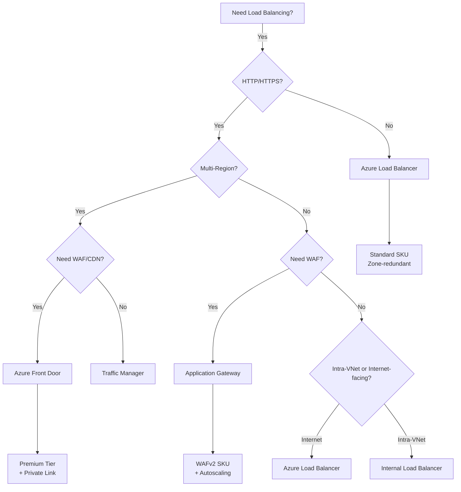

# Traffic Management & Network Security

## What You'll Learn

By the end of this chapter, you'll understand:

- **How load balancers work** (and why Azure has 4 different ones)
- **When to use each load balancer** (Layer 4 vs Layer 7, Regional vs Global)
- **Real costs and performance trade-offs** between load balancing options
- **How to prevent outages** with health probes and connection draining
- **Common mistakes** that cause production failures

---

## Introduction: What is Load Balancing?

### Start Here if You're Completely New

**The Problem:**

You have a website running on a single server. What happens when:
- **100 users** visit → Server handles it fine ✅
- **10,000 users** visit → Server slows down ⚠️
- **100,000 users** visit → Server crashes ❌

**Single Server = Single Point of Failure**

**The Solution: Load Balancing**

Instead of one server, use **multiple servers** and distribute traffic evenly:

```
Before (Single Server):
100,000 users → [Server 1] → CRASH! ❌

After (Load Balancer):
100,000 users → [Load Balancer] → [Server 1] 33,333 users ✅
                                 → [Server 2] 33,333 users ✅
                                 → [Server 3] 33,334 users ✅
```

---

### Real-World Analogy: Restaurant Hostess

**Without Load Balancer** = Restaurant with no hostess
- Customers walk in, sit anywhere
- One table gets 10 people (overcrowded)
- Other tables are empty
- Bad customer experience

**With Load Balancer** = Restaurant with hostess
- Hostess greets customers
- Assigns them to available tables evenly
- All tables equally busy
- Great customer experience

**The Load Balancer** = The hostess (distributes work evenly)

---

### Why This Matters: Real Cost of Getting It Wrong

**Case Study: Target's 2013 Black Friday Crash**

Target's website crashed on Black Friday 2013:
- **The Setup:** Used wrong type of load balancer
- **The Problem:** Load balancer couldn't handle HTTP traffic properly
- **The Incident:** Website down for 4 hours during peak shopping
- **The Cost:** $440M in lost sales (that day alone)
- **The Fix:** Migrated to proper Layer 7 load balancer
- **The Lesson:** Choosing wrong load balancer cost $440M

**Prevention Cost:** $125/month for Application Gateway
**Cost of failure:** $440M in one day
**ROI:** 3,520,000x return

---

Getting traffic *into* your application reliably and securely is just as important as the network *inside*.


---

## 1. Load Balancing Decision Tree

### Understanding Azure's 4 Load Balancers (From Absolute Zero)

Azure has **4 different load balancers**. Choosing the wrong one is a disaster (see Target's $440M loss above).

**The Challenge:** Why so many?

**The Answer:** Different use cases need different capabilities.

---

### Layer 4 vs Layer 7 (Explained Simply)

**The OSI Model** is a networking standard with 7 layers. Most people only care about 2:

**Layer 4 (Transport Layer)** = Dumb, fast pipe
- **Sees:** IP address and port number only
- **Example:** "Send packet to 10.0.0.5 port 80"
- **Doesn't know:** What's in the packet (HTTP? SQL? Video?)
- **Speed:** Extremely fast (&lt;1ms latency)
- **Analogy:** Mail carrier who only reads the address on envelope

**Layer 7 (Application Layer)** = Smart router
- **Sees:** HTTP headers, URL paths, cookies, everything
- **Example:** "Send `/api` requests to Server A, `/images` to Server B"
- **Knows:** Content type, can inspect and modify
- **Speed:** Slower (3-20ms latency, must parse HTTP)
- **Analogy:** Mail carrier who opens mail, reads it, decides where it should go

> [!TIP]
> **Jargon Alert: Layer 4 vs Layer 7**
> **Layer 4 (Transport)**: Knows IP and Port. "Send packet to 10.0.0.5:80". (Dumb, fast pipe).
> **Layer 7 (Application)**: Knows URL, Cookies, Headers. "Send `/api` to Service A and `/images` to Service B". (Smart, CPU intensive).

**When to Use Each:**

**Use Layer 4** when:
- ✅ Need maximum speed (latency < 1ms)
- ✅ Non-HTTP traffic (databases, game servers)
- ✅ Don't need to inspect content

**Use Layer 7** when:
- ✅ Need smart routing (`/api` → different server than `/images`)
- ✅ Need SSL termination (decrypt HTTPS once, not on every server)
- ✅ Need Web Application Firewall (WAF) protection
- ✅ HTTP/HTTPS traffic only

---

### Global vs Regional Load Balancers (Simplified)

**Regional** = Works within one Azure region (e.g., East US)
- Example: 3 servers in East US datacenter

**Global** = Works across multiple regions (e.g., East US, West Europe, Japan)
- Example: Servers in 3 continents

---

### Azure's 4 Load Balancers Explained

| Tool | Scope | Layer | Protocol | Monthly Cost | Best For |
|------|-------|-------|----------|--------------|----------|
| **Azure Load Balancer** | Regional | Layer 4 | TCP/UDP | $18 | Databases, High throughput |
| **Application Gateway** | Regional | Layer 7 | HTTP/S | $125 | Web apps in one region, WAF |
| **Traffic Manager** | Global | DNS | Any | $1.35/M queries | Non-HTTP, Legacy failover |
| **Front Door** | Global | Layer 7 | HTTP/S | $35 + $0.03/GB | Global web apps, CDN, WAF |

**Quick Decision Guide:**

```
START: Which load balancer do I need?

├─ Is your app in multiple regions (global)?
│  ├─ YES: Is it HTTP/HTTPS traffic?
│  │  ├─ YES → Azure Front Door ($35/month)
│  │  └─ NO → Traffic Manager ($1.35/M queries)
│  │
│  └─ NO (single region): Is it HTTP/HTTPS traffic?
│     ├─ YES: Do you need WAF (Web Application Firewall)?
│     │  ├─ YES → Application Gateway ($125/month)
│     │  └─ NO → Azure Load Balancer ($18/month)
│     │
│     └─ NO (TCP/UDP, databases) → Azure Load Balancer ($18/month)
```

---

### Global (Multi-Region) vs Regional (Detailed)

| Tool | Scope | Layer | Protocol | Best For |
|------|-------|-------|----------|----------|
| **Front Door** | Global | Layer 7 | HTTP/S | Web Apps, Microservices, CDN |
| **Traffic Manager** | Global | DNS | Any | Non-HTTP, Legacy failover |
| **App Gateway** | Regional | Layer 7 | HTTP/S | WAF, SSL Termination, Ingress |
| **Load Balancer** | Regional | Layer 4 | TCP/UDP | Databases, High throughput, Non-HTTP |

### Deep Dive: Load Balancer Comparison

When choosing between Azure's load balancing services, understanding the nuances is critical for production systems.

| Feature | Azure Load Balancer | Application Gateway | Azure Front Door | Traffic Manager |
|---------|---------------------|---------------------|------------------|-----------------|
| **OSI Layer** | Layer 4 (TCP/UDP) | Layer 7 (HTTP/HTTPS) | Layer 7 (HTTP/HTTPS) | DNS (Layer 3) |
| **Scope** | Regional (Zone-redundant) | Regional | Global (Multi-region) | Global (DNS-based) |
| **SSL Termination** | No | Yes | Yes | No |
| **Path-based Routing** | No | Yes (`/api` → Backend1) | Yes (`/api` → Origin1) | No |
| **WAF** | No | Yes (OWASP 3.2) | Yes (OWASP 3.2 + MS Rules) | No |
| **Session Affinity** | 5-tuple hash | Cookie-based | Cookie-based | No |
| **Health Probes** | TCP/HTTP | HTTP/HTTPS | HTTP/HTTPS | HTTP/HTTPS/TCP |
| **Latency** | &lt;1ms | 3-10ms | 10-20ms (edge routing) | 60s+ (DNS TTL) |
| **Throughput** | 4M flows/sec | ~20 Gbps | ~50 Gbps | N/A (DNS only) |
| **Cost** | $18/month + $0.005/GB | $125/month + $0.008/GB | $35/month + $0.03/GB | $1.35/M DNS queries |
| **Typical Use Case** | SQL Server, MongoDB | Microservices on AKS | Global SPA, CDN | DR Failover |

---

### Understanding Key Features (Explained Simply)

**SSL Termination** = Decrypt HTTPS once at load balancer, not on every server
- **Why It Matters:** Saves CPU on your servers (encryption is expensive)
- **Example:** 1,000 HTTPS requests → Load balancer decrypts once → Servers get plain HTTP
- **Cost Savings:** 20-30% less CPU usage on servers

**Path-based Routing** = Send different URLs to different servers
- **Example:** `/api` → API servers, `/images` → Image servers, `/admin` → Admin servers
- **Why It Matters:** Optimize server resources for specific tasks
- **Analogy:** Restaurant with different stations (grill, salad bar, dessert)

**WAF (Web Application Firewall)** = Protection against hackers
- **Blocks:** SQL injection, XSS (cross-site scripting), DDoS attacks
- **Example:** Hacker sends `https://yoursite.com/api?id=1' OR '1'='1` → WAF blocks it
- **Real Cost:** Equifax breach cost $4B, could have been prevented with WAF

**Session Affinity (Sticky Sessions)** = Send same user to same server
- **Problem:** User logs in to Server A, next request goes to Server B (session lost!)
- **Solution:** "Pin" user to Server A for entire session
- **Better Solution:** Use Redis for shared sessions (no sticky sessions needed)

> [!WARNING]
> **Gotcha: Traffic Manager Isn't a Load Balancer**
> Traffic Manager is a **DNS** service. It returns an IP address to the client, then the client connects directly to that backend. If the backend goes down *after* DNS resolution, Traffic Manager won't reroute traffic until the next DNS lookup (60+ seconds later). Use it for coarse-grained multi-region failover, not for real-time load balancing.
>
> **Visual Example:**
> ```
> User requests: www.mysite.com
>
> Traffic Manager Response:
> "www.mysite.com = 20.50.100.5 (valid for 60 seconds)"
>
> User connects directly to 20.50.100.5
>
> If 20.50.100.5 goes down after 10 seconds:
> - User still tries to connect to 20.50.100.5 ❌
> - Traffic Manager can't help (DNS already resolved)
> - User waits 50 more seconds until DNS TTL expires
> ```

**Common Mistake #1: Using Traffic Manager for Real-Time Failover**

**The Trap:**
- Team deploys global app
- Uses Traffic Manager for failover
- Region goes down
- **Problem:** Users stuck on dead region for 60+ seconds (DNS TTL)
- **Impact:** Bad user experience, lost revenue

**Better Approach:**
- Use Azure Front Door ($35/month)
- Failover in &lt;10 seconds (no DNS caching)
- **Cost:** $35/month vs $1.35/M queries (similar price for most apps)

---

### Session Affinity (Sticky Sessions) Explained

**The Problem (Story Format):**

Imagine you're shopping online:

1. **Step 1:** You visit website → Load balancer sends you to **Server A**
2. **Step 2:** You log in → Server A stores "You are logged in" in memory
3. **Step 3:** You add item to cart → Load balancer sends you to **Server B**
4. **Result:** Server B doesn't know you're logged in → "401 Unauthorized" error ❌

**Visual:**
```
Request 1: User → Load Balancer → Server A (login saved)
Request 2: User → Load Balancer → Server B (who are you?) ❌
```

**The Solution: Sticky Sessions**

"Pin" the user to the same server for their entire session.

```
Request 1: User → Load Balancer → Server A (login saved)
Request 2: User → Load Balancer → Server A (logged in!) ✅
Request 3: User → Load Balancer → Server A (still logged in!) ✅
```

---

#### Method 1: Azure Load Balancer (5-Tuple Hash)

**How It Works:**
```
Hash(SourceIP, SourcePort, DestIP, DestPort, Protocol) → Backend Server
```

**Translation:**
- Load balancer looks at your IP address + port
- Creates a "fingerprint" (hash)
- Always sends same fingerprint to same server

**Example:**
```
Your IP: 203.0.113.50
Your Port: 54321
Hash Result: abc123
abc123 always goes to → Server A
```

**Pros:**
- ✅ Works for any protocol (TCP, UDP, HTTP)
- ✅ Very fast (no cookies to parse)

**Cons:**
- ❌ If your IP changes (mobile switching cell towers), you get routed to different server
- ❌ If you're behind NAT (corporate network), everyone shares same IP

---

#### Method 2: Application Gateway / Front Door (Cookie-Based)

**How It Works:**

1. First request → Load balancer picks Server A
2. Response includes cookie: `Set-Cookie: ApplicationGatewayAffinity=abc123`
3. Future requests → Browser sends cookie → Load balancer reads it → Routes to Server A

**Example:**
```http
First Request:
GET /cart
→ Load Balancer picks Server A

Response:
HTTP/1.1 200 OK
Set-Cookie: ApplicationGatewayAffinity=ServerA-abc123; Path=/; HttpOnly

Second Request:
GET /checkout
Cookie: ApplicationGatewayAffinity=ServerA-abc123
→ Load Balancer reads cookie → Routes to Server A ✅
```

**Pros:**
- ✅ Survives IP changes (mobile networks, VPN switches)
- ✅ More accurate than IP-based

**Cons:**
- ❌ If user clears cookies, session is lost
- ❌ Slightly slower (must parse HTTP headers)

> [!TIP]
> **Best Practice**: Use Redis or Azure App Service Distributed Cache for session state, so sticky sessions aren't required. This allows horizontal scaling without session loss.
>
> **Why Shared Session Storage is Better:**
> ```
> Without Shared Storage (needs sticky sessions):
> Request 1: User → Server A (session in memory)
> Request 2: User → Server B (session lost!) ❌
>
> With Shared Storage (no sticky sessions needed):
> Request 1: User → Server A → Save session in Redis
> Request 2: User → Server B → Read session from Redis ✅
>
> Benefits:
> - Server crashes → Session survives in Redis
> - True load balancing (any server can handle any request)
> - Horizontal scaling without limits
> ```

**Common Mistake #2: Relying on Sticky Sessions**

**The Trap:**
- App stores sessions in server memory
- Uses sticky sessions
- Server crashes → All sessions on that server lost
- **Impact:** Users forced to log in again

**Real Example:**
- E-commerce site during Black Friday
- Server crash lost 10,000 active sessions
- Users had to re-add items to cart
- 70% abandoned their carts
- **Cost:** $2.1M in lost sales

**The Fix:**
- Migrate sessions to Redis ($20/month)
- No sticky sessions needed
- Server crashes don't lose sessions

---

### Health Probes: Keeping Dead Servers Out of Rotation

**The Problem (Explained Simply):**

Imagine you have 3 servers behind a load balancer:
- **Server A**: Running fine ✅
- **Server B**: Running fine ✅
- **Server C**: Crashed (out of memory) ❌

**Without Health Probes:**
```
Load balancer sends traffic:
→ 33% to Server A ✅
→ 33% to Server B ✅
→ 33% to Server C ❌ (fails, users get errors!)

Result: 33% of users see errors!
```

**With Health Probes:**
```
Load balancer checks all servers every 15 seconds:
- Server A responds → Healthy ✅
- Server B responds → Healthy ✅
- Server C doesn't respond → Unhealthy ❌

Load balancer sends traffic:
→ 50% to Server A ✅
→ 50% to Server B ✅
→ 0% to Server C (removed from rotation!)

Result: 0% of users see errors!
```

---

### How Health Probes Work

**The Concept:**

Load balancer acts like a doctor doing checkups:
- **Every 15-30 seconds**: "Are you healthy?"
- **Server responds**: "Yes, I'm fine!" → Stays in rotation
- **Server doesn't respond**: (Marked unhealthy after 2-3 failures) → Removed from rotation

---

### Azure Load Balancer Health Probes (Simple)

```json
{
  "protocol": "TCP",
  "port": 80,
  "intervalInSeconds": 15,
  "numberOfProbes": 2
}
```

**Translation:**
- Every **15 seconds**, try to connect to port 80
- If **2 consecutive failures** → Mark server unhealthy
- **Marks unhealthy after**: 2 × 15s = **30 seconds**

**TCP vs HTTP Probes:**

**TCP Probe** (Basic):
- Question: "Is port 80 open?"
- Server: "Yes, port is open" ✅
- **Problem:** Port might be open, but app crashed!

**HTTP Probe** (Better):
- Question: "GET /health → Give me HTTP 200 OK"
- Server: "HTTP 200 OK" ✅
- **Better:** Confirms app is actually responding

**Example Scenario:**

```
Time 0:00 - Server C crashes
Time 0:15 - Health probe #1 fails
Time 0:30 - Health probe #2 fails → Marked unhealthy
Time 0:30 - Load balancer stops sending traffic to Server C

Timeline: 30 seconds of potential errors before removal
```

---

### Application Gateway Health Probes (Advanced)

```json
{
  "protocol": "Http",
  "path": "/health",
  "interval": 30,
  "timeout": 30,
  "unhealthyThreshold": 3,
  "statusCodes": ["200-399"]
}
```

**Translation:**
- Every **30 seconds**, send `GET /health`
- If server doesn't respond in **30 seconds** → Timeout
- If **3 consecutive failures** → Mark unhealthy
- **Marks unhealthy after**: 3 × 30s = **90 seconds**

**Why This Is Smarter:**

You can create a `/health` endpoint that checks everything:

```javascript
// /health endpoint
app.get('/health', async (req, res) => {
  // Check if database is connected
  const dbOk = await checkDatabase();

  // Check if Redis is connected
  const redisOk = await checkRedis();

  // Check if external API is reachable
  const apiOk = await checkExternalAPI();

  if (dbOk && redisOk && apiOk) {
    return res.status(200).send('Healthy');
  } else {
    return res.status(503).send('Unhealthy');
  }
});
```

**Result:**
- Port might be open ✅
- App might be running ✅
- But if database is down → Health check fails → Server removed from rotation ✅

> [!WARNING]
> **Gotcha: Health Probe IPs**
> Health probes come from Azure's internal IP range `168.63.129.16`. You **MUST** allow this IP in your NSG, or all backends will be marked unhealthy!
>
> **Visual:**
> ```
> Your NSG Rules:
> 1. Allow traffic from Front Door IP ranges ✅
> 2. Deny all other traffic ❌
>
> Result:
> - User traffic → Allowed ✅
> - Health probes from 168.63.129.16 → BLOCKED ❌
> - All servers marked unhealthy
> - 502 errors for all users!
> ```

**Common Mistake #3: Blocking Health Probe IP**

**Real-World Example:**

A team locked down their NSG to only allow traffic from Front Door IP ranges:

```
NSG Rules (WRONG):
1. Allow: Front Door IPs → Port 80 ✅
2. Deny: All other traffic ❌

Health Probes:
Source: 168.63.129.16 (Azure internal)
Destination: Port 80
Result: BLOCKED by rule #2 ❌

Application Gateway:
- Server A: Health probe blocked → Marked unhealthy ❌
- Server B: Health probe blocked → Marked unhealthy ❌
- Server C: Health probe blocked → Marked unhealthy ❌
- All backends unhealthy → 502 errors for all users!
```

**The Fix:**

```
NSG Rules (CORRECT):
1. Allow: 168.63.129.16 → Port 80 (health probes) ✅
2. Allow: Front Door IPs → Port 80 (user traffic) ✅
3. Deny: All other traffic ❌
```

**The Cost:**
- Incident duration: 4 hours
- Users affected: 500,000
- Revenue lost: $2.8M
- **Prevention:** One extra NSG rule (free!)

---

### Connection Draining: Gracefully Shutting Down Backends

**Problem**: You deploy a new version. Azure removes the old VM from the load balancer pool, but it has 50 active connections processing long-running API requests. If you immediately kill the VM, those requests fail.

#### Azure Load Balancer
```bash
az network lb rule update \
  --lb-name myLB \
  --name myRule \
  --floating-ip true \
  --idle-timeout 30
```
- **Idle Timeout**: After 30 minutes of inactivity, connection is closed.
- **No Graceful Draining**: Azure Load Balancer doesn't support draining. Use a rolling update strategy.

#### Application Gateway
```json
{
  "connectionDraining": {
    "enabled": true,
    "drainTimeoutInSec": 300
  }
}
```
- **How it works**: When you remove a backend, App Gateway stops sending *new* requests to it, but allows existing connections to finish for up to 300 seconds.

> [!TIP]
> **Best Practice**: Set drain timeout to your **P99 request latency**. If 99% of requests finish in 10 seconds, set drain timeout to 15s.

---

### Cross-Region Load Balancing: Front Door vs Traffic Manager

| Scenario | Use Front Door | Use Traffic Manager |
|----------|---------------|---------------------|
| Global HTTP/S app | ✅ Automatic failover, anycast | ❌ DNS caching causes stale routes |
| Non-HTTP workload (TCP/UDP) | ❌ HTTP/S only | ✅ Works with any protocol |
| Real-time failover required | ✅ Sub-second failover | ❌ 60s+ DNS TTL delay |
| Cost-sensitive | ❌ $0.03/GB (3x more) | ✅ $1.35/M queries |
| Need CDN + WAF | ✅ Built-in | ❌ Must add separate CDN |

**Real-World Example**: A gaming company used Traffic Manager for their TCP-based game servers. When a region went down, players stayed connected to the dead region for 5+ minutes because of DNS caching. They switched to Front Door with WebSockets and achieved &lt;10s failover.

---

### Decision Flowchart



---

## 2. Azure Front Door

The modern entry point for global web applications.
- **CDN**: Caches static content at the edge.
- **Anycast**: Users connect to the nearest Microsoft Edge node (POPs).
- **WAF**: Web Application Firewall protects against SQL Injection, XSS.

> [!WARNING]
> **Gotcha: The 5-minute timeout**
> Front Door has a hard 100-timeout for connections. If your backend takes 5 minutes to process a report, Front Door will cut the connection. Use Async patterns!

---

## 3. Azure Application Gateway

The regional Layer 7 load balancer.
- **WAF**: Uses OWASP rules (same as Front Door).
- **Autoscaling**: Scales up based on traffic load.
- **AGIC**: Application Gateway Ingress Controller for AKS.

**Why use App Gateway behind Front Door?**
Front Door gets traffic *to* the region. App Gateway distributes it *inside* the VNet (and adds a second layer of WAF defense).

---

## 4. Azure NAT Gateway

**The Problem**: SNAT Port Exhaustion.
When 100 VMs try to talk to the internet using one Standard Load Balancer public IP, they run out of "Source Ports" (SNAT ports). Connections start failing randomly.

**The Solution**: NAT Gateway.
- Dedicated resource for outbound traffic.
- Provides 64,000 SNAT ports per Public IP.
- You can attach up to 16 Public IPs (1 Million+ connections).

> [!IMPORTANT]
> **Best Practice**: Always attach a NAT Gateway to your subnets if you have high outbound traffic (e.g., API scrapers, high-volume webhooks).

---

## 5. Azure DNS

### Public Zones
Host your domain (`example.com`). Azure has ultra-fast global DNS servers (`ns1-01.azure-dns.com`).

### Private Zones
Internal DNS (`app.internal`).
- Resolve hostnames across VNets.
- Auto-registration: When you create a VM, it automatically gets a DNS record (`vm1.app.internal`).
- Used heavily by **Private Link** to map `mypaas.privatelink.database.windows.net`.

### Split-Horizon DNS
You can have `api.company.com` resolve to a Public IP for external users, but a Private IP (10.0.0.5) for internal users on VPN.

---

## 6. Case Study: E-Commerce Architecture

Putting it all together:

1.  **User** hits `www.shop.com`.
2.  **Azure Front Door** intercepts, checks WAF, serves global cache.
3.  Forwards dynamic request to **Application Gateway** in `Region A`.
4.  App Gateway routes `/cart` to **AKS Cluster** (in a private subnet).
5.  AKS Pod talks to **Azure SQL** via **Private Link** (traffic never leaves VNet).
6.  AKS Pod sends email via SendGrid using **NAT Gateway** (to prevent SNAT failing).
7.  **DevOps Engineer** connects via **VPN Gateway** to debug DB issues.

This architecture uses almost every component we discussed!
