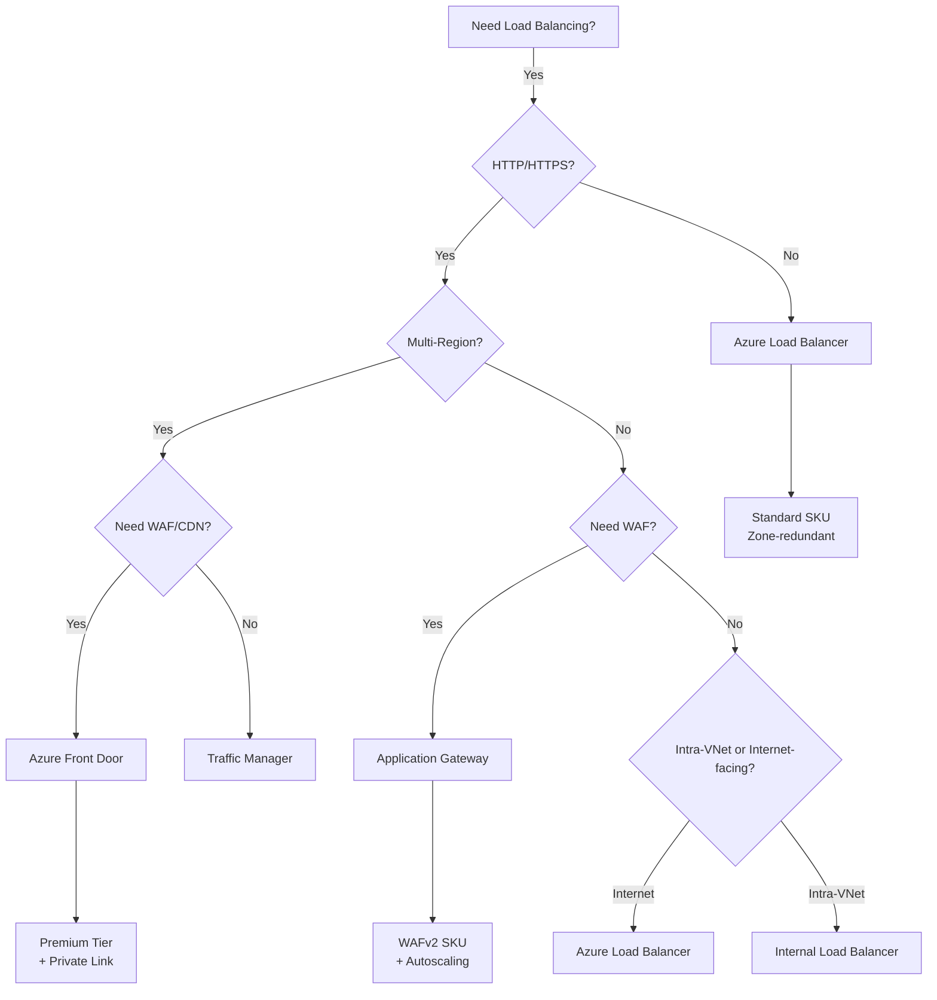

# Traffic Management & Network Security

Getting traffic *into* your application reliably and securely is just as important as the network *inside*.


---

## 1. Load Balancing Decision Tree

Azure has 4 load balancers. Choosing the wrong one is a disaster.

### Global (Multi-Region) vs Regional

| Tool | Scope | Layer | Protocol | Best For |
|------|-------|-------|----------|----------|
| **Front Door** | Global | Layer 7 | HTTP/S | Web Apps, Microservices, CDN |
| **Traffic Manager** | Global | DNS | Any | Non-HTTP, Legacy failover |
| **App Gateway** | Regional | Layer 7 | HTTP/S | WAF, SSL Termination, Ingress |
| **Load Balancer** | Regional | Layer 4 | TCP/UDP | Databases, High throughput, Non-HTTP |

> [!TIP]
> **Jargon Alert: Layer 4 vs Layer 7**
> **Layer 4 (Transport)**: Knows IP and Port. "Send packet to 10.0.0.5:80". (Dumb, fast pipe).
> **Layer 7 (Application)**: Knows URL, Cookies, Headers. "Send `/api` to Service A and `/images` to Service B". (Smart, CPU intensive).

### Deep Dive: Load Balancer Comparison

When choosing between Azure's load balancing services, understanding the nuances is critical for production systems.

| Feature | Azure Load Balancer | Application Gateway | Azure Front Door | Traffic Manager |
|---------|---------------------|---------------------|------------------|-----------------|
| **OSI Layer** | Layer 4 (TCP/UDP) | Layer 7 (HTTP/HTTPS) | Layer 7 (HTTP/HTTPS) | DNS (Layer 3) |
| **Scope** | Regional (Zone-redundant) | Regional | Global (Multi-region) | Global (DNS-based) |
| **SSL Termination** | No | Yes | Yes | No |
| **Path-based Routing** | No | Yes (`/api` → Backend1) | Yes (`/api` → Origin1) | No |
| **WAF** | No | Yes (OWASP 3.2) | Yes (OWASP 3.2 + MS Rules) | No |
| **Session Affinity** | 5-tuple hash | Cookie-based | Cookie-based | No |
| **Health Probes** | TCP/HTTP | HTTP/HTTPS | HTTP/HTTPS | HTTP/HTTPS/TCP |
| **Latency** | &lt;1ms | 3-10ms | 10-20ms (edge routing) | 60s+ (DNS TTL) |
| **Throughput** | 4M flows/sec | ~20 Gbps | ~50 Gbps | N/A (DNS only) |
| **Cost** | $18/month + $0.005/GB | $125/month + $0.008/GB | $35/month + $0.03/GB | $1.35/M DNS queries |
| **Typical Use Case** | SQL Server, MongoDB | Microservices on AKS | Global SPA, CDN | DR Failover |

> [!WARNING]
> **Gotcha: Traffic Manager Isn't a Load Balancer**
> Traffic Manager is a **DNS** service. It returns an IP address to the client, then the client connects directly to that backend. If the backend goes down *after* DNS resolution, Traffic Manager won't reroute traffic until the next DNS lookup (60+ seconds later). Use it for coarse-grained multi-region failover, not for real-time load balancing.

---

### Session Affinity (Sticky Sessions)

**Problem**: A user logs in to Server A. Their next request goes to Server B, which doesn't have their session → 401 Unauthorized.

#### Azure Load Balancer: 5-Tuple Hash
```
Hash(SourceIP, SourcePort, DestIP, DestPort, Protocol) → Backend Server
```
- **Pro**: Works for any protocol (TCP, UDP).
- **Con**: If the user's public IP changes (mobile switching networks), they get routed to a different backend.

#### Application Gateway / Front Door: Cookie-Based Affinity
```http
Set-Cookie: ApplicationGatewayAffinity=abc123; Path=/; HttpOnly
```
- **Pro**: Survives IP changes (mobile networks).
- **Con**: If user clears cookies, session is lost.
- **Pro**: More accurate than IP-based routing.

> [!TIP]
> **Best Practice**: Use Redis or Azure App Service Distributed Cache for session state, so sticky sessions aren't required. This allows horizontal scaling without session loss.

---

### Health Probes: Keeping Dead Servers Out of Rotation

All Azure load balancers support health probes, but the implementation differs.

#### Azure Load Balancer
```json
{
  "protocol": "TCP",
  "port": 80,
  "intervalInSeconds": 15,
  "numberOfProbes": 2
}
```
- **Marks unhealthy after**: 2 failures × 15s = 30 seconds
- **TCP vs HTTP**: TCP only checks "is port open?". HTTP checks "did I get a 200 OK?".

#### Application Gateway
```json
{
  "protocol": "Http",
  "path": "/health",
  "interval": 30,
  "timeout": 30,
  "unhealthyThreshold": 3,
  "statusCodes": ["200-399"]
}
```
- **Smarter**: Can check `/health` endpoint for application-specific logic ("Is DB connected?").
- **Timeout**: If backend doesn't respond in 30s, marked unhealthy.

> [!WARNING]
> **Gotcha: Health Probe IPs**
> Health probes come from Azure's internal IP range `168.63.129.16`. You **MUST** allow this IP in your NSG, or all backends will be marked unhealthy!

**Real-World Example**: A team locked down their NSG to only allow traffic from Front Door. Health probes failed, and App Gateway marked all backends unhealthy → 502 errors for all users.

---

### Connection Draining: Gracefully Shutting Down Backends

**Problem**: You deploy a new version. Azure removes the old VM from the load balancer pool, but it has 50 active connections processing long-running API requests. If you immediately kill the VM, those requests fail.

#### Azure Load Balancer
```bash
az network lb rule update \
  --lb-name myLB \
  --name myRule \
  --floating-ip true \
  --idle-timeout 30
```
- **Idle Timeout**: After 30 minutes of inactivity, connection is closed.
- **No Graceful Draining**: Azure Load Balancer doesn't support draining. Use a rolling update strategy.

#### Application Gateway
```json
{
  "connectionDraining": {
    "enabled": true,
    "drainTimeoutInSec": 300
  }
}
```
- **How it works**: When you remove a backend, App Gateway stops sending *new* requests to it, but allows existing connections to finish for up to 300 seconds.

> [!TIP]
> **Best Practice**: Set drain timeout to your **P99 request latency**. If 99% of requests finish in 10 seconds, set drain timeout to 15s.

---

### Cross-Region Load Balancing: Front Door vs Traffic Manager

| Scenario | Use Front Door | Use Traffic Manager |
|----------|---------------|---------------------|
| Global HTTP/S app | ✅ Automatic failover, anycast | ❌ DNS caching causes stale routes |
| Non-HTTP workload (TCP/UDP) | ❌ HTTP/S only | ✅ Works with any protocol |
| Real-time failover required | ✅ Sub-second failover | ❌ 60s+ DNS TTL delay |
| Cost-sensitive | ❌ $0.03/GB (3x more) | ✅ $1.35/M queries |
| Need CDN + WAF | ✅ Built-in | ❌ Must add separate CDN |

**Real-World Example**: A gaming company used Traffic Manager for their TCP-based game servers. When a region went down, players stayed connected to the dead region for 5+ minutes because of DNS caching. They switched to Front Door with WebSockets and achieved &lt;10s failover.

---

### Decision Flowchart



---

## 2. Azure Front Door

The modern entry point for global web applications.
- **CDN**: Caches static content at the edge.
- **Anycast**: Users connect to the nearest Microsoft Edge node (POPs).
- **WAF**: Web Application Firewall protects against SQL Injection, XSS.

> [!WARNING]
> **Gotcha: The 5-minute timeout**
> Front Door has a hard 100-timeout for connections. If your backend takes 5 minutes to process a report, Front Door will cut the connection. Use Async patterns!

---

## 3. Azure Application Gateway

The regional Layer 7 load balancer.
- **WAF**: Uses OWASP rules (same as Front Door).
- **Autoscaling**: Scales up based on traffic load.
- **AGIC**: Application Gateway Ingress Controller for AKS.

**Why use App Gateway behind Front Door?**
Front Door gets traffic *to* the region. App Gateway distributes it *inside* the VNet (and adds a second layer of WAF defense).

---

## 4. Azure NAT Gateway

**The Problem**: SNAT Port Exhaustion.
When 100 VMs try to talk to the internet using one Standard Load Balancer public IP, they run out of "Source Ports" (SNAT ports). Connections start failing randomly.

**The Solution**: NAT Gateway.
- Dedicated resource for outbound traffic.
- Provides 64,000 SNAT ports per Public IP.
- You can attach up to 16 Public IPs (1 Million+ connections).

> [!IMPORTANT]
> **Best Practice**: Always attach a NAT Gateway to your subnets if you have high outbound traffic (e.g., API scrapers, high-volume webhooks).

---

## 5. Azure DNS

### Public Zones
Host your domain (`example.com`). Azure has ultra-fast global DNS servers (`ns1-01.azure-dns.com`).

### Private Zones
Internal DNS (`app.internal`).
- Resolve hostnames across VNets.
- Auto-registration: When you create a VM, it automatically gets a DNS record (`vm1.app.internal`).
- Used heavily by **Private Link** to map `mypaas.privatelink.database.windows.net`.

### Split-Horizon DNS
You can have `api.company.com` resolve to a Public IP for external users, but a Private IP (10.0.0.5) for internal users on VPN.

---

## 6. Case Study: E-Commerce Architecture

Putting it all together:

1.  **User** hits `www.shop.com`.
2.  **Azure Front Door** intercepts, checks WAF, serves global cache.
3.  Forwards dynamic request to **Application Gateway** in `Region A`.
4.  App Gateway routes `/cart` to **AKS Cluster** (in a private subnet).
5.  AKS Pod talks to **Azure SQL** via **Private Link** (traffic never leaves VNet).
6.  AKS Pod sends email via SendGrid using **NAT Gateway** (to prevent SNAT failing).
7.  **DevOps Engineer** connects via **VPN Gateway** to debug DB issues.

This architecture uses almost every component we discussed!
