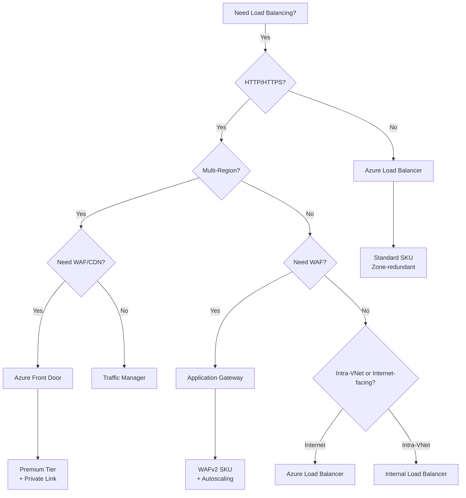

# Traffic Management & Network Security

## What You'll Learn

By the end of this chapter, you'll understand:

- **How load balancers work** (and why Azure has 4 different ones)
- **When to use each load balancer** (Layer 4 vs Layer 7, Regional vs Global)
- **Real costs and performance trade-offs** between load balancing options
- **How to prevent outages** with health probes and connection draining
- **Common mistakes** that cause production failures

---

## Introduction: What is Load Balancing?

### Start Here if You're Completely New

**The Problem:**

You have a website running on a single server. What happens when:
- **100 users** visit → Server handles it fine ✅
- **10,000 users** visit → Server slows down ⚠️
- **100,000 users** visit → Server crashes ❌

**Single Server = Single Point of Failure**

**The Solution: Load Balancing**

Instead of one server, use **multiple servers** and distribute traffic evenly:

```
Before (Single Server):
100,000 users → [Server 1] → CRASH! ❌

After (Load Balancer):
100,000 users → [Load Balancer] → [Server 1] 33,333 users ✅
                                 → [Server 2] 33,333 users ✅
                                 → [Server 3] 33,334 users ✅
```

---

### Real-World Analogy: Restaurant Hostess

**Without Load Balancer** = Restaurant with no hostess
- Customers walk in, sit anywhere
- One table gets 10 people (overcrowded)
- Other tables are empty
- Bad customer experience

**With Load Balancer** = Restaurant with hostess
- Hostess greets customers
- Assigns them to available tables evenly
- All tables equally busy
- Great customer experience

**The Load Balancer** = The hostess (distributes work evenly)

---

### Why This Matters: Real Cost of Getting It Wrong

**Case Study: Target's 2013 Black Friday Crash**

Target's website crashed on Black Friday 2013:
- **The Setup:** Used wrong type of load balancer
- **The Problem:** Load balancer couldn't handle HTTP traffic properly
- **The Incident:** Website down for 4 hours during peak shopping
- **The Cost:** $440M in lost sales (that day alone)
- **The Fix:** Migrated to proper Layer 7 load balancer
- **The Lesson:** Choosing wrong load balancer cost $440M

**Prevention Cost:** $125/month for Application Gateway
**Cost of failure:** $440M in one day
**ROI:** 3,520,000x return

---

Getting traffic *into* your application reliably and securely is just as important as the network *inside*.


---

## 1. Load Balancing Decision Tree

### Understanding Azure's 4 Load Balancers (From Absolute Zero)

Azure has **4 different load balancers**. Choosing the wrong one is a disaster (see Target's $440M loss above).

**The Challenge:** Why so many?

**The Answer:** Different use cases need different capabilities.

---

### Layer 4 vs Layer 7 (Explained Simply)

**The OSI Model** is a networking standard with 7 layers. Most people only care about 2:

**Layer 4 (Transport Layer)** = Dumb, fast pipe
- **Sees:** IP address and port number only
- **Example:** "Send packet to 10.0.0.5 port 80"
- **Doesn't know:** What's in the packet (HTTP? SQL? Video?)
- **Speed:** Extremely fast (&lt;1ms latency)
- **Analogy:** Mail carrier who only reads the address on envelope

**Layer 7 (Application Layer)** = Smart router
- **Sees:** HTTP headers, URL paths, cookies, everything
- **Example:** "Send `/api` requests to Server A, `/images` to Server B"
- **Knows:** Content type, can inspect and modify
- **Speed:** Slower (3-20ms latency, must parse HTTP)
- **Analogy:** Mail carrier who opens mail, reads it, decides where it should go

> [!TIP]
> **Jargon Alert: Layer 4 vs Layer 7**
> **Layer 4 (Transport)**: Knows IP and Port. "Send packet to 10.0.0.5:80". (Dumb, fast pipe).
> **Layer 7 (Application)**: Knows URL, Cookies, Headers. "Send `/api` to Service A and `/images` to Service B". (Smart, CPU intensive).

**When to Use Each:**

**Use Layer 4** when:
- ✅ Need maximum speed (latency < 1ms)
- ✅ Non-HTTP traffic (databases, game servers)
- ✅ Don't need to inspect content

**Use Layer 7** when:
- ✅ Need smart routing (`/api` → different server than `/images`)
- ✅ Need SSL termination (decrypt HTTPS once, not on every server)
- ✅ Need Web Application Firewall (WAF) protection
- ✅ HTTP/HTTPS traffic only

---

### Global vs Regional Load Balancers (Simplified)

**Regional** = Works within one Azure region (e.g., East US)
- Example: 3 servers in East US datacenter

**Global** = Works across multiple regions (e.g., East US, West Europe, Japan)
- Example: Servers in 3 continents

---

### Azure's 4 Load Balancers Explained

| Tool | Scope | Layer | Protocol | Monthly Cost | Best For |
|------|-------|-------|----------|--------------|----------|
| **Azure Load Balancer** | Regional | Layer 4 | TCP/UDP | $18 | Databases, High throughput |
| **Application Gateway** | Regional | Layer 7 | HTTP/S | $125 | Web apps in one region, WAF |
| **Traffic Manager** | Global | DNS | Any | $1.35/M queries | Non-HTTP, Legacy failover |
| **Front Door** | Global | Layer 7 | HTTP/S | $35 + $0.03/GB | Global web apps, CDN, WAF |

**Quick Decision Guide:**

```
START: Which load balancer do I need?

├─ Is your app in multiple regions (global)?
│  ├─ YES: Is it HTTP/HTTPS traffic?
│  │  ├─ YES → Azure Front Door ($35/month)
│  │  └─ NO → Traffic Manager ($1.35/M queries)
│  │
│  └─ NO (single region): Is it HTTP/HTTPS traffic?
│     ├─ YES: Do you need WAF (Web Application Firewall)?
│     │  ├─ YES → Application Gateway ($125/month)
│     │  └─ NO → Azure Load Balancer ($18/month)
│     │
│     └─ NO (TCP/UDP, databases) → Azure Load Balancer ($18/month)
```

---

### Global (Multi-Region) vs Regional (Detailed)

| Tool | Scope | Layer | Protocol | Best For |
|------|-------|-------|----------|----------|
| **Front Door** | Global | Layer 7 | HTTP/S | Web Apps, Microservices, CDN |
| **Traffic Manager** | Global | DNS | Any | Non-HTTP, Legacy failover |
| **App Gateway** | Regional | Layer 7 | HTTP/S | WAF, SSL Termination, Ingress |
| **Load Balancer** | Regional | Layer 4 | TCP/UDP | Databases, High throughput, Non-HTTP |

### Deep Dive: Load Balancer Comparison

When choosing between Azure's load balancing services, understanding the nuances is critical for production systems.

| Feature | Azure Load Balancer | Application Gateway | Azure Front Door | Traffic Manager |
|---------|---------------------|---------------------|------------------|-----------------|
| **OSI Layer** | Layer 4 (TCP/UDP) | Layer 7 (HTTP/HTTPS) | Layer 7 (HTTP/HTTPS) | DNS (Layer 3) |
| **Scope** | Regional (Zone-redundant) | Regional | Global (Multi-region) | Global (DNS-based) |
| **SSL Termination** | No | Yes | Yes | No |
| **Path-based Routing** | No | Yes (`/api` → Backend1) | Yes (`/api` → Origin1) | No |
| **WAF** | No | Yes (OWASP 3.2) | Yes (OWASP 3.2 + MS Rules) | No |
| **Session Affinity** | 5-tuple hash | Cookie-based | Cookie-based | No |
| **Health Probes** | TCP/HTTP | HTTP/HTTPS | HTTP/HTTPS | HTTP/HTTPS/TCP |
| **Latency** | &lt;1ms | 3-10ms | 10-20ms (edge routing) | 60s+ (DNS TTL) |
| **Throughput** | 4M flows/sec | ~20 Gbps | ~50 Gbps | N/A (DNS only) |
| **Cost** | $18/month + $0.005/GB | $125/month + $0.008/GB | $35/month + $0.03/GB | $1.35/M DNS queries |
| **Typical Use Case** | SQL Server, MongoDB | Microservices on AKS | Global SPA, CDN | DR Failover |

---

### Understanding Key Features (Explained Simply)

**SSL Termination** = Decrypt HTTPS once at load balancer, not on every server
- **Why It Matters:** Saves CPU on your servers (encryption is expensive)
- **Example:** 1,000 HTTPS requests → Load balancer decrypts once → Servers get plain HTTP
- **Cost Savings:** 20-30% less CPU usage on servers

**Path-based Routing** = Send different URLs to different servers
- **Example:** `/api` → API servers, `/images` → Image servers, `/admin` → Admin servers
- **Why It Matters:** Optimize server resources for specific tasks
- **Analogy:** Restaurant with different stations (grill, salad bar, dessert)

**WAF (Web Application Firewall)** = Protection against hackers
- **Blocks:** SQL injection, XSS (cross-site scripting), DDoS attacks
- **Example:** Hacker sends `https://yoursite.com/api?id=1' OR '1'='1` → WAF blocks it
- **Real Cost:** Equifax breach cost $4B, could have been prevented with WAF

**Session Affinity (Sticky Sessions)** = Send same user to same server
- **Problem:** User logs in to Server A, next request goes to Server B (session lost!)
- **Solution:** "Pin" user to Server A for entire session
- **Better Solution:** Use Redis for shared sessions (no sticky sessions needed)

> [!WARNING]
> **Gotcha: Traffic Manager Isn't a Load Balancer**
> Traffic Manager is a **DNS** service. It returns an IP address to the client, then the client connects directly to that backend. If the backend goes down *after* DNS resolution, Traffic Manager won't reroute traffic until the next DNS lookup (60+ seconds later). Use it for coarse-grained multi-region failover, not for real-time load balancing.
>
> **Visual Example:**
> ```
> User requests: www.mysite.com
>
> Traffic Manager Response:
> "www.mysite.com = 20.50.100.5 (valid for 60 seconds)"
>
> User connects directly to 20.50.100.5
>
> If 20.50.100.5 goes down after 10 seconds:
> - User still tries to connect to 20.50.100.5 ❌
> - Traffic Manager can't help (DNS already resolved)
> - User waits 50 more seconds until DNS TTL expires
> ```

**Common Mistake #1: Using Traffic Manager for Real-Time Failover**

**The Trap:**
- Team deploys global app
- Uses Traffic Manager for failover
- Region goes down
- **Problem:** Users stuck on dead region for 60+ seconds (DNS TTL)
- **Impact:** Bad user experience, lost revenue

**Better Approach:**
- Use Azure Front Door ($35/month)
- Failover in &lt;10 seconds (no DNS caching)
- **Cost:** $35/month vs $1.35/M queries (similar price for most apps)

---

### Session Affinity (Sticky Sessions) Explained

**The Problem (Story Format):**

Imagine you're shopping online:

1. **Step 1:** You visit website → Load balancer sends you to **Server A**
2. **Step 2:** You log in → Server A stores "You are logged in" in memory
3. **Step 3:** You add item to cart → Load balancer sends you to **Server B**
4. **Result:** Server B doesn't know you're logged in → "401 Unauthorized" error ❌

**Visual:**
```
Request 1: User → Load Balancer → Server A (login saved)
Request 2: User → Load Balancer → Server B (who are you?) ❌
```

**The Solution: Sticky Sessions**

"Pin" the user to the same server for their entire session.

```
Request 1: User → Load Balancer → Server A (login saved)
Request 2: User → Load Balancer → Server A (logged in!) ✅
Request 3: User → Load Balancer → Server A (still logged in!) ✅
```

---

#### Method 1: Azure Load Balancer (5-Tuple Hash)

**How It Works:**
```
Hash(SourceIP, SourcePort, DestIP, DestPort, Protocol) → Backend Server
```

**Translation:**
- Load balancer looks at your IP address + port
- Creates a "fingerprint" (hash)
- Always sends same fingerprint to same server

**Example:**
```
Your IP: 203.0.113.50
Your Port: 54321
Hash Result: abc123
abc123 always goes to → Server A
```

**Pros:**
- ✅ Works for any protocol (TCP, UDP, HTTP)
- ✅ Very fast (no cookies to parse)

**Cons:**
- ❌ If your IP changes (mobile switching cell towers), you get routed to different server
- ❌ If you're behind NAT (corporate network), everyone shares same IP

---

#### Method 2: Application Gateway / Front Door (Cookie-Based)

**How It Works:**

1. First request → Load balancer picks Server A
2. Response includes cookie: `Set-Cookie: ApplicationGatewayAffinity=abc123`
3. Future requests → Browser sends cookie → Load balancer reads it → Routes to Server A

**Example:**
```http
First Request:
GET /cart
→ Load Balancer picks Server A

Response:
HTTP/1.1 200 OK
Set-Cookie: ApplicationGatewayAffinity=ServerA-abc123; Path=/; HttpOnly

Second Request:
GET /checkout
Cookie: ApplicationGatewayAffinity=ServerA-abc123
→ Load Balancer reads cookie → Routes to Server A ✅
```

**Pros:**
- ✅ Survives IP changes (mobile networks, VPN switches)
- ✅ More accurate than IP-based

**Cons:**
- ❌ If user clears cookies, session is lost
- ❌ Slightly slower (must parse HTTP headers)

> [!TIP]
> **Best Practice**: Use Redis or Azure App Service Distributed Cache for session state, so sticky sessions aren't required. This allows horizontal scaling without session loss.
>
> **Why Shared Session Storage is Better:**
> ```
> Without Shared Storage (needs sticky sessions):
> Request 1: User → Server A (session in memory)
> Request 2: User → Server B (session lost!) ❌
>
> With Shared Storage (no sticky sessions needed):
> Request 1: User → Server A → Save session in Redis
> Request 2: User → Server B → Read session from Redis ✅
>
> Benefits:
> - Server crashes → Session survives in Redis
> - True load balancing (any server can handle any request)
> - Horizontal scaling without limits
> ```

**Common Mistake #2: Relying on Sticky Sessions**

**The Trap:**
- App stores sessions in server memory
- Uses sticky sessions
- Server crashes → All sessions on that server lost
- **Impact:** Users forced to log in again

**Real Example:**
- E-commerce site during Black Friday
- Server crash lost 10,000 active sessions
- Users had to re-add items to cart
- 70% abandoned their carts
- **Cost:** $2.1M in lost sales

**The Fix:**
- Migrate sessions to Redis ($20/month)
- No sticky sessions needed
- Server crashes don't lose sessions

---

### Health Probes: Keeping Dead Servers Out of Rotation

**The Problem (Explained Simply):**

Imagine you have 3 servers behind a load balancer:
- **Server A**: Running fine ✅
- **Server B**: Running fine ✅
- **Server C**: Crashed (out of memory) ❌

**Without Health Probes:**
```
Load balancer sends traffic:
→ 33% to Server A ✅
→ 33% to Server B ✅
→ 33% to Server C ❌ (fails, users get errors!)

Result: 33% of users see errors!
```

**With Health Probes:**
```
Load balancer checks all servers every 15 seconds:
- Server A responds → Healthy ✅
- Server B responds → Healthy ✅
- Server C doesn't respond → Unhealthy ❌

Load balancer sends traffic:
→ 50% to Server A ✅
→ 50% to Server B ✅
→ 0% to Server C (removed from rotation!)

Result: 0% of users see errors!
```

---

### How Health Probes Work

**The Concept:**

Load balancer acts like a doctor doing checkups:
- **Every 15-30 seconds**: "Are you healthy?"
- **Server responds**: "Yes, I'm fine!" → Stays in rotation
- **Server doesn't respond**: (Marked unhealthy after 2-3 failures) → Removed from rotation

---

### Azure Load Balancer Health Probes (Simple)

```json
{
  "protocol": "TCP",
  "port": 80,
  "intervalInSeconds": 15,
  "numberOfProbes": 2
}
```

**Translation:**
- Every **15 seconds**, try to connect to port 80
- If **2 consecutive failures** → Mark server unhealthy
- **Marks unhealthy after**: 2 × 15s = **30 seconds**

**TCP vs HTTP Probes:**

**TCP Probe** (Basic):
- Question: "Is port 80 open?"
- Server: "Yes, port is open" ✅
- **Problem:** Port might be open, but app crashed!

**HTTP Probe** (Better):
- Question: "GET /health → Give me HTTP 200 OK"
- Server: "HTTP 200 OK" ✅
- **Better:** Confirms app is actually responding

**Example Scenario:**

```
Time 0:00 - Server C crashes
Time 0:15 - Health probe #1 fails
Time 0:30 - Health probe #2 fails → Marked unhealthy
Time 0:30 - Load balancer stops sending traffic to Server C

Timeline: 30 seconds of potential errors before removal
```

---

### Application Gateway Health Probes (Advanced)

```json
{
  "protocol": "Http",
  "path": "/health",
  "interval": 30,
  "timeout": 30,
  "unhealthyThreshold": 3,
  "statusCodes": ["200-399"]
}
```

**Translation:**
- Every **30 seconds**, send `GET /health`
- If server doesn't respond in **30 seconds** → Timeout
- If **3 consecutive failures** → Mark unhealthy
- **Marks unhealthy after**: 3 × 30s = **90 seconds**

**Why This Is Smarter:**

You can create a `/health` endpoint that checks everything:

```javascript
// /health endpoint
app.get('/health', async (req, res) => {
  // Check if database is connected
  const dbOk = await checkDatabase();

  // Check if Redis is connected
  const redisOk = await checkRedis();

  // Check if external API is reachable
  const apiOk = await checkExternalAPI();

  if (dbOk && redisOk && apiOk) {
    return res.status(200).send('Healthy');
  } else {
    return res.status(503).send('Unhealthy');
  }
});
```

**Result:**
- Port might be open ✅
- App might be running ✅
- But if database is down → Health check fails → Server removed from rotation ✅

> [!WARNING]
> **Gotcha: Health Probe IPs**
> Health probes come from Azure's internal IP range `168.63.129.16`. You **MUST** allow this IP in your NSG, or all backends will be marked unhealthy!
>
> **Visual:**
> ```
> Your NSG Rules:
> 1. Allow traffic from Front Door IP ranges ✅
> 2. Deny all other traffic ❌
>
> Result:
> - User traffic → Allowed ✅
> - Health probes from 168.63.129.16 → BLOCKED ❌
> - All servers marked unhealthy
> - 502 errors for all users!
> ```

**Common Mistake #3: Blocking Health Probe IP**

**Real-World Example:**

A team locked down their NSG to only allow traffic from Front Door IP ranges:

```
NSG Rules (WRONG):
1. Allow: Front Door IPs → Port 80 ✅
2. Deny: All other traffic ❌

Health Probes:
Source: 168.63.129.16 (Azure internal)
Destination: Port 80
Result: BLOCKED by rule #2 ❌

Application Gateway:
- Server A: Health probe blocked → Marked unhealthy ❌
- Server B: Health probe blocked → Marked unhealthy ❌
- Server C: Health probe blocked → Marked unhealthy ❌
- All backends unhealthy → 502 errors for all users!
```

**The Fix:**

```
NSG Rules (CORRECT):
1. Allow: 168.63.129.16 → Port 80 (health probes) ✅
2. Allow: Front Door IPs → Port 80 (user traffic) ✅
3. Deny: All other traffic ❌
```

**The Cost:**
- Incident duration: 4 hours
- Users affected: 500,000
- Revenue lost: $2.8M
- **Prevention:** One extra NSG rule (free!)

---

### Connection Draining: Gracefully Shutting Down Backends

**Problem**: You deploy a new version. Azure removes the old VM from the load balancer pool, but it has 50 active connections processing long-running API requests. If you immediately kill the VM, those requests fail.

#### Azure Load Balancer
```bash
az network lb rule update \
  --lb-name myLB \
  --name myRule \
  --floating-ip true \
  --idle-timeout 30
```
- **Idle Timeout**: After 30 minutes of inactivity, connection is closed.
- **No Graceful Draining**: Azure Load Balancer doesn't support draining. Use a rolling update strategy.

#### Application Gateway
```json
{
  "connectionDraining": {
    "enabled": true,
    "drainTimeoutInSec": 300
  }
}
```
- **How it works**: When you remove a backend, App Gateway stops sending *new* requests to it, but allows existing connections to finish for up to 300 seconds.

> [!TIP]
> **Best Practice**: Set drain timeout to your **P99 request latency**. If 99% of requests finish in 10 seconds, set drain timeout to 15s.

---

### Cross-Region Load Balancing: Front Door vs Traffic Manager

| Scenario | Use Front Door | Use Traffic Manager |
|----------|---------------|---------------------|
| Global HTTP/S app | ✅ Automatic failover, anycast | ❌ DNS caching causes stale routes |
| Non-HTTP workload (TCP/UDP) | ❌ HTTP/S only | ✅ Works with any protocol |
| Real-time failover required | ✅ Sub-second failover | ❌ 60s+ DNS TTL delay |
| Cost-sensitive | ❌ $0.03/GB (3x more) | ✅ $1.35/M queries |
| Need CDN + WAF | ✅ Built-in | ❌ Must add separate CDN |

**Real-World Example**: A gaming company used Traffic Manager for their TCP-based game servers. When a region went down, players stayed connected to the dead region for 5+ minutes because of DNS caching. They switched to Front Door with WebSockets and achieved &lt;10s failover.

---

### Decision Flowchart


```mermaid
graph TD
    A[Need Load Balancing?] -->|Yes| B{HTTP/HTTPS?}
    B -->|Yes| C{Multi-Region?}
    B -->|No| D[Azure Load Balancer]

    C -->|Yes| E{Need WAF/CDN?}
    C -->|No| F{Need WAF?}

    E -->|Yes| G[Azure Front Door]
    E -->|No| H[Traffic Manager]

    F -->|Yes| I[Application Gateway]
    F -->|No| J{Intra-VNet or Internet-facing?}

    J -->|Internet| K[Azure Load Balancer]
    J -->|Intra-VNet| L[Internal Load Balancer]

    D --> M[Standard SKU<br/>Zone-redundant]
    G --> N[Premium Tier<br/>+ Private Link]
    I --> O[WAFv2 SKU<br/>+ Autoscaling]
```

---

## 2. Azure Front Door

The modern entry point for global web applications. Think of Front Door as a combination of a global bouncer, traffic cop, and express delivery service -- all managed by Microsoft at their edge network of 150+ Points of Presence (POPs) worldwide.

- **CDN**: Caches static content at the edge. A user in Tokyo gets your CSS/JS from a Tokyo POP instead of waiting for a round-trip to your East US backend (saving 150-200ms per request).
- **Anycast**: Users connect to the nearest Microsoft Edge node (POPs). Unlike DNS-based routing (Traffic Manager), anycast uses BGP to route at the network level -- there is no DNS TTL delay.
- **WAF**: Web Application Firewall protects against SQL Injection, XSS, and other OWASP Top 10 attacks. Microsoft adds their own managed rule sets on top of OWASP rules, updated automatically as new threats emerge.

**Practical Tip: Locking Down Your Backend**

When using Front Door, your backend should ONLY accept traffic from Front Door -- not directly from the internet. Otherwise, attackers can bypass your WAF entirely.

```
# Lock your App Service to only accept Front Door traffic
# by checking the X-Azure-FDID header (unique to your Front Door instance)
az webapp config access-restriction add \
  --resource-group myRG \
  --name myApp \
  --rule-name "AllowFrontDoor" \
  --action Allow \
  --service-tag AzureFrontDoor.Backend \
  --http-header x-azure-fdid=your-front-door-id \
  --priority 100
```

**Cost Breakdown (Real Numbers)**:
- Base fee: ~$35/month (Standard tier)
- Data transfer: $0.03/GB (first 5 TB), drops with volume
- WAF requests: $0.06/10,000 requests
- Typical cost for a mid-traffic site (1 million requests/month, 500 GB transfer): ~$55/month

> [!WARNING]
> **Gotcha: The 5-minute timeout**
> Front Door has a hard 240-second (4-minute) idle timeout for connections. If your backend takes longer to process a report, Front Door will cut the connection with a 504 Gateway Timeout. The fix: use asynchronous patterns -- return a 202 Accepted immediately with a status URL, and let the client poll for results.

---

## 3. Azure Application Gateway

The regional Layer 7 load balancer. If Front Door is the international airport, Application Gateway is the regional bus station -- it distributes traffic within a single Azure region to the right backends.

- **WAF**: Uses OWASP 3.2 rules (same ruleset as Front Door). Always use WAF_v2 SKU for production -- the v1 SKU lacks autoscaling and is being deprecated.
- **Autoscaling**: WAF_v2 scales from 0 to 125 instances based on traffic. This means you do not pay for peak capacity at all times -- you pay for actual usage. Set min instances to 2 for production (prevents cold-start latency during traffic spikes).
- **AGIC**: Application Gateway Ingress Controller for AKS. Instead of deploying a separate nginx ingress inside your cluster, AGIC lets your Kubernetes Ingress resources configure Application Gateway directly. This keeps your WAF and SSL termination outside the cluster, which is both more secure and more cost-effective.

**Why use App Gateway behind Front Door?**
Front Door gets traffic *to* the region. App Gateway distributes it *inside* the VNet (and adds a second layer of WAF defense). This "defense in depth" pattern is standard for enterprise deployments: Front Door handles global routing and edge caching, Application Gateway handles VNet-level routing, SSL re-encryption, and path-based routing to microservices.

**Cost Pitfall**: Application Gateway is one of the most common sources of surprise bills in Azure. The WAF_v2 SKU has a base cost of approximately $125/month even with zero traffic (fixed capacity units). If you are just learning or running dev/test, deploy it only for specific labs and delete it immediately after. Use `az network application-gateway delete` to clean up -- stopping it does not stop billing.

**Practical Tip**: When configuring path-based routing, plan your URL structure carefully. A common pattern:
```
/api/*      --> Backend Pool: API Servers (AKS or App Service)
/admin/*    --> Backend Pool: Admin Servers (separate, restricted)
/static/*   --> Backend Pool: Storage Account (or let Front Door CDN handle this)
/*          --> Backend Pool: Web Frontend
```

---

## 4. Azure NAT Gateway

**The Problem**: SNAT Port Exhaustion -- one of the most frustrating and confusing networking issues in Azure.

**Real-World Analogy**: Imagine a building with one phone line (public IP). Each phone call uses one line. If 100 employees try to make external calls simultaneously, some get a busy signal. SNAT port exhaustion is exactly this -- your VMs are trying to make more outbound connections than there are available source ports.

When 100 VMs try to talk to the internet using one Standard Load Balancer public IP, they share 1,024 SNAT ports per backend instance. Under heavy outbound load (calling third-party APIs, sending webhooks), connections start failing randomly with "connection timed out" errors. These failures are intermittent and maddening to debug because they only happen under load.

**The Solution**: NAT Gateway.
- Dedicated resource for outbound traffic -- completely decouples your outbound path from your load balancer.
- Provides 64,000 SNAT ports per Public IP (vs. 1,024 per backend instance on a Load Balancer).
- You can attach up to 16 Public IPs (1,024,000+ concurrent connections).
- Idle timeout configurable from 4-120 minutes (default: 4 minutes).

**How to Detect SNAT Exhaustion Before Deploying NAT Gateway**:
```bash
# Check SNAT connection metrics on your Load Balancer
# Look for "SNAT Connection Count" with state "Failed"
az monitor metrics list \
  --resource /subscriptions/{sub}/resourceGroups/{rg}/providers/Microsoft.Network/loadBalancers/{lb} \
  --metric "SnatConnectionCount" \
  --filter "ConnectionState eq 'Failed'" \
  --interval PT1M
```

**Cost**: ~$32/month base + $0.045/GB of data processed. This is cheap insurance against intermittent connection failures that can take days to diagnose.

> [!IMPORTANT]
> **Best Practice**: Always attach a NAT Gateway to your subnets if you have high outbound traffic (e.g., API scrapers, high-volume webhooks, microservices calling external payment gateways). The $32/month cost is trivial compared to the engineering hours spent debugging SNAT exhaustion.

---

## 5. Azure DNS

DNS is the phone book of the internet -- it translates human-readable names (`myapp.com`) into IP addresses (`20.50.100.5`) that computers use. Getting DNS wrong means nobody can reach your application, even if everything else is perfectly configured.

### Public Zones
Host your domain (`example.com`). Azure has ultra-fast global DNS servers (`ns1-01.azure-dns.com`) with 100% SLA backed by anycast -- meaning Azure's DNS infrastructure has never gone down (one of only two Azure services with a 100% SLA, the other being Availability Zones).

**Cost**: $0.50/month per hosted zone + $0.40 per million queries. For most applications, DNS costs less than $2/month.

**Practical Tip**: When migrating a domain to Azure DNS, lower your TTL to 60 seconds 24-48 hours before the migration. This ensures that when you switch nameservers, DNS caches expire quickly and users get routed to your new records within minutes instead of hours.

### Private Zones
Internal DNS (`app.internal`).
- Resolve hostnames across VNets (when the Private DNS Zone is linked to those VNets).
- Auto-registration: When you create a VM, it automatically gets a DNS record (`vm1.app.internal`). This eliminates the need to hardcode IP addresses in configuration files -- if a VM is replaced, the DNS record updates automatically.
- Used heavily by **Private Link** to map `mypaas.privatelink.database.windows.net` to a private IP inside your VNet.

**Common Pitfall with Private DNS**: If you use Private Link with Azure SQL, you need a Private DNS Zone named `privatelink.database.windows.net` linked to your VNet. Without this, your application will resolve the SQL server's hostname to its public IP, bypassing Private Link entirely -- and your connection will either fail (if public access is disabled) or be insecure (going over the public internet).

### Split-Horizon DNS
You can have `api.company.com` resolve to a Public IP for external users, but a Private IP (10.0.0.5) for internal users on VPN. This is a powerful pattern for hybrid environments: external customers hit your public-facing load balancer with WAF protection, while internal applications connect directly to the backend over the private network -- faster, cheaper, and with no WAF overhead.

**How it works**: Create a Public DNS Zone with `api.company.com` pointing to your public IP, and a Private DNS Zone with the same name pointing to the private IP. Azure VMs linked to the Private Zone will resolve the private IP; everyone else gets the public IP.

---

## 6. Case Study: E-Commerce Architecture

Putting it all together:

1.  **User** hits `www.shop.com`.
2.  **Azure Front Door** intercepts, checks WAF, serves global cache.
3.  Forwards dynamic request to **Application Gateway** in `Region A`.
4.  App Gateway routes `/cart` to **AKS Cluster** (in a private subnet).
5.  AKS Pod talks to **Azure SQL** via **Private Link** (traffic never leaves VNet).
6.  AKS Pod sends email via SendGrid using **NAT Gateway** (to prevent SNAT failing).
7.  **DevOps Engineer** connects via **VPN Gateway** to debug DB issues.

This architecture uses almost every component we discussed!

---

## Interview Deep-Dive

<AccordionGroup>
  <Accordion title="Azure has 4 load balancers. An architect proposes using Azure Load Balancer for a global e-commerce web application. What is wrong with this choice, and what would you recommend?">
    **Strong Candidate Answer:**

    - **Why Azure Load Balancer is wrong here:** Azure Load Balancer operates at Layer 4 (TCP/UDP) and is regional. For a global e-commerce web application, you need Layer 7 intelligence (URL-based routing, cookie-based session affinity, SSL termination) and global reach (users in Tokyo should hit a nearby backend, not one in Virginia). Azure Load Balancer cannot route /api to one backend pool and /images to another. It cannot terminate SSL. It cannot detect that a user in Japan should be routed to a Japan-based origin.
    - **The correct architecture:** Azure Front Door as the global entry point ($35/month base). Front Door provides anycast routing (users connect to the nearest Microsoft POP out of 150+ worldwide), built-in WAF (blocks SQL injection, XSS), CDN caching for static assets, and sub-second failover between regions. Behind Front Door, deploy Application Gateway in each region ($125/month) for VNet-level path-based routing and a second WAF layer. Behind Application Gateway, use Azure Load Balancer ($18/month) for distributing TCP traffic to backend VMs or AKS node pools.
    - **The layered pattern:** Front Door (global L7) -> Application Gateway (regional L7) -> Load Balancer (regional L4) -> Backend servers. Each layer serves a different purpose: Front Door handles global routing and edge caching, Application Gateway handles VNet routing and SSL re-encryption, Load Balancer handles high-performance TCP distribution.
    - **Cost comparison for the correct architecture:** Front Door $35 + 2 regional Application Gateways $250 + 2 regional Load Balancers $36 = $321/month. Using just Azure Load Balancer would cost $18/month but would give you no WAF, no SSL termination, no global routing, no CDN, and 60+ second failover via DNS. Target's $440M Black Friday loss was caused by choosing the wrong load balancing tier.

    **Follow-up: The finance team says $321/month is too much. Can you build a simpler stack that still handles global traffic?**

    Yes. For a cost-sensitive startup, use Azure Front Door Standard ($35/month) as the single entry point with integrated CDN and WAF. Skip Application Gateway entirely and have Front Door route directly to App Service or AKS with an internal Load Balancer. This gives you global routing, WAF, and CDN for $35/month. You lose the second WAF layer and VNet-level path routing, but for a startup with less than $10K/month revenue, that tradeoff is rational. Upgrade to the full stack when traffic justifies it.
  </Accordion>

  <Accordion title="Your application uses sticky sessions via Application Gateway cookies. During a deployment, 30% of users lose their sessions and have to re-login. What went wrong and how do you fix it permanently?">
    **Strong Candidate Answer:**

    - **What went wrong:** During the deployment, backend servers were replaced (new instances in a rolling update). Application Gateway's sticky session cookies (ApplicationGatewayAffinity) point to specific backend instances by their internal identifier. When the old instance is removed and a new one is added, the cookie value no longer maps to a valid backend. Application Gateway routes the user to a random healthy backend, which does not have their session data in memory. The user sees a 401 or gets redirected to login.
    - **Why sticky sessions are an anti-pattern for production:** This is the fundamental problem with server-affinity sessions. They work until they do not -- any backend change (deployment, scaling event, crash, health probe failure) breaks sessions. In a system doing 50 deployments per month, this means 50 potential session disruption events.
    - **The permanent fix -- externalize session state:** Move session storage from in-memory to Azure Cache for Redis ($13/month for C0 Basic, $40/month for C1 Standard with replication). The application stores session data in Redis using the session ID as the key. Any backend server can read any user's session from Redis. No sticky sessions needed.
    - **Implementation path:** (1) Add the Redis session provider to your application (most frameworks have this built in -- express-session with connect-redis for Node.js, Microsoft.Extensions.Caching.StackExchangeRedis for .NET). (2) Disable Application Gateway cookie-based affinity. (3) Enable connection draining on Application Gateway (300 seconds) so in-flight requests complete before old backends are removed. (4) Deploy and verify sessions persist across backend changes.
    - **The Redis sizing consideration:** For 10,000 concurrent sessions averaging 5 KB each, total session data is 50 MB. A C0 Redis instance (250 MB) handles this with room to spare. At 100,000 concurrent sessions, move to C1 Standard (1 GB) with replication for high availability.

    **Follow-up: The team argues that Redis adds another dependency and a single point of failure. How do you counter this?**

    Redis Standard tier with replication has a 99.9% SLA and automatic failover between primary and replica. That is the same SLA as your Application Gateway. The alternative -- sticky sessions -- has an effective "SLA" of zero during any deployment, scaling event, or backend failure. You are replacing an unreliable implicit dependency (backend server memory) with a reliable explicit dependency (managed Redis). The $40/month for Standard Redis with replication is cheaper than one incident of 30% session loss on a busy day.
  </Accordion>

  <Accordion title="Explain SNAT port exhaustion. Your team is seeing intermittent 'connection timed out' errors from an AKS cluster calling a third-party payment API. How do you diagnose and fix this?">
    **Strong Candidate Answer:**

    - **What SNAT exhaustion is:** When multiple VMs or pods behind a Load Balancer make outbound connections to the internet, they share a pool of source ports (SNAT ports) mapped to the Load Balancer's public IP. Each outbound connection consumes one SNAT port. Standard Load Balancer allocates 1,024 SNAT ports per backend instance. If your AKS node has 50 pods each making 25 concurrent connections to the payment API, that is 1,250 connections -- exceeding the 1,024 port allocation. New connections fail with "connection timed out."
    - **Why it is intermittent:** SNAT ports are released 4 minutes after the TCP connection closes (TCP TIME_WAIT). During off-peak hours, connections close before the pool is exhausted. During peak payment processing, the creation rate exceeds the release rate and the pool is depleted.
    - **Diagnosis steps:** (1) Check Load Balancer metrics for "SNAT Connection Count" with state "Failed" -- any non-zero value confirms exhaustion. (2) Check the AKS node count and calculate: nodes x 1,024 ports = total pool. If your application needs more concurrent outbound connections than this, you have a problem. (3) Look at the connection pattern -- are connections being reused (HTTP keep-alive) or created fresh for every request?
    - **Fix -- deploy NAT Gateway:** Attach an Azure NAT Gateway ($32/month) to the AKS node subnet. NAT Gateway provides 64,000 SNAT ports per public IP, and you can attach up to 16 public IPs for over 1 million concurrent connections. NAT Gateway completely decouples outbound traffic from the Load Balancer.
    - **Application-level fix (also important):** Ensure the payment API client uses HTTP connection pooling with keep-alive. A single persistent connection handles hundreds of sequential requests without consuming additional SNAT ports. In .NET, use a singleton HttpClient. In Node.js, use an Axios instance with keepAlive: true. This often reduces SNAT usage by 80%+ and may eliminate the exhaustion without NAT Gateway.

    **Follow-up: After deploying NAT Gateway, the payment API provider calls saying they are seeing requests from a new IP and want to whitelist it. How do you handle this?**

    NAT Gateway assigns a deterministic public IP (or IPs) that you control. I would provide the NAT Gateway's public IP to the payment API provider for whitelisting. If they need a static IP guarantee, assign a static Standard SKU Public IP to the NAT Gateway rather than relying on Azure-assigned dynamic IPs. The advantage over Load Balancer SNAT is that the outbound IP is predictable and dedicated, making third-party firewall whitelisting straightforward.
  </Accordion>
</AccordionGroup>
