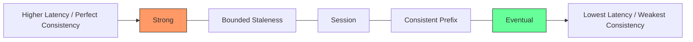

# Database Services

This chapter will teach you everything about databases in Azure, starting from absolute basics. We'll explain what databases are, why you need them, and how to choose and use the right database service for your needs.

## What You'll Learn

By the end of this chapter, you'll understand:
- What a database is and why applications need them (from scratch)
- The difference between relational and NoSQL databases
- When to use Azure SQL vs Cosmos DB vs PostgreSQL/MySQL
- How to design database schemas and optimize queries
- Backup, replication, and disaster recovery strategies
- Cost optimization techniques for databases
- Security best practices (encryption, access control, auditing)

---

## What is a Database? (Start Here if You're New)

Let's start with the absolute basics.

### The Simple Explanation

**Database = Organized storage for structured data**

A database is like a super-powered Excel spreadsheet that:
- Stores LOTS of data (millions of rows, not just thousands)
- Allows FAST searching (find a specific customer in milliseconds)
- Supports MULTIPLE users at once (100s of people reading/writing simultaneously)
- Ensures DATA INTEGRITY (prevents conflicts, ensures consistency)

### Why Not Just Use Files?

**Without a database** (storing data in text files or JSON files):

```
Problems:
1. Slow searching
   - Finding one customer in 1 million records = read entire file
   - Takes seconds or minutes

2. No concurrent access
   - Two people update same file = data corruption
   - Must lock file (only one person at a time)

3. No relationships
   - How do you connect customers to their orders?
   - Must manually search and link data

4. No data integrity
   - Nothing prevents duplicate customers
   - Nothing ensures email format is valid
   - Easy to corrupt data

5. No backup/recovery
   - File corrupted = everything lost
   - No automatic backups
```

**With a database:**

```
Solutions:
1. Fast searching
   - Indexes allow instant lookups (milliseconds)
   - Can search by name, email, ID, anything

2. Concurrent access
   - 1000s of users can read/write simultaneously
   - Database handles conflicts automatically

3. Relationships
   - Customer has many Orders (foreign keys)
   - Database enforces relationships

4. Data integrity
   - Constraints prevent bad data
   - Transactions ensure consistency
   - No duplicates (unique constraints)

5. Backup/recovery
   - Automatic backups every day
   - Point-in-time restore
   - Disaster recovery built-in
```

### Real-World Example: E-Commerce Store

**What needs to be stored:**

```
Customers:
- ID, Name, Email, Phone, Address, Created Date

Products:
- ID, Name, Description, Price, Stock Quantity, Category

Orders:
- ID, Customer ID, Order Date, Total Amount, Status

Order Items (what's in each order):
- ID, Order ID, Product ID, Quantity, Price

Reviews:
- ID, Product ID, Customer ID, Rating, Comment, Date
```

**Without Database (text files):**

```
customers.txt:
1,John Doe,john@email.com,555-1234,123 Main St,2024-01-15
2,Jane Smith,jane@email.com,555-5678,456 Oak Ave,2024-01-16

orders.txt:
1,1,2024-02-01,99.99,Shipped
2,2,2024-02-02,149.99,Delivered

How do you find all orders for customer "John Doe"?
- Read customers.txt, find John's ID (1)
- Read ALL of orders.txt, find orders with Customer ID = 1
- If 1 million orders = very slow!
```

**With Database (SQL):**

```sql
-- Find all orders for John Doe (instant, even with millions of orders)
SELECT o.*
FROM Orders o
JOIN Customers c ON o.CustomerID = c.ID
WHERE c.Name = 'John Doe';

-- Result in milliseconds, even with 10 million orders
```

### Types of Data and Their Databases

Different applications have different data needs:

**Structured Data (Tables, Rows, Columns)**
```
Example: Customer records, Orders, Inventory
Perfect fit: SQL Databases (Azure SQL, PostgreSQL, MySQL)

Customers Table:
| ID | Name      | Email           | Phone      |
|----|-----------|-----------------|------------|
| 1  | John Doe  | john@email.com  | 555-1234   |
| 2  | Jane Smith| jane@email.com  | 555-5678   |
```

**Semi-Structured Data (JSON Documents)**
```
Example: User profiles, Product catalogs, Blog posts
Perfect fit: NoSQL Databases (Cosmos DB)

{
  "id": "user123",
  "name": "John Doe",
  "email": "john@email.com",
  "preferences": {
    "theme": "dark",
    "notifications": true,
    "language": "en"
  },
  "tags": ["premium", "verified"]
}
```

**Key-Value Data (Simple Lookups)**
```
Example: Session storage, Cache, Config settings
Perfect fit: Redis Cache, Table Storage

Key: "session_abc123"
Value: {"userID": 456, "loginTime": "2024-01-15T10:30:00"}
```

**Graph Data (Relationships)**
```
Example: Social networks, Fraud detection
Perfect fit: Cosmos DB Gremlin API

Person -> FRIENDS_WITH -> Person
Person -> LIKES -> Product
Product -> MANUFACTURED_BY -> Company
```

### Database vs Storage: What's the Difference?

This confuses many beginners. Let's clarify:

**Storage (Blob Storage, Files)**
- Stores FILES (images, videos, PDFs, backups)
- No searching (must download entire file)
- No relationships
- Cheap ($1-20/TB/month)
- **Use for**: Images, videos, backups, logs

**Database**
- Stores STRUCTURED DATA (tables, documents)
- Fast searching (find specific record instantly)
- Relationships between data
- More expensive ($30-500+/month)
- **Use for**: Customer records, orders, inventory, user accounts

**Real Example:**

```
E-Commerce Application:

Database (Azure SQL):
- Customer accounts
- Product catalog
- Order history
- Inventory levels
Cost: $200/month

Storage (Blob Storage):
- Product images (millions of images)
- User-uploaded photos
- Invoice PDFs
Cost: $50/month for 2 TB

Total: $250/month for complete solution
```


---

## Understanding Relational vs NoSQL Databases

The first major decision: relational or NoSQL?

### Relational Databases (SQL)

**What it is**: Data stored in tables with rows and columns, connected by relationships.

**Real-World Analogy: Filing Cabinet with Cross-References**

```
Think of a library:
- Customer card catalog (one drawer)
- Book catalog (another drawer)
- Checkout cards (third drawer)

Cross-references:
- Customer card references their checkouts
- Checkout card references the book
- Everything linked by ID numbers

Same concept as relational databases!
```

**When to Use Relational:**
```
✅ Data has clear relationships (customers → orders → items)
✅ Need ACID guarantees (banking, e-commerce)
✅ Need complex queries (joins, aggregations)
✅ Data structure is consistent
✅ Strong data integrity required

Examples:
- E-commerce orders
- Banking transactions
- Employee management
- Inventory systems
- ERP/CRM systems
```

**Azure Options:**
- Azure SQL Database (Microsoft SQL Server)
- Azure Database for PostgreSQL
- Azure Database for MySQL
- Azure Database for MariaDB

### NoSQL Databases (Document, Key-Value, Graph)

**What it is**: Flexible data storage without fixed schemas.

**Real-World Analogy: Boxes with Labels**

```
Think of storage boxes:
- Each box (document) can contain different things
- Box 1: Customer info + preferences + purchase history (all in one)
- Box 2: Different customer with different fields
- No need for everything to match
- Just search by label
```

**When to Use NoSQL:**
```
✅ Flexible schema (fields change frequently)
✅ Need massive scale (millions of records)
✅ Global distribution (users worldwide)
✅ Semi-structured data (JSON documents)
✅ High read/write throughput

Examples:
- User profiles
- Product catalogs
- Social media posts
- IoT sensor data
- Gaming leaderboards
- Real-time analytics
```

**Azure Options:**
- Cosmos DB (multi-model: document, key-value, graph, column)

### Comparison Table

| Feature | Relational (SQL) | NoSQL (Cosmos DB) |
|---------|------------------|-------------------|
| **Schema** | Fixed (must define columns) | Flexible (can change anytime) |
| **Data Structure** | Tables with rows/columns | JSON documents |
| **Relationships** | Foreign keys, joins | Embedded documents |
| **Scaling** | Vertical (bigger server) | Horizontal (more servers) |
| **Transactions** | ACID (strong consistency) | Eventually consistent (configurable) |
| **Query Language** | SQL (standard) | SQL-like or API-specific |
| **Best For** | Structured data, complex queries | Flexible data, massive scale |
| **Cost** | $30-500+/month | $24-1000+/month |

### The Hybrid Approach (What Most Apps Actually Do)

Most real-world applications use BOTH:

```
Modern E-Commerce Application:

Azure SQL Database:
- Orders (need ACID guarantees)
- Inventory (need transactions)
- Payments (critical consistency)

Cosmos DB:
- Product catalog (flexible schema)
- User sessions (high throughput)
- Shopping cart (global distribution)

Blob Storage:
- Product images
- User uploads

Why both?
- Use the right tool for each job
- SQL for critical data
- NoSQL for scale and flexibility
- Storage for files
```

---

## Under the Hood: The Distributed SQL Problem

To a Principal Engineer, the biggest challenge with databases is **Scale vs. Consistency**. 

### 1. Scaling the "Unscalable" (Sharding)
Traditional SQL databases like SQL Server or PostgreSQL are designed to run on a single machine. When you hit the limit of that machine (even if it's 128 vCPUs), you have to **Shard**.
- **The Problem**: You split your "Customers" into two databases: A-M in DB1, N-Z in DB2.
- **The Principal's Headache**: How do you do a `JOIN` between a customer in DB1 and an order in DB2? You can't. Your application code now has to handle the routing and the distributed logic.

### 2. Read Replicas vs. Write Bottlenecks
You can add hundreds of **Read Replicas** to handle users browsing your site. But every **Write** (an order) must go to the **Single Primary**. This is the bottleneck for every relational database in the cloud.

### 3. The CAP Theorem & Databases
- **Azure SQL**: Choose **C** (Consistency). If the primary fails, the database is unavailable for a few seconds until a new primary is elected.
- **Cosmos DB**: Choose **A** (Availability). It can be configured for "Multi-Master" writes, allowing you to write to any region, even if other regions are down.

> [!IMPORTANT]
> **Pro Insight: NewSQL**
> Azure SQL **Hyperscale** is Microsoft's answer to the "Distributed SQL" problem. It separates Compute from Storage, allowing the storage to grow to 100 TB while providing multiple read-compute nodes, effectively blurring the line between traditional SQL and cloud-scale distribution.

---

## 1. Database Decision Tree

<div className="flex justify-center my-4">
  <div className="w-full max-w-4xl">
    ```mermaid
    graph TD
        A[Need Database?] -->|Yes| B{Relational or NoSQL?}
        B -->|Relational| C{SQL Server Compatible?}
        B -->|NoSQL| D{Data Model?}

        C -->|Yes| E[Azure SQL Database]
        C -->|No| F{Which Engine?}

        F -->|PostgreSQL| G[Azure Database for PostgreSQL]
        F -->|MySQL| H[Azure Database for MySQL]
        F -->|MariaDB| I[Azure Database for MariaDB]

        D -->|Document| J[Cosmos DB]
        D -->|Key-Value| K[Cosmos DB or Table Storage]
        D -->|Graph| L[Cosmos DB Gremlin API]
        D -->|Column-Family| M[Cosmos DB Cassandra API]

        style E fill:#0078D4
        style J fill:#FFB900
    ```
  </div>
</div>

---

## 2. Azure SQL Database

**Azure SQL Database** is a fully managed relational database with built-in intelligence.

### Purchasing Models

<Tabs>
  <Tab title="DTU Model">
    **Database Transaction Units (simpler)**

    ```
    DTU = Bundled measure of CPU, memory, I/O

    Tiers:
    - Basic: 5 DTUs, 2 GB max
    - Standard: 10-3,000 DTUs, up to 1 TB
    - Premium: 125-4,000 DTUs, up to 4 TB

    Example: S3 (100 DTUs) = ~$150/month
    ```

    **When to use**: Simple workloads, predictable performance
  </Tab>

  <Tab title="vCore Model">
    **Virtual Cores (more control)**

    ```
    Choose: CPU cores + Memory + Storage separately

    Tiers:
    - General Purpose: Balanced, SSD, 99.99% SLA
    - Business Critical: High performance, local SSD, 99.995% SLA
    - Hyperscale: Up to 100 TB, rapid scale

    Example: 4 vCores + 32 GB + 500 GB = ~$700/month
    ```

    **When to use**: Complex workloads, need specific resources
  </Tab>
</Tabs>

> [!WARNING]
> **Gotcha: DTU vs vCore**
> DTU is cheaper for small databases but scales poorly. vCore is more expensive but allows you to save money with "Reserved Instances" (1-3 year commitment). Moving from DTU to vCore is easy, but going back can be tricky.

> [!TIP]
> **Jargon Alert: ACID vs BASE**
> **ACID (Azure SQL)**: Data is always correct immediately (Bank transactions).
> **BASE (Cosmos DB)**: Data is eventually correct (Social media feed). Cosmos DB creates copies around the world, so it might take a few milliseconds for a "Like" to show up in Japan if it happened in Brazil.

### High Availability Options

<CardGroup cols={2}>
  <Card title="General Purpose" icon="server">
    **Standard availability**

    ```
    Architecture:
    - Compute and storage separated
    - Premium remote storage (3 replicas)
    - Automatic failover
    - 99.99% SLA

    Failover time: &lt;30 seconds
    RPO: &lt;5 seconds
    ```
  </Card>

  <Card title="Business Critical" icon="shield-halved">
    **Always On availability**

    ```
    Architecture:
    - Compute and storage together
    - Local SSD with 4 replicas
    - Synchronous replication
    - 99.995% SLA

    Failover time: &lt;10 seconds
    RPO: 0 (zero data loss)

    Bonus: Read-only replica included (free)
    ```
  </Card>
</CardGroup>

### Geo-Replication

```bash
# Create geo-replica in secondary region
az sql db replica create \
  --name mydb \
  --resource-group rg-prod \
  --server sql-primary-eastus \
  --partner-server sql-secondary-westus \
  --partner-resource-group rg-dr

# Failover to secondary
az sql db replica set-primary \
  --name mydb \
  --resource-group rg-dr \
  --server sql-secondary-westus
```

**Auto-Failover Groups** (recommended):
```bash
# Create failover group
az sql failover-group create \
  --name myfailovergroup \
  --resource-group rg-prod \
  --server sql-primary-eastus \
  --partner-server sql-secondary-westus \
  --partner-resource-group rg-dr \
  --add-db mydb

# Application connection string
Server=tcp:myfailovergroup.database.windows.net,1433

# Automatic failover on primary failure
# DNS automatically redirects to secondary
```

### Performance Tuning

<AccordionGroup>
  <Accordion title="1. Query Performance Insights" icon="chart-line">
    ```sql
    -- Find slow queries
    SELECT TOP 10
        qs.execution_count,
        qs.total_elapsed_time / qs.execution_count AS avg_time_ms,
        qt.text AS query_text
    FROM sys.dm_exec_query_stats qs
    CROSS APPLY sys.dm_exec_sql_text(qs.sql_handle) qt
    ORDER BY avg_time_ms DESC

    -- Enable automatic tuning
    ALTER DATABASE mydb
    SET AUTOMATIC_TUNING (FORCE_LAST_GOOD_PLAN = ON)
    ```
  </Accordion>

  <Accordion title="2. Indexes" icon="list-ol">
    ```sql
    -- Missing index recommendations
    SELECT
        migs.avg_user_impact,
        migs.avg_total_user_cost,
        mid.statement AS table_name,
        mid.equality_columns,
        mid.inequality_columns,
        mid.included_columns
    FROM sys.dm_db_missing_index_groups mig
    JOIN sys.dm_db_missing_index_group_stats migs ON mig.index_group_handle = migs.group_handle
    JOIN sys.dm_db_missing_index_details mid ON mig.index_handle = mid.index_handle
    ORDER BY migs.avg_user_impact DESC

    -- Create recommended index
    CREATE NONCLUSTERED INDEX IX_Users_Email
    ON Users (Email)
    INCLUDE (FirstName, LastName)
    ```

    ### The Principal's Guide to Indexing

    To a pro, indexes aren't just "go-faster stripes". They are physical data structures (B-Trees) that occupy disk space.

    - **The Covered Index**: The `INCLUDE` clause in the example above is critical. By including `FirstName` and `LastName` in the index, the query can get all the data it needs directly from the index leaf nodes without having to go back to the main table (the "Key Lookup"). This can turn a 500ms query into a 5ms query.
    - **SARGable Queries**: "Search ARGument-able". If you use a function on a column in your `WHERE` clause (e.g., `WHERE YEAR(JoinDate) = 2024`), the database CANNOT use an index on `JoinDate`. It must scan every row.
    - **Write Penalty**: Every index you add makes your `INSERT` and `UPDATE` operations slower. In high-traffic write systems, "Over-indexing" is as dangerous as "Under-indexing".

    ---
  </Accordion>

  <Accordion title="3. Read Scale-Out" icon="arrows-split-up-and-left">
    **Use read-only replica for reporting**:

    ```csharp
    // Write connection (primary)
    string connStrWrite = "Server=tcp:myserver.database.windows.net;Database=mydb;ApplicationIntent=ReadWrite;";

    // Read connection (replica)
    string connStrRead = "Server=tcp:myserver.database.windows.net;Database=mydb;ApplicationIntent=ReadOnly;";

    // Routes to read-only replica (no load on primary)
    using (var conn = new SqlConnection(connStrRead))
    {
        // Run reports without impacting production
    }
    ```

    **Available in**: Business Critical and Premium tiers
  </Accordion>
</AccordionGroup>

---

## 3. Azure Cosmos DB

**Cosmos DB** is a globally distributed, multi-model NoSQL database.

### The PACELC Trade-off: Why so many choices?

In a distributed system, you don't just have CAP (Consistency, Availability, Partition Tolerance). You also have **PACELC**:
- If there is a **Partition**, you choose between **Availability** or **Consistency**.
- **Else**, you choose between **Latency** or **Consistency**.

Cosmos DB allows you to tune this exactly for your application.



| Level | Consistency | Latency | RU Cost | Use Case |
|-------|-------------|---------|---------|----------|
| **Strong** | Highest | Highest | 2.0x | FinTech / Transfers |
| **Bounded** | Guaranteed Lag | Medium | 1.0x | Stock Tickers |
| **Session** | Read-Your-Own-Write | Low | 1.0x | Social Media / Cart |
| **Prefix** | Ordering Guaranteed | Lowest | 1.0x | Chat / Comments |
| **Eventual** | No Guarantees | Lowest | 1.0x | View Analytics |

> [!WARNING]
> **Performance Gotcha: The Strong Consistency Tax**
> Strong consistency requires a majority of replicas to ACK a write before success. If you have replicas in US, Europe, and Asia, a "Strong" write will take **hundreds of milliseconds** (speed of light limit). NEVER use Strong consistency for global applications unless absolutely necessary.

---

### Partitioning Strategy

**Partition Key** is the most critical design decision in Cosmos DB.

<Tabs>
  <Tab title="Good Partition Keys">
    ✅ **High cardinality** (many unique values):
    ```json
    // Good: userId (millions of users)
    {
      "id": "order123",
      "userId": "user456",  // Partition key
      "total": 99.99
    }

    // Good: tenantId (multi-tenant app)
    {
      "id": "doc123",
      "tenantId": "acme-corp",  // Partition key
      "data": "..."
    }
    ```

    ✅ **Even distribution** (no hot partitions)
    ✅ **Natural query pattern** (most queries filter by this)
  </Tab>

  <Tab title="Bad Partition Keys">
    ❌ **Low cardinality**:
    ```json
    // Bad: country (only ~200 values)
    {
      "id": "user123",
      "country": "USA",  // BAD partition key
      "name": "John"
    }
    // Most users in USA = hot partition
    ```

    ❌ **Monotonically increasing**:
    ```json
    // Bad: timestamp
    {
      "id": "event123",
      "timestamp": "2026-01-21T10:00:00Z",  // BAD
      "data": "..."
    }
    // All writes go to latest partition (hot)
    ```

    ❌ **Uneven distribution** (80/20 rule)
  </Tab>

  <Tab title="Partition Key Patterns">
    **Pattern 1: Composite Key**
    ```json
    {
      "id": "order123",
      "partitionKey": "2026-01-21_user456",  // Date + UserId
      "userId": "user456",
      "orderDate": "2026-01-21"
    }
    ```

    **Pattern 2: Hash Key**
    ```json
    {
      "id": "doc123",
      "partitionKey": "a3f5",  // Hash(userId) % 10000
      "userId": "user456"
    }
    ```

    **Pattern 3: Synthetic Key**
    ```json
    {
      "id": "item123",
      "partitionKey": "category_electronics_1",  // Category + Shard
      "category": "electronics"
    }
    ```
  </Tab>
</Tabs>

### Request Units (RU/s)

**RUs** are the currency of Cosmos DB.

<Tabs>
  <Tab title="RU Consumption">
    ```
    1 RU = Read 1 KB document (point read with partition key)

    Operations:
    - Point read (1 KB): 1 RU
    - Query (1 KB): 2-3 RU
    - Write (1 KB): 5-6 RU
    - Delete: 5 RU

    Factors affecting RU:
    - Document size (larger = more RU)
    - Indexing (more indexes = more RU on write)
    - Consistency (Strong = 2x RU vs Eventual)
    ```
  </Tab>

  <Tab title="Provisioning Models">
    **Provisioned Throughput**:
    ```
    Fixed RU/s (can scale up/down)
    Example: 400 RU/s = $24/month
    Use for: Predictable workloads
    ```

    **Autoscale**:
    ```
    Automatically scales between min and max
    Example: 400-4,000 RU/s
    Use for: Variable workloads
    ```

    **Serverless**:
    ```
    Pay per request (no provisioning)
    Example: $0.25 per million RU consumed
    Use for: Sporadic workloads, dev/test
    ```
  </Tab>

  <Tab title="Optimize RU Consumption">
    ```csharp
    // Bad: Query without partition key (cross-partition)
    SELECT * FROM c WHERE c.userId = "user123"
    // Cost: 100+ RU

    // Good: Query with partition key
    SELECT * FROM c
    WHERE c.partitionKey = "user123"
    AND c.userId = "user123"
    // Cost: 3 RU

    // Bad: Return entire document
    SELECT * FROM c WHERE c.partitionKey = "user123"
    // Cost: 5 RU (if 5 KB doc)

    // Good: Return only needed fields
    SELECT c.id, c.name FROM c WHERE c.partitionKey = "user123"
    // Cost: 2 RU (smaller response)
    ```
  </Tab>
</Tabs>

### Global Distribution

```bash
# Add region (multi-region writes)
az cosmosdb update \
  --name mycosmosdb \
  --resource-group rg-prod \
  --locations regionName=EastUS failoverPriority=0 isZoneRedundant=true \
  --locations regionName=WestEurope failoverPriority=1 isZoneRedundant=true \
  --enable-multiple-write-locations true

# Application connects to nearest region automatically
CosmosClient client = new CosmosClient(
    accountEndpoint: "https://mycosmosdb.documents.azure.com:443/",
    authKeyOrResourceToken: key,
    new CosmosClientOptions()
    {
        ApplicationRegion = Regions.EastUS,  // Preferred region
        ConnectionMode = ConnectionMode.Direct
    }
);
```

---

## 4. PostgreSQL & MySQL

**Azure Database for PostgreSQL/MySQL** are fully managed open-source databases.

### Deployment Options

<Tabs>
  <Tab title="Single Server">
    **Basic, simple deployment**

    ```
    Tiers:
    - Basic: 1-2 vCores, up to 1 TB
    - General Purpose: 2-64 vCores, up to 16 TB
    - Memory Optimized: 2-32 vCores, high memory

    Features:
    ✅ Automatic backups (7-35 days)
    ✅ Automatic patching
    ✅ Built-in HA
    ❌ No read replicas (except cross-region)
    ❌ No zone redundancy

    Status: Being retired (use Flexible Server)
    ```
  </Tab>

  <Tab title="Flexible Server (Recommended)">
    **Advanced features, better performance**

    ```
    Features:
    ✅ Zone-redundant HA (99.99% SLA)
    ✅ Read replicas (same region)
    ✅ Burstable VMs (B-series)
    ✅ Stop/Start (save costs)
    ✅ Custom maintenance window
    ✅ Better performance (up to 3x faster)

    Price: Similar to Single Server
    Use: All new deployments
    ```
  </Tab>
</Tabs>

### High Availability

```bash
# Create zone-redundant PostgreSQL
az postgres flexible-server create \
  --name mypostgres \
  --resource-group rg-prod \
  --location eastus \
  --tier GeneralPurpose \
  --sku-name Standard_D4s_v3 \
  --storage-size 128 \
  --high-availability ZoneRedundant \
  --zone 1 \
  --standby-zone 2 \
  --backup-retention 30

# Result:
# - Primary in Zone 1
# - Standby in Zone 2 (sync replication)
# - Automatic failover < 60 seconds
# - 99.99% SLA
```

### Read Replicas

```bash
# Create read replica (for reporting)
az postgres flexible-server replica create \
  --replica-name mypostgres-replica \
  --resource-group rg-prod \
  --source-server mypostgres

# Application configuration
# Write: mypostgres.postgres.database.azure.com
# Read: mypostgres-replica.postgres.database.azure.com
```

---

## 5. Database Comparison

| Feature | Azure SQL | Cosmos DB | PostgreSQL | MySQL |
|---------|-----------|-----------|------------|-------|
| **Model** | Relational | NoSQL | Relational | Relational |
| **Max Size** | 100 TB | Unlimited | 16 TB | 16 TB |
| **ACID** | Full | Tunable | Full | Full |
| **Global Distribution** | Active geo-replication | Multi-master | Read replicas | Read replicas |
| **SLA** | 99.995% | 99.999% | 99.99% | 99.99% |
| **Use Case** | OLTP, complex queries | Global apps, massive scale | Open-source, extensions | Open-source, web apps |
| **Cost** | $$$ | $$$$ | $ | $ |

---

## 6. Interview Questions

### Beginner

<AccordionGroup>
  <Accordion title="Q1: When would you choose Cosmos DB over Azure SQL?">
    **Choose Cosmos DB when**:
    - Global distribution (multi-region writes)
    - Massive scale (>1 TB, millions of requests/sec)
    - Low latency (&lt;10ms reads)
    - Schema flexibility (JSON documents)
    - Eventual consistency acceptable

    **Choose Azure SQL when**:
    - ACID transactions required
    - Complex JOINs and relations
    - Strong consistency mandatory
    - Existing SQL code/expertise
    - Cost-sensitive (Cosmos DB more expensive)

    **Example**: E-commerce orders → Azure SQL (transactions), Product catalog → Cosmos DB (global, high scale)
  </Accordion>

  <Accordion title="Q2: Explain DTU vs vCore pricing models">
    **DTU (Database Transaction Unit)**:
    - Bundled CPU + memory + I/O
    - Simpler (choose tier: Basic/Standard/Premium)
    - Less control over resources
    - Use for: Simple workloads, getting started

    **vCore (Virtual Core)**:
    - Choose CPU cores, memory, storage separately
    - More control and flexibility
    - Better for complex workloads
    - Use for: Production, specific requirements

    **Example**: Dev/test → DTU (S3), Production → vCore (8 cores + 32 GB)
  </Accordion>
</AccordionGroup>

### Intermediate

<AccordionGroup>
  <Accordion title="Q3: Design a globally distributed e-commerce database">
    ```
    Architecture:

    1. Product Catalog (Cosmos DB):
       - Multi-region writes (US, EU, Asia)
       - Session consistency
       - Partition key: productId
       - Use: Global product availability

    2. User Accounts (Cosmos DB):
       - Multi-region writes
       - Session consistency
       - Partition key: userId
       - Use: User profiles, preferences

    3. Orders (Azure SQL):
       - Primary: East US
       - Geo-replicas: West Europe, Southeast Asia
       - Strong consistency (ACID transactions)
       - Use: Order processing, payments

    4. Shopping Cart (Cosmos DB):
       - Multi-region writes
       - Session consistency (user sees own cart)
       - Partition key: userId
       - TTL: 30 days (auto-delete abandoned carts)

    5. Inventory (Azure SQL):
       - Primary with read replicas per region
       - Strong consistency
       - Use: Prevent overselling

    Data Flow:
    1. User browses catalog (Cosmos DB, nearest region)
    2. Adds to cart (Cosmos DB, nearest region)
    3. Checkout → Writes to Orders (Azure SQL, primary)
    4. Inventory check (Azure SQL, nearest read replica)
    5. Order confirmation sent

    Cost: ~$5,000/month (Cosmos DB: $3,500, Azure SQL: $1,500)
    ```
  </Accordion>

  <Accordion title="Q4: Optimize Cosmos DB for cost">
    **Strategies**:

    ```
    1. Right-size provisioned throughput:
       - Monitor RU consumption
       - Scale down underutilized containers
       - Use autoscale for variable workloads

    2. Optimize queries:
       - Always include partition key
       - Project only needed fields (SELECT c.id, not SELECT *)
       - Use composite indexes

    3. Use serverless for dev/test:
       - Pay per request
       - No provisioned capacity
       - Savings: 70-90% for low usage

    4. Implement TTL:
       - Auto-delete old documents
       - Reduces storage and indexing cost
       - Example: Delete cart items after 30 days

    5. Reduce indexing:
       // Default: Index everything
       {
         "indexingMode": "consistent",
         "automatic": true,
         "includedPaths": [{ "path": "/*" }]
       }

       // Optimized: Index only queried fields
       {
         "indexingMode": "consistent",
         "automatic": true,
         "includedPaths": [
           { "path": "/userId/?" },
           { "path": "/createdAt/?" }
         ],
         "excludedPaths": [{ "path": "/*" }]
       }

    6. Use lower consistency:
       - Strong: 2x RU cost
       - Session: 1x RU cost
       - Eventual: 1x RU cost
       - Switch from Strong to Session: 50% savings

    Result: $5,000/month → $1,500/month (70% reduction)
    ```
  </Accordion>
</AccordionGroup>

### Advanced

<AccordionGroup>
  <Accordion title="Q5: Implement multi-tenant database isolation">
    **Strategy Options**:

    ````text
    Option 1: Database per Tenant (Highest Isolation)
    Pros:
    ✅ Complete isolation (security, compliance)
    ✅ Easy backup/restore per tenant
    ✅ Can move tenant to different server

    Cons:
    ❌ Expensive (many databases)
    ❌ Complex management (schema updates)
    ❌ Limited scalability (max databases per server)

    Use when: Enterprise customers, strict compliance


    Option 2: Schema per Tenant (Medium Isolation)
    Pros:
    ✅ Logical isolation
    ✅ Lower cost than separate databases
    ✅ Easier management than option 1

    Cons:
    ❌ Shared resources (noisy neighbor)
    ❌ Complex schema management
    ❌ PostgreSQL only (not Azure SQL)

    Use when: Medium-sized customers


    Option 3: Shared Schema with TenantId (Low Isolation)
    Pros:
    ✅ Lowest cost (single database)
    ✅ Easiest to manage (one schema)
    ✅ Highest scalability

    Cons:
    ❌ Risk of data leaks (query bugs)
    ❌ No per-tenant backup
    ❌ Difficult to move tenant

    Use when: Small customers, SaaS apps

    Implementation (Row-Level Security):
    ```sql
    -- Create tenancy column
    ALTER TABLE Orders ADD TenantId nvarchar(50) NOT NULL

    -- Create security function
    CREATE FUNCTION dbo.fn_tenantAccessPredicate(@TenantId nvarchar(50))
    RETURNS TABLE
    WITH SCHEMABINDING
    AS
    RETURN SELECT 1 AS fn_accessResult
    WHERE @TenantId = CAST(SESSION_CONTEXT(N'TenantId') AS nvarchar(50))

    -- Create security policy
    CREATE SECURITY POLICY TenantFilter
    ADD FILTER PREDICATE dbo.fn_tenantAccessPredicate(TenantId) ON dbo.Orders
    WITH (STATE = ON)

    -- Application sets tenant context
    EXEC sp_set_session_context @key = N'TenantId', @value = 'tenant-123'

    -- All queries automatically filtered by TenantId
    SELECT * FROM Orders  -- Only returns tenant-123's orders
    ```

    **Hybrid Approach (Recommended)**:
    - Enterprise customers: Dedicated database
    - SMB customers: Shared database with RLS
    - Balance cost and isolation
    ````
  </Accordion>
</AccordionGroup>

---

## Troubleshooting: When Databases Slow Down

When your app feels slow, it's almost always the database. Use this playbook to find the culprit.

### 1. Azure SQL: "The Query Timeout"
- **Blocking**: Check for long-running transactions that are locking rows. Use `sys.dm_tran_locks`.
- **CPU Throttling**: If your compute utilization is at 100%, Azure will "throttle" your queries. The solution is usually vertical scaling (more vCores) or fixing a missing index.
- **Connection pooling**: Is your app opening a new connection for every request? This is expensive. Use a connection pool (like HikariCP or Entity Framework pooling).

### 2. Cosmos DB: "The 429 Throttle"
If you see **Error 429 (Too Many Requests)**:
- **Hot Partition**: You are hitting one partition too hard. Check the portal for "Normalized RU Consumption per Partition Key Range".
- **Cross-Partition Query**: Are you querying without the Partition Key? That's the most common cause of high RU consumption.
- **Solution**: Increase RU/s (expensive) or fix your data model (correct).

### 3. The "Transient Failure"
Cloud databases sometimes reset connections during maintenance.
- **The Fix**: Implement **Retry Logic** in your application code. Most Azure SDKs have this built-in, but you must enable it. Use "Exponential Backoff" to avoid overwhelming the database after a reset.

> [!TIP]
> **Pro Tool: Query Store**
> In Azure SQL, enable **Query Store**. It's a "black box flight recorder" for your database that tracks every query's performance history. It can even automatically roll back a bad execution plan!

---

## 7. Key Takeaways

<CardGroup cols={2}>
  <Card title="Choose Right Database" icon="database">
    Azure SQL for relational, Cosmos DB for global scale, PostgreSQL for open-source.
  </Card>

  <Card title="Partition Key is Critical" icon="key">
    In Cosmos DB, partition key determines performance and cost. Design carefully.
  </Card>

  <Card title="Geo-Replication for DR" icon="globe">
    Use auto-failover groups (SQL) or multi-region writes (Cosmos DB) for resilience.
  </Card>

  <Card title="Monitor and Optimize" icon="chart-line">
    Query Performance Insights, missing indexes, RU consumption monitoring.
  </Card>

  <Card title="Security Layers" icon="shield">
    Private endpoints, Azure AD auth, encryption at rest, audit logging.
  </Card>

  <Card title="Cost Optimization" icon="dollar-sign">
    Right-size throughput, optimize queries, use read replicas, implement TTL.
  </Card>
</CardGroup>

---

## Next Steps

<Card title="Continue to Chapter 7" icon="arrow-right" href="/courses/azure-cloud-engineering/07-container-kubernetes">
  Master Azure Kubernetes Service (AKS) and container orchestration
</Card>
