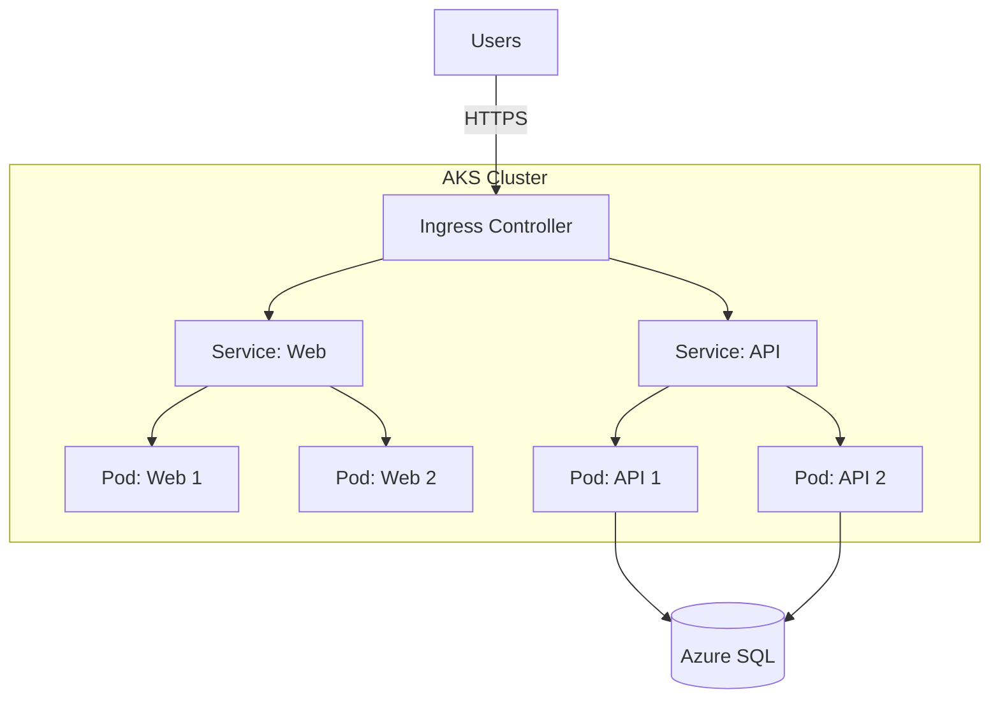

# Azure Kubernetes Service (AKS)

AKS is Azure's managed Kubernetes service. Master AKS to deploy modern, cloud-native applications at scale.


---

## 1. Why Kubernetes?

<CardGroup cols={2}>
  <Card title="Before Kubernetes" icon="server">
    - Manual container orchestration
    - No auto-scaling
    - Complex networking
    - Manual load balancing
    - No self-healing
  </Card>

  <Card title="With Kubernetes" icon="dharmachakra">
    - Automated orchestration
    - Auto-scaling (HPA, VPA, Cluster Autoscaler)
    - Service discovery
    - Built-in load balancing
    - Self-healing (restart failed pods)
  </Card>
</CardGroup>


> [!WARNING]
> **Gotcha: System Node Pools**
> Every AKS cluster needs at least one "System Node Pool" to run Kubernetes itself (CoreDNS, Metrics Server). You cannot delete this pool or scale it to 0. It will always cost you money (usually 1-3 VMs).

> [!TIP]
> **Jargon Alert: Pod vs Node**
> **Node**: A Virtual Machine (The house).
> **Pod**: A running process/container (The tenant living in the house).
> A single Node (VM) usually hosts many Pods.

---

## 2. AKS Architecture



---

## 3. Create AKS Cluster

```bash
# Create AKS cluster
az aks create \
  --name aks-prod \
  --resource-group rg-prod \
  --node-count 3 \
  --node-vm-size Standard_D4s_v3 \
  --zones 1 2 3 \
  --enable-managed-identity \
  --network-plugin azure \
  --enable-addons monitoring \
  --generate-ssh-keys

# Get credentials
az aks get-credentials \
  --name aks-prod \
  --resource-group rg-prod

# Verify
kubectl get nodes
```

---

## 4. AKS Networking

<Tabs>
  <Tab title="kubenet (Basic)">
    ```
    - Pods get IPs from separate address space
    - NAT for outbound connectivity
    - Simpler, fewer IP addresses needed
    - Use for: Dev/test, small clusters
    ```
  </Tab>

  <Tab title="Azure CNI (Advanced)">
    ```
    - Pods get IPs from VNet subnet
    - Direct connectivity to VNet resources
    - More IP addresses required
    - Use for: Production, VNet integration
    ```
  </Tab>
</Tabs>

---

## 5. Deploy Application

```yaml
# deployment.yaml
apiVersion: apps/v1
kind: Deployment
metadata:
  name: web-app
spec:
  replicas: 3
  selector:
    matchLabels:
      app: web
  template:
    metadata:
      labels:
        app: web
    spec:
      containers:
      - name: web
        image: myregistry.azurecr.io/web:v1
        resources:
          requests:
            cpu: 100m
            memory: 128Mi
          limits:
            cpu: 500m
            memory: 512Mi
        ports:
        - containerPort: 80

---
# service.yaml
apiVersion: v1
kind: Service
metadata:
  name: web-service
spec:
  type: LoadBalancer
  ports:
  - port: 80
    targetPort: 80
  selector:
    app: web

---
# ingress.yaml
apiVersion: networking.k8s.io/v1
kind: Ingress
metadata:
  name: web-ingress
  annotations:
    kubernetes.io/ingress.class: nginx
    cert-manager.io/cluster-issuer: letsencrypt-prod
spec:
  tls:
  - hosts:
    - myapp.example.com
    secretName: tls-secret
  rules:
  - host: myapp.example.com
    http:
      paths:
      - path: /
        pathType: Prefix
        backend:
          service:
            name: web-service
            port:
              number: 80
```

```bash
kubectl apply -f deployment.yaml
kubectl apply -f service.yaml
kubectl apply -f ingress.yaml
```

---

## 6. Autoscaling

<Tabs>
  <Tab title="Horizontal Pod Autoscaler">
    ```yaml
    apiVersion: autoscaling/v2
    kind: HorizontalPodAutoscaler
    metadata:
      name: web-hpa
    spec:
      scaleTargetRef:
        apiVersion: apps/v1
        kind: Deployment
        name: web-app
      minReplicas: 3
      maxReplicas: 10
      metrics:
      - type: Resource
        resource:
          name: cpu
          target:
            type: Utilization
            averageUtilization: 70
    ```
  </Tab>

  <Tab title="Cluster Autoscaler">
    ```bash
    # Enable cluster autoscaler
    az aks update \
      --name aks-prod \
      --resource-group rg-prod \
      --enable-cluster-autoscaler \
      --min-count 3 \
      --max-count 10

    # Cluster automatically adds/removes nodes based on demand
    ```
  </Tab>
</Tabs>

---

## 7. Best Practices

<CardGroup cols={2}>
  <Card title="Resource Limits" icon="gauge">
    Always set CPU/memory requests and limits to prevent noisy neighbors
  </Card>

  <Card title="Health Checks" icon="heart-pulse">
    Configure liveness and readiness probes for self-healing
  </Card>

  <Card title="Use Namespaces" icon="layer-group">
    Separate environments (dev, staging, prod) with namespaces
  </Card>

  <Card title="Security" icon="shield">
    Use Azure AD pod identity, network policies, and Pod Security Standards
  </Card>

  <Card title="Monitoring" icon="chart-line">
    Enable Container Insights for observability
  </Card>

  <Card title="GitOps" icon="code-branch">
    Use Flux or ArgoCD for declarative deployments
  </Card>
</CardGroup>

---

## 8. Interview Questions

### Beginner Level

<AccordionGroup>
  <Accordion title="Q1: What is the difference between a Pod and a Node?">
    **Answer**:
    - **Node**: A worker machine (VM) in Kubernetes. It runs pods.
    - **Pod**: The smallest deployable unit. Usually contains one container (but can have sidecars).
    
    **Analogy**: Node = House, Pod = Room, Container = Person in the room.
  </Accordion>

  <Accordion title="Q2: Explain the difference between ClusterIP, NodePort, and LoadBalancer">
    **Answer**:
    - **ClusterIP**: Internal IP only. Not accessible from outside. Default type.
    - **NodePort**: Exposes service on a static port on each Node IP.
    - **LoadBalancer**: Provisions an external Azure Load Balancer to expose service publicly.
  </Accordion>

  <Accordion title="Q3: What is the Master Node (Control Plane) responsible for?">
    **Answer**:
    - Scheduling pods (kube-scheduler)
    - Detecting and responding to cluster events (kube-controller-manager)
    - Storing cluster state (etcd)
    - Exposing the Kubernetes API (kube-apiserver)
    
    *Note: In AKS, Azure manages the control plane for you (free).*
  </Accordion>
</AccordionGroup>

### Intermediate Level

<AccordionGroup>
  <Accordion title="Q4: How does an Ingress Controller differ from a Load Balancer?">
    **Answer**:
    - **Load Balancer**: Layer 4 (TCP/UDP). One IP per service. Expensive for many services.
    - **Ingress Controller**: Layer 7 (HTTP/HTTPS). Single IP for multiple services. Supports path-based routing (`/api`, `/web`), SSL termination, and rewriting.
  </Accordion>

  <Accordion title="Q5: What happens when a Pod crashes?">
    **Answer**:
    1. The Kubelet on the node detects the crash.
    2. Based on `restartPolicy` (default: Always), it restarts the container.
    3. If the pod is part of a Deployment/ReplicaSet, if the Node dies, the Scheduler creates a new Pod on a healthy Node.
  </Accordion>
</AccordionGroup>

### Advanced Level

<AccordionGroup>
  <Accordion title="Q6: How do you upgrade an AKS cluster with zero downtime?">
    **Answer**:
    AKS handles this via **Surge Upgrades**:
    1. Cordon a node (prevent new pods).
    2. Drain the node (move existing pods to other nodes).
    3. Delete the node.
    4. Create a new node with the updated version.
    5. Repeat for all nodes (one by one or in batches).
    
    *Requirement*: `PodDisruptionBudgets` must be configured to ensure minAvailable replicas during the process.
  </Accordion>

  <Accordion title="Q7: Explain the Sidecar Pattern">
    **Answer**:
    A helper container running alongside the main application container in the same Pod.
    
    **Uses**:
    - Logging (sending logs to Splunk/Log Analytics)
    - Proxying (Service Mesh like Istio/Linkerd)
    - Config watching (reloading configuration)
    - Security (TLS termination)
  </Accordion>
</AccordionGroup>

---

## 9. Helm: Kubernetes Package Manager

<Frame>
  
</Frame>

**Helm** is the package manager for Kubernetes. It simplifies deploying complex applications with reusable charts.

### Why Helm?

**Without Helm**:
- Manage 20+ YAML files manually
- Copy-paste configurations for dev/staging/prod
- Hard to version and rollback deployments

**With Helm**:
- Single command deployment: `helm install myapp ./chart`
- Templated configurations with values
- Easy rollbacks: `helm rollback myapp 1`
- Reusable charts from public repositories

### Helm Architecture

```
Helm Chart (Package)
├── Chart.yaml          # Metadata (name, version)
├── values.yaml         # Default configuration
├── templates/          # Kubernetes manifests with templating
│   ├── deployment.yaml
│   ├── service.yaml
│   └── ingress.yaml
└── charts/             # Dependencies (sub-charts)
```

### Creating a Helm Chart

```bash
# Create new chart
helm create myapp

# Chart structure created:
myapp/
├── Chart.yaml
├── values.yaml
├── templates/
│   ├── deployment.yaml
│   ├── service.yaml
│   ├── ingress.yaml
│   └── _helpers.tpl
```

#### Chart.yaml (Metadata)

```yaml
apiVersion: v2
name: myapp
description: A Helm chart for my application
type: application
version: 1.0.0        # Chart version
appVersion: "2.5.1"   # Application version
```

#### values.yaml (Configuration)

```yaml
replicaCount: 3

image:
  repository: myregistry.azurecr.io/myapp
  tag: "2.5.1"
  pullPolicy: IfNotPresent

service:
  type: LoadBalancer
  port: 80

ingress:
  enabled: true
  className: nginx
  hosts:
    - host: myapp.example.com
      paths:
        - path: /
          pathType: Prefix

resources:
  limits:
    cpu: 500m
    memory: 512Mi
  requests:
    cpu: 250m
    memory: 256Mi

autoscaling:
  enabled: true
  minReplicas: 3
  maxReplicas: 10
  targetCPUUtilizationPercentage: 70
```

#### templates/deployment.yaml (Templated Manifest)

```yaml
apiVersion: apps/v1
kind: Deployment
metadata:
  name: {{ include "myapp.fullname" . }}
  labels:
    {{- include "myapp.labels" . | nindent 4 }}
spec:
  {{- if not .Values.autoscaling.enabled }}
  replicas: {{ .Values.replicaCount }}
  {{- end }}
  selector:
    matchLabels:
      {{- include "myapp.selectorLabels" . | nindent 6 }}
  template:
    metadata:
      labels:
        {{- include "myapp.selectorLabels" . | nindent 8 }}
    spec:
      containers:
      - name: {{ .Chart.Name }}
        image: "{{ .Values.image.repository }}:{{ .Values.image.tag }}"
        imagePullPolicy: {{ .Values.image.pullPolicy }}
        ports:
        - name: http
          containerPort: 80
          protocol: TCP
        resources:
          {{- toYaml .Values.resources | nindent 12 }}
```

### Deploying with Helm

```bash
# Install chart
helm install myapp ./myapp

# Install with custom values
helm install myapp ./myapp \
  --set replicaCount=5 \
  --set image.tag=3.0.0

# Install with values file
helm install myapp ./myapp \
  -f values-production.yaml

# Upgrade deployment
helm upgrade myapp ./myapp \
  --set image.tag=3.1.0

# Rollback to previous version
helm rollback myapp 1

# Uninstall
helm uninstall myapp
```

### Helm Repositories

```bash
# Add official Helm repo
helm repo add stable https://charts.helm.sh/stable

# Add Bitnami repo (popular charts)
helm repo add bitnami https://charts.bitnami.com/bitnami

# Search for charts
helm search repo nginx

# Install from repository
helm install my-nginx bitnami/nginx

# Update repo index
helm repo update
```

### Multi-Environment Strategy

**values-dev.yaml**:
```yaml
replicaCount: 1
image:
  tag: "latest"
ingress:
  hosts:
    - host: myapp-dev.example.com
```

**values-prod.yaml**:
```yaml
replicaCount: 5
image:
  tag: "2.5.1"
ingress:
  hosts:
    - host: myapp.example.com
resources:
  limits:
    cpu: 1000m
    memory: 1Gi
```

```bash
# Deploy to dev
helm install myapp ./myapp -f values-dev.yaml

# Deploy to prod
helm install myapp ./myapp -f values-prod.yaml
```

> [!TIP]
> **Best Practice: Chart Versioning**
> - **Chart version** (`version` in Chart.yaml): Increment when chart structure changes
> - **App version** (`appVersion`): Tracks the application version being deployed
> - Use semantic versioning: `1.2.3` (MAJOR.MINOR.PATCH)

> [!WARNING]
> **Gotcha: Helm Secrets**
> Never commit secrets to `values.yaml`! Use:
> - **Azure Key Vault**: Inject secrets via CSI driver
> - **Sealed Secrets**: Encrypt secrets in Git
> - **helm-secrets plugin**: Encrypt values files with SOPS

---

## 10. GitOps with ArgoCD

<Frame>
  
</Frame>


**GitOps** = Git as the single source of truth for declarative infrastructure and applications.

### GitOps Principles

1. **Declarative**: Entire system described declaratively (YAML in Git)
2. **Versioned**: Git history = deployment history
3. **Automated**: Changes in Git automatically deployed
4. **Reconciled**: Cluster state continuously reconciled with Git

### ArgoCD Architecture

```
Git Repository (Source of Truth)
    ↓
ArgoCD (Continuous Sync)
    ↓
Kubernetes Cluster (Desired State)
```

### Installing ArgoCD on AKS

```bash
# Create namespace
kubectl create namespace argocd

# Install ArgoCD
kubectl apply -n argocd -f https://raw.githubusercontent.com/argoproj/argo-cd/stable/manifests/install.yaml

# Expose ArgoCD UI (LoadBalancer)
kubectl patch svc argocd-server -n argocd -p '{"spec": {"type": "LoadBalancer"}}'

# Get admin password
kubectl -n argocd get secret argocd-initial-admin-secret \
  -o jsonpath="{.data.password}" | base64 -d

# Get external IP
kubectl get svc argocd-server -n argocd
```

### Creating an Application

**Git Repository Structure**:
```
my-app-gitops/
├── base/
│   ├── deployment.yaml
│   ├── service.yaml
│   └── kustomization.yaml
├── overlays/
│   ├── dev/
│   │   └── kustomization.yaml
│   └── prod/
│       └── kustomization.yaml
```

**ArgoCD Application Manifest**:
```yaml
apiVersion: argoproj.io/v1alpha1
kind: Application
metadata:
  name: myapp-prod
  namespace: argocd
spec:
  project: default
  source:
    repoURL: https://github.com/myorg/my-app-gitops
    targetRevision: main
    path: overlays/prod
  destination:
    server: https://kubernetes.default.svc
    namespace: production
  syncPolicy:
    automated:
      prune: true      # Delete resources not in Git
      selfHeal: true   # Auto-sync if cluster drifts
    syncOptions:
      - CreateNamespace=true
```

```bash
# Apply ArgoCD application
kubectl apply -f argocd-app.yaml

# Or use ArgoCD CLI
argocd app create myapp-prod \
  --repo https://github.com/myorg/my-app-gitops \
  --path overlays/prod \
  --dest-server https://kubernetes.default.svc \
  --dest-namespace production \
  --sync-policy automated
```

### GitOps Workflow

```
Developer commits code
    ↓
CI builds Docker image (tag: v1.2.3)
    ↓
CI updates Git repo (image: myapp:v1.2.3)
    ↓
ArgoCD detects change
    ↓
ArgoCD syncs to cluster
    ↓
Deployment updated automatically
```

> [!IMPORTANT]
> **Recommendation: Separate Repos**
> - **Application code repo**: Source code, Dockerfile
> - **GitOps repo**: Kubernetes manifests, Helm charts
> - CI updates GitOps repo after building image

### Sync Strategies

| Strategy | Behavior | Use Case |
|----------|----------|----------|
| **Manual** | Requires manual sync | Production (human approval) |
| **Automated** | Auto-sync on Git change | Dev/Staging |
| **Auto-Prune** | Delete resources not in Git | Clean up old resources |
| **Self-Heal** | Revert manual kubectl changes | Enforce Git as source of truth |

---

## 11. Service Mesh Basics (Istio)

<Frame>
  
</Frame>


**Service Mesh** = Infrastructure layer for service-to-service communication with observability, security, and traffic management.

### Why Service Mesh?

**Without Service Mesh**:
- Implement retries, timeouts, circuit breakers in every microservice
- No visibility into service-to-service traffic
- Difficult to enforce mTLS between services

**With Service Mesh (Istio)**:
- **Traffic Management**: Canary deployments, A/B testing, retries
- **Security**: Automatic mTLS between services
- **Observability**: Distributed tracing, metrics, logs

### Istio Architecture

```
Application Pod
├── App Container (your code)
└── Envoy Sidecar (injected by Istio)
    ↓
All traffic flows through Envoy
    ↓
Istio Control Plane (manages Envoy configs)
```

### Installing Istio on AKS

```bash
# Download Istio
curl -L https://istio.io/downloadIstio | sh -
cd istio-1.20.0

# Install Istio
istioctl install --set profile=demo -y

# Enable sidecar injection for namespace
kubectl label namespace default istio-injection=enabled

# Verify
kubectl get pods -n istio-system
```

### Traffic Management Example

**Canary Deployment** (90% v1, 10% v2):

```yaml
apiVersion: networking.istio.io/v1beta1
kind: VirtualService
metadata:
  name: myapp
spec:
  hosts:
    - myapp.example.com
  http:
    - match:
        - headers:
            user-type:
              exact: beta-tester
      route:
        - destination:
            host: myapp
            subset: v2
    - route:
        - destination:
            host: myapp
            subset: v1
          weight: 90
        - destination:
            host: myapp
            subset: v2
          weight: 10
---
apiVersion: networking.istio.io/v1beta1
kind: DestinationRule
metadata:
  name: myapp
spec:
  host: myapp
  subsets:
    - name: v1
      labels:
        version: v1
    - name: v2
      labels:
        version: v2
```

> [!NOTE]
> **Deep Dive: When to Use Service Mesh?**
> - **YES**: Microservices (10+ services), need mTLS, complex traffic routing
> - **NO**: Monolith, simple apps, small teams (adds complexity)

---

---

## 13. AKS Security Deep Dive

### Pod Security Standards

**Pod Security Standards** replace deprecated Pod Security Policies (PSPs).

**Three Levels**:
1. **Privileged**: Unrestricted (no restrictions)
2. **Baseline**: Minimally restrictive (prevents known privilege escalations)
3. **Restricted**: Heavily restricted (hardened, follows pod hardening best practices)

```bash
# Enforce restricted policy on namespace
kubectl label namespace production \
  pod-security.kubernetes.io/enforce=restricted \
  pod-security.kubernetes.io/audit=restricted \
  pod-security.kubernetes.io/warn=restricted
```

**Example: Restricted Pod**:
```yaml
apiVersion: v1
kind: Pod
metadata:
  name: secure-app
spec:
  securityContext:
    runAsNonRoot: true
    runAsUser: 1000
    fsGroup: 2000
    seccompProfile:
      type: RuntimeDefault
  containers:
  - name: app
    image: myapp:1.0
    securityContext:
      allowPrivilegeEscalation: false
      capabilities:
        drop:
          - ALL
      readOnlyRootFilesystem: true
```

### Network Policies

**Network Policies** = Firewall rules for pods.

```yaml
apiVersion: networking.k8s.io/v1
kind: NetworkPolicy
metadata:
  name: api-allow-from-web
  namespace: production
spec:
  podSelector:
    matchLabels:
      app: api
  policyTypes:
    - Ingress
  ingress:
    - from:
        - podSelector:
            matchLabels:
              app: web
      ports:
        - protocol: TCP
          port: 8080
```

**Default Deny All**:
```yaml
apiVersion: networking.k8s.io/v1
kind: NetworkPolicy
metadata:
  name: default-deny-all
spec:
  podSelector: {}
  policyTypes:
    - Ingress
    - Egress
```

### Secrets Management with Azure Key Vault

**CSI Driver** for Azure Key Vault:

```bash
# Install CSI driver
helm repo add csi-secrets-store-provider-azure \
  https://azure.github.io/secrets-store-csi-driver-provider-azure/charts

helm install csi csi-secrets-store-provider-azure/csi-secrets-store-provider-azure
```

**SecretProviderClass**:
```yaml
apiVersion: secrets-store.csi.x-k8s.io/v1
kind: SecretProviderClass
metadata:
  name: azure-kv-sync
spec:
  provider: azure
  parameters:
    usePodIdentity: "false"
    useVMManagedIdentity: "true"
    userAssignedIdentityID: "your-identity-client-id"
    keyvaultName: "mykeyvault"
    objects: |
      array:
        - |
          objectName: database-password
          objectType: secret
    tenantId: "your-tenant-id"
```

**Pod using Key Vault secret**:
```yaml
apiVersion: v1
kind: Pod
metadata:
  name: app-with-secrets
spec:
  containers:
  - name: app
    image: myapp:1.0
    volumeMounts:
    - name: secrets-store
      mountPath: "/mnt/secrets"
      readOnly: true
  volumes:
  - name: secrets-store
    csi:
      driver: secrets-store.csi.k8s.io
      readOnly: true
      volumeAttributes:
        secretProviderClass: "azure-kv-sync"
```

---

## 14. StatefulSets & Persistent Storage

**StatefulSet** = For stateful applications (databases, message queues) that need stable network identity and persistent storage.

### StatefulSet vs Deployment

| Feature | Deployment | StatefulSet |
|---------|-----------|-------------|
| **Pod Names** | Random (web-7d8f-xyz) | Ordered (web-0, web-1, web-2) |
| **Scaling** | Parallel | Sequential (web-0 → web-1 → web-2) |
| **Storage** | Shared or ephemeral | Dedicated persistent volume per pod |
| **Network Identity** | Random | Stable (web-0.service.namespace.svc) |
| **Use Case** | Stateless apps | Databases, Kafka, Redis |

### StatefulSet Example

```yaml
apiVersion: v1
kind: Service
metadata:
  name: mysql
spec:
  clusterIP: None  # Headless service
  selector:
    app: mysql
  ports:
  - port: 3306
---
apiVersion: apps/v1
kind: StatefulSet
metadata:
  name: mysql
spec:
  serviceName: mysql
  replicas: 3
  selector:
    matchLabels:
      app: mysql
  template:
    metadata:
      labels:
        app: mysql
    spec:
      containers:
      - name: mysql
        image: mysql:8.0
        ports:
        - containerPort: 3306
        volumeMounts:
        - name: data
          mountPath: /var/lib/mysql
  volumeClaimTemplates:
  - metadata:
      name: data
    spec:
      accessModes: [ "ReadWriteOnce" ]
      storageClassName: managed-premium
      resources:
        requests:
          storage: 100Gi
```

**Accessing pods**:
```bash
# Direct access to specific pod
mysql-0.mysql.default.svc.cluster.local
mysql-1.mysql.default.svc.cluster.local
mysql-2.mysql.default.svc.cluster.local
```

### Azure Disk vs Azure Files

| Feature | Azure Disk | Azure Files |
|---------|-----------|-------------|
| **Access Mode** | ReadWriteOnce (single pod) | ReadWriteMany (multiple pods) |
| **Performance** | Higher IOPS | Lower IOPS |
| **Use Case** | Databases | Shared storage, logs |
| **Storage Class** | `managed-premium`, `managed-standard` | `azurefile`, `azurefile-premium` |

---

## 15. KEDA: Event-Driven Autoscaling

<Frame>
  
</Frame>


**KEDA** (Kubernetes Event-Driven Autoscaling) = Scale pods based on external metrics (queue length, HTTP requests, database queries).

### Installing KEDA

```bash
# Install KEDA
helm repo add kedacore https://kedacore.github.io/charts
helm install keda kedacore/keda --namespace keda --create-namespace
```

### Example: Scale Based on Azure Service Bus Queue

```yaml
apiVersion: keda.sh/v1alpha1
kind: ScaledObject
metadata:
  name: order-processor-scaler
spec:
  scaleTargetRef:
    name: order-processor  # Deployment to scale
  minReplicaCount: 1
  maxReplicaCount: 20
  triggers:
  - type: azure-servicebus
    metadata:
      queueName: orders
      namespace: mynamespace
      messageCount: "10"  # Scale up when >10 messages
      connectionFromEnv: SERVICEBUS_CONNECTION
```

**Deployment**:
```yaml
apiVersion: apps/v1
kind: Deployment
metadata:
  name: order-processor
spec:
  replicas: 1  # KEDA will override this
  selector:
    matchLabels:
      app: order-processor
  template:
    metadata:
      labels:
        app: order-processor
    spec:
      containers:
      - name: processor
        image: myapp/order-processor:1.0
        env:
        - name: SERVICEBUS_CONNECTION
          valueFrom:
            secretKeyRef:
              name: servicebus-secret
              key: connection-string
```

**How it works**:
- Queue has 50 messages → KEDA scales to 5 pods (50/10)
- Queue has 200 messages → KEDA scales to 20 pods (max)
- Queue empty → KEDA scales to 1 pod (min)

### Popular KEDA Scalers

- **Azure Service Bus**: Queue/Topic message count
- **Azure Storage Queue**: Queue length
- **HTTP**: Incoming HTTP requests
- **Prometheus**: Custom metrics
- **Kafka**: Consumer lag
- **Redis**: List length
- **Cron**: Time-based scaling

---

## 16. Interview Questions

### Beginner Level

<AccordionGroup>
  <Accordion title="Q1: What is the difference between a Pod and a Deployment?">
    **Answer**:
    
    **Pod**:
    - Smallest deployable unit in Kubernetes
    - One or more containers running together
    - Ephemeral (dies when node fails)
    - No self-healing
    
    **Deployment**:
    - Manages a set of identical Pods (ReplicaSet)
    - Ensures desired number of Pods are running
    - Self-healing (recreates failed Pods)
    - Supports rolling updates and rollbacks
    
    **In production**: Always use Deployments, never bare Pods.
  </Accordion>

  <Accordion title="Q2: Explain Kubernetes namespaces">
    **Answer**:
    
    **Namespaces** = Virtual clusters within a physical cluster.
    
    **Use cases**:
    - **Environment separation**: dev, staging, prod
    - **Team isolation**: team-a, team-b
    - **Resource quotas**: Limit CPU/memory per namespace
    
    **Default namespaces**:
    - `default`: Default namespace for resources
    - `kube-system`: Kubernetes system components
    - `kube-public`: Public resources (readable by all)
    
    **Example**:
    ```bash
    kubectl create namespace production
    kubectl get pods -n production
    ```
  </Accordion>

  <Accordion title="Q3: What is a Service in Kubernetes?">
    **Answer**:
    
    **Service** = Stable network endpoint for a set of Pods.
    
    **Problem**: Pods have dynamic IPs (change on restart)
    **Solution**: Service provides a stable IP and DNS name
    
    **Types**:
    - **ClusterIP** (default): Internal only (10.0.1.5)
    - **NodePort**: Exposes on each node's IP (30000-32767)
    - **LoadBalancer**: Creates Azure Load Balancer (public IP)
    
    **Example**:
    ```yaml
    apiVersion: v1
    kind: Service
    metadata:
      name: web
    spec:
      type: LoadBalancer
      selector:
        app: web
      ports:
      - port: 80
        targetPort: 8080
    ```
  </Accordion>
</AccordionGroup>

### Intermediate Level

<AccordionGroup>
  <Accordion title="Q4: How does Horizontal Pod Autoscaler (HPA) work?">
    **Answer**:
    
    **HPA** = Automatically scales pods based on CPU/memory usage.
    
    **How it works**:
    1. Metrics Server collects pod metrics every 15 seconds
    2. HPA controller checks metrics every 30 seconds
    3. If avg CPU > target, scale up
    4. If avg CPU < target (for 5 min), scale down
    
    **Formula**:
    ```
    desiredReplicas = ceil(currentReplicas * (currentMetric / targetMetric))
    ```
    
    **Example**:
    - Current: 3 pods, avg CPU 80%
    - Target: 50%
    - Desired: ceil(3 * (80/50)) = ceil(4.8) = 5 pods
    
    **Gotcha**: Requires `resources.requests` to be set!
  </Accordion>

  <Accordion title="Q5: Explain the difference between Kubenet and Azure CNI">
    **Answer**:
    
    | Feature | Kubenet | Azure CNI |
    |---------|---------|-----------|
    | **Pod IP** | Private (10.244.x.x) | VNet IP (10.0.1.x) |
    | **IP Consumption** | Low (NAT used) | High (1 IP per pod) |
    | **Performance** | Slight overhead (NAT) | Direct routing (faster) |
    | **VNet Integration** | No | Yes (pods directly in VNet) |
    | **Network Policies** | Calico required | Native support |
    | **Use Case** | Small clusters, IP conservation | Enterprise, VNet integration |
    
    **Recommendation**: Use **Azure CNI** for production (better integration, performance).
  </Accordion>

  <Accordion title="Q6: How do you implement zero-downtime deployments in AKS?">
    **Answer**:
    
    **Strategy**: Rolling Update with readiness probes
    
    ```yaml
    apiVersion: apps/v1
    kind: Deployment
    spec:
      replicas: 5
      strategy:
        type: RollingUpdate
        rollingUpdate:
          maxUnavailable: 1  # Max 1 pod down at a time
          maxSurge: 1        # Max 1 extra pod during update
      template:
        spec:
          containers:
          - name: app
            readinessProbe:
              httpGet:
                path: /health
                port: 8080
              initialDelaySeconds: 10
              periodSeconds: 5
    ```
    
    **Process**:
    1. Create 1 new pod (v2)
    2. Wait for readiness probe to pass
    3. Terminate 1 old pod (v1)
    4. Repeat until all pods are v2
    
    **Result**: Always 4-6 pods running (never less than 4).
  </Accordion>
</AccordionGroup>

### Advanced Level

<AccordionGroup>
  <Accordion title="Q7: Design a multi-tenant AKS architecture">
    **Answer**:
    
    **Requirements**:
    - Isolate tenants (security, resources)
    - Cost allocation per tenant
    - Prevent noisy neighbor
    
    **Architecture**:
    
    **Option 1: Namespace per Tenant** (Soft Isolation)
    ```yaml
    # Namespace
    apiVersion: v1
    kind: Namespace
    metadata:
      name: tenant-acme
      labels:
        tenant: acme
    
    # Resource Quota
    apiVersion: v1
    kind: ResourceQuota
    metadata:
      name: tenant-quota
      namespace: tenant-acme
    spec:
      hard:
        requests.cpu: "10"
        requests.memory: 20Gi
        pods: "50"
    
    # Network Policy (Deny cross-tenant traffic)
    apiVersion: networking.k8s.io/v1
    kind: NetworkPolicy
    metadata:
      name: deny-other-tenants
      namespace: tenant-acme
    spec:
      podSelector: {}
      policyTypes:
      - Ingress
      ingress:
      - from:
        - namespaceSelector:
            matchLabels:
              tenant: acme
    ```
    
    **Option 2: Node Pool per Tenant** (Hard Isolation)
    ```bash
    # Create dedicated node pool for tenant
    az aks nodepool add \
      --cluster-name aks-prod \
      --name acmepool \
      --node-count 3 \
      --node-taints tenant=acme:NoSchedule \
      --labels tenant=acme
    ```
    
    **Deployment with node affinity**:
    ```yaml
    spec:
      tolerations:
      - key: tenant
        operator: Equal
        value: acme
        effect: NoSchedule
      nodeSelector:
        tenant: acme
    ```
    
    **Cost Allocation**: Use tags/labels + Azure Cost Management.
  </Accordion>

  <Accordion title="Q8: How do you troubleshoot a CrashLoopBackOff pod?">
    **Answer**:
    
    **CrashLoopBackOff** = Pod starts, crashes, Kubernetes restarts it, crashes again (loop).
    
    **Troubleshooting Steps**:
    
    1. **Check pod events**:
    ```bash
    kubectl describe pod mypod
    # Look for: Events section (OOMKilled, ImagePullBackOff, etc.)
    ```
    
    2. **Check logs**:
    ```bash
    kubectl logs mypod
    kubectl logs mypod --previous  # Logs from crashed container
    ```
    
    3. **Common causes**:
    - **OOMKilled**: Increase `resources.limits.memory`
    - **Application error**: Fix code, check environment variables
    - **Missing dependencies**: Database not ready → Add init container
    - **Liveness probe failing**: Adjust probe settings
    
    4. **Debug with ephemeral container** (Kubernetes 1.23+):
    ```bash
    kubectl debug mypod -it --image=busybox --target=mycontainer
    ```
    
    5. **Disable probes temporarily**:
    ```yaml
    # Comment out liveness probe to prevent restarts
    # livenessProbe:
    #   httpGet:
    #     path: /health
    ```
  </Accordion>

  <Accordion title="Q9: Implement a blue-green deployment strategy in AKS">
    **Answer**:
    
    **Blue-Green** = Run two identical environments (blue=current, green=new), switch traffic instantly.
    
    **Implementation with Services**:
    
    ```yaml
    # Blue Deployment (current)
    apiVersion: apps/v1
    kind: Deployment
    metadata:
      name: myapp-blue
    spec:
      replicas: 5
      selector:
        matchLabels:
          app: myapp
          version: blue
      template:
        metadata:
          labels:
            app: myapp
            version: blue
        spec:
          containers:
          - name: app
            image: myapp:1.0
    
    # Green Deployment (new)
    apiVersion: apps/v1
    kind: Deployment
    metadata:
      name: myapp-green
    spec:
      replicas: 5
      selector:
        matchLabels:
          app: myapp
          version: green
      template:
        metadata:
          labels:
            app: myapp
            version: green
        spec:
          containers:
          - name: app
            image: myapp:2.0
    
    # Service (points to blue initially)
    apiVersion: v1
    kind: Service
    metadata:
      name: myapp
    spec:
      selector:
        app: myapp
        version: blue  # Switch to 'green' to cutover
      ports:
      - port: 80
        targetPort: 8080
    ```
    
    **Cutover Process**:
    ```bash
    # 1. Deploy green
    kubectl apply -f deployment-green.yaml
    
    # 2. Test green internally
    kubectl port-forward deployment/myapp-green 8080:8080
    
    # 3. Switch traffic (instant cutover)
    kubectl patch service myapp -p '{"spec":{"selector":{"version":"green"}}}'
    
    # 4. Monitor for issues
    # If problems: kubectl patch service myapp -p '{"spec":{"selector":{"version":"blue"}}}'
    
    # 5. Delete blue after validation
    kubectl delete deployment myapp-blue
    ```
    
    **Pros**: Instant rollback, zero downtime
    **Cons**: 2x resources during deployment
  </Accordion>
</AccordionGroup>

---

## 17. Key Takeaways

<CardGroup cols={2}>
  <Card title="Managed Control Plane" icon="cloud">
    AKS manages the master nodes (API server, etcd) for free. You only pay for worker nodes.
  </Card>
  <Card title="Declarative Config" icon="file-code">
    Use YAML manifests to define desired state. Avoid imperative commands (`kubectl run`) in production.
  </Card>
  <Card title="Autoscaling" icon="arrows-up-down">
    Use **HPA** for pods (CPU/Memory) and **Cluster Autoscaler** for nodes to handle variable loads efficiently.
  </Card>
  <Card title="Networking Choice" icon="network-wired">
    Use **Kubenet** for simplicity/IP conservation. Use **Azure CNI** for distinct IPs per pod and direct VNet connectivity.
  </Card>
  <Card title="Security" icon="shield-check">
    Integrate **Azure AD** for authentication. Use **Network Policies** to restrict traffic between pods.
  </Card>
  <Card title="Namespace Isolation" icon="box">
    Use namespaces to logically separate teams, environments (dev/prod), or applications within a cluster.
  </Card>
</CardGroup>

---

## Next Steps

<Card title="Continue to Chapter 8" icon="arrow-right" href="/courses/azure-cloud-engineering/08-serverless-architecture">
  Master Azure Functions and serverless event-driven architecture
</Card>
