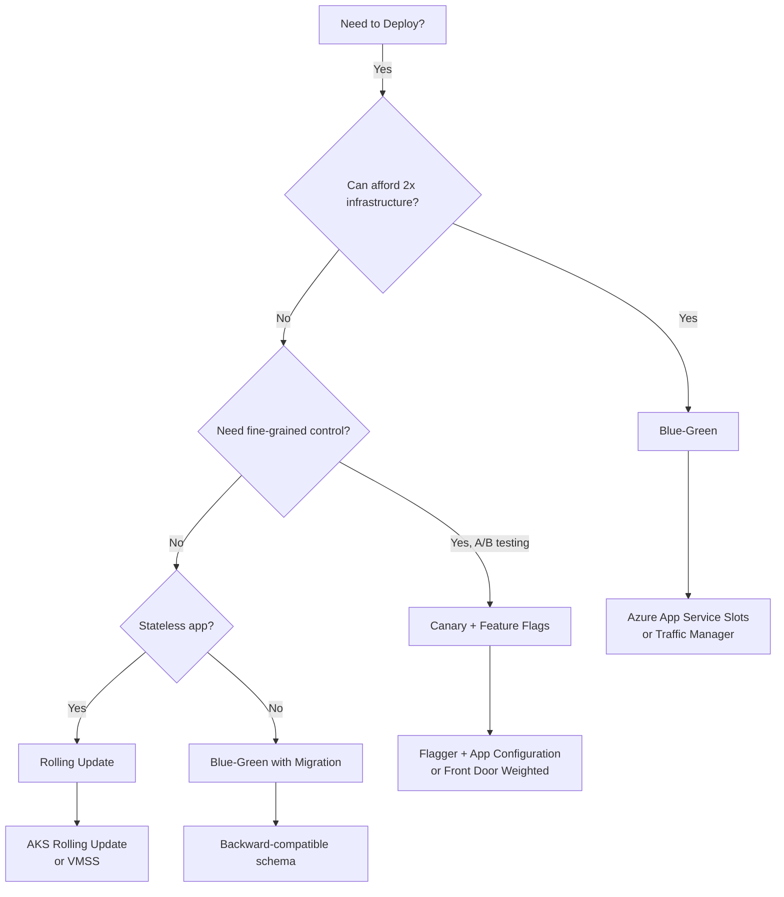

# DevOps & CI/CD

## What You'll Learn

By the end of this chapter, you'll understand:

- **What DevOps actually means** - Why companies deploy software 100x faster than they did 10 years ago
- **CI/CD pipelines** - How code automatically goes from your laptop to production in minutes (not weeks!)
- **GitHub Actions** - How to write your first automated deployment pipeline
- **Infrastructure as Code** - How to create entire cloud environments with just a text file
- **Deployment strategies** - Blue-Green, Canary, Rolling deploys (and when to use each)
- **Real-world costs** - Why bad deployments cost $1 million per hour

---

## Introduction: What is DevOps? (Start Here if You're New)

### The Problem Before DevOps

**Traditional software deployment** (The slow, painful way):

```
Week 1:
Developer writes code → Tests locally on their laptop → "It works on my machine!"
  ↓
Week 2:
Developer hands code to QA team → QA finds bugs → Developer fixes → Repeat
  ↓
Week 3:
QA approves → Code sent to Operations team → "Please deploy this to production"
  ↓
Week 4:
Operations team reviews code → Finds incompatible dependencies → Rejects deployment
  ↓ "Your code needs Python 3.9, but production has Python 3.7"
  ↓ Developer rewrites code
  ↓
Week 6:
Operations finally deploys → Manually copies files to server → Restarts application
  ↓ Application crashes (forgot to update database schema!)
  ↓ Operations rolls back manually
  ↓
Result: 6 weeks to deploy, deployment FAILED ❌
```

**Real Example**:
- Knight Capital Group (2012)
- Manual deployment error
- Lost $440 million in 45 minutes
- Company went bankrupt

---

### The Solution: DevOps + Automation

**Modern deployment with DevOps**:

```
Monday 9:00 AM:
Developer writes code → Commits to GitHub
  ↓ (30 seconds)
Automated pipeline starts automatically:
  ↓ Step 1: Build code (2 min)
  ↓ Step 2: Run 500 automated tests (3 min)
  ↓ Step 3: Security scan for vulnerabilities (1 min)
  ↓ Step 4: Deploy to Dev environment (1 min)
  ↓ Step 5: Run smoke tests (1 min)
  ↓ Step 6: Deploy to Staging (1 min)
  ↓ Step 7: Run integration tests (2 min)
  ↓ Step 8: Deploy to Production (1 min)
  ↓
Monday 9:12 AM:
Code is live in production ✅

Total time: 12 minutes
Human intervention: 0
Errors: Caught automatically by tests
```

**DevOps Benefits (Real Numbers)**:

| Metric | Before DevOps | After DevOps | Improvement |
|--------|--------------|--------------|-------------|
| **Deployment Frequency** | Once/month | 100x/day | 3,000x faster |
| **Deployment Time** | 6 weeks | 12 minutes | 6,000x faster |
| **Deployment Failures** | 30% | 0.1% | 300x more reliable |
| **Mean Time to Recovery** | 4 hours | 5 minutes | 48x faster |

**Source**: Google DORA (DevOps Research and Assessment) Report 2023

---

### What is DevOps? (Simple Explanation)

**DevOps = Development + Operations working together using automation**

**Think of it like a factory assembly line**:

**Before DevOps (Manual process)**:
```
Worker 1: Builds car frame (manually welding, 8 hours)
  ↓ Hands to Worker 2
Worker 2: Installs engine (manually, 6 hours)
  ↓ Hands to Worker 3
Worker 3: Paints car (manually, 4 hours)
  ↓
Total time: 18 hours per car
Quality: Inconsistent (human error)
Cost: $50,000 per car
```

**With DevOps (Automated assembly line)**:
```
Station 1: Robot welds frame (15 minutes)
  ↓ Automatically moves to Station 2
Station 2: Robot installs engine (10 minutes)
  ↓ Automatically moves to Station 3
Station 3: Robot paints car (12 minutes)
  ↓
Total time: 37 minutes per car
Quality: Perfect every time (machines don't make mistakes)
Cost: $15,000 per car
```

**Same concept for software**:
- Automation replaces manual steps
- Faster, more reliable, cheaper
- Developers and Operations use the same tools/processes

---

### What is CI/CD? (Breaking It Down)

**CI/CD = Continuous Integration + Continuous Deployment**

**1. Continuous Integration (CI) = "Merge code often, test automatically"**

**The Old Way** (Integration Hell):
```
Developer A works on feature for 2 months (doesn't merge code)
Developer B works on different feature for 2 months (doesn't merge code)
  ↓
Month 3: Both developers try to merge
  ↓ 500 merge conflicts!
  ↓ 2 weeks to resolve conflicts
  ↓ Tests fail everywhere
  ↓ 2 more weeks to fix tests
Result: 1 month wasted on integration ❌
```

**With CI** (Merge small changes daily):
```
Developer A commits small change (20 lines)
  ↓ Automated tests run (5 minutes)
  ↓ If tests pass → Code merged automatically ✅
  ↓ If tests fail → Developer fixes immediately (10 minutes)
  ↓
Developer B commits small change (30 lines)
  ↓ Automated tests run (5 minutes)
  ↓ Tests pass → Merged ✅
  ↓
Result: No integration problems! ✅
```

**2. Continuous Deployment (CD) = "Deploy to production automatically"**

**The Old Way** (Manual deployment):
```
Friday 5:00 PM: "We're ready to deploy!"
  ↓ Operations team: "We need to schedule maintenance window"
  ↓ Saturday 2:00 AM: Operations manually deploys
  ↓ 2:30 AM: Deployment fails (missing configuration file)
  ↓ 3:00 AM: Operations calls developer
  ↓ Developer (sleeping): Doesn't answer
  ↓ 3:30 AM: Application still down
  ↓ 8:00 AM: CEO wakes up, website still broken, loses $500k in sales
Result: Failed deployment, exhausted team, angry CEO ❌
```

**With CD** (Automated deployment):
```
Developer commits code → Tests pass → Automatically deploys to production
  ↓ If deployment fails → Automatically rolls back to previous version
  ↓ Total time: 12 minutes
  ↓ Human involvement: 0 (happens during business hours, not 2 AM)
  ↓ Deployment succeeds 99.9% of the time
Result: Reliable, fast, no weekend emergencies ✅
```

---

### The Cost of NOT Using DevOps

**Real-World Disasters**:

**Example 1: Healthcare.gov Launch (2013)**
- Problem: Manual deployment, no automation, no testing
- Result: Website crashed on day 1, couldn't handle 250 users
- Cost: $1.7 billion to fix
- Prevention cost: ~$10 million (proper DevOps/CI/CD)
- ROI of DevOps: 170x

**Example 2: British Airways IT Outage (2017)**
- Problem: Manual data center migration, poor testing
- Result: 75,000 passengers stranded, 726 flights canceled
- Cost: $170 million
- Prevention cost: ~$1 million (automated testing + deployment)
- ROI of DevOps: 170x

**Example 3: Amazon Prime Day 2018**
- Problem: Deployment bug in new feature
- With DevOps: Detected in 2 minutes, rolled back automatically
- Cost: $4 million in lost sales
- Without DevOps (if took 1 hour): $120 million in lost sales

**Average cost of downtime** (Gartner 2023):
- Small business: $8,500/hour
- Medium business: $74,000/hour
- Enterprise: $1,000,000+/hour

---

### How CI/CD Actually Works (Behind the Scenes)

**Real-World Example: Deploying a Node.js web app**

**Step-by-Step Pipeline**:

```
Step 1: Developer commits code
  ↓ git commit -m "Add user login feature"
  ↓ git push origin main
  ↓
Step 2: GitHub detects commit
  ↓ Webhook triggers pipeline
  ↓
Step 3: Create fresh build environment
  ↓ GitHub spins up Ubuntu VM (30 seconds)
  ↓
Step 4: Install dependencies
  ↓ npm install (downloads 1,247 packages in 45 seconds)
  ↓
Step 5: Run linter (check code quality)
  ↓ eslint finds 3 style errors → Build FAILS ❌
  ↓ Developer fixes errors, commits again
  ↓
Step 6: Run unit tests
  ↓ 247 tests run (2 minutes)
  ↓ All tests pass ✅
  ↓
Step 7: Run security scan
  ↓ Checks for known vulnerabilities in dependencies (1 minute)
  ↓ Finds 1 critical vulnerability in old package
  ↓ Build FAILS ❌
  ↓ Developer updates package, commits again
  ↓
Step 8: Build application
  ↓ Compile TypeScript → JavaScript (1 minute)
  ↓ Minify/optimize code (30 seconds)
  ↓ Create Docker container (1 minute)
  ↓
Step 9: Deploy to Dev environment
  ↓ Push Docker container to Azure Container Registry (30 seconds)
  ↓ Deploy to Azure App Service Dev slot (1 minute)
  ↓ Run smoke tests (30 seconds)
  ↓ All tests pass ✅
  ↓
Step 10: Deploy to Staging
  ↓ Deploy to Azure App Service Staging slot (1 minute)
  ↓ Run integration tests (2 minutes)
  ↓ Load test with 1,000 simulated users (1 minute)
  ↓ All tests pass ✅
  ↓
Step 11: Deploy to Production
  ↓ Wait for manual approval (human clicks "Approve" button)
  ↓ Blue-Green deployment (swap staging → production)
  ↓ Deployment completes in 5 seconds
  ↓ Monitor for 5 minutes (check error rates, latency)
  ↓ Everything looks good ✅
  ↓
Result: Code is live! Total time: 12 minutes (most is automated)
```

---

**What is DevOps?** DevOps is a combination of "Development" and "Operations." It's a culture and set of practices that brings together software development (Dev) and IT operations (Ops) to shorten the development lifecycle and deliver high-quality software faster.

**What is CI/CD?**
- **CI (Continuous Integration)**: Automatically build and test code every time someone commits changes. Catches bugs early.
- **CD (Continuous Deployment/Delivery)**: Automatically deploy code to production after tests pass. Reduces manual errors.

**Why DevOps Matters**:
- **Before DevOps**: Developers write code → Hand it to operations → Operations manually deploy → Takes days/weeks → Errors happen
- **With DevOps**: Developers commit code → Pipeline automatically builds, tests, deploys → Takes minutes → Fewer errors

**Real-World Analogy**:
- **Old Way**: Like building a house. You build it, then call inspectors, then fix issues, then move in (weeks/months).
- **DevOps Way**: Like a factory assembly line. Each step is automated, tested, and quality-checked automatically (hours/minutes).


---

## 1. Understanding CI/CD Pipelines

**What is a Pipeline?** A pipeline is a series of automated steps that take your code from source control to production. Think of it as a recipe: each step (ingredient) must complete successfully before moving to the next.

**Pipeline Stages**:

```
1. Source Control (Git)
   ↓
2. Build (Compile code, install dependencies)
   ↓
3. Test (Run unit tests, integration tests)
   ↓
4. Security Scan (Check for vulnerabilities)
   ↓
5. Package (Create deployable artifact)
   ↓
6. Deploy to Dev (Automatic)
   ↓
7. Deploy to Staging (Automatic)
   ↓
8. Deploy to Production (Manual approval)
```

**Why Automate?**
- **Speed**: Deploy in minutes instead of hours/days
- **Consistency**: Same process every time (no human error)
- **Quality**: Tests run automatically (catch bugs before production)
- **Traceability**: See exactly what was deployed and when

### Azure DevOps vs GitHub Actions

**Which Should You Choose?**

| Feature | Azure DevOps | GitHub Actions |
|---------|--------------|----------------|
| **Source Control** | Azure Repos | GitHub |
| **CI/CD** | Azure Pipelines | GitHub Actions |
| **Free Tier** | 1,800 min/month | 2,000 min/month |
| **Self-Hosted** | Yes | Yes |
| **Marketplace** | Extensions | Actions Marketplace |
| **Best For** | Enterprise, Microsoft stack | Open source, GitHub-first |

| **Best For** | Enterprise, Microsoft stack | Open source, GitHub-first |

> [!WARNING]
> **Gotcha: Secrets in Logs**
> Never print environment variables or secrets to the console for debugging. Once a secret is in the build logs, it is compromised forever. Use **Azure Key Vault** to inject secrets at runtime without exposing them.

> [!TIP]
> **Jargon Alert: Idempotency**
> A fancy word for "safe to run twice." Good Infrastructure as Code (IaC) is idempotent: if you deploy the same Bicep file 100 times, nothing changes after the first time. Bad scripts create 100 duplicate resources.

---

## 2. GitHub Actions: Complete Guide

**What is GitHub Actions?** GitHub Actions is a CI/CD platform built into GitHub. You define workflows (pipelines) using YAML files in your repository. When you push code, GitHub automatically runs your workflows.

**Why GitHub Actions?**
- ✅ Free for public repositories
- ✅ 2,000 free minutes/month for private repos
- ✅ Integrated with GitHub (no separate tool)
- ✅ Huge marketplace of pre-built actions
- ✅ Easy to get started

> [!WARNING]
> **Gotcha: GitHub Actions Minutes Can Run Out**
> Free tier gives 2,000 minutes/month. If your workflows run frequently or take long, you'll hit the limit. Self-hosted runners are free (unlimited), but you manage the infrastructure. Monitor your usage in Settings → Billing.

> [!TIP]
> **Jargon Alert: Workflow vs Action**
> **Workflow**: The entire pipeline (the YAML file). Defines when to run and what jobs to execute.
> **Action**: A reusable step (like `actions/checkout@v3`). Think of it as a pre-built function you can call. Actions are published to the GitHub Marketplace.

> [!INFO]
> **Aside: GitHub Actions Pricing**
> - Public repos: Unlimited free minutes
> - Private repos: 2,000 free minutes/month, then $0.008/minute
> - Self-hosted runners: Free (unlimited), but you pay for the VM/infrastructure

### Step-by-Step: Creating Your First GitHub Actions Workflow

Let's create a complete CI/CD pipeline from scratch:

#### Step 1: Create Workflow File

**Where?** Create `.github/workflows/` directory in your repository root.

```bash
# Create directory structure
mkdir -p .github/workflows

# Create workflow file
touch .github/workflows/ci-cd.yml
```

**File Structure**:
```
my-repo/
├── .github/
│   └── workflows/
│       └── ci-cd.yml    ← Your pipeline definition
├── src/
├── tests/
└── package.json
```

#### Step 2: Basic Workflow Structure

```yaml
# .github/workflows/ci-cd.yml
name: CI/CD Pipeline

# When to run: On every push to main branch
on:
  push:
    branches:
      - main
  pull_request:
    branches:
      - main

# Jobs: A workflow can have multiple jobs (run in parallel or sequence)
jobs:
  build-and-test:
    # Run on Ubuntu (Linux virtual machine)
    runs-on: ubuntu-latest
    
    # Steps: What to do
    steps:
      # Step 1: Checkout code (download your repository)
      - name: Checkout code
        uses: actions/checkout@v3
      
      # Step 2: Setup Node.js
      - name: Setup Node.js
        uses: actions/setup-node@v3
        with:
          node-version: '18'
      
      # Step 3: Install dependencies
      - name: Install dependencies
        run: npm install
      
      # Step 4: Run tests
      - name: Run tests
        run: npm test
      
      # Step 5: Build application
      - name: Build application
        run: npm run build
```

**What Each Part Does**:

<Tabs>
  <Tab title="name">
    **What**: Name of your workflow (shows in GitHub Actions tab)
    
    **Example**: `name: CI/CD Pipeline`
    
    **Why**: Helps identify workflows when you have multiple
  </Tab>
  
  <Tab title="on">
    **What**: Triggers that start the workflow
    
    **Common Triggers**:
    - `push`: When code is pushed to a branch
    - `pull_request`: When a PR is opened/updated
    - `schedule`: Run on a schedule (cron)
    - `workflow_dispatch`: Manual trigger from GitHub UI
    
    **Example**:
    ```yaml
    on:
      push:
        branches: [main]
      schedule:
        - cron: '0 2 * * *'  # Run at 2 AM daily
    ```
  </Tab>
  
  <Tab title="jobs">
    **What**: A job is a set of steps that run on the same runner (VM)
    
    **Multiple Jobs**: Jobs run in parallel by default (faster)
    
    **Example**:
    ```yaml
    jobs:
      build:
        # Job 1: Build
      test:
        # Job 2: Test (runs at same time as build)
      deploy:
        needs: [build, test]  # Wait for build and test to finish
        # Job 3: Deploy (runs after build and test succeed)
    ```
  </Tab>
  
  <Tab title="steps">
    **What**: Individual commands or actions to execute
    
    **Types**:
    - `uses`: Run a pre-built action (like `actions/checkout@v3`)
    - `run`: Execute a shell command (like `npm install`)
    - `name`: Human-readable name (shows in logs)
    
    **Example**:
    ```yaml
    steps:
      - name: Install dependencies
        run: npm install
      
      - name: Run tests
        run: npm test
    ```
  </Tab>
</Tabs>

#### Step 3: Complete CI/CD Workflow Example

Here's a complete workflow that builds, tests, and deploys a Node.js app to Azure App Service:

```yaml
name: Build, Test, and Deploy

on:
  push:
    branches: [main]
  workflow_dispatch:  # Allow manual trigger

env:
  NODE_VERSION: '18'
  AZURE_WEBAPP_NAME: 'mywebapp-prod'

jobs:
  # Job 1: Build and Test
  build-and-test:
    runs-on: ubuntu-latest
    
    steps:
      - name: Checkout code
        uses: actions/checkout@v3
      
      - name: Setup Node.js
        uses: actions/setup-node@v3
        with:
          node-version: ${{ env.NODE_VERSION }}
          cache: 'npm'  # Cache node_modules for faster builds
      
      - name: Install dependencies
        run: npm ci  # ci = clean install (faster, more reliable)
      
      - name: Run linter
        run: npm run lint
        continue-on-error: true  # Don't fail if linting fails
      
      - name: Run tests
        run: npm test
      
      - name: Build application
        run: npm run build
      
      - name: Upload build artifacts
        uses: actions/upload-artifact@v3
        with:
          name: dist
          path: dist/
          retention-days: 1  # Keep artifacts for 1 day
      
      - name: Run security scan
        uses: aquasecurity/trivy-action@master
        with:
          scan-type: 'fs'
          scan-ref: '.'
          format: 'sarif'
          output: 'trivy-results.sarif'
      
      - name: Upload security results
        uses: github/codeql-action/upload-sarif@v2
        with:
          sarif_file: 'trivy-results.sarif'

  # Job 2: Deploy to Azure App Service
  deploy:
    runs-on: ubuntu-latest
    needs: build-and-test  # Wait for build-and-test to succeed
    if: github.ref == 'refs/heads/main'  # Only deploy from main branch
    
    steps:
      - name: Checkout code
        uses: actions/checkout@v3
      
      - name: Download build artifacts
        uses: actions/download-artifact@v3
        with:
          name: dist
          path: dist/
      
      - name: Setup Node.js
        uses: actions/setup-node@v3
        with:
          node-version: ${{ env.NODE_VERSION }}
      
      - name: Azure Login
        uses: azure/login@v1
        with:
          creds: ${{ secrets.AZURE_CREDENTIALS }}
      
      - name: Deploy to Azure App Service
        uses: azure/webapps-deploy@v2
        with:
          app-name: ${{ env.AZURE_WEBAPP_NAME }}
          package: './dist'
          startup-command: 'npm start'
```

**What This Workflow Does**:

1. **Triggers**: Runs on push to main or manual trigger
2. **Build Job**:
   - Checks out code
   - Installs dependencies (with caching)
   - Runs linter
   - Runs tests
   - Builds application
   - Uploads build artifacts
   - Scans for security vulnerabilities
3. **Deploy Job** (only if build succeeds):
   - Downloads build artifacts
   - Logs into Azure
   - Deploys to App Service

#### Step 4: Configure Azure Credentials

**What are Secrets?** Sensitive data (passwords, API keys) stored securely in GitHub. Never commit secrets to code!

**How to Set Up Azure Credentials**:

1. **Create Service Principal in Azure**:
```bash
# Create service principal
az ad sp create-for-rbac \
  --name "github-actions-sp" \
  --role contributor \
  --scopes /subscriptions/{subscription-id} \
  --sdk-auth

# Output (save this JSON):
{
  "clientId": "...",
  "clientSecret": "...",
  "subscriptionId": "...",
  "tenantId": "..."
}
```

2. **Add Secret to GitHub**:
   - Go to your GitHub repository
   - Settings → Secrets and variables → Actions
   - Click "New repository secret"
   - Name: `AZURE_CREDENTIALS`
   - Value: Paste the JSON from step 1
   - Click "Add secret"

**Why Service Principal?** It's a "service account" that GitHub Actions uses to authenticate to Azure. More secure than using your personal credentials.

#### Step 5: Understanding Workflow Features

<Tabs>
  <Tab title="Matrix Strategy (Multiple Versions)">
    **What**: Run the same job with different configurations (e.g., test on Node 16, 18, 20)
    
    **Example**:
    ```yaml
    strategy:
      matrix:
        node-version: [16, 18, 20]
        os: [ubuntu-latest, windows-latest]
    
    steps:
      - uses: actions/setup-node@v3
        with:
          node-version: ${{ matrix.node-version }}
    ```
    
    **Result**: Runs 6 jobs (3 Node versions × 2 OSes) in parallel
  </Tab>
  
  <Tab title="Conditional Steps">
    **What**: Run steps only if certain conditions are met
    
    **Example**:
    ```yaml
    steps:
      - name: Deploy to Production
        if: github.ref == 'refs/heads/main'
        run: ./deploy.sh
      
      - name: Deploy to Staging
        if: github.ref == 'refs/heads/develop'
        run: ./deploy-staging.sh
      
      - name: Send Slack Notification
        if: failure()  # Only if previous step failed
        run: ./notify-slack.sh
    ```
  </Tab>
  
  <Tab title="Environment Variables">
    **What**: Variables accessible to all steps in a job
    
    **Example**:
    ```yaml
    env:
      NODE_ENV: production
      API_URL: https://api.example.com
    
    steps:
      - name: Use environment variable
        run: echo "Deploying to ${{ env.API_URL }}"
    ```
  </Tab>
  
  <Tab title="Secrets">
    **What**: Secure variables (passwords, API keys) stored in GitHub
    
    **Example**:
    ```yaml
    steps:
      - name: Use secret
        run: |
          echo "Password is ${{ secrets.DATABASE_PASSWORD }}"
          # Never print secrets in logs! (GitHub hides them automatically)
    ```
    
    **Best Practice**: Never commit secrets to code. Always use GitHub Secrets.
  </Tab>
</Tabs>

#### Step 6: Advanced: Multi-Environment Deployment

**Deploy to Dev → Staging → Production**:

```yaml
name: Multi-Environment Deployment

on:
  push:
    branches: [main, develop]

jobs:
  deploy-dev:
    if: github.ref == 'refs/heads/develop'
    runs-on: ubuntu-latest
    environment: development  # GitHub environment
    steps:
      - uses: actions/checkout@v3
      - name: Deploy to Dev
        run: ./deploy.sh dev

  deploy-staging:
    if: github.ref == 'refs/heads/main'
    runs-on: ubuntu-latest
    environment: staging
    steps:
      - uses: actions/checkout@v3
      - name: Deploy to Staging
        run: ./deploy.sh staging

  deploy-production:
    if: github.ref == 'refs/heads/main'
    needs: deploy-staging
    runs-on: ubuntu-latest
    environment: production
    # Requires manual approval (configured in GitHub)
    steps:
      - uses: actions/checkout@v3
      - name: Deploy to Production
        run: ./deploy.sh production
```

**GitHub Environments**: Configure protection rules (required reviewers, wait timers) in repository settings.

---

## 3. Azure Pipelines (Alternative to GitHub Actions)

**When to Use Azure Pipelines**:
- Your organization already uses Azure DevOps
- Need advanced enterprise features (test plans, work items)
- Want integrated project management

### YAML Pipeline Example

```yaml
trigger:
  branches:
    include:
    - main

pool:
  vmImage: 'ubuntu-latest'

variables:
  buildConfiguration: 'Release'

stages:
- stage: Build
  jobs:
  - job: BuildJob
    steps:
    - task: DotNetCoreCLI@2
      displayName: 'Restore dependencies'
      inputs:
        command: 'restore'

    - task: DotNetCoreCLI@2
      displayName: 'Build project'
      inputs:
        command: 'build'
        arguments: '--configuration $(buildConfiguration)'

    - task: DotNetCoreCLI@2
      displayName: 'Run tests'
      inputs:
        command: 'test'
        arguments: '--configuration $(buildConfiguration)'

    - task: DotNetCoreCLI@2
      displayName: 'Publish'
      inputs:
        command: 'publish'
        publishWebProjects: true
        arguments: '--configuration $(buildConfiguration) --output $(Build.ArtifactStagingDirectory)'

    - publish: $(Build.ArtifactStagingDirectory)
      artifact: drop

- stage: Deploy
  dependsOn: Build
  condition: succeeded()
  jobs:
  - deployment: DeployWeb
    environment: 'production'
    strategy:
      runOnce:
        deploy:
          steps:
          - task: AzureWebApp@1
            displayName: 'Deploy to Azure Web App'
            inputs:
              azureSubscription: 'Azure-Connection'
              appName: 'mywebapp'
              package: '$(Pipeline.Workspace)/drop/**/*.zip'
```

---

## 3. Infrastructure as Code

### Bicep Example

```bicep
// main.bicep
param location string = resourceGroup().location
param environmentName string = 'prod'

resource appServicePlan 'Microsoft.Web/serverfarms@2022-03-01' = {
  name: 'plan-${environmentName}'
  location: location
  sku: {
    name: 'P1v2'
    tier: 'PremiumV2'
  }
}

resource webApp 'Microsoft.Web/sites@2022-03-01' = {
  name: 'webapp-${environmentName}-${uniqueString(resourceGroup().id)}'
  location: location
  properties: {
    serverFarmId: appServicePlan.id
    siteConfig: {
      alwaysOn: true
      ftpsState: 'Disabled'
      minTlsVersion: '1.2'
    }
  }
  identity: {
    type: 'SystemAssigned'
  }
}

output webAppName string = webApp.name
```

### Deploy with Azure CLI

```bash
az deployment group create \
  --resource-group rg-prod \
  --template-file main.bicep \
  --parameters environmentName=prod
```

---

## 4. GitOps

Use Git as single source of truth for infrastructure and applications.

<div className="flex justify-center my-4">
  <div className="w-full max-w-4xl">
    ```mermaid
    graph LR
        A[Git Commit] --> B[Pipeline Trigger]
        B --> C[Build & Test]
        C --> D[Deploy to Dev]
        D --> E[Deploy to Staging]
        E --> F{Approval}
        F -->|Approved| G[Deploy to Prod]
    ```
  </div>
</div>

---

## 5. Deployment Strategies

Choosing the right deployment strategy can be the difference between a seamless release and a production outage.

### Strategy Comparison

| Strategy | Risk | Rollback Speed | Cost | Complexity | Best For |
|----------|------|----------------|------|------------|----------|
| **Blue-Green** | Low | Instant | High (2x infra) | Low | Critical systems, databases |
| **Canary** | Very Low | Fast (minutes) | Medium | High | User-facing apps, A/B testing |
| **Rolling** | Medium | Slow (gradual) | Low | Medium | Stateless apps, microservices |
| **Feature Flags** | Minimal | Instant | Low | Medium | SaaS, gradual rollouts |

---

### Blue-Green Deployment

Deploy to an identical "green" environment while "blue" runs production. Swap traffic instantly.

#### Azure Implementation

**Using Azure App Service Deployment Slots**:

```bash
# Deploy new version to staging slot
az webapp deployment source config-zip \
  --resource-group rg-prod \
  --name myapp \
  --slot staging \
  --src app.zip

# Warm up the staging slot
curl https://myapp-staging.azurewebsites.net/health

# Instant swap to production (zero downtime)
az webapp deployment slot swap \
  --resource-group rg-prod \
  --name myapp \
  --slot staging \
  --target-slot production
```

**Key Features**:
- **Auto-Swap**: Automatically swap after successful deployment.
- **Swap with Preview**: Test in production config before committing.
- **Instant Rollback**: If issues detected, swap back in &lt;5 seconds.

> [!WARNING]
> **Gotcha: Database Migrations**
> Blue-green works great for stateless apps, but database schema changes are tricky. Both blue and green must support the current schema. Use **backward-compatible migrations** (add columns, don't drop).

**Real-World Example**: A bank deploys during business hours using blue-green. New code goes to green, runs smoke tests, then swaps. If fraud detection service fails, they swap back in 3 seconds—no customer impact.

---

### Canary Deployment

Route a small percentage of traffic (5%) to the new version. If metrics look good, gradually increase to 100%.

#### AKS with Flagger

```yaml
# canary.yaml
apiVersion: flagger.app/v1beta1
kind: Canary
metadata:
  name: myapp
spec:
  targetRef:
    apiVersion: apps/v1
    kind: Deployment
    name: myapp
  service:
    port: 80
  analysis:
    interval: 1m
    threshold: 5
    maxWeight: 50
    stepWeight: 10
    metrics:
    - name: request-success-rate
      thresholdRange:
        min: 99
      interval: 1m
    - name: request-duration
      thresholdRange:
        max: 500
      interval: 1m
```

**How It Works**:
1. Deploy new version (`myapp-v2`).
2. Flagger routes **10%** of traffic to v2.
3. Wait 1 minute, check metrics (success rate >99%, latency &lt;500ms).
4. If healthy, increase to 20%, then 30%, etc.
5. If metrics fail, **automatic rollback** to v1.

**Azure Front Door Weighted Routing**:

```bash
# Add new backend pool with 10% weight
az network front-door routing-rule update \
  --front-door-name myfd \
  --name default-rule \
  --backend-pool pool-v1 \
  --backend-pool pool-v2 \
  --weight-v1 90 \
  --weight-v2 10
```

> [!TIP]
> **Best Practice: Canary Metrics**
> Don't just monitor HTTP 500s. Track business metrics like "checkout completion rate" or "login success rate." A technically healthy service might still break user workflows.

---

### Rolling Deployment

Update instances one at a time. If any instance fails, stop the rollout.

#### AKS Rolling Update

```yaml
apiVersion: apps/v1
kind: Deployment
metadata:
  name: myapp
spec:
  replicas: 10
  strategy:
    type: RollingUpdate
    rollingUpdate:
      maxUnavailable: 1    # Never have more than 1 pod down
      maxSurge: 2          # Create 2 extra pods during update
  template:
    spec:
      containers:
      - name: app
        image: myapp:v2
        readinessProbe:
          httpGet:
            path: /health
            port: 8080
          initialDelaySeconds: 10
          periodSeconds: 5
        livenessProbe:
          httpGet:
            path: /health
            port: 8080
          initialDelaySeconds: 30
          periodSeconds: 10
```

**How It Works**:
1. Kubernetes creates 2 new pods (v2) while 10 old pods (v1) still run.
2. Waits for new pods to pass readiness probe.
3. Terminates 1 old pod, creates 1 new pod.
4. Repeats until all 10 pods are running v2.

**Rollback**:
```bash
# Instant rollback to previous version
kubectl rollout undo deployment/myapp

# Rollback to specific revision
kubectl rollout undo deployment/myapp --to-revision=3
```

> [!WARNING]
> **Gotcha: PodDisruptionBudget**
> Without a PDB, Kubernetes might terminate too many pods during a node upgrade, causing an outage. Always set:
> ```yaml
> apiVersion: policy/v1
> kind: PodDisruptionBudget
> metadata:
>   name: myapp-pdb
> spec:
>   minAvailable: 8  # Keep at least 8/10 pods running
>   selector:
>     matchLabels:
>       app: myapp
> ```

---

### Feature Flags (Feature Toggles)

Deploy code with new features disabled. Enable features gradually via configuration.

#### Azure App Configuration + Feature Flags

```csharp
// Startup.cs
services.AddAzureAppConfiguration(options =>
{
    options
        .Connect(connectionString)
        .UseFeatureFlags(flags =>
        {
            flags.CacheExpirationInterval = TimeSpan.FromMinutes(5);
        });
});

// Controller.cs
[FeatureGate("NewCheckoutFlow")]
public IActionResult Checkout()
{
    return View("NewCheckout");
}

// If feature flag is OFF, this endpoint returns 404
```

**Gradual Rollout with Targeting**:

```json
{
  "id": "NewCheckoutFlow",
  "enabled": true,
  "conditions": {
    "client_filters": [
      {
        "name": "Microsoft.Percentage",
        "parameters": {
          "Value": 20
        }
      },
      {
        "name": "Microsoft.Targeting",
        "parameters": {
          "Audience": {
            "Users": ["user@example.com"],
            "Groups": ["beta-testers"],
            "DefaultRolloutPercentage": 20
          }
        }
      }
    ]
  }
}
```

**Rollout Plan**:
1. Enable for internal employees (100%).
2. Enable for beta users (100%).
3. Enable for 10% of general users.
4. Monitor metrics for 24 hours.
5. Increase to 50%, then 100%.
6. Remove feature flag from code after 2 weeks.

> [!TIP]
> **Best Practice: Feature Flag Lifecycle**
> Feature flags are **temporary**. Never let them live forever. Set a TTL (time-to-live) and remove the flag once the feature is stable. Otherwise, your code becomes a graveyard of `if (featureFlag)` checks.

---

### Comparison: Real-World Scenario

**Scenario**: Deploying a payment processing service update.

| Concern | Blue-Green | Canary | Rolling | Feature Flags |
|---------|-----------|--------|---------|---------------|
| **Zero Downtime** | ✅ Yes | ✅ Yes | ✅ Yes | ✅ Yes |
| **Instant Rollback** | ✅ &lt;5 sec | ⚠️ 5-10 min | ❌ 10-20 min | ✅ &lt;1 sec |
| **Cost** | ❌ 2x infra | ⚠️ 1.2x infra | ✅ 1x infra | ✅ 1x infra |
| **Database Migrations** | ⚠️ Need backward compat | ✅ Can test schema | ❌ Risky | ✅ Isolate changes |
| **A/B Testing** | ❌ All or nothing | ✅ Gradual rollout | ❌ All or nothing | ✅ Per-user targeting |
| **Recommendation** | ❌ Too expensive | ✅ **Best choice** | ⚠️ Use with caution | ✅ **Combine with Canary** |

**Recommended Approach**: Use **Canary + Feature Flags**. Deploy code to production with the feature flag OFF. Enable the flag for 1% of users (canary), monitor for issues, then gradually roll out to 100%.

---

### Decision Flowchart



---

## 6. Interview Questions

### Beginner Level

<AccordionGroup>
  <Accordion title="Q1: What is CI/CD?">
    **Answer**:
    - **CI (Continuous Integration)**: Automating the build and testing of code every time a team member commits changes to version control.
    - **CD (Continuous Deployment/Delivery)**: Automating the release of validated code to a repository or production environment.
  </Accordion>

  <Accordion title="Q2: What is the difference between Azure DevOps and GitHub Actions?">
    **Answer**:
    - **Azure DevOps**: Complete suite (Boards, Repos, Pipelines, Test Plans, Artifacts). Great for enterprise management and tracking.
    - **GitHub Actions**: Workflow automation engine built into GitHub. Closer to the code, massive open-source community, simpler for CI.
  </Accordion>
</AccordionGroup>

### Intermediate Level

<AccordionGroup>
  <Accordion title="Q3: Explain the concept of Infrastructure as Code (IaC)">
    **Answer**:
    Managing and provisioning infrastructure through code (Bicep/Terraform) rather than manual processes.
    **Benefits**:
    - **Consistency**: Same environment every time.
    - **Version Control**: Track history of changes.
    - **Speed**: Deploy entire environments in minutes.
    - **Disaster Recovery**: Re-create environments from scratch easily.
  </Accordion>

  <Accordion title="Q4: What is a Self-Hosted Agent?">
    **Answer**:
    A machine that you set up and manage to run pipeline jobs.
    **Use Cases**:
    - Build needs access to private resources (VNet).
    - Specialized software/hardware requirements.
    - Caching large dependencies (faster builds).
  </Accordion>
</AccordionGroup>

### Advanced Level

<AccordionGroup>
  <Accordion title="Q5: How do you implement a secure supply chain?">
    **Answer**:
    1. **Dependency Scanning**: Check NuGet/NPM packages for vulnerabilities (GitHub Dependabot).
    2. **Secret Scanning**: Detect committed credentials.
    3. **Container Scanning**: Scan Docker images for CVEs (Trivy/Defender).
    4. **Code Signing**: Sign build artifacts to ensure integrity.
    5. **Least Privilege**: Pipeline service connections should have minimal permissions.
  </Accordion>
</AccordionGroup>

---

## 6. Key Takeaways

<CardGroup cols={2}>
  <Card title="Automate Everything" icon="robot">
    If you do it twice, automate it. Manual deployments are forbidden in production.
  </Card>
  <Card title="Infrastructure as Code" icon="code">
    Treat infrastructure like software. Use Bicep or Terraform for reproducible environments.
  </Card>
  <Card title="Shift Left" icon="arrow-left">
    Test security and quality early in the pipeline, not after deployment.
  </Card>
  <Card title="GitOps" icon="git-alt">
    Git is the single source of truth. Deployment reflects the state of the main branch.
  </Card>
  <Card title="Ephemerality" icon="wind">
    Build agents and environments should be disposable. Don't rely on snowflake servers.
  </Card>
</CardGroup>

---

## Next Steps

<Card title="Continue to Chapter 12" icon="arrow-right" href="/courses/azure-cloud-engineering/12-cost-optimization">
  Master Azure cost optimization and FinOps strategies
</Card>
