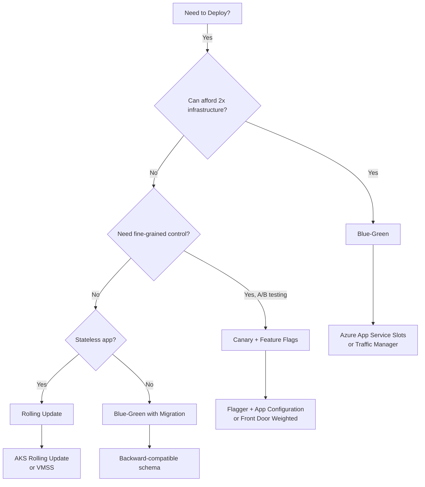

# DevOps & CI/CD

Automate deployments, infrastructure, and operations with Azure DevOps and Infrastructure as Code.


---

## 1. Azure DevOps vs GitHub Actions

| Feature | Azure DevOps | GitHub Actions |
|---------|--------------|----------------|
| **Source Control** | Azure Repos | GitHub |
| **CI/CD** | Azure Pipelines | GitHub Actions |
| **Free Tier** | 1,800 min/month | 2,000 min/month |
| **Self-Hosted** | Yes | Yes |
| **Marketplace** | Extensions | Actions Marketplace |
| **Best For** | Enterprise, Microsoft stack | Open source, GitHub-first |

| **Best For** | Enterprise, Microsoft stack | Open source, GitHub-first |

> [!WARNING]
> **Gotcha: Secrets in Logs**
> Never print environment variables or secrets to the console for debugging. Once a secret is in the build logs, it is compromised forever. Use **Azure Key Vault** to inject secrets at runtime without exposing them.

> [!TIP]
> **Jargon Alert: Idempotency**
> A fancy word for "safe to run twice." Good Infrastructure as Code (IaC) is idempotent: if you deploy the same Bicep file 100 times, nothing changes after the first time. Bad scripts create 100 duplicate resources.

---

## 2. Azure Pipelines

### YAML Pipeline Example

```yaml
trigger:
  branches:
    include:
    - main

pool:
  vmImage: 'ubuntu-latest'

variables:
  buildConfiguration: 'Release'

stages:
- stage: Build
  jobs:
  - job: BuildJob
    steps:
    - task: DotNetCoreCLI@2
      displayName: 'Restore dependencies'
      inputs:
        command: 'restore'

    - task: DotNetCoreCLI@2
      displayName: 'Build project'
      inputs:
        command: 'build'
        arguments: '--configuration $(buildConfiguration)'

    - task: DotNetCoreCLI@2
      displayName: 'Run tests'
      inputs:
        command: 'test'
        arguments: '--configuration $(buildConfiguration)'

    - task: DotNetCoreCLI@2
      displayName: 'Publish'
      inputs:
        command: 'publish'
        publishWebProjects: true
        arguments: '--configuration $(buildConfiguration) --output $(Build.ArtifactStagingDirectory)'

    - publish: $(Build.ArtifactStagingDirectory)
      artifact: drop

- stage: Deploy
  dependsOn: Build
  condition: succeeded()
  jobs:
  - deployment: DeployWeb
    environment: 'production'
    strategy:
      runOnce:
        deploy:
          steps:
          - task: AzureWebApp@1
            displayName: 'Deploy to Azure Web App'
            inputs:
              azureSubscription: 'Azure-Connection'
              appName: 'mywebapp'
              package: '$(Pipeline.Workspace)/drop/**/*.zip'
```

---

## 3. Infrastructure as Code

### Bicep Example

```bicep
// main.bicep
param location string = resourceGroup().location
param environmentName string = 'prod'

resource appServicePlan 'Microsoft.Web/serverfarms@2022-03-01' = {
  name: 'plan-${environmentName}'
  location: location
  sku: {
    name: 'P1v2'
    tier: 'PremiumV2'
  }
}

resource webApp 'Microsoft.Web/sites@2022-03-01' = {
  name: 'webapp-${environmentName}-${uniqueString(resourceGroup().id)}'
  location: location
  properties: {
    serverFarmId: appServicePlan.id
    siteConfig: {
      alwaysOn: true
      ftpsState: 'Disabled'
      minTlsVersion: '1.2'
    }
  }
  identity: {
    type: 'SystemAssigned'
  }
}

output webAppName string = webApp.name
```

### Deploy with Azure CLI

```bash
az deployment group create \
  --resource-group rg-prod \
  --template-file main.bicep \
  --parameters environmentName=prod
```

---

## 4. GitOps

Use Git as single source of truth for infrastructure and applications.

<div className="flex justify-center my-4">
  <div className="w-full max-w-4xl">
    ```mermaid
    graph LR
        A[Git Commit] --> B[Pipeline Trigger]
        B --> C[Build & Test]
        C --> D[Deploy to Dev]
        D --> E[Deploy to Staging]
        E --> F{Approval}
        F -->|Approved| G[Deploy to Prod]
    ```
  </div>
</div>

---

## 5. Deployment Strategies

Choosing the right deployment strategy can be the difference between a seamless release and a production outage.

### Strategy Comparison

| Strategy | Risk | Rollback Speed | Cost | Complexity | Best For |
|----------|------|----------------|------|------------|----------|
| **Blue-Green** | Low | Instant | High (2x infra) | Low | Critical systems, databases |
| **Canary** | Very Low | Fast (minutes) | Medium | High | User-facing apps, A/B testing |
| **Rolling** | Medium | Slow (gradual) | Low | Medium | Stateless apps, microservices |
| **Feature Flags** | Minimal | Instant | Low | Medium | SaaS, gradual rollouts |

---

### Blue-Green Deployment

Deploy to an identical "green" environment while "blue" runs production. Swap traffic instantly.

#### Azure Implementation

**Using Azure App Service Deployment Slots**:

```bash
# Deploy new version to staging slot
az webapp deployment source config-zip \
  --resource-group rg-prod \
  --name myapp \
  --slot staging \
  --src app.zip

# Warm up the staging slot
curl https://myapp-staging.azurewebsites.net/health

# Instant swap to production (zero downtime)
az webapp deployment slot swap \
  --resource-group rg-prod \
  --name myapp \
  --slot staging \
  --target-slot production
```

**Key Features**:
- **Auto-Swap**: Automatically swap after successful deployment.
- **Swap with Preview**: Test in production config before committing.
- **Instant Rollback**: If issues detected, swap back in &lt;5 seconds.

> [!WARNING]
> **Gotcha: Database Migrations**
> Blue-green works great for stateless apps, but database schema changes are tricky. Both blue and green must support the current schema. Use **backward-compatible migrations** (add columns, don't drop).

**Real-World Example**: A bank deploys during business hours using blue-green. New code goes to green, runs smoke tests, then swaps. If fraud detection service fails, they swap back in 3 seconds—no customer impact.

---

### Canary Deployment

Route a small percentage of traffic (5%) to the new version. If metrics look good, gradually increase to 100%.

#### AKS with Flagger

```yaml
# canary.yaml
apiVersion: flagger.app/v1beta1
kind: Canary
metadata:
  name: myapp
spec:
  targetRef:
    apiVersion: apps/v1
    kind: Deployment
    name: myapp
  service:
    port: 80
  analysis:
    interval: 1m
    threshold: 5
    maxWeight: 50
    stepWeight: 10
    metrics:
    - name: request-success-rate
      thresholdRange:
        min: 99
      interval: 1m
    - name: request-duration
      thresholdRange:
        max: 500
      interval: 1m
```

**How It Works**:
1. Deploy new version (`myapp-v2`).
2. Flagger routes **10%** of traffic to v2.
3. Wait 1 minute, check metrics (success rate >99%, latency &lt;500ms).
4. If healthy, increase to 20%, then 30%, etc.
5. If metrics fail, **automatic rollback** to v1.

**Azure Front Door Weighted Routing**:

```bash
# Add new backend pool with 10% weight
az network front-door routing-rule update \
  --front-door-name myfd \
  --name default-rule \
  --backend-pool pool-v1 \
  --backend-pool pool-v2 \
  --weight-v1 90 \
  --weight-v2 10
```

> [!TIP]
> **Best Practice: Canary Metrics**
> Don't just monitor HTTP 500s. Track business metrics like "checkout completion rate" or "login success rate." A technically healthy service might still break user workflows.

---

### Rolling Deployment

Update instances one at a time. If any instance fails, stop the rollout.

#### AKS Rolling Update

```yaml
apiVersion: apps/v1
kind: Deployment
metadata:
  name: myapp
spec:
  replicas: 10
  strategy:
    type: RollingUpdate
    rollingUpdate:
      maxUnavailable: 1    # Never have more than 1 pod down
      maxSurge: 2          # Create 2 extra pods during update
  template:
    spec:
      containers:
      - name: app
        image: myapp:v2
        readinessProbe:
          httpGet:
            path: /health
            port: 8080
          initialDelaySeconds: 10
          periodSeconds: 5
        livenessProbe:
          httpGet:
            path: /health
            port: 8080
          initialDelaySeconds: 30
          periodSeconds: 10
```

**How It Works**:
1. Kubernetes creates 2 new pods (v2) while 10 old pods (v1) still run.
2. Waits for new pods to pass readiness probe.
3. Terminates 1 old pod, creates 1 new pod.
4. Repeats until all 10 pods are running v2.

**Rollback**:
```bash
# Instant rollback to previous version
kubectl rollout undo deployment/myapp

# Rollback to specific revision
kubectl rollout undo deployment/myapp --to-revision=3
```

> [!WARNING]
> **Gotcha: PodDisruptionBudget**
> Without a PDB, Kubernetes might terminate too many pods during a node upgrade, causing an outage. Always set:
> ```yaml
> apiVersion: policy/v1
> kind: PodDisruptionBudget
> metadata:
>   name: myapp-pdb
> spec:
>   minAvailable: 8  # Keep at least 8/10 pods running
>   selector:
>     matchLabels:
>       app: myapp
> ```

---

### Feature Flags (Feature Toggles)

Deploy code with new features disabled. Enable features gradually via configuration.

#### Azure App Configuration + Feature Flags

```csharp
// Startup.cs
services.AddAzureAppConfiguration(options =>
{
    options
        .Connect(connectionString)
        .UseFeatureFlags(flags =>
        {
            flags.CacheExpirationInterval = TimeSpan.FromMinutes(5);
        });
});

// Controller.cs
[FeatureGate("NewCheckoutFlow")]
public IActionResult Checkout()
{
    return View("NewCheckout");
}

// If feature flag is OFF, this endpoint returns 404
```

**Gradual Rollout with Targeting**:

```json
{
  "id": "NewCheckoutFlow",
  "enabled": true,
  "conditions": {
    "client_filters": [
      {
        "name": "Microsoft.Percentage",
        "parameters": {
          "Value": 20
        }
      },
      {
        "name": "Microsoft.Targeting",
        "parameters": {
          "Audience": {
            "Users": ["user@example.com"],
            "Groups": ["beta-testers"],
            "DefaultRolloutPercentage": 20
          }
        }
      }
    ]
  }
}
```

**Rollout Plan**:
1. Enable for internal employees (100%).
2. Enable for beta users (100%).
3. Enable for 10% of general users.
4. Monitor metrics for 24 hours.
5. Increase to 50%, then 100%.
6. Remove feature flag from code after 2 weeks.

> [!TIP]
> **Best Practice: Feature Flag Lifecycle**
> Feature flags are **temporary**. Never let them live forever. Set a TTL (time-to-live) and remove the flag once the feature is stable. Otherwise, your code becomes a graveyard of `if (featureFlag)` checks.

---

### Comparison: Real-World Scenario

**Scenario**: Deploying a payment processing service update.

| Concern | Blue-Green | Canary | Rolling | Feature Flags |
|---------|-----------|--------|---------|---------------|
| **Zero Downtime** | ✅ Yes | ✅ Yes | ✅ Yes | ✅ Yes |
| **Instant Rollback** | ✅ &lt;5 sec | ⚠️ 5-10 min | ❌ 10-20 min | ✅ &lt;1 sec |
| **Cost** | ❌ 2x infra | ⚠️ 1.2x infra | ✅ 1x infra | ✅ 1x infra |
| **Database Migrations** | ⚠️ Need backward compat | ✅ Can test schema | ❌ Risky | ✅ Isolate changes |
| **A/B Testing** | ❌ All or nothing | ✅ Gradual rollout | ❌ All or nothing | ✅ Per-user targeting |
| **Recommendation** | ❌ Too expensive | ✅ **Best choice** | ⚠️ Use with caution | ✅ **Combine with Canary** |

**Recommended Approach**: Use **Canary + Feature Flags**. Deploy code to production with the feature flag OFF. Enable the flag for 1% of users (canary), monitor for issues, then gradually roll out to 100%.

---

### Decision Flowchart



---

## 6. Interview Questions

### Beginner Level

<AccordionGroup>
  <Accordion title="Q1: What is CI/CD?">
    **Answer**:
    - **CI (Continuous Integration)**: Automating the build and testing of code every time a team member commits changes to version control.
    - **CD (Continuous Deployment/Delivery)**: Automating the release of validated code to a repository or production environment.
  </Accordion>

  <Accordion title="Q2: What is the difference between Azure DevOps and GitHub Actions?">
    **Answer**:
    - **Azure DevOps**: Complete suite (Boards, Repos, Pipelines, Test Plans, Artifacts). Great for enterprise management and tracking.
    - **GitHub Actions**: Workflow automation engine built into GitHub. Closer to the code, massive open-source community, simpler for CI.
  </Accordion>
</AccordionGroup>

### Intermediate Level

<AccordionGroup>
  <Accordion title="Q3: Explain the concept of Infrastructure as Code (IaC)">
    **Answer**:
    Managing and provisioning infrastructure through code (Bicep/Terraform) rather than manual processes.
    **Benefits**:
    - **Consistency**: Same environment every time.
    - **Version Control**: Track history of changes.
    - **Speed**: Deploy entire environments in minutes.
    - **Disaster Recovery**: Re-create environments from scratch easily.
  </Accordion>

  <Accordion title="Q4: What is a Self-Hosted Agent?">
    **Answer**:
    A machine that you set up and manage to run pipeline jobs.
    **Use Cases**:
    - Build needs access to private resources (VNet).
    - Specialized software/hardware requirements.
    - Caching large dependencies (faster builds).
  </Accordion>
</AccordionGroup>

### Advanced Level

<AccordionGroup>
  <Accordion title="Q5: How do you implement a secure supply chain?">
    **Answer**:
    1. **Dependency Scanning**: Check NuGet/NPM packages for vulnerabilities (GitHub Dependabot).
    2. **Secret Scanning**: Detect committed credentials.
    3. **Container Scanning**: Scan Docker images for CVEs (Trivy/Defender).
    4. **Code Signing**: Sign build artifacts to ensure integrity.
    5. **Least Privilege**: Pipeline service connections should have minimal permissions.
  </Accordion>
</AccordionGroup>

---

## 6. Key Takeaways

<CardGroup cols={2}>
  <Card title="Automate Everything" icon="robot">
    If you do it twice, automate it. Manual deployments are forbidden in production.
  </Card>
  <Card title="Infrastructure as Code" icon="code">
    Treat infrastructure like software. Use Bicep or Terraform for reproducible environments.
  </Card>
  <Card title="Shift Left" icon="arrow-left">
    Test security and quality early in the pipeline, not after deployment.
  </Card>
  <Card title="GitOps" icon="git-alt">
    Git is the single source of truth. Deployment reflects the state of the main branch.
  </Card>
  <Card title="Ephemerality" icon="wind">
    Build agents and environments should be disposable. Don't rely on snowflake servers.
  </Card>
</CardGroup>

---

## Next Steps

<Card title="Continue to Chapter 12" icon="arrow-right" href="/courses/azure-cloud-engineering/12-cost-optimization">
  Master Azure cost optimization and FinOps strategies
</Card>
