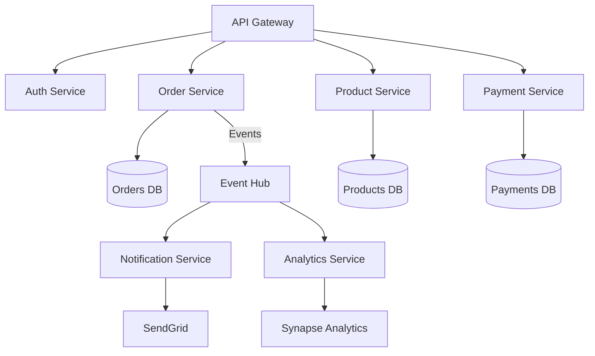
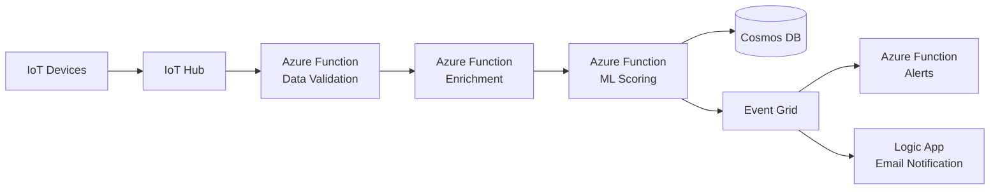
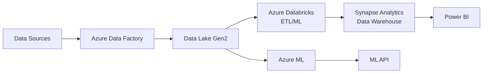
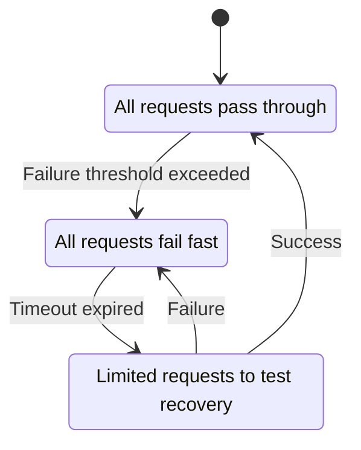

# Real-World Architecture Patterns

Learn proven architectural patterns used by Fortune 500 companies on Azure.


---

## What You'll Learn

By the end of this chapter, you'll understand:

- **What architecture patterns are** (and why they exist - to solve common problems)
- **How to design systems that scale** from 10 users to 10 million users
- **How to design systems that don't fail** (Circuit Breakers, Retries, Bulkheads)
- **Common architecture patterns** (N-Tier, Microservices, Hub-Spoke, CQRS, Event Sourcing)
- **When to use each pattern** (and when NOT to use them)
- **Real-world examples** with actual costs and trade-offs
- **How to test resilience** (Chaos Engineering)

---

## Introduction: What Are Architecture Patterns?

### Start Here if You're Completely New

**Architecture Pattern = A proven solution to a common problem**

Think of it like building a house:

**Without Patterns** (Reinventing the wheel):
```
Architect: "Let's invent a new way to support the roof!"
Result: Roof collapses ❌
Cost: $100,000 to rebuild
Time wasted: 6 months
```

**With Patterns** (Using proven solutions):
```
Architect: "Let's use load-bearing walls (a proven pattern)"
Result: Roof stays up ✅
Cost: $0 (used proven method)
Time saved: 6 months
```

**Architecture Patterns in Software**:
- **N-Tier Architecture** → Proven way to organize web applications
- **Circuit Breaker** → Proven way to handle failing dependencies
- **CQRS** → Proven way to scale reads vs writes
- **Hub-Spoke** → Proven way to secure network traffic

---

## Why Architecture Patterns Matter: The Cost of Bad Architecture

### Real-World Failure Example

**Knight Capital Group (2012)**
- **Bad Architecture**: No circuit breakers, no fallbacks
- **What happened**: Software bug caused trading algorithm to go haywire
- **Result**: Bought $7 billion of stocks in 45 minutes (unintended)
- **Loss**: $440 million
- **Outcome**: Company went bankrupt

**What Would Have Prevented This**:
- Circuit Breaker pattern → Stop after detecting errors
- Cost to implement: ~$50,000
- Savings: $440 million ✅

**More Examples**:

| Company | Bad Architecture | Cost | Prevention |
|---------|------------------|------|------------|
| **Amazon (2013)** | No timeout on database calls | $66,240 lost revenue/minute | Timeout pattern |
| **Target (2013)** | No network segmentation | $292M (data breach) | Hub-Spoke network |
| **Uber (2016)** | No conflict resolution | 100+ hours fixing data corruption | CQRS + Event Sourcing |

**The Pattern**: Good architecture costs thousands. Bad architecture costs millions.

---

## The Evolution of Architecture (From Simple to Complex)

Let's understand how architectures evolve as your app grows:

### Phase 1: Single Server (0-100 users)

```
Your Entire Application (1 server):
├── Web UI (React)
├── API (Node.js)
├── Database (SQLite file)
└── Files (local disk)

Cost: $50/month (one VM)
Downtime: If server crashes, everything is down ❌
Scaling: Can't handle more than 100 users
```

**Real-World Example**: Your personal blog, small side project

**When This Works**:
- ✅ Small user base (&lt;100 users)
- ✅ Low traffic (< 1,000 requests/day)
- ✅ Not mission-critical (downtime is OK)

**When This Fails**:
- ❌ Traffic spike (Reddit front page) → Server crashes
- ❌ Server fails → Entire app down
- ❌ Need to update code → Must take app offline

---

### Phase 2: N-Tier (100-10,000 users)

```
Tier 1: Web Servers (2 VMs)
├── Load Balancer (distributes traffic)
├── VM 1: React app
└── VM 2: React app

Tier 2: API Servers (2 VMs)
├── VM 3: Node.js API
└── VM 4: Node.js API

Tier 3: Database (1 server)
└── Azure SQL (managed database)

Cost: $500/month
Uptime: 99.9% (one VM can fail, others keep running)
Scaling: Can handle 10,000 concurrent users
```

**Real-World Example**: Most business websites, SaaS startups

**What Changed**:
- **Redundancy**: Multiple web servers (if one fails, others continue)
- **Separation**: Web, API, Database are independent
- **Scaling**: Add more web servers for more traffic

**When This Works**:
- ✅ Growing user base (100-10,000 users)
- ✅ Predictable traffic patterns
- ✅ Business-critical (need 99.9% uptime)

**When This Fails**:
- ❌ Massive traffic spikes (Black Friday) → Need autoscaling
- ❌ Global users → High latency for users far from server
- ❌ Complex business logic → Monolithic API becomes unmaintainable

---

### Phase 3: Microservices (10,000-1,000,000 users)

```
User Request
  ↓
API Gateway (Azure API Management)
  ↓
├── Auth Service (handles login)
├── Order Service (handles orders)
├── Payment Service (handles payments)
├── Inventory Service (checks stock)
└── Notification Service (sends emails)

Each service has its own:
- Database (data isolation)
- Code repository (deploy independently)
- Team (organizational independence)

Cost: $5,000/month
Uptime: 99.99% (services fail independently)
Scaling: Can handle 1,000,000 users
```

**Real-World Example**: Netflix, Uber, Airbnb, Amazon

**What Changed**:
- **Independence**: Each service deploys independently
- **Scaling**: Scale only the bottleneck (e.g., 10 Order Services, 2 Notification Services)
- **Resilience**: One service failing doesn't take down entire app

**When This Works**:
- ✅ Large team (>20 engineers)
- ✅ Complex business logic (100+ features)
- ✅ Need to deploy frequently (10+ times/day)

**When This Fails**:
- ❌ Small team (&lt;5 engineers) → Too much operational overhead
- ❌ Simple app → Over-engineering
- ❌ Tight coupling between services → "Distributed monolith" (worst of both worlds)

---

### Phase 4: Global Multi-Region (1,000,000+ users)

```
Global Load Balancer (Azure Front Door)
  ↓
├── US Region (East US)
│   ├── Microservices
│   ├── Database (primary)
│   └── Cache (Redis)
│
├── Europe Region (West Europe)
│   ├── Microservices
│   ├── Database (replica)
│   └── Cache (Redis)
│
└── Asia Region (Southeast Asia)
    ├── Microservices
    ├── Database (replica)
    └── Cache (Redis)

User in US → Routes to US region (low latency)
User in EU → Routes to EU region (low latency)

Cost: $50,000/month
Uptime: 99.999% (entire region can fail, others continue)
Latency: &lt;50ms anywhere in world
Scaling: Can handle 100,000,000 users
```

**Real-World Example**: Facebook, Google, Microsoft

**What Changed**:
- **Global**: Users get low latency worldwide
- **Disaster Recovery**: Entire region can go offline, app still works
- **Compliance**: Data stays in specific regions (GDPR, data residency)

**When This Works**:
- ✅ Global user base (millions of users)
- ✅ Revenue > $1M/month (can afford the cost)
- ✅ Need 99.999% uptime (banking, healthcare)

**When This Fails**:
- ❌ Regional business → Over-engineering
- ❌ Small budget → Can't afford $50k/month
- ❌ Complex data sync → Active-active conflicts

---

## Common Mistake: Premature Optimization (The Netflix Story)

**The Trap**:
```
Startup Founder: "We're going to be the next Netflix!"
Architect: "Let's build a microservices architecture from day 1!"

Result:
- 6 months building infrastructure
- $100,000 spent
- 0 customers ❌
- Company runs out of money
```

**What Netflix ACTUALLY Did**:
```
2007: Started with a MONOLITH (single Ruby on Rails app)
- Simple architecture
- Fast to build
- Delivered value to customers quickly ✅

2009: Had 10 million subscribers → THEN migrated to microservices
- Had revenue to fund the migration
- Had real problems to solve (scaling bottlenecks)
- Had data to inform architecture decisions
```

**Lesson**: Start simple. Evolve architecture as you grow.

**Decision Tree**: What architecture should I use?
```
Q1: How many users do you have?

├─ 0-100 users
│  └─ Answer: Single Server ($50/month) ✅
│
├─ 100-10,000 users
│  └─ Answer: N-Tier Architecture ($500/month) ✅
│
├─ 10,000-1,000,000 users
│  └─ Answer: Microservices ($5,000/month) ✅
│
└─ 1,000,000+ users
   └─ Answer: Multi-Region ($50,000/month) ✅

Reminder: You can ALWAYS migrate later!
- Start simple → Evolve as you grow
- Don't build for 1M users when you have 100
```

---

## 1. N-Tier Web Application

**Classic three-tier architecture with modern Azure services**

<div className="flex justify-center my-4">
  <div className="w-full max-w-4xl">
    ```mermaid
    graph TB
        Users[Users] -->|HTTPS| AFD[Azure Front Door<br/>WAF + CDN]
        AFD --> AppGW[Application Gateway<br/>Regional LB]
        AppGW --> Web[Web Tier<br/>App Service]
        Web --> API[API Tier<br/>AKS]
        API --> Cache[Redis Cache]
        API --> DB[(Azure SQL<br/>Zone-Redundant)]
        API --> Blob[Blob Storage<br/>GRS]

        Monitor[Azure Monitor] -.->|Logs| Web
        Monitor -.->|Logs| API
        Monitor -.->|Metrics| DB

        style AFD fill:#0078D4
        style AppGW fill:#FFB900
        style Web fill:#50E6FF
        style API fill:#00D084
    ```
  </div>
</div>

**Components**:
- **Azure Front Door**: Global load balancing, WAF, caching
- **Application Gateway**: Regional load balancer, path-based routing
- **App Service**: Web frontend (React, Angular)
- **AKS**: API backend (microservices)
- **Redis**: Session state, caching
- **Azure SQL**: Transactional data
- **Blob Storage**: Static assets, user uploads

**SLA**: 99.99% (composite)
**Cost**: ~$5,000/month (medium scale)

---

## 2. Microservices on AKS

**Event-driven microservices with Azure services**



**Patterns**:
- **API Gateway**: Single entry point (Azure API Management)
- **Service Mesh**: Istio/Linkerd for service-to-service communication
- **Event Sourcing**: Event Hub for asynchronous events
- **CQRS**: Separate read/write databases
- **Circuit Breaker**: Resilience4j for fault tolerance

> [!WARNING]
> **Gotcha: "Chatty" Microservices**
> If Service A calls Service B, which calls C, which calls D... you have a distributed monolith. Each hop adds latency and a point of failure. Prefer **asynchronous messaging** (Service Bus) to decouple services.

> [!TIP]
> **Jargon Alert: Circuit Breaker**
> If a service fails, stop calling it. The "Circuit Breaker" opens (stops traffic) to give the service time to recover, and returns a fast error/fallback to the user instead of hanging for 30 seconds.

---

## 3. Serverless Event Processing

**Real-time event processing with Azure Functions**



**Use Cases**:
- IoT telemetry processing
- Real-time analytics
- Event-driven workflows
- Data pipelines

**Benefits**:
- Auto-scaling (0 to millions)
- Pay per execution
- No infrastructure management

---

## 4. Hub-Spoke Network Topology

**Enterprise network architecture**

```
Hub VNet (10.0.0.0/16)
├── Azure Firewall
├── VPN Gateway
├── Azure Bastion
└── Shared Services (DNS, monitoring)

Spoke 1: Production (10.1.0.0/16)
├── Web Tier
├── App Tier
└── Data Tier

Spoke 2: Development (10.2.0.0/16)
├── Dev Environment
└── Testing

Spoke 3: Management (10.3.0.0/16)
├── Jump Boxes
└── Monitoring Tools

Traffic Flow:
- All internet traffic → Azure Firewall
- Spoke-to-spoke → Via hub (UDRs)
- On-premises → VPN Gateway
```

---

## 5. Data Platform

**Modern data analytics platform**



**Architecture**:
- **Data Ingestion**: Azure Data Factory
- **Storage**: Data Lake Gen2 (hot, cool, archive tiers)
- **Processing**: Databricks (Spark)
- **Warehouse**: Synapse Analytics
- **Visualization**: Power BI
- **ML**: Azure Machine Learning

---

## 6. Multi-Region Active-Active

**Global application with multi-region writes**

```
Region 1: East US
- App Service (active)
- Cosmos DB (write enabled)
- Azure SQL (read replica)

Region 2: West Europe
- App Service (active)
- Cosmos DB (write enabled)
- Azure SQL (read replica)

Region 3: Southeast Asia
- App Service (active)
- Cosmos DB (write enabled)
- Azure SQL (read replica)

Front Door:
- Routes to nearest healthy region
- Latency-based routing
- Automatic failover

Data Consistency:
- Cosmos DB: Multi-master with conflict resolution
- Azure SQL: Active geo-replication
```

---

## 7. Design Principles

<CardGroup cols={2}>
  <Card title="Design for Failure" icon="triangle-exclamation">
    Assume everything will fail. Build resilience and redundancy.
  </Card>

  <Card title="Decompose by Business Domain" icon="cubes">
    Microservices aligned with business capabilities.
  </Card>

  <Card title="Use Managed Services" icon="shield">
    Leverage PaaS over IaaS. Less operational overhead.
  </Card>

  <Card title="Make Services Stateless" icon="database">
    Store state externally (Redis, Cosmos DB). Enable horizontal scaling.
  </Card>

  <Card title="Design for Scaling" icon="chart-line">
    Auto-scaling, load balancing, caching strategies.
  </Card>

  <Card title="Security by Design" icon="lock">
    Zero trust, encryption everywhere, least privilege.
  </Card>
</CardGroup>

---

## 8. Resilience Patterns

In distributed systems, failures are inevitable. Resilience patterns help systems recover gracefully and prevent cascading failures.

### Pattern Overview

| Pattern | Problem | Solution | When to Use |
|---------|---------|----------|-------------|
| **Circuit Breaker** | Calling a failing service repeatedly wastes resources | Stop calling the failing service temporarily | External APIs, downstream microservices |
| **Retry** | Transient failures (network blips) | Retry with exponential backoff | Database connections, HTTP calls |
| **Timeout** | Slow services hang your app | Fail fast after a time limit | Any external call |
| **Bulkhead** | One failing dependency brings down entire app | Isolate resources per dependency | Thread pools, connection pools |
| **Fallback** | Dependency failed, user sees error | Return cached/default value | Non-critical features |

---

### Circuit Breaker Pattern

**Analogy**: Like an electrical circuit breaker. If too many failures occur, the "circuit opens" and stops trying, preventing wasted resources.

#### States



#### Implementation with Polly (.NET)

```csharp
using Polly;
using Polly.CircuitBreaker;

// Configure Circuit Breaker
var circuitBreakerPolicy = Policy
    .Handle<HttpRequestException>()
    .CircuitBreakerAsync(
        exceptionsAllowedBeforeBreaking: 3,  // Open after 3 failures
        durationOfBreak: TimeSpan.FromSeconds(30)  // Stay open for 30s
    );

// Use it
try
{
    await circuitBreakerPolicy.ExecuteAsync(async () =>
    {
        var response = await httpClient.GetAsync("https://api.example.com/data");
        response.EnsureSuccessStatusCode();
        return await response.Content.ReadAsStringAsync();
    });
}
catch (BrokenCircuitException)
{
    // Circuit is open, fail fast
    _logger.LogWarning("Circuit breaker is open, returning cached data");
    return GetCachedData();
}
```

**Real-World Example**: A payment service calls a fraud detection API. If the fraud API is down, the circuit breaker opens after 3 failures. Instead of waiting 30 seconds per request, it immediately returns a fallback (approve low-value transactions, flag high-value for manual review).

> [!WARNING]
> **Gotcha: Circuit Breaker State is Per Instance**
> If you have 10 app instances, each has its own circuit breaker. One instance's circuit might be open while others are closed. Use **distributed circuit breakers** (Redis-backed) for consistent behavior across instances.

---

### Retry Pattern with Exponential Backoff

**Problem**: A database query fails due to a transient network issue. Retrying immediately might hit the same issue.

**Solution**: Retry with increasing delays (1s, 2s, 4s, 8s).

#### Implementation with Polly

```csharp
var retryPolicy = Policy
    .Handle<SqlException>(ex => ex.Number == -2) // Timeout error
    .Or<HttpRequestException>()
    .WaitAndRetryAsync(
        retryCount: 3,
        sleepDurationProvider: attempt => TimeSpan.FromSeconds(Math.Pow(2, attempt)),
        onRetry: (exception, timeSpan, retryCount, context) =>
        {
            _logger.LogWarning(
                $"Retry {retryCount} after {timeSpan.Seconds}s due to {exception.Message}"
            );
        }
    );

// Execute with retries
var result = await retryPolicy.ExecuteAsync(async () =>
{
    return await _dbContext.Orders.ToListAsync();
});
```

**Retry Schedule**:
- Attempt 1: Immediate
- Attempt 2: Wait 2s
- Attempt 3: Wait 4s
- Attempt 4: Wait 8s
- Fail

**Jitter**: Add randomness to prevent "thundering herd" (1000 clients retrying at the exact same time).

```csharp
var jitter = TimeSpan.FromMilliseconds(Random.Shared.Next(0, 1000));
sleepDurationProvider: attempt => TimeSpan.FromSeconds(Math.Pow(2, attempt)) + jitter
```

> [!TIP]
> **Best Practice: Idempotency**
> Only retry **idempotent** operations (safe to run multiple times). Charging a credit card 3 times because of retries is a disaster. Use idempotency keys:
> ```csharp
> var headers = new Dictionary<string, string>
> {
>     ["Idempotency-Key"] = Guid.NewGuid().ToString()
> };
> ```

---

### Timeout Pattern

**Problem**: A slow API call takes 5 minutes. Your app waits, consuming threads and memory.

**Solution**: Fail fast after a timeout (e.g., 3 seconds).

#### Implementation with Polly

```csharp
var timeoutPolicy = Policy
    .TimeoutAsync(
        seconds: 3,
        onTimeoutAsync: (context, timeSpan, task) =>
        {
            _logger.LogError($"Request timed out after {timeSpan.Seconds}s");
            return Task.CompletedTask;
        }
    );

try
{
    await timeoutPolicy.ExecuteAsync(async ct =>
    {
        return await httpClient.GetAsync("https://slow-api.com/data", ct);
    }, CancellationToken.None);
}
catch (TimeoutRejectedException)
{
    return GetFallbackData();
}
```

**Azure-Specific**: Set timeouts in Azure Functions, Logic Apps, and API Management policies.

```xml
<!-- APIM Policy -->
<policies>
  <inbound>
    <base />
    <timeout seconds="5" />
  </inbound>
</policies>
```

---

### Bulkhead Pattern

**Analogy**: Ships have bulkheads (watertight compartments). If one compartment floods, the others stay dry and the ship doesn't sink.

**Problem**: You have 200 threads. If all threads are waiting for a slow database, your app can't handle any requests.

**Solution**: Isolate resources. Allocate 50 threads for the database, 50 for external APIs, 100 for regular requests.

#### Implementation with Polly

```csharp
var bulkheadPolicy = Policy
    .BulkheadAsync(
        maxParallelization: 10,   // Max 10 concurrent executions
        maxQueuingActions: 20,    // Max 20 waiting in queue
        onBulkheadRejectedAsync: context =>
        {
            _logger.LogWarning("Bulkhead rejected request - too many concurrent calls");
            return Task.CompletedTask;
        }
    );

try
{
    await bulkheadPolicy.ExecuteAsync(async () =>
    {
        return await CallExternalApi();
    });
}
catch (BulkheadRejectedException)
{
    return StatusCode(503, "Service temporarily overloaded");
}
```

**Real-World Example**: An e-commerce site has 3 dependencies:
- Payment API (bulkhead limit: 5)
- Inventory API (bulkhead limit: 10)
- Recommendation API (bulkhead limit: 20)

If the recommendation API is slow, it only affects the 20 threads allocated to it. Payment and inventory continue to work.

---

### Fallback Pattern

**Problem**: A dependency failed. The user sees a blank page or error.

**Solution**: Return a degraded but usable response.

#### Implementation with Polly

```csharp
var fallbackPolicy = Policy<string>
    .Handle<HttpRequestException>()
    .FallbackAsync(
        fallbackValue: "{\"message\": \"Cached data from 10 minutes ago\"}",
        onFallbackAsync: (result, context) =>
        {
            _logger.LogWarning("Using fallback value due to API failure");
            return Task.CompletedTask;
        }
    );

var result = await fallbackPolicy.ExecuteAsync(async () =>
{
    var response = await httpClient.GetAsync("https://api.example.com/recommendations");
    return await response.Content.ReadAsStringAsync();
});
```

**Examples**:
- If product recommendations fail, show "Trending Products" instead.
- If personalized newsfeed fails, show global newsfeed.
- If user avatar service fails, show default avatar.

> [!TIP]
> **Best Practice: Graceful Degradation**
> Design your app with fallbacks from the start. A slow app with stale data is better than a broken app. Use Azure Cache (Redis) to store fallback data.

---

### Combining Policies: Resilience Strategy

In production, you combine multiple policies for a comprehensive resilience strategy.

```csharp
// Build a resilience pipeline
var resilienceStrategy = Policy.WrapAsync(
    // 1. Fallback (outermost)
    Policy<HttpResponseMessage>
        .Handle<Exception>()
        .FallbackAsync(new HttpResponseMessage
        {
            StatusCode = HttpStatusCode.OK,
            Content = new StringContent(GetCachedData())
        }),

    // 2. Circuit Breaker
    Policy
        .Handle<HttpRequestException>()
        .CircuitBreakerAsync(
            exceptionsAllowedBeforeBreaking: 3,
            durationOfBreak: TimeSpan.FromSeconds(30)
        ),

    // 3. Retry with exponential backoff
    Policy
        .Handle<HttpRequestException>()
        .WaitAndRetryAsync(
            retryCount: 3,
            sleepDurationProvider: attempt => TimeSpan.FromSeconds(Math.Pow(2, attempt))
        ),

    // 4. Timeout (innermost)
    Policy
        .TimeoutAsync(TimeSpan.FromSeconds(5))
);

// Execute request with full resilience
var response = await resilienceStrategy.ExecuteAsync(async () =>
{
    return await httpClient.GetAsync("https://api.example.com/data");
});
```

**Execution Flow**:
1. Request starts with 5-second timeout.
2. If it fails, retry up to 3 times with backoff.
3. If all retries fail, circuit breaker tracks the failure.
4. If fallback is triggered, return cached data.

---

### Azure-Native Resilience

Azure services have built-in resilience features:

#### Azure App Service
```json
{
  "healthCheckPath": "/health",
  "loadBalancing": "LeastRequests",
  "autoHealEnabled": true,
  "autoHealRules": {
    "triggers": {
      "statusCodes": [{ "status": 500, "count": 10, "timeInterval": "00:01:00" }]
    },
    "actions": {
      "actionType": "Recycle",
      "minProcessExecutionTime": "00:01:00"
    }
  }
}
```

#### Azure Functions Durable Functions (Retry)
```csharp
[FunctionName("ProcessOrder")]
public async Task ProcessOrder([OrchestrationTrigger] IDurableOrchestrationContext context)
{
    var retryOptions = new RetryOptions(
        firstRetryInterval: TimeSpan.FromSeconds(5),
        maxNumberOfAttempts: 3
    );

    await context.CallActivityWithRetryAsync("ChargePayment", retryOptions, order);
}
```

#### Azure API Management (Circuit Breaker)
```xml
<policies>
  <inbound>
    <base />
    <retry condition="@(context.Response.StatusCode >= 500)"
           count="3"
           interval="2"
           delta="1"
           max-interval="10">
      <forward-request timeout="5" />
    </retry>
  </inbound>
  <backend>
    <limit-concurrency key="@(context.Request.IpAddress)" max-count="10" />
  </backend>
</policies>
```

---

### Testing Resilience: Chaos Engineering

**Use Azure Chaos Studio** to intentionally inject failures and test your resilience.

#### Chaos Experiment: Simulate API Failure

```json
{
  "type": "Microsoft.Chaos/experiments",
  "name": "simulate-api-failure",
  "properties": {
    "selectors": [
      {
        "type": "List",
        "targets": [
          {
            "type": "Microsoft.AppService/sites",
            "id": "/subscriptions/.../myapp"
          }
        ]
      }
    ],
    "steps": [
      {
        "name": "Inject 50% HTTP 500 errors",
        "branches": [
          {
            "name": "Fault Injection",
            "actions": [
              {
                "type": "continuous",
                "duration": "PT10M",
                "parameters": [
                  {
                    "key": "statusCode",
                    "value": "500"
                  },
                  {
                    "key": "percentage",
                    "value": "50"
                  }
                ],
                "name": "urn:csci:microsoft:appService:http/statusCode"
              }
            ]
          }
        ]
      }
    ]
  }
}
```

**Chaos Experiments to Run**:
1. **Kill random pods in AKS** - Does the app recover?
2. **Inject 500ms latency** - Do timeouts work?
3. **Fail 50% of database queries** - Does retry + circuit breaker prevent cascading failure?
4. **Simulate region outage** - Does traffic fail over to another region?

> [!WARNING]
> **Gotcha: Test in Production (Carefully)**
> The best resilience tests run in production (on a small percentage of traffic). This is the only way to validate real-world behavior. Use feature flags to limit blast radius.

---

### Resilience Checklist

Before going to production, ensure:

- [ ] All external calls have **timeouts** (≤5 seconds for APIs)
- [ ] **Retry policies** for transient failures (DB, HTTP)
- [ ] **Circuit breakers** on external dependencies
- [ ] **Bulkheads** to isolate critical vs non-critical workloads
- [ ] **Fallback values** for degraded mode (cached data, default responses)
- [ ] **Health checks** that validate dependencies (`/health` should check DB, Redis, APIs)
- [ ] **Chaos experiments** run regularly (monthly)
- [ ] **Monitoring** for circuit breaker state, retry count, timeout occurrences
- [ ] **Alerts** when error budget is consumed

---

## 9. Scalability Patterns

Scaling beyond a single server requires architectural patterns that distribute load and data efficiently.

### Pattern Overview

| Pattern | Problem | Solution | Complexity | When to Use |
|---------|---------|----------|------------|-------------|
| **CQRS** | Read/write models conflict | Separate read and write databases | Medium | Read-heavy workloads |
| **Event Sourcing** | Need audit trail, temporal queries | Store events, not state | High | Financial systems, compliance |
| **Database Sharding** | Single database can't handle load | Partition data across multiple DBs | High | Multi-tenant SaaS, global apps |
| **Caching** | Database is bottleneck | Store frequently accessed data in memory | Low | All production systems |
| **Read Replicas** | Reads overwhelming primary | Offload reads to replicas | Low | Read-heavy applications |

---

### CQRS (Command Query Responsibility Segregation)

**Problem**: The same database model optimized for writes (normalized) is slow for reads (requires joins).

**Solution**: Separate write model (commands) from read model (queries).

#### Architecture


#### Implementation

**Write Side (Commands)**:
```csharp
// Commands modify state
public class CreateOrderCommand
{
    public string UserId { get; set; }
    public List<OrderItem> Items { get; set; }
}

public class OrderCommandHandler
{
    private readonly ApplicationDbContext _db;
    private readonly IEventBus _eventBus;

    public async Task<int> Handle(CreateOrderCommand command)
    {
        // Write to normalized database
        var order = new Order
        {
            UserId = command.UserId,
            Items = command.Items,
            CreatedAt = DateTime.UtcNow,
            Status = OrderStatus.Pending
        };

        _db.Orders.Add(order);
        await _db.SaveChangesAsync();

        // Publish event for read model
        await _eventBus.PublishAsync(new OrderCreatedEvent
        {
            OrderId = order.Id,
            UserId = order.UserId,
            TotalAmount = order.Items.Sum(x => x.Price * x.Quantity),
            CreatedAt = order.CreatedAt
        });

        return order.Id;
    }
}
```

**Read Side (Queries)**:
```csharp
// Queries read from denormalized view
public class GetUserOrdersQuery
{
    public string UserId { get; set; }
}

public class OrderQueryHandler
{
    private readonly ICosmosDbClient _cosmosDb;  // Read database

    public async Task<List<OrderSummary>> Handle(GetUserOrdersQuery query)
    {
        // Read from denormalized Cosmos DB (fast, no joins)
        return await _cosmosDb.QueryAsync<OrderSummary>(
            $"SELECT * FROM c WHERE c.userId = '{query.UserId}' ORDER BY c.createdAt DESC"
        );
    }
}

// Denormalized read model
public class OrderSummary
{
    public int OrderId { get; set; }
    public string UserId { get; set; }
    public decimal TotalAmount { get; set; }
    public string Status { get; set; }
    public DateTime CreatedAt { get; set; }
    public int ItemCount { get; set; }
    // Flatten everything for fast reads (no joins)
}
```

**Event Handler (Update Read Model)**:
```csharp
public class OrderCreatedEventHandler
{
    private readonly ICosmosDbClient _cosmosDb;

    public async Task Handle(OrderCreatedEvent @event)
    {
        // Update read model in Cosmos DB
        var summary = new OrderSummary
        {
            OrderId = @event.OrderId,
            UserId = @event.UserId,
            TotalAmount = @event.TotalAmount,
            Status = "Pending",
            CreatedAt = @event.CreatedAt,
            ItemCount = @event.ItemCount
        };

        await _cosmosDb.UpsertAsync(summary);
    }
}
```

> [!TIP]
> **Best Practice: Eventual Consistency**
> Read model updates are asynchronous (eventual consistency). For critical reads (user just placed order, views order details), add a `version` field and poll until the read model catches up.

---

### Database Sharding (Horizontal Partitioning)

**Problem**: Single database can't handle 10 million users.

**Solution**: Partition data across multiple databases by shard key (e.g., UserId, TenantId).

#### Sharding Strategy

**1. Range-Based Sharding** (User ID ranges):
```
Shard 1: user_id 1-1,000,000     → db-shard-1
Shard 2: user_id 1,000,001-2,000,000 → db-shard-2
Shard 3: user_id 2,000,001-3,000,000 → db-shard-3
```

**Problem**: Uneven distribution (early users more active).


**2. Hash-Based Sharding** (Consistent Hashing):
```csharp
public class ShardRouter
{
    private readonly List<string> _shardConnections = new()
    {
        "Server=shard-1.database.windows.net;...",
        "Server=shard-2.database.windows.net;...",
        "Server=shard-3.database.windows.net;...",
    };

    public string GetConnectionString(string userId)
    {
        // Hash user ID to determine shard
        int hash = Math.Abs(userId.GetHashCode());
        int shardIndex = hash % _shardConnections.Count;
        return _shardConnections[shardIndex];
    }
}

// Usage
public class UserRepository
{
    private readonly ShardRouter _router;

    public async Task<User> GetUser(string userId)
    {
        string connectionString = _router.GetConnectionString(userId);

        using var connection = new SqlConnection(connectionString);
        return await connection.QuerySingleAsync<User>(
            "SELECT * FROM Users WHERE UserId = @UserId",
            new { UserId = userId }
        );
    }
}
```

**3. Tenant-Based Sharding** (Multi-Tenant SaaS):
```
Shard 1: tenantId IN ('company-a', 'company-b')
Shard 2: tenantId IN ('company-c', 'company-d')
Shard 3: tenantId IN ('company-e', 'company-f')
```

#### Challenges

| Challenge | Solution |
|-----------|----------|
| **Cross-Shard Queries** (SELECT * FROM users WHERE age > 30) | Scatter-gather pattern, or don't support |
| **Cross-Shard JOINs** | Denormalize data, application-level joins |
| **Shard Rebalancing** | Use consistent hashing, plan for downtime |
| **Hotspots** (one shard overloaded) | Re-shard hot tenants, add more shards |

> [!WARNING]
> **Gotcha: Choosing the Wrong Shard Key**
> Once you choose a shard key, it's extremely difficult to change. Choose a key that:
> - Distributes load evenly
> - Co-locates related data (user's orders on same shard as user)
> - Supports your query patterns (avoid cross-shard queries)

---

### Caching Strategies

**Problem**: Database can handle 1,000 QPS, but you need 100,000 QPS.

**Solution**: Cache frequently accessed data in Redis.


#### Cache-Aside Pattern (Lazy Loading)

```csharp
public class ProductService
{
    private readonly IDatabase _redis;
    private readonly ApplicationDbContext _db;

    public async Task<Product> GetProduct(int productId)
    {
        string cacheKey = $"product:{productId}";

        // 1. Try cache first
        string cached = await _redis.StringGetAsync(cacheKey);
        if (cached != null)
        {
            return JsonSerializer.Deserialize<Product>(cached);
        }

        // 2. Cache miss → fetch from database
        var product = await _db.Products.FindAsync(productId);
        if (product == null)
        {
            return null;
        }

        // 3. Store in cache (TTL: 1 hour)
        await _redis.StringSetAsync(
            cacheKey,
            JsonSerializer.Serialize(product),
            expiry: TimeSpan.FromHours(1)
        );

        return product;
    }
}
```

#### Write-Through Cache

```csharp
public async Task UpdateProduct(Product product)
{
    // 1. Update database
    _db.Products.Update(product);
    await _db.SaveChangesAsync();

    // 2. Update cache
    string cacheKey = $"product:{product.Id}";
    await _redis.StringSetAsync(
        cacheKey,
        JsonSerializer.Serialize(product),
        expiry: TimeSpan.FromHours(1)
    );
}
```

#### Cache Invalidation Strategies

| Strategy | Use Case | Example |
|----------|----------|---------|
| **Time-based (TTL)** | Data changes infrequently | Product catalog (1 hour TTL) |
| **Event-based** | Data changes via known events | Invalidate cache on `ProductUpdatedEvent` |
| **Version-based** | Need strong consistency | Cache key includes version: `product:{id}:v{version}` |

#### Distributed Cache with Redis

```csharp
// Configure Redis in Azure
services.AddStackExchangeRedisCache(options =>
{
    options.Configuration = "mycache.redis.cache.windows.net:6380,password=...,ssl=True";
    options.InstanceName = "myapp:";
});

// Use distributed cache
public class OrderService
{
    private readonly IDistributedCache _cache;

    public async Task<Order> GetOrder(int orderId)
    {
        string cacheKey = $"order:{orderId}";

        // Try cache
        byte[] cached = await _cache.GetAsync(cacheKey);
        if (cached != null)
        {
            return MessagePackSerializer.Deserialize<Order>(cached);
        }

        // Fetch from DB
        var order = await _db.Orders.FindAsync(orderId);

        // Store in cache (MessagePack for efficient serialization)
        await _cache.SetAsync(
            cacheKey,
            MessagePackSerializer.Serialize(order),
            new DistributedCacheEntryOptions
            {
                AbsoluteExpirationRelativeToNow = TimeSpan.FromMinutes(30)
            }
        );

        return order;
    }
}
```

> [!TIP]
> **Best Practice: Cache Stampede Prevention**
> When cache expires and 1000 requests hit at once, all 1000 query the database simultaneously (stampede). Use a lock:
> ```csharp
> var lockKey = $"lock:{cacheKey}";
> if (await _redis.LockTakeAsync(lockKey, "worker1", TimeSpan.FromSeconds(10)))
> {
>     try
>     {
>         // Only one thread fetches from DB and updates cache
>         var data = await _db.QueryAsync(...);
>         await _redis.StringSetAsync(cacheKey, data, TimeSpan.FromMinutes(30));
>     }
>     finally
>     {
>         await _redis.LockReleaseAsync(lockKey, "worker1");
>     }
> }
> ```

---

### Read Replicas (Azure SQL)

**Problem**: Primary database is overwhelmed by read queries.

**Solution**: Offload reads to read replicas.

```csharp
public class OrderRepository
{
    private readonly string _primaryConnectionString;
    private readonly string _replicaConnectionString;

    public async Task<Order> GetOrder(int orderId)
    {
        // Route reads to replica
        using var connection = new SqlConnection(_replicaConnectionString);
        return await connection.QuerySingleAsync<Order>(
            "SELECT * FROM Orders WHERE OrderId = @OrderId",
            new { OrderId = orderId }
        );
    }

    public async Task CreateOrder(Order order)
    {
        // Route writes to primary
        using var connection = new SqlConnection(_primaryConnectionString);
        await connection.ExecuteAsync(
            "INSERT INTO Orders (...) VALUES (...)",
            order
        );
    }
}
```

**Azure SQL Read Scale-Out**:
```bash
# Enable read scale-out (Premium/Business Critical tiers only)
az sql db update \
  --resource-group rg-prod \
  --server myserver \
  --name mydb \
  --read-scale Enabled
```

**Connection String**:
```
Server=myserver.database.windows.net;Database=mydb;
ApplicationIntent=ReadOnly;  # Routes to replica
```

> [!WARNING]
> **Gotcha: Replication Lag**
> Replicas are asynchronous (eventual consistency). If a user creates an order and immediately views it, they might see stale data. For strong consistency, read from primary after writes.

---

### Cosmos DB Multi-Region Writes

**Problem**: Global application with users in US, EU, and Asia. Single-region database causes high latency.

**Solution**: Multi-region writes with Cosmos DB.

```csharp
// Configure Cosmos DB for multi-region writes
var cosmosClient = new CosmosClient(
    accountEndpoint: "https://myaccount.documents.azure.com:443/",
    authKey: "...",
    clientOptions: new CosmosClientOptions
    {
        ApplicationRegion = Regions.EastUS,  // Primary region
        ConnectionMode = ConnectionMode.Direct,
        ConsistencyLevel = ConsistencyLevel.Session  // Session consistency
    }
);

// Write to nearest region (low latency)
await container.CreateItemAsync(order, new PartitionKey(order.UserId));
```

**Conflict Resolution**:
```json
{
  "conflictResolutionPolicy": {
    "mode": "LastWriterWins",
    "conflictResolutionPath": "/_ts"
  }
}
```

---

### Scalability Checklist

Before scaling to millions of users:

- [ ] **Caching**: Redis for frequently accessed data (>80% cache hit rate)
- [ ] **Database**: Read replicas for read-heavy workloads
- [ ] **CQRS**: Separate read/write databases if reads >> writes
- [ ] **Sharding**: Partition data when single database hits limits (>10M rows, >10k QPS)
- [ ] **CDN**: Serve static assets from edge (Azure Front Door, Cloudflare)
- [ ] **Asynchronous Processing**: Background jobs for non-critical tasks (Azure Functions, Service Bus)
- [ ] **Autoscaling**: Configure autoscaling for all compute (App Service, AKS, VMSS)
- [ ] **Connection Pooling**: Reuse database connections (don't open/close per request)
- [ ] **Batch Operations**: Batch database writes (insert 100 rows at once, not 100 individual inserts)

---

## 10. Interview Questions

### Beginner Level

<AccordionGroup>
  <Accordion title="Q1: What is the N-Tier architecture?">
    **Answer**:
    A traditional architecture dividing an application into logical layers (tiers):
    - **Presentation**: Web UI
    - **Business Logic**: API/Application Server
    - **Data**: Database
    Benefits: Separation of concerns, security isolation.
  </Accordion>

  <Accordion title="Q2: Draw a Hub-Spoke network topology">
    **Answer**:
    *Check the diagram in Section 4.*
    Key points:
    - Central Hub for shared services (Firewall, VPN).
    - Spokes for workloads (Prod, Dev).
    - Peering connects Spoke &lt;-&gt; Hub.
    - User Defined Routes (UDR) force traffic through Firewall.
  </Accordion>
</AccordionGroup>

### Intermediate Level

<AccordionGroup>
  <Accordion title="Q3: Explain the CQRS pattern">
    **Answer**:
    **Command Query Responsibility Segregation**.
    Separate the model for updating information (Command) from the model for reading information (Query).
    **Why?**
    - Scale reads (cache, replicas) independently of writes.
    - Security (Read-only vs Read-Write permissions).
    - Schema optimization (Read model denormalized for speed).
  </Accordion>

  <Accordion title="Q4: What is the Strangler Fig pattern?">
    **Answer**:
    A pattern for migrating legacy systems.
    1. Place a proxy (API Gateway) in front of legacy.
    2. Route specific traffic to new microservices as you build them.
    3. Gradually "strangle" the legacy system until it can be decommissioned.
  </Accordion>
</AccordionGroup>

### Advanced Level

<AccordionGroup>
  <Accordion title="Q5: What is Event Sourcing?">
    **Answer**:
    Storing the state of the system as a sequence of events (immutable log) rather than just the current state.
    *Example: Banking Ledger (Deposit +100, Withdraw -50).*
    **Benefits**: Audit trail, temporal query (replay events to any point in time), high write performance.
  </Accordion>
</AccordionGroup>

---

## 9. Key Takeaways

<CardGroup cols={2}>
  <Card title="No Silver Bullet" icon="wand-magic-sparkles">
    Every pattern has trade-offs. Microservices add complexity; Monoliths add coupling. Choose based on team size and requirements.
  </Card>
  <Card title="Scalability" icon="up-right-and-down-left-from-center">
    Patterns like **CQRS**, **Sharding**, and **Event Sourcing** are primarily about handling scale.
  </Card>
  <Card title="Security" icon="lock">
    **Hub-Spoke** is the de facto standard for secure networking in Azure. Master it.
  </Card>
  <Card title="Evolution" icon="dna">
    Architectures evolve. Start with a modular monolith; move to microservices when domains are clear. Use **Strangler Fig** to migrate.
  </Card>
  <Card title="Resilience" icon="shield-heart">
    Use **Circuit Breakers** and **Retries** to prevent cascading failures in distributed systems.
  </Card>
</CardGroup>

---

## Next Steps

<Card title="Continue to Chapter 15" icon="arrow-right" href="/courses/azure-cloud-engineering/15-capstone-project">
  Build a complete enterprise e-commerce platform (Capstone Project)
</Card>
