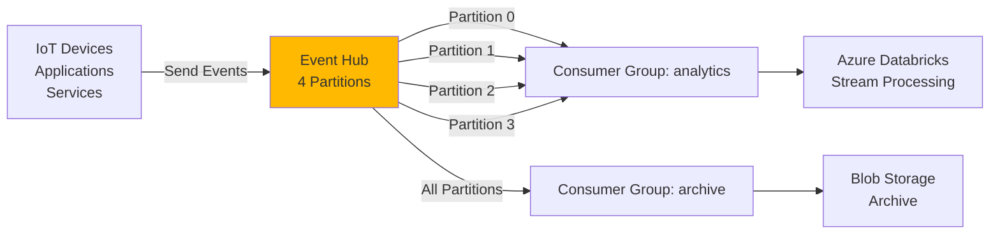
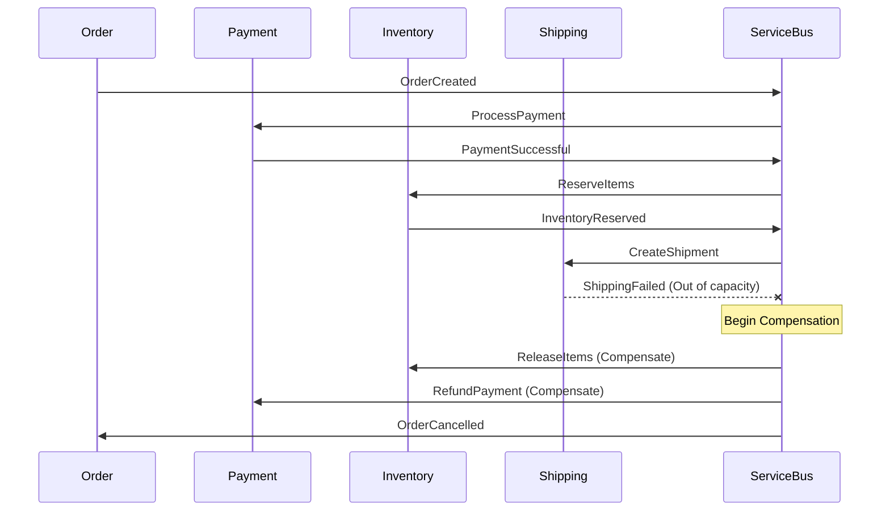

# API Management & Messaging Patterns

Learn to design robust APIs and event-driven systems using Azure's messaging services.


> [!TIP]
> **Jargon Alert: API Gateway vs Service Mesh**
> **API Gateway** (like Azure API Management) sits at the edge and handles external traffic—rate limiting, authentication, versioning.
> **Service Mesh** (like Istio) sits between microservices and handles internal traffic—retries, circuit breaking, observability.

> [!WARNING]
> **Gotcha: Service Bus vs Event Hub Confusion**
> Choosing wrong can cost you! **Service Bus** = reliable messaging with FIFO guarantees (order processing). **Event Hub** = high-throughput streaming for telemetry. Using Service Bus for telemetry = expensive and slow. Using Event Hub for orders = lost data!

---

## 1. Azure API Management (APIM)

**Azure API Management** is a fully managed service to publish, secure, transform, maintain, and monitor APIs.

### When to Use APIM

<CardGroup cols={2}>
  <Card title="✅ Use APIM For" icon="check">
    - External API exposure
    - Rate limiting and quotas
    - API versioning and monetization
    - Request/response transformation
    - OAuth/JWT validation
    - Developer portal
  </Card>

  <Card title="❌ Don't Use APIM For" icon="xmark">
    - Internal microservice communication (use Service Mesh)
    - Simple reverse proxy (use App Gateway)
    - Real-time streaming (use Event Hub)
    - High-latency tolerance apps (adds ~50ms)
  </Card>
</CardGroup>

### APIM Architecture

<div className="flex justify-center my-4">
  <div className="w-full max-w-4xl">
    ```mermaid
    graph TB
        Users[External Developers] -->|HTTPS| APIM[API Management<br/>Gateway]

        APIM -->|Policy Check| Auth[Authentication]
        Auth -->|Rate Limit| Throttle[Throttling]
        Throttle -->|Transform| Transform[Request Transformation]
        Transform -->|Route| Backend[Backend APIs]

        Backend --> API1[Product API]
        Backend --> API2[Order API]
        Backend --> API3[Payment API]

        APIM -.Publish.-> DevPortal[Developer Portal]
        APIM -.Metrics.-> Analytics[Azure Monitor]

        style APIM fill:#0078D4
        style DevPortal fill:#FFB900
    ```
  </div>
</div>

---

## 2. APIM Core Concepts

### API Gateway Policies

**Policies** are XML configurations that execute on API requests/responses.

<Tabs>
  <Tab title="Rate Limiting">
    ```xml
    <!-- Limit to 100 calls per minute per subscription -->
    <policies>
        <inbound>
            <rate-limit calls="100" renewal-period="60" />
        </inbound>
    </policies>

    <!-- Advanced: Different limits per product -->
    <policies>
        <inbound>
            <choose>
                <when condition="@(context.Product.Name == "Premium")">
                    <rate-limit calls="1000" renewal-period="60" />
                </when>
                <when condition="@(context.Product.Name == "Basic")">
                    <rate-limit calls="100" renewal-period="60" />
                </when>
            </choose>
        </inbound>
    </policies>
    ```
  </Tab>

  <Tab title="JWT Validation">
    ```xml
    <!-- Validate Azure AD JWT token -->
    <policies>
        <inbound>
            <validate-jwt header-name="Authorization" failed-validation-httpcode="401">
                <openid-config url="https://login.microsoftonline.com/{tenant}/.well-known/openid-configuration" />
                <audiences>
                    <audience>api://my-api-client-id</audience>
                </audiences>
                <required-claims>
                    <claim name="roles" match="any">
                        <value>admin</value>
                        <value>user</value>
                    </claim>
                </required-claims>
            </validate-jwt>
        </inbound>
    </policies>
    ```
  </Tab>

  <Tab title="Response Caching">
    ```xml
    <!-- Cache GET responses for 1 hour -->
    <policies>
        <inbound>
            <cache-lookup vary-by-developer="false" vary-by-developer-groups="false">
                <vary-by-query-parameter>category</vary-by-query-parameter>
            </cache-lookup>
        </inbound>
        <outbound>
            <cache-store duration="3600" />
        </outbound>
    </policies>
    ```
  </Tab>

  <Tab title="Request Transformation">
    ```xml
    <!-- Transform request before backend -->
    <policies>
        <inbound>
            <!-- Add custom header -->
            <set-header name="X-Forwarded-User" exists-action="override">
                <value>@(context.User.Email)</value>
            </set-header>

            <!-- Rewrite URL -->
            <rewrite-uri template="/v2/products/{id}" copy-unmatched-params="true" />

            <!-- Set backend service -->
            <set-backend-service base-url="https://backend-api.azurewebsites.net" />
        </inbound>

        <outbound>
            <!-- Mask sensitive data in response -->
            <set-body>
                @{
                    var body = context.Response.Body.As<JObject>();
                    body["creditCard"] = "****-****-****-" + body["creditCard"].ToString().Substring(15);
                    return body.ToString();
                }
            </set-body>
        </outbound>
    </policies>
    ```
  </Tab>

  <Tab title="Retry Policy">
    ```xml
    <!-- Retry with exponential backoff -->
    <policies>
        <inbound>
            <retry condition="@(context.Response.StatusCode >= 500)"
                   count="3"
                   interval="1"
                   delta="1"
                   max-interval="10">
                <forward-request timeout="10" />
            </retry>
        </inbound>
    </policies>
    ```
  </Tab>
</Tabs>

### API Versioning Strategies

<Tabs>
  <Tab title="URI Versioning">
    **Recommended**: Most explicit and discoverable

    ```
    GET https://api.contoso.com/v1/products
    GET https://api.contoso.com/v2/products

    Pros:
    ✅ Clear and explicit
    ✅ Easy to cache
    ✅ Works with all clients

    Cons:
    ❌ Pollutes URI space
    ```
  </Tab>

  <Tab title="Query String Versioning">
    ```
    GET https://api.contoso.com/products?api-version=1.0
    GET https://api.contoso.com/products?api-version=2.0

    Pros:
    ✅ Keeps URIs clean
    ✅ Easy to default to latest

    Cons:
    ❌ Hard to cache
    ❌ Can be forgotten
    ```
  </Tab>

  <Tab title="Header Versioning">
    ```
    GET https://api.contoso.com/products
    Header: Api-Version: 1.0

    GET https://api.contoso.com/products
    Header: Api-Version: 2.0

    Pros:
    ✅ URIs stay consistent
    ✅ Good for REST purists

    Cons:
    ❌ Invisible in browser
    ❌ Requires custom client code
    ```
  </Tab>

  <Tab title="Content Negotiation">
    ```
    GET https://api.contoso.com/products
    Accept: application/vnd.contoso.v1+json

    GET https://api.contoso.com/products
    Accept: application/vnd.contoso.v2+json

    Pros:
    ✅ REST-compliant
    ✅ Supports multiple formats

    Cons:
    ❌ Most complex
    ❌ Rarely used in practice
    ```
  </Tab>
</Tabs>

---

## 3. Azure Service Bus

**Service Bus** is a fully managed enterprise message broker with queues and publish-subscribe topics.

### Service Bus vs Event Hub vs Event Grid

**The Decision Tree**:

<div className="flex justify-center my-4">
  <div className="w-full max-w-4xl">
    ```mermaid
    graph TD
        A[Need Messaging?] -->|Yes| B{Message Size?}
        B -->|> 1 MB| C[Blob Storage + Event Grid]
        B -->|< 1 MB| D{Guaranteed Delivery?}

        D -->|Yes + FIFO| E[Service Bus Queue]
        D -->|Yes + Pub/Sub| F[Service Bus Topic]
        D -->|No + High Throughput| G[Event Hub]
        D -->|Simple Event Routing| H[Event Grid]

        E --> E1[Use: Order Processing<br/>Payment Processing]
        F --> F1[Use: Notifications<br/>Multi-subscriber Events]
        G --> G1[Use: Telemetry<br/>Log Streaming]
        H --> H1[Use: Resource Events<br/>Serverless Triggers]

        style E fill:#00D084
        style F fill:#00D084
        style G fill:#FFB900
        style H fill:#50E6FF
    ```
  </div>
</div>

### Comparison Table

| Feature | Service Bus Queue | Service Bus Topic | Event Hub | Event Grid |
|---------|-------------------|-------------------|-----------|------------|
| **Pattern** | Point-to-point | Pub/Sub | Streaming | Event routing |
| **Message Size** | 256 KB (std)<br/>100 MB (premium) | 256 KB (std)<br/>100 MB (premium) | 1 MB | 1 MB |
| **Throughput** | Thousands/sec | Thousands/sec | Millions/sec | Millions/sec |
| **Ordering** | FIFO (with sessions) | FIFO (with sessions) | Per partition | No |
| **Delivery** | At-least-once<br/>Exactly-once (sessions) | At-least-once<br/>Exactly-once (sessions) | At-least-once | At-least-once |
| **Retention** | Up to 14 days | Up to 14 days | 1-90 days | 24 hours |
| **Dead Letter** | Yes | Yes | No | No (retry with backoff) |
| **Duplicate Detection** | Yes | Yes | No | No |
| **Transactions** | Yes | Yes | No | No |
| **Cost** | $10/month + ops | $10/month + ops | $11/month + ingress | $0.60/million events |
| **Use Case** | Critical transactions | Broadcast to multiple services | Telemetry, logs | Serverless triggers |

---

## 4. Service Bus Patterns

### Pattern 1: Queue (Point-to-Point)

<div className="flex justify-center my-4">
  <div className="w-full max-w-4xl">
    ```mermaid
    graph LR
        Sender[Order API] -->|Send| Queue[Service Bus Queue<br/>orders-queue]
        Queue -->|Receive| Consumer1[Order Processor 1]
        Queue -->|Receive| Consumer2[Order Processor 2]
        Queue -->|Receive| Consumer3[Order Processor 3]

        Queue -.Dead Letter.-> DLQ[Dead Letter Queue]

        style Queue fill:#00D084
        style DLQ fill:#FF6B6B
    ```
  </div>
</div>

**Code Example**:

```csharp
// Send message to queue
using Azure.Messaging.ServiceBus;

var client = new ServiceBusClient(connectionString);
var sender = client.CreateSender("orders-queue");

var message = new ServiceBusMessage(JsonSerializer.Serialize(order))
{
    MessageId = order.Id.ToString(),
    SessionId = order.CustomerId.ToString(), // For FIFO per customer
    TimeToLive = TimeSpan.FromHours(24),
    ScheduledEnqueueTime = DateTimeOffset.UtcNow.AddMinutes(5) // Delayed delivery
};

await sender.SendMessageAsync(message);

// Receive and process
var processor = client.CreateProcessor("orders-queue", new ServiceBusProcessorOptions
{
    MaxConcurrentCalls = 10,
    AutoCompleteMessages = false, // Manual completion for reliability
    PrefetchCount = 20
});

processor.ProcessMessageAsync += async args =>
{
    try
    {
        var order = JsonSerializer.Deserialize<Order>(args.Message.Body);
        await ProcessOrder(order);

        // Complete the message (remove from queue)
        await args.CompleteMessageAsync(args.Message);
    }
    catch (Exception ex)
    {
        // Dead-letter if processing fails repeatedly
        if (args.Message.DeliveryCount > 3)
        {
            await args.DeadLetterMessageAsync(args.Message,
                "Processing failed after 3 attempts",
                ex.Message);
        }
        else
        {
            // Abandon to retry
            await args.AbandonMessageAsync(args.Message);
        }
    }
};

processor.ProcessErrorAsync += args =>
{
    Console.WriteLine($"Error: {args.Exception}");
    return Task.CompletedTask;
};

await processor.StartProcessingAsync();
```

### Pattern 2: Topic/Subscription (Pub/Sub)

<div className="flex justify-center my-4">
  <div className="w-full max-w-4xl">
    ```mermaid
    graph TB
        Publisher[Order Created Event] -->|Publish| Topic[Service Bus Topic<br/>order-events]

        Topic -->|Filter: Priority=High| Sub1[Subscription: urgent-orders]
        Topic -->|Filter: Amount>$1000| Sub2[Subscription: large-orders]
        Topic -->|All Messages| Sub3[Subscription: audit-log]

        Sub1 --> Consumer1[SMS Notification Service]
        Sub2 --> Consumer2[Fraud Detection Service]
        Sub3 --> Consumer3[Audit Service]

        style Topic fill:#00D084
    ```
  </div>
</div>

**Code Example**:

```csharp
// Publish to topic
var sender = client.CreateSender("order-events");

var message = new ServiceBusMessage(JsonSerializer.Serialize(orderEvent))
{
    ApplicationProperties =
    {
        ["Priority"] = orderEvent.Priority,
        ["Amount"] = orderEvent.Amount,
        ["Region"] = orderEvent.Region
    }
};

await sender.SendMessageAsync(message);

// Create subscription with filter
var namespaceManager = new ServiceBusAdministrationClient(connectionString);

var subscription = new CreateSubscriptionOptions("order-events", "large-orders")
{
    DefaultMessageTimeToLive = TimeSpan.FromDays(1)
};

var rule = new CreateRuleOptions
{
    Name = "LargeOrdersFilter",
    Filter = new SqlRuleFilter("Amount > 1000")
};

await namespaceManager.CreateSubscriptionAsync(subscription, rule);

// Subscribe and process
var processor = client.CreateProcessor("order-events", "large-orders");

processor.ProcessMessageAsync += async args =>
{
    var orderEvent = JsonSerializer.Deserialize<OrderEvent>(args.Message.Body);
    await SendToFraudDetection(orderEvent);
    await args.CompleteMessageAsync(args.Message);
};

await processor.StartProcessingAsync();
```

### Pattern 3: Request-Reply

```csharp
// Request with reply-to address
var replyQueue = "order-responses";
var message = new ServiceBusMessage(JsonSerializer.Serialize(request))
{
    ReplyTo = replyQueue,
    CorrelationId = Guid.NewGuid().ToString()
};

await sender.SendMessageAsync(message);

// Listen for response
var responseProcessor = client.CreateProcessor(replyQueue);
responseProcessor.ProcessMessageAsync += async args =>
{
    if (args.Message.CorrelationId == message.CorrelationId)
    {
        var response = JsonSerializer.Deserialize<OrderResponse>(args.Message.Body);
        // Process response
    }
};
```

---

## 5. Azure Event Hub

**Event Hub** is a big data streaming platform and event ingestion service.

### Event Hub Use Cases

<CardGroup cols={2}>
  <Card title="Telemetry Ingestion" icon="chart-line">
    - IoT device data
    - Application logs
    - Performance metrics
    - Clickstream data
  </Card>

  <Card title="Real-Time Analytics" icon="bolt">
    - Live dashboards
    - Anomaly detection
    - Fraud detection
    - Stream processing
  </Card>

  <Card title="Event Sourcing" icon="database">
    - Append-only event log
    - Event replay
    - Audit trail
    - Time travel queries
  </Card>

  <Card title="Data Pipelines" icon="diagram-project">
    - ETL workflows
    - Data lake ingestion
    - Cross-region replication
    - Archive to storage
  </Card>
</CardGroup>

### Event Hub Architecture



**Code Example**:

```csharp
// Send events to Event Hub
using Azure.Messaging.EventHubs;
using Azure.Messaging.EventHubs.Producer;

var producer = new EventHubProducerClient(connectionString, eventHubName);

// Batch send for efficiency
var batch = await producer.CreateBatchAsync();

foreach (var telemetry in telemetryData)
{
    var eventData = new EventData(JsonSerializer.Serialize(telemetry))
    {
        // Partition key ensures ordering for same device
        PartitionKey = telemetry.DeviceId
    };

    if (!batch.TryAdd(eventData))
    {
        // Batch full, send and create new batch
        await producer.SendAsync(batch);
        batch = await producer.CreateBatchAsync();
        batch.TryAdd(eventData);
    }
}

await producer.SendAsync(batch);

// Process events
using Azure.Messaging.EventHubs.Consumer;

var consumer = new EventHubConsumerClient(
    consumerGroup: "analytics",
    connectionString: connectionString,
    eventHubName: eventHubName);

await foreach (PartitionEvent partitionEvent in consumer.ReadEventsAsync())
{
    var telemetry = JsonSerializer.Deserialize<Telemetry>(partitionEvent.Data.Body);
    await ProcessTelemetry(telemetry);

    // Checkpoint to track progress
    await partitionEvent.CheckpointAsync();
}
```

---

## 6. Event-Driven Architecture Patterns

### Pattern 1: Saga Pattern (Distributed Transactions)

**Problem**: How to maintain data consistency across microservices?

**Solution**: Coordinate a sequence of local transactions with compensating actions.



**Implementation**:

```csharp
// Orchestrator (Saga Coordinator)
public class OrderSaga
{
    private readonly ServiceBusClient _serviceBus;

    public async Task Handle(OrderCreatedEvent @event)
    {
        var sagaState = new SagaState
        {
            OrderId = @event.OrderId,
            Step = SagaStep.PaymentPending
        };

        try
        {
            // Step 1: Process payment
            await PublishCommand(new ProcessPaymentCommand(@event.OrderId));
            await WaitForEvent<PaymentSuccessfulEvent>();
            sagaState.Step = SagaStep.InventoryPending;

            // Step 2: Reserve inventory
            await PublishCommand(new ReserveInventoryCommand(@event.OrderId));
            await WaitForEvent<InventoryReservedEvent>();
            sagaState.Step = SagaStep.ShippingPending;

            // Step 3: Create shipment
            await PublishCommand(new CreateShipmentCommand(@event.OrderId));
            await WaitForEvent<ShipmentCreatedEvent>();
            sagaState.Step = SagaStep.Completed;

            await PublishEvent(new OrderCompletedEvent(@event.OrderId));
        }
        catch (Exception ex)
        {
            // Compensate in reverse order
            await CompensateSaga(sagaState);
        }
    }

    private async Task CompensateSaga(SagaState state)
    {
        if (state.Step >= SagaStep.InventoryPending)
        {
            await PublishCommand(new ReleaseInventoryCommand(state.OrderId));
        }

        if (state.Step >= SagaStep.PaymentPending)
        {
            await PublishCommand(new RefundPaymentCommand(state.OrderId));
        }

        await PublishEvent(new OrderCancelledEvent(state.OrderId));
    }
}
```

### Pattern 2: Event Sourcing

**Store state as a sequence of events, not snapshots.**

```csharp
// Event store
public class OrderEventStore
{
    private readonly EventHubProducerClient _eventHub;

    public async Task AppendEvent(OrderEvent @event)
    {
        var eventData = new EventData(JsonSerializer.Serialize(@event))
        {
            // Partition by aggregate ID for ordering
            PartitionKey = @event.OrderId.ToString()
        };

        await _eventHub.SendAsync(new[] { eventData });
    }
}

// Rebuild state from events
public class Order
{
    public Guid Id { get; private set; }
    public OrderStatus Status { get; private set; }
    public decimal Total { get; private set; }

    public static Order FromEvents(IEnumerable<OrderEvent> events)
    {
        var order = new Order();

        foreach (var @event in events)
        {
            order.Apply(@event);
        }

        return order;
    }

    private void Apply(OrderEvent @event)
    {
        switch (@event)
        {
            case OrderCreatedEvent e:
                Id = e.OrderId;
                Status = OrderStatus.Created;
                break;

            case OrderItemAddedEvent e:
                Total += e.Price * e.Quantity;
                break;

            case OrderCancelledEvent e:
                Status = OrderStatus.Cancelled;
                break;
        }
    }
}

// Query events
var events = await GetEventsFromEventHub(orderId);
var order = Order.FromEvents(events);
```

---

## 7. API Gateway Patterns

### Pattern 1: API Aggregation (Backend for Frontend)

**Problem**: Mobile app needs data from 5 different microservices.

**Solution**: Create a BFF (Backend for Frontend) API that aggregates responses.

```csharp
[ApiController]
[Route("api/mobile")]
public class MobileAggregatorController : ControllerBase
{
    private readonly IProductService _products;
    private readonly IRecommendationService _recommendations;
    private readonly IInventoryService _inventory;

    [HttpGet("homepage")]
    public async Task<IActionResult> GetHomePage()
    {
        // Parallel calls to multiple services
        var tasks = new[]
        {
            _products.GetFeaturedProductsAsync(),
            _recommendations.GetPersonalizedAsync(User.Id),
            _inventory.GetAvailabilityAsync()
        };

        await Task.WhenAll(tasks);

        return Ok(new
        {
            FeaturedProducts = tasks[0].Result,
            Recommendations = tasks[1].Result,
            Availability = tasks[2].Result
        });
    }
}
```

### Pattern 2: Circuit Breaker in APIM

```xml
<!-- Circuit breaker policy -->
<policies>
    <inbound>
        <send-request mode="new" response-variable-name="backendHealth" timeout="5">
            <set-url>https://backend-api.azurewebsites.net/health</set-url>
            <set-method>GET</set-method>
        </send-request>

        <choose>
            <when condition="@(((IResponse)context.Variables["backendHealth"]).StatusCode != 200)">
                <!-- Return cached response or error -->
                <return-response>
                    <set-status code="503" reason="Service Unavailable" />
                    <set-body>@{
                        return "Backend service is temporarily unavailable. Please try again later.";
                    }</set-body>
                </return-response>
            </when>
        </choose>
    </inbound>
</policies>
```

---

## 8. Interview Questions

### Beginner Level

<AccordionGroup>
  <Accordion title="Q1: When would you use Service Bus Queue vs Topic?">
    **Answer**:

    **Service Bus Queue** (Point-to-point):
    - Single consumer processes each message
    - Order processing, payment processing
    - Competing consumers for scale

    **Service Bus Topic** (Pub/Sub):
    - Multiple subscribers receive each message
    - Notification systems (email, SMS, push)
    - Event broadcasting to multiple services

    **Example**: Order created event → Topic sends to inventory, shipping, and analytics services
  </Accordion>

  <Accordion title="Q2: What is the difference between Event Hub and Service Bus?">
    **Answer**:

    **Event Hub**:
    - High throughput (millions events/sec)
    - Streaming and telemetry
    - Partition-based ordering
    - No dead letter queue
    - Use: IoT telemetry, logs, clickstream

    **Service Bus**:
    - Reliable messaging (thousands/sec)
    - Transactional guarantees
    - FIFO ordering (with sessions)
    - Dead letter queue for failed messages
    - Use: Critical business transactions
  </Accordion>
</AccordionGroup>

### Intermediate Level

<AccordionGroup>
  <Accordion title="Q3: How do you implement API versioning in APIM?">
    **Answer**:

    **Setup**:
    1. Create API version set in APIM
    2. Add multiple API versions (v1, v2)
    3. Choose versioning scheme (URI, query, header)

    **Example (URI versioning)**:
    ```bash
    # Create version set
    az apim api versionset create \
      --resource-group rg-apim \
      --service-name my-apim \
      --name product-api-versions \
      --versioning-scheme Segment

    # Add v1
    az apim api create \
      --api-id product-api-v1 \
      --path products \
      --api-version v1 \
      --api-version-set-id product-api-versions

    # Add v2
    az apim api create \
      --api-id product-api-v2 \
      --path products \
      --api-version v2 \
      --api-version-set-id product-api-versions
    ```

    **Result**:
    - `/v1/products` → Backend API v1
    - `/v2/products` → Backend API v2
  </Accordion>

  <Accordion title="Q4: Design a fault-tolerant message processing system">
    **Answer**:

    **Architecture**:
    ```
    Service Bus Queue
      ├─ MaxDeliveryCount: 3
      ├─ LockDuration: 5 minutes
      └─ Dead Letter Queue

    Processing Logic:
    1. Receive message (lock acquired)
    2. Process with try/catch
    3. Success → Complete message
    4. Transient error → Abandon (retry)
    5. Permanent error → Dead letter
    6. Lock expires → Auto-abandon

    Dead Letter Handling:
    - Separate processor monitors DLQ
    - Analyze failure reason
    - Fix data and resubmit OR alert humans
    ```

    **Code**:
    ```csharp
    processor.ProcessMessageAsync += async args =>
    {
        try
        {
            await ProcessMessage(args.Message);
            await args.CompleteMessageAsync(args.Message);
        }
        catch (TransientException ex)
        {
            // Retry (abandon)
            await args.AbandonMessageAsync(args.Message);
        }
        catch (PermanentException ex)
        {
            // Dead letter with reason
            await args.DeadLetterMessageAsync(args.Message,
                "Permanent failure",
                ex.Message);
        }
    };
    ```
  </Accordion>
</AccordionGroup>

### Advanced Level

<AccordionGroup>
  <Accordion title="Q5: Implement a Saga pattern for distributed transactions">
    **Answer**:

    See **Section 6 - Saga Pattern** above for complete implementation.

    **Key Points**:
    - No distributed 2PC (two-phase commit)
    - Each service has local transaction
    - Compensating actions for rollback
    - Saga coordinator tracks state
    - Eventual consistency

    **Challenges**:
    - Compensating actions must be idempotent
    - What if compensation fails? (Retry with exponential backoff)
    - Partial failures require careful state management
  </Accordion>

  <Accordion title="Q6: Design an API rate limiting strategy for a SaaS product">
    **Answer**:

    **Tiered Rate Limiting**:

    ```xml
    <policies>
        <inbound>
            <choose>
                <when condition="@(context.Product.Name == "Enterprise")">
                    <rate-limit calls="10000" renewal-period="60" />
                    <quota calls="1000000" renewal-period="2592000" />
                </when>
                <when condition="@(context.Product.Name == "Professional")">
                    <rate-limit calls="1000" renewal-period="60" />
                    <quota calls="100000" renewal-period="2592000" />
                </when>
                <when condition="@(context.Product.Name == "Basic")">
                    <rate-limit calls="100" renewal-period="60" />
                    <quota calls="10000" renewal-period="2592000" />
                </when>
                <otherwise>
                    <!-- Free tier -->
                    <rate-limit calls="10" renewal-period="60" />
                    <quota calls="1000" renewal-period="2592000" />
                </otherwise>
            </choose>

            <!-- Set response headers -->
            <set-header name="X-RateLimit-Limit" exists-action="override">
                <value>@(context.Product.Name == "Enterprise" ? "10000" : "100")</value>
            </set-header>
            <set-header name="X-RateLimit-Remaining" exists-action="override">
                <value>@(context.Response.Headers.GetValueOrDefault("RateLimit-Remaining", "0"))</value>
            </set-header>
        </inbound>
    </policies>
    ```

    **Response when limit exceeded**:
    ```
    HTTP 429 Too Many Requests
    Retry-After: 60
    X-RateLimit-Limit: 100
    X-RateLimit-Remaining: 0
    X-RateLimit-Reset: 1642003200
    ```
  </Accordion>
</AccordionGroup>

---

## 9. Key Takeaways

<CardGroup cols={2}>
  <Card title="Choose the Right Tool" icon="compass">
    APIM for APIs, Service Bus for messaging, Event Hub for streaming. Don't use a hammer for a screw.
  </Card>

  <Card title="Decouple Services" icon="link-slash">
    Asynchronous messaging prevents cascading failures and enables independent scaling.
  </Card>

  <Card title="Handle Failures Gracefully" icon="shield">
    Dead letter queues, retries, circuit breakers, and compensating transactions are essential.
  </Card>

  <Card title="Design for Idempotency" icon="arrows-rotate">
    Messages can be delivered more than once. Make sure processing is safe to repeat.
  </Card>

  <Card title="Monitor Everything" icon="chart-line">
    Track message latency, queue depth, dead letter count, and API response times.
  </Card>

  <Card title="Version Your APIs" icon="code-branch">
    Breaking changes require new versions. Use URI versioning for clarity.
  </Card>
</CardGroup>

---

## Next Steps

<Card title="Continue to Chapter 17" icon="arrow-right" href="/courses/azure-cloud-engineering/17-sre-production">
  Master SRE practices, SLIs/SLOs, error budgets, and production excellence
</Card>
