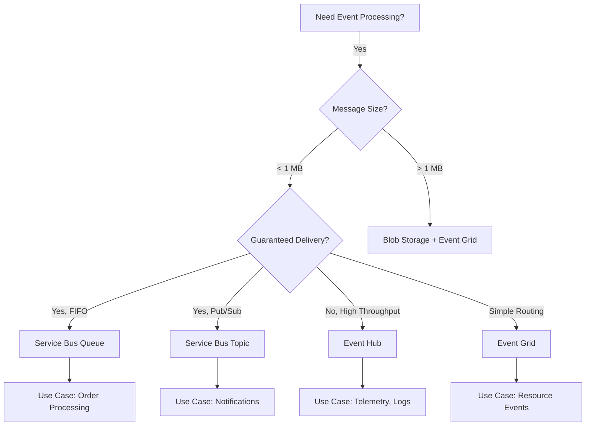
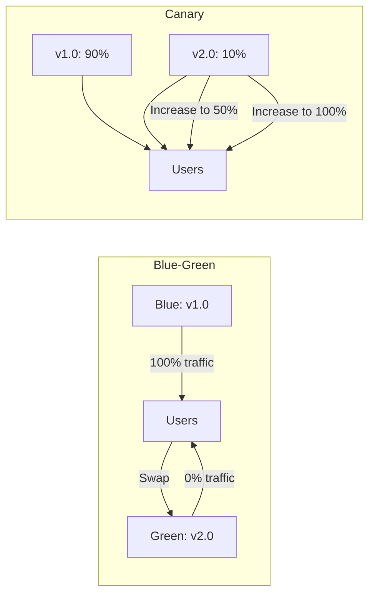

# Azure Cloud Engineering Course - Enhancement Roadmap

## 🎯 Current Status (Completed)
✅ 15 comprehensive chapters (11,020+ lines)
✅ 60+ interview questions across all levels
✅ 150+ code examples
✅ 50+ Mermaid diagrams
✅ All duplicate content fixed
✅ Consistent callout boxes (WARNING/TIP) across all chapters

---

## 🚀 Phase 1: Critical Missing Topics (HIGH PRIORITY)

### 1. **API Management Deep Dive** (New Chapter 16 or expand Chapter 14)
**Why**: Essential for microservices architecture, missing entirely

**Content to Add**:
- API Gateway patterns (Aggregator, Proxy, Sidecar)
- Azure API Management setup and configuration
- Rate limiting and throttling strategies
- API versioning strategies (URI, header, query string)
- API security (OAuth, JWT validation, API keys)
- Response caching and transformation policies
- Mock APIs and development environments
- API analytics and monitoring
- Cost optimization (consumption vs dedicated tiers)

**Code Examples**:
```xml
<!-- API Management Policy Examples -->
- Rate limiting by subscription
- JWT token validation
- Response transformation
- Caching policies
- Retry policies with exponential backoff
```

**Interview Questions**: 8-10 questions on API design, versioning, security

---

### 2. **Azure Service Bus & Messaging Patterns** (New Chapter or expand Chapter 8)
**Why**: Critical for asynchronous communication, event-driven systems

**Content to Add**:
- Queues vs Topics vs Subscriptions
- Message ordering guarantees
- Dead letter queues
- Duplicate detection
- Sessions and message correlation
- Transaction support
- Competing consumers pattern
- Pub/Sub pattern implementation
- Message routing and filtering
- Service Bus vs Event Hub vs Event Grid comparison

**Diagrams**:
```mermaid
- Queue pattern (single consumer)
- Topic/Subscription pattern (pub/sub)
- Competing consumers
- Request-reply pattern
- Saga pattern with compensating transactions
```

**Real-World Examples**:
- E-commerce order processing
- Notification system
- Batch job coordination

---

### 3. **SRE Practices & Observability** (New Chapter 16 or expand Chapter 9)
**Why**: Essential for production systems, differentiates senior engineers

**Content to Add**:
- **SLIs (Service Level Indicators)**: What to measure
  - Request latency (p50, p95, p99)
  - Error rate
  - Throughput
  - Availability

- **SLOs (Service Level Objectives)**: Setting targets
  - 99.9% availability = 43.2 min downtime/month
  - p95 latency < 200ms
  - Error rate < 0.1%

- **SLAs (Service Level Agreements)**: Business commitments
  - Calculating composite SLAs
  - Credits and penalties

- **Error Budgets**:
  - How much downtime is acceptable
  - When to stop releasing features
  - Balancing velocity vs reliability

- **Toil Reduction**:
  - Identifying repetitive manual work
  - Automation strategies
  - On-call rotation best practices

- **Incident Management**:
  - Runbooks and playbooks
  - Post-mortems (blameless)
  - Alerting philosophy (actionable vs noise)

**Calculations**:
```
Composite SLA Example:
- Web App: 99.95%
- SQL Database: 99.99%
- Redis Cache: 99.9%
Combined: 0.9995 × 0.9999 × 0.999 = 99.84%
Monthly downtime: 69 minutes
```

---

### 4. **Resilience & Fault Tolerance Patterns** (Expand Chapter 14)
**Why**: Critical for production systems, missing practical implementation

**Content to Add**:

**Circuit Breaker Pattern**:
```csharp
// Polly example
var circuitBreakerPolicy = Policy
    .Handle<HttpRequestException>()
    .CircuitBreakerAsync(
        exceptionsAllowedBeforeBreaking: 3,
        durationOfBreak: TimeSpan.FromSeconds(30),
        onBreak: (exception, duration) => {
            // Log circuit opened
        },
        onReset: () => {
            // Log circuit closed
        });
```

**Retry with Exponential Backoff**:
```csharp
var retryPolicy = Policy
    .Handle<HttpRequestException>()
    .WaitAndRetryAsync(
        retryCount: 5,
        sleepDurationProvider: attempt =>
            TimeSpan.FromSeconds(Math.Pow(2, attempt)),
        onRetry: (exception, timespan, retryCount, context) => {
            // Log retry attempt
        });
```

**Timeout Pattern**:
```csharp
var timeoutPolicy = Policy
    .TimeoutAsync(TimeSpan.FromSeconds(10));
```

**Bulkhead Pattern**:
```csharp
var bulkheadPolicy = Policy
    .BulkheadAsync(
        maxParallelization: 10,
        maxQueuingActions: 5);
```

**Fallback Pattern**:
```csharp
var fallbackPolicy = Policy<HttpResponseMessage>
    .Handle<HttpRequestException>()
    .FallbackAsync(
        fallbackValue: GetCachedResponse(),
        onFallbackAsync: async (result) => {
            await LogFallback(result);
        });
```

**Combining Policies (Resilience Strategy)**:
```csharp
var resilienceStrategy = Policy.WrapAsync(
    fallbackPolicy,
    circuitBreakerPolicy,
    retryPolicy,
    timeoutPolicy);
```

---

### 5. **Load Balancing Deep Dive** (Expand Chapter 3)
**Why**: Confusion between different load balancers is common

**Comprehensive Comparison Table**:

| Feature | Azure LB | App Gateway | Front Door | Traffic Manager |
|---------|----------|-------------|------------|-----------------|
| **Layer** | Layer 4 (TCP/UDP) | Layer 7 (HTTP/HTTPS) | Layer 7 (HTTP/HTTPS) | DNS (Layer 7) |
| **Scope** | Regional | Regional | Global | Global |
| **Protocol** | TCP, UDP | HTTP, HTTPS, WebSocket | HTTP, HTTPS, WebSocket | Any |
| **SSL Termination** | No | Yes | Yes | No |
| **WAF** | No | Yes | Yes | No |
| **Path Routing** | No | Yes | Yes | No |
| **Health Probes** | TCP, HTTP | HTTP, HTTPS, TCP | HTTP, HTTPS | HTTP, HTTPS, TCP |
| **Session Affinity** | 5-tuple hash | Cookie-based | Cookie-based | N/A (DNS) |
| **Cost** | ~$20/month | ~$150/month | ~$250/month | ~$5/month |
| **Use Case** | VM load balancing | Regional web apps | Global web apps | Multi-cloud, DNS failover |

**Advanced Topics**:
- Connection draining
- Health probe configuration
- Sticky sessions (when and why)
- Cross-region load balancing
- Direct Server Return (DSR)
- Floating IP
- HA Ports

---

### 6. **Testing Strategies** (New section in Chapter 11 or 14)
**Why**: Testing in cloud environments is different

**Content to Add**:

**Load Testing**:
```bash
# Azure Load Testing example
az load create \
  --name load-test-ecommerce \
  --resource-group rg-test \
  --test-plan jmeter-test-plan.jmx \
  --engine-instances 10 \
  --target-url https://myapp.azurewebsites.net

# Expected outputs:
- Concurrent users: 10,000
- Requests per second: 5,000
- p95 latency: 200ms
- Error rate: < 0.1%
```

**Chaos Engineering**:
```bash
# Azure Chaos Studio
# Kill random pods in AKS
az chaos experiment create \
  --name kill-random-pods \
  --resource-group rg-prod \
  --steps '[{
    "name": "Kill Pods",
    "branches": [{
      "name": "Kill 30% of pods",
      "actions": [{
        "type": "continuous",
        "name": "aks-pod-chaos",
        "duration": "PT5M",
        "parameters": [{
          "key": "podKillPercentage",
          "value": "30"
        }]
      }]
    }]
  }]'
```

**Canary Deployments**:
```yaml
# Flagger example for AKS
apiVersion: flagger.app/v1beta1
kind: Canary
metadata:
  name: api-canary
spec:
  targetRef:
    apiVersion: apps/v1
    kind: Deployment
    name: api
  service:
    port: 8080
  analysis:
    interval: 1m
    threshold: 5
    maxWeight: 50
    stepWeight: 10
    metrics:
    - name: request-success-rate
      thresholdRange:
        min: 99
    - name: request-duration
      thresholdRange:
        max: 500
```

**A/B Testing**:
```csharp
// Feature flag with Azure App Configuration
var featureManager = services.GetRequiredService<IFeatureManager>();

if (await featureManager.IsEnabledAsync("NewCheckoutFlow"))
{
    return new CheckoutV2();
}
else
{
    return new CheckoutV1();
}
```

---

### 7. **Event-Driven Architecture Comparison** (Expand Chapter 8 or 14)
**Why**: Confusion between Event Grid, Event Hub, Service Bus

**Decision Tree**:


**Comparison Table**:

| Feature | Event Grid | Event Hub | Service Bus |
|---------|------------|-----------|-------------|
| **Message Size** | 1 MB | 1 MB | 256 KB (std), 100 MB (premium) |
| **Throughput** | Millions/sec | Millions/sec | Thousands/sec |
| **Ordering** | No | Per partition | FIFO (sessions) |
| **Delivery** | At-least-once | At-least-once | Exactly-once (with sessions) |
| **TTL** | 24 hours | 1-90 days | 14 days |
| **Pattern** | Pub/Sub (reactive) | Streaming (time-series) | Messaging (reliable) |
| **Cost** | $0.60/million | $11/month + ingress | $10/month + messages |
| **Use Case** | Azure resource events | Telemetry, logs | Critical transactions |

---

### 8. **Advanced Security Patterns** (Expand Chapter 10)
**Why**: Security is paramount, needs more depth

**WAF Rule Examples**:
```bash
# Block SQL injection
az network application-gateway waf-policy custom-rule create \
  --name BlockSQLi \
  --priority 10 \
  --policy-name MyWAFPolicy \
  --resource-group rg-security \
  --action Block \
  --rule-type MatchRule \
  --match-conditions '[{
    "matchVariables": [{
      "variableName": "RequestUri"
    }],
    "operator": "Contains",
    "matchValues": ["SELECT", "UNION", "DROP"],
    "negationCondition": false
  }]'
```

**DDoS Mitigation**:
- Always-on traffic monitoring
- Adaptive tuning
- Attack analytics and reporting
- Cost implications

**Threat Detection**:
```kusto
// Azure Sentinel - Detect brute force
SigninLogs
| where TimeGenerated > ago(1h)
| where ResultType != 0
| summarize
    FailedAttempts=count(),
    IPs=make_set(IPAddress)
    by UserPrincipalName
| where FailedAttempts > 10
| project UserPrincipalName, FailedAttempts, IPs
```

**Zero Trust Implementation**:
1. Verify explicitly (MFA + Conditional Access)
2. Use least privilege (RBAC + PIM)
3. Assume breach (Network segmentation + Monitoring)

---

### 9. **Scalability Patterns Deep Dive** (Expand Chapter 14)
**Why**: Scalability is a senior-level differentiator

**Database Sharding**:
```csharp
// Horizontal partitioning by customer ID
public string GetShardKey(int customerId)
{
    int shardCount = 10;
    int shard = customerId % shardCount;
    return $"shard-{shard}";
}

// Route to correct database
var connectionString = _shardMap[GetShardKey(customerId)];
```

**CQRS Implementation**:
```csharp
// Command (Write)
public class CreateOrderCommand
{
    public int CustomerId { get; set; }
    public List<OrderItem> Items { get; set; }
}

public class CreateOrderHandler
{
    public async Task Handle(CreateOrderCommand command)
    {
        // Validate
        // Save to SQL (normalized)
        // Publish event
    }
}

// Query (Read)
public class OrderDetailsQuery
{
    public int OrderId { get; set; }
}

public class OrderDetailsHandler
{
    public async Task<OrderDetails> Handle(OrderDetailsQuery query)
    {
        // Read from Cosmos DB (denormalized)
        // Fast retrieval, no JOINs
    }
}
```

**Read Replicas**:
```bash
# Azure SQL read-only replica
az sql db replica create \
  --name mydb-replica \
  --resource-group rg-prod \
  --server myserver-secondary \
  --source-database mydb
```

**Caching Strategies**:
- Cache-aside
- Read-through
- Write-through
- Write-behind
- Refresh-ahead

---

### 10. **Deployment Strategies Comparison** (Expand Chapter 11)
**Why**: Zero-downtime deployments are critical

**Strategy Comparison**:

| Strategy | Downtime | Rollback | Cost | Complexity | Use Case |
|----------|----------|----------|------|------------|----------|
| **Recreate** | Yes (minutes) | Redeploy | Low | Low | Dev/Test |
| **Rolling** | No | Stop & reverse | Low | Medium | Stateless apps |
| **Blue-Green** | No | Instant swap | High (2x resources) | Medium | Critical apps |
| **Canary** | No | Traffic shift | Medium | High | Risk-averse |
| **A/B Testing** | No | Traffic split | Medium | High | Feature testing |
| **Feature Flags** | No | Toggle off | Low | High | Gradual rollout |

**Visual Comparison**:


---

## 📊 Implementation Plan

### Option A: Add as New Chapters (Recommended)
- **Chapter 16**: API Management & Service Bus
- **Chapter 17**: SRE Practices & Observability
- **Chapter 18**: Advanced Resilience & Testing

**Pros**: Clean separation, easy to navigate
**Cons**: Course becomes longer (18 chapters)

### Option B: Expand Existing Chapters
- **Chapter 8**: Add Service Bus patterns
- **Chapter 9**: Add SRE practices (SLIs, SLOs, error budgets)
- **Chapter 10**: Add advanced security patterns
- **Chapter 11**: Add deployment strategies comparison
- **Chapter 14**: Add API Management, resilience patterns, scalability

**Pros**: Keeps chapter count manageable
**Cons**: Chapters become very long (600+ lines each)

### Option C: Hybrid Approach (BEST)
- **Chapter 16**: API Management & Messaging Patterns (Service Bus, Event Hub, Event Grid)
- **Chapter 17**: SRE & Production Excellence (SLIs, SLOs, SLAs, error budgets, chaos engineering)
- Expand existing chapters with focused enhancements:
  - Ch 3: Add load balancer comparison table
  - Ch 10: Add advanced security patterns
  - Ch 11: Add deployment strategies
  - Ch 14: Add resilience patterns (circuit breaker, retry, etc.)

---

## 🎯 Expected Outcomes After Enhancement

**Current State**:
- 15 chapters
- 11,020 lines
- ~350 KB

**After Enhancement**:
- 17 chapters
- 16,000+ lines
- ~500 KB
- 100+ interview questions
- 200+ code examples
- 75+ diagrams

**Market Positioning**:
- Current: Senior Engineer level
- After: Principal/Staff Engineer level
- Certification alignment: AZ-104, AZ-305, AZ-500, **AZ-400 (DevOps)**

---

## 📝 Priority Order

1. **API Management** (Chapter 16) - Most requested, critical gap
2. **Service Bus & Messaging** (Chapter 16) - Ties into API Management
3. **SRE Practices** (Chapter 17) - Differentiates senior engineers
4. **Resilience Patterns** (Expand Chapter 14) - Production readiness
5. **Deployment Strategies** (Expand Chapter 11) - DevOps essential
6. **Load Balancing Deep Dive** (Expand Chapter 3) - Common confusion
7. **Testing Strategies** (Expand Chapter 11 or new section)
8. **Advanced Security** (Expand Chapter 10)
9. **Scalability Patterns** (Expand Chapter 14)
10. **Event-Driven Architecture** (Expand Chapter 8 or merge with Chapter 16)

---

## ⏱️ Estimated Effort

**Phase 1 (API Management + Messaging)**: 4-6 hours
**Phase 2 (SRE Practices)**: 3-4 hours
**Phase 3 (Resilience & Testing)**: 3-4 hours
**Phase 4 (Enhancements to existing chapters)**: 2-3 hours

**Total**: 12-17 hours for complete enhancement

---

## 🚀 Ready to Start?

**Recommendation**: Start with **Chapter 16 (API Management & Messaging)** as it fills the biggest gap and is highly requested.

Would you like me to:
1. Create Chapter 16 immediately?
2. Expand existing chapters first?
3. Create a detailed outline for all new content before writing?
