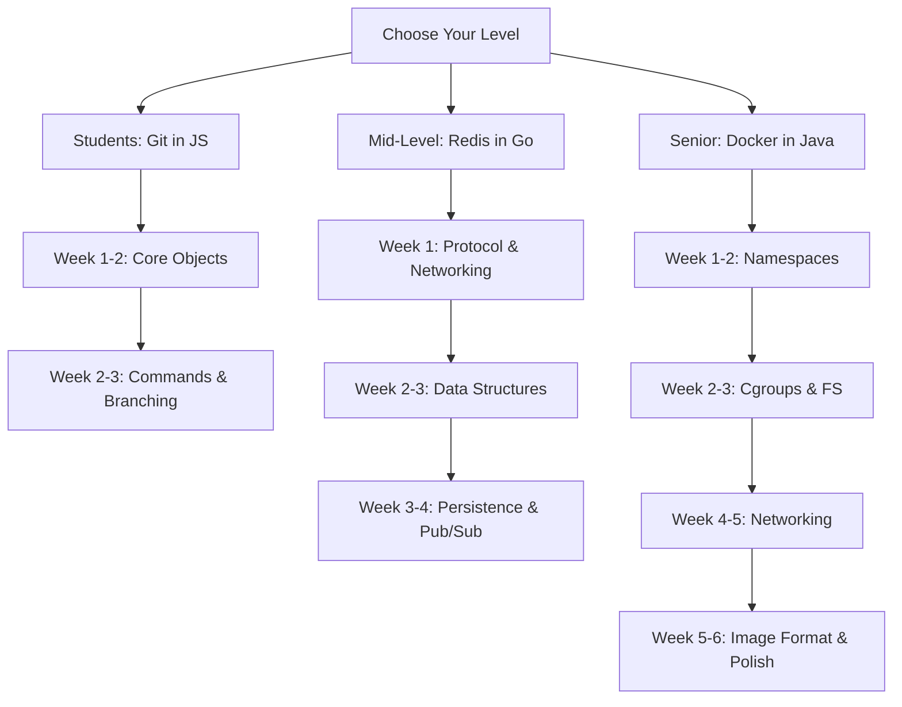

# Build Your Own X

The **ultimate resume differentiator**. While others list "Used Redis" or "Worked with Docker", you'll confidently say **"I built my own"**. This course guides you through building three production-grade systems from scratch, each targeting a different experience level.

<Info>
**Languages**: Java, Go, JavaScript  
**Target Outcome**: Deep systems understanding + impressive portfolio projects  
**Philosophy**: Learn by building, understand by implementing  
**Why 3 Languages?**: Each language has strengths for specific domains
</Info>

---

## Why Build Your Own?

<CardGroup cols={2}>
  <Card title="Interview Domination" icon="trophy">
    Nothing impresses more than "I built my own Redis/Git/Docker from scratch"
  </Card>
  <Card title="Deep Understanding" icon="brain">
    You'll never forget how B-Trees work after implementing one yourself
  </Card>
  <Card title="Resume Standout" icon="star">
    GitHub repos with working implementations speak louder than certifications
  </Card>
  <Card title="Debugging Superpowers" icon="bug">
    When you know internals, debugging production issues becomes intuitive
  </Card>
</CardGroup>

---

## The Three Projects

```
┌─────────────────────────────────────────────────────────────────────────────┐
│                         BUILD YOUR OWN X                                     │
├─────────────────────────────────────────────────────────────────────────────┤
│                                                                              │
│  🎓 STUDENTS/JUNIORS           🔧 MID-LEVEL ENGINEERS                       │
│  ──────────────────            ────────────────────────                      │
│  PROJECT: Build Your Own Git   PROJECT: Build Your Own Redis                │
│  LANGUAGE: JavaScript          LANGUAGE: Go                                 │
│  DURATION: 2-3 weeks           DURATION: 3-4 weeks                          │
│  SKILLS: Hashing, Trees,       SKILLS: Networking, Data                     │
│          File I/O, CLI               Structures, Protocols                  │
│                                                                              │
│  🚀 SENIOR ENGINEERS                                                        │
│  ────────────────────                                                        │
│  PROJECT: Build Your Own Docker                                             │
│  LANGUAGE: Java (with native calls)                                         │
│  DURATION: 4-6 weeks                                                        │
│  SKILLS: Linux Internals, Namespaces, Cgroups, Networking                   │
│                                                                              │
└─────────────────────────────────────────────────────────────────────────────┘
```

---

## Project Overview

<AccordionGroup>
  <Accordion title="🎓 Build Your Own Git (Students/Juniors)" icon="code-branch">
    **Why Git?**
    - Every developer uses Git daily, but few understand its elegant internals
    - Teaches fundamental CS concepts: SHA-1 hashing, tree structures, content-addressable storage
    - Perfect complexity level for beginners — challenging but achievable
    
    **What You'll Build:**
    - `init`, `add`, `commit`, `log`, `status`, `diff`, `branch`, `checkout`
    - Object store (blobs, trees, commits)
    - Index/staging area
    - Branch management
    
    **Resume Impact:** "Built a working Git implementation with commit history, branching, and diff functionality"
  </Accordion>

  <Accordion title="🔧 Build Your Own Redis (Mid-Level)" icon="database">
    **Why Redis?**
    - Most popular in-memory data store — used everywhere
    - Teaches networking, protocol design, data structures at scale
    - Perfect for demonstrating systems programming skills
    
    **What You'll Build:**
    - RESP protocol parser
    - Core commands: GET, SET, DEL, EXPIRE, KEYS, PING
    - Data structures: Strings, Lists, Sets, Hashes, Sorted Sets
    - Persistence: RDB snapshots, AOF logging
    - Pub/Sub messaging
    
    **Resume Impact:** "Implemented Redis clone supporting RESP protocol, multiple data structures, and persistence"
  </Accordion>

  <Accordion title="🚀 Build Your Own Docker (Senior)" icon="docker">
    **Why Docker?**
    - Containers are the foundation of modern infrastructure
    - Demonstrates deep Linux internals knowledge
    - The "wow factor" project that separates seniors from staff engineers
    
    **What You'll Build:**
    - Linux namespaces (PID, NET, MNT, UTS, USER)
    - Cgroups for resource limits (CPU, Memory)
    - Overlay filesystem (UnionFS concepts)
    - Container networking (bridge, veth pairs)
    - Image format and layers
    - Basic container runtime
    
    **Resume Impact:** "Built container runtime using Linux namespaces, cgroups, and overlay filesystems"
  </Accordion>
</AccordionGroup>

---

## Learning Path



---

## Prerequisites by Level

| Level | Required Skills | Recommended |
|-------|----------------|-------------|
| **Students** | Basic JavaScript, File I/O, CLI basics | Some Git usage experience |
| **Mid-Level** | Go fundamentals, TCP/IP basics, Data Structures | Understanding of Redis usage |
| **Senior** | Systems programming, Linux basics, Java | Container usage experience |

---

## Get Started

<CardGroup cols={3}>
  <Card title="Build Git" icon="code-branch" href="/courses/build-your-own-x/git-overview">
    Start with the fundamentals — perfect for students and juniors
  </Card>
  <Card title="Build Redis" icon="database" href="/courses/build-your-own-x/redis-overview">
    Network programming and data structures — ideal for mid-level engineers
  </Card>
  <Card title="Build Docker" icon="docker" href="/courses/build-your-own-x/docker-overview">
    Deep Linux internals — the senior/staff engineer challenge
  </Card>
</CardGroup>

---

## Why These Languages?

| Project | Language | Reasoning |
|---------|----------|-----------|
| **Git** | JavaScript | Accessible, great for learning fundamentals, Buffer API for binary data |
| **Redis** | Go | Built for networking, goroutines for concurrency, perfect for systems software |
| **Docker** | Java | Enterprise-grade, demonstrates that containers aren't "just Go", JNI for syscalls |

<Note>
Each project includes implementations in **all three languages** so you can compare approaches and pick what resonates with your career goals.
</Note>
