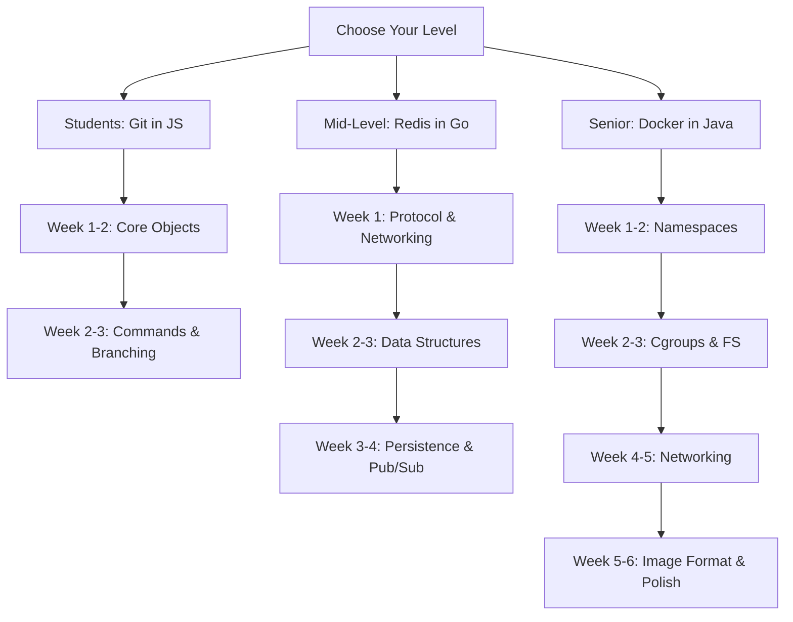

# Build Your Own X

The **ultimate resume differentiator**. While others list "Used Redis" or "Worked with Docker", you'll confidently say **"I built my own"**. This course guides you through building three production-grade systems from scratch, each targeting a different experience level.

Think of it this way: anyone can drive a car, but the person who has built an engine from parts understands why the car stalls on a cold morning. Building these tools from scratch gives you the same kind of intuition -- when Redis slows down in production, when a Git merge goes haywire, or when a container fails to start, you will _know_ what is happening beneath the surface because you have wired those internals together with your own hands.

<Info>
**Languages**: Java, Go, JavaScript  
**Target Outcome**: Deep systems understanding + impressive portfolio projects  
**Philosophy**: Learn by building, understand by implementing  
**Why 3 Languages?**: Each language has strengths for specific domains
</Info>

---

## Why Build Your Own?

<CardGroup cols={2}>
  <Card title="Interview Domination" icon="trophy">
    Nothing impresses more than "I built my own Redis/Git/Docker from scratch"
  </Card>
  <Card title="Deep Understanding" icon="brain">
    You'll never forget how B-Trees work after implementing one yourself
  </Card>
  <Card title="Resume Standout" icon="star">
    GitHub repos with working implementations speak louder than certifications
  </Card>
  <Card title="Debugging Superpowers" icon="bug">
    When you know internals, debugging production issues becomes intuitive
  </Card>
</CardGroup>

---

## The Three Projects

```
┌─────────────────────────────────────────────────────────────────────────────┐
│                         BUILD YOUR OWN X                                     │
├─────────────────────────────────────────────────────────────────────────────┤
│                                                                              │
│  🎓 STUDENTS/JUNIORS           🔧 MID-LEVEL ENGINEERS                       │
│  ──────────────────            ────────────────────────                      │
│  PROJECT: Build Your Own Git   PROJECT: Build Your Own Redis                │
│  LANGUAGE: JavaScript          LANGUAGE: Go                                 │
│  DURATION: 2-3 weeks           DURATION: 3-4 weeks                          │
│  SKILLS: Hashing, Trees,       SKILLS: Networking, Data                     │
│          File I/O, CLI               Structures, Protocols                  │
│                                                                              │
│  🚀 SENIOR ENGINEERS                                                        │
│  ────────────────────                                                        │
│  PROJECT: Build Your Own Docker                                             │
│  LANGUAGE: Java (with native calls)                                         │
│  DURATION: 4-6 weeks                                                        │
│  SKILLS: Linux Internals, Namespaces, Cgroups, Networking                   │
│                                                                              │
└─────────────────────────────────────────────────────────────────────────────┘
```

---

## Project Overview

<AccordionGroup>
  <Accordion title="🎓 Build Your Own Git (Students/Juniors)" icon="code-branch">
    **Why Git?**
    - Every developer uses Git daily, but few understand its elegant internals
    - Teaches fundamental CS concepts: SHA-1 hashing, tree structures, content-addressable storage
    - Perfect complexity level for beginners — challenging but achievable
    
    **What You'll Build:**
    - `init`, `add`, `commit`, `log`, `status`, `diff`, `branch`, `checkout`
    - Object store (blobs, trees, commits)
    - Index/staging area
    - Branch management
    
    **Resume Impact:** "Built a working Git implementation with commit history, branching, and diff functionality"
  </Accordion>

  <Accordion title="🔧 Build Your Own Redis (Mid-Level)" icon="database">
    **Why Redis?**
    - Most popular in-memory data store — used everywhere
    - Teaches networking, protocol design, data structures at scale
    - Perfect for demonstrating systems programming skills
    
    **What You'll Build:**
    - RESP protocol parser
    - Core commands: GET, SET, DEL, EXPIRE, KEYS, PING
    - Data structures: Strings, Lists, Sets, Hashes, Sorted Sets
    - Persistence: RDB snapshots, AOF logging
    - Pub/Sub messaging
    
    **Resume Impact:** "Implemented Redis clone supporting RESP protocol, multiple data structures, and persistence"
  </Accordion>

  <Accordion title="🚀 Build Your Own Docker (Senior)" icon="docker">
    **Why Docker?**
    - Containers are the foundation of modern infrastructure
    - Demonstrates deep Linux internals knowledge
    - The "wow factor" project that separates seniors from staff engineers
    
    **What You'll Build:**
    - Linux namespaces (PID, NET, MNT, UTS, USER)
    - Cgroups for resource limits (CPU, Memory)
    - Overlay filesystem (UnionFS concepts)
    - Container networking (bridge, veth pairs)
    - Image format and layers
    - Basic container runtime
    
    **Resume Impact:** "Built container runtime using Linux namespaces, cgroups, and overlay filesystems"
  </Accordion>
</AccordionGroup>

---

## Learning Path


```mermaid
graph TD
    A[Choose Your Level] --> B[Students: Git in JS]
    A --> C[Mid-Level: Redis in Go]
    A --> D[Senior: Docker in Java]
    
    B --> E[Week 1-2: Core Objects]
    E --> F[Week 2-3: Commands & Branching]
    
    C --> G[Week 1: Protocol & Networking]
    G --> H[Week 2-3: Data Structures]
    H --> I[Week 3-4: Persistence & Pub/Sub]
    
    D --> J[Week 1-2: Namespaces]
    J --> K[Week 2-3: Cgroups & FS]
    K --> L[Week 4-5: Networking]
    L --> M[Week 5-6: Image Format & Polish]
```

---

## Prerequisites by Level

| Level | Required Skills | Recommended |
|-------|----------------|-------------|
| **Students** | Basic JavaScript, File I/O, CLI basics | Some Git usage experience |
| **Mid-Level** | Go fundamentals, TCP/IP basics, Data Structures | Understanding of Redis usage |
| **Senior** | Systems programming, Linux basics, Java | Container usage experience |

---

## Get Started

<CardGroup cols={3}>
  <Card title="Build Git" icon="code-branch" href="/courses/build-your-own-x/git-overview">
    Start with the fundamentals — perfect for students and juniors
  </Card>
  <Card title="Build Redis" icon="database" href="/courses/build-your-own-x/redis-overview">
    Network programming and data structures — ideal for mid-level engineers
  </Card>
  <Card title="Build Docker" icon="docker" href="/courses/build-your-own-x/docker-overview">
    Deep Linux internals — the senior/staff engineer challenge
  </Card>
</CardGroup>

---

## Why These Languages?

| Project | Language | Reasoning |
|---------|----------|-----------|
| **Git** | JavaScript | Accessible, great for learning fundamentals, Buffer API for binary data |
| **Redis** | Go | Built for networking, goroutines for concurrency, perfect for systems software |
| **Docker** | Java | Enterprise-grade, demonstrates that containers aren't "just Go", JNI for syscalls |

<Note>
Each project includes implementations in **all three languages** so you can compare approaches and pick what resonates with your career goals.
</Note>

---

## Practical Tips Before You Start

- **Build incrementally, test constantly.** After every new function, run it. Resist the urge to write hundreds of lines before checking if anything works. This mirrors how production software is built -- small, verifiable increments.
- **Compare against the real tool.** Run the real `git`, `redis-server`, or `docker` side-by-side with your implementation and diff the outputs. Discrepancies are your best teacher.
- **Read source code when stuck.** The real Git, Redis, and Docker codebases are open-source. When your implementation diverges, a targeted search through the real source will teach you more than any blog post.
- **Keep a "TIL" (Today I Learned) log.** The insights you gain while building -- "Oh, _that's_ why Git uses SHA-1 prefixes as directory names" -- are interview gold. Write them down as you go.

---

## Interview Deep-Dive

<AccordionGroup>
  <Accordion title="Why would building a tool from scratch give you a meaningful advantage over someone who has years of experience using that tool in production?">
    **Strong Answer:**

    - Using a tool teaches you its API surface and operational patterns, but building one exposes the design decisions underneath. For example, a developer who has used Git for ten years knows to run `git rebase`, but someone who has built Git's object store understands *why* rebase can silently lose data in certain edge cases -- because it creates new commit objects with new hashes, and the old commits become unreachable and subject to garbage collection.
    - The debugging advantage is concrete. When Redis latency spikes, a user might suspect "the network" or "the load." Someone who has built Redis knows to check whether a `BGSAVE` fork is happening, because `fork()` on a machine with 50GB of resident memory triggers copy-on-write page faults that stall the event loop. That is not knowledge you get from reading the docs.
    - Building forces you to confront trade-offs that users never see. Why did Redis choose a single-threaded event loop instead of goroutines? Why does Docker use OverlayFS instead of a simple copy? These decisions have performance, correctness, and operational implications that only surface when you have to make them yourself.
    - The signal it sends in an interview is that you are the kind of engineer who does not stop at the abstraction boundary. You pull the abstraction apart when it matters, and that is exactly the instinct senior engineers need when debugging production incidents at 3 AM.

    **Follow-up: Does this mean you should always build things from scratch instead of using established tools?**

    Absolutely not, and that distinction is important. Building from scratch is a *learning* exercise, not a production strategy. In production, you use battle-tested tools because they have years of edge-case handling, security patches, and community knowledge baked in. The goal of building your own is to internalize the mental model so you can operate the real tool more effectively. For example, after building a Redis clone you would never ship it to production, but you would configure the real Redis's `maxmemory-policy` with genuine understanding of what `allkeys-lru` actually does at the data structure level. The judgment of when to build vs. buy is itself a staff-level skill -- and it comes from having the depth to evaluate the real tool's fitness honestly.
  </Accordion>

  <Accordion title="If you had to choose between building Git, Redis, or Docker for an interview at a company that does large-scale distributed systems, which would you pick and why?">
    **Strong Answer:**

    - I would choose Redis or Docker, depending on the specific team. For a backend/infrastructure team, Docker demonstrates deep Linux kernel knowledge -- namespaces, cgroups, overlay filesystems -- which maps directly to production container debugging, Kubernetes troubleshooting, and understanding the security boundaries of multi-tenant systems.
    - For a team focused on data-intensive applications or real-time systems, Redis is the stronger choice. Building Redis teaches you network protocol design (RESP), concurrent data structure implementation (skip lists, hash maps with lock strategies), and persistence trade-offs (RDB vs. AOF) that are directly relevant to building or operating any in-memory data store, cache layer, or message broker.
    - Git is the most accessible project but has the narrowest systems-level applicability. It excels at teaching content-addressable storage and DAG-based data modeling, but those concepts come up less frequently in distributed systems interviews than networking, concurrency, and resource management.
    - The meta-answer is that you should choose the project that overlaps most with the problems the team actually solves. Building Docker for a team that runs everything on serverless Lambda functions is less impactful than building Redis for a team that is debugging cache stampedes.

    **Follow-up: Could you argue the opposite -- that Git is actually the best interview project? What would that argument look like?**

    Yes, and the argument is strong for certain roles. Git's object model is essentially a Merkle tree, the same data structure that underpins blockchain, IPFS, and certificate transparency logs. If you are interviewing at a company that deals with content integrity, immutable audit logs, or distributed version control of any kind (not just code), Git is the most relevant project by far. Additionally, Git's branching model (a pointer file containing 41 bytes) is an elegant demonstration of how simple abstractions can enable powerful workflows -- which is a design philosophy that resonates deeply in system design interviews where the interviewer wants to see you make complexity simple, not the other way around.
  </Accordion>

  <Accordion title="Walk me through the common thread that connects the internal architectures of Git, Redis, and Docker. What design principle do they share?">
    **Strong Answer:**

    - The unifying principle is **separation of mechanism from policy through layered abstractions**. All three systems are built from small, composable primitives that the higher layers combine into complex behavior.
    - Git has three primitives: blobs (file content), trees (directory snapshots), and commits (metadata pointing to a tree). Everything else -- branches, tags, merges, rebases -- is policy built on top of these three objects. A branch is literally a file containing a 40-character hash.
    - Redis has a uniform key-value interface, but the *values* can be different data structures (strings, lists, sets, sorted sets, hashes). The RESP protocol is a generic serialization layer that does not care what command it carries. Persistence (RDB and AOF) is layered on top of the in-memory store as an orthogonal concern.
    - Docker composes Linux kernel primitives -- namespaces for isolation, cgroups for resource limits, overlay filesystems for storage efficiency, and veth pairs for networking -- into the user-facing concept of a "container." None of these primitives were invented for Docker; Docker's innovation was the composition.
    - The practical implication is that understanding any one of these systems teaches you a transferable skill: how to decompose a complex system into orthogonal, testable layers. In a system design interview, demonstrating that you think in composable primitives rather than monolithic features is one of the strongest signals of senior-level thinking.

    **Follow-up: Where does this layered approach break down? Give me an example where one of these tools suffers because of its layered design.**

    Docker's layered filesystem is the classic example. OverlayFS gives you beautiful layer sharing and copy-on-write efficiency, but it introduces the "whiteout file" problem -- deleting a file in an upper layer does not actually free the space in the lower layer; it just creates a marker. Over time, images accumulate dead weight in lower layers that cannot be reclaimed without rebuilding. This is why Docker image sizes balloon in practice and why multi-stage builds were invented as a workaround. The layered abstraction that makes images shareable also makes them difficult to shrink. It is a genuine trade-off, not a design flaw, and acknowledging it is exactly the kind of nuance that distinguishes senior engineers from people who just learned the architecture diagram.
  </Accordion>
</AccordionGroup>
