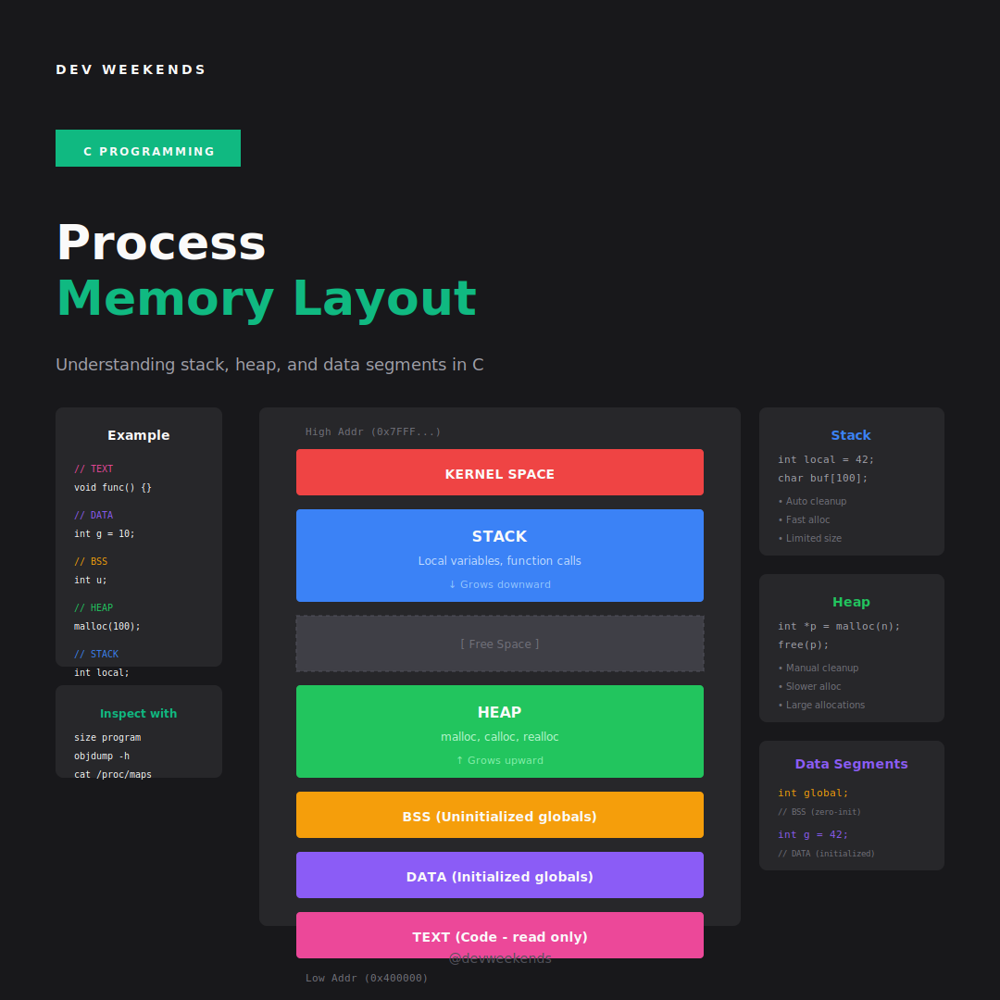

# Memory Layout & Segments

Understanding how a C program uses memory is fundamental to systems programming. Let's explore the memory map.

---

## Process Memory Layout

```
┌─────────────────────────────────────────────────────────────────────────────┐
│ High Addresses (e.g., 0x7FFFFFFFFFFF on x86-64)                            │
├─────────────────────────────────────────────────────────────────────────────┤
│                                                                              │
│                         KERNEL SPACE                                         │
│                   (not accessible by user program)                          │
│                                                                              │
├────────────────────────────────────────────────────────────────────────────┤
│                              STACK                                           │
│                         (grows downward ↓)                                   │
│                    Local variables, function calls                          │
│                                                                              │
│                               ↓                                              │
│                                                                              │
│                          [free space]                                        │
│                                                                              │
│                               ↑                                              │
│                                                                              │
│                              HEAP                                            │
│                          (grows upward ↑)                                    │
│                    malloc, calloc, realloc                                  │
│                                                                              │
├─────────────────────────────────────────────────────────────────────────────┤
│                              BSS                                             │
│                    Uninitialized global/static data                          │
│                         (zero-initialized)                                   │
├─────────────────────────────────────────────────────────────────────────────┤
│                              DATA                                            │
│                     Initialized global/static data                          │
├─────────────────────────────────────────────────────────────────────────────┤
│                              TEXT                                            │
│                         Program code (read-only)                            │
│                                                                              │
├─────────────────────────────────────────────────────────────────────────────┤
│ Low Addresses (e.g., 0x400000)                                              │
└─────────────────────────────────────────────────────────────────────────────┘
```

---

## Memory Layout in C



---

## Examining Memory Segments

```c
#include <stdio.h>
#include <stdlib.h>

// TEXT segment (code)
void function(void) {
    printf("I'm in the text segment\n");
}

// DATA segment (initialized globals)
int global_init = 42;
static int static_init = 100;

// BSS segment (uninitialized globals)
int global_uninit;
static int static_uninit;

// Also DATA segment (initialized, read-only)
const int global_const = 999;
const char *string_literal = "Hello"; // Pointer in DATA, string in RODATA

int main(void) {
    // Stack segment
    int local = 10;
    int local_array[100];
    
    // Heap segment
    int *heap_ptr = malloc(1000 * sizeof(int));
    
    printf("=== Memory Segment Addresses ===\n\n");
    
    printf("TEXT (code):\n");
    printf("  function():        %p\n", (void*)function);
    printf("  main():            %p\n", (void*)main);
    
    printf("\nDATA (initialized):\n");
    printf("  global_init:       %p\n", (void*)&global_init);
    printf("  static_init:       %p\n", (void*)&static_init);
    printf("  global_const:      %p\n", (void*)&global_const);
    printf("  string_literal:    %p\n", (void*)string_literal);
    
    printf("\nBSS (uninitialized):\n");
    printf("  global_uninit:     %p\n", (void*)&global_uninit);
    printf("  static_uninit:     %p\n", (void*)&static_uninit);
    
    printf("\nHEAP:\n");
    printf("  heap_ptr:          %p\n", (void*)heap_ptr);
    
    printf("\nSTACK:\n");
    printf("  local:             %p\n", (void*)&local);
    printf("  local_array:       %p\n", (void*)local_array);
    printf("  heap_ptr (var):    %p\n", (void*)&heap_ptr);
    
    free(heap_ptr);
    return 0;
}
```

### Viewing with Linux Tools

```bash
# Compile
gcc -g program.c -o program

# View segment sizes
size program
#    text    data     bss     dec     hex filename
#    2048     624      16    2688     a80 program

# View detailed sections
objdump -h program

# View memory map at runtime
./program &
cat /proc/$!/maps

# Or with pmap
pmap -x <pid>
```

---

## The Stack

### Stack Frame Structure

```
┌─────────────────────────────────────────────────────────────────────────────┐
│ Higher Addresses                                                            │
├─────────────────────────────────────────────────────────────────────────────┤
│                                                                              │
│    ... previous stack frames ...                                            │
│                                                                              │
├─────────────────────────────────────────────────────────────────────────────┤
│    Return Address           ← pushed by CALL instruction                    │
├─────────────────────────────────────────────────────────────────────────────┤
│    Saved Frame Pointer      ← old RBP                                       │
├─────────────────────────────────────────────────────────────────────────────┤
│    Local Variables          ← current function's locals                     │
│    - int x                                                                  │
│    - char buf[32]                                                           │
│    - int *ptr                                                               │
├─────────────────────────────────────────────────────────────────────────────┤
│    Saved Registers          ← callee-saved registers                        │
├─────────────────────────────────────────────────────────────────────────────┤
│    Function Arguments       ← for next function call (if > 6 args)         │
├─────────────────────────────────────────────────────────────────────────────┤
│                                                                              │
│    ... next stack frame (grows down) ...                                    │
│                                                                              │
├─────────────────────────────────────────────────────────────────────────────┤
│ Lower Addresses   ← RSP (Stack Pointer)                                     │
└─────────────────────────────────────────────────────────────────────────────┘
```

### Stack in Action

```c
#include <stdio.h>

void level3(void) {
    int local3 = 3;
    printf("level3: &local3 = %p\n", (void*)&local3);
}

void level2(void) {
    int local2 = 2;
    printf("level2: &local2 = %p\n", (void*)&local2);
    level3();
}

void level1(void) {
    int local1 = 1;
    printf("level1: &local1 = %p\n", (void*)&local1);
    level2();
}

int main(void) {
    int local0 = 0;
    printf("main:   &local0 = %p\n", (void*)&local0);
    level1();
    return 0;
}

// Output shows decreasing addresses (stack grows down):
// main:   &local0 = 0x7fff5000
// level1: &local1 = 0x7fff4fd0  (lower)
// level2: &local2 = 0x7fff4fa0  (lower)
// level3: &local3 = 0x7fff4f70  (lower)
```

### Stack Overflow

```c
#include <stdio.h>

// This will crash with stack overflow
void infinite_recursion(int n) {
    int buffer[1000];  // 4KB per call
    printf("Call %d, buffer at %p\n", n, (void*)buffer);
    infinite_recursion(n + 1);
}

// Check stack limit
#include <sys/resource.h>

void print_stack_limit(void) {
    struct rlimit limit;
    getrlimit(RLIMIT_STACK, &limit);
    printf("Stack limit: %lu bytes (soft), %lu bytes (hard)\n",
           limit.rlim_cur, limit.rlim_max);
}

// Increase stack limit
void increase_stack_limit(void) {
    struct rlimit limit;
    getrlimit(RLIMIT_STACK, &limit);
    limit.rlim_cur = 64 * 1024 * 1024;  // 64 MB
    setrlimit(RLIMIT_STACK, &limit);
}
```

### Variable-Length Arrays (VLAs)

```c
#include <stdio.h>

void process(int n) {
    // VLA - allocated on stack at runtime (C99)
    int arr[n];  // DANGER: Large n = stack overflow!
    
    printf("VLA of %d ints at %p\n", n, (void*)arr);
    
    // VLAs cannot be initialized
    for (int i = 0; i < n; i++) {
        arr[i] = i;
    }
}

// Safer alternative: use heap for large/variable sizes
void process_safe(int n) {
    int *arr = malloc(n * sizeof(int));
    if (!arr) {
        // Handle allocation failure
        return;
    }
    // ... use arr ...
    free(arr);
}
```

<Warning>
**VLAs are dangerous** for large or user-controlled sizes. They were made optional in C11 for good reason. Prefer heap allocation for variable-size arrays.
</Warning>

---

## The Heap

### How malloc Works (Simplified)

```c
// malloc uses brk/sbrk for small allocations
// and mmap for large allocations

#include <unistd.h>

void examine_brk(void) {
    void *initial = sbrk(0);  // Current program break
    printf("Initial program break: %p\n", initial);
    
    void *p1 = malloc(1000);
    printf("After malloc(1000): program break = %p\n", sbrk(0));
    
    void *p2 = malloc(1000);
    printf("After malloc(1000): program break = %p\n", sbrk(0));
    
    // Large allocation uses mmap, not brk
    void *p3 = malloc(1024 * 1024);  // 1 MB
    printf("After malloc(1MB): program break = %p (unchanged for mmap)\n", sbrk(0));
    
    free(p1);
    free(p2);
    free(p3);
}
```

### Heap Fragmentation

```c
#include <stdio.h>
#include <stdlib.h>

void demonstrate_fragmentation(void) {
    void *ptrs[1000];
    
    // Allocate many small blocks
    for (int i = 0; i < 1000; i++) {
        ptrs[i] = malloc(100);
    }
    
    // Free every other one (creates holes)
    for (int i = 0; i < 1000; i += 2) {
        free(ptrs[i]);
    }
    
    // Now we have 500 100-byte holes
    // This 60KB allocation might fail even though we have 50KB free!
    void *big = malloc(60000);
    if (!big) {
        printf("Fragmentation: can't allocate contiguous 60KB\n");
    }
    
    // Clean up
    for (int i = 1; i < 1000; i += 2) {
        free(ptrs[i]);
    }
    free(big);
}
```

---

## Memory Alignment

```c
#include <stdio.h>
#include <stddef.h>
#include <stdalign.h>  // C11
#include <stdlib.h>

struct Aligned {
    char a;      // 1 byte
                 // 3 bytes padding
    int b;       // 4 bytes (requires 4-byte alignment)
    char c;      // 1 byte
                 // 7 bytes padding
    double d;    // 8 bytes (requires 8-byte alignment)
};  // Total: 24 bytes (aligned to 8)

int main(void) {
    printf("sizeof(struct Aligned) = %zu\n", sizeof(struct Aligned));
    printf("alignof(struct Aligned) = %zu\n", alignof(struct Aligned));
    
    printf("\nOffset of a: %zu\n", offsetof(struct Aligned, a));
    printf("Offset of b: %zu\n", offsetof(struct Aligned, b));
    printf("Offset of c: %zu\n", offsetof(struct Aligned, c));
    printf("Offset of d: %zu\n", offsetof(struct Aligned, d));
    
    // Aligned allocation
    void *p = aligned_alloc(64, 1024);  // 64-byte aligned, 1024 bytes
    printf("\naligned_alloc(64, 1024) = %p\n", p);
    printf("Properly aligned: %s\n", ((uintptr_t)p % 64 == 0) ? "yes" : "no");
    free(p);
    
    return 0;
}
```

### Why Alignment Matters

```c
#include <stdio.h>
#include <stdint.h>
#include <time.h>

#define SIZE 10000000

// Unaligned access (slow on some architectures, UB on others)
void unaligned_access(void) {
    char buffer[SIZE + 8];
    
    // Misaligned int pointer
    int *p = (int*)(buffer + 1);  // Intentionally misaligned
    
    clock_t start = clock();
    for (int i = 0; i < SIZE / 4; i++) {
        p[i] = i;
    }
    clock_t end = clock();
    
    printf("Unaligned: %f seconds\n", 
           (double)(end - start) / CLOCKS_PER_SEC);
}

// Aligned access (fast)
void aligned_access(void) {
    int *p = malloc(SIZE);
    
    clock_t start = clock();
    for (int i = 0; i < SIZE / 4; i++) {
        p[i] = i;
    }
    clock_t end = clock();
    
    printf("Aligned:   %f seconds\n",
           (double)(end - start) / CLOCKS_PER_SEC);
    
    free(p);
}
```

---

## Static and Thread-Local Storage

```c
#include <stdio.h>
#include <pthread.h>

// Global (DATA/BSS segment, shared across threads)
int global_counter = 0;

// Static local (DATA/BSS segment, persists between calls)
void count_calls(void) {
    static int call_count = 0;  // Initialized once, persists
    call_count++;
    printf("Called %d times\n", call_count);
}

// Thread-local storage (each thread gets its own copy)
_Thread_local int thread_counter = 0;  // C11
// Or: __thread int thread_counter = 0;  // GCC extension

void* thread_func(void *arg) {
    int thread_id = *(int*)arg;
    
    for (int i = 0; i < 5; i++) {
        thread_counter++;  // Each thread has separate counter
        printf("Thread %d: thread_counter = %d\n", thread_id, thread_counter);
    }
    
    return NULL;
}

int main(void) {
    pthread_t t1, t2;
    int id1 = 1, id2 = 2;
    
    pthread_create(&t1, NULL, thread_func, &id1);
    pthread_create(&t2, NULL, thread_func, &id2);
    
    pthread_join(t1, NULL);
    pthread_join(t2, NULL);
    
    // Each thread's counter reached 5 independently
    
    return 0;
}
```

---

## Memory-Mapped Files

```c
#include <stdio.h>
#include <stdlib.h>
#include <sys/mman.h>
#include <sys/stat.h>
#include <fcntl.h>
#include <unistd.h>
#include <string.h>

int main(void) {
    const char *filename = "testfile.txt";
    
    // Create and write to file
    int fd = open(filename, O_RDWR | O_CREAT | O_TRUNC, 0644);
    const char *text = "Hello, memory-mapped world!";
    write(fd, text, strlen(text));
    
    // Get file size
    struct stat sb;
    fstat(fd, &sb);
    
    // Memory-map the file
    char *mapped = mmap(NULL, sb.st_size, PROT_READ | PROT_WRITE,
                        MAP_SHARED, fd, 0);
    
    if (mapped == MAP_FAILED) {
        perror("mmap");
        close(fd);
        return 1;
    }
    
    // Access file contents through memory
    printf("Mapped content: %.*s\n", (int)sb.st_size, mapped);
    
    // Modify through memory (writes to file!)
    mapped[0] = 'J';  // Changes "Hello" to "Jello"
    
    // Sync changes to disk
    msync(mapped, sb.st_size, MS_SYNC);
    
    // Unmap
    munmap(mapped, sb.st_size);
    close(fd);
    
    return 0;
}
```

---

## Exercises

<Steps>
  <Step title="Memory Map Explorer">
    Write a program that prints the address of variables in each segment (text, data, bss, heap, stack) and verifies they're in the expected order.
  </Step>
  <Step title="Stack Size Probe">
    Write a recursive function that measures roughly how much stack space is available before a stack overflow.
  </Step>
  <Step title="Alignment Checker">
    Write a function `bool is_aligned(void *ptr, size_t alignment)` that checks if a pointer is properly aligned.
  </Step>
  <Step title="Memory Visualizer">
    Use `/proc/self/maps` to write a program that displays its own memory regions with human-readable labels.
  </Step>
</Steps>

---

## Next Up

<Card title="Dynamic Memory Management" icon="arrow-right" href="/courses/c-programming/dynamic-memory">
  Master malloc, custom allocators, and memory patterns
</Card>
