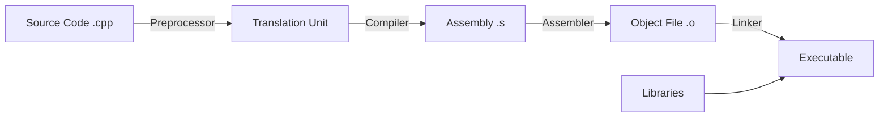

# C++ Fundamentals

Before diving into complex topics, we must establish a solid foundation. C++ is a **compiled language**, which means your human-readable code is transformed into machine-readable instructions before it can run. This is different from interpreted languages like Python, where code is executed line-by-line.

---

## 1. The Compilation Pipeline

Understanding how C++ code runs is crucial for debugging and optimization. It's not magic; it's a multi-step process.



### The Steps Explained
1.  **Preprocessing**: This happens *before* compilation. It handles directives starting with `#` (like `#include`). It essentially copy-pastes code into your file.
2.  **Compilation**: The compiler translates your C++ code into **Assembly**, a low-level human-readable language specific to your CPU architecture.
3.  **Assembly**: The assembler converts assembly code into **Machine Code** (binary), resulting in an "Object File" (`.o` or `.obj`).
4.  **Linking**: Finally, the linker combines your object files with external **Libraries** (like the C++ Standard Library) to create the final executable.

---

## 2. Anatomy of a C++ Program

Let's dissect a standard C++ program line-by-line to understand what's happening.

```cpp
// Preprocessor directive: Include the Input/Output stream library
#include <iostream>

// Main function: The entry point of every C++ program
int main() {
    // std::cout is the output stream
    // << is the insertion operator (think of it as pushing data to the console)
    std::cout << "Hello, World!" << std::endl;

    // Return 0 indicates successful execution to the Operating System
    return 0;
}
```

### Key Components
-   **`#include <iostream>`**: Tells the preprocessor to copy the contents of the `iostream` file here. This gives us access to input/output functionality.
-   **`int main()`**: The function called by the OS when you run the program. It *must* return an integer (usually 0 for success, non-zero for error).
-   **`std::`**: This is a **namespace**. It prevents name collisions. Think of it like a surname; `std::cout` is "cout from the Standard family".
-   **`cout`**: Character Output. Represents the console/terminal.
-   **`endl`**: Inserts a newline character (`\n`) and **flushes** the buffer (forces output to appear immediately).

---

## 3. Variables & Data Types

C++ is **statically typed**, meaning variable types are checked at compile time. This catches many errors before you even run the program.

### Fundamental Types

| Type | Size (Typical) | Description | Range |
| :--- | :--- | :--- | :--- |
| `int` | 4 bytes | Integer (Whole numbers) | -2B to +2B |
| `double` | 8 bytes | Double-precision float (Decimals) | ~15 decimal digits |
| `float` | 4 bytes | Single-precision float | ~7 decimal digits |
| `char` | 1 byte | ASCII character | -128 to 127 |
| `bool` | 1 byte | Boolean (Logic) | `true` or `false` |
| `void` | 0 bytes | Empty/No type | N/A |

### Initialization Styles

C++ offers multiple ways to initialize variables. **Brace initialization** (Uniform Initialization) is preferred in modern C++ because it prevents data loss.

```cpp
int a = 10;         // C-style assignment. Simple, but allows narrowing.
int b(20);          // Constructor style. Used often in classes.
int c{30};          // Brace initialization (Preferred). Safe.

// Why Brace Initialization?
// int x = 3.14;    // Compiles (truncates to 3 silently)
// int y{3.14};     // Error: Narrowing conversion not allowed! (Safer)
```

### Type Deduction (`auto`)

Introduced in C++11, `auto` lets the compiler deduce the type from the initializer. This is useful for complex types but should be used judiciously.

```cpp
auto x = 42;        // int
auto y = 3.14;      // double
auto name = "Dev";  // const char*
```

<Tip>
  Use `auto` when the type is obvious (e.g., `auto i = 0`) or when types are complex (e.g., iterators). Do not use it if it obscures readability.
</Tip>

---

## 4. Input & Output (I/O)

The `<iostream>` library provides streams for input and output. Think of streams as a flow of data bytes.

```cpp
#include <iostream>
#include <string>

int main() {
    int age;
    std::string name;

    std::cout << "Enter your name: ";
    // std::cin stops at whitespace! So "John Doe" would just get "John".
    // Use std::getline for full lines.
    std::getline(std::cin, name);

    std::cout << "Enter your age: ";
    std::cin >> age; // Reads an integer from the console

    std::cout << "Welcome, " << name << " (" << age << ")" << std::endl;
    return 0;
}
```

---

## 5. Control Flow

Control flow dictates the order in which statements are executed.

### Branching

Decisions are made using `if`, `else if`, and `else`.

```cpp
if (score > 90) {
    std::cout << "A";
} else if (score > 80) {
    std::cout << "B";
} else {
    std::cout << "C";
}

// Ternary Operator: A concise if-else for assigning values
std::string result = (score >= 50) ? "Pass" : "Fail";
```

### Switch Statement
Useful for checking a single variable against multiple discrete values (integers or enums).

```cpp
switch (option) {
    case 1:
        std::cout << "Option 1";
        break; // Don't forget break! Otherwise it "falls through" to case 2.
    case 2:
        std::cout << "Option 2";
        break;
    default:
        std::cout << "Invalid";
}
```

### Loops

**1. For Loop** (Standard)
Used when you know how many times you want to iterate.
```cpp
for (int i = 0; i < 5; ++i) {
    std::cout << i << " ";
}
```

**2. Range-Based For Loop** (Modern C++)
The best way to iterate over containers (arrays, vectors). It reads "for each element in collection".

```cpp
std::vector<int> numbers = {1, 2, 3, 4, 5};

// "for each num in numbers"
for (int num : numbers) {
    std::cout << num << " ";
}

// Use reference (&) to avoid copying large objects
// Use const to ensure you don't accidentally modify them
for (const auto& num : numbers) {
    std::cout << num << " ";
}
```

**3. While Loop**
Used when you want to loop until a condition becomes false.
```cpp
while (isRunning) {
    // Game loop logic
}
```

---

## 6. Functions

Functions break code into reusable blocks. They make code readable and maintainable.

### Declaration vs. Definition

In larger projects, we separate the **declaration** (telling the compiler a function exists) from the **definition** (the actual code).

```cpp
// Declaration (Prototype) - Usually goes in a Header file (.h)
int add(int a, int b);

int main() {
    std::cout << add(5, 3);
}

// Definition - Usually goes in a Source file (.cpp)
int add(int a, int b) {
    return a + b;
}
```

### Parameter Passing

How you pass data to functions matters for performance.

1.  **Pass by Value**: Copies the data. Safe, but slow for large objects.
2.  **Pass by Reference**: Passes the memory address. Fast, but allows modification.
3.  **Pass by Const Reference**: Fast and read-only. **(Preferred for complex types)**.

```cpp
// Pass by Value (Primitive types are fine)
void printAge(int age) { ... }

// Pass by Reference (Allows modification of the original variable)
void increment(int& value) {
    value++;
}

// Pass by Const Reference (Read-only, no copy)
// Use this for strings, vectors, and custom classes
void printMessage(const std::string& msg) {
    std::cout << msg;
}
```

### Function Overloading
You can have multiple functions with the same name but different parameters. The compiler figures out which one to call based on the arguments.

```cpp
void print(int i) { std::cout << "Int: " << i; }
void print(double d) { std::cout << "Double: " << d; }
```

---

## Summary

-   **Compilation**: Preprocessing -> Compilation -> Linking.
-   **Types**: Statically typed. Use `auto` judiciously.
-   **Initialization**: Prefer brace initialization `{}` for safety.
-   **Loops**: Prefer range-based for loops for collections.
-   **Functions**: Use `const type&` for large objects to avoid copying.

Next, we will dive into the most notorious and powerful feature of C++: **Pointers and Memory Management**.
