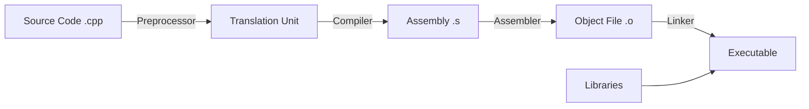

# C++ Fundamentals

Before diving into complex topics, we must establish a solid foundation. C++ is a **compiled language**, which means your human-readable code is transformed into machine-readable instructions before it can run. This is different from interpreted languages like Python, where code is executed line-by-line.

---

## 1. The Compilation Pipeline

Understanding how C++ code runs is crucial for debugging and optimization. It's not magic; it's a multi-step process.


```mermaid
graph LR
    A[Source Code .cpp] -->|Preprocessor| B[Translation Unit]
    B -->|Compiler| C[Assembly .s]
    C -->|Assembler| D[Object File .o]
    D -->|Linker| E[Executable]
    L[Libraries] --> E
```

### The Steps Explained
1.  **Preprocessing**: This happens *before* compilation. It handles directives starting with `#` (like `#include`). It essentially copy-pastes code into your file.
2.  **Compilation**: The compiler translates your C++ code into **Assembly**, a low-level human-readable language specific to your CPU architecture.
3.  **Assembly**: The assembler converts assembly code into **Machine Code** (binary), resulting in an "Object File" (`.o` or `.obj`).
4.  **Linking**: Finally, the linker combines your object files with external **Libraries** (like the C++ Standard Library) to create the final executable.

---

## 2. Anatomy of a C++ Program

Let's dissect a standard C++ program line-by-line to understand what's happening.

```cpp
// Preprocessor directive: Include the Input/Output stream library
#include <iostream>

// Main function: The entry point of every C++ program
int main() {
    // std::cout is the output stream
    // << is the insertion operator (think of it as pushing data to the console)
    std::cout << "Hello, World!" << std::endl;

    // Return 0 indicates successful execution to the Operating System
    return 0;
}
```

### Key Components
-   **`#include <iostream>`**: Tells the preprocessor to copy the contents of the `iostream` file here. This gives us access to input/output functionality.
-   **`int main()`**: The function called by the OS when you run the program. It *must* return an integer (usually 0 for success, non-zero for error).
-   **`std::`**: This is a **namespace**. It prevents name collisions. Think of it like a surname; `std::cout` is "cout from the Standard family".
-   **`cout`**: Character Output. Represents the console/terminal.
-   **`endl`**: Inserts a newline character (`\n`) and **flushes** the buffer (forces output to appear immediately).

<Warning>
  **Performance pitfall**: `std::endl` flushes the output buffer every time it is called. In a tight loop printing thousands of lines, this can be 10-100x slower than using `"\n"` instead. Use `"\n"` for newlines in performance-sensitive code, and reserve `std::endl` for when you truly need to guarantee the output appears immediately (like before a crash-prone operation or for debugging).
</Warning>

---

## 3. Variables & Data Types

C++ is **statically typed**, meaning variable types are checked at compile time. This catches many errors before you even run the program.

### Fundamental Types

| Type | Size (Typical) | Description | Range |
| :--- | :--- | :--- | :--- |
| `int` | 4 bytes | Integer (Whole numbers) | -2B to +2B |
| `double` | 8 bytes | Double-precision float (Decimals) | ~15 decimal digits |
| `float` | 4 bytes | Single-precision float | ~7 decimal digits |
| `char` | 1 byte | ASCII character | -128 to 127 |
| `bool` | 1 byte | Boolean (Logic) | `true` or `false` |
| `void` | 0 bytes | Empty/No type | N/A |

### Initialization Styles

C++ offers multiple ways to initialize variables. **Brace initialization** (Uniform Initialization) is preferred in modern C++ because it prevents data loss.

```cpp
int a = 10;         // C-style assignment. Simple, but allows narrowing.
int b(20);          // Constructor style. Used often in classes.
int c{30};          // Brace initialization (Preferred). Safe.

// Why Brace Initialization?
// int x = 3.14;    // Compiles (truncates to 3 silently)
// int y{3.14};     // Error: Narrowing conversion not allowed! (Safer)
```

### Type Deduction (`auto`)

Introduced in C++11, `auto` lets the compiler deduce the type from the initializer. This is useful for complex types but should be used judiciously.

```cpp
auto x = 42;        // int
auto y = 3.14;      // double
auto name = "Dev";  // const char* (Surprise! Not std::string)
```

<Tip>
  Use `auto` when the type is obvious (e.g., `auto i = 0`) or when types are complex (e.g., iterators). Do not use it if it obscures readability.
</Tip>

<Warning>
  **Common gotcha with `auto`**: `auto name = "Dev"` deduces to `const char*` (a C-style string pointer), **not** `std::string`. If you want a `std::string`, write `auto name = std::string("Dev")` or `std::string name = "Dev"`. This distinction matters because `const char*` has no `.size()`, `.substr()`, or other `std::string` methods. In C++14 and later, you can use the string literal suffix: `auto name = "Dev"s;` (requires `using namespace std::string_literals;`).
</Warning>

### Constants: `const` vs `constexpr`

When a value should never change, mark it `const`. When a value can be computed at compile time, use `constexpr` -- this lets the compiler optimize aggressively.

```cpp
const int maxPlayers = 100;        // Cannot be changed at runtime
constexpr int maxItems = 64;       // Computed at compile time -- can be used in array sizes

// constexpr functions are evaluated at compile time when possible
constexpr int square(int n) { return n * n; }
constexpr int area = square(5);    // Computed at compile time: 25
```

Think of `const` as a promise ("I won't change this") and `constexpr` as a guarantee ("this is known before the program even runs"). Prefer `constexpr` when possible -- it catches errors earlier and enables compiler optimizations.

### Compile-Time Constants Comparison

| Feature | `#define` | `const` | `constexpr` |
| :--- | :--- | :--- | :--- |
| Type-safe? | No (text substitution) | Yes | Yes |
| Debuggable? | No (replaced before compilation) | Yes (has a symbol) | Yes |
| Scope-aware? | No (global text replacement) | Yes (respects scope) | Yes |
| Computed at compile time? | Always (but no type checking) | Sometimes (compiler may optimize) | Guaranteed when possible |
| Usable in array sizes? | Yes | No (technically implementation-defined) | Yes |
| Can hold complex expressions? | Fragile (macro pitfalls) | Yes | Yes (functions too, since C++14) |

**Decision**: Never use `#define` for constants in modern C++. Use `constexpr` when the value is computable at compile time. Use `const` when the value is determined at runtime but should not change after initialization.

---

## 4. Input & Output (I/O)

The `<iostream>` library provides streams for input and output. Think of streams as a flow of data bytes.

```cpp
#include <iostream>
#include <string>

int main() {
    int age;
    std::string name;

    std::cout << "Enter your name: ";
    // std::cin stops at whitespace! So "John Doe" would just get "John".
    // Use std::getline for full lines.
    std::getline(std::cin, name);

    std::cout << "Enter your age: ";
    std::cin >> age; // Reads an integer from the console

    std::cout << "Welcome, " << name << " (" << age << ")" << std::endl;
    return 0;
}
```

<Warning>
  **Edge case -- mixing `cin >>` and `getline`**: If you read a number with `cin >> age` and then call `getline(cin, nextLine)`, the `getline` will read an empty string. Why? `cin >>` leaves the newline character (`\n`) in the input buffer. `getline` sees it immediately and returns an empty line. Fix: call `cin.ignore(numeric_limits<streamsize>::max(), '\n')` after `cin >>` to discard the leftover newline. This trips up nearly every beginner.
</Warning>

---

## 5. Control Flow

Control flow dictates the order in which statements are executed.

### Branching

Decisions are made using `if`, `else if`, and `else`.

```cpp
if (score > 90) {
    std::cout << "A";
} else if (score > 80) {
    std::cout << "B";
} else {
    std::cout << "C";
}

// Ternary Operator: A concise if-else for assigning values
std::string result = (score >= 50) ? "Pass" : "Fail";
```

### Switch Statement
Useful for checking a single variable against multiple discrete values (integers or enums).

```cpp
switch (option) {
    case 1:
        std::cout << "Option 1";
        break; // Don't forget break! Otherwise it "falls through" to case 2.
    case 2:
        std::cout << "Option 2";
        break;
    default:
        std::cout << "Invalid";
}
```

### Loops

**1. For Loop** (Standard)
Used when you know how many times you want to iterate.
```cpp
for (int i = 0; i < 5; ++i) {
    std::cout << i << " ";
}
```

**2. Range-Based For Loop** (Modern C++)
The best way to iterate over containers (arrays, vectors). It reads "for each element in collection".

```cpp
std::vector<int> numbers = {1, 2, 3, 4, 5};

// "for each num in numbers"
for (int num : numbers) {
    std::cout << num << " ";
}

// Use reference (&) to avoid copying large objects
// Use const to ensure you don't accidentally modify them
for (const auto& num : numbers) {
    std::cout << num << " ";
}
```

**3. While Loop**
Used when you want to loop until a condition becomes false.
```cpp
while (isRunning) {
    // Game loop logic
}
```

### When to Use Which Loop

| Situation | Best Loop | Why |
| :--- | :--- | :--- |
| Iterating over a container (vector, map, array) | Range-based `for` | Cleanest syntax, no off-by-one errors, works with any iterable |
| Need the index during iteration | Standard `for` | Range-based `for` does not expose the index directly |
| Loop count unknown, condition-based | `while` | Reads naturally: "while this is true, keep going" |
| Must execute at least once | `do-while` | Checks condition after the first iteration |
| Iterating with complex step logic (e.g., two pointers) | Standard `for` | Full control over initialization, condition, and increment |

<Warning>
  **Edge case -- modifying a container while iterating**: Erasing elements from a `std::vector` inside a range-based `for` loop is undefined behavior. The loop's internal iterator is invalidated by the erasure. Use the erase-remove idiom instead: `v.erase(std::remove_if(v.begin(), v.end(), predicate), v.end());`. In C++20, use `std::erase_if(v, predicate)` for a cleaner one-liner.
</Warning>

---

## 6. Functions

Functions break code into reusable blocks. They make code readable and maintainable.

### Declaration vs. Definition

In larger projects, we separate the **declaration** (telling the compiler a function exists) from the **definition** (the actual code).

```cpp
// Declaration (Prototype) - Usually goes in a Header file (.h)
int add(int a, int b);

int main() {
    std::cout << add(5, 3);
}

// Definition - Usually goes in a Source file (.cpp)
int add(int a, int b) {
    return a + b;
}
```

### Parameter Passing

How you pass data to functions matters enormously for performance. Passing a 10MB vector by value copies all 10MB. Passing it by reference copies only 8 bytes (the pointer). That is the difference between a fast program and a slow one.

1.  **Pass by Value**: Copies the data. Fine for small types (`int`, `double`, `char`), but expensive for large objects.
2.  **Pass by Reference (`&`)**: Passes the memory address. Fast, but the function can modify the original.
3.  **Pass by Const Reference (`const &`)**: Fast and read-only. **(The default choice for any non-trivial type)**.

```cpp
// Pass by Value -- fine for primitives (int is 4 bytes, copying is trivial)
void printAge(int age) { /* ... */ }

// Pass by Reference -- use when the function NEEDS to modify the caller's variable
void increment(int& value) {
    value++;  // Modifies the original variable, not a copy
}

// Pass by Const Reference -- the workhorse of C++ parameter passing
// No copy, no modification. Use this for strings, vectors, and custom classes.
void printMessage(const std::string& msg) {
    std::cout << msg;
    // msg = "changed"; // Compile error! const prevents modification.
}
```

<Tip>
  **Quick decision guide**: Is the type a primitive (`int`, `double`, `bool`, `char`)? Pass by value. Is it anything else (`std::string`, `std::vector`, a custom class)? Pass by `const&` unless you need to modify it, in which case pass by `&`.
</Tip>

### Function Overloading
You can have multiple functions with the same name but different parameters. The compiler figures out which one to call based on the arguments. This is resolved entirely at compile time -- there is zero runtime cost.

```cpp
void print(int i)    { std::cout << "Int: " << i; }
void print(double d) { std::cout << "Double: " << d; }

print(42);    // Calls print(int)
print(3.14);  // Calls print(double)
```

<Warning>
  **Pitfall**: Overloading can cause ambiguity. If you have `print(int)` and `print(double)`, calling `print(3.14f)` (a `float`) might be ambiguous because `float` can implicitly convert to both `int` and `double`. The compiler will error. Be intentional about which overloads you provide.
</Warning>

---

## Summary

-   **Compilation**: Preprocessing -> Compilation -> Linking.
-   **Types**: Statically typed. Use `auto` judiciously.
-   **Initialization**: Prefer brace initialization `{}` for safety.
-   **Loops**: Prefer range-based for loops for collections.
-   **Functions**: Use `const type&` for large objects to avoid copying.

### Parameter Passing Decision Framework

| Type being passed | Size | Pass by | Example |
| :--- | :--- | :--- | :--- |
| Primitives (`int`, `double`, `bool`, `char`) | 1-8 bytes | Value | `void f(int x)` |
| Small structs (2-3 members, all primitives) | Up to ~16 bytes | Value (often) or `const&` | `void f(Point p)` |
| `std::string`, `std::vector`, custom classes | Varies, often large | `const&` (read-only) or `&` (modify) | `void f(const std::string& s)` |
| Sink parameters (the function will store/own the data) | Any | Value, then `std::move` inside | `void f(std::string name) { member_ = std::move(name); }` |
| Optional/nullable arguments | Any | Pointer (`const T*` or `T*`) | `void f(const Config* cfg)` -- nullptr means "use defaults" |

---

## Exercises

1. **Narrowing detection**: Write a small program that tries to initialize an `int` with a `double` value using all three initialization styles (`=`, `()`, `{}`). Predict which ones compile and which ones produce errors or warnings. Compile and verify.
2. **Performance experiment**: Write a loop that prints 100,000 lines using `std::endl`, then again using `"\n"`. Time both versions. What is the difference on your machine? (Hint: use `std::chrono::high_resolution_clock`.)
3. **The overload puzzle**: Define `print(int)`, `print(double)`, and `print(const std::string&)`. What happens when you call `print('A')`? What about `print("hello")`? Predict the behavior, then compile and check. Explain why each call resolves the way it does.
4. **Const correctness**: Take any small function you have written and add `const` everywhere it belongs -- parameters, local variables, return types. Does it still compile? What did you learn about which values were actually being modified?

Next, we will dive into the most notorious and powerful feature of C++: **Pointers and Memory Management**.

---

## Interview Deep-Dive

<AccordionGroup>
  <Accordion title="What is undefined behavior in C++, and why is it more dangerous than a simple crash?">
    **Strong Answer:**

    - Undefined behavior (UB) means the C++ standard places no requirements on what the program does. It is not "implementation-defined" (where the compiler documents its choice) or "unspecified" (where the compiler picks one of several valid options). UB means the compiler is allowed to do literally anything -- crash, produce wrong results, format your hard drive (the classic joke), or most insidiously, appear to work perfectly in testing and fail catastrophically in production.
    - The real danger is that compilers actively exploit UB for optimization. If the compiler can prove that a code path involves UB, it is allowed to assume that path is never taken and optimize accordingly. A classic example: signed integer overflow is UB in C++. If you write `if (x + 1 > x)`, the compiler may optimize this to `if (true)` because it assumes signed overflow never happens. This means your "overflow check" is silently removed. The code compiles, passes tests with small values, and fails when `x` is `INT_MAX` in production.
    - Common sources of UB that trip up even experienced developers: dereferencing a null pointer, reading uninitialized variables, accessing an array out of bounds, using an object after it has been moved from (beyond assignment or destruction), data races on shared mutable state without synchronization, and violating the strict aliasing rule (casting between unrelated pointer types).
    - The mitigation strategy in production codebases: compile with sanitizers during testing (`-fsanitize=undefined,address,thread`). UBSan catches undefined behavior at runtime with minimal overhead. ASan catches memory errors. TSan catches data races. At Google, these sanitizers are run continuously on the entire codebase and have caught thousands of bugs that passed all other tests.

    **Follow-up: You mentioned strict aliasing. Can you explain what it is and give a concrete example of code that violates it?**

    - The strict aliasing rule says that you cannot access an object through a pointer of a different type (with a few exceptions like `char*` and `unsigned char*`). The compiler relies on this rule to assume that pointers of different types do not alias the same memory, which enables powerful optimizations like reordering loads and stores.
    - A concrete violation: `float f = 3.14f; int i = *(int*)&f;` -- this casts a `float*` to an `int*` and dereferences it. This is UB under strict aliasing. The compiler may reorder the read of `i` before the write of `f`, or cache the value in a register and never actually read from memory. The "correct" way to do this type-punning is `std::memcpy(&i, &f, sizeof(i))`, which the compiler recognizes and optimizes into a single register move -- same performance, no UB.
    - In practice, GCC's `-fstrict-aliasing` (enabled at `-O2` and above) aggressively exploits this. Code that "works" at `-O0` can produce completely different results at `-O2` because the optimizer reorders memory accesses based on aliasing assumptions. This is one of the most common sources of "the optimized build behaves differently from the debug build" bugs.
  </Accordion>

  <Accordion title="Explain the difference between const, constexpr, and consteval. When would you use each?">
    **Strong Answer:**

    - `const` is a runtime promise: "this variable will not be modified after initialization." The value can be determined at runtime -- for example, `const int x = getUserInput()` is perfectly valid. The compiler enforces immutability but does not necessarily evaluate the value at compile time.
    - `constexpr` is a compile-time capability: "this value can be computed at compile time, and the compiler should try." A `constexpr` variable must be initializable with a constant expression. A `constexpr` function can be evaluated at compile time if all arguments are constant expressions, but it can also be called at runtime with runtime values. This dual nature is both its strength and a source of confusion.
    - `consteval` (C++20) is a compile-time guarantee: "this function must be evaluated at compile time. Period." If you call a `consteval` function with a runtime argument, the program does not compile. This is useful for code generation, compile-time validation, and ensuring that certain computations never appear in the runtime binary.
    - Practical usage: use `const` for values determined at runtime that should not change (function parameters, loop invariants). Use `constexpr` for values and functions that benefit from compile-time evaluation but might also be used at runtime (lookup tables, hash functions, mathematical constants). Use `consteval` when compile-time evaluation is a correctness requirement, not just an optimization -- for example, a function that generates a compile-time lookup table from a DSL string, where runtime evaluation would be meaningless.
    - A subtle point: `constexpr` on a variable means "must be a compile-time constant." But `constexpr` on a function means "may be evaluated at compile time." These are different guarantees, and conflating them is a common source of confusion in interviews.

    **Follow-up: Can you give an example where constexpr functions enable optimizations that would be impossible otherwise?**

    - A classic example is compile-time hash computation for string switch statements. C++ does not support `switch` on strings, but you can write a `constexpr` hash function and switch on the hash: `constexpr size_t hash(const char* s) { ... }` then `switch(hash(input)) { case hash("GET"): ... case hash("POST"): ... }`. The `case` labels are evaluated at compile time (they must be constant expressions), so the hash function runs during compilation and the runtime code is a simple integer comparison -- no string comparison at all.
    - Another example: compile-time regular expression compilation. Libraries like CTRE (Compile-Time Regular Expressions) parse regex patterns at compile time using `constexpr` and generate optimized matching code. The regex `"\\d{3}-\\d{4}"` is parsed and converted into a state machine during compilation, so at runtime you get hand-tuned matching code with no regex interpretation overhead. Benchmarks show 10-100x speedups over `std::regex`.
    - Compile-time lookup tables are also powerful. Instead of computing a CRC table at startup, you declare it `constexpr` and the compiler embeds the fully computed table in the binary's read-only data section. Zero runtime initialization cost, and the table is shared across all instances of the program.
  </Accordion>

  <Accordion title="Walk me through what happens when you #include a header file. What problems does this cause at scale, and what are the modern solutions?">
    **Strong Answer:**

    - `#include` is textual substitution performed by the preprocessor before compilation even begins. When you write `#include <vector>`, the preprocessor literally copies the entire contents of the `vector` header file into your source file. That header in turn includes other headers (`<memory>`, `<algorithm>`, internal implementation headers), which include more headers. A single `#include <iostream>` can expand to over 25,000 lines of code that the compiler must parse. This is called "transitive inclusion."
    - At scale, this is devastating for compile times. In a large codebase with 10,000 source files, if each file includes 50 headers and each header expands to 20,000 lines, the compiler is parsing 200 million lines per translation unit times 10,000 units. Google reported that their C++ builds spend the majority of compilation time re-parsing the same headers across different translation units.
    - Mitigation techniques in pre-C++20 codebases: (1) Forward declarations -- declare `class Foo;` instead of `#include "Foo.h"` when you only need a pointer or reference. This avoids pulling in Foo's entire dependency tree. (2) The Pimpl idiom (pointer to implementation) -- hide implementation details behind an opaque pointer so the header only needs forward declarations. (3) Precompiled headers (PCH) -- the compiler parses commonly-used headers once and serializes the result. Subsequent compilations load the PCH instead of re-parsing. (4) Include-what-you-use (IWYU) tools analyze your code and remove unnecessary includes.
    - The modern solution is C++20 modules. Modules replace textual inclusion with semantic import. When you write `import std;`, the compiler loads a pre-compiled module interface that contains only the exported declarations -- no transitive includes, no macro leakage, no re-parsing. Early benchmarks from Microsoft (MSVC) showed 5-10x compile time improvements for module-heavy codebases. However, module adoption is still early: build system support (CMake, Bazel) is maturing, and many third-party libraries do not yet provide module interfaces.

    **Follow-up: What is the One Definition Rule (ODR), and how does the header inclusion model make ODR violations easy to introduce?**

    - The ODR states that every entity (function, class, variable) must have exactly one definition across the entire program (for things with external linkage) or exactly one definition per translation unit (for things with internal linkage or defined in headers). Violating the ODR is undefined behavior -- no diagnostic required, meaning the compiler is not obligated to warn you.
    - The header model makes ODR violations easy because the same header can be included in multiple translation units with different preprocessor state. If file A defines `#define MODE 1` before including `config.h`, and file B defines `#define MODE 2` before including the same `config.h`, and `config.h` uses `MODE` to conditionally define a class layout, you get two different definitions of the same class in the same program. The linker silently picks one, and the other translation unit uses the wrong layout -- corrupting memory at runtime.
    - This is not a theoretical concern. In production, ODR violations from inconsistent compiler flags (`-DNDEBUG` in some files but not others), different include orders that change macro state, or inline functions with subtly different definitions across translation units are a real source of "impossible" bugs. Tools like `ld`'s `--detect-odr-violations` and sanitizers can catch some of these, but they remain one of C++'s most treacherous pitfalls.
  </Accordion>

  <Accordion title="Why does C++ have so many initialization syntaxes, and which should a modern C++ developer use by default?">
    **Strong Answer:**

    - C++ has accumulated initialization syntaxes over 40 years of evolution, and each was added to solve a specific problem. Copy initialization (`int x = 5`) comes from C. Direct initialization (`int x(5)`) was added for constructor calls. List initialization (`int x{5}`) was added in C++11 to provide a uniform syntax that works everywhere and prevents narrowing conversions. Designated initializers (`Point p{.x = 1, .y = 2}`) were added in C++20 for aggregate readability.
    - The modern default should be brace initialization `{}` for most cases, because it prevents narrowing conversions (the compiler errors if you try to stuff a `double` into an `int`), it works with aggregates, it works with constructors, and it avoids the "most vexing parse" problem where `Widget w()` is parsed as a function declaration rather than a default construction.
    - The exception -- and this is the gotcha that interviewers love: brace initialization interacts badly with `std::initializer_list`. If a class has a constructor that takes `std::initializer_list`, braces will prefer that constructor even when you intended a different one. The classic example: `std::vector<int> v{10}` creates a vector with one element (the value 10), not a vector with 10 default-constructed elements. To get the latter, you must use parentheses: `std::vector<int> v(10)`. This is a well-known wart in the language.
    - My practical rule: use `{}` by default for variables and aggregates. Use `()` when calling constructors where `initializer_list` ambiguity exists (containers). Use `= value` for simple scalar initialization where readability is paramount and narrowing is not a concern. Consistency within a codebase matters more than any single rule.

    **Follow-up: Explain the "most vexing parse." Why does it happen, and how does brace initialization solve it?**

    - The most vexing parse is a C++ parsing ambiguity where a statement that looks like an object declaration is instead parsed as a function declaration. Example: `Widget w();` -- a developer intends to default-construct a `Widget` named `w`, but the compiler parses this as a declaration of a function named `w` that takes no arguments and returns a `Widget`. This follows from C's grammar rules that C++ inherited.
    - A more insidious example: `Widget w(Gadget())` -- the developer intends to construct a `Widget` by passing a default-constructed `Gadget`. But the compiler parses `Gadget()` as a function type (a function taking no arguments and returning a `Gadget`), making the entire statement a declaration of a function `w` that takes a function pointer parameter. The code compiles without warning, but `w` is a function, not an object. Any attempt to use `w` as an object produces confusing errors.
    - Brace initialization solves this because braces cannot appear in function declarations. `Widget w{}` is unambiguously an object construction. `Widget w{Gadget{}}` is unambiguously constructing a Widget with a Gadget argument. There is no grammar rule that could parse braces as a function declaration. This alone is a compelling reason to prefer braces.
  </Accordion>

  <Accordion title="What are the trade-offs between pass-by-value and pass-by-const-reference for function parameters in modern C++? Has the guidance changed with move semantics?">
    **Strong Answer:**

    - The traditional rule is simple: pass small types (primitives, small structs up to ~16 bytes) by value, and pass everything else by `const&`. This avoids unnecessary copies of large objects while keeping the syntax clean for cheap-to-copy types. This rule is still correct for the vast majority of cases.
    - Move semantics introduced a nuance for "sink parameters" -- parameters where the function will take ownership of the data (store it in a member, append it to a container). The modern idiom is: take the parameter by value, then `std::move` it into its final location. Example: `void setName(std::string name) { name_ = std::move(name); }`. If the caller passes an lvalue, this costs one copy plus one move. If the caller passes an rvalue (temporary), it costs two moves (which are near-free for types like `std::string` and `std::vector`).
    - The alternative is providing two overloads: one taking `const std::string&` (for lvalues) and one taking `std::string&&` (for rvalues). This is marginally more efficient (one copy for lvalues, one move for rvalues -- saving one move compared to the by-value approach) but doubles the number of overloads. For functions with N sink parameters, you need 2^N overloads, which is untenable. The by-value approach is the pragmatic default.
    - A subtle pitfall: do not blindly apply the by-value sink pattern to types where moves are expensive. `std::array<int, 10000>` has no heap allocation, so "moving" it copies 40KB -- same as a copy. For such types, `const&` plus explicit copy when needed is better. Always know the cost of a move for your type.
    - Another modern consideration: for generic code (templates), use forwarding references (`T&&` with `std::forward`) to get perfect forwarding. This gives you the efficiency of both overloads with a single function template, but the syntax and mental model are more complex.

    **Follow-up: What is perfect forwarding, and what problem does it solve that overloads and by-value cannot?**

    - Perfect forwarding preserves the value category (lvalue vs rvalue) and const/volatile qualifiers of an argument as it is passed through a generic function. Without it, a template wrapper function would either always copy (if it takes by value) or always bind as lvalue (if it takes by `const&`), losing the caller's intent.
    - The mechanism: a forwarding reference `template<typename T> void wrapper(T&& arg)` combined with `std::forward<T>(arg)` inside the function body. Due to reference collapsing rules, if the caller passes an lvalue, `T` deduces to `Foo&` and `T&&` collapses to `Foo&`. If the caller passes an rvalue, `T` deduces to `Foo` and `T&&` stays `Foo&&`. `std::forward<T>` then casts the argument back to its original category.
    - The canonical use case is `std::make_unique<T>(args...)` and `emplace_back(args...)`. These functions must forward constructor arguments to another function without adding copies. Without perfect forwarding, `make_unique` would need separate overloads for every combination of lvalue/rvalue arguments -- combinatorially impossible for variadic argument lists.
    - The gotcha: a forwarding reference `T&&` looks identical to an rvalue reference, but they are fundamentally different. `void f(Widget&&)` is an rvalue reference (only binds to rvalues). `template<typename T> void f(T&&)` is a forwarding reference (binds to anything). Confusing the two is a common interview mistake.
  </Accordion>
</AccordionGroup>
