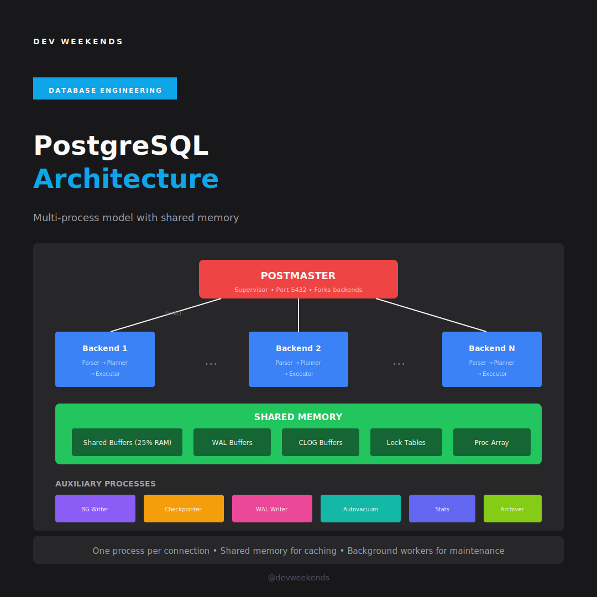

# Module 9: PostgreSQL Architecture

Understanding PostgreSQL's architecture is essential for debugging production issues, performance tuning, and contributing to the codebase. This module covers the complete system design.

<Info>
**Estimated Time**: 10-12 hours  
**Difficulty**: Advanced  
**OSS Relevance**: Critical — understanding overall system  
**Interview Value**: Staff/Principal level discussions
</Info>

---

## 9.1 Process Model



PostgreSQL uses a **multi-process architecture** where each client connection gets its own backend process.

```
┌─────────────────────────────────────────────────────────────────────────────┐
│                    POSTGRESQL PROCESS MODEL                                  │
├─────────────────────────────────────────────────────────────────────────────┤
│                                                                              │
│   ┌─────────────────────────────────────────────────────────────────────┐   │
│   │                         POSTMASTER                                   │   │
│   │                      (PID 1, supervisor)                            │   │
│   │   • Listens on port 5432                                            │   │
│   │   • Forks backend for each connection                              │   │
│   │   • Manages auxiliary processes                                     │   │
│   │   • Handles crash recovery                                          │   │
│   └───────────────────────────┬─────────────────────────────────────────┘   │
│                               │ fork()                                       │
│          ┌────────────────────┼────────────────────┐                        │
│          ▼                    ▼                    ▼                        │
│   ┌─────────────┐      ┌─────────────┐      ┌─────────────┐                │
│   │  Backend 1  │      │  Backend 2  │      │  Backend N  │                │
│   │  (client 1) │      │  (client 2) │      │  (client N) │                │
│   │             │      │             │      │             │                │
│   │ • Parser    │      │ • Parser    │      │ • Parser    │                │
│   │ • Planner   │      │ • Planner   │      │ • Planner   │                │
│   │ • Executor  │      │ • Executor  │      │ • Executor  │                │
│   └─────────────┘      └─────────────┘      └─────────────┘                │
│                                                                              │
│   ┌─────────────────────────────────────────────────────────────────────┐   │
│   │                    AUXILIARY PROCESSES                               │   │
│   ├─────────────┬─────────────┬─────────────┬─────────────┬─────────────┤   │
│   │  Background │ Checkpointer│  WAL Writer │  Autovacuum │   Stats     │   │
│   │   Writer    │             │             │   Launcher  │  Collector  │   │
│   │             │             │             │             │             │   │
│   │ Dirty page  │ Periodic    │ Flush WAL   │ Spawn vacuum│ Collect     │   │
│   │ flushing    │ checkpoints │ to disk     │ workers     │ statistics  │   │
│   └─────────────┴─────────────┴─────────────┴─────────────┴─────────────┘   │
│                                                                              │
└─────────────────────────────────────────────────────────────────────────────┘
```

### Process Details

| Process | Purpose | Key Behavior |
|---------|---------|--------------|
| **Postmaster** | Supervisor | Forks backends, manages startup/shutdown |
| **Backend** | Client queries | One per connection, runs queries |
| **Background Writer** | Dirty page flush | Writes dirty buffers to disk gradually |
| **Checkpointer** | Checkpoints | Periodic full sync of dirty pages |
| **WAL Writer** | WAL flush | Flushes WAL to disk periodically |
| **Autovacuum Launcher** | Vacuum scheduling | Spawns autovacuum workers |
| **Stats Collector** | Statistics | Aggregates activity statistics |
| **Archiver** | WAL archiving | Archives WAL files (if enabled) |

---

## 9.2 Memory Architecture

```
┌─────────────────────────────────────────────────────────────────────────────┐
│                    POSTGRESQL MEMORY ARCHITECTURE                            │
├─────────────────────────────────────────────────────────────────────────────┤
│                                                                              │
│   SHARED MEMORY (accessible by all processes)                               │
│   ┌─────────────────────────────────────────────────────────────────────┐   │
│   │                                                                     │   │
│   │   ┌─────────────────────────────────────────────────────────────┐   │   │
│   │   │                    SHARED BUFFERS                            │   │   │
│   │   │    • Page cache for table/index data                        │   │   │
│   │   │    • Default: 128MB, Recommended: 25% of RAM                │   │   │
│   │   │    • Buffer descriptors + buffer pool                       │   │   │
│   │   └─────────────────────────────────────────────────────────────┘   │   │
│   │                                                                     │   │
│   │   ┌───────────────────┐  ┌───────────────────┐  ┌──────────────┐   │   │
│   │   │    WAL Buffers    │  │   CLOG Buffers    │  │ Lock Tables  │   │   │
│   │   │  (wal_buffers)    │  │  (commit status)  │  │              │   │   │
│   │   │  Default: 16MB    │  │                   │  │              │   │   │
│   │   └───────────────────┘  └───────────────────┘  └──────────────┘   │   │
│   │                                                                     │   │
│   │   ┌───────────────────┐  ┌───────────────────┐                     │   │
│   │   │   Proc Array      │  │  Other Caches     │                     │   │
│   │   │  (backend info)   │  │ (rel, sys cache)  │                     │   │
│   │   └───────────────────┘  └───────────────────┘                     │   │
│   │                                                                     │   │
│   └─────────────────────────────────────────────────────────────────────┘   │
│                                                                              │
│   LOCAL MEMORY (per-backend process)                                        │
│   ┌─────────────────────────────────────────────────────────────────────┐   │
│   │                                                                     │   │
│   │   ┌─────────────────────┐  ┌─────────────────────────────────────┐  │   │
│   │   │      work_mem       │  │         temp_buffers                │  │   │
│   │   │  • Sorting          │  │    • Temporary tables               │  │   │
│   │   │  • Hash tables      │  │    • Default: 8MB                   │  │   │
│   │   │  • Per operation!   │  │                                     │  │   │
│   │   │  • Default: 4MB     │  │                                     │  │   │
│   │   └─────────────────────┘  └─────────────────────────────────────┘  │   │
│   │                                                                     │   │
│   │   ┌─────────────────────┐  ┌─────────────────────────────────────┐  │   │
│   │   │maintenance_work_mem │  │      Query Plan Cache               │  │   │
│   │   │  • VACUUM           │  │    • Prepared statements            │  │   │
│   │   │  • CREATE INDEX     │  │                                     │  │   │
│   │   │  • Default: 64MB    │  │                                     │  │   │
│   │   └─────────────────────┘  └─────────────────────────────────────┘  │   │
│   │                                                                     │   │
│   └─────────────────────────────────────────────────────────────────────┘   │
│                                                                              │
└─────────────────────────────────────────────────────────────────────────────┘
```

### Memory Configuration Best Practices

```sql
-- For a 32GB server

-- Shared memory (all backends share)
shared_buffers = 8GB                  -- 25% of RAM
effective_cache_size = 24GB           -- RAM available for caching (hint to planner)
wal_buffers = 64MB                    -- Auto-tuned based on shared_buffers

-- Per-backend memory
work_mem = 256MB                      -- Per sort/hash, be careful!
maintenance_work_mem = 1GB            -- VACUUM, CREATE INDEX
temp_buffers = 32MB                   -- Temp tables

-- Danger: work_mem × connections × operations!
-- 100 connections × 4 sorts × 256MB = 100GB overflow!
```

---

## 9.3 Buffer Pool Management

The buffer pool is the heart of PostgreSQL's I/O system.

### Buffer Architecture

```
┌─────────────────────────────────────────────────────────────────────────────┐
│                       BUFFER POOL INTERNALS                                  │
├─────────────────────────────────────────────────────────────────────────────┤
│                                                                              │
│   BUFFER DESCRIPTORS (metadata)                                             │
│   ┌─────┬─────┬─────┬─────┬─────┬─────┬─────┬─────┐                        │
│   │  0  │  1  │  2  │  3  │  4  │  5  │ ... │ N-1 │                        │
│   └──┬──┴──┬──┴──┬──┴──┬──┴──┬──┴──┬──┴─────┴──┬──┘                        │
│      │     │     │     │     │                  │                           │
│   ┌──▼──┬──▼──┬──▼──┬──▼──┬──▼──┬───────────┬──▼──┐                        │
│   │ 8KB │ 8KB │ 8KB │ 8KB │ 8KB │    ...    │ 8KB │  BUFFER POOL           │
│   │page │page │page │page │page │           │page │  (actual data)         │
│   └─────┴─────┴─────┴─────┴─────┴───────────┴─────┘                        │
│                                                                              │
│   Buffer Descriptor contains:                                                │
│   ┌──────────────────────────────────────────────────────────────────────┐  │
│   │ • tag: (relfilenode, fork, block#) - identifies the page           │  │
│   │ • buf_id: index into buffer pool                                    │  │
│   │ • state: valid, dirty, pinned, locked flags                         │  │
│   │ • refcount: number of backends using this buffer                    │  │
│   │ • usage_count: for clock-sweep replacement                          │  │
│   └──────────────────────────────────────────────────────────────────────┘  │
│                                                                              │
└─────────────────────────────────────────────────────────────────────────────┘
```

### Clock-Sweep Replacement

PostgreSQL uses a clock-sweep algorithm (approximating LRU) for buffer replacement.

```
┌─────────────────────────────────────────────────────────────────────────────┐
│                     CLOCK-SWEEP ALGORITHM                                    │
├─────────────────────────────────────────────────────────────────────────────┤
│                                                                              │
│   Buffer Pool (circular)         Usage Count                                │
│                                                                              │
│        ┌───┐                                                                 │
│        │ 5 │  ← usage_count = 3                                             │
│       /     \                                                                │
│     ┌───┐   ┌───┐                                                           │
│     │ 4 │   │ 0 │  ← usage_count = 0 → VICTIM!                             │
│     └───┘   └───┘                                                           │
│        \     /    ← Clock hand                                              │
│        ┌───┐                                                                 │
│        │ 3 │  ← usage_count = 2                                             │
│        └───┘                                                                 │
│                                                                              │
│   Algorithm:                                                                 │
│   1. Clock hand moves around buffer pool                                    │
│   2. If usage_count > 0: decrement and continue                            │
│   3. If usage_count = 0 and not pinned: evict (victim)                     │
│   4. Frequently used pages survive longer                                   │
│                                                                              │
└─────────────────────────────────────────────────────────────────────────────┘
```

---

## 9.4 WAL (Write-Ahead Logging)

WAL ensures durability and crash recovery.

### WAL Principles

```
┌─────────────────────────────────────────────────────────────────────────────┐
│                      WRITE-AHEAD LOGGING                                     │
├─────────────────────────────────────────────────────────────────────────────┤
│                                                                              │
│   RULE: Log BEFORE data page modification                                   │
│                                                                              │
│   Transaction commits:                                                       │
│                                                                              │
│   1. BEGIN                                                                   │
│      │                                                                       │
│   2. UPDATE users SET name = 'Bob' WHERE id = 1;                            │
│      │                                                                       │
│      ├──▶ Write WAL record (before image, after image)                      │
│      │    ┌────────────────────────────────────────────────────────────┐   │
│      │    │ LSN: 0/1A5B7C8 | XID: 1234 | Table: users | Block: 42    │   │
│      │    │ Offset: 128 | Old: 'Alice' | New: 'Bob'                   │   │
│      │    └────────────────────────────────────────────────────────────┘   │
│      │                                                                       │
│      └──▶ Modify buffer (in-memory, marked dirty)                           │
│                                                                              │
│   3. COMMIT                                                                  │
│      │                                                                       │
│      ├──▶ Write COMMIT WAL record                                           │
│      │                                                                       │
│      └──▶ Flush WAL to disk (fsync)  ← DURABILITY POINT                    │
│                                                                              │
│   Note: Actual data page flush can happen later!                            │
│         WAL ensures recoverability.                                          │
│                                                                              │
└─────────────────────────────────────────────────────────────────────────────┘
```

### WAL Structure

```
┌─────────────────────────────────────────────────────────────────────────────┐
│                        WAL FILE STRUCTURE                                    │
├─────────────────────────────────────────────────────────────────────────────┤
│                                                                              │
│   pg_wal/ directory                                                          │
│   ├── 000000010000000000000001   (16MB segment)                             │
│   ├── 000000010000000000000002                                              │
│   ├── 000000010000000000000003                                              │
│   └── ...                                                                    │
│                                                                              │
│   WAL Segment File (16MB default, wal_segment_size):                        │
│   ┌────────────────────────────────────────────────────────────────────┐    │
│   │ Page │ Page │ Page │ Page │ Page │ Page │ ... │ Page │             │    │
│   │  0   │  1   │  2   │  3   │  4   │  5   │     │  N   │             │    │
│   └──┬───┴──────┴──────┴──────┴──────┴──────┴─────┴──────┘             │    │
│      │                                                                       │
│      ▼                                                                       │
│   Page (8KB):                                                                │
│   ┌────────────────────────────────────────────────────────────────────┐    │
│   │ Header │ Record │ Record │ Record │ ... │ Record │                 │    │
│   └────────┴────────┴────────┴────────┴─────┴────────┘                 │    │
│                                                                              │
│   WAL Record:                                                                │
│   ┌────────────────────────────────────────────────────────────────────┐    │
│   │ Header (24 bytes)                                                  │    │
│   │ • xl_tot_len: total length                                        │    │
│   │ • xl_xid: transaction ID                                          │    │
│   │ • xl_prev: LSN of previous record                                 │    │
│   │ • xl_info: resource manager info                                  │    │
│   │ • xl_rmid: resource manager ID                                    │    │
│   │ • xl_crc: checksum                                                │    │
│   ├────────────────────────────────────────────────────────────────────┤    │
│   │ Data (variable)                                                    │    │
│   │ • Block references, before/after images                           │    │
│   └────────────────────────────────────────────────────────────────────┘    │
│                                                                              │
└─────────────────────────────────────────────────────────────────────────────┘
```

### LSN (Log Sequence Number)

```sql
-- LSN uniquely identifies a position in WAL
SELECT pg_current_wal_lsn();
-- Result: 0/1A5B7C8 (segment/offset format)

-- Check how far WAL has been written/flushed
SELECT 
    pg_current_wal_insert_lsn() AS insert,  -- Latest inserted
    pg_current_wal_lsn() AS write,          -- Written (buffered)
    pg_current_wal_flush_lsn() AS flush;    -- Flushed to disk

-- Calculate WAL generated since checkpoint
SELECT pg_wal_lsn_diff(pg_current_wal_lsn(), 
                        (SELECT redo_lsn FROM pg_control_checkpoint()));
```

---

## 9.5 Checkpoint & Recovery

### Checkpoint Process

```
┌─────────────────────────────────────────────────────────────────────────────┐
│                       CHECKPOINT PROCESS                                     │
├─────────────────────────────────────────────────────────────────────────────┤
│                                                                              │
│   Timeline:                                                                  │
│                                                                              │
│   ──●────────────────●────────────────●────────────────●──▶ time           │
│     │                │                │                │                    │
│   checkpoint     checkpoint      checkpoint       checkpoint               │
│     1                2               3                4                     │
│                                                                              │
│   Each checkpoint:                                                          │
│   1. Write checkpoint START record to WAL                                   │
│   2. Flush ALL dirty buffers to disk                                       │
│   3. Write checkpoint END record to WAL                                     │
│   4. Update pg_control with checkpoint location                            │
│                                                                              │
│   Recovery after crash:                                                     │
│   ┌────────────────────────────────────────────────────────────────────┐   │
│   │                                                                    │   │
│   │   Last          Crash                                              │   │
│   │   Checkpoint    Point                                              │   │
│   │      │            │                                                │   │
│   │   ───●────────────●────────────────▶                              │   │
│   │      │            │                                                │   │
│   │      │◀───────────┤                                                │   │
│   │      │   REDO     │                                                │   │
│   │      │ (replay WAL records)                                        │   │
│   │                                                                    │   │
│   └────────────────────────────────────────────────────────────────────┘   │
│                                                                              │
│   Checkpoint parameters:                                                    │
│   • checkpoint_timeout = 5min   (max time between)                         │
│   • max_wal_size = 1GB          (max WAL before forced checkpoint)         │
│   • checkpoint_completion_target = 0.9 (spread writes over 90% of time)    │
│                                                                              │
└─────────────────────────────────────────────────────────────────────────────┘
```

---

## 9.6 Vacuum & Autovacuum

### Why VACUUM is Needed

```
┌─────────────────────────────────────────────────────────────────────────────┐
│                     MVCC AND DEAD TUPLES                                     │
├─────────────────────────────────────────────────────────────────────────────┤
│                                                                              │
│   MVCC creates dead tuples:                                                 │
│                                                                              │
│   UPDATE users SET name = 'Bob' WHERE id = 1;                               │
│                                                                              │
│   Before:                        After:                                      │
│   ┌────────────────────┐         ┌────────────────────┐                     │
│   │ (1, 'Alice', ...)  │   ──▶   │ (1, 'Alice', ...) │ ← DEAD (old version)│
│   │                    │         │ (1, 'Bob', ...)   │ ← LIVE (new version)│
│   └────────────────────┘         └────────────────────┘                     │
│                                                                              │
│   Dead tuples:                                                               │
│   • Consume disk space                                                       │
│   • Cause index bloat                                                        │
│   • Slow down sequential scans                                              │
│   • Must be cleaned up by VACUUM                                            │
│                                                                              │
│   VACUUM process:                                                            │
│   1. Scan table for dead tuples                                             │
│   2. Check if any transaction might still need them                        │
│   3. Mark space as reusable in Free Space Map                              │
│   4. Update visibility map for index-only scans                            │
│                                                                              │
│   VACUUM FULL (rarely needed):                                              │
│   • Rewrites entire table                                                   │
│   • Reclaims space to OS                                                    │
│   • Requires exclusive lock                                                 │
│                                                                              │
└─────────────────────────────────────────────────────────────────────────────┘
```

### Autovacuum Configuration

```sql
-- Enable autovacuum (default: on)
autovacuum = on

-- Launch threshold
autovacuum_vacuum_threshold = 50        -- Min dead tuples
autovacuum_vacuum_scale_factor = 0.2    -- 20% of table

-- Trigger: dead_tuples > threshold + scale_factor × table_rows

-- Analyze threshold (for statistics)
autovacuum_analyze_threshold = 50
autovacuum_analyze_scale_factor = 0.1

-- Performance limits
autovacuum_max_workers = 3              -- Concurrent workers
autovacuum_naptime = 1min               -- Sleep between runs
autovacuum_vacuum_cost_limit = 200      -- I/O throttling

-- Per-table settings
ALTER TABLE big_table SET (
    autovacuum_vacuum_scale_factor = 0.01,  -- Vacuum more often
    autovacuum_vacuum_threshold = 1000
);
```

---

## 9.7 Monitoring Architecture Health

```sql
-- Process activity
SELECT pid, state, query, wait_event_type, wait_event 
FROM pg_stat_activity WHERE state != 'idle';

-- Buffer pool efficiency
SELECT 
    sum(blks_hit) AS hits,
    sum(blks_read) AS reads,
    round(sum(blks_hit)::numeric / nullif(sum(blks_hit) + sum(blks_read), 0), 4) AS ratio
FROM pg_stat_database;

-- Checkpoint activity
SELECT * FROM pg_stat_bgwriter;

-- WAL statistics
SELECT * FROM pg_stat_wal;

-- Vacuum progress
SELECT * FROM pg_stat_progress_vacuum;

-- Replication status
SELECT * FROM pg_stat_replication;
```

---

## 9.8 Interview Deep Dives

<AccordionGroup>
  <Accordion title="Q: Explain PostgreSQL's process model and why it uses forking">
    **Expected Answer**:
    - PostgreSQL uses multi-process (not multi-threaded) model
    - Each client gets dedicated backend process (fork from postmaster)
    - **Advantages**: Process isolation (one crash doesn't affect others), simpler shared memory model, works well on all UNIX systems
    - **Disadvantages**: Higher per-connection overhead (~10MB), fork can be slow
    - Historical: predates pthreads standardization, proven reliability
    - Modern mitigations: connection pooling (PgBouncer)
  </Accordion>
  
  <Accordion title="Q: What is WAL and why is it important?">
    **Expected Answer**:
    - Write-Ahead Logging: all changes logged before applying to data files
    - **Durability**: committed transactions survive crashes (redo from WAL)
    - **Performance**: sequential WAL writes faster than random data page writes
    - **Replication**: streaming replication sends WAL to standbys
    - **PITR**: point-in-time recovery using WAL archives
    - Key insight: can lose dirty buffers, but WAL enables full recovery
  </Accordion>
  
  <Accordion title="Q: How does PostgreSQL handle memory management?">
    **Expected Answer**:
    - **Shared memory** (shared_buffers): page cache for all backends, buffer descriptors
    - **Local memory** (work_mem): per-backend for sorts/hashes, careful with connections
    - **Memory contexts**: hierarchical palloc/pfree for easy cleanup
    - Sizing: shared_buffers ~25% RAM, work_mem × max_connections < 50% RAM
    - Buffer replacement: clock-sweep algorithm (approximate LRU)
  </Accordion>
</AccordionGroup>

---

## 9.9 Source Code Reference

```
src/backend/
├── postmaster/
│   ├── postmaster.c      # Main supervisor process
│   └── bgworker.c        # Background worker framework
├── storage/
│   ├── buffer/           # Buffer pool management
│   │   ├── bufmgr.c      # Buffer manager
│   │   └── freelist.c    # Clock-sweep replacement
│   ├── ipc/              # Inter-process communication
│   ├── lmgr/             # Lock manager
│   └── smgr/             # Storage manager
├── access/
│   ├── transam/          # Transaction management
│   │   ├── xlog.c        # WAL implementation
│   │   └── xact.c        # Transaction handling
│   └── heap/             # Heap access methods
├── commands/
│   └── vacuum.c          # VACUUM implementation
└── utils/
    └── mmgr/             # Memory contexts
```

---

## Next Module

<Card title="Module 10: Replication & HA" icon="arrow-right" href="/courses/database-engineering/replication">
  Build highly available PostgreSQL systems
</Card>
