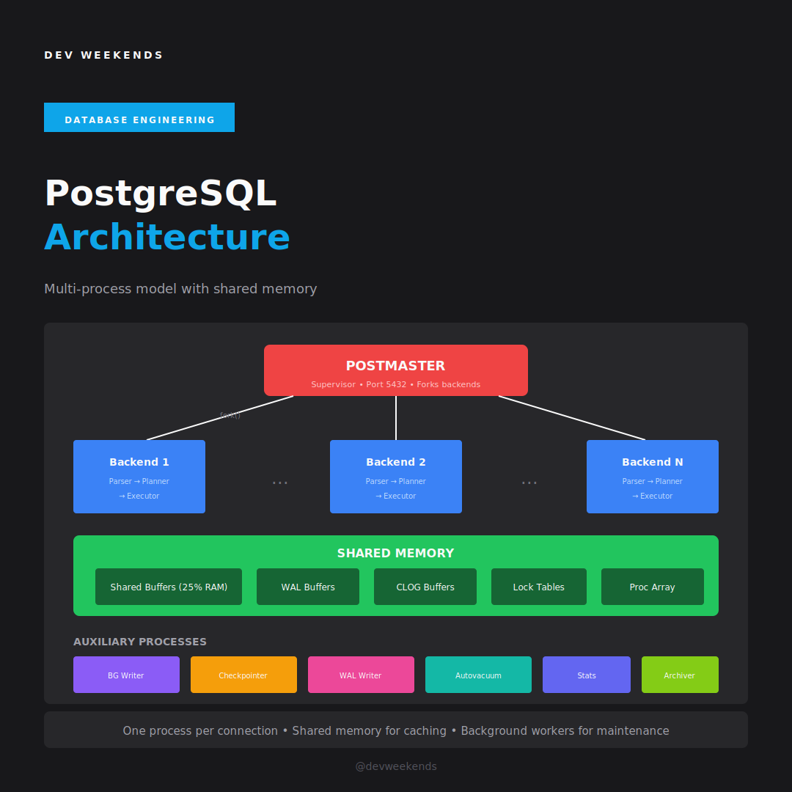

<Frame>
  
</Frame>

# Module 9: PostgreSQL Architecture

Understanding PostgreSQL's architecture is essential for debugging production issues, performance tuning, and contributing to the codebase. This module covers the complete system design.

<Info>
**Estimated Time**: 10-12 hours  
**Difficulty**: Advanced  
**OSS Relevance**: Critical — understanding overall system  
**Interview Value**: Staff/Principal level discussions
</Info>

---

## 9.1 Process Model



PostgreSQL uses a **multi-process architecture** where each client connection gets its own backend process.

**Real-world analogy**: Think of a restaurant. The Postmaster is the host who greets every guest at the door and assigns them a dedicated waiter (backend process). Each waiter handles one table exclusively -- if a waiter drops a tray, the other tables keep eating. The kitchen staff (auxiliary processes) work behind the scenes: one person washes dishes (Background Writer), another restocks the pantry (Checkpointer), a third writes down every order in the logbook before the kitchen starts cooking (WAL Writer). This isolation-by-process design is why PostgreSQL can survive a crash in one connection without bringing down the whole server.

```
┌─────────────────────────────────────────────────────────────────────────────┐
│                    POSTGRESQL PROCESS MODEL                                  │
├─────────────────────────────────────────────────────────────────────────────┤
│                                                                              │
│   ┌─────────────────────────────────────────────────────────────────────┐   │
│   │                         POSTMASTER                                   │   │
│   │                      (PID 1, supervisor)                            │   │
│   │   • Listens on port 5432                                            │   │
│   │   • Forks backend for each connection                              │   │
│   │   • Manages auxiliary processes                                     │   │
│   │   • Handles crash recovery                                          │   │
│   └───────────────────────────┬─────────────────────────────────────────┘   │
│                               │ fork()                                       │
│          ┌────────────────────┼────────────────────┐                        │
│          ▼                    ▼                    ▼                        │
│   ┌─────────────┐      ┌─────────────┐      ┌─────────────┐                │
│   │  Backend 1  │      │  Backend 2  │      │  Backend N  │                │
│   │  (client 1) │      │  (client 2) │      │  (client N) │                │
│   │             │      │             │      │             │                │
│   │ • Parser    │      │ • Parser    │      │ • Parser    │                │
│   │ • Planner   │      │ • Planner   │      │ • Planner   │                │
│   │ • Executor  │      │ • Executor  │      │ • Executor  │                │
│   └─────────────┘      └─────────────┘      └─────────────┘                │
│                                                                              │
│   ┌─────────────────────────────────────────────────────────────────────┐   │
│   │                    AUXILIARY PROCESSES                               │   │
│   ├─────────────┬─────────────┬─────────────┬─────────────┬─────────────┤   │
│   │  Background │ Checkpointer│  WAL Writer │  Autovacuum │   Stats     │   │
│   │   Writer    │             │             │   Launcher  │  Collector  │   │
│   │             │             │             │             │             │   │
│   │ Dirty page  │ Periodic    │ Flush WAL   │ Spawn vacuum│ Collect     │   │
│   │ flushing    │ checkpoints │ to disk     │ workers     │ statistics  │   │
│   └─────────────┴─────────────┴─────────────┴─────────────┴─────────────┘   │
│                                                                              │
└─────────────────────────────────────────────────────────────────────────────┘
```

### Process Details

| Process | Purpose | Key Behavior |
|---------|---------|--------------|
| **Postmaster** | Supervisor | Forks backends, manages startup/shutdown |
| **Backend** | Client queries | One per connection, runs queries |
| **Background Writer** | Dirty page flush | Writes dirty buffers to disk gradually |
| **Checkpointer** | Checkpoints | Periodic full sync of dirty pages |
| **WAL Writer** | WAL flush | Flushes WAL to disk periodically |
| **Autovacuum Launcher** | Vacuum scheduling | Spawns autovacuum workers |
| **Stats Collector** | Statistics | Aggregates activity statistics |
| **Archiver** | WAL archiving | Archives WAL files (if enabled) |

---

## 9.2 Memory Architecture

```
┌─────────────────────────────────────────────────────────────────────────────┐
│                    POSTGRESQL MEMORY ARCHITECTURE                            │
├─────────────────────────────────────────────────────────────────────────────┤
│                                                                              │
│   SHARED MEMORY (accessible by all processes)                               │
│   ┌─────────────────────────────────────────────────────────────────────┐   │
│   │                                                                     │   │
│   │   ┌─────────────────────────────────────────────────────────────┐   │   │
│   │   │                    SHARED BUFFERS                            │   │   │
│   │   │    • Page cache for table/index data                        │   │   │
│   │   │    • Default: 128MB, Recommended: 25% of RAM                │   │   │
│   │   │    • Buffer descriptors + buffer pool                       │   │   │
│   │   └─────────────────────────────────────────────────────────────┘   │   │
│   │                                                                     │   │
│   │   ┌───────────────────┐  ┌───────────────────┐  ┌──────────────┐   │   │
│   │   │    WAL Buffers    │  │   CLOG Buffers    │  │ Lock Tables  │   │   │
│   │   │  (wal_buffers)    │  │  (commit status)  │  │              │   │   │
│   │   │  Default: 16MB    │  │                   │  │              │   │   │
│   │   └───────────────────┘  └───────────────────┘  └──────────────┘   │   │
│   │                                                                     │   │
│   │   ┌───────────────────┐  ┌───────────────────┐                     │   │
│   │   │   Proc Array      │  │  Other Caches     │                     │   │
│   │   │  (backend info)   │  │ (rel, sys cache)  │                     │   │
│   │   └───────────────────┘  └───────────────────┘                     │   │
│   │                                                                     │   │
│   └─────────────────────────────────────────────────────────────────────┘   │
│                                                                              │
│   LOCAL MEMORY (per-backend process)                                        │
│   ┌─────────────────────────────────────────────────────────────────────┐   │
│   │                                                                     │   │
│   │   ┌─────────────────────┐  ┌─────────────────────────────────────┐  │   │
│   │   │      work_mem       │  │         temp_buffers                │  │   │
│   │   │  • Sorting          │  │    • Temporary tables               │  │   │
│   │   │  • Hash tables      │  │    • Default: 8MB                   │  │   │
│   │   │  • Per operation!   │  │                                     │  │   │
│   │   │  • Default: 4MB     │  │                                     │  │   │
│   │   └─────────────────────┘  └─────────────────────────────────────┘  │   │
│   │                                                                     │   │
│   │   ┌─────────────────────┐  ┌─────────────────────────────────────┐  │   │
│   │   │maintenance_work_mem │  │      Query Plan Cache               │  │   │
│   │   │  • VACUUM           │  │    • Prepared statements            │  │   │
│   │   │  • CREATE INDEX     │  │                                     │  │   │
│   │   │  • Default: 64MB    │  │                                     │  │   │
│   │   └─────────────────────┘  └─────────────────────────────────────┘  │   │
│   │                                                                     │   │
│   └─────────────────────────────────────────────────────────────────────┘   │
│                                                                              │
└─────────────────────────────────────────────────────────────────────────────┘
```

### Memory Configuration Best Practices

```sql
-- For a 32GB server

-- Shared memory (all backends share this single pool)
shared_buffers = 8GB                  -- 25% of RAM: the "hot data cache" all backends read from.
                                      -- Why 25%? The OS file cache handles the rest. Going higher
                                      -- (e.g., 50%) starves the OS cache and often hurts performance.
effective_cache_size = 24GB           -- NOT an allocation -- just a hint to the planner about how much
                                      -- total RAM (shared_buffers + OS cache) is available for caching.
                                      -- Setting this too low makes the planner avoid index scans.
wal_buffers = 64MB                    -- Auto-tuned based on shared_buffers. Buffer for WAL records
                                      -- before they're flushed to disk. Rarely needs manual tuning.

-- Per-backend memory (MULTIPLIED by every connection!)
work_mem = 256MB                      -- Memory for each sort/hash operation within a single query.
                                      -- A complex query with 4 sorts uses 4 x 256MB = 1GB per backend.
maintenance_work_mem = 1GB            -- Used by VACUUM, CREATE INDEX, ALTER TABLE ADD FK.
                                      -- Can be set higher than work_mem because these run less often.
temp_buffers = 32MB                   -- Cache for temporary tables. Only allocated when temp tables
                                      -- are actually used, so the cost is low in practice.

-- PITFALL: work_mem is per-operation, not per-connection!
-- 100 connections x 4 sorts x 256MB = 100GB -- far more than your 32GB server has.
-- In production, start with work_mem = 16-64MB and increase only for specific
-- sessions running large analytical queries:
--   SET LOCAL work_mem = '512MB';  -- Only affects this transaction
```

---

## 9.3 Buffer Pool Management

The buffer pool is the heart of PostgreSQL's I/O system. It sits between your queries and the disk, caching frequently-accessed 8KB pages in RAM so the database avoids slow disk reads.

**Real-world analogy**: The buffer pool is like the counter at a busy pharmacy. The pharmacist (backend process) doesn't walk to the warehouse (disk) for every prescription. Instead, the most requested medicines sit on the counter (buffer pool). When a medicine is requested, the pharmacist checks the counter first. If it's there (a "buffer hit"), they hand it over instantly. If not (a "buffer miss"), they fetch it from the warehouse and place it on the counter for next time -- bumping a less-popular item off the limited counter space.

### Buffer Architecture

```
┌─────────────────────────────────────────────────────────────────────────────┐
│                       BUFFER POOL INTERNALS                                  │
├─────────────────────────────────────────────────────────────────────────────┤
│                                                                              │
│   BUFFER DESCRIPTORS (metadata)                                             │
│   ┌─────┬─────┬─────┬─────┬─────┬─────┬─────┬─────┐                        │
│   │  0  │  1  │  2  │  3  │  4  │  5  │ ... │ N-1 │                        │
│   └──┬──┴──┬──┴──┬──┴──┬──┴──┬──┴──┬──┴─────┴──┬──┘                        │
│      │     │     │     │     │                  │                           │
│   ┌──▼──┬──▼──┬──▼──┬──▼──┬──▼──┬───────────┬──▼──┐                        │
│   │ 8KB │ 8KB │ 8KB │ 8KB │ 8KB │    ...    │ 8KB │  BUFFER POOL           │
│   │page │page │page │page │page │           │page │  (actual data)         │
│   └─────┴─────┴─────┴─────┴─────┴───────────┴─────┘                        │
│                                                                              │
│   Buffer Descriptor contains:                                                │
│   ┌──────────────────────────────────────────────────────────────────────┐  │
│   │ • tag: (relfilenode, fork, block#) - identifies the page           │  │
│   │ • buf_id: index into buffer pool                                    │  │
│   │ • state: valid, dirty, pinned, locked flags                         │  │
│   │ • refcount: number of backends using this buffer                    │  │
│   │ • usage_count: for clock-sweep replacement                          │  │
│   └──────────────────────────────────────────────────────────────────────┘  │
│                                                                              │
└─────────────────────────────────────────────────────────────────────────────┘
```

### Clock-Sweep Replacement

PostgreSQL uses a clock-sweep algorithm (approximating LRU) for buffer replacement.

```
┌─────────────────────────────────────────────────────────────────────────────┐
│                     CLOCK-SWEEP ALGORITHM                                    │
├─────────────────────────────────────────────────────────────────────────────┤
│                                                                              │
│   Buffer Pool (circular)         Usage Count                                │
│                                                                              │
│        ┌───┐                                                                 │
│        │ 5 │  ← usage_count = 3                                             │
│       /     \                                                                │
│     ┌───┐   ┌───┐                                                           │
│     │ 4 │   │ 0 │  ← usage_count = 0 → VICTIM!                             │
│     └───┘   └───┘                                                           │
│        \     /    ← Clock hand                                              │
│        ┌───┐                                                                 │
│        │ 3 │  ← usage_count = 2                                             │
│        └───┘                                                                 │
│                                                                              │
│   Algorithm:                                                                 │
│   1. Clock hand moves around buffer pool                                    │
│   2. If usage_count > 0: decrement and continue                            │
│   3. If usage_count = 0 and not pinned: evict (victim)                     │
│   4. Frequently used pages survive longer                                   │
│                                                                              │
└─────────────────────────────────────────────────────────────────────────────┘
```

---

## 9.4 WAL (Write-Ahead Logging)

WAL ensures durability and crash recovery.

### WAL Principles

```
┌─────────────────────────────────────────────────────────────────────────────┐
│                      WRITE-AHEAD LOGGING                                     │
├─────────────────────────────────────────────────────────────────────────────┤
│                                                                              │
│   RULE: Log BEFORE data page modification                                   │
│                                                                              │
│   Transaction commits:                                                       │
│                                                                              │
│   1. BEGIN                                                                   │
│      │                                                                       │
│   2. UPDATE users SET name = 'Bob' WHERE id = 1;                            │
│      │                                                                       │
│      ├──▶ Write WAL record (before image, after image)                      │
│      │    ┌────────────────────────────────────────────────────────────┐   │
│      │    │ LSN: 0/1A5B7C8 | XID: 1234 | Table: users | Block: 42    │   │
│      │    │ Offset: 128 | Old: 'Alice' | New: 'Bob'                   │   │
│      │    └────────────────────────────────────────────────────────────┘   │
│      │                                                                       │
│      └──▶ Modify buffer (in-memory, marked dirty)                           │
│                                                                              │
│   3. COMMIT                                                                  │
│      │                                                                       │
│      ├──▶ Write COMMIT WAL record                                           │
│      │                                                                       │
│      └──▶ Flush WAL to disk (fsync)  ← DURABILITY POINT                    │
│                                                                              │
│   Note: Actual data page flush can happen later!                            │
│         WAL ensures recoverability.                                          │
│                                                                              │
└─────────────────────────────────────────────────────────────────────────────┘
```

### WAL Structure

```
┌─────────────────────────────────────────────────────────────────────────────┐
│                        WAL FILE STRUCTURE                                    │
├─────────────────────────────────────────────────────────────────────────────┤
│                                                                              │
│   pg_wal/ directory                                                          │
│   ├── 000000010000000000000001   (16MB segment)                             │
│   ├── 000000010000000000000002                                              │
│   ├── 000000010000000000000003                                              │
│   └── ...                                                                    │
│                                                                              │
│   WAL Segment File (16MB default, wal_segment_size):                        │
│   ┌────────────────────────────────────────────────────────────────────┐    │
│   │ Page │ Page │ Page │ Page │ Page │ Page │ ... │ Page │             │    │
│   │  0   │  1   │  2   │  3   │  4   │  5   │     │  N   │             │    │
│   └──┬───┴──────┴──────┴──────┴──────┴──────┴─────┴──────┘             │    │
│      │                                                                       │
│      ▼                                                                       │
│   Page (8KB):                                                                │
│   ┌────────────────────────────────────────────────────────────────────┐    │
│   │ Header │ Record │ Record │ Record │ ... │ Record │                 │    │
│   └────────┴────────┴────────┴────────┴─────┴────────┘                 │    │
│                                                                              │
│   WAL Record:                                                                │
│   ┌────────────────────────────────────────────────────────────────────┐    │
│   │ Header (24 bytes)                                                  │    │
│   │ • xl_tot_len: total length                                        │    │
│   │ • xl_xid: transaction ID                                          │    │
│   │ • xl_prev: LSN of previous record                                 │    │
│   │ • xl_info: resource manager info                                  │    │
│   │ • xl_rmid: resource manager ID                                    │    │
│   │ • xl_crc: checksum                                                │    │
│   ├────────────────────────────────────────────────────────────────────┤    │
│   │ Data (variable)                                                    │    │
│   │ • Block references, before/after images                           │    │
│   └────────────────────────────────────────────────────────────────────┘    │
│                                                                              │
└─────────────────────────────────────────────────────────────────────────────┘
```

### LSN (Log Sequence Number)

```sql
-- LSN uniquely identifies a position in WAL
SELECT pg_current_wal_lsn();
-- Result: 0/1A5B7C8 (segment/offset format)

-- Check how far WAL has been written/flushed
SELECT 
    pg_current_wal_insert_lsn() AS insert,  -- Latest inserted
    pg_current_wal_lsn() AS write,          -- Written (buffered)
    pg_current_wal_flush_lsn() AS flush;    -- Flushed to disk

-- Calculate WAL generated since checkpoint
SELECT pg_wal_lsn_diff(pg_current_wal_lsn(), 
                        (SELECT redo_lsn FROM pg_control_checkpoint()));
```

---

## 9.5 Checkpoint & Recovery

### Checkpoint Process

```
┌─────────────────────────────────────────────────────────────────────────────┐
│                       CHECKPOINT PROCESS                                     │
├─────────────────────────────────────────────────────────────────────────────┤
│                                                                              │
│   Timeline:                                                                  │
│                                                                              │
│   ──●────────────────●────────────────●────────────────●──▶ time           │
│     │                │                │                │                    │
│   checkpoint     checkpoint      checkpoint       checkpoint               │
│     1                2               3                4                     │
│                                                                              │
│   Each checkpoint:                                                          │
│   1. Write checkpoint START record to WAL                                   │
│   2. Flush ALL dirty buffers to disk                                       │
│   3. Write checkpoint END record to WAL                                     │
│   4. Update pg_control with checkpoint location                            │
│                                                                              │
│   Recovery after crash:                                                     │
│   ┌────────────────────────────────────────────────────────────────────┐   │
│   │                                                                    │   │
│   │   Last          Crash                                              │   │
│   │   Checkpoint    Point                                              │   │
│   │      │            │                                                │   │
│   │   ───●────────────●────────────────▶                              │   │
│   │      │            │                                                │   │
│   │      │◀───────────┤                                                │   │
│   │      │   REDO     │                                                │   │
│   │      │ (replay WAL records)                                        │   │
│   │                                                                    │   │
│   └────────────────────────────────────────────────────────────────────┘   │
│                                                                              │
│   Checkpoint parameters:                                                    │
│   • checkpoint_timeout = 5min   (max time between)                         │
│   • max_wal_size = 1GB          (max WAL before forced checkpoint)         │
│   • checkpoint_completion_target = 0.9 (spread writes over 90% of time)    │
│                                                                              │
└─────────────────────────────────────────────────────────────────────────────┘
```

---

## 9.6 Vacuum & Autovacuum

### Why VACUUM is Needed

```
┌─────────────────────────────────────────────────────────────────────────────┐
│                     MVCC AND DEAD TUPLES                                     │
├─────────────────────────────────────────────────────────────────────────────┤
│                                                                              │
│   MVCC creates dead tuples:                                                 │
│                                                                              │
│   UPDATE users SET name = 'Bob' WHERE id = 1;                               │
│                                                                              │
│   Before:                        After:                                      │
│   ┌────────────────────┐         ┌────────────────────┐                     │
│   │ (1, 'Alice', ...)  │   ──▶   │ (1, 'Alice', ...) │ ← DEAD (old version)│
│   │                    │         │ (1, 'Bob', ...)   │ ← LIVE (new version)│
│   └────────────────────┘         └────────────────────┘                     │
│                                                                              │
│   Dead tuples:                                                               │
│   • Consume disk space                                                       │
│   • Cause index bloat                                                        │
│   • Slow down sequential scans                                              │
│   • Must be cleaned up by VACUUM                                            │
│                                                                              │
│   VACUUM process:                                                            │
│   1. Scan table for dead tuples                                             │
│   2. Check if any transaction might still need them                        │
│   3. Mark space as reusable in Free Space Map                              │
│   4. Update visibility map for index-only scans                            │
│                                                                              │
│   VACUUM FULL (rarely needed):                                              │
│   • Rewrites entire table                                                   │
│   • Reclaims space to OS                                                    │
│   • Requires exclusive lock                                                 │
│                                                                              │
└─────────────────────────────────────────────────────────────────────────────┘
```

### Autovacuum Configuration

```sql
-- Enable autovacuum (default: on)
autovacuum = on

-- Launch threshold
autovacuum_vacuum_threshold = 50        -- Min dead tuples
autovacuum_vacuum_scale_factor = 0.2    -- 20% of table

-- Trigger: dead_tuples > threshold + scale_factor × table_rows

-- Analyze threshold (for statistics)
autovacuum_analyze_threshold = 50
autovacuum_analyze_scale_factor = 0.1

-- Performance limits
autovacuum_max_workers = 3              -- Concurrent workers
autovacuum_naptime = 1min               -- Sleep between runs
autovacuum_vacuum_cost_limit = 200      -- I/O throttling

-- Per-table settings
ALTER TABLE big_table SET (
    autovacuum_vacuum_scale_factor = 0.01,  -- Vacuum more often
    autovacuum_vacuum_threshold = 1000
);
```

---

## 9.7 Monitoring Architecture Health

```sql
-- Process activity
SELECT pid, state, query, wait_event_type, wait_event 
FROM pg_stat_activity WHERE state != 'idle';

-- Buffer pool efficiency
SELECT 
    sum(blks_hit) AS hits,
    sum(blks_read) AS reads,
    round(sum(blks_hit)::numeric / nullif(sum(blks_hit) + sum(blks_read), 0), 4) AS ratio
FROM pg_stat_database;

-- Checkpoint activity
SELECT * FROM pg_stat_bgwriter;

-- WAL statistics
SELECT * FROM pg_stat_wal;

-- Vacuum progress
SELECT * FROM pg_stat_progress_vacuum;

-- Replication status
SELECT * FROM pg_stat_replication;
```

---

## 9.8 Interview Deep Dives

<AccordionGroup>
  <Accordion title="Q: Explain PostgreSQL's process model and why it uses forking">
    **Expected Answer**:
    - PostgreSQL uses multi-process (not multi-threaded) model
    - Each client gets dedicated backend process (fork from postmaster)
    - **Advantages**: Process isolation (one crash doesn't affect others), simpler shared memory model, works well on all UNIX systems
    - **Disadvantages**: Higher per-connection overhead (~10MB), fork can be slow
    - Historical: predates pthreads standardization, proven reliability
    - Modern mitigations: connection pooling (PgBouncer)
  </Accordion>
  
  <Accordion title="Q: What is WAL and why is it important?">
    **Expected Answer**:
    - Write-Ahead Logging: all changes logged before applying to data files
    - **Durability**: committed transactions survive crashes (redo from WAL)
    - **Performance**: sequential WAL writes faster than random data page writes
    - **Replication**: streaming replication sends WAL to standbys
    - **PITR**: point-in-time recovery using WAL archives
    - Key insight: can lose dirty buffers, but WAL enables full recovery
  </Accordion>
  
  <Accordion title="Q: How does PostgreSQL handle memory management?">
    **Expected Answer**:
    - **Shared memory** (shared_buffers): page cache for all backends, buffer descriptors
    - **Local memory** (work_mem): per-backend for sorts/hashes, careful with connections
    - **Memory contexts**: hierarchical palloc/pfree for easy cleanup
    - Sizing: shared_buffers ~25% RAM, work_mem × max_connections < 50% RAM
    - Buffer replacement: clock-sweep algorithm (approximate LRU)
  </Accordion>
</AccordionGroup>

---

## 9.9 Source Code Reference

```
src/backend/
├── postmaster/
│   ├── postmaster.c      # Main supervisor process
│   └── bgworker.c        # Background worker framework
├── storage/
│   ├── buffer/           # Buffer pool management
│   │   ├── bufmgr.c      # Buffer manager
│   │   └── freelist.c    # Clock-sweep replacement
│   ├── ipc/              # Inter-process communication
│   ├── lmgr/             # Lock manager
│   └── smgr/             # Storage manager
├── access/
│   ├── transam/          # Transaction management
│   │   ├── xlog.c        # WAL implementation
│   │   └── xact.c        # Transaction handling
│   └── heap/             # Heap access methods
├── commands/
│   └── vacuum.c          # VACUUM implementation
└── utils/
    └── mmgr/             # Memory contexts
```

---

## Next Module

<Card title="Module 10: Replication & HA" icon="arrow-right" href="/courses/database-engineering/replication">
  Build highly available PostgreSQL systems
</Card>

---

## Interview Deep-Dive (Conversational)

<AccordionGroup>
  <Accordion title="You said shared_buffers should be 25% of RAM. What happens if you set it to 75%? And why is not 'more cache = better' true here?">
    **Strong Answer:**

    - Setting shared_buffers to 75% of RAM will likely degrade performance rather than improve it, because PostgreSQL relies on a double-buffering architecture. When PostgreSQL reads a page from disk, that page exists in both the OS page cache AND in shared_buffers. The OS page cache acts as a second-level cache that is managed by the kernel's LRU algorithm, which is often more sophisticated than PostgreSQL's clock-sweep.
    - At 75% of RAM for shared_buffers, the OS has very little memory left for its own page cache, for work_mem allocations, for maintenance_work_mem during VACUUM/CREATE INDEX, and for the per-backend private memory (5-10MB each). The system starts swapping, or the OS reclaims pages aggressively, and performance collapses.
    - The 25% guideline exists because the remaining 75% is used by: OS page cache (~50% of RAM effectively), work_mem for sorts and hash operations across all backends, maintenance_work_mem for autovacuum workers, and per-backend overhead. The effective_cache_size parameter (typically 75% of RAM) tells the planner about the total cache available (shared_buffers + OS cache) without actually allocating that memory.
    - Exception: very large dedicated database servers (256GB+ RAM) may benefit from slightly higher shared_buffers (30-40%) because the absolute amount left for the OS cache is still very large. But always benchmark -- the Pareto optimal is remarkably consistent at 25%.

    **Follow-up: How would you diagnose whether shared_buffers is too small for your workload?**

    Check the buffer cache hit ratio: `SELECT sum(blks_hit) / nullif(sum(blks_hit) + sum(blks_read), 0) FROM pg_stat_database`. Below 99% on a well-tuned OLTP system indicates the working set does not fit in cache. Also install pg_buffercache extension and check which relations consume the most buffer space -- if critical tables are being evicted, shared_buffers may be undersized for your working set.
  </Accordion>

  <Accordion title="Explain the autovacuum subsystem. Why does it exist, what happens when it falls behind, and how do you tune it for a high-write workload?">
    **Strong Answer:**

    - Autovacuum exists because PostgreSQL's MVCC creates dead tuples on every UPDATE and DELETE. Without cleanup, tables grow without bound, indexes bloat, and eventually the 32-bit transaction ID wraps around, forcing the database to shut down. Autovacuum is not optional -- it is a core component of PostgreSQL's correctness guarantee.
    - When it falls behind: the symptoms cascade. Dead tuples accumulate, causing table bloat (sequential scans read more pages), index bloat (index lookups traverse more pages), and eventually the `autovacuum_freeze_max_age` threshold triggers an aggressive "anti-wraparound" vacuum that cannot be cancelled, causing I/O storms. At its worst, the database refuses new transactions with `WARNING: database must be vacuumed within X transactions`.
    - Tuning for high-write workloads: (1) Increase `autovacuum_max_workers` from 3 to 5-6. (2) Reduce `autovacuum_vacuum_scale_factor` to 0.01 on high-churn tables (vacuum after 1% of rows are dead instead of 20%). (3) Increase `autovacuum_vacuum_cost_limit` from 200 to 1000-2000 to let vacuum do more work before sleeping. (4) Reduce `autovacuum_naptime` from 1min to 15s for faster reaction. (5) Set per-table settings on the busiest tables: `ALTER TABLE events SET (autovacuum_vacuum_scale_factor = 0.005, autovacuum_vacuum_cost_limit = 2000)`.
    - Monitor: watch `n_dead_tup` and `last_autovacuum` in pg_stat_user_tables. Alert when n_dead_tup exceeds n_live_tup on any table, or when last_autovacuum is more than 1 hour ago on a high-write table.

    **Follow-up: What is the relationship between VACUUM and the visibility map?**

    The visibility map tracks which heap pages contain only tuples visible to all current and future transactions (all-visible pages). VACUUM sets bits in the visibility map after cleaning a page. The visibility map enables two optimizations: (1) Index-Only Scans can skip heap fetches for all-visible pages, reading data directly from the index. (2) Future VACUUM runs can skip all-visible pages entirely, dramatically reducing vacuum I/O on tables where most data is cold. This is why frequent vacuum is not just about dead tuple cleanup -- it is also about maintaining the visibility map for index-only scan performance.
  </Accordion>

  <Accordion title="The checkpointer process just triggered a 'checkpoint too frequent' warning. What is happening and what do you do?">
    **Strong Answer:**

    - This warning means checkpoints are being triggered by WAL volume (max_wal_size) rather than the configured interval (checkpoint_timeout). The database is generating WAL faster than the checkpoint interval can accommodate, so the system forces early checkpoints to prevent running out of WAL space.
    - Impact: each checkpoint flushes ALL dirty buffers to disk. Frequent checkpoints mean frequent full I/O flushes, causing latency spikes. They also mean full_page_writes (which happen after each checkpoint) trigger more often, inflating WAL volume further in a vicious cycle.
    - Fix: increase `max_wal_size` to accommodate the WAL volume generated within one checkpoint_timeout interval. Calculate: check `pg_stat_bgwriter.checkpoints_req` (checkpoints triggered by WAL size) vs `checkpoints_timed` (triggered by timeout). If `checkpoints_req` dominates, double max_wal_size and re-evaluate. A typical production setting for write-heavy workloads is max_wal_size = 4GB-16GB with checkpoint_timeout = 15min.
    - Also ensure `checkpoint_completion_target = 0.9` so checkpoint I/O is spread over 90% of the interval rather than hitting all at once. And verify that your storage can handle the checkpoint write burst -- if underlying disk I/O is the bottleneck, no amount of tuning will help.

    **Follow-up: What is the tradeoff of setting max_wal_size very high, like 64GB?**

    Recovery time increases. After a crash, PostgreSQL must replay all WAL since the last completed checkpoint. With max_wal_size = 64GB and checkpoint_timeout = 15min, the worst case is replaying 15 minutes of WAL, which could take several minutes. With max_wal_size = 1GB, recovery might take 30 seconds. You are trading write performance (fewer, larger checkpoints) against recovery time (more WAL to replay after crash). The right balance depends on your RTO requirements.
  </Accordion>
</AccordionGroup>
