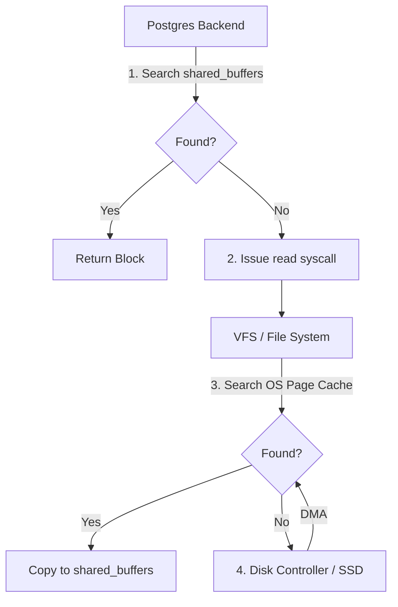

<Frame>
  
</Frame>

# Buffer Manager Deep Dive

This module provides comprehensive coverage of PostgreSQL's buffer manager — the component responsible for caching database pages in memory. Understanding buffer management is crucial for performance tuning and storage engine development.

<Info>
**Target Audience**: Database infrastructure engineers, performance specialists  
**Prerequisites**: Storage Deep Dive, Lock Manager modules  
**Source Directories**: `src/backend/storage/buffer/`, `src/include/storage/`  
**Interview Relevance**: Staff+ database infrastructure roles
</Info>

---

## Part 1: Buffer Pool Architecture

```
┌─────────────────────────────────────────────────────────────────────────────┐
│                    BUFFER POOL ARCHITECTURE                                  │
├─────────────────────────────────────────────────────────────────────────────┤
│                                                                              │
│   Shared Memory Region (configured by shared_buffers)                       │
│   ┌─────────────────────────────────────────────────────────────────────┐   │
│   │                                                                     │   │
│   │   Buffer Descriptors Array (fixed size = NBuffers)                  │   │
│   │   ┌─────────────────────────────────────────────────────────────┐   │   │
│   │   │ [0] │ [1] │ [2] │ [3] │ [4] │ ... │ [NBuffers-1]            │   │   │
│   │   │ Desc│ Desc│ Desc│ Desc│ Desc│     │ Desc                    │   │   │
│   │   └──┬──┴──┬──┴──┬──┴──┬──┴──┬──┴─────┴──┬──────────────────────┘   │   │
│   │      │     │     │     │     │           │                          │   │
│   │      │     │     │     │     │           │                          │   │
│   │   Buffer Pool (array of 8KB pages)       │                          │   │
│   │   ┌──┴──┬──┴──┬──┴──┬──┴──┬──┴──┬─────┬──┴──────────────────────┐   │   │
│   │   │ Page│ Page│ Page│ Page│ Page│ ... │ Page                    │   │   │
│   │   │  0  │  1  │  2  │  3  │  4  │     │ NBuffers-1              │   │   │
│   │   │ 8KB │ 8KB │ 8KB │ 8KB │ 8KB │     │ 8KB                     │   │   │
│   │   └─────┴─────┴─────┴─────┴─────┴─────┴─────────────────────────┘   │   │
│   │                                                                     │   │
│   │   Buffer Mapping Hash Table                                         │   │
│   │   ┌─────────────────────────────────────────────────────────────┐   │   │
│   │   │  (RelFileNode, ForkNum, BlockNum) → Buffer ID               │   │   │
│   │   │                                                             │   │   │
│   │   │  Partitioned into 128 segments (reduce contention)          │   │   │
│   │   │  Each partition protected by its own LWLock                 │   │   │
│   │   └─────────────────────────────────────────────────────────────┘   │   │
│   │                                                                     │   │
│   │   Strategy Control (for replacment algorithm state)                │   │
│   │   ┌─────────────────────────────────────────────────────────────┐   │   │
│   │   │  nextVictimBuffer: Current clock hand position              │   │   │
│   │   │  completePasses: Number of complete sweeps                  │   │   │
│   │   │  numBufferAllocs: Total allocations                         │   │   │
│   │   └─────────────────────────────────────────────────────────────┘   │   │
│   │                                                                     │   │
│   └─────────────────────────────────────────────────────────────────────┘   │
│                                                                              │
└─────────────────────────────────────────────────────────────────────────────┘
```

### 1.1 Buffer Descriptor Structure

```c
/* src/include/storage/buf_internals.h */

typedef struct BufferDesc
{
    BufferTag   tag;            /* ID of page stored in buffer */
    int         buf_id;         /* Buffer index (0 to NBuffers-1) */
    
    /* State information */
    pg_atomic_uint32 state;     /* Packed state flags */
    
    /* Wait tracking */
    int         wait_backend_pgprocno;  /* Backend waiting for pin */
    
    /* Free list management */
    int         freeNext;       /* Link in freelist chain */
    
    /* Content lock */
    LWLock      content_lock;   /* Protects page contents */
} BufferDesc;

/* Buffer tag - identifies which disk page is in the buffer */
typedef struct buftag
{
    RelFileNode rnode;          /* Physical relation identifier */
    ForkNumber  forkNum;        /* Fork number (main, fsm, vm, init) */
    BlockNumber blockNum;       /* Block number within fork */
} BufferTag;

/* RelFileNode - physical file identifier */
typedef struct RelFileNode
{
    Oid         spcNode;        /* Tablespace OID */
    Oid         dbNode;         /* Database OID */
    Oid         relNode;        /* Relation filenode */
} RelFileNode;

/*
 * Buffer state (packed into 32-bit atomic):
 *
 * Bits 0-17:  Reference count (up to 256K concurrent pins)
 * Bit 18:     BM_LOCKED (I/O in progress spinlock)
 * Bit 19:     BM_DIRTY (page modified in memory)
 * Bit 20:     BM_VALID (page contents are valid)
 * Bit 21:     BM_TAG_VALID (tag is assigned)
 * Bit 22:     BM_IO_IN_PROGRESS (read/write I/O active)
 * Bit 23:     BM_IO_ERROR (I/O error occurred)
 * Bits 24-31: Usage count (for clock sweep)
 */
#define BUF_REFCOUNT_MASK       0x3FFFF
#define BM_LOCKED               (1U << 18)
#define BM_DIRTY                (1U << 19)
#define BM_VALID                (1U << 20)
#define BM_TAG_VALID            (1U << 21)
#define BM_IO_IN_PROGRESS       (1U << 22)
#define BM_IO_ERROR             (1U << 23)
#define BM_USAGECOUNT_MASK      0xFF000000
#define BM_USAGECOUNT_SHIFT     24
```

---

## Part 2: Buffer Access Patterns

### 2.1 ReadBuffer Flow

```
┌─────────────────────────────────────────────────────────────────────────────┐
│                    ReadBuffer() EXECUTION FLOW                               │
├─────────────────────────────────────────────────────────────────────────────┤
│                                                                              │
│   ReadBuffer(relation, blockNum)                                            │
│   │                                                                          │
│   ├─► 1. Build BufferTag from (relfilenode, fork, blockNum)                 │
│   │                                                                          │
│   ├─► 2. Hash the tag to find partition                                     │
│   │      partition = BufTableHashPartition(tag)                             │
│   │                                                                          │
│   ├─► 3. Acquire partition LWLock (shared mode)                             │
│   │      LWLockAcquire(BufMappingLock[partition], LW_SHARED)                │
│   │                                                                          │
│   ├─► 4. Lookup in hash table                                               │
│   │      │                                                                   │
│   │      ├─► HIT: Buffer found in cache                                     │
│   │      │   │                                                               │
│   │      │   ├─► Pin the buffer (increment refcount)                        │
│   │      │   ├─► Release partition lock                                     │
│   │      │   ├─► Increment usage count (for clock sweep)                    │
│   │      │   └─► Return buffer ID                                           │
│   │      │                                                                   │
│   │      └─► MISS: Need to load from disk                                   │
│   │          │                                                               │
│   │          ├─► Release partition lock                                     │
│   │          ├─► Find victim buffer (clock sweep)                           │
│   │          ├─► Evict victim if dirty (write to disk)                      │
│   │          ├─► Re-acquire partition lock (exclusive)                      │
│   │          ├─► Insert new mapping                                         │
│   │          ├─► Release partition lock                                     │
│   │          ├─► Read page from disk                                        │
│   │          ├─► Mark buffer valid                                          │
│   │          └─► Return buffer ID                                           │
│   │                                                                          │
│   └─► 5. Caller uses buffer (with content_lock if modifying)                │
│                                                                              │
└─────────────────────────────────────────────────────────────────────────────┘
```

### 2.2 Buffer Pinning

```c
/* 
 * Pinning prevents a buffer from being evicted.
 * A buffer can only be replaced when refcount = 0.
 */

/* Pin a buffer (increment reference count) */
bool
PinBuffer(BufferDesc *buf, BufferAccessStrategy strategy)
{
    uint32      buf_state;
    uint32      old_state;
    
    /* Fast path: atomic increment */
    old_state = pg_atomic_read_u32(&buf->state);
    
    for (;;)
    {
        /* Check if buffer is being evicted */
        if (old_state & BM_LOCKED)
        {
            /* Wait for eviction to complete */
            WaitBufHdrUnlocked(buf);
            old_state = pg_atomic_read_u32(&buf->state);
            continue;
        }
        
        /* Try to increment refcount */
        buf_state = old_state + 1;  /* Increment refcount in low bits */
        
        if (pg_atomic_compare_exchange_u32(&buf->state, 
                                           &old_state, 
                                           buf_state))
            break;  /* Success */
        
        /* CAS failed, retry */
    }
    
    /* Track buffer in backend's private array for cleanup */
    GetPrivateRefCountEntry(buf->buf_id)->refcount++;
    
    return true;
}

/* Unpin a buffer */
void
UnpinBuffer(BufferDesc *buf)
{
    /* Decrement private refcount first */
    PrivateRefCountEntry *ref = GetPrivateRefCountEntry(buf->buf_id);
    ref->refcount--;
    
    if (ref->refcount == 0)
    {
        /* This backend no longer references the buffer */
        /* Atomic decrement shared refcount */
        uint32 old_state = pg_atomic_fetch_sub_u32(&buf->state, 1);
        
        /* If refcount went to 0 and buffer is on freelist, 
         * it can now be evicted */
    }
}

/* Pin counts prevent eviction - critical for correctness! */
/*
 * Example of dangerous code:
 * 
 * Buffer buf = ReadBuffer(rel, blkno);  // Pinned
 * Page page = BufferGetPage(buf);
 * ReleaseBuffer(buf);                   // Unpinned!
 * 
 * // DANGER: page might be evicted here!
 * item = PageGetItem(page, offset);     // Use-after-free!
 *
 * Correct pattern:
 * Buffer buf = ReadBuffer(rel, blkno);
 * Page page = BufferGetPage(buf);
 * item = PageGetItem(page, offset);     // Still pinned
 * ReleaseBuffer(buf);                   // Now safe
 */
```

### 2.3 Buffer Content Locking

```c
/*
 * Buffer content locks protect the page data itself.
 * Different from buffer header state (which uses atomics).
 */

void
LockBuffer(Buffer buffer, int mode)
{
    BufferDesc *buf = GetBufferDescriptor(buffer - 1);
    
    if (mode == BUFFER_LOCK_SHARE)
        LWLockAcquire(&buf->content_lock, LW_SHARED);
    else if (mode == BUFFER_LOCK_EXCLUSIVE)
        LWLockAcquire(&buf->content_lock, LW_EXCLUSIVE);
    else /* BUFFER_LOCK_UNLOCK */
        LWLockRelease(&buf->content_lock);
}

/*
 * Lock ordering rules:
 *
 * 1. Never hold content lock while doing I/O
 * 2. Pin before lock, unpin after unlock
 * 3. Lock buffers in consistent order to avoid deadlock
 *
 * Correct pattern:
 *   Buffer buf = ReadBuffer(rel, blkno);      // Pin
 *   LockBuffer(buf, BUFFER_LOCK_EXCLUSIVE);   // Lock
 *   // ... modify page ...
 *   MarkBufferDirty(buf);
 *   LockBuffer(buf, BUFFER_LOCK_UNLOCK);      // Unlock
 *   ReleaseBuffer(buf);                       // Unpin
 *
 * For reading:
 *   Buffer buf = ReadBuffer(rel, blkno);
 *   LockBuffer(buf, BUFFER_LOCK_SHARE);       // Shared lock
 *   // ... read page ...
 *   LockBuffer(buf, BUFFER_LOCK_UNLOCK);
 *   ReleaseBuffer(buf);
 */
```

---

## Part 3: Clock Sweep Algorithm

### 3.1 Algorithm Overview

```
┌─────────────────────────────────────────────────────────────────────────────┐
│                    CLOCK SWEEP REPLACEMENT ALGORITHM                         │
├─────────────────────────────────────────────────────────────────────────────┤
│                                                                              │
│   Clock sweep is an approximation of LRU with O(1) access overhead.         │
│                                                                              │
│   Each buffer has a usage_count (0-5 in PostgreSQL).                        │
│   When accessed: usage_count = min(usage_count + 1, 5)                      │
│   When swept: usage_count = usage_count - 1                                 │
│                                                                              │
│   Buffer Ring (logical view):                                               │
│                                                                              │
│                        nextVictimBuffer (clock hand)                        │
│                              │                                               │
│                              ▼                                               │
│              ┌────┐     ┌────┐     ┌────┐     ┌────┐                        │
│              │ B3 │────►│ B4 │────►│ B5 │────►│ B6 │                        │
│              │u=3 │     │u=0 │     │u=2 │     │u=1 │                        │
│              └────┘     └────┘     └────┘     └────┘                        │
│                 ▲                                │                           │
│                 │                                │                           │
│              ┌────┐     ┌────┐     ┌────┐     ┌────┐                        │
│              │ B2 │◄────│ B1 │◄────│ B0 │◄────│ B7 │                        │
│              │u=1 │     │u=0 │     │u=4 │     │u=0 │                        │
│              └────┘     └────┘     └────┘     └────┘                        │
│                                                                              │
│   Finding a victim:                                                         │
│   1. Start at nextVictimBuffer                                              │
│   2. If buffer pinned (refcount > 0): skip                                  │
│   3. If usage_count > 0: decrement and move on                              │
│   4. If usage_count = 0: VICTIM FOUND!                                      │
│   5. Advance clock hand, repeat                                             │
│                                                                              │
│   After sweep finds B4 (u=0):                                               │
│   - Evict B4 (write if dirty)                                               │
│   - Load new page into B4                                                   │
│   - Set B4.usage_count = 1                                                  │
│   - Advance hand past B4                                                    │
│                                                                              │
└─────────────────────────────────────────────────────────────────────────────┘
```

### 3.2 Clock Sweep Implementation

```c
/* From src/backend/storage/buffer/freelist.c */

static BufferDesc *
GetBufferFromRing(BufferAccessStrategy strategy, uint32 *buf_state)
{
    /* Strategy ring handling - covered in Part 4 */
}

BufferDesc *
StrategyGetBuffer(BufferAccessStrategy strategy, uint32 *buf_state)
{
    BufferDesc *buf;
    int         bgwprocno;
    int         trycounter;
    uint32      local_buf_state;
    
    /* Check strategy ring first (bulk operations) */
    if (strategy != NULL)
    {
        buf = GetBufferFromRing(strategy, buf_state);
        if (buf != NULL)
            return buf;
    }
    
    /* Main clock sweep loop */
    trycounter = NBuffers;
    for (;;)
    {
        /* Get current clock position and advance atomically */
        buf = GetVictimBuffer();
        
        local_buf_state = pg_atomic_read_u32(&buf->state);
        
        /* Skip if pinned */
        if (BUF_STATE_GET_REFCOUNT(local_buf_state) > 0)
        {
            if (--trycounter == 0)
            {
                /* Swept entire buffer pool - no victims! */
                /* This is bad - means we need more shared_buffers */
                elog(ERROR, "no unpinned buffers available");
            }
            continue;
        }
        
        /* Check usage count */
        if (BUF_STATE_GET_USAGECOUNT(local_buf_state) > 0)
        {
            /* Decrement usage count and continue */
            local_buf_state -= BM_USAGECOUNT_ONE;
            
            /* Try atomic update */
            if (!pg_atomic_compare_exchange_u32(&buf->state,
                                                &local_buf_state,
                                                local_buf_state))
            {
                /* Someone else modified - retry from start */
                continue;
            }
            
            /* Decremented, move to next buffer */
            if (--trycounter == 0)
                elog(ERROR, "no unpinned buffers available");
            continue;
        }
        
        /* usage_count = 0 and not pinned - potential victim! */
        
        /* Try to lock the buffer header */
        if (pg_atomic_compare_exchange_u32(&buf->state,
                                           &local_buf_state,
                                           local_buf_state | BM_LOCKED))
        {
            /* Successfully locked - this is our victim */
            *buf_state = local_buf_state | BM_LOCKED;
            return buf;
        }
        
        /* CAS failed - someone else got it, try next */
    }
}
```

### 3.3 Usage Count Tuning

```sql
-- Usage count range: 0-5 (BM_MAX_USAGE_COUNT = 5)
-- Higher values mean "hotter" pages

-- Why max of 5?
-- - Too low: Hot pages get evicted too easily
-- - Too high: Cold pages never get evicted
-- - 5 provides good balance for typical workloads

-- Monitoring buffer usage (requires pg_buffercache extension)
CREATE EXTENSION IF NOT EXISTS pg_buffercache;

-- Distribution of usage counts
SELECT 
    usagecount,
    count(*) as num_buffers,
    round(100.0 * count(*) / sum(count(*)) over(), 2) as pct
FROM pg_buffercache
WHERE usagecount IS NOT NULL
GROUP BY usagecount
ORDER BY usagecount;

-- Buffers by usage count per table
SELECT 
    c.relname,
    count(*) FILTER (WHERE usagecount >= 3) as hot_buffers,
    count(*) FILTER (WHERE usagecount < 3) as cold_buffers,
    count(*) as total_buffers
FROM pg_buffercache b
JOIN pg_class c ON b.relfilenode = c.relfilenode
WHERE b.reldatabase = (SELECT oid FROM pg_database WHERE datname = current_database())
GROUP BY c.relname
ORDER BY total_buffers DESC
LIMIT 20;
```

### 3.4 Principal Perspective: Replacement Policy Evolution

While **Clock Sweep** is the standard, principal engineers must understand why more "intelligent" algorithms like **LRU-K** or **ARC (Adaptive Replacement Cache)** aren't the default in high-performance engines like Postgres.

| Algorithm | Complexity | Benefit | Drawback |
| :--- | :--- | :--- | :--- |
| **LRU** | O(1) | Simple | Scan pollution; high lock contention on the global list head. |
| **Clock Sweep** | O(1) | Approximates LRU; Extremely low locking overhead (atomic increments). | Less precise than LRU; sensitive to `shared_buffers` sizing. |
| **LRU-K** | O(log N) | Resilient to scans; tracks frequency (last K accesses). | Higher CPU overhead for metadata management. |
| **ARC** | O(1) | Self-tuning between frequency and recency. | Implementation complexity; historic patent issues (IBM). |

**Staff Engineer Insight**: Postgres chooses Clock Sweep because it can be implemented with **atomic operations** on the buffer header. In a high-concurrency environment, the cost of moving a node in a linked list (LRU) or updating complex metadata (ARC) often outweighs the benefit of a slightly better hit ratio.

---

## Part 4: OS Page Cache & Double Buffering

PostgreSQL typically operates without `O_DIRECT`, meaning it relies on the Operating System's Page Cache. This creates a "Double Buffering" effect.

### 4.1 The I/O Path



### 4.2 Why Not O_DIRECT?

Most databases (MySQL/InnoDB, Oracle) use `O_DIRECT` to bypass the OS cache. Postgres chooses not to by default because:
1. **Read-Ahead**: The OS kernel has highly optimized heuristics for sequential read-ahead that Postgres doesn't have to reimplement.
2. **Write-Back Cache**: The OS can batch many small writes into one large I/O operation at the controller level.
3. **Memory Management**: If Postgres used `O_DIRECT`, all memory management would fall on `shared_buffers`. With the OS cache, memory is dynamically shared between the DB and other processes.

**Principal Observation**: Double buffering sounds wasteful (two copies of the same block), but it allows for "Warm Starts." If the Postgres process restarts, the data is still in the OS cache, and `shared_buffers` can be repopulated almost instantly.

---

## Part 5: Buffer Ring Strategy

### 5.1 Why Ring Buffers?

```
┌─────────────────────────────────────────────────────────────────────────────┐
│                    THE SEQUENTIAL SCAN PROBLEM                               │
├─────────────────────────────────────────────────────────────────────────────┤
│                                                                              │
│   Problem:                                                                   │
│   A full table scan of a 100GB table would evict ALL other buffers!         │
│                                                                              │
│   shared_buffers = 8GB                                                      │
│   Table scan reads 100GB                                                    │
│   → Every page loaded, quickly discarded                                    │
│   → Evicts valuable cached data from other tables                           │
│   → Cache is now full of single-use scan pages                              │
│   → Other queries slow down dramatically                                    │
│                                                                              │
│   Solution: Ring Buffers                                                    │
│   ─────────────────────────────────────────────────────────────────────────  │
│                                                                              │
│   For bulk operations (seq scans, bulk writes, vacuum), use a small         │
│   private ring of buffers instead of the main buffer pool.                  │
│                                                                              │
│   Ring Buffer (256KB - 16MB depending on operation):                        │
│   ┌─────────────────────────────────────────────────────────────────────┐   │
│   │  ┌────┐ ┌────┐ ┌────┐ ┌────┐ ┌────┐ ┌────┐ ┌────┐ ┌────┐          │   │
│   │  │ B1 │→│ B2 │→│ B3 │→│ B4 │→│ B5 │→│ B6 │→│ B7 │→│ B8 │→(back)   │   │
│   │  └────┘ └────┘ └────┘ └────┘ └────┘ └────┘ └────┘ └────┘          │   │
│   │     ▲                                                               │   │
│   │     └─── current position                                           │   │
│   └─────────────────────────────────────────────────────────────────────┘   │
│                                                                              │
│   Pages cycle through the ring, only using 256KB-16MB of buffer space.     │
│   Main buffer pool is protected from pollution.                             │
│                                                                              │
└─────────────────────────────────────────────────────────────────────────────┘
```

### 5.2 Buffer Access Strategy Types

```c
/* From src/include/storage/bufmgr.h */

typedef enum BufferAccessStrategyType
{
    BAS_NORMAL,          /* Normal access, no special strategy */
    BAS_BULKREAD,        /* Large sequential scan (seq scan > 1/4 buffers) */
    BAS_BULKWRITE,       /* Large write operation (COPY, CREATE TABLE AS) */
    BAS_VACUUM           /* VACUUM operation */
} BufferAccessStrategyType;

/* Ring sizes (from bufmgr.c) */
/*
 * BAS_BULKREAD:  256 KB (32 buffers)
 *   - Sequential scans that would touch > 1/4 of buffer pool
 *   - Prevents cache pollution from full table scans
 *
 * BAS_BULKWRITE: 16 MB (2048 buffers)
 *   - Larger because writes need more pipeline depth
 *   - COPY, CREATE TABLE AS, etc.
 *
 * BAS_VACUUM:    256 KB (32 buffers)
 *   - Same as bulkread
 *   - Prevents vacuum from evicting user data
 */

/* Creating a strategy */
BufferAccessStrategy
GetAccessStrategy(BufferAccessStrategyType btype)
{
    BufferAccessStrategy strategy;
    int         ring_size;
    
    switch (btype)
    {
        case BAS_NORMAL:
            return NULL;  /* No strategy needed */
            
        case BAS_BULKREAD:
            ring_size = 256 * 1024 / BLCKSZ;  /* 32 buffers */
            break;
            
        case BAS_BULKWRITE:
            ring_size = 16 * 1024 * 1024 / BLCKSZ;  /* 2048 buffers */
            break;
            
        case BAS_VACUUM:
            ring_size = 256 * 1024 / BLCKSZ;  /* 32 buffers */
            break;
    }
    
    strategy = palloc(offsetof(BufferAccessStrategyData, buffers) +
                     ring_size * sizeof(Buffer));
    strategy->btype = btype;
    strategy->ring_size = ring_size;
    strategy->current = 0;
    memset(strategy->buffers, 0, ring_size * sizeof(Buffer));
    
    return strategy;
}
```

### 5.3 Ring Buffer Operation

```c
static BufferDesc *
GetBufferFromRing(BufferAccessStrategy strategy, uint32 *buf_state)
{
    BufferDesc *buf;
    Buffer      bufnum;
    uint32      local_buf_state;
    
    /* Get next buffer in ring */
    bufnum = strategy->buffers[strategy->current];
    
    if (bufnum == 0)
    {
        /* Ring slot empty - need to get buffer from main pool */
        return NULL;
    }
    
    buf = GetBufferDescriptor(bufnum - 1);
    local_buf_state = pg_atomic_read_u32(&buf->state);
    
    /* Can only reuse if:
     * 1. Not pinned by anyone else
     * 2. We're the only ones who touched it (usage count <= 1)
     */
    if (BUF_STATE_GET_REFCOUNT(local_buf_state) == 0 &&
        BUF_STATE_GET_USAGECOUNT(local_buf_state) <= 1)
    {
        /* Try to lock for reuse */
        if (pg_atomic_compare_exchange_u32(&buf->state,
                                           &local_buf_state,
                                           local_buf_state | BM_LOCKED))
        {
            *buf_state = local_buf_state | BM_LOCKED;
            return buf;
        }
    }
    
    /* Buffer in use by someone else - get from main pool */
    return NULL;
}

/* After getting a buffer for ring operation */
void
StrategyNotifyBgWriter(Buffer buffer)
{
    BufferAccessStrategy strategy = CurrentAccessStrategy;
    
    if (strategy && strategy->btype != BAS_NORMAL)
    {
        /* Add buffer to ring */
        strategy->buffers[strategy->current] = buffer;
        strategy->current = (strategy->current + 1) % strategy->ring_size;
    }
}
```

---

## Part 6: Dirty Buffer Management

### 6.1 Buffer Dirtying

```c
/* Mark buffer as modified */
void
MarkBufferDirty(Buffer buffer)
{
    BufferDesc *bufHdr;
    uint32      old_buf_state;
    uint32      new_buf_state;
    
    bufHdr = GetBufferDescriptor(buffer - 1);
    
    /* Must hold exclusive content lock to dirty a buffer */
    Assert(LWLockHeldByMeInMode(&bufHdr->content_lock, LW_EXCLUSIVE));
    
    /* Atomic set of dirty flag */
    for (;;)
    {
        old_buf_state = pg_atomic_read_u32(&bufHdr->state);
        
        /* Already dirty? */
        if (old_buf_state & BM_DIRTY)
            break;
        
        new_buf_state = old_buf_state | BM_DIRTY;
        
        if (pg_atomic_compare_exchange_u32(&bufHdr->state,
                                           &old_buf_state,
                                           new_buf_state))
            break;
    }
    
    /*
     * If this is the first modification since the last checkpoint,
     * we need to ensure the WAL record for this modification is
     * written before the buffer can be written.
     *
     * This is handled by checking page LSN against redo pointer
     * during buffer write.
     */
}
```

### 6.2 Background Writer

```c
/*
 * Background Writer (bgwriter) proactively writes dirty buffers
 * to reduce checkpoint I/O spikes and ensure clean buffers are
 * available for backends.
 */

/* From src/backend/storage/buffer/bufmgr.c */
void
BackgroundWriterMain(void)
{
    for (;;)
    {
        /* Wait between rounds */
        pg_usleep(bgwriter_delay * 1000);  /* default 200ms */
        
        /* Find dirty, unpinned buffers to write */
        num_written = 0;
        
        while (num_written < bgwriter_lru_maxpages)  /* default 100 */
        {
            BufferDesc *buf = GetNextDirtyBuffer();
            
            if (buf == NULL)
                break;  /* No more dirty buffers */
            
            if (BUF_STATE_GET_REFCOUNT(buf->state) > 0)
                continue;  /* Pinned, skip */
            
            /* Write buffer to disk */
            FlushBuffer(buf, NULL);
            num_written++;
        }
        
        /* Update statistics */
        pgstat_report_bgwriter();
    }
}

/*
 * bgwriter configuration:
 *
 * bgwriter_delay = 200ms
 *   - How often bgwriter runs
 *   - Lower = more CPU, smoother I/O
 *
 * bgwriter_lru_maxpages = 100
 *   - Max pages per round
 *   - Higher = more I/O per round
 *
 * bgwriter_lru_multiplier = 2.0
 *   - How aggressively to write based on recent allocs
 *   - pages_to_write = recent_allocs * multiplier
 */
```

### 6.3 Checkpoint Writer

```c
/*
 * Checkpointer writes ALL dirty buffers periodically
 * and at shutdown to create a recovery point.
 */

void
CheckpointerMain(void)
{
    for (;;)
    {
        /* Wait for checkpoint request or timeout */
        WaitLatch(&checkpointerLatch,
                  WL_LATCH_SET | WL_TIMEOUT,
                  checkpoint_timeout * 1000);
        
        if (checkpoint_requested || time_for_checkpoint())
        {
            CreateCheckPoint(CHECKPOINT_IS_SHUTDOWN ? 
                           CHECKPOINT_END_OF_RECOVERY : 0);
        }
    }
}

void
BufferSync(int flags)
{
    /* 
     * Spread checkpoint I/O over checkpoint_completion_target
     * fraction of the checkpoint interval to avoid I/O spike.
     */
    
    int         num_to_write;
    int         num_written = 0;
    int         num_buffers = NBuffers;
    
    /* Calculate write rate */
    double      target_time = checkpoint_timeout * 
                              checkpoint_completion_target;
    int         writes_per_second = num_buffers / target_time;
    
    for (int i = 0; i < NBuffers; i++)
    {
        BufferDesc *buf = GetBufferDescriptor(i);
        uint32      state = pg_atomic_read_u32(&buf->state);
        
        if (!(state & BM_DIRTY))
            continue;  /* Not dirty */
        
        if (!(state & BM_VALID))
            continue;  /* Not valid */
        
        /* Check if buffer needs writing (modified since redo point) */
        Page        page = BufferGetPage(i + 1);
        XLogRecPtr  pageLSN = PageGetLSN(page);
        
        if (pageLSN <= RedoRecPtr)
            continue;  /* Already covered by previous checkpoint */
        
        /* Write the buffer */
        FlushBuffer(buf, NULL);
        num_written++;
        
        /* Throttle to spread I/O */
        if (num_written % 100 == 0)
        {
            CheckpointWriteDelay(flags, (double) num_written / num_buffers);
        }
    }
}
```

---

## Part 7: Buffer Pool Tuning

### 7.1 Sizing shared_buffers

```sql
-- Recommended: 25% of RAM for dedicated database server
-- But more isn't always better!

-- Why not use 80% of RAM?
-- 1. OS page cache is also valuable (double buffering)
-- 2. PostgreSQL relies on OS for read-ahead
-- 3. Other processes need memory (autovacuum, connections)
-- 4. Large shared_buffers = longer checkpoint times

-- Sizing guidelines:
-- Small server (< 2GB RAM):     shared_buffers = 256MB
-- Medium server (2-32GB RAM):   shared_buffers = RAM/4
-- Large server (> 32GB RAM):    shared_buffers = 8-16GB
-- Huge server (> 128GB RAM):    Start at 32GB, test higher

-- Check current setting
SHOW shared_buffers;

-- Check buffer pool utilization
SELECT 
    count(*) as total_buffers,
    count(*) FILTER (WHERE isdirty) as dirty_buffers,
    count(*) FILTER (WHERE usagecount = 0) as cold_buffers,
    count(*) FILTER (WHERE usagecount >= 3) as hot_buffers
FROM pg_buffercache;

-- If cold_buffers is consistently high, shared_buffers might be too large
-- If hot_buffers is low and you see I/O waits, might need more
```

### 7.2 Monitoring Buffer Performance

```sql
-- Buffer cache hit ratio (should be > 99%)
SELECT 
    sum(blks_hit) / nullif(sum(blks_hit) + sum(blks_read), 0) as hit_ratio
FROM pg_stat_database;

-- Per-table buffer stats
SELECT 
    schemaname,
    relname,
    heap_blks_read,
    heap_blks_hit,
    round(100.0 * heap_blks_hit / 
          nullif(heap_blks_hit + heap_blks_read, 0), 2) as hit_pct,
    idx_blks_read,
    idx_blks_hit,
    round(100.0 * idx_blks_hit / 
          nullif(idx_blks_hit + idx_blks_read, 0), 2) as idx_hit_pct
FROM pg_statio_user_tables
WHERE heap_blks_read + heap_blks_hit > 0
ORDER BY heap_blks_read DESC
LIMIT 20;

-- Background writer stats
SELECT 
    checkpoints_timed,
    checkpoints_req,
    buffers_checkpoint,
    buffers_clean,      -- Buffers written by bgwriter
    maxwritten_clean,   -- Times bgwriter hit limit
    buffers_backend,    -- Backend-written buffers (should be low)
    buffers_alloc
FROM pg_stat_bgwriter;

-- High buffers_backend indicates bgwriter isn't keeping up
-- Consider lowering bgwriter_delay or raising bgwriter_lru_maxpages

-- Wait events for buffer contention
SELECT 
    wait_event,
    count(*)
FROM pg_stat_activity
WHERE wait_event_type = 'LWLock' 
  AND wait_event LIKE '%buffer%'
GROUP BY wait_event;
```

### 7.3 Effective Cache Size

```sql
-- effective_cache_size tells planner how much memory is available
-- for caching (shared_buffers + OS cache)

-- Rule of thumb: 50-75% of total RAM
-- This affects cost estimates for index vs seq scan

SHOW effective_cache_size;

-- If too low: planner favors seq scans
-- If too high: planner favors index scans that may not fit in cache

-- Set based on actual available memory
-- On dedicated server with 64GB RAM:
-- shared_buffers = 16GB
-- effective_cache_size = 48GB (shared_buffers + expected OS cache)
```

---

## Part 8: Parallel Buffer Access

### 8.1 Parallel Sequential Scan

```c
/*
 * Parallel seq scan divides table blocks among workers.
 * Each worker reads different blocks, reducing contention.
 */

typedef struct ParallelBlockTableScanDescData
{
    ParallelTableScanDescData base;
    BlockNumber phs_startblock;  /* Starting block (randomized) */
    pg_atomic_uint64 phs_nallocated;  /* Next block to allocate */
} ParallelBlockTableScanDescData;

BlockNumber
table_block_parallelscan_nextpage(TableScanDesc scan)
{
    ParallelBlockTableScanDesc pbscan = 
        (ParallelBlockTableScanDesc) scan->rs_parallel;
    
    /* Atomically grab next block */
    uint64 nallocated = pg_atomic_fetch_add_u64(&pbscan->phs_nallocated, 1);
    
    BlockNumber page = (pbscan->phs_startblock + nallocated) % nblocks;
    
    if (nallocated >= nblocks)
        return InvalidBlockNumber;  /* Done */
    
    return page;
}

/*
 * Why randomize start block?
 *
 * If all workers started at block 0:
 * Worker 1: blocks 0, 3, 6, ...
 * Worker 2: blocks 1, 4, 7, ...
 * Worker 3: blocks 2, 5, 8, ...
 * → All reading nearby blocks, lots of seek contention
 *
 * With random start:
 * Start at block 5000 of 10000:
 * Workers spread across disk, less contention
 */
```

### 8.2 Prefetching

```c
/*
 * PostgreSQL can issue async read-ahead for sequential access.
 * Uses posix_fadvise() to tell OS about upcoming reads.
 */

/* effective_io_concurrency controls prefetch depth */
void
PrefetchBuffer(Relation reln, ForkNumber forkNum, BlockNumber blockNum)
{
    /* Check if already in buffer pool */
    if (BufferIsLocal(reln) || 
        GetBufferFromTag(reln->rd_smgr->smgr_rnode.node,
                        forkNum, blockNum) != NULL)
        return;  /* Already cached */
    
    /* Issue async prefetch to OS */
    FilePrefetch(smgr->md_seg_fds[forkNum][segno].mdfd_vfd,
                seekpos,
                BLCKSZ,
                WAIT_EVENT_DATA_FILE_PREFETCH);
}

/*
 * Prefetch settings:
 *
 * effective_io_concurrency = 200 (for SSDs)
 *   - How many concurrent async I/Os
 *   - Higher for NVMe, lower for spinning disk
 *
 * maintenance_io_concurrency = 10
 *   - For maintenance operations (vacuum, index build)
 *   - Separate to not impact normal queries
 */
```

---

## Part 8: Advanced Topics

### 8.1 Buffer Pool Extension Ideas

```
┌─────────────────────────────────────────────────────────────────────────────┐
│                    BUFFER POOL EXTENSION IDEAS                               │
├─────────────────────────────────────────────────────────────────────────────┤
│                                                                              │
│   1. Multi-Tier Buffer Pool (like InnoDB)                                   │
│   ─────────────────────────────────────────────────────────────────────────  │
│   • Young sublist: Recently accessed pages                                  │
│   • Old sublist: Pages about to be evicted                                  │
│   • Pages start in old, move to young on second access                      │
│   • Protects hot pages from full table scan pollution                       │
│                                                                              │
│   2. Huge Pages Support                                                     │
│   ─────────────────────────────────────────────────────────────────────────  │
│   • huge_pages = on/off/try                                                 │
│   • Reduces TLB misses for large shared_buffers                             │
│   • 2MB huge pages instead of 4KB regular pages                             │
│   • Requires OS configuration (vm.nr_hugepages)                             │
│                                                                              │
│   3. NUMA-Aware Allocation                                                  │
│   ─────────────────────────────────────────────────────────────────────────  │
│   • Current: shared_buffers allocated on one NUMA node                      │
│   • Problem: Cross-NUMA access is slower                                    │
│   • Solution: Distribute buffers across NUMA nodes                          │
│   • Or use numactl to bind PostgreSQL to specific nodes                     │
│                                                                              │
│   4. Secondary Buffer Pool (like pg_prewarm extension)                      │
│   ─────────────────────────────────────────────────────────────────────────  │
│   • Persist buffer pool contents across restarts                            │
│   • pg_prewarm can save/restore buffer state                                │
│   • Avoids cold cache after restart                                         │
│                                                                              │
└─────────────────────────────────────────────────────────────────────────────┘
```

### 8.2 pg_prewarm Usage

```sql
-- Load table into buffer pool
SELECT pg_prewarm('users');

-- Load specific fork
SELECT pg_prewarm('users', 'buffer', 'main');

-- Prefetch only (don't wait for I/O)
SELECT pg_prewarm('users', 'prefetch');

-- Save buffer pool state
SELECT pg_prewarm_save();

-- On startup, autoprewarm loads saved buffers
-- Set in postgresql.conf:
-- shared_preload_libraries = 'pg_prewarm'
-- pg_prewarm.autoprewarm = true
-- pg_prewarm.autoprewarm_interval = 300 (seconds)
```

---

## Part 9: Interview Questions

<AccordionGroup>
  <Accordion title="Q: Explain the clock sweep algorithm and why PostgreSQL uses it">
    **Answer**:
    
    Clock sweep is an approximation of LRU (Least Recently Used) that's more efficient for high-concurrency scenarios.
    
    **How it works**:
    1. Each buffer has a usage count (0-5)
    2. On access: increment usage count (up to 5)
    3. On eviction search: decrement usage count
    4. Evict when usage count reaches 0
    
    **Why not true LRU?**
    - LRU requires updating a linked list on every access
    - That list needs locking
    - Under high concurrency, list becomes a bottleneck
    
    **Clock sweep advantages**:
    - No list to maintain
    - Usage count update is local to buffer
    - O(1) access overhead
    - Good approximation of recency
    
    **Trade-off**:
    - Less precise than true LRU
    - But much better scalability
  </Accordion>
  
  <Accordion title="Q: How does PostgreSQL prevent a full table scan from evicting all cached data?">
    **Answer**:
    
    PostgreSQL uses **Buffer Access Strategies** with ring buffers:
    
    1. **Detection**: When a sequential scan will read more than 1/4 of buffer pool, use bulk read strategy
    
    2. **Ring Buffer**: Allocate a small ring (256KB = 32 buffers) private to that scan
    
    3. **Recycling**: Pages cycle through the ring, reusing same 32 buffers
    
    4. **Result**: 
       - Table scan uses only 256KB regardless of table size
       - Main buffer pool is protected
       - Hot cached data from other queries stays cached
    
    Different strategies for different operations:
    - BAS_BULKREAD: Sequential scans (256KB)
    - BAS_BULKWRITE: COPY, CREATE TABLE AS (16MB)
    - BAS_VACUUM: Vacuum operations (256KB)
  </Accordion>
  
  <Accordion title="Q: What happens when a backend needs a buffer but all buffers are pinned?">
    **Answer**:
    
    This is a serious situation called "buffer pool exhaustion":
    
    1. **Clock sweep tries all buffers**: The backend sweeps through the entire buffer pool looking for an unpinned buffer with usage count 0
    
    2. **If all pinned**: After checking all NBuffers, PostgreSQL raises:
       ```
       ERROR: no unpinned buffers available
       ```
    
    3. **Why does this happen?**
       - Too many concurrent operations holding pins
       - Long-running transactions keeping buffers pinned
       - shared_buffers too small for workload
       - Bug in extension not releasing pins
    
    4. **Prevention**:
       - Properly size shared_buffers
       - Keep transactions short
       - Ensure code always releases buffer pins
       - Monitor for pinned buffers approaching limit
    
    5. **Recovery**: Usually requires terminating backends or restarting PostgreSQL
  </Accordion>
</AccordionGroup>

---

## Next Steps

<CardGroup cols={2}>
  <Card title="Memory Management" icon="microchip" href="/courses/database-engineering/memory-management">
    Memory contexts and allocation patterns
  </Card>
  <Card title="Catalog System" icon="folder-tree" href="/courses/database-engineering/catalog-system">
    System catalogs and metadata management
  </Card>
</CardGroup>
