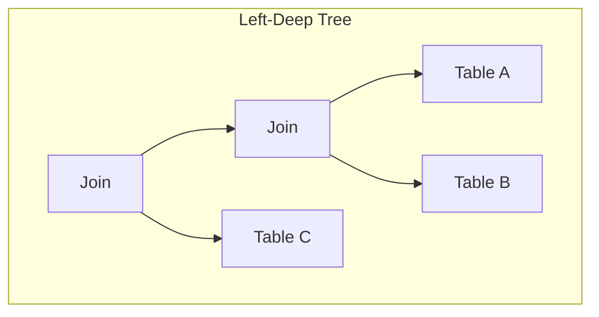

# Query Execution Plans Mastery

<Info>
**Module Duration**: 8-10 hours
**Difficulty**: Intermediate to Advanced
**Hands-On**: 20+ real-world query analysis exercises
**Outcome**: Read execution plans like a database internals engineer
</Info>

## Why Execution Plans Matter

**The Core Problem**: Your query is slow. But WHY?

Think of it this way: if your car is slow, you would not randomly replace parts until it gets faster. You would connect a diagnostic tool, read the telemetry, and find the specific bottleneck -- maybe the fuel injector is clogged, maybe the brakes are dragging. Execution plans are that diagnostic tool for databases. Without them, you are guessing. With them, you see exactly where time is being spent and why.

```sql
-- This query takes 5 seconds. What's wrong?
SELECT u.name, COUNT(o.id) as order_count
FROM users u
LEFT JOIN orders o ON u.id = o.user_id
WHERE u.created_at > '2024-01-01'
GROUP BY u.id, u.name
ORDER BY order_count DESC;

-- Without execution plans: Pure guesswork
-- - Add an index? Which column? (You might guess wrong and waste an hour)
-- - Rewrite the query? How? (You might make it worse)
-- - Increase memory? By how much? (Throwing hardware at a logic problem)

-- With execution plans: Surgical precision
-- - See exactly what's slow (Seq Scan on orders: 4.8s of the 5s total)
-- - Know the exact fix (Index on orders.user_id)
-- - Verify improvement (Now 50ms -- a 100x speedup from one index)
```

**What You'll Master**:
- Read and interpret every node type (Seq Scan, Index Scan, Hash Join, etc.)
- Identify performance bottlenecks instantly
- Understand cost calculations and row estimates
- Optimize queries systematically, not randomly
- Compare execution across PostgreSQL, MySQL, SQL Server

<Note>
This is not just EXPLAIN syntax. This is learning to **think like the query planner**, predict its decisions, and guide it to the fastest execution path.
</Note>

---

## Part 1: Execution Plan Fundamentals

### What is an Execution Plan?

An execution plan is the **step-by-step recipe** the database uses to execute your query. When you write SQL, you declare *what* you want -- not *how* to get it. The query planner figures out the "how," and the execution plan is its answer. Understanding execution plans means you stop guessing about performance and start *knowing*.

**Analogy: GPS Navigation**
```
Query (what you want):       "Get all orders for users created this year"
Execution Plan (how to get it):
1. Scan the users table, filter by created_at     (Scan + Filter)
2. For each matching user, look up their orders    (Join)
3. Count the orders per user                       (Aggregate)
4. Sort by the count descending                    (Sort)
5. Return the results                              (Output)

Just like GPS route planning:
- Different routes exist        (index scan vs sequential scan)
- Traffic changes the best route (data distribution matters)
- Faster roads cost more gas    (index lookups use random I/O)
- GPS re-evaluates with new data (planner uses updated statistics)
```

### The Two Commands: EXPLAIN vs EXPLAIN ANALYZE

```sql
-- EXPLAIN: Shows the PLAN only (does NOT execute the query)
-- Think of this as asking "what WOULD you do?" without actually doing it
EXPLAIN
SELECT * FROM users WHERE email = 'alice@example.com';

-- Output (estimated numbers only -- no actual execution):
Index Scan using users_email_idx on users  (cost=0.42..8.44 rows=1 width=40)
  Index Cond: (email = 'alice@example.com'::text)
-- ^ "cost" is an abstract unit (not milliseconds!)
-- ^ "rows=1" is the planner's ESTIMATE of how many rows will match

-- EXPLAIN ANALYZE: Shows PLAN + ACTUAL EXECUTION numbers
-- Think of this as "do it AND tell me what really happened"
EXPLAIN ANALYZE
SELECT * FROM users WHERE email = 'alice@example.com';

-- Output (estimated AND actual numbers side by side):
Index Scan using users_email_idx on users  (cost=0.42..8.44 rows=1 width=40)
                                            (actual time=0.025..0.027 rows=1 loops=1)
  Index Cond: (email = 'alice@example.com'::text)
Planning Time: 0.123 ms   -- Time the planner spent choosing this strategy
Execution Time: 0.052 ms  -- Time actually running the query
-- ^ The power move: compare "rows=1" (estimated) with "rows=1" (actual)
-- ^ When these diverge wildly, you have found the root cause of bad plans
```

**Key Differences**:

| Aspect | EXPLAIN | EXPLAIN ANALYZE |
|--------|---------|-----------------|
| **Executes query?** | ❌ No | ✅ Yes |
| **Shows actual times?** | ❌ No | ✅ Yes |
| **Shows actual rows?** | ❌ No | ✅ Yes |
| **Safe for production?** | ✅ Yes | ⚠️ Caution (runs query!) |
| **Use when** | Checking plan | Diagnosing slow query |

<Warning>
**EXPLAIN ANALYZE actually runs the query!**
For writes (INSERT/UPDATE/DELETE), wrap in transaction:
```sql
BEGIN;
EXPLAIN ANALYZE DELETE FROM huge_table WHERE ...;
ROLLBACK;  -- Prevent actual deletion -- the EXPLAIN still shows real numbers
```
This is not just theoretical risk. A developer once ran `EXPLAIN ANALYZE DELETE FROM orders` on production without a WHERE clause and without a transaction wrapper. The query executed, the explain output was printed, and 2 million orders were gone.
</Warning>

<Tip>
**The BUFFERS option is your secret weapon for production debugging.** Add it to see I/O behavior:
```sql
EXPLAIN (ANALYZE, BUFFERS)
SELECT * FROM users WHERE email = 'alice@example.com';
-- Now shows: Buffers: shared hit=3 read=1
-- "shared hit" = pages found in RAM (fast)
-- "shared read" = pages fetched from disk (slow)
-- High "read" count on first run that disappears on second = cold cache
-- High "read" count that persists = your working set exceeds available RAM
```
</Tip>

### Understanding the Output Format

```sql
EXPLAIN (FORMAT TEXT)  -- Default, human-readable tree
EXPLAIN (FORMAT JSON)  -- Programmatic parsing
EXPLAIN (FORMAT YAML)  -- Structured alternative
EXPLAIN (FORMAT XML)   -- For tool integration
```

**We'll use TEXT format** for learning (most common):

```
Nested Loop  (cost=0.00..1000.00 rows=100 width=50)
  ->  Seq Scan on users  (cost=0.00..100.00 rows=10 width=30)
        Filter: (created_at > '2024-01-01')
  ->  Index Scan on orders  (cost=0.42..80.00 rows=10 width=20)
        Index Cond: (user_id = users.id)
```

**Reading the Tree**:
```
- Top-level node (Nested Loop) executed LAST
- Indented nodes (children) executed FIRST
- Bottom-to-top execution flow
- Left-to-right for siblings at same level
```

---

## Part 2: Decoding the Numbers

### Cost Explained

```
Index Scan using users_pkey on users  (cost=0.42..8.44 rows=1 width=40)
                                            ^^^^    ^^^^
                                        startup cost  total cost
```

**What is "cost"?**
- **Not real time** (not milliseconds!) -- this is the single most common misconception about EXPLAIN output
- Abstract units based on I/O operations, like "points" in a game -- useful for comparison, not for predicting wall-clock time
- Default: 1 sequential page read = 1.0 cost (the baseline unit)
- Used to **compare** execution paths: the planner picks the plan with the lowest total cost

**Cost Components**:
```c
// PostgreSQL cost calculation (simplified)
cost = (pages_read * seq_page_cost) +
       (index_pages * random_page_cost) +
       (tuples_processed * cpu_tuple_cost) +
       (operators_applied * cpu_operator_cost)

// Default values (postgresql.conf):
seq_page_cost = 1.0          // Sequential disk read
random_page_cost = 4.0       // Random disk read (4x worse!)
cpu_tuple_cost = 0.01        // Process one row
cpu_operator_cost = 0.0025   // Apply one filter/operator
```

**Example Calculation**:
```sql
-- Table: 10,000 rows, 1,000 pages
-- Query: Sequential scan with filter

Seq Scan cost calculation:
= (1000 pages * 1.0 seq_page_cost) +     -- Read all pages
  (10000 rows * 0.01 cpu_tuple_cost) +   -- Process all rows
  (10000 * 0.0025 cpu_operator_cost)     -- Apply filter
= 1000 + 100 + 25
= 1125.00
```

### Startup Cost vs Total Cost

```
Sort  (cost=1000.00..1050.00 rows=100 width=50)
           ^^^^^^^^^ ^^^^^^^^
           startup   total
```

**Startup Cost**: Work before first row returned
- Useful for queries with LIMIT
- Matters for interactive applications

**Total Cost**: Complete execution
- What you care about for batch jobs

**Example**:
```sql
-- Sort has high startup (must collect all rows first)
EXPLAIN
SELECT * FROM users ORDER BY created_at LIMIT 10;

Sort  (cost=5000.00..5500.00 ...)  -- High startup
  ->  Seq Scan on users (cost=0.00..100.00 ...)

-- vs Index Scan (low startup, returns rows immediately)
EXPLAIN
SELECT * FROM users WHERE id = 5 LIMIT 10;

Index Scan (cost=0.42..8.44 ...)  -- Low startup, immediate results
```

### Row Estimates vs Actual Rows

```
Seq Scan on orders  (cost=0.00..1000.00 rows=50 width=100)
                                        ^^^^
                                    ESTIMATED rows

EXPLAIN ANALYZE output:
Seq Scan on orders  (cost=0.00..1000.00 rows=50 width=100)
                    (actual time=0.1..10.5 rows=5000 loops=1)
                                           ^^^^^^^^^
                                        ACTUAL rows (100x off!)
```

**Why Row Estimates Matter**:

This is arguably the single most important concept in execution plan analysis. Bad row estimates are the root cause of the majority of "the query was fast and suddenly became slow" incidents in production. Think of it like a GPS: if the GPS thinks a road has no traffic (bad estimate), it will route you through a tiny residential street. If it had accurate traffic data, it would choose the highway. The planner makes the same kind of routing mistakes when its row estimates are wrong.

```
Bad estimate (planner thinks 50 rows, actually 5000):
  ↓
Chooses wrong join method (Nested Loop instead of Hash Join)
  ↓
Slow query (10 seconds instead of 100ms)
```

**Common Causes of Bad Estimates**:
1. **Outdated statistics**: Run `ANALYZE`
2. **Correlated columns**: Planner assumes independence
3. **Complex WHERE conditions**: Planner guesses conservatively
4. **Functions in WHERE**: Planner can't estimate `WHERE lower(email) = ...`

**Fixing Bad Estimates**:
```sql
-- 1. Update statistics
ANALYZE users;

-- 2. Increase statistics target for important columns
ALTER TABLE users ALTER COLUMN email SET STATISTICS 1000;
ANALYZE users;

-- 3. Create expression index for function-based queries
CREATE INDEX users_lower_email_idx ON users(lower(email));

-- 4. Use extended statistics for correlated columns
CREATE STATISTICS users_city_state_stats (dependencies)
ON city, state FROM users;
ANALYZE users;
```

### Width

```
Seq Scan on users  (cost=0.00..100.00 rows=1000 width=40)
                                                 ^^^^^^^^
                                              Average row size in bytes
```

**What it means**:
- Average bytes per row returned
- Used for memory calculations (work_mem, hash tables)
- Includes only columns in SELECT

**Example**:
```sql
-- All columns
SELECT * FROM users;  -- width=200 (name + email + address + ...)

-- Specific columns
SELECT id, name FROM users;  -- width=40 (just id + name)
```

---

## Part 3: Scan Methods Deep Dive

### Sequential Scan (Seq Scan)

**When Used**: Reading most or all rows from a table. Beginners often panic when they see "Seq Scan" and immediately think "I need an index!" -- but a Seq Scan is frequently the *optimal* choice. The planner is smarter than you think.

```sql
EXPLAIN ANALYZE
SELECT * FROM users WHERE created_at > '2020-01-01';
-- Returns 95% of rows -- Seq Scan is the RIGHT call here

Seq Scan on users  (cost=0.00..1000.00 rows=9500 width=100)
                   (actual time=0.05..15.2 rows=9500 loops=1)
  Filter: (created_at > '2020-01-01'::date)
  Rows Removed by Filter: 500
-- ^ "Rows Removed by Filter: 500" tells you only 500 out of 10,000 rows
-- were discarded. The filter is not very selective -- most rows match.
-- This is precisely when Seq Scan is optimal.
```

**How It Works** -- think of it like reading a book cover to cover:
```
1. Read table pages sequentially from disk (page 1, page 2, page 3...)
2. For each page (typically 8KB):
   - Load into the shared buffer pool (RAM cache)
   - Examine every tuple (row) on the page
   - Apply the WHERE filter to each tuple
   - Return matching rows, discard non-matching ones
3. Continue until end of table -- no shortcuts, no skipping
```

**Performance Characteristics**:
```
Advantages:
+ Efficient for reading large % of table (>5-10% is the rough threshold)
+ Utilizes disk sequential read (HDDs read sequentially 50-100x faster than random)
+ No index maintenance overhead
+ Predictable performance -- it always reads the whole table, no surprises

Disadvantages:
- Reads entire table even if you only need 10 rows out of 10 million
- Slow for highly selective queries (WHERE matches <1% of rows)
- Cannot take advantage of ordering -- always reads in heap order
```

<Tip>
**A senior engineer would say:** "Seeing a Seq Scan is not a problem. Seeing a Seq Scan on a 100-million-row table that returns 3 rows -- *that* is a problem. The question is always: what percentage of the table does this query touch? If the answer is more than 5-10%, Seq Scan is usually optimal."
</Tip>

**Example - When Seq Scan is Optimal**:
```sql
-- Table: 1 million rows
-- Query returns 500k rows (50%)

-- Seq Scan: Read 1M rows, return 500k
Cost: 10,000 (sequential page reads)

-- Index Scan alternative: Access 500k rows via index
Cost: 500,000 * 4.0 (random page reads) = 2,000,000
      ↑ 200x worse!

Planner correctly chooses Seq Scan
```

### Index Scan

**When Used**: Reading specific rows via index. This is the "surgical strike" -- instead of reading the entire table, you use the B-tree index to jump directly to the rows you need. It is like using a book's index to find page 347 instead of reading all 500 pages.

```sql
CREATE INDEX users_email_idx ON users(email);

EXPLAIN ANALYZE
SELECT * FROM users WHERE email = 'alice@example.com';

Index Scan using users_email_idx on users
  (cost=0.42..8.44 rows=1 width=100)
  (actual time=0.025..0.027 rows=1 loops=1)
  Index Cond: (email = 'alice@example.com'::text)
-- ^ "Index Cond" means this filter was applied INSIDE the index.
-- Contrast this with "Filter" which is applied AFTER fetching from heap.
-- Index Cond = efficient. Filter under an Index Scan = less efficient.
```

**How It Works** -- two separate data structures are involved:
```
1. Search B-tree index for 'alice@example.com'
   (Descend through root -> internal nodes -> leaf node)
   (This is O(log N) -- for 10 million rows, only ~4 steps)
2. Find leaf node containing pointer (TID) to the heap tuple
   (The TID says "page 42, offset 7" -- the physical location)
3. Fetch that specific heap page and extract the row
   (This is the expensive part -- a random disk read)
4. Return the row

For multiple rows matching the index condition:
  Repeat steps 2-4 for each matching index entry.
  Each heap fetch is potentially a separate random I/O!
  This is why Index Scan degrades as selectivity decreases.
```

**Performance**:
```
Advantages:
+ Fast for selective queries (less than ~5% of table)
+ Returns rows in index order (ORDER BY on indexed column is free)
+ Only reads the pages it needs (not the entire table)

Disadvantages:
- Random I/O for heap fetches (each row may be on a different page)
- Two reads per row: one from index, one from heap
- Degrades quickly as you fetch more rows (100 random reads > 1 seq scan)
```

**Cost Breakdown**:
```sql
-- Startup cost (0.42):
-- Descending the B-tree (log N) -- typically 3-4 levels deep
-- For a 10M row table: root -> level 1 -> level 2 -> leaf = 4 page reads

-- Total cost (8.44):
-- Index page reads + Heap tuple fetch (the random I/O to get the actual row)
```

### Index Only Scan

**When Used**: When the index contains *all* the columns the query needs -- both the columns in WHERE and the columns in SELECT. This is called a **covering index**, and it is one of the most powerful performance optimizations available because it eliminates heap access entirely.

```sql
-- The index covers both the filter column (email) AND the output column (name)
CREATE INDEX users_email_name_idx ON users(email, name);

EXPLAIN ANALYZE
SELECT name FROM users WHERE email = 'alice@example.com';

Index Only Scan using users_email_name_idx on users
  (cost=0.42..4.44 rows=1 width=15)
  (actual time=0.015..0.016 rows=1 loops=1)
  Index Cond: (email = 'alice@example.com'::text)
  Heap Fetches: 0  -- THIS is the magic line. Zero heap access.
-- ^ Compare cost=4.44 here vs cost=8.44 for regular Index Scan.
-- ^ The entire answer came from the index alone.
```

**How It Works** -- the heap (table) is never touched:
```
1. Search B-tree index for 'alice@example.com'
2. Find the leaf node -- it contains BOTH email AND name
3. Read 'name' directly from the index leaf page
4. Return result immediately
   (No heap page fetch! No random I/O to the table!)

Why this matters at scale:
- 1 million lookups via Index Scan = 1 million random heap reads
- 1 million lookups via Index Only Scan = 0 heap reads
- On spinning disks, this is the difference between seconds and minutes
```

**Massive Performance Win**:
```
Index Scan:        Index read + Heap fetch = ~8.44 cost
Index Only Scan:   Index read only         = ~4.44 cost (nearly 2x faster)

At scale (10,000 lookups):
Index Scan:        10,000 heap fetches = potentially 10,000 random I/Os
Index Only Scan:   0 heap fetches = pure index traversal
```

<Tip>
**PostgreSQL 11+ added INCLUDE columns** to make covering indexes more practical without bloating the B-tree:
```sql
-- Instead of indexing both columns in the tree (which affects sort order):
CREATE INDEX ON users(email) INCLUDE (name);
-- 'name' is stored in the leaf pages but NOT in the tree structure.
-- This keeps the index smaller while still enabling Index Only Scans.
```
</Tip>

**Caveat - Visibility Map**:
```sql
Index Only Scan ... (Heap Fetches: 342)
                                   ^^^^
                                 Had to check heap for some rows

Why? This is a subtle but critical detail:
- PostgreSQL uses MVCC (Multi-Version Concurrency Control)
- The index does not know if a tuple is visible to YOUR transaction
- The visibility map tracks which pages have "all tuples visible to all"
- If a page has dead/old tuples, PostgreSQL MUST check the heap to verify visibility
- This is why Heap Fetches > 0 even with a covering index

Solution: VACUUM regularly (this is not optional for Index Only Scan performance)
VACUUM users;            -- Updates the visibility map
VACUUM (VERBOSE) users;  -- Shows how many pages became "all-visible"
-- After VACUUM, Heap Fetches should drop to 0 or near-0
-- If autovacuum is well-tuned, this happens automatically
```

<Warning>
**Production gotcha**: If you see an Index Only Scan with `Heap Fetches` close to the total row count, you are getting almost zero benefit from the covering index. The most common cause is a table with heavy UPDATE/DELETE activity and autovacuum falling behind. Check `pg_stat_user_tables.n_dead_tup` -- if dead tuples are a significant fraction of total tuples, autovacuum needs to be more aggressive.
</Warning>

### Bitmap Index Scan

**When Used**: The "middle ground" between Seq Scan and Index Scan. It shines when combining multiple indexes (BitmapAnd/BitmapOr) or fetching a moderate number of rows (too many for Index Scan's random I/O, too few to justify a full Seq Scan).

```sql
CREATE INDEX users_city_idx ON users(city);
CREATE INDEX users_age_idx ON users(age);

EXPLAIN ANALYZE
SELECT * FROM users WHERE city = 'NYC' AND age > 30;

Bitmap Heap Scan on users  (cost=100.00..500.00 rows=500)
  Recheck Cond: ((city = 'NYC') AND (age > 30))
  ->  BitmapAnd  (cost=100.00..100.00 rows=500)
        ->  Bitmap Index Scan on users_city_idx
        ->  Bitmap Index Scan on users_age_idx
```

**How It Works**:
```
1. Scan users_city_idx → Create bitmap of matching TIDs (tuple IDs)
   Bitmap: [page 5, page 12, page 23, ...]

2. Scan users_age_idx → Create second bitmap
   Bitmap: [page 3, page 12, page 45, ...]

3. AND bitmaps together
   Result: [page 12, ...] (pages in both bitmaps)

4. Sort pages by physical location
   [page 12] → Sequential access!

5. Fetch heap pages in sorted order
6. Recheck conditions (bitmap is lossy)
```

**Why Bitmap?**
```
Problem with regular Index Scan on multiple rows:
  - Fetches rows in index order
  - Random heap access
  - Slow

Bitmap solution:
  - Buffers TIDs in memory
  - Sorts by heap location
  - Sequential heap access
  - Much faster for moderate result sets (100-10000 rows)
```

**Bitmap vs Index Scan Decision**:
```
Few rows (<100):     Index Scan (direct access -- like looking up 3 books by call number)
Moderate (100-10k):  Bitmap Index Scan (sorted access -- like collecting a list of call numbers,
                       sorting them by shelf location, then walking through the library in order)
Many (>10k):         Seq Scan (read entire table -- like reading every book on the shelf
                       because you need most of them anyway)
```

<Tip>
**Practical diagnostic**: If you see a Bitmap Heap Scan with a high "Recheck Cond" count (close to the total rows returned), it means the bitmap lost precision and fell back to page-level granularity. This happens when work_mem is too small to hold the exact TID bitmap. The fix: increase work_mem for that query, or add a more selective composite index that reduces the result set.
</Tip>

---

## Part 4: Join Methods Explained

### Nested Loop Join

**Concept**: For each row in the outer table, scan the inner table for matches. This is the simplest join algorithm -- it is essentially two nested `for` loops. It is perfect when the outer table is tiny (1-100 rows) and the inner table has an index on the join key. It is catastrophic when both tables are large.

```sql
EXPLAIN ANALYZE
SELECT u.name, o.total
FROM users u
JOIN orders o ON u.id = o.user_id
WHERE u.id = 5;

Nested Loop  (cost=0.84..16.88 rows=1)
  ->  Index Scan on users u  (cost=0.42..8.44 rows=1)
        Index Cond: (id = 5)
  ->  Index Scan on orders o  (cost=0.42..8.44 rows=1)
        Index Cond: (user_id = 5)
```

**Pseudocode** -- notice the O(N * M) complexity hiding in these innocent loops:
```python
result = []
for outer_row in outer_table:  # users
    for inner_row in inner_table:  # orders
        if outer_row.id == inner_row.user_id:
            result.append((outer_row, inner_row))
return result
```

**Performance**:
```
Cost: O(outer_rows * inner_rows) per match

Best case: Inner table has index on join key
  - Index Scan for each outer row
  - Cost: outer_rows * index_lookup_cost

Worst case: No index on inner table
  - Seq Scan for EACH outer row
  - Cost: outer_rows * table_size
  - Catastrophic!
```

**When Optimal**:
```
✅ Small outer table (few rows)
✅ Index exists on inner table join key
✅ Selective WHERE clause on outer table

Example:
- Outer: 1 user (WHERE user_id = 5)
- Inner: Orders with index on user_id
- Result: 1 index lookup = Fast!
```

**When Terrible**:
```
❌ Large outer table
❌ No index on inner table
❌ Cartesian product (no join condition)

Example:
- Outer: 10,000 users
- Inner: 1 million orders, NO index
- Result: 10,000 table scans = Days!
```

### Hash Join

**Concept**: Build a hash table from the smaller table, then probe it with each row from the larger table. This is the workhorse join for large datasets without useful indexes. It runs in O(N + M) time -- linear -- which is dramatically better than Nested Loop's O(N * M). The trade-off is memory: the hash table must fit in `work_mem`, or it spills to disk and performance degrades.

```sql
EXPLAIN ANALYZE
SELECT u.name, o.total
FROM users u
JOIN orders o ON u.id = o.user_id;

Hash Join  (cost=500.00..5000.00 rows=10000)
  Hash Cond: (o.user_id = u.id)
  ->  Seq Scan on orders o  (cost=0.00..2000.00 rows=100000)
  ->  Hash  (cost=100.00..100.00 rows=10000)
        ->  Seq Scan on users u  (cost=0.00..100.00 rows=10000)
```

**Algorithm**:
```python
# Phase 1: Build hash table (smaller table)
hash_table = {}
for row in users:
    hash_table[row.id] = row

# Phase 2: Probe (larger table)
result = []
for row in orders:
    if row.user_id in hash_table:
        result.append((hash_table[row.user_id], row))
return result
```

**Performance**:
```
Build phase:   O(smaller_table_rows)
Probe phase:   O(larger_table_rows)
Total:         O(N + M) - Linear!

Memory requirement:
  Hash table size ≈ smaller_table_rows * average_row_width
  Must fit in work_mem (default 4MB)
```

**When Optimal**:
```
✅ Large tables without indexes
✅ Equi-joins (=, not <, >, !=)
✅ Smaller table fits in work_mem
✅ Both tables scanned anyway (no indexes help)

Example:
- 10,000 users × 100,000 orders
- Build hash on users (smaller)
- Probe with orders
- Time: Seconds (vs hours with Nested Loop)
```

**Memory Spills** -- one of the most common and fixable performance problems in production:
```sql
Hash Join  (...) (actual time=1000..5000 ...)
  Buckets: 16384  Batches: 4  Memory Usage: 8192kB
                          ^
                    Spilled to disk! (work_mem too small)

When hash table > work_mem:
  - Splits into batches (partitions the data into chunks)
  - Writes batches to temp files on disk
  - Reads them back later for probing
  - Slower (disk I/O adds 5-10x overhead compared to in-memory)

Fix: Increase work_mem
SET work_mem = '256MB';
```

<Warning>
**The work_mem multiplication trap**: `work_mem` is allocated per sort or hash operation, per query, per connection. A single complex query with 3 hash joins uses 3x work_mem. If you have 50 concurrent connections running such queries, that is `50 * 3 * 256MB = 37.5GB` of RAM just for hash operations. Always calculate the worst-case total before changing this globally. For specific expensive queries, use `SET LOCAL work_mem = '256MB'` inside a transaction instead of changing the global setting.
</Warning>

### Merge Join

**Concept**: Sort both inputs by the join key, then walk through both in lockstep -- exactly like the "merge" step of merge sort. This is the most memory-efficient join for large datasets because it processes rows in a streaming fashion without building a hash table. It is optimal when both inputs are already sorted (from indexes) and when the query also needs sorted output (ORDER BY on the join key).

```sql
EXPLAIN ANALYZE
SELECT u.name, o.total
FROM users u
JOIN orders o ON u.id = o.user_id
ORDER BY u.id;

Merge Join  (cost=2000.00..3000.00 rows=10000)
  Merge Cond: (u.id = o.user_id)
  ->  Index Scan using users_pkey on users u
  ->  Sort  (cost=1500.00..1750.00 rows=100000)
        Sort Key: o.user_id
        ->  Seq Scan on orders o
```

**Algorithm**:
```python
# Both inputs sorted by join key
users_sorted = sorted(users, key=lambda r: r.id)
orders_sorted = sorted(orders, key=lambda r: r.user_id)

i, j = 0, 0
result = []
while i < len(users_sorted) and j < len(orders_sorted):
    if users_sorted[i].id == orders_sorted[j].user_id:
        result.append((users_sorted[i], orders_sorted[j]))
        j += 1
    elif users_sorted[i].id < orders_sorted[j].user_id:
        i += 1
    else:
        j += 1
return result
```

**Performance**:
```
Best case: Both inputs pre-sorted (indexes)
  Cost: O(N + M) - Linear scan

Worst case: Must sort both inputs
  Cost: O(N log N + M log M + N + M)
  Still better than Nested Loop for large datasets
```

**When Optimal**:
```
✅ Both inputs already sorted (indexes on join keys)
✅ Query includes ORDER BY on join key
✅ Large datasets (competitive with Hash Join)

Example:
SELECT * FROM users u
JOIN orders o ON u.id = o.user_id
ORDER BY u.id;

- users has primary key on id (sorted)
- orders has index on user_id (sorted)
- Merge join reads both in order
- Result already sorted for ORDER BY
- No additional sort step needed!
```

### Join Method Comparison

```
┌──────────────────────────────────────────────────────────────────────────┐
│                    JOIN METHOD DECISION TREE                             │
├──────────────────────────────────────────────────────────────────────────┤
│                                                                          │
│  Small outer table (<100 rows) + Index on inner?                        │
│     YES → NESTED LOOP                                                    │
│                                                                          │
│  Both inputs pre-sorted?                                                 │
│     YES → MERGE JOIN                                                     │
│                                                                          │
│  Smaller table fits in work_mem?                                        │
│     YES → HASH JOIN                                                      │
│     NO  → MERGE JOIN (or increase work_mem)                             │
│                                                                          │
│  Very large datasets (billions of rows)?                                 │
│     → MERGE JOIN (most stable memory usage)                             │
│                                                                          │
└──────────────────────────────────────────────────────────────────────────┘
```

### Advanced Join Internals

#### Hash Join: Memory & Partitioning
When the build-side relation exceeds `work_mem`, PostgreSQL uses **Hybrid Hash Join**:
1.  **Partitioning**: Both relations are partitioned into $2^k$ batches based on the hash key.
2.  **Batch Processing**: Batch 0 is processed in memory. Batches 1..N are spilled to temporary files.
3.  **Recursive Processing**: Each batch is then loaded and hashed. If a batch is still too large, it is partitioned again.

*Performance Tip*: If you see `Batches: > 1` in `EXPLAIN ANALYZE`, increasing `work_mem` can convert the join to a single-pass in-memory operation, often yielding a 5-10x speedup.

#### Merge Join: The Power of Index-Only Merges
Merge Join is the only algorithm that can return rows in a sorted order without an explicit sort step if the underlying indexes support it.
```sql
-- Query benefitting from Merge Join
SELECT * FROM orders o 
JOIN order_items i ON o.id = i.order_id 
ORDER BY o.id;
-- Planner uses Merge Join + Index Scan on both sides.
-- No Sort nodes in the plan!
```

**Real-World Example**:
```sql
-- Same query, different row counts

-- Scenario 1: 10 users, 100 orders
Nested Loop  ← Optimal (few outer rows, indexed inner)

-- Scenario 2: 10K users, 100K orders, no indexes
Hash Join    ← Optimal (linear time, fits in memory)

-- Scenario 3: 10M users, 100M orders
Merge Join   ← Optimal (stable memory, sorts needed anyway)
```

---

## Part 5: Aggregation & Sorting

### GROUP BY Execution

```sql
EXPLAIN ANALYZE
SELECT city, COUNT(*)
FROM users
GROUP BY city;

HashAggregate  (cost=1500.00..1550.00 rows=1000)
  Group Key: city
  ->  Seq Scan on users  (cost=0.00..1000.00 rows=10000)
```

**Two Methods**:

**1. HashAggregate** (default for unsorted input):
```python
# Build hash table
groups = {}
for row in users:
    if row.city not in groups:
        groups[row.city] = {'count': 0}
    groups[row.city]['count'] += 1

return groups.values()

# Memory: O(distinct_groups)
# Time: O(N)
```

**2. GroupAggregate** (for sorted input):
```python
# Input sorted by city
sorted_users = sorted(users, key=lambda r: r.city)

results = []
current_city = None
current_count = 0

for row in sorted_users:
    if row.city != current_city:
        if current_city:
            results.append({'city': current_city, 'count': current_count})
        current_city = row.city
        current_count = 1
    else:
        current_count += 1

return results

# Memory: O(1) - Streaming!
# Time: O(N)
```

**When Each is Used**:
```sql
-- HashAggregate (unsorted input)
SELECT city, COUNT(*) FROM users GROUP BY city;

-- GroupAggregate (sorted by index)
CREATE INDEX users_city_idx ON users(city);
SELECT city, COUNT(*) FROM users GROUP BY city;

GroupAggregate  (cost=0.00..500.00 rows=1000)
  Group Key: city
  ->  Index Only Scan using users_city_idx on users
        ↑ Already sorted!
```

**Memory Issues**:
```sql
-- Too many groups → HashAggregate spills to disk
HashAggregate  (Batches: 5  Memory Usage: 65536kB)
                     ^^^
                  Disk spills

-- Solution 1: Increase work_mem
SET work_mem = '256MB';

-- Solution 2: Force GroupAggregate with index
CREATE INDEX ON users(city);
-- Now planner uses sorted index scan
```

### Sorting

Sorting is one of the most expensive operations in query execution. Every Sort node in your execution plan is a potential performance cliff -- if the data fits in memory, it is fast; if it spills to disk, it can be 10-100x slower. Understanding the three sort methods PostgreSQL uses is essential for diagnosing slow queries.

```sql
EXPLAIN ANALYZE
SELECT * FROM users ORDER BY created_at DESC LIMIT 10;

Limit  (cost=500.00..500.02 rows=10)
  ->  Sort  (cost=500.00..525.00 rows=10000)
        Sort Key: created_at DESC
        Sort Method: top-N heapsort  Memory: 25kB   -- Only 25kB used!
        ->  Seq Scan on users  (cost=0.00..100.00 rows=10000)
-- ^ "top-N heapsort" is the smart sort: it only keeps the top 10 rows in memory
-- ^ instead of sorting all 10,000 rows. This is why LIMIT + ORDER BY can be fast
-- ^ even without an index -- if N is small enough.
```

**Sort Methods**:

**1. Quicksort** (general purpose):
```
Used when: Sorting all rows
Memory: All rows must fit in work_mem
Time: O(N log N)
```

**2. Top-N Heapsort** (for LIMIT):
```python
# Only keep top N rows in heap
heap = []
for row in users:
    if len(heap) < 10:
        heappush(heap, row)
    elif row.created_at > heap[0].created_at:
        heapreplace(heap, row)

return sorted(heap, reverse=True)

# Memory: O(N) where N = LIMIT
# Time: O(M log N) where M = total rows, N = LIMIT
```

**3. External Sort** (disk-based):
```
When: Data > work_mem
Process:
  1. Read work_mem chunks
  2. Sort each chunk
  3. Write to temp files
  4. Merge sorted chunks

Slow! Avoid by increasing work_mem
```

**Checking for Disk Sorts**:
```sql
EXPLAIN (ANALYZE, BUFFERS)
SELECT * FROM huge_table ORDER BY created_at;

Sort  (...) (actual time=5000..10000 ...)
  Sort Method: external merge  Disk: 204800kB
                    ^^^^^^^^^^^
                 Spilled to disk!

-- Fix:
SET work_mem = '512MB';
-- Now:
Sort Method: quicksort  Memory: 204800kB
                        ^^^
                     In-memory!
```

**Avoiding Sorts with Indexes**:
```sql
-- Without index: Full table sort
EXPLAIN SELECT * FROM users ORDER BY created_at;
Sort + Seq Scan

-- With index: No sort needed!
CREATE INDEX users_created_at_idx ON users(created_at);
EXPLAIN SELECT * FROM users ORDER BY created_at;
Index Scan using users_created_at_idx
  ↑ Returns rows in sorted order
```

---

## Part 6: Advanced Plan Analysis

This is where you graduate from "can read an execution plan" to "can diagnose production performance issues." The techniques in this section are what separate developers who add random indexes from engineers who solve performance problems in minutes.

### Nested Loops: Understanding the Multiplier Effect

```sql
EXPLAIN ANALYZE
SELECT *
FROM users u
JOIN orders o ON u.id = o.user_id
JOIN products p ON o.product_id = p.id;

Nested Loop  (cost=0.84..50000.00 rows=100)
             (actual time=0.1..2500.5 rows=100 loops=1)
  ->  Nested Loop  (cost=0.42..10000.00 rows=100)
                   (actual time=0.05..500.2 rows=100 loops=1)
        ->  Seq Scan on users u  (cost=0.00..100.00 rows=10)
                                (actual time=0.01..5.0 rows=10 loops=1)
              Filter: (active = true)
              Rows Removed by Filter: 90
        ->  Index Scan on orders o  (cost=0.42..980.00 rows=10)
                                    (actual time=0.02..48.0 rows=10 loops=10)
                                                                   ^^^^^^^^
                                                                Ran 10 times!
              Index Cond: (user_id = u.id)
  ->  Index Scan on products p  (cost=0.42..398.00 rows=1)
                                (actual time=0.01..20.0 rows=1 loops=100)
                                                                ^^^^^^^^
                                                             Ran 100 times!
        Index Cond: (id = o.product_id)
```

**Understanding `loops`**:
```
loops=1:   Operation ran once
loops=10:  Operation ran 10 times (once per outer row)
loops=100: Operation ran 100 times (once per combined outer rows)

Total cost = node_cost × loops

Example:
- Index Scan on products: cost=398 × loops=100
- Total: 39,800
- If planner expected loops=1 but actual=100 → 100x slower!
```

**Optimizing High-Loop Nested Joins**:
```sql
-- Problem: Inner scans repeated many times
Nested Loop (loops=10000)
  -> Large outer scan
  -> Index scan repeated 10000 times

-- Solution 1: Switch to Hash Join
SET enable_nestloop = off;
-- Forces planner to consider Hash Join

-- Solution 2: Better WHERE clause selectivity
WHERE users.active = true  -- Reduce outer rows
AND orders.status = 'pending'  -- Reduce inner rows per outer

-- Solution 3: Materialization
CREATE TEMP TABLE filtered_users AS
SELECT * FROM users WHERE active = true;

SELECT * FROM filtered_users u
JOIN orders o ON u.id = o.user_id;
-- Now outer is small → Fewer loops
```

### 6.2 Interpreting Buffers and WAL

Using `EXPLAIN (ANALYZE, BUFFERS)` reveals the I/O cost of your query.

```sql
EXPLAIN (ANALYZE, BUFFERS) SELECT * FROM large_table WHERE id = 123;
-- Output:
-- Index Scan using large_table_pkey on large_table (actual time=0.05..0.06 rows=1 loops=1)
--   Buffers: shared hit=4 read=1
```

-   **shared hit**: Pages found in the PostgreSQL Buffer Cache (Fast).
-   **shared read**: Pages read from the OS/Disk (Slow).
-   **shared dirtied**: Pages modified by this query.
-   **shared written**: Pages written to disk (checkpointer/bgwriter).

*Principal Observation*: A high `shared read` count on the first run that disappears on the second run indicates a "cold cache" problem. If `shared hit` is always high but the query is still slow, you are likely CPU-bound or facing lock contention.

### 6.3 Join Tree Shapes: Left-Deep vs. Bushy
PostgreSQL typically generates **Left-Deep Trees** because they are easier to optimize and allow for pipelined execution (Volcano model). 



However, for very large joins, a **Bushy Tree** (joining the results of two joins) might be more efficient, though the search space is much larger.

### Subquery Execution

```sql
-- Subquery in WHERE
EXPLAIN ANALYZE
SELECT * FROM users
WHERE id IN (SELECT user_id FROM orders WHERE total > 1000);

-- Three possible plans:

-- Plan A: Semi Join (efficient)
Hash Semi Join  (cost=500.00..1000.00 rows=100)
  Hash Cond: (users.id = orders.user_id)
  ->  Seq Scan on users
  ->  Hash
        ->  Seq Scan on orders
              Filter: (total > 1000)

-- Plan B: Subplan (inefficient)
Seq Scan on users  (cost=0.00..1000000.00 rows=100)
  Filter: (hashed SubPlan 1)
  SubPlan 1
    ->  Seq Scan on orders  (cost=0.00..500.00)
          Filter: (total > 1000)
          ↑ Subquery executed ONCE, results hashed

-- Plan C: Correlated Subplan (catastrophic)
Seq Scan on users  (cost=0.00..10000000.00 rows=100)
  Filter: (SubPlan 1)
  SubPlan 1
    ->  Seq Scan on orders  (cost=0.00..500.00 rows=1)
          Filter: ((user_id = users.id) AND (total > 1000))
          ↑ Subquery executed FOR EACH USER!
```

**Rewriting Correlated Subqueries**:
```sql
-- BAD: Correlated subquery
SELECT u.name
FROM users u
WHERE EXISTS (
    SELECT 1 FROM orders o
    WHERE o.user_id = u.id AND o.total > 1000
);
-- SubPlan executed once per user

-- GOOD: Semi Join
SELECT u.name
FROM users u
WHERE u.id IN (
    SELECT user_id FROM orders WHERE total > 1000
);
-- Hash Semi Join (single hash table)

-- BETTER: Explicit JOIN
SELECT DISTINCT u.name
FROM users u
JOIN orders o ON u.id = o.user_id
WHERE o.total > 1000;
-- Hash Join (most efficient)
```

### CTEs: Optimization Fence (Pre-PostgreSQL 12)

This is one of the most important version-dependent behaviors in PostgreSQL. If you are maintaining a system running PostgreSQL 11 or earlier, CTEs are a potential performance trap. If you are on PostgreSQL 12+, they are safe by default, but you should understand the mechanics for when you intentionally need materialization.

```sql
-- PostgreSQL 11 and earlier:
-- The CTE is ALWAYS materialized (computed once and stored in a temp table).
-- The outer query cannot push its WHERE clause into the CTE.
WITH expensive_cte AS (
    SELECT * FROM huge_table WHERE complex_condition
)
SELECT * FROM expensive_cte WHERE simple_condition;

-- Plan (PostgreSQL 11):
CTE Scan on expensive_cte
  Filter: simple_condition
  CTE expensive_cte
    ->  Seq Scan on huge_table
          Filter: complex_condition

-- Problem: CTE materialized BEFORE outer WHERE applied
-- Result: Processes ALL rows matching complex_condition, then filters by simple_condition
-- If complex_condition returns 10M rows but simple_condition would narrow it to 100,
-- you just did 100,000x more work than necessary.

-- PostgreSQL 12+: Inlines CTEs by default (the planner "sees through" the CTE)
Seq Scan on huge_table
  Filter: (complex_condition AND simple_condition)
  ↑ Optimized! Both filters applied together -- only matching rows are processed

-- Force materialization if you WANT the old behavior (useful when the CTE
-- is referenced multiple times and is expensive to compute):
WITH expensive_cte AS MATERIALIZED (...)
```

<Tip>
**When to deliberately use MATERIALIZED**: If a CTE is referenced in multiple places within the outer query and the planner is re-evaluating it each time. Materialization computes it once and reuses the result. Conversely, use `NOT MATERIALIZED` on PostgreSQL 12+ if you want to guarantee inlining (though this is the default).
</Tip>

---

## Part 7: Cross-Database Comparison

### PostgreSQL vs MySQL vs SQL Server

**Getting Execution Plans**:

```sql
-- PostgreSQL
EXPLAIN ANALYZE
SELECT ...;

-- MySQL
EXPLAIN FORMAT=JSON
SELECT ...;

-- SQL Server
SET STATISTICS IO ON;
SET STATISTICS TIME ON;
GO
SELECT ...;
GO
```

**Plan Output Format Comparison**:

**PostgreSQL** (Tree, bottom-up):
```
Nested Loop
  ->  Seq Scan on users
  ->  Index Scan on orders
```

**MySQL** (Table, top-down):
```json
{
  "query_block": {
    "select_id": 1,
    "nested_loop": [
      {"table": "users", "access_type": "ALL"},
      {"table": "orders", "access_type": "ref", "key": "user_id_idx"}
    ]
  }
}
```

**SQL Server** (Graphical + XML):
```xml
<ShowPlanXML>
  <QueryPlan>
    <RelOp NodeId="0" LogicalOp="Inner Join" PhysicalOp="Nested Loops">
      <RelOp NodeId="1" PhysicalOp="Clustered Index Scan">
        <Object Table="users" />
      </RelOp>
      <RelOp NodeId="2" PhysicalOp="Index Seek">
        <Object Table="orders" Index="IX_user_id" />
      </RelOp>
    </RelOp>
  </QueryPlan>
</ShowPlanXML>
```

### Scan Methods: Terminology Differences

| Concept | PostgreSQL | MySQL | SQL Server |
|---------|------------|-------|------------|
| Full table read | Seq Scan | Table Scan | Table Scan / Clustered Index Scan |
| Index-based read | Index Scan | Index Range Scan | Index Seek |
| Read index only | Index Only Scan | Covering Index | Index Seek (with includes) |
| Multiple index combo | Bitmap Index Scan | Index Merge | Index Intersection |

**Example: Finding via Index**

**PostgreSQL**:
```
Index Scan using users_email_idx on users
  Index Cond: (email = 'alice@example.com')
```

**MySQL**:
```json
{
  "table": "users",
  "access_type": "ref",
  "key": "users_email_idx",
  "key_len": "767",
  "rows_examined": 1
}
```

**SQL Server**:
```xml
<IndexSeek>
  <Object Database="mydb" Schema="dbo" Table="users" Index="IX_users_email"/>
  <SeekPredicates>
    <SeekKeys>
      <Prefix ScanType="EQ">
        <RangeColumns>
          <ColumnReference Column="email"/>
        </RangeColumns>
        <RangeExpressions>
          <ScalarOperator>
            <Const ConstValue="'alice@example.com'"/>
          </ScalarOperator>
        </RangeExpressions>
      </Prefix>
    </SeekKeys>
  </SeekPredicates>
</IndexSeek>
```

### Join Algorithms

**PostgreSQL**: Nested Loop, Hash Join, Merge Join

**MySQL**:
- Nested Loop Join (only method until MySQL 8.0.18)
- Hash Join (MySQL 8.0.18+)
- Block Nested Loop (optimization of Nested Loop)

**SQL Server**:
- Nested Loops
- Hash Match
- Merge Join
- Adaptive Join (SQL Server 2017+, chooses at runtime!)

**Example: Hash Join**

**PostgreSQL**:
```
Hash Join  (cost=500..1000 rows=100)
  Hash Cond: (o.user_id = u.id)
  ->  Seq Scan on orders o
  ->  Hash
        ->  Seq Scan on users u
```

**MySQL 8.0.18+**:
```json
{
  "query_block": {
    "nested_loop": [
      {
        "table": "u",
        "access_type": "ALL"
      },
      {
        "hash_join": {
          "access_type": "hash",
          "join_condition": "o.user_id = u.id",
          "table": "o"
        }
      }
    ]
  }
}
```

**SQL Server**:
```xml
<Hash Match HashKeysBuild="u.id" HashKeysProbe="o.user_id">
  <RelOp PhysicalOp="Table Scan">
    <Object Table="users" Alias="u"/>
  </RelOp>
  <RelOp PhysicalOp="Table Scan">
    <Object Table="orders" Alias="o"/>
  </RelOp>
</Hash Match>
```

### Cost Metrics

**PostgreSQL**:
```
cost=0.42..8.44
   ^^^^    ^^^
 startup  total
```
- Abstract units
- Based on page costs (seq_page_cost, random_page_cost)
- Relative comparison only

**MySQL**:
```json
{
  "cost_info": {
    "read_cost": "10.50",
    "eval_cost": "2.00",
    "prefix_cost": "12.50",
    "data_read_per_join": "8K"
  }
}
```
- Cost in "cost units" (not milliseconds)
- prefix_cost = cumulative cost
- Often inaccurate in older versions

**SQL Server**:
```xml
<RelOp EstimatedTotalSubtreeCost="0.0065" EstimatedCPUCost="0.0001" EstimatedIOCost="0.003">
```
- Breaks down CPU vs I/O
- More granular than PostgreSQL
- Shows actual vs estimated

### Actual Execution Stats

**PostgreSQL**:
```
EXPLAIN (ANALYZE, BUFFERS)
...
(actual time=0.025..0.027 rows=1 loops=1)
Buffers: shared hit=4 read=0
```
- `actual time`: milliseconds
- `Buffers`: shows cache hits vs disk reads

**MySQL**:
```sql
EXPLAIN FORMAT=TREE
SELECT ...;

-> Nested loop inner join
    -> Table scan on u (actual time=0.1..10.5 rows=100)
    -> Index lookup on o (actual time=0.01..0.02 rows=5)
```
- MySQL 8.0.18+ shows actual times in TREE format
- Older versions: No actual execution stats in EXPLAIN

**SQL Server**:
```sql
SET STATISTICS TIME ON;
SET STATISTICS IO ON;

SELECT ...;

-- Output:
SQL Server parse and compile time:
   CPU time = 0 ms, elapsed time = 1 ms.
SQL Server Execution Times:
   CPU time = 15 ms, elapsed time = 42 ms.

Table 'users'. Scan count 1, logical reads 5, physical reads 0.
Table 'orders'. Scan count 100, logical reads 500, physical reads 10.
```
- Separate timing output
- Detailed I/O stats per table

---

## Part 8: Hands-On Practice (20 Exercises)

### Exercise 1: Basic Scan Analysis

**Setup**:
```sql
CREATE TABLE products (
    id SERIAL PRIMARY KEY,
    name TEXT,
    category TEXT,
    price DECIMAL(10, 2),
    stock INT
);

INSERT INTO products
SELECT
    i,
    'Product ' || i,
    (ARRAY['Electronics', 'Clothing', 'Food'])[1 + mod(i, 3)],
    random() * 1000,
    floor(random() * 100)
FROM generate_series(1, 100000) i;
```

**Query**:
```sql
EXPLAIN ANALYZE
SELECT * FROM products WHERE price > 500;
```

**Questions**:
1. What scan method is used?
2. What's the estimated vs actual row count?
3. How many rows were filtered?
4. What's the execution time?

**Expected Answer**:
```
Seq Scan on products  (cost=0.00..2834.00 rows=50000 width=...)
                      (actual time=0.015..25.123 rows=49823 loops=1)
  Filter: (price > '500'::numeric)
  Rows Removed by Filter: 50177
Planning Time: 0.142 ms
Execution Time: 27.456 ms

Analysis:
1. Seq Scan (no index on price)
2. Estimate: 50,000 rows; Actual: 49,823 (very close!)
3. Filtered: 50,177 rows
4. Time: ~27ms
```

**Optimization Challenge**:
```sql
-- Add index
CREATE INDEX products_price_idx ON products(price);

-- Re-run
EXPLAIN ANALYZE
SELECT * FROM products WHERE price > 500;

-- Still Seq Scan! Why?
-- Answer: Query returns ~50% of rows
-- Seq Scan cheaper than 50,000 index lookups

-- Try more selective query:
EXPLAIN ANALYZE
SELECT * FROM products WHERE price > 900;

-- Now Index Scan!
Bitmap Heap Scan on products  (cost=542.84..2156.12 rows=9952)
  Recheck Cond: (price > '900'::numeric)
  ->  Bitmap Index Scan on products_price_idx
```

### Exercise 2: Join Method Investigation

**Setup**:
```sql
CREATE TABLE customers (
    id SERIAL PRIMARY KEY,
    name TEXT,
    city TEXT
);

CREATE TABLE orders (
    id SERIAL PRIMARY KEY,
    customer_id INT,
    order_date DATE,
    total DECIMAL(10, 2)
);

INSERT INTO customers
SELECT i, 'Customer ' || i, (ARRAY['NYC', 'LA', 'Chicago'])[1 + mod(i, 3)]
FROM generate_series(1, 10000) i;

INSERT INTO orders
SELECT
    i,
    1 + floor(random() * 10000)::INT,
    CURRENT_DATE - floor(random() * 365)::INT,
    random() * 1000
FROM generate_series(1, 100000) i;

ANALYZE customers, orders;
```

**Query 1: Small result set**:
```sql
EXPLAIN ANALYZE
SELECT c.name, o.total
FROM customers c
JOIN orders o ON c.id = o.customer_id
WHERE c.id = 42;
```

**Expected**:
```
Nested Loop  (cost=0.84..120.00 rows=10)
  ->  Index Scan using customers_pkey on customers c
        Index Cond: (id = 42)
  ->  Seq Scan on orders o
        Filter: (customer_id = 42)

Why Nested Loop?
- Outer: 1 row (highly selective)
- Inner: Sequential scan (no index on customer_id yet)
- Only scans orders once
```

**Optimization**:
```sql
CREATE INDEX orders_customer_id_idx ON orders(customer_id);

EXPLAIN ANALYZE
SELECT c.name, o.total
FROM customers c
JOIN orders o ON c.id = o.customer_id
WHERE c.id = 42;

-- Now:
Nested Loop  (cost=0.84..25.00 rows=10)
  ->  Index Scan using customers_pkey on customers c
  ->  Index Scan using orders_customer_id_idx on orders o
        Index Cond: (customer_id = 42)

-- Much faster! Index on inner relation
```

**Query 2: Large result set**:
```sql
EXPLAIN ANALYZE
SELECT c.name, COUNT(o.id)
FROM customers c
JOIN orders o ON c.id = o.customer_id
GROUP BY c.id, c.name;
```

**Expected**:
```
Hash Join  (cost=3000.00..8000.00 rows=10000)
  Hash Cond: (o.customer_id = c.id)
  ->  Seq Scan on orders o
  ->  Hash
        ->  Seq Scan on customers c

Why Hash Join?
- Large result set (all customers)
- Both tables fully scanned
- Hash Join optimal for this pattern
```

### Exercise 3: Aggregation Performance

**Query**:
```sql
EXPLAIN ANALYZE
SELECT category, AVG(price), COUNT(*)
FROM products
GROUP BY category;
```

**Without Index**:
```
HashAggregate  (cost=2834.00..2834.03 rows=3)
  Group Key: category
  ->  Seq Scan on products
```

**With Index**:
```sql
CREATE INDEX products_category_idx ON products(category);

EXPLAIN ANALYZE
SELECT category, AVG(price), COUNT(*)
FROM products
GROUP BY category;

-- Now:
GroupAggregate  (cost=0.42..5000.00 rows=3)
  Group Key: category
  ->  Index Only Scan using products_category_idx on products

-- Streaming aggregation (less memory)
```

### Exercise 4: Subquery Optimization

**Bad Query**:
```sql
EXPLAIN ANALYZE
SELECT name, price
FROM products
WHERE id IN (
    SELECT product_id
    FROM order_items
    WHERE quantity > 10
);
```

**If Subquery Correlated (bad)**:
```
Seq Scan on products
  Filter: (SubPlan 1)
  SubPlan 1
    ->  Seq Scan on order_items
          Filter: ((product_id = products.id) AND (quantity > 10))
-- Disaster! Subquery runs for EACH product
```

**Optimized (Semi Join)**:
```
Hash Semi Join  (cost=1000.00..2000.00 rows=500)
  Hash Cond: (products.id = order_items.product_id)
  ->  Seq Scan on products
  ->  Hash
        ->  Seq Scan on order_items
              Filter: (quantity > 10)
-- Single hash table, much faster
```

**Alternative Rewrite**:
```sql
SELECT DISTINCT p.name, p.price
FROM products p
JOIN order_items oi ON p.id = oi.product_id
WHERE oi.quantity > 10;

-- Hash Join (even better)
```

### Exercise 5: Sorting vs Index

**Query 1: Sort Required**:
```sql
EXPLAIN ANALYZE
SELECT * FROM products
ORDER BY price DESC
LIMIT 10;
```

**Without Index**:
```
Limit  (cost=5250.00..5250.03 rows=10)
  ->  Sort  (cost=5250.00..5500.00 rows=100000)
        Sort Key: price DESC
        Sort Method: top-N heapsort  Memory: 25kB
        ->  Seq Scan on products

-- Top-N heapsort (efficient for LIMIT)
-- Only keeps top 10 in memory
```

**With Index**:
```sql
CREATE INDEX products_price_desc_idx ON products(price DESC);

EXPLAIN ANALYZE
SELECT * FROM products
ORDER BY price DESC
LIMIT 10;

-- Now:
Limit  (cost=0.42..0.85 rows=10)
  ->  Index Scan using products_price_desc_idx on products

-- No sort needed! Index already sorted DESC
-- Just read first 10 entries
```

---

## Part 9: Production Debugging Scenarios

These scenarios are drawn from real-world production incidents. Each follows a pattern you will see repeatedly in your career: a query that was fast becomes slow, and the root cause is never what you first suspect. The diagnostic discipline here -- start with EXPLAIN ANALYZE, follow the data, resist the urge to guess -- is what separates a senior DBA from someone who restarts the database and hopes for the best.

### Scenario 1: Unexpectedly Slow Query

**Symptom**:
```sql
-- This query suddenly became slow (was fast last week)
SELECT * FROM orders WHERE status = 'pending';

-- Takes 30 seconds now (was 100ms before)
```

**Diagnosis**:
```sql
EXPLAIN ANALYZE
SELECT * FROM orders WHERE status = 'pending';

Seq Scan on orders  (cost=0.00..50000.00 rows=1000000)
                    (actual time=0.01..15234.56 rows=999500)
  Filter: (status = 'pending'::text)
  Rows Removed by Filter: 500

-- Problem: Index exists but not used!
-- Estimated 1,000,000 rows, actual 999,500 rows
```

**Root Cause**:
```sql
-- Check index
\d orders
-- Index "orders_status_idx" BTREE (status)

-- Check statistics
SELECT
    attname,
    n_distinct,
    most_common_vals,
    most_common_freqs
FROM pg_stats
WHERE tablename = 'orders' AND attname = 'status';

-- Result:
n_distinct: 3  (only 3 distinct values)
most_common_vals: {pending, completed, cancelled}
most_common_freqs: {0.9995, 0.0003, 0.0002}

-- Ah! "pending" is 99.95% of rows
-- Planner correctly chose Seq Scan (index would be slower)
```

**Why it Changed**:
```
Last week:
- 1M orders, 10K pending (1%) → Index Scan
- Fast!

This week:
- 1M orders, 999.5K pending (99.95%) → Seq Scan
- Slow (but optimal given data distribution)
```

**Solutions**:
```sql
-- Solution 1: Index on selective status
CREATE INDEX orders_completed_idx ON orders(id)
WHERE status = 'completed';

-- Now:
SELECT * FROM orders WHERE status = 'completed';
-- Uses partial index (fast)

SELECT * FROM orders WHERE status = 'pending';
-- Seq Scan (correct, most rows)

-- Solution 2: Partition table
CREATE TABLE orders_pending (LIKE orders);
CREATE TABLE orders_completed (LIKE orders);

-- Move old completed orders out of main table
```

### Scenario 2: Join Performance Regression

**Symptom**:
```sql
-- Join query degraded from 1s to 60s
SELECT u.name, COUNT(o.id)
FROM users u
LEFT JOIN orders o ON u.id = o.user_id
GROUP BY u.id, u.name;
```

**Diagnosis**:
```sql
EXPLAIN (ANALYZE, BUFFERS)
SELECT u.name, COUNT(o.id)
FROM users u
LEFT JOIN orders o ON u.id = o.user_id
GROUP BY u.id, u.name;

Hash Left Join  (cost=5000.00..100000.00 rows=10000)
                (actual time=1000..58234 rows=10000 loops=1)
  Hash Cond: (u.id = o.user_id)
  Buffers: shared hit=50000 read=150000
          ^^^^^^^^^^^^^^^^^^
       Massive disk reads!
  ->  Seq Scan on users u
  ->  Hash  (cost=3000.00..3000.00 rows=5000000)
            (actual time=50000..50000 rows=5000000 loops=1)
        Buckets: 32768  Batches: 64  Memory Usage: 4096kB
                                ^^^
                         Spilled to disk!
        ->  Seq Scan on orders o
```

**Root Cause**:
```
- Orders table grew from 1M to 5M rows
- Hash table > work_mem (4MB default)
- Spilled to disk in 64 batches
- Each batch: Read from disk, hash, probe
- Result: 60x slowdown
```

**Solution**:
```sql
-- Temporary fix: Increase work_mem for this session
SET work_mem = '256MB';

-- Verify:
EXPLAIN (ANALYZE, BUFFERS)
SELECT u.name, COUNT(o.id)
FROM users u
LEFT JOIN orders o ON u.id = o.user_id
GROUP BY u.id, u.name;

Hash Left Join  (...)
  Hash  (...)
        Buckets: 32768  Batches: 1  Memory Usage: 256000kB
                                ^
                          In-memory now!
-- Back to 1s execution time

-- Permanent fix: Increase globally
ALTER DATABASE mydb SET work_mem = '256MB';

-- OR: Index optimization
CREATE INDEX orders_user_id_covering_idx
ON orders(user_id) INCLUDE (id);

-- May allow Merge Join instead of Hash Join
```

### Scenario 3: Cardinality Mis-estimation

**Symptom**:
```sql
-- Query uses wrong join method
SELECT *
FROM products p
JOIN categories c ON p.category_id = c.id
WHERE p.price > 100 AND c.active = true;

-- Expected: Few rows
-- Actual: Takes forever
```

**Diagnosis**:
```sql
EXPLAIN ANALYZE
SELECT *
FROM products p
JOIN categories c ON p.category_id = c.id
WHERE p.price > 100 AND c.active = true;

Nested Loop  (cost=0.00..5000.00 rows=10)
             (actual time=0.1..15000.5 rows=50000 loops=1)
  ->  Seq Scan on categories c  (cost=0.00..10.00 rows=1)
                                (actual time=0.01..0.15 rows=5 loops=1)
        Filter: (active = true)
  ->  Index Scan on products p  (cost=0.42..490.00 rows=10)
                                (actual time=0.02..2800.0 rows=10000 loops=5)
                                                                     ^^^^^^^
                                                                  Ran 5 times!
        Index Cond: (category_id = c.id)
        Filter: (price > '100'::numeric)

-- Problem: Planner thought 10 rows, actually 50,000
-- Chose Nested Loop → Disaster (50K index scans)
```

**Root Cause**:
```sql
-- Check statistics
SELECT
    tablename,
    attname,
    n_distinct,
    correlation
FROM pg_stats
WHERE tablename = 'products' AND attname IN ('price', 'category_id');

-- price column:
n_distinct: 1000  (Actually 10,000 distinct values)
correlation: 0.1  (Outdated)

-- Statistics stale!
```

**Solution**:
```sql
-- Update statistics
ANALYZE products;

-- Increase statistics detail for important columns
ALTER TABLE products ALTER COLUMN price SET STATISTICS 1000;
ALTER TABLE products ALTER COLUMN category_id SET STATISTICS 1000;
ANALYZE products;

-- Re-run query:
Hash Join  (cost=1000.00..8000.00 rows=50000)
  Hash Cond: (p.category_id = c.id)
  ->  Seq Scan on products p
        Filter: (price > '100'::numeric)
  ->  Hash
        ->  Seq Scan on categories c
              Filter: (active = true)

-- Now chooses Hash Join (correct!)
-- Execution time: 1s (was 15s)
```

---

## Part 10: Best Practices & Checklist

### Pre-Production Query Review Checklist

```
Before deploying a new query to production:

□ Run EXPLAIN ANALYZE on production-sized data
  - Use realistic data volumes
  - Test with actual distribution (not uniform test data)

□ Check for Seq Scans on large tables
  - Acceptable if: Returns >5% of rows
  - Red flag if: Returns <1% of rows
  - Fix: Add appropriate index

□ Verify row estimates are reasonable
  - If actual/estimated > 10x: Run ANALYZE
  - If still off: Consider extended statistics

□ Check for memory spills
  - Look for "Batches > 1" in Hash nodes
  - Look for "external merge" in Sort nodes
  - Fix: Increase work_mem or reduce data

□ Look for high loop counts in joins
  - Nested Loop with loops=10000+ → Consider Hash Join
  - Fix: Add index or rewrite query

□ Validate ORDER BY optimization
  - Sort node present? Consider index
  - LIMIT present? Ensure Top-N heap sort

□ Test with concurrent load
  - Queries fast alone but slow under load?
  - May indicate lock contention or cache pressure

□ Set reasonable statement timeout
  SET statement_timeout = '30s';
  - Prevents runaway queries
```

### Performance Tuning Parameters

**work_mem** (per query, per operation) -- arguably the most impactful tuning knob:
```sql
-- Default: 4MB (often too small for analytical queries)
-- Affects: Hash joins, sorts, bitmap operations, window functions
-- NOT shared: each operation in each query in each connection gets its own allocation

-- Finding the right value -- evidence-based, not guessing:
-- 1. Run EXPLAIN (ANALYZE, BUFFERS) on your slow query
-- 2. Look for "Batches > 1" (Hash Join spill) or "external merge" (Sort spill)
-- 3. The "Disk:" size in a Sort node tells you how much memory was NEEDED
-- 4. Increase work_mem to slightly more than the reported disk usage

-- For a specific query (safest approach):
BEGIN;
SET LOCAL work_mem = '256MB';  -- Only affects this transaction
-- run your query here
COMMIT;

-- Per-role (good for reporting users that run heavy queries):
ALTER ROLE analytics_user SET work_mem = '256MB';

-- Globally (dangerous -- do the multiplication math first!):
ALTER DATABASE mydb SET work_mem = '64MB';

-- Caution: 10 concurrent queries × 5 hash joins each × 64MB = 3.2GB memory!
```

**effective_cache_size** (a hint to the planner, not a memory allocation):
```sql
-- This is one of the most misunderstood PostgreSQL settings.
-- It does NOT allocate any memory. It tells the planner:
-- "This is how much total cache (shared_buffers + OS page cache) is available."
-- The planner uses this to estimate the probability that a random page read
-- will hit cache (fast) vs. disk (slow). Higher values make the planner
-- more willing to choose Index Scans over Seq Scans.

-- Rule of thumb: 50-75% of total system RAM
-- On a 16GB RAM server:
ALTER SYSTEM SET effective_cache_size = '12GB';

-- Why this matters: with effective_cache_size = 64MB (the default on some systems),
-- the planner assumes almost every Index Scan page read hits disk (cost = 4.0).
-- With effective_cache_size = 12GB, the planner knows most reads will hit cache (cheap).
-- This single setting change can transform your plan from "Seq Scan on everything"
-- to "Index Scan where appropriate."
```

**random_page_cost** -- critical for SSD-based servers:
```sql
-- Default: 4.0 (calibrated for spinning disks where random reads are 4x slower than sequential)
-- For SSD: 1.1 - 1.5 (random ≈ sequential)

-- SSDs:
ALTER SYSTEM SET random_page_cost = 1.1;
SELECT pg_reload_conf();

-- Makes planner favor index scans on SSDs
```

**Statistics targets**:
```sql
-- Default: 100 (samples ~3000 rows)
-- For important columns: 1000+ (samples ~30,000 rows)

ALTER TABLE products ALTER COLUMN category_id SET STATISTICS 1000;
ANALYZE products;

-- Better histograms → Better estimates → Better plans
```

### Common Pitfalls

These pitfalls appear in almost every production database audit. If you fix nothing else after reading this module, fix these.

**1. OFFSET for pagination** -- the silent performance killer:
```sql
-- BAD: OFFSET scales linearly
-- Page 1: fast (skip 0 rows)
-- Page 100: slow (skip 999 rows)
-- Page 10000: catastrophic (skip 99,990 rows, discard them, return 10)
SELECT * FROM products
ORDER BY id
LIMIT 10 OFFSET 100000;
-- The database MUST scan 100,010 rows to return 10. There is no shortcut.

-- GOOD: Keyset pagination (also called cursor-based pagination)
-- Instead of "skip N rows," say "give me rows after this specific point"
SELECT * FROM products
WHERE id > 100000  -- "after" the last ID from the previous page
ORDER BY id
LIMIT 10;
-- The index seeks directly to id=100000 and returns the next 10 rows.
-- Constant time regardless of page number.
```

<Tip>
**Keyset pagination trade-off**: You cannot jump to an arbitrary page ("show me page 5,000"). Users must navigate sequentially. For most APIs and infinite-scroll UIs, this is perfectly fine. For admin dashboards that need "go to page X," consider a hybrid approach: use keyset pagination for the API but estimate total count with `SELECT reltuples FROM pg_class WHERE relname = 'products'` (approximate but instant) instead of `COUNT(*)` (exact but slow on large tables).
</Tip>

**2. OR in WHERE clause**:
```sql
-- BAD: Often forces Seq Scan
SELECT * FROM users
WHERE email = 'alice@example.com' OR phone = '555-1234';
-- Planner can't use indexes efficiently

-- GOOD: UNION ALL
SELECT * FROM users WHERE email = 'alice@example.com'
UNION ALL
SELECT * FROM users WHERE phone = '555-1234' AND email != 'alice@example.com';
-- Uses both indexes
```

**3. Function calls prevent index use** -- the "invisible Seq Scan" problem:
```sql
-- BAD: Can't use index on email because lower() wraps the column
-- The planner sees: "I have an index on email, but the query asks for lower(email).
-- Those are different things. I cannot use the index."
SELECT * FROM users WHERE lower(email) = 'alice@example.com';

-- GOOD: Expression index (index the RESULT of the function)
CREATE INDEX users_lower_email_idx ON users(lower(email));
-- Now the planner matches lower(email) in the query to lower(email) in the index.

-- ALTERNATIVE: Store the normalized value as a generated column (PostgreSQL 12+)
ALTER TABLE users ADD COLUMN email_lower TEXT
    GENERATED ALWAYS AS (lower(email)) STORED;
CREATE INDEX users_email_lower_idx ON users(email_lower);
-- Now queries can use the plain column without wrapping in lower()
```

<Warning>
**This pattern extends to all functions**: `WHERE YEAR(created_at) = 2024` cannot use an index on `created_at`. Rewrite as `WHERE created_at >= '2024-01-01' AND created_at < '2025-01-01'` to use a range scan. Similarly, `WHERE CAST(id AS TEXT) = '123'` cannot use an index on the integer `id` column. Match the data type to the column type.
</Warning>

---

## Summary

You've now mastered:
- Reading execution plans fluently -- you can look at EXPLAIN output and tell a story about what the database is doing and why
- Understanding cost calculations and row estimates -- and knowing that cost is not time, and that estimate vs. actual divergence is the root cause of most bad plans
- Identifying performance bottlenecks (scans, joins, sorts) -- and knowing which bottlenecks actually matter vs. which are optimal given the data
- Optimizing queries systematically -- following evidence from EXPLAIN ANALYZE rather than guessing
- Debugging production issues -- tracing a slow query from symptom to root cause to fix
- Cross-database plan comparisons (PostgreSQL, MySQL, SQL Server) -- so you can transfer this skill regardless of which engine your next job uses

**Key Takeaways** -- if you remember nothing else, remember these:
1. **Always EXPLAIN ANALYZE before optimizing** -- never guess when you can measure
2. **Row estimates are everything** -- when the planner's estimates are wrong, it picks the wrong strategy. Fix estimates with ANALYZE, extended statistics, or expression indexes
3. **Indexes are not magic** -- an index on the wrong column, or for a query that returns most of the table, makes things *slower*, not faster
4. **Join method depends on data size, not query complexity** -- small outer + indexed inner = Nested Loop; large tables without indexes = Hash Join; pre-sorted inputs = Merge Join
5. **Memory spills are the silent killer** -- if you see `Batches > 1` in a Hash Join or `external merge` in a Sort, your query is doing expensive disk I/O that work_mem tuning can eliminate
6. **Think like the planner** -- the planner is not adversarial; it is doing its best with the statistics you gave it. If it makes a bad choice, the fix is usually better statistics, not query hints

---

## Interview Deep-Dive

<AccordionGroup>
  <Accordion title="I am going to show you an EXPLAIN ANALYZE output. Walk me through what you see, identify the bottleneck, and propose a fix. The plan shows a Hash Join taking 45 seconds, where the inner Hash node shows Batches: 128 and the build input is a Seq Scan on a 50-million-row table.">
    **Strong Answer:**

    The first thing I notice is `Batches: 128` on the Hash node. Batches greater than 1 means the hash table exceeded `work_mem` and spilled to disk. With 128 batches, the join is doing 128 rounds of disk I/O -- reading from temp files, hashing, and probing. This is almost certainly the dominant cost in the 45-second execution.

    The build input is a Seq Scan on a 50-million-row table. If the average row width is roughly 200 bytes, the hash table needs approximately 10GB of memory. The default `work_mem` is 4MB. PostgreSQL is trying to fit 10GB into a 4MB bucket, forcing massive partitioning with potential recursive spilling.

    Before proposing a fix, I would check two things. First, does the query actually need all 50 million rows, or is there a missing WHERE clause that could reduce the build input? A Hash Join on the full table when you only need last 30 days of data is a query logic problem, not a tuning problem. Second, check `actual rows` versus `estimated rows` on the Seq Scan -- if the planner estimated 5,000 rows but got 50 million, it chose Hash Join based on a bad estimate. Running `ANALYZE` on that table might cause the planner to choose a Merge Join instead, which uses constant memory.

    If the query genuinely needs all 50 million rows, the fix is multi-pronged. First, increase `work_mem` for this specific query using `SET LOCAL work_mem = '2GB'` inside a transaction. Second, check whether the planner has the build and probe sides correct -- it should build the hash on the smaller input. Stale statistics may cause it to pick the wrong side. Third, create an index on the join key of the larger table so the planner can consider Merge Join or indexed Nested Loop.

    **Follow-up: You increase work_mem to 2GB and the query drops to 3 seconds. But this query runs from 200 concurrent API connections. Is the fix safe for production?**

    Not as a global setting. `200 connections * 2GB = 400GB` potential RAM consumption. The fix must be scoped: use `SET LOCAL` inside a transaction for just this query with a limited connection pool, refactor the query to reduce hash table size, or move it to a read replica with aggressive work_mem settings.
  </Accordion>

  <Accordion title="A query was fast last month but is now slow. EXPLAIN ANALYZE shows the planner chose a Nested Loop where it used to choose a Hash Join. Estimated rows on the outer table are 10, but actual rows are 500,000. What happened and how do you fix it?">
    **Strong Answer:**

    This is a textbook cardinality mis-estimation causing a plan regression. The planner chose Nested Loop because it estimated 10 outer rows -- at that cardinality, Nested Loop with index lookups on the inner table would be optimal. But the actual cardinality is 500,000, meaning the inner scan runs 500,000 times. Catastrophic performance.

    The root cause is almost always stale statistics. The data distribution changed but `ANALYZE` has not run recently enough. I would check: `SELECT last_analyze, last_autoanalyze FROM pg_stat_user_tables WHERE relname = 'the_table'`. If autovacuum has not analyzed the table recently, the planner is working with an outdated histogram.

    Immediate fix: run `ANALYZE the_table` manually. Re-run the query to confirm the plan switches back to Hash Join with correct estimates.

    The deeper question: why did autovacuum not keep up? The default `autovacuum_analyze_scale_factor` of 0.1 means ANALYZE triggers after 10% of the table changes. On a 50-million-row table, that is 5 million row changes before autoanalyze fires. Fix: `ALTER TABLE the_table SET (autovacuum_analyze_scale_factor = 0.01)` for more frequent statistics updates. Also increase the statistics target for critical columns: `ALTER TABLE the_table ALTER COLUMN the_column SET STATISTICS 1000`.

    The meta-lesson: plan regressions are usually data regressions. The query did not change -- the data did. Statistics are the bridge, and when that bridge is stale, plans break.

    **Follow-up: You ran ANALYZE and the plan is still wrong. Estimated rows are now 200 (closer but still far from 500,000). What next?**

    Likely correlated columns the planner treats as independent. If the WHERE clause is `WHERE city = 'NYC' AND state = 'NY'`, the planner multiplies independent selectivities. But city and state are highly correlated. Fix: `CREATE STATISTICS city_state_stats (dependencies) ON city, state FROM the_table; ANALYZE the_table;`. If extended statistics are insufficient, restructure the query to use a materializing subquery that gives the planner an accurate intermediate row count.
  </Accordion>

  <Accordion title="Explain the difference between an Index Scan, an Index Only Scan, and a Bitmap Index Scan. When would the planner choose each, and what practical steps can you take to push the planner toward Index Only Scans?">
    **Strong Answer:**

    These three methods represent a spectrum of how aggressively the database uses the index to avoid touching the heap.

    An **Index Scan** traverses the B-tree, finds matching entries, then fetches each corresponding row from the heap. Two-step: index lookup then heap fetch. Optimal for highly selective queries returning few rows where you need columns not in the index.

    An **Index Only Scan** returns results directly from index leaf pages without touching the heap. Only possible when the index covers ALL columns the query needs. The performance difference is dramatic -- zero heap fetches eliminates all random I/O. On 10,000 rows, that is zero reads versus 10,000.

    The caveat: PostgreSQL's MVCC requires visibility checks. The Visibility Map tells the Index Only Scan which pages have all-visible tuples. If VACUUM has not run recently, you see `Heap Fetches: N` in EXPLAIN output and performance degrades. Frequent VACUUM is critical for Index Only Scan.

    A **Bitmap Index Scan** builds a bitmap of matching TIDs, sorts them by physical page location, then fetches heap pages sequentially. This converts random I/O into sequential I/O. Optimal for moderate selectivity (100-10,000 rows) and combining multiple indexes with BitmapAnd/BitmapOr.

    To push toward Index Only Scans: (1) Create covering indexes using `INCLUDE` in PostgreSQL 11+: `CREATE INDEX ON orders(user_id) INCLUDE (total, status)`. (2) Run VACUUM frequently to keep the visibility map current. (3) Narrow SELECT clauses -- `SELECT *` almost never qualifies.

    **Follow-up: You create a covering index, but EXPLAIN still shows Index Scan, not Index Only Scan. The table was just VACUUMed. What could be wrong?**

    Three causes. First, the query uses a column not in the index -- even one uncovered column forces heap fetches. Second, expression mismatches: `WHERE lower(email) = 'x'` with an index on `email` cannot serve Index Only Scan. Third, concurrent writes may have invalidated the visibility map since VACUUM ran. Check `Heap Fetches` in EXPLAIN ANALYZE to distinguish between these cases.
  </Accordion>

  <Accordion title="Your team has a query that is 50ms in development but 30 seconds in production. The tables, indexes, and data are identical. Walk me through your debugging approach.">
    **Strong Answer:**

    This eliminates the most common causes, so the issue is environmental. My approach is systematic elimination.

    Step 1: **Compare execution plans.** Run `EXPLAIN (ANALYZE, BUFFERS)` on both environments and diff. Structural differences (different join types, scan types) mean planner configuration or statistics differ. Identical plans mean I/O or contention.

    Step 2: **Check configuration differences.** The impactful settings: `work_mem`, `effective_cache_size`, `random_page_cost` (if prod is SSD but set to 4.0, the planner overestimates index scan cost), and `shared_buffers`.

    Step 3: **Check buffer state.** Compare `shared hit` vs `shared read` in BUFFERS output. Development likely has warm cache; production may exceed `shared_buffers`. Run the query twice in production -- if the second run is fast, cold cache is the issue.

    Step 4: **Check lock contention.** Production has concurrent traffic. Query `pg_stat_activity` for blocking queries. If the query spends time waiting, the plan is irrelevant -- concurrency is the bottleneck.

    Step 5: **Check I/O saturation.** If a node reads 1,000 pages and takes 10 seconds, that is 10ms per page -- healthy SSDs serve under 0.1ms. This indicates I/O contention from checkpointing, WAL writing, or other queries.

    Step 6: **Check statistics freshness.** Even with identical data, if the dev copy was loaded via pg_dump without running ANALYZE, histograms differ.

    Most commonly: cold cache plus concurrent load. Fix: tune `shared_buffers` (25% of RAM), set `effective_cache_size` (50-75% of RAM), and consider `pg_prewarm` for critical tables after restarts.

    **Follow-up: Plans are identical but production has 200x more shared reads. Dataset is 50GB, shared_buffers is 1GB. Increase to 50GB?**

    No. The OS filesystem cache also caches pages. Setting shared_buffers to 50GB leaves no room for OS cache or work_mem allocations, and dramatically increases checkpoint time. Set shared_buffers to 25% of RAM (16GB on a 64GB server). Set `effective_cache_size` to 50-75% of RAM to inform the planner about total available cache. The 50ms dev timing was a warm-cache artifact.
  </Accordion>

  <Accordion title="Explain how PostgreSQL decides between Nested Loop, Hash Join, and Merge Join. Then describe a real scenario where you would force the planner to change its strategy.">
    **Strong Answer:**

    The planner evaluates all three and picks the lowest estimated cost based on: row counts, available indexes, sort order, and work_mem.

    **Nested Loop**: O(outer * log N) with an index. Chosen when outer input is small and inner has an index on the join key. Best for selective lookups.

    **Hash Join**: O(N + M) linear time. Chosen when both inputs are large, no useful index, and smaller table fits in work_mem. The workhorse for equi-joins.

    **Merge Join**: O(N + M) with constant memory. Chosen when inputs are pre-sorted or sort is needed for ORDER BY. Never spills to disk regardless of input size. Requires sorted inputs.

    Real scenario: a reporting query joined 2-million-row `transactions` with 50-row `accounts`. The planner chose Hash Join because stale statistics showed 5,000 rows in `accounts`. With 50 actual rows, Nested Loop with an index would be 40x faster. I ran `ANALYZE accounts` and the planner immediately switched -- no need to disable join methods.

    I avoid `SET enable_hashjoin = off` in production because it is a global override that affects all queries. The correct fix is always better information: accurate statistics, correct cost parameters, or query restructuring.

    **Follow-up: A colleague suggests pg_hint_plan to force join order in production. Your opinion?**

    Against it for most cases. Hints bypass the planner's self-adapting cost model. Today's hint based on current data distribution may be catastrophic next month. Fix the root cause instead: bad statistics, misconfigured costs, or query structure.

    The narrow exception: stable data warehouse queries with well-understood data shapes where the planner consistently makes suboptimal choices. There, hints are pragmatic -- but must be documented, monitored, and revisited quarterly.
  </Accordion>
</AccordionGroup>

---

## What's Next?

<Card
  title="Query Engine Deep Dive"
  icon="microchip"
  href="/courses/database-engineering/query-engine-deep-dive"
>
  Go deeper: Learn how PostgreSQL's planner actually works internally
</Card>

<Card
  title="Performance Engineering"
  icon="gauge-high"
  href="/courses/database-engineering/performance-engineering"
>
  Apply execution plan knowledge to real-world performance tuning
</Card>
