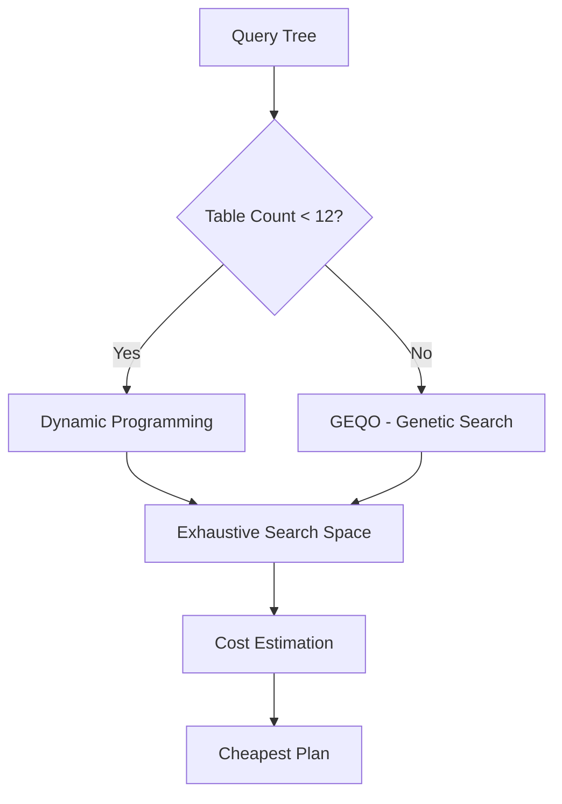

# Module 8: Query Processing Pipeline

Understanding how PostgreSQL processes queries is essential for optimization and OSS contribution. This module traces the complete journey from SQL text to result set.

**Real-world analogy:** The query processing pipeline is like a restaurant kitchen. Your SQL query is the customer's order. The parser is the waiter who writes down the order in a structured format. The analyzer checks that the dishes exist on the menu and resolves any ambiguity ("the special" becomes "grilled salmon"). The rewriter applies house rules ("all burgers come with fries" is like view expansion). The planner is the head chef deciding the most efficient sequence to prepare the meal. And the executor is the kitchen staff actually cooking and plating the dishes.

<Info>
**Estimated Time**: 12-14 hours  
**Difficulty**: Advanced  
**OSS Relevance**: High — core source code areas  
**Interview Value**: Senior/Staff level deep dives
</Info>

---

## 8.1 Query Processing Overview

<Frame>
  
</Frame>

```
┌─────────────────────────────────────────────────────────────────────────────┐
│                    QUERY PROCESSING PIPELINE                                 │
├─────────────────────────────────────────────────────────────────────────────┤
│                                                                              │
│   "SELECT name FROM users WHERE id = 5"                                     │
│                        │                                                     │
│                        ▼                                                     │
│   ┌─────────────────────────────────────┐                                   │
│   │            1. PARSER                │  src/backend/parser/              │
│   │   • Lexical analysis (scan.l)      │                                   │
│   │   • Syntax analysis (gram.y)       │                                   │
│   │   → Raw parse tree                 │                                   │
│   └─────────────────┬───────────────────┘                                   │
│                     ▼                                                        │
│   ┌─────────────────────────────────────┐                                   │
│   │           2. ANALYZER               │  src/backend/parser/analyze.c    │
│   │   • Semantic analysis              │                                   │
│   │   • Name resolution                │                                   │
│   │   • Type checking                  │                                   │
│   │   → Query tree                     │                                   │
│   └─────────────────┬───────────────────┘                                   │
│                     ▼                                                        │
│   ┌─────────────────────────────────────┐                                   │
│   │           3. REWRITER               │  src/backend/rewrite/            │
│   │   • View expansion                 │                                   │
│   │   • Rule processing                │                                   │
│   │   → Rewritten query tree(s)        │                                   │
│   └─────────────────┬───────────────────┘                                   │
│                     ▼                                                        │
│   ┌─────────────────────────────────────┐                                   │
│   │           4. PLANNER                │  src/backend/optimizer/          │
│   │   • Generate possible paths        │                                   │
│   │   • Cost estimation                │                                   │
│   │   • Select cheapest plan           │                                   │
│   │   → Plan tree                      │                                   │
│   └─────────────────┬───────────────────┘                                   │
│                     ▼                                                        │
│   ┌─────────────────────────────────────┐                                   │
│   │           5. EXECUTOR               │  src/backend/executor/           │
│   │   • Initialize plan nodes          │                                   │
│   │   • Pipeline execution             │                                   │
│   │   • Tuple processing               │                                   │
│   │   → Result tuples                  │                                   │
│   └─────────────────────────────────────┘                                   │
│                                                                              │
└─────────────────────────────────────────────────────────────────────────────┘
```

---

## 8.2 The Parser

### Lexical Analysis (Lexer)

The lexer (`scan.l`) breaks SQL text into tokens.

```sql
-- Input SQL
SELECT name, email FROM users WHERE age > 21;

-- Tokens produced:
SELECT     → keyword
name       → identifier
,          → punctuation
email      → identifier
FROM       → keyword
users      → identifier
WHERE      → keyword
age        → identifier
>          → operator
21         → integer constant
;          → punctuation
```

### Syntax Analysis (Parser)

The parser (`gram.y`) builds a **raw parse tree** from tokens.

```c
/* Simplified view of parse tree node types */
typedef enum NodeTag {
    T_SelectStmt,
    T_RangeVar,      /* Table reference */
    T_ColumnRef,     /* Column reference */
    T_A_Expr,        /* Expression */
    T_A_Const,       /* Constant value */
    /* ... hundreds more */
} NodeTag;

/* Example: SELECT statement structure */
typedef struct SelectStmt {
    NodeTag     type;
    List       *targetList;     /* columns to select */
    List       *fromClause;     /* FROM clause tables */
    Node       *whereClause;    /* WHERE conditions */
    List       *groupClause;    /* GROUP BY */
    Node       *havingClause;   /* HAVING */
    List       *sortClause;     /* ORDER BY */
    Node       *limitCount;     /* LIMIT */
    /* ... */
} SelectStmt;
```

### Parse Tree Visualization

```sql
-- Query: SELECT name FROM users WHERE id = 5

-- Raw Parse Tree:
SelectStmt
├── targetList
│   └── ResTarget
│       └── ColumnRef(name)
├── fromClause
│   └── RangeVar(users)
└── whereClause
    └── A_Expr(=)
        ├── ColumnRef(id)
        └── A_Const(5)
```

---

## 8.3 The Analyzer

The analyzer performs **semantic analysis** -- converting the raw parse tree to a **Query tree** with resolved references. While the parser only checks that the SQL is grammatically valid (correct syntax), the analyzer checks that it actually makes sense: Do the referenced tables exist? Do the columns belong to those tables? Are the data types compatible?

**Practical tip:** Most SQL errors that developers encounter in daily work are caught at the analyzer stage, not the parser. "Column not found," "operator does not exist," and "ambiguous column reference" are all analyzer errors. Understanding this distinction helps when reading PostgreSQL error messages -- parser errors mean broken syntax, analyzer errors mean semantically invalid (but syntactically correct) SQL.

### Key Tasks

<Tabs>
  <Tab title="Name Resolution">
    ```sql
    -- Query
    SELECT u.name FROM users u WHERE u.id = 5;
    
    -- Analyzer resolves:
    -- • "users" → pg_class OID 16384
    -- • "u" → alias for users
    -- • "name" → column attnum 2 of users
    -- • "id" → column attnum 1 of users
    ```
  </Tab>
  
  <Tab title="Type Checking">
    ```sql
    -- Analyzer checks type compatibility
    SELECT * FROM users WHERE name = 123;
    -- Error: operator does not exist: text = integer
    
    -- Or applies implicit casts
    SELECT * FROM users WHERE id = '5';
    -- Implicitly casts '5' to integer
    ```
  </Tab>
  
  <Tab title="Function Resolution">
    ```sql
    -- Analyzer finds correct function
    SELECT length(name) FROM users;
    -- Resolves: length(text) → int4
    -- OID: pg_proc entry
    
    -- Handles overloading
    SELECT abs(-5);      -- abs(int) → int
    SELECT abs(-5.5);    -- abs(float8) → float8
    ```
  </Tab>
</Tabs>

### Query Tree Structure

```c
/* The analyzed query representation */
typedef struct Query {
    NodeTag     type;
    CmdType     commandType;    /* SELECT, INSERT, UPDATE, DELETE */
    
    List       *rtable;         /* Range table (list of RangeTblEntry) */
    FromExpr   *jointree;       /* JOIN tree */
    List       *targetList;     /* Target list (list of TargetEntry) */
    
    Node       *quals;          /* WHERE clause */
    List       *groupClause;    /* GROUP BY */
    Node       *havingClause;   /* HAVING */
    List       *sortClause;     /* ORDER BY */
    
    /* ... many more fields */
} Query;
```

---

## 8.4 The Rewriter

The rewriter transforms query trees based on **rules** -- primarily for view expansion. This is a relatively thin stage for most queries, but it is architecturally important because it is the mechanism that makes views work transparently.

**Practical tip:** The rewriter is also the reason that a query against a view and the equivalent query against the base table produce identical execution plans. There is no performance penalty for using views -- by the time the planner sees the query, the view has already been inlined. The exception is materialized views, which skip the rewriter entirely and read from their own stored table.

### View Expansion

```sql
-- Create a view
CREATE VIEW active_users AS
    SELECT * FROM users WHERE status = 'active';

-- Query the view
SELECT name FROM active_users WHERE age > 21;

-- Rewriter expands to:
SELECT name FROM users WHERE status = 'active' AND age > 21;
```

### Rule System

```sql
-- Views are implemented as SELECT rules
-- pg_rewrite stores:
CREATE RULE "_RETURN" AS
    ON SELECT TO active_users DO INSTEAD
    SELECT * FROM users WHERE status = 'active';

-- INSTEAD OF rules for updatable views
CREATE RULE update_active AS
    ON UPDATE TO active_users DO INSTEAD
    UPDATE users SET name = NEW.name WHERE id = OLD.id;
```

---

## 8.5 The Planner/Optimizer

The most complex component — generates an efficient **execution plan**.

### CBO vs. RBO: The Architectural Shift

Modern databases primarily use **Cost-Based Optimization (CBO)**, but understanding **Rule-Based Optimization (RBO)** is essential for legacy systems and specific query rewrites.

| Feature | Rule-Based (RBO) | Cost-Based (CBO) |
| :--- | :--- | :--- |
| **Logic** | Fixed hierarchy of rules (e.g., "Always use Index if available") | Evaluates multiple paths based on statistics |
| **Data Awareness** | No knowledge of data distribution or size | Deeply aware of row counts, histograms, and I/O costs |
| **Flexibility** | Predictable but often suboptimal | Adaptive and finds complex optimizations |
| **Performance** | Fast planning, potentially slow execution | Slower planning (search space), faster execution |

PostgreSQL is a pure **CBO** engine. It uses statistics (from `ANALYZE`) to calculate the "cost" of various execution strategies.

### The Three Stages of Planning

1.  **Preprocessing (Simplification)**:
    - **Expression Simplification**: Constant folding (e.g., `2+2` becomes `4`).
    - **Subquery Flattening**: Converting `IN (SELECT ...)` to semi-joins or inner joins when possible.
    - **Predicate Pushdown**: Moving filters as deep as possible into the plan tree.

2.  **Path Generation & Join Ordering**:
    - The planner generates **Paths** (access methods like SeqScan, IndexScan, BitmapScan).
    - It uses **Dynamic Programming** to find the cheapest join order for up to `geqo_threshold` tables (default 12).
    - **Genetic Query Optimizer (GEQO)**: For complex queries with many joins, PostgreSQL switches to a heuristic (genetic) algorithm to prevent the search space from exploding factorially ($N!$).

3.  **Costing & Selection**:
    - Every path is assigned a cost based on:
        - `seq_page_cost`: Cost of a sequential page read.
        - `random_page_cost`: Cost of a random page read (critical for HDD vs SSD tuning).
        - `cpu_tuple_cost`: Processing overhead per row.
    - The cheapest path is converted into a **Plan Tree**.

### Join Planning Internals


```mermaid
graph TD
    A[Query Tree] --> B{Table Count < 12?}
    B -- Yes --> C[Dynamic Programming]
    B -- No --> D[GEQO - Genetic Search]
    C --> E[Exhaustive Search Space]
    D --> E
    E --> F[Cost Estimation]
    F --> G[Cheapest Plan]
```

### Cost Model Tuning
```sql
-- Key cost parameters (postgresql.conf)
seq_page_cost = 1.0          -- Sequential page fetch
random_page_cost = 4.0       -- Random page fetch (default)
-- SSD optimization: Set random_page_cost to 1.1 or 1.0
```

### Path vs Plan

**Real-world analogy:** Think of Paths as flight itinerary options and Plans as your boarding pass. When you search for flights from NYC to Tokyo, the system generates dozens of Paths: direct flights, one-stop via LAX, two-stop via London and Singapore. Each Path has an estimated cost (price + time). You compare them and pick the cheapest. That chosen Path is then converted into a Plan -- the actual boarding pass with gate numbers, seat assignments, and departure times that the airline will execute.

```c
/*
 * Path = one possible access strategy with an estimated cost.
 * The planner generates MANY Paths for each relation and join,
 * then picks the cheapest. Paths are lightweight -- they store
 * just enough information to compare costs.
 */
typedef struct Path {
    NodeTag     type;
    RelOptInfo *parent;         /* The relation this path is for */
    Cost        startup_cost;   /* Cost before first tuple (matters for LIMIT) */
    Cost        total_cost;     /* Total cost to return all rows */
    double      rows;           /* Estimated rows this path produces */
    /* ... */
} Path;

/*
 * Plan = the chosen Path converted into executable instructions.
 * Only ONE Plan is created from the winning Path. Plans are heavier
 * than Paths because they include targetlists, qual expressions,
 * and left/right subtrees for the executor to traverse.
 */
typedef struct Plan {
    NodeTag     type;
    Cost        startup_cost;
    Cost        total_cost;
    double      plan_rows;
    int         plan_width;     /* Avg tuple width in bytes (for memory estimation) */
    List       *targetlist;     /* Columns to output */
    List       *qual;           /* Filter conditions to apply at this node */
    struct Plan *lefttree;      /* Left child (outer side of a join) */
    struct Plan *righttree;     /* Right child (inner side of a join) */
    /* ... */
} Plan;
```

---

## 8.6 The Executor

The executor runs the plan tree, producing result tuples.

**Real-world analogy:** The Volcano model works like a vending machine chain. The top node (say, a Sort) asks the node below it (a Filter) for the next item. The Filter in turn asks the node below it (a SeqScan) for the next item. Each node only does work when asked by the node above it. This "demand-driven" or "pull-based" approach means that a LIMIT 10 query can stop the entire pipeline after 10 rows -- the lower nodes never even produce the remaining rows. It is inherently lazy, and that laziness is a major performance advantage.

**Practical tip:** The Volcano model also explains why Sort and HashAggregate nodes are "pipeline breakers" -- they cannot emit their first output tuple until they have consumed all input tuples. A Sort must see every row before it can tell you which one comes first. When you see high startup cost in EXPLAIN output, it usually indicates a pipeline breaker. This is why adding ORDER BY to a query that already has LIMIT can dramatically change performance characteristics.

### Execution Model

PostgreSQL uses **iterator (volcano) model** -- each node is an iterator.

```c
/* Every plan node implements three functions */
typedef struct PlanState {
    NodeTag     type;
    Plan       *plan;           /* Associated Plan node */
    
    /* Methods */
    ExecInitNode   /* Initialize node state */
    ExecProcNode   /* Get next tuple (iterator) */
    ExecEndNode    /* Clean up */
    
    /* State */
    TupleTableSlot *ps_ResultTupleSlot;
    /* ... */
} PlanState;
```

### Pull-Based Execution

```
┌─────────────────────────────────────────────────────────────────────────────┐
│                      ITERATOR (VOLCANO) MODEL                                │
├─────────────────────────────────────────────────────────────────────────────┤
│                                                                              │
│   SELECT name FROM users WHERE age > 21 ORDER BY name;                      │
│                                                                              │
│                    ┌───────────────┐                                         │
│                    │     Sort      │ ← Client calls for next tuple          │
│                    │   (on name)   │                                         │
│                    └───────┬───────┘                                         │
│                            │ pull                                            │
│                            ▼                                                 │
│                    ┌───────────────┐                                         │
│                    │    Filter     │                                         │
│                    │  (age > 21)   │                                         │
│                    └───────┬───────┘                                         │
│                            │ pull                                            │
│                            ▼                                                 │
│                    ┌───────────────┐                                         │
│                    │   Seq Scan    │                                         │
│                    │   (users)     │                                         │
│                    └───────────────┘                                         │
│                                                                              │
│   Execution flow:                                                            │
│   1. Sort requests tuple from Filter                                        │
│   2. Filter requests tuple from SeqScan                                     │
│   3. SeqScan reads row, returns to Filter                                   │
│   4. Filter checks age > 21, passes/skips                                   │
│   5. Sort buffers all tuples, sorts, returns                                │
│                                                                              │
└─────────────────────────────────────────────────────────────────────────────┘
```

### Plan Node Types

| Node Type | Description | Example |
|-----------|-------------|---------|
| **SeqScan** | Full table scan | `Seq Scan on users` |
| **IndexScan** | Scan using index | `Index Scan using users_pkey` |
| **BitmapHeapScan** | Bitmap index scan | Multiple indexes combined |
| **NestLoop** | Nested loop join | Small outer, any inner |
| **HashJoin** | Hash join | Equality joins |
| **MergeJoin** | Merge join | Pre-sorted inputs |
| **Sort** | Sort tuples | ORDER BY |
| **Aggregate** | Aggregation | GROUP BY, COUNT, SUM |
| **Limit** | Limit rows | LIMIT/OFFSET |

---

## 8.7 Expression Evaluation & JIT

### Expression Evaluation

```sql
-- Expression: (price * quantity) * (1 - discount)
-- Becomes expression tree:

         OpExpr(*)
         /      \
    OpExpr(*)   OpExpr(-)
    /     \     /      \
price   qty  Const(1)  discount
```

### JIT Compilation

PostgreSQL can JIT-compile expressions using LLVM for better performance. Instead of interpreting the expression tree node by node at runtime, JIT converts frequently evaluated expressions into native machine code -- the same optimization that makes Java's HotSpot or JavaScript's V8 fast for hot loops.

**Practical tip:** JIT is not free. The compilation step itself takes time (typically 10-100ms), so it only pays off for queries that process many rows through complex expressions. This is why PostgreSQL gates JIT behind cost thresholds -- for a simple `SELECT * FROM users WHERE id = 5`, JIT compilation would take longer than just running the query. The default thresholds are tuned for OLAP workloads; for pure OLTP, you can safely leave JIT at its default settings or even disable it entirely with `SET jit = off` to avoid the overhead.

```sql
-- Enable JIT (on by default in PostgreSQL 12+)
SET jit = on;
SET jit_above_cost = 100000;       -- Only JIT-compile if plan cost exceeds this
SET jit_inline_above_cost = 500000;  -- Inline function calls if cost exceeds this
SET jit_optimize_above_cost = 500000; -- Apply LLVM optimization passes above this

-- Check if JIT was used in your query
EXPLAIN (ANALYZE, VERBOSE) SELECT ...;
-- Look for: JIT: Functions: 4, Options: Inlining true, Optimization true
-- "Generation Time" and "Optimization Time" show JIT overhead
-- If these are a significant fraction of total time, JIT is hurting, not helping
```

---

## 8.8 Practical: Trace Query Execution

### Using Debug Output

**Practical tip:** These debug settings produce enormous amounts of output. Never enable them on a production server -- they are strictly for development builds. On a local development instance, they are invaluable for understanding exactly how much time the parser, planner, and executor each consume for a given query.

```sql
-- Enable detailed logging (DEVELOPMENT ONLY -- never on production)
SET client_min_messages = DEBUG5;  -- Show all debug messages to the client
SET log_parser_stats = on;         -- Log parser timing and memory usage
SET log_planner_stats = on;        -- Log planner timing and memory usage
SET log_executor_stats = on;       -- Log executor timing and memory usage

-- Run query and check logs for per-stage breakdowns
SELECT * FROM users WHERE id = 1;
-- You will see output like:
-- LOG: PARSER STATISTICS: 0.000 s elapsed, 0.000 s user, 0.000 s system
-- LOG: PLANNER STATISTICS: 0.001 s elapsed ...
-- LOG: EXECUTOR STATISTICS: 0.002 s elapsed ...
```

### Examining Parse Trees

```sql
-- See raw parse tree (requires debug build or extension)
-- The pg_query extension wraps libpg_query, a standalone parser library
-- extracted from PostgreSQL. It lets you inspect parse trees without
-- a debug build of the server.

CREATE EXTENSION pg_query;
SELECT pg_query_tree('SELECT * FROM users WHERE id = 1');
-- Returns a JSON representation of the raw parse tree

-- For fingerprinting (grouping structurally identical queries):
-- pg_stat_statements normalizes queries by replacing constants with $N
-- parameters, so "WHERE id = 5" and "WHERE id = 42" are treated as
-- the same query shape.
```

### Interview Questions

<AccordionGroup>
  <Accordion title="Q: What happens when you run SELECT * FROM users?">
    **Expected Answer**:
    1. **Parser**: Tokenizes SQL, validates syntax, creates raw parse tree
    2. **Analyzer**: Resolves `users` to table OID, `*` to column list, type checks
    3. **Rewriter**: Expands if `users` is a view
    4. **Planner**: Considers SeqScan vs IndexScan, estimates costs, picks cheapest
    5. **Executor**: Initializes SeqScan node, iterates through heap pages, returns tuples
  </Accordion>
  
  <Accordion title="Q: Why might the planner choose a sequential scan over an index scan?">
    **Expected Answer**:
    - Table is small (index overhead not worth it)
    - Query returns large % of rows (random I/O worse than sequential)
    - Statistics are stale (run ANALYZE)
    - Index isn't usable (function on column, wrong operator class)
    - `enable_indexscan = off` (diagnostic only!)
  </Accordion>
  
  <Accordion title="Q: Explain the difference between Path and Plan in PostgreSQL">
    **Expected Answer**:
    - **Path**: Represents a possible access strategy with estimated cost
    - Multiple paths generated for each relation (seq scan, index scans, etc.)
    - Paths are compared by cost to find the cheapest
    - **Plan**: The chosen path converted to executable form
    - Plan has actual operator implementation details
    - Only one plan is executed
  </Accordion>
</AccordionGroup>

---

## 8.9 OSS Contribution: Source Code Areas

### Key Files to Study

```
src/backend/parser/
├── scan.l          # Lexer (flex input)
├── gram.y          # Parser (bison input)  
├── analyze.c       # Semantic analysis
└── parse_*.c       # Type checking, function resolution

src/backend/optimizer/
├── path/           # Path generation
│   ├── allpaths.c  # Main path generation
│   ├── indxpath.c  # Index paths
│   └── joinpath.c  # Join paths
├── plan/           # Plan creation
│   ├── createplan.c
│   └── planner.c   # Main planner entry
├── prep/           # Query preprocessing
└── util/           # Cost estimation (costsize.c)

src/backend/executor/
├── execMain.c      # Executor entry point
├── execProcnode.c  # Node dispatch
├── nodeSeqscan.c   # Sequential scan
├── nodeIndexscan.c # Index scan
└── nodeHash*.c     # Hash join
```

---

## Next Module

<Card title="Module 9: PostgreSQL Architecture" icon="arrow-right" href="/courses/database-engineering/architecture">
  Understand the complete PostgreSQL system architecture
</Card>

---

## Interview Deep-Dive

<AccordionGroup>
  <Accordion title="The PostgreSQL planner chose a Nested Loop Join for a query that should obviously use a Hash Join. What went wrong and how do you investigate?">
    **Strong Answer:**

    - The most likely cause is a cardinality mis-estimate. The planner chose Nested Loop because it estimated the outer side would return a small number of rows (say 10), making Nested Loop efficient -- O(10 * log m) with an index on the inner side. But the actual outer side returned 100,000 rows, turning the Nested Loop into O(100,000 * log m) when a Hash Join at O(n + m) would have been far cheaper.
    - Investigation: run `EXPLAIN ANALYZE` and compare `estimated rows` vs `actual rows` at every node. The problematic node is where the estimate diverges from reality. Common causes: stale statistics (run ANALYZE), correlated columns that the planner assumes are independent (use extended statistics: `CREATE STATISTICS`), skewed data distribution, or a function call that prevents the planner from estimating selectivity.
    - Fix hierarchy: (1) `ANALYZE` the table. (2) Increase `default_statistics_target` or per-column targets. (3) Create extended statistics for correlated columns. (4) As a last resort, use `SET enable_nestloop = off` for the session, but document why and file a ticket for a permanent fix.

    **Follow-up: What are extended statistics and when do they help?**

    PostgreSQL assumes columns are statistically independent. If your table has columns city and zip_code that are strongly correlated (knowing the city tells you the zip range), the planner will dramatically underestimate `WHERE city = 'NYC' AND zip_code = '10001'` because it multiplies the individual selectivities. `CREATE STATISTICS stats_city_zip (dependencies, ndistinct) ON city, zip_code FROM addresses` tells the planner about this correlation, fixing the estimate.
  </Accordion>

  <Accordion title="How does PostgreSQL's cost-based optimizer estimate the cost of an Index Scan vs a Sequential Scan, and when does it get the decision wrong?">
    **Strong Answer:**

    - The planner uses a cost model with several key parameters: `seq_page_cost` (cost of reading one page sequentially, default 1.0), `random_page_cost` (cost of reading a random page, default 4.0), `cpu_tuple_cost` (CPU cost of processing one tuple), and `cpu_index_tuple_cost` (CPU cost of processing one index entry).
    - For a Sequential Scan: cost = number_of_pages * seq_page_cost + number_of_rows * cpu_tuple_cost. It reads every page sequentially and checks every row against the filter.
    - For an Index Scan: cost = index_pages * random_page_cost + matching_index_entries * cpu_index_tuple_cost + matching_rows * random_page_cost (for heap fetches) + matching_rows * cpu_tuple_cost. The random_page_cost reflects that index and heap fetches are random I/O.
    - The decision goes wrong in two common scenarios: (1) On SSDs, random reads are nearly as fast as sequential reads, but the default `random_page_cost = 4.0` was calibrated for spinning disks. The planner overestimates index scan cost and chooses Seq Scan. Fix: set `random_page_cost = 1.1` for SSD. (2) When most of the table is cached in shared_buffers or OS cache, disk I/O cost is irrelevant but the planner does not know what is cached. `effective_cache_size` is a hint but imprecise.

    **Follow-up: How does the planner decide the selectivity of a WHERE clause predicate?**

    The planner uses histograms and MCV (Most Common Values) lists stored in pg_statistic. For an equality predicate like `WHERE status = 'active'`, it checks if 'active' appears in the MCV list and uses its frequency directly. For values not in the MCV list, it assumes uniform distribution among the remaining fraction. For range predicates, it interpolates within histogram buckets. This is why ANALYZE is critical -- without fresh statistics, the planner is estimating based on stale or default assumptions (default selectivity for unknown predicates is typically 0.5% for equality, which can be wildly wrong).
  </Accordion>

  <Accordion title="Explain JIT compilation in PostgreSQL. When does it help, when does it hurt, and how do you control it?">
    **Strong Answer:**

    - JIT (Just-In-Time compilation, added in PostgreSQL 11) uses LLVM to compile query expressions and tuple deforming into native machine code at runtime. Instead of interpreting expression evaluation (walk a tree of function pointers for each tuple), the JIT compiler generates a specialized function that evaluates the entire expression in a tight loop.
    - When it helps: analytical queries that process millions of rows through complex expressions, aggregations, or WHERE clauses. The per-tuple overhead reduction compounds over millions of iterations. A SUM over 100M rows with a complex CASE expression can see 2-5x speedup.
    - When it hurts: short OLTP queries where the JIT compilation time (typically 5-50ms) exceeds the total execution time. If your query runs in 2ms, spending 20ms compiling it is a net loss. Also, the first execution of a prepared statement pays the JIT cost, creating a latency spike.
    - Control: `jit = on/off` (global toggle), `jit_above_cost = 100000` (only JIT queries with estimated cost above this threshold), `jit_inline_above_cost = 500000` (enable function inlining above this cost), `jit_optimize_above_cost = 500000` (enable LLVM optimizations above this cost). For OLTP workloads, I set `jit_above_cost` high (500000+) to ensure only truly expensive analytical queries trigger JIT. For dedicated analytics instances, lower thresholds are appropriate.

    **Follow-up: Can you disable JIT for specific queries without a global setting change?**

    Yes. `SET LOCAL jit = off;` within a transaction disables JIT for that transaction only. Or use `SET jit_above_cost = 1000000000;` to effectively disable it by setting an unreachably high threshold. This is the approach I use for OLTP connection pools where individual query latency matters more than throughput.
  </Accordion>
</AccordionGroup>
