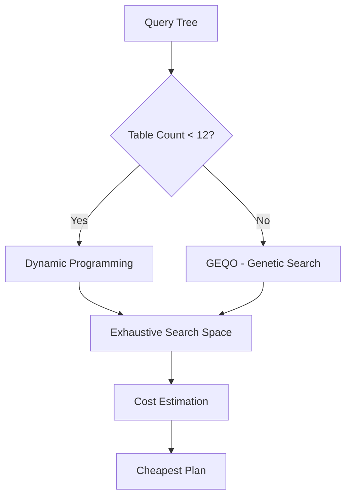

# Module 8: Query Processing Pipeline

Understanding how PostgreSQL processes queries is essential for optimization and OSS contribution. This module traces the complete journey from SQL text to result set.

<Info>
**Estimated Time**: 12-14 hours  
**Difficulty**: Advanced  
**OSS Relevance**: High — core source code areas  
**Interview Value**: Senior/Staff level deep dives
</Info>

---

## 8.1 Query Processing Overview

<Frame>
  
</Frame>

```
┌─────────────────────────────────────────────────────────────────────────────┐
│                    QUERY PROCESSING PIPELINE                                 │
├─────────────────────────────────────────────────────────────────────────────┤
│                                                                              │
│   "SELECT name FROM users WHERE id = 5"                                     │
│                        │                                                     │
│                        ▼                                                     │
│   ┌─────────────────────────────────────┐                                   │
│   │            1. PARSER                │  src/backend/parser/              │
│   │   • Lexical analysis (scan.l)      │                                   │
│   │   • Syntax analysis (gram.y)       │                                   │
│   │   → Raw parse tree                 │                                   │
│   └─────────────────┬───────────────────┘                                   │
│                     ▼                                                        │
│   ┌─────────────────────────────────────┐                                   │
│   │           2. ANALYZER               │  src/backend/parser/analyze.c    │
│   │   • Semantic analysis              │                                   │
│   │   • Name resolution                │                                   │
│   │   • Type checking                  │                                   │
│   │   → Query tree                     │                                   │
│   └─────────────────┬───────────────────┘                                   │
│                     ▼                                                        │
│   ┌─────────────────────────────────────┐                                   │
│   │           3. REWRITER               │  src/backend/rewrite/            │
│   │   • View expansion                 │                                   │
│   │   • Rule processing                │                                   │
│   │   → Rewritten query tree(s)        │                                   │
│   └─────────────────┬───────────────────┘                                   │
│                     ▼                                                        │
│   ┌─────────────────────────────────────┐                                   │
│   │           4. PLANNER                │  src/backend/optimizer/          │
│   │   • Generate possible paths        │                                   │
│   │   • Cost estimation                │                                   │
│   │   • Select cheapest plan           │                                   │
│   │   → Plan tree                      │                                   │
│   └─────────────────┬───────────────────┘                                   │
│                     ▼                                                        │
│   ┌─────────────────────────────────────┐                                   │
│   │           5. EXECUTOR               │  src/backend/executor/           │
│   │   • Initialize plan nodes          │                                   │
│   │   • Pipeline execution             │                                   │
│   │   • Tuple processing               │                                   │
│   │   → Result tuples                  │                                   │
│   └─────────────────────────────────────┘                                   │
│                                                                              │
└─────────────────────────────────────────────────────────────────────────────┘
```

---

## 8.2 The Parser

### Lexical Analysis (Lexer)

The lexer (`scan.l`) breaks SQL text into tokens.

```sql
-- Input SQL
SELECT name, email FROM users WHERE age > 21;

-- Tokens produced:
SELECT     → keyword
name       → identifier
,          → punctuation
email      → identifier
FROM       → keyword
users      → identifier
WHERE      → keyword
age        → identifier
>          → operator
21         → integer constant
;          → punctuation
```

### Syntax Analysis (Parser)

The parser (`gram.y`) builds a **raw parse tree** from tokens.

```c
/* Simplified view of parse tree node types */
typedef enum NodeTag {
    T_SelectStmt,
    T_RangeVar,      /* Table reference */
    T_ColumnRef,     /* Column reference */
    T_A_Expr,        /* Expression */
    T_A_Const,       /* Constant value */
    /* ... hundreds more */
} NodeTag;

/* Example: SELECT statement structure */
typedef struct SelectStmt {
    NodeTag     type;
    List       *targetList;     /* columns to select */
    List       *fromClause;     /* FROM clause tables */
    Node       *whereClause;    /* WHERE conditions */
    List       *groupClause;    /* GROUP BY */
    Node       *havingClause;   /* HAVING */
    List       *sortClause;     /* ORDER BY */
    Node       *limitCount;     /* LIMIT */
    /* ... */
} SelectStmt;
```

### Parse Tree Visualization

```sql
-- Query: SELECT name FROM users WHERE id = 5

-- Raw Parse Tree:
SelectStmt
├── targetList
│   └── ResTarget
│       └── ColumnRef(name)
├── fromClause
│   └── RangeVar(users)
└── whereClause
    └── A_Expr(=)
        ├── ColumnRef(id)
        └── A_Const(5)
```

---

## 8.3 The Analyzer

The analyzer performs **semantic analysis** — converting raw parse tree to a **Query tree** with resolved references.

### Key Tasks

<Tabs>
  <Tab title="Name Resolution">
    ```sql
    -- Query
    SELECT u.name FROM users u WHERE u.id = 5;
    
    -- Analyzer resolves:
    -- • "users" → pg_class OID 16384
    -- • "u" → alias for users
    -- • "name" → column attnum 2 of users
    -- • "id" → column attnum 1 of users
    ```
  </Tab>
  
  <Tab title="Type Checking">
    ```sql
    -- Analyzer checks type compatibility
    SELECT * FROM users WHERE name = 123;
    -- Error: operator does not exist: text = integer
    
    -- Or applies implicit casts
    SELECT * FROM users WHERE id = '5';
    -- Implicitly casts '5' to integer
    ```
  </Tab>
  
  <Tab title="Function Resolution">
    ```sql
    -- Analyzer finds correct function
    SELECT length(name) FROM users;
    -- Resolves: length(text) → int4
    -- OID: pg_proc entry
    
    -- Handles overloading
    SELECT abs(-5);      -- abs(int) → int
    SELECT abs(-5.5);    -- abs(float8) → float8
    ```
  </Tab>
</Tabs>

### Query Tree Structure

```c
/* The analyzed query representation */
typedef struct Query {
    NodeTag     type;
    CmdType     commandType;    /* SELECT, INSERT, UPDATE, DELETE */
    
    List       *rtable;         /* Range table (list of RangeTblEntry) */
    FromExpr   *jointree;       /* JOIN tree */
    List       *targetList;     /* Target list (list of TargetEntry) */
    
    Node       *quals;          /* WHERE clause */
    List       *groupClause;    /* GROUP BY */
    Node       *havingClause;   /* HAVING */
    List       *sortClause;     /* ORDER BY */
    
    /* ... many more fields */
} Query;
```

---

## 8.4 The Rewriter

The rewriter transforms query trees based on **rules** — primarily for view expansion.

### View Expansion

```sql
-- Create a view
CREATE VIEW active_users AS
    SELECT * FROM users WHERE status = 'active';

-- Query the view
SELECT name FROM active_users WHERE age > 21;

-- Rewriter expands to:
SELECT name FROM users WHERE status = 'active' AND age > 21;
```

### Rule System

```sql
-- Views are implemented as SELECT rules
-- pg_rewrite stores:
CREATE RULE "_RETURN" AS
    ON SELECT TO active_users DO INSTEAD
    SELECT * FROM users WHERE status = 'active';

-- INSTEAD OF rules for updatable views
CREATE RULE update_active AS
    ON UPDATE TO active_users DO INSTEAD
    UPDATE users SET name = NEW.name WHERE id = OLD.id;
```

---

## 8.5 The Planner/Optimizer

The most complex component — generates an efficient **execution plan**.

### CBO vs. RBO: The Architectural Shift

Modern databases primarily use **Cost-Based Optimization (CBO)**, but understanding **Rule-Based Optimization (RBO)** is essential for legacy systems and specific query rewrites.

| Feature | Rule-Based (RBO) | Cost-Based (CBO) |
| :--- | :--- | :--- |
| **Logic** | Fixed hierarchy of rules (e.g., "Always use Index if available") | Evaluates multiple paths based on statistics |
| **Data Awareness** | No knowledge of data distribution or size | Deeply aware of row counts, histograms, and I/O costs |
| **Flexibility** | Predictable but often suboptimal | Adaptive and finds complex optimizations |
| **Performance** | Fast planning, potentially slow execution | Slower planning (search space), faster execution |

PostgreSQL is a pure **CBO** engine. It uses statistics (from `ANALYZE`) to calculate the "cost" of various execution strategies.

### The Three Stages of Planning

1.  **Preprocessing (Simplification)**:
    - **Expression Simplification**: Constant folding (e.g., `2+2` becomes `4`).
    - **Subquery Flattening**: Converting `IN (SELECT ...)` to semi-joins or inner joins when possible.
    - **Predicate Pushdown**: Moving filters as deep as possible into the plan tree.

2.  **Path Generation & Join Ordering**:
    - The planner generates **Paths** (access methods like SeqScan, IndexScan, BitmapScan).
    - It uses **Dynamic Programming** to find the cheapest join order for up to `geqo_threshold` tables (default 12).
    - **Genetic Query Optimizer (GEQO)**: For complex queries with many joins, PostgreSQL switches to a heuristic (genetic) algorithm to prevent the search space from exploding factorially ($N!$).

3.  **Costing & Selection**:
    - Every path is assigned a cost based on:
        - `seq_page_cost`: Cost of a sequential page read.
        - `random_page_cost`: Cost of a random page read (critical for HDD vs SSD tuning).
        - `cpu_tuple_cost`: Processing overhead per row.
    - The cheapest path is converted into a **Plan Tree**.

### Join Planning Internals



### Cost Model Tuning
```sql
-- Key cost parameters (postgresql.conf)
seq_page_cost = 1.0          -- Sequential page fetch
random_page_cost = 4.0       -- Random page fetch (default)
-- SSD optimization: Set random_page_cost to 1.1 or 1.0
```

### Path vs Plan

```c
/* Path = possible access strategy with cost */
typedef struct Path {
    NodeTag     type;
    RelOptInfo *parent;         /* The relation this path is for */
    Cost        startup_cost;   /* Cost before first tuple */
    Cost        total_cost;     /* Total cost */
    double      rows;           /* Estimated rows */
    /* ... */
} Path;

/* Plan = actual execution instructions */
typedef struct Plan {
    NodeTag     type;
    Cost        startup_cost;
    Cost        total_cost;
    double      plan_rows;
    int         plan_width;     /* Avg tuple width in bytes */
    List       *targetlist;     /* Target list */
    List       *qual;           /* Qual conditions */
    struct Plan *lefttree;      /* Left subtree */
    struct Plan *righttree;     /* Right subtree */
    /* ... */
} Plan;
```

---

## 8.6 The Executor

The executor runs the plan tree, producing result tuples.

### Execution Model

PostgreSQL uses **iterator (volcano) model** — each node is an iterator.

```c
/* Every plan node implements three functions */
typedef struct PlanState {
    NodeTag     type;
    Plan       *plan;           /* Associated Plan node */
    
    /* Methods */
    ExecInitNode   /* Initialize node state */
    ExecProcNode   /* Get next tuple (iterator) */
    ExecEndNode    /* Clean up */
    
    /* State */
    TupleTableSlot *ps_ResultTupleSlot;
    /* ... */
} PlanState;
```

### Pull-Based Execution

```
┌─────────────────────────────────────────────────────────────────────────────┐
│                      ITERATOR (VOLCANO) MODEL                                │
├─────────────────────────────────────────────────────────────────────────────┤
│                                                                              │
│   SELECT name FROM users WHERE age > 21 ORDER BY name;                      │
│                                                                              │
│                    ┌───────────────┐                                         │
│                    │     Sort      │ ← Client calls for next tuple          │
│                    │   (on name)   │                                         │
│                    └───────┬───────┘                                         │
│                            │ pull                                            │
│                            ▼                                                 │
│                    ┌───────────────┐                                         │
│                    │    Filter     │                                         │
│                    │  (age > 21)   │                                         │
│                    └───────┬───────┘                                         │
│                            │ pull                                            │
│                            ▼                                                 │
│                    ┌───────────────┐                                         │
│                    │   Seq Scan    │                                         │
│                    │   (users)     │                                         │
│                    └───────────────┘                                         │
│                                                                              │
│   Execution flow:                                                            │
│   1. Sort requests tuple from Filter                                        │
│   2. Filter requests tuple from SeqScan                                     │
│   3. SeqScan reads row, returns to Filter                                   │
│   4. Filter checks age > 21, passes/skips                                   │
│   5. Sort buffers all tuples, sorts, returns                                │
│                                                                              │
└─────────────────────────────────────────────────────────────────────────────┘
```

### Plan Node Types

| Node Type | Description | Example |
|-----------|-------------|---------|
| **SeqScan** | Full table scan | `Seq Scan on users` |
| **IndexScan** | Scan using index | `Index Scan using users_pkey` |
| **BitmapHeapScan** | Bitmap index scan | Multiple indexes combined |
| **NestLoop** | Nested loop join | Small outer, any inner |
| **HashJoin** | Hash join | Equality joins |
| **MergeJoin** | Merge join | Pre-sorted inputs |
| **Sort** | Sort tuples | ORDER BY |
| **Aggregate** | Aggregation | GROUP BY, COUNT, SUM |
| **Limit** | Limit rows | LIMIT/OFFSET |

---

## 8.7 Expression Evaluation & JIT

### Expression Evaluation

```sql
-- Expression: (price * quantity) * (1 - discount)
-- Becomes expression tree:

         OpExpr(*)
         /      \
    OpExpr(*)   OpExpr(-)
    /     \     /      \
price   qty  Const(1)  discount
```

### JIT Compilation

PostgreSQL can JIT-compile expressions using LLVM for better performance.

```sql
-- Enable JIT
SET jit = on;
SET jit_above_cost = 100000;       -- Enable for expensive queries
SET jit_inline_above_cost = 500000;
SET jit_optimize_above_cost = 500000;

-- Check if JIT was used
EXPLAIN (ANALYZE, VERBOSE) SELECT ...;
-- Output includes: JIT: Functions: 4, Options: Inlining true, ...
```

---

## 8.8 Practical: Trace Query Execution

### Using Debug Output

```sql
-- Enable detailed logging
SET client_min_messages = DEBUG5;
SET log_parser_stats = on;
SET log_planner_stats = on;
SET log_executor_stats = on;

-- Run query and check logs
SELECT * FROM users WHERE id = 1;
```

### Examining Parse Trees

```sql
-- See raw parse tree (requires debug build)
-- Or use pg_stat_statements for query fingerprinting

-- Extension for query tree visualization
CREATE EXTENSION pg_query;
SELECT pg_query_tree('SELECT * FROM users WHERE id = 1');
```

### Interview Questions

<AccordionGroup>
  <Accordion title="Q: What happens when you run SELECT * FROM users?">
    **Expected Answer**:
    1. **Parser**: Tokenizes SQL, validates syntax, creates raw parse tree
    2. **Analyzer**: Resolves `users` to table OID, `*` to column list, type checks
    3. **Rewriter**: Expands if `users` is a view
    4. **Planner**: Considers SeqScan vs IndexScan, estimates costs, picks cheapest
    5. **Executor**: Initializes SeqScan node, iterates through heap pages, returns tuples
  </Accordion>
  
  <Accordion title="Q: Why might the planner choose a sequential scan over an index scan?">
    **Expected Answer**:
    - Table is small (index overhead not worth it)
    - Query returns large % of rows (random I/O worse than sequential)
    - Statistics are stale (run ANALYZE)
    - Index isn't usable (function on column, wrong operator class)
    - `enable_indexscan = off` (diagnostic only!)
  </Accordion>
  
  <Accordion title="Q: Explain the difference between Path and Plan in PostgreSQL">
    **Expected Answer**:
    - **Path**: Represents a possible access strategy with estimated cost
    - Multiple paths generated for each relation (seq scan, index scans, etc.)
    - Paths are compared by cost to find the cheapest
    - **Plan**: The chosen path converted to executable form
    - Plan has actual operator implementation details
    - Only one plan is executed
  </Accordion>
</AccordionGroup>

---

## 8.9 OSS Contribution: Source Code Areas

### Key Files to Study

```
src/backend/parser/
├── scan.l          # Lexer (flex input)
├── gram.y          # Parser (bison input)  
├── analyze.c       # Semantic analysis
└── parse_*.c       # Type checking, function resolution

src/backend/optimizer/
├── path/           # Path generation
│   ├── allpaths.c  # Main path generation
│   ├── indxpath.c  # Index paths
│   └── joinpath.c  # Join paths
├── plan/           # Plan creation
│   ├── createplan.c
│   └── planner.c   # Main planner entry
├── prep/           # Query preprocessing
└── util/           # Cost estimation (costsize.c)

src/backend/executor/
├── execMain.c      # Executor entry point
├── execProcnode.c  # Node dispatch
├── nodeSeqscan.c   # Sequential scan
├── nodeIndexscan.c # Index scan
└── nodeHash*.c     # Hash join
```

---

## Next Module

<Card title="Module 9: PostgreSQL Architecture" icon="arrow-right" href="/courses/database-engineering/architecture">
  Understand the complete PostgreSQL system architecture
</Card>
