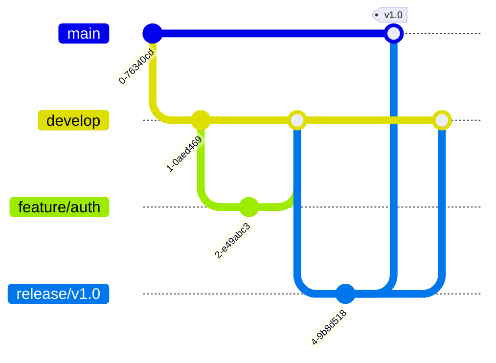

<Frame>
  
</Frame>

# Git Workflows

A workflow is a recipe or recommendation for how to use Git to accomplish work in a consistent and productive manner. Choosing the right workflow is like choosing a lane on the highway -- the wrong one will not crash your car, but it will make the journey frustrating for everyone.

There is no universally "best" workflow. The right choice depends on your team size, release cadence, and deployment infrastructure. Here are the three most common patterns.

---

## 1. Feature Branch Workflow

The most basic and widely-used workflow. All feature development takes place in a dedicated branch instead of the `main` branch. This ensures main is always in a deployable state.

- **Main Branch**: Contains production-ready code. Nobody commits directly to main.
- **Feature Branches**: Created for new features/fixes. Merged back into main via Pull Request after code review.

```bash
# Start a new feature -- always branch from the latest main
git checkout main && git pull origin main
git checkout -b feature/login-page

# Work, commit, push...
git push -u origin feature/login-page

# Create Pull Request -> Code Review -> Merge -> Delete Branch
```

<Tip>
**This is the right default for most teams.** If you are unsure which workflow to pick, start here. It is simple, encourages code review, and scales from 2-person startups to 50-person teams. Only graduate to Gitflow when you genuinely need release branches.
</Tip>

---

## 2. Gitflow Workflow

A strict branching model designed around project releases. Excellent for software with scheduled release cycles -- mobile apps, desktop software, or anything shipped on a versioned cadence. However, it adds significant ceremony that is overkill for SaaS products deploying multiple times per day.

### Branches
- **main**: Official release history.
- **develop**: Integration branch for features.
- **feature/**: New features (branch off `develop`).
- **release/**: Prepare for a new production release (branch off `develop`).
- **hotfix/**: Quick patches for production releases (branch off `main`).


```mermaid
gitGraph
   commit
   branch develop
   checkout develop
   commit
   branch feature/auth
   checkout feature/auth
   commit
   checkout develop
   merge feature/auth
   branch release/v1.0
   checkout release/v1.0
   commit
   checkout main
   merge release/v1.0 tag: "v1.0"
   checkout develop
   merge release/v1.0
```

---

## 3. Trunk-Based Development

A workflow where developers merge small, frequent updates to a core "trunk" (main) branch. This is the workflow used by Google, Facebook/Meta, and most high-velocity SaaS companies.

- **Goal**: Avoid "merge hell" by merging often (at least daily). Long-lived branches are the enemy.
- **CI/CD**: Relies heavily on automated testing to ensure `main` is always deployable. Without strong CI, trunk-based development becomes "break main every afternoon."
- **Feature Flags**: Incomplete features are hidden behind runtime flags (e.g., LaunchDarkly, Unleash) rather than living on separate branches. Code ships to production but is not visible to users until the flag is enabled.

<Warning>
**Prerequisite**: Trunk-based development requires a robust CI pipeline and a team disciplined enough to keep commits small. If your test suite takes 30 minutes and developers push 500-line changes, main will be broken more often than not. Start with Feature Branch workflow and graduate to trunk-based when your CI and testing culture are mature.
</Warning>

### Comparison

| Feature | Gitflow | Trunk-Based |
|---------|---------|-------------|
| **Complexity** | High | Low |
| **Merge Frequency** | Low (End of feature) | High (Daily/Hourly) |
| **Release Cycle** | Scheduled (Weeks/Months) | Continuous (Daily) |
| **Best For** | Legacy Apps, Open Source | SaaS, Modern Web Apps |

---

## Key Takeaways

- Use **Feature Branching** as your default -- it works for most teams and requires minimal process overhead.
- Use **Gitflow** for products with strict release versions (mobile apps, desktop software, libraries with semver). Be honest about whether you actually need the ceremony.
- Use **Trunk-Based Development** for high-velocity SaaS teams with strong CI/CD. This is the "advanced" workflow that pays massive dividends but requires mature testing infrastructure.
- **The most common mistake** is picking a workflow that is too complex for your team's needs. A two-person startup using full Gitflow is adding process overhead for no benefit. A 50-person team with no branching strategy is inviting chaos.

---

## Interview Deep-Dive

<AccordionGroup>
  <Accordion title="You join a new company and discover they have no branching strategy -- 8 developers commit directly to main with no code review. What do you propose, and how do you introduce it without disrupting velocity?" icon="circle-question">
    **Strong Answer:**
    - I would propose the Feature Branch workflow as the starting point. It is the simplest model that adds a quality gate (pull requests) without heavy process. Every change goes on a short-lived branch, gets reviewed via PR, and merges to main after approval.
    - The rollout must be incremental to avoid disrupting velocity. Week 1: enable branch protection on main (require at least one approval before merge, disable direct pushes). This is a settings change that takes 30 seconds and immediately prevents the most dangerous failure mode (pushing broken code to main with no review). Week 2: establish naming conventions (`feature/`, `fix/`, `hotfix/`). Week 3: add CI that runs tests on every PR. Week 4: retrospect and tune.
    - I would explicitly not propose Gitflow or trunk-based development at this stage. Gitflow adds too much ceremony for a team not yet used to branching. Trunk-based requires CI maturity and feature flag infrastructure that does not exist yet. Feature Branch is the stepping stone.
    - The cultural aspect matters as much as the tooling. I would frame PRs as "knowledge sharing" not "gatekeeping." The first few weeks, reviews should be quick and encouraging -- catching major issues, not nitpicking style. Once the team sees the value (fewer broken main branches, better shared understanding of the codebase), the process becomes self-reinforcing.

    **Follow-up: After 3 months, the team has adopted feature branches but PRs are sitting for 2-3 days waiting for review. How do you fix the review bottleneck?**

    Review latency is one of the most common scaling problems with branch-based workflows. My approach: First, set a team SLA (e.g., first review within 4 hours). Second, use automated reviewer assignment (GitHub CODEOWNERS or round-robin) so nobody waits for someone to volunteer. Third, keep PRs small -- a 50-line PR gets reviewed in 10 minutes, a 500-line PR sits for 3 days because nobody wants to start. Fourth, pair programming on complex features eliminates the need for post-hoc review. Fifth, make review count toward sprint velocity (if it is not "real work," nobody will prioritize it).
  </Accordion>

  <Accordion title="A product manager asks you to explain feature flags and why trunk-based development requires them. They are skeptical about 'shipping unfinished code to production.' Address their concern." icon="circle-question">
    **Strong Answer:**
    - Feature flags are runtime configuration switches that control whether a feature is visible to users. The code is deployed to production but executed only when the flag is enabled. The flag can be toggled per user, per percentage of traffic, per region, or globally -- without a deployment.
    - The PM's concern ("shipping unfinished code") conflates deployment with release. In trunk-based development, these are decoupled. Code is deployed continuously (every merge to main goes to production within minutes). Features are released when the PM decides they are ready (by enabling the flag). This is actually more control than branch-based releases, where the PM's only options are "merge the branch now" or "do not merge."
    - Concrete example: a team building a new checkout flow can commit code to main daily behind a flag. QA tests it by enabling the flag in a staging environment. The PM previews it with the flag enabled for their account. When ready, the flag rolls out to 5% of users for a canary test, then 100%. If a bug appears, the flag is disabled in seconds -- no rollback deployment needed.
    - The skepticism is valid if there is no flag management discipline. Unfinished code behind flags that never get cleaned up becomes technical debt. The solution: every flag has an owner and an expiration date. After a feature is fully rolled out, the flag and its conditional code are removed in a follow-up PR. Tools like LaunchDarkly track stale flags and alert when they should be cleaned up.

    **Follow-up: What are the risks of feature flags, and how have you seen them go wrong?**

    The biggest risk is combinatorial complexity. If you have 10 active flags, there are 1024 possible state combinations. Testing all combinations is impractical. In practice, flags should be independent -- enabling flag A should not affect the behavior of flag B. When flags interact (e.g., both modify the checkout page), you have a coupling problem that needs architectural attention, not more flags. I have seen teams with 200+ active flags where nobody knew which were safe to remove, effectively creating a parallel configuration management system with no documentation. The discipline of flag hygiene (ownership, expiration, cleanup) is as important as the flags themselves.
  </Accordion>
</AccordionGroup>

---

Next: [Git Hooks & Automation →](/courses/devops-tools/git-hooks)
