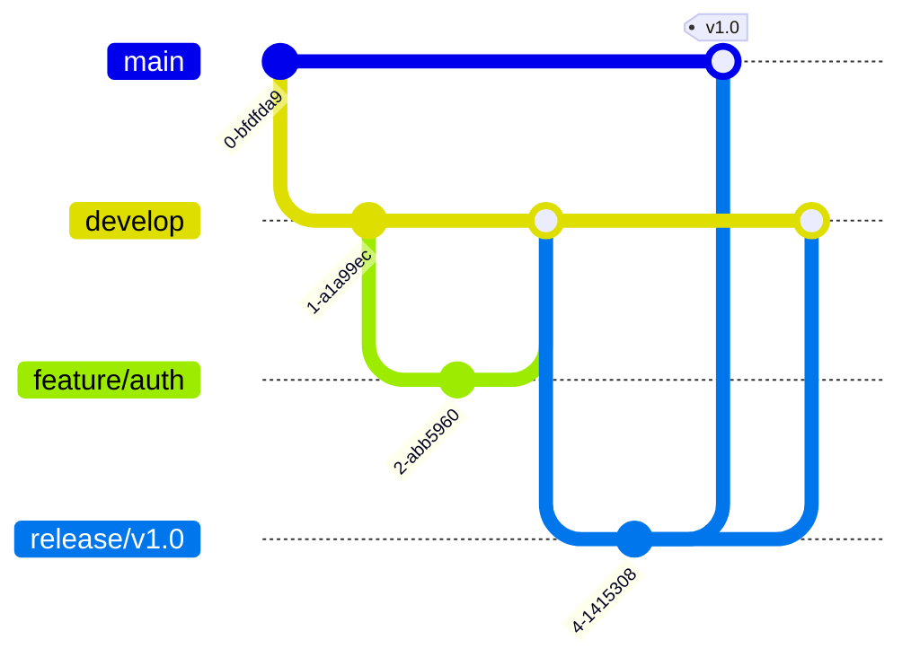

<Frame>
  
</Frame>

# Git Workflows

A workflow is a recipe or recommendation for how to use Git to accomplish work in a consistent and productive manner.

---

## 1. Feature Branch Workflow

The most basic workflow. All feature development takes place in a dedicated branch instead of the `main` branch.

- **Main Branch**: Contains production-ready code.
- **Feature Branches**: Created for new features/fixes. Merged back into main via Pull Request.

```bash
# Start a new feature
git checkout -b feature/login-page main

# Work, commit, push...
git push -u origin feature/login-page

# Create Pull Request -> Merge -> Delete Branch
```

---

## 2. Gitflow Workflow

A strict branching model designed around project releases. Excellent for software with scheduled release cycles.

### Branches
- **main**: Official release history.
- **develop**: Integration branch for features.
- **feature/**: New features (branch off `develop`).
- **release/**: Prepare for a new production release (branch off `develop`).
- **hotfix/**: Quick patches for production releases (branch off `main`).



---

## 3. Trunk-Based Development

A workflow where developers merge small, frequent updates to a core "trunk" (main) branch.
- **Goal**: Avoid "merge hell" by merging often (at least daily).
- **CI/CD**: Relies heavily on automated testing to ensure `main` is always deployable.
- **Feature Flags**: Used to hide unfinished features in production.

### Comparison

| Feature | Gitflow | Trunk-Based |
|---------|---------|-------------|
| **Complexity** | High | Low |
| **Merge Frequency** | Low (End of feature) | High (Daily/Hourly) |
| **Release Cycle** | Scheduled (Weeks/Months) | Continuous (Daily) |
| **Best For** | Legacy Apps, Open Source | SaaS, Modern Web Apps |

---

## Key Takeaways

- Use **Feature Branching** for simple projects.
- Use **Gitflow** for products with strict release versions (e.g., mobile apps, desktop software).
- Use **Trunk-Based Development** for high-velocity SaaS teams with strong CI/CD.

---

Next: [Git Hooks & Automation →](/courses/devops-tools/git-hooks)
