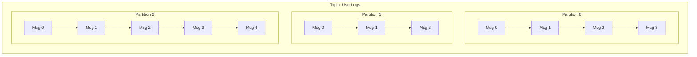
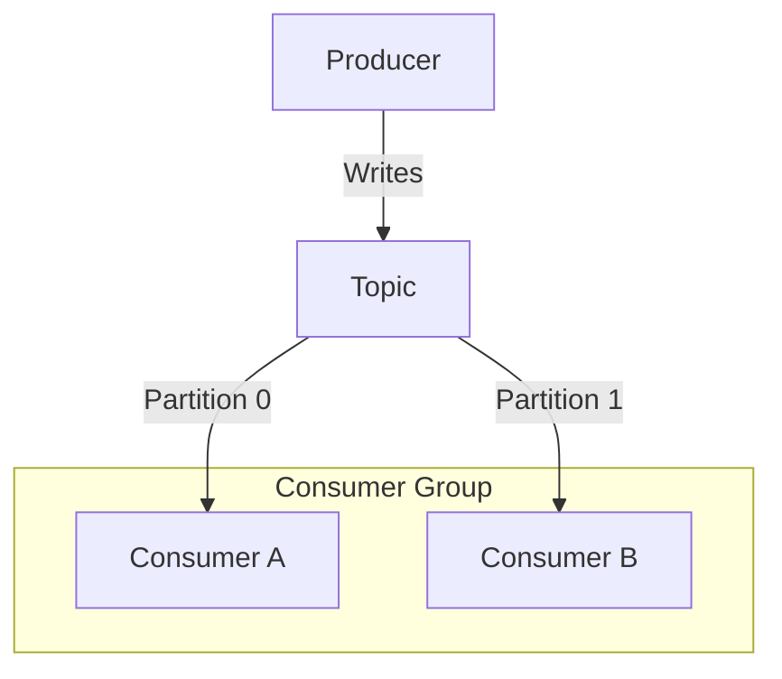

# Kafka Fundamentals

Master the core concepts of Apache Kafka event streaming and understand its distributed architecture.

---

## What is Kafka?

Apache Kafka is a **distributed event streaming platform**. Unlike traditional message queues (like RabbitMQ), Kafka is designed to handle massive streams of events, store them durably, and process them in real-time.

<CardGroup cols={2}>
  <Card title="Event Streaming" icon="stream">
    Continuous flow of data (events) as they happen
  </Card>
  <Card title="Distributed" icon="network-wired">
    Runs as a cluster of servers (brokers)
  </Card>
  <Card title="Durable" icon="hard-drive">
    Stores events on disk for a configurable retention period
  </Card>
  <Card title="Scalable" icon="arrows-maximize">
    Handles trillions of events per day
  </Card>
</CardGroup>

---

## Core Architecture

### 1. Events (Messages)
An **event** records the fact that "something happened".
- **Key**: Optional, used for partitioning (e.g., "user_123")
- **Value**: The data payload (e.g., JSON "{\"action\": \"login\"}")
- **Timestamp**: When it happened
- **Headers**: Optional metadata

### 2. Topics
A **Topic** is a logical category or feed name to which records are published.
- Analogous to a table in a database or a folder in a filesystem.
- **Multi-subscriber**: Can have zero, one, or many consumers.
- **Append-only**: New events are always added to the end.

### 3. Partitions
Topics are split into **Partitions**.
- **Scalability**: Partitions allow a topic to be spread across multiple servers.
- **Ordering**: Order is guaranteed **only within a partition**, not across the entire topic.
- **Offset**: Each message in a partition has a unique ID called an **offset**.



### 4. Brokers
A Kafka server is called a **Broker**.
- Receives messages from producers.
- Assigns offsets.
- Commits messages to disk storage.
- Serves fetch requests from consumers.
- A **Cluster** consists of multiple brokers working together.

### 5. Replication
Kafka replicates partitions across multiple brokers for **fault tolerance**.
- **Replication Factor**: Number of copies (usually 3).
- **Leader**: One broker is the leader for a partition; handles all reads/writes.
- **Followers**: Replicate data from the leader. If the leader fails, a follower becomes the new leader.

---

## Producers & Consumers

### Producers
Applications that publish (write) events to Kafka topics.
- **Partitioning Strategy**: Decides which partition a message goes to.
  - **Round-robin**: If no key is provided (load balancing).
  - **Hash-based**: If key is provided (same key always goes to same partition).

### Consumers
Applications that subscribe to (read) events from Kafka topics.
- **Consumer Groups**: A set of consumers working together to consume a topic.
  - Each partition is consumed by **only one consumer** in the group.
  - Allows parallel processing of a topic.
- **Offsets**: Consumers track their progress by committing offsets.



---

## Kafka vs RabbitMQ (Deep Dive)

| Feature | Apache Kafka | RabbitMQ |
|---------|--------------|----------|
| **Design** | Distributed Commit Log | Traditional Message Broker |
| **Message Retention** | Policy-based (e.g., 7 days), durable | Deleted after consumption (usually) |
| **Throughput** | Extremely High (Millions/sec) | High (Thousands/sec) |
| **Ordering** | Guaranteed per partition | Guaranteed per queue |
| **Consumption** | Pull-based (Consumer polls) | Push-based (Broker pushes) |
| **Use Case** | Event streaming, Log aggregation, Analytics | Complex routing, Task queues |

### The Power of Pull-Based Consumption

Kafka's **pull-based** model is a key architectural decision that distinguishes it from traditional push-based messaging systems.

<AccordionGroup>
  <Accordion title="Consumer Control" icon="gamepad">
    Consumers fetch messages at their own pace. Fast consumers aren't held back by slow ones, and slow consumers aren't overwhelmed by a flood of messages (backpressure is inherent).
  </Accordion>
  
  <Accordion title="Batching Efficiency" icon="layer-group">
    Consumers can pull large batches of messages in a single request, significantly reducing network overhead and improving throughput (IOPS).
  </Accordion>
  
  <Accordion title="Rewind & Replay" icon="rotate-left">
    Since the broker doesn't track "who read what" (consumers track their own offsets), consumers can easily rewind to an old offset and re-process past events. This is crucial for:
    - Recovering from errors
    - Testing new processing logic on old data
    - Training ML models
  </Accordion>
</AccordionGroup>

---

## Installation & Quick Start

<Tabs>
  <Tab title="Docker (Recommended)">
    Using Confluent Platform (includes Zookeeper/Kraft and tools):
    
    ```yaml
    # docker-compose.yml
    version: '3'
    services:
      zookeeper:
        image: confluentinc/cp-zookeeper:7.3.0
        environment:
          ZOOKEEPER_CLIENT_PORT: 2181
          ZOOKEEPER_TICK_TIME: 2000

      broker:
        image: confluentinc/cp-kafka:7.3.0
        depends_on:
          - zookeeper
        ports:
          - "9092:9092"
        environment:
          KAFKA_BROKER_ID: 1
          KAFKA_ZOOKEEPER_CONNECT: 'zookeeper:2181'
          KAFKA_LISTENER_SECURITY_PROTOCOL_MAP: PLAINTEXT:PLAINTEXT,PLAINTEXT_INTERNAL:PLAINTEXT
          KAFKA_ADVERTISED_LISTENERS: PLAINTEXT://localhost:9092,PLAINTEXT_INTERNAL://broker:29092
          KAFKA_OFFSETS_TOPIC_REPLICATION_FACTOR: 1
    ```
    
    Run: `docker-compose up -d`
  </Tab>
  
  <Tab title="Local Install">
    1. Download Kafka from [apache.org](https://kafka.apache.org/downloads).
    2. Extract the archive.
    3. Start Zookeeper (if not using KRaft):
       `bin/zookeeper-server-start.sh config/zookeeper.properties`
    4. Start Kafka Broker:
       `bin/kafka-server-start.sh config/server.properties`
  </Tab>
</Tabs>

---

## CLI Power User Commands

### Topic Management

```bash
# Create a topic with 3 partitions and replication factor of 1
bin/kafka-topics.sh --create \
    --topic user-events \
    --bootstrap-server localhost:9092 \
    --partitions 3 \
    --replication-factor 1

# List topics
bin/kafka-topics.sh --list --bootstrap-server localhost:9092

# Describe topic details (leader, replicas, ISR)
bin/kafka-topics.sh --describe \
    --topic user-events \
    --bootstrap-server localhost:9092

# Delete topic
bin/kafka-topics.sh --delete \
    --topic user-events \
    --bootstrap-server localhost:9092
```

### Producing & Consuming

```bash
# Console Producer (Type messages and hit Enter)
bin/kafka-console-producer.sh \
    --topic user-events \
    --bootstrap-server localhost:9092 \
    --property "parse.key=true" \
    --property "key.separator=:"

# Example input:
# user1:login
# user2:logout

# Console Consumer (Read from beginning)
bin/kafka-console-consumer.sh \
    --topic user-events \
    --from-beginning \
    --bootstrap-server localhost:9092 \
    --property "print.key=true"
```

### Consumer Groups

```bash
# List consumer groups
bin/kafka-consumer-groups.sh --list --bootstrap-server localhost:9092

# Describe group (See lag, current offset)
bin/kafka-consumer-groups.sh --describe \
    --group my-group \
    --bootstrap-server localhost:9092
```

---

## Key Takeaways

- **Topics** are logs of events, divided into **Partitions**.
- **Partitions** allow Kafka to scale and guarantee ordering.
- **Brokers** form a cluster to provide durability and availability.
- **Consumer Groups** allow parallel processing of topics.
- Kafka is **pull-based** and stores data for a set retention period.

---

Next: [Kafka Producers & Consumers →](/courses/devops-tools/kafka-producers-consumers)
