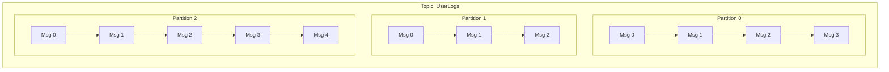
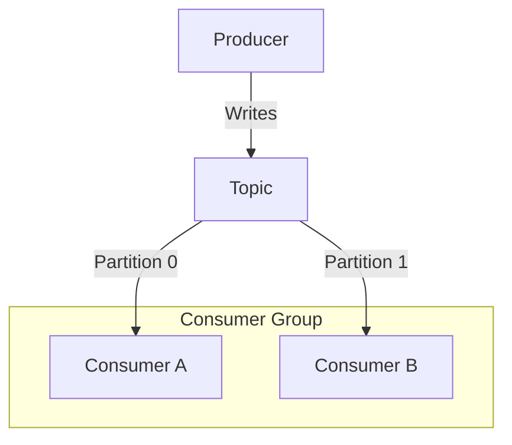
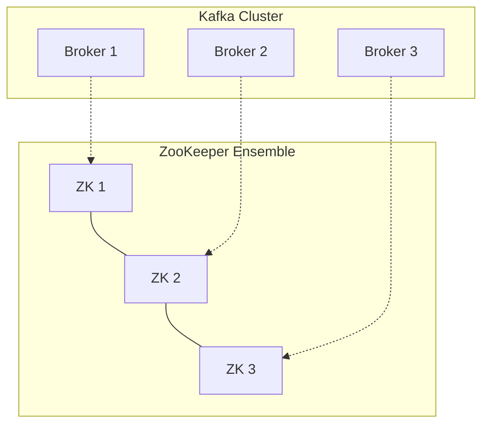
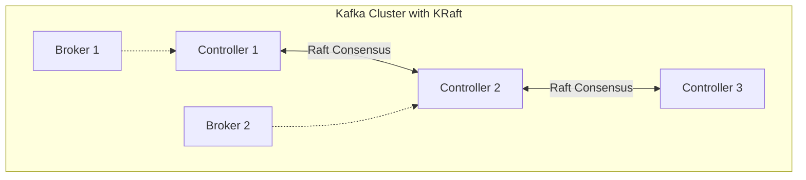

# Kafka Fundamentals

Master the core concepts of Apache Kafka event streaming and understand its distributed architecture.

---

## What is Kafka?

Apache Kafka is a **distributed event streaming platform**. Unlike traditional message queues (like RabbitMQ), Kafka is designed to handle massive streams of events, store them durably, and process them in real-time.

<CardGroup cols={2}>
  <Card title="Event Streaming" icon="stream">
    Continuous flow of data (events) as they happen
  </Card>
  <Card title="Distributed" icon="network-wired">
    Runs as a cluster of servers (brokers)
  </Card>
  <Card title="Durable" icon="hard-drive">
    Stores events on disk for a configurable retention period
  </Card>
  <Card title="Scalable" icon="arrows-maximize">
    Handles trillions of events per day
  </Card>
</CardGroup>

---

## Core Architecture

### 1. Events (Messages)
An **event** records the fact that "something happened".
- **Key**: Optional, used for partitioning (e.g., `user_123`)
- **Value**: The data payload (e.g., JSON `{"action": "login"}`)
- **Timestamp**: When it happened
- **Headers**: Optional metadata

### 2. Topics
A **Topic** is a logical category or feed name to which records are published.
- Analogous to a table in a database or a folder in a filesystem.
- **Multi-subscriber**: Can have zero, one, or many consumers.
- **Append-only**: New events are always added to the end.

### 3. Partitions
Topics are split into **Partitions**.
- **Scalability**: Partitions allow a topic to be spread across multiple servers.
- **Ordering**: Order is guaranteed **only within a partition**, not across the entire topic.
- **Offset**: Each message in a partition has a unique ID called an **offset**.



### 4. Brokers
A Kafka server is called a **Broker**.
- Receives messages from producers.
- Assigns offsets.
- Commits messages to disk storage.
- Serves fetch requests from consumers.
- A **Cluster** consists of multiple brokers working together.

### 5. Replication
Kafka replicates partitions across multiple brokers for **fault tolerance**.
- **Replication Factor**: Number of copies (usually 3).
- **Leader**: One broker is the leader for a partition; handles all reads/writes.
- **Followers**: Replicate data from the leader. If the leader fails, a follower becomes the new leader.

---

## Producers & Consumers

### Producers
Applications that publish (write) events to Kafka topics.
- **Partitioning Strategy**: Decides which partition a message goes to.
  - **Round-robin**: If no key is provided (load balancing).
  - **Hash-based**: If key is provided (same key always goes to same partition).

### Consumers
Applications that subscribe to (read) events from Kafka topics.
- **Consumer Groups**: A set of consumers working together to consume a topic.
  - Each partition is consumed by **only one consumer** in the group.
  - Allows parallel processing of a topic.
- **Offsets**: Consumers track their progress by committing offsets.



---

## Kafka vs RabbitMQ (Deep Dive)

| Feature | Apache Kafka | RabbitMQ |
|---------|--------------|----------|
| **Design** | Distributed Commit Log | Traditional Message Broker |
| **Message Retention** | Policy-based (e.g., 7 days), durable | Deleted after consumption (usually) |
| **Throughput** | Extremely High (Millions/sec) | High (Thousands/sec) |
| **Ordering** | Guaranteed per partition | Guaranteed per queue |
| **Consumption** | Pull-based (Consumer polls) | Push-based (Broker pushes) |
| **Use Case** | Event streaming, Log aggregation, Analytics | Complex routing, Task queues |

### The Power of Pull-Based Consumption

Kafka's **pull-based** model is a key architectural decision that distinguishes it from traditional push-based messaging systems.

<AccordionGroup>
  <Accordion title="Consumer Control" icon="gamepad">
    Consumers fetch messages at their own pace. Fast consumers aren't held back by slow ones, and slow consumers aren't overwhelmed by a flood of messages (backpressure is inherent).
  </Accordion>
  
  <Accordion title="Batching Efficiency" icon="layer-group">
    Consumers can pull large batches of messages in a single request, significantly reducing network overhead and improving throughput (IOPS).
  </Accordion>
  
  <Accordion title="Rewind & Replay" icon="rotate-left">
    Since the broker doesn't track "who read what" (consumers track their own offsets), consumers can easily rewind to an old offset and re-process past events. This is crucial for:
    - Recovering from errors
    - Testing new processing logic on old data
    - Training ML models
  </Accordion>
</AccordionGroup>

---

## ZooKeeper vs KRaft (Critical for Interviews!)

Kafka has traditionally relied on ZooKeeper for cluster coordination. **KRaft** (Kafka Raft) is the new consensus protocol that removes this dependency.

### ZooKeeper Mode (Legacy)



**ZooKeeper responsibilities:**
- Broker registration and discovery
- Controller election
- Topic configuration storage
- ACLs and quotas

### KRaft Mode (New Standard - Kafka 3.3+)



| Aspect | ZooKeeper | KRaft |
|--------|-----------|-------|
| **Architecture** | Separate cluster | Integrated with Kafka |
| **Latency** | Higher (two systems) | Lower (single system) |
| **Scalability** | Limited by ZK | Millions of partitions |
| **Operational Complexity** | Two systems to manage | Single system |
| **Production Ready** | Yes | Yes (Kafka 3.6+) |

<Warning>
**Interview Tip**: Know that KRaft is the future and understand why Kafka moved away from ZooKeeper (simpler operations, better scalability, lower latency).
</Warning>

---

## Partition Internals Deep Dive

Understanding partition internals is crucial for performance tuning and interviews.

### Log Segments

Each partition is stored as a series of **log segments**:

```
partition-0/
├── 00000000000000000000.log    # Segment files
├── 00000000000000000000.index  # Offset index
├── 00000000000000000000.timeindex  # Time index
├── 00000000000005000000.log    # Next segment (starts at offset 5000000)
└── ...
```

### How Writes Work

1. Producer sends message to partition leader
2. Leader appends to active segment file (sequential I/O - very fast!)
3. Leader replicates to followers (if acks=all)
4. Leader responds to producer with offset

### How Reads Work

1. Consumer requests offset range
2. Broker uses `.index` file to find segment
3. Broker does sequential read from segment
4. Returns batch of messages

<Tip>
**Interview Insight**: Kafka achieves high throughput through:
- Sequential I/O (no random seeks)
- OS page cache (zero-copy)
- Batching and compression
</Tip>

---

## In-Sync Replicas (ISR) Deep Dive

ISR is one of the most important concepts for durability.

### What is ISR?

The set of replicas that are "caught up" with the leader. A replica is removed from ISR if:
- It falls behind by more than `replica.lag.time.max.ms` (default 30s)
- It's disconnected from ZooKeeper/controllers

### ISR Configuration

| Config | Description | Default |
|--------|-------------|---------|
| `min.insync.replicas` | Minimum ISRs for write to succeed | 1 |
| `replica.lag.time.max.ms` | Max lag before removal from ISR | 30000 |

### Data Loss Scenarios

<AccordionGroup>
  <Accordion title="acks=1, leader fails" icon="triangle-exclamation">
    **Scenario**: Producer gets ack after leader writes, but leader crashes before replicating.
    **Result**: Data loss when new leader is elected.
    **Fix**: Use `acks=all`
  </Accordion>
  
  <Accordion title="All ISRs fail simultaneously" icon="triangle-exclamation">
    **Scenario**: All in-sync replicas fail at once.
    **Result**: Either wait for ISR to recover, or allow non-ISR leader (data loss).
    **Config**: `unclean.leader.election.enable=false` (default)
  </Accordion>
  
  <Accordion title="min.insync.replicas=1 with RF=2" icon="triangle-exclamation">
    **Scenario**: Two replicas, one fails, producer still writes with acks=all.
    **Result**: Only one copy exists. If it fails, data is lost.
    **Fix**: RF=3, min.insync.replicas=2
  </Accordion>
</AccordionGroup>

### The Golden Rule

```
Replication Factor = 3
min.insync.replicas = 2
acks = all
```

This ensures: 2 replicas must acknowledge, can survive 1 broker failure without data loss.

---

## Interview Questions & Answers

<AccordionGroup>
  <Accordion title="How does Kafka achieve high throughput?" icon="circle-question">
    1. **Sequential I/O**: Append-only writes, no random disk seeks
    2. **OS Page Cache**: Uses filesystem cache for zero-copy reads
    3. **Batching**: Groups messages to reduce network/disk overhead
    4. **Compression**: Reduces network bandwidth
    5. **Partitioning**: Parallelism across brokers
  </Accordion>
  
  <Accordion title="What happens when a broker fails?" icon="circle-question">
    1. Controller detects broker failure (via heartbeats)
    2. For each partition where failed broker was leader:
       - Controller elects new leader from ISR
       - Updates metadata in all brokers
    3. Producers/consumers get metadata update and reconnect
    4. Data is safe if replica was in ISR
  </Accordion>
  
  <Accordion title="How do you choose the number of partitions?" icon="circle-question">
    **Formula**: `partitions = max(throughput/producer_throughput, throughput/consumer_throughput)`
    
    Considerations:
    - More partitions = more parallelism
    - More partitions = more memory/file handles
    - Can't decrease partitions (only increase)
    - Each partition = at most one consumer in a group
    
    **Rule of thumb**: Start with 3-6 partitions per topic, scale as needed.
  </Accordion>
  
  <Accordion title="What is the difference between a Topic and a Partition?" icon="circle-question">
    - **Topic**: Logical category/feed (like a table)
    - **Partition**: Physical subdivision of a topic (like a shard)
    
    A topic is split into partitions for:
    - Scalability (spread across brokers)
    - Parallelism (multiple consumers)
    - Ordering (guaranteed within partition)
  </Accordion>
  
  <Accordion title="How does Kafka handle consumer failures?" icon="circle-question">
    1. Consumer stops sending heartbeats
    2. After `session.timeout.ms`, consumer is considered dead
    3. **Rebalance** is triggered in the consumer group
    4. Partitions are reassigned to remaining consumers
    5. New consumer starts from last committed offset
  </Accordion>
  
  <Accordion title="What is the Controller in Kafka?" icon="circle-question">
    One broker is elected as the **Controller**:
    - Monitors broker liveness
    - Elects partition leaders when brokers fail
    - Updates cluster metadata
    - Manages partition reassignments
    
    In KRaft mode, there's a quorum of controllers using Raft consensus.
  </Accordion>
</AccordionGroup>

---

## Common Pitfalls

<Warning>
**1. Too Few Partitions**: Can't increase consumer parallelism. Start with enough partitions.

**2. acks=1 in Production**: Risk of data loss. Always use `acks=all` for critical data.

**3. Single Consumer for High Volume**: One consumer can only handle one partition. Use consumer groups.

**4. Ignoring Consumer Lag**: Lag indicates consumers are too slow. Monitor and alert on lag.

**5. Auto-Create Topics in Production**: Set `auto.create.topics.enable=false`. Typos create unwanted topics.
</Warning>

---

## Installation & Quick Start

<Tabs>
  <Tab title="Docker (Recommended)">
    Using Confluent Platform (includes Zookeeper/Kraft and tools):
    
    ```yaml
    # docker-compose.yml
    version: '3'
    services:
      zookeeper:
        image: confluentinc/cp-zookeeper:7.3.0
        environment:
          ZOOKEEPER_CLIENT_PORT: 2181
          ZOOKEEPER_TICK_TIME: 2000

      broker:
        image: confluentinc/cp-kafka:7.3.0
        depends_on:
          - zookeeper
        ports:
          - "9092:9092"
        environment:
          KAFKA_BROKER_ID: 1
          KAFKA_ZOOKEEPER_CONNECT: 'zookeeper:2181'
          KAFKA_LISTENER_SECURITY_PROTOCOL_MAP: PLAINTEXT:PLAINTEXT,PLAINTEXT_INTERNAL:PLAINTEXT
          KAFKA_ADVERTISED_LISTENERS: PLAINTEXT://localhost:9092,PLAINTEXT_INTERNAL://broker:29092
          KAFKA_OFFSETS_TOPIC_REPLICATION_FACTOR: 1
    ```
    
    Run: `docker-compose up -d`
  </Tab>
  
  <Tab title="Local Install">
    1. Download Kafka from [apache.org](https://kafka.apache.org/downloads).
    2. Extract the archive.
    3. Start Zookeeper (if not using KRaft):
       `bin/zookeeper-server-start.sh config/zookeeper.properties`
    4. Start Kafka Broker:
       `bin/kafka-server-start.sh config/server.properties`
  </Tab>
</Tabs>

---

## CLI Power User Commands

### Topic Management

```bash
# Create a topic with 3 partitions and replication factor of 1
bin/kafka-topics.sh --create \
    --topic user-events \
    --bootstrap-server localhost:9092 \
    --partitions 3 \
    --replication-factor 1

# List topics
bin/kafka-topics.sh --list --bootstrap-server localhost:9092

# Describe topic details (leader, replicas, ISR)
bin/kafka-topics.sh --describe \
    --topic user-events \
    --bootstrap-server localhost:9092

# Delete topic
bin/kafka-topics.sh --delete \
    --topic user-events \
    --bootstrap-server localhost:9092
```

### Producing & Consuming

```bash
# Console Producer (Type messages and hit Enter)
bin/kafka-console-producer.sh \
    --topic user-events \
    --bootstrap-server localhost:9092 \
    --property "parse.key=true" \
    --property "key.separator=:"

# Example input:
# user1:login
# user2:logout

# Console Consumer (Read from beginning)
bin/kafka-console-consumer.sh \
    --topic user-events \
    --from-beginning \
    --bootstrap-server localhost:9092 \
    --property "print.key=true"
```

### Consumer Groups

```bash
# List consumer groups
bin/kafka-consumer-groups.sh --list --bootstrap-server localhost:9092

# Describe group (See lag, current offset)
bin/kafka-consumer-groups.sh --describe \
    --group my-group \
    --bootstrap-server localhost:9092
```

---

## Key Takeaways

- **Topics** are logs of events, divided into **Partitions**.
- **Partitions** allow Kafka to scale and guarantee ordering.
- **Brokers** form a cluster to provide durability and availability.
- **Consumer Groups** allow parallel processing of topics.
- Kafka is **pull-based** and stores data for a set retention period.

---

Next: [Kafka Producers & Consumers →](/courses/devops-tools/kafka-producers-consumers)
