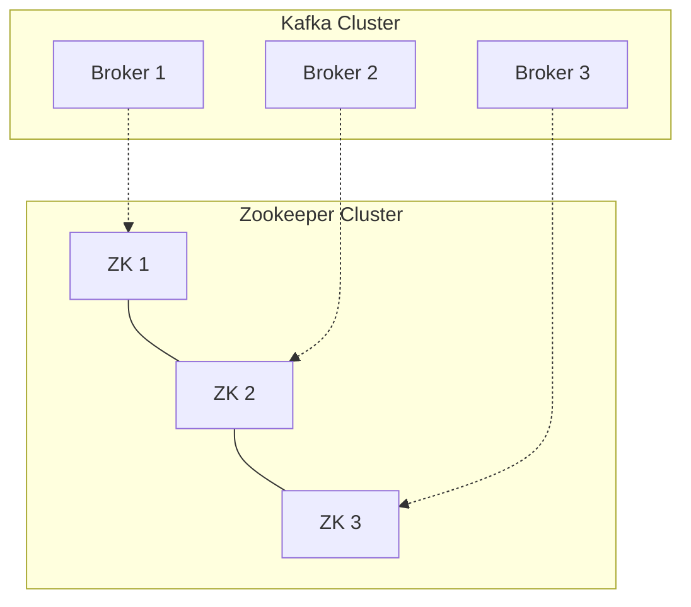
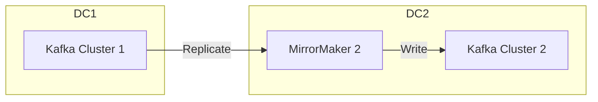

# Kafka Operations

Learn to deploy, manage, and secure Kafka clusters in production environments.

---

## Cluster Architecture

A production Kafka cluster typically consists of:
- **3+ Brokers**: For availability and replication.
- **3+ Zookeeper Nodes** (or KRaft controllers): For cluster coordination.



### Key Configurations (`server.properties`)

| Property | Description | Recommended |
|----------|-------------|-------------|
| `broker.id` | Unique integer ID | Unique per broker |
| `log.dirs` | Where data is stored | Separate disk/mount |
| `num.partitions` | Default partitions | 3 |
| `default.replication.factor` | Default replication | 3 |
| `min.insync.replicas` | Min replicas for ack | 2 |
| `auto.create.topics.enable` | Auto-create topics | `false` (Production) |

---

## High Availability & Replication

### Replication Factor
- **RF=3**: Standard for production. Allows 1 broker failure with no data loss.
- **Min ISR=2**: Ensures data is written to at least 2 brokers before ack.

### In-Sync Replicas (ISR)
Replicas that are caught up with the leader.
- If a follower falls too far behind, it's removed from ISR.
- If leader fails, only a member of ISR can become new leader.

---

## Monitoring & Observability

### Key Metrics (JMX)

<CardGroup cols={2}>
  <Card title="Under Replicated Partitions" icon="triangle-exclamation">
    **Critical**: Should be 0. >0 means data isn't fully replicated.
  </Card>
  <Card title="Active Controller Count" icon="crown">
    **Critical**: Should be 1 per cluster.
  </Card>
  <Card title="Offline Partitions" icon="ban">
    **Critical**: >0 means data is unavailable.
  </Card>
  <Card title="Request Latency" icon="stopwatch">
    Time to process produce/fetch requests.
  </Card>
</CardGroup>

### Consumer Lag
The most important metric for consumers.
- **Lag**: Difference between latest offset and consumer offset.
- **Monitoring**: Use `kafka-consumer-groups.sh` or tools like Prometheus/Grafana.

```bash
# Check lag
bin/kafka-consumer-groups.sh --bootstrap-server localhost:9092 --describe --group my-group
```

---

## Security

### 1. Encryption (SSL/TLS)
Encrypts data in transit between clients and brokers, and between brokers.

```properties
# server.properties
listeners=SSL://:9093
ssl.keystore.location=/var/private/ssl/server.keystore.jks
ssl.keystore.password=test1234
ssl.key.password=test1234
ssl.truststore.location=/var/private/ssl/server.truststore.jks
ssl.truststore.password=test1234
```

### 2. Authentication (SASL)
Verifies identity of clients.
- **SASL/PLAIN**: Username/Password.
- **SASL/SCRAM**: Salted Challenge Response (More secure).
- **SASL/GSSAPI (Kerberos)**: Enterprise integration.

### 3. Authorization (ACLs)
Controls what authenticated users can do.

```bash
# Allow 'alice' to write to 'finance-topic'
bin/kafka-acls.sh --bootstrap-server localhost:9092 --add \
    --allow-principal User:alice \
    --operation Write \
    --topic finance-topic
```

---

## Troubleshooting

### Broker Failure
1. **Check Logs**: `/var/log/kafka/server.log`.
2. **Check Disk**: Is disk full? Kafka stops accepting writes if disk is full.
3. **Check Zookeeper**: Is broker connected to ZK?

### Consumer Issues
- **Stuck Consumer**: Check if rebalancing is happening constantly ("stop-the-world").
- **High Lag**: Consumer is too slow.
  - Solution: Add more partitions and more consumer instances.
  - Solution: Optimize processing logic.

### Data Loss Scenarios
- **Unclean Leader Election**: If all ISRs fail, non-ISR replica becomes leader (data loss).
  - Config: `unclean.leader.election.enable=false` (Default).
- **Producer Acks=1**: Leader accepts write but crashes before replicating.
  - Config: `acks=all`.

---

## Maintenance Tasks

### Rebalancing Partitions
When adding new brokers, partitions don't automatically move. Use `kafka-reassign-partitions.sh`.

### Log Compaction
For topics where only the *latest* value for a key matters (e.g., user profile updates).
- Config: `cleanup.policy=compact`.

---

## Log Compaction Deep Dive

Log compaction ensures Kafka retains the **latest value for each key**, rather than retaining by time.

### How It Works

```
Before Compaction:
offset: 0  1  2  3  4  5  6  7
key:    A  B  A  C  B  A  C  B
value:  v1 v1 v2 v1 v2 v3 v2 v3

After Compaction:
offset: 5  6  7
key:    A  C  B
value:  v3 v2 v3
```

### Configuration

```properties
# Topic-level
cleanup.policy=compact
min.cleanable.dirty.ratio=0.5   # Compact when 50% is "dirty"
delete.retention.ms=86400000    # Keep tombstones for 24h
```

### Tombstones (Deletes)

To delete a key, produce a message with `null` value:

```java
producer.send(new ProducerRecord<>("topic", "key-to-delete", null));
```

The tombstone is kept for `delete.retention.ms`, then removed during compaction.

<Warning>
**Interview Tip**: Compacted topics are ideal for:
- Changelogs (database CDC)
- Configuration/feature flags
- User profile caches
- KTable backing in Kafka Streams
</Warning>

---

## Retention Strategies

### Time-Based Retention

```properties
retention.ms=604800000          # 7 days
retention.bytes=-1               # Unlimited size
```

### Size-Based Retention

```properties
retention.ms=-1                  # Unlimited time
retention.bytes=1073741824       # 1GB per partition
```

### Combined

```properties
retention.ms=604800000           # 7 days OR
retention.bytes=1073741824       # 1GB, whichever comes first
```

---

## Disaster Recovery

### Multi-Datacenter Replication

| Tool | Description |
|------|-------------|
| **MirrorMaker 2** | Kafka-native, replicates topics between clusters |
| **Confluent Replicator** | Commercial, more features |
| **Cluster Linking** | Confluent Cloud, byte-for-byte replication |

### MirrorMaker 2 Architecture



### Backup Strategies

1. **Regular Backups**: Use tools like Kafka Connect to S3
2. **Topic Mirroring**: MirrorMaker 2 to standby cluster
3. **Retention Policy**: Set high retention for critical topics

---

## Performance Tuning

### Broker Tuning

```properties
# Increase socket buffers
socket.send.buffer.bytes=102400
socket.receive.buffer.bytes=102400

# Number of I/O threads
num.io.threads=8
num.network.threads=3

# Log flush settings
log.flush.interval.messages=10000
log.flush.interval.ms=1000
```

### Producer Tuning

```properties
# Batching
batch.size=16384           # 16KB batches
linger.ms=5                # Wait 5ms to fill batch

# Compression
compression.type=lz4       # lz4 or zstd for best perf

# Memory
buffer.memory=33554432     # 32MB buffer
```

### Consumer Tuning

```properties
# Fetch settings
fetch.min.bytes=1024       # Wait for 1KB before returning
fetch.max.wait.ms=500      # Or 500ms, whichever first
max.partition.fetch.bytes=1048576  # 1MB per partition
```

---

## Interview Questions & Answers

<AccordionGroup>
  <Accordion title="How do you monitor a Kafka cluster?" icon="circle-question">
    **Key Metrics to Monitor:**
    1. **Under-replicated partitions**: Should be 0
    2. **Active Controller Count**: Should be 1
    3. **Offline Partitions**: Should be 0
    4. **Request Latency**: Produce/Fetch p99
    5. **Consumer Lag**: Per consumer group
    
    **Tools:**
    - JMX + Prometheus + Grafana
    - Confluent Control Center
    - Burrow (consumer lag)
    - Cruise Control (auto-rebalancing)
  </Accordion>
  
  <Accordion title="How do you add a new broker to a cluster?" icon="circle-question">
    1. Configure new broker with unique `broker.id`
    2. Point to same ZooKeeper/KRaft controllers
    3. Start the broker
    4. **Partitions don't auto-move!** Use `kafka-reassign-partitions.sh`
    
    ```bash
    # Generate reassignment plan
    kafka-reassign-partitions.sh --generate \
      --topics-to-move-json-file topics.json \
      --broker-list "1,2,3,4"
    
    # Execute reassignment
    kafka-reassign-partitions.sh --execute \
      --reassignment-json-file plan.json
    ```
  </Accordion>
  
  <Accordion title="What is log compaction and when would you use it?" icon="circle-question">
    Log compaction keeps only the **latest value per key**, not by time.
    
    **Use Cases:**
    - Database changelog (CDC)
    - User profile cache
    - Configuration store
    - KTable backing store
    
    **Config:** `cleanup.policy=compact`
  </Accordion>
  
  <Accordion title="How do you handle a broker failure?" icon="circle-question">
    1. **Automatic**: Controller elects new leaders from ISR
    2. **Check Under-Replicated Partitions**: If > 0, replication is catching up
    3. **Bring broker back**: It will rejoin and catch up
    4. **If disk failed**: May need to reassign partitions
    
    **Prevent data loss:**
    - RF=3, min.insync.replicas=2
    - acks=all on producers
    - unclean.leader.election.enable=false
  </Accordion>
  
  <Accordion title="How do you upgrade Kafka without downtime?" icon="circle-question">
    **Rolling Upgrade Process:**
    1. Set `inter.broker.protocol.version` to current version
    2. Upgrade brokers one at a time (preferred replicas first)
    3. After all brokers upgraded, bump protocol version
    4. Upgrade clients (consumers first, then producers)
    
    **Key**: Never skip versions. 2.x → 3.0 → 3.5, not 2.x → 3.5
  </Accordion>
  
  <Accordion title="What is Cruise Control?" icon="circle-question">
    An open-source tool for Kafka cluster management:
    - **Auto-rebalancing**: Moves partitions for even load
    - **Self-healing**: Handles broker failures
    - **Goal-based optimization**: CPU, disk, network balance
    
    Reduces operational burden of managing large clusters.
  </Accordion>
</AccordionGroup>

---

## Common Pitfalls

<Warning>
**1. Disk Full**: Kafka stops accepting writes. Monitor disk usage and set retention appropriately.

**2. Under-Replicated Partitions**: Indicates slow broker or network issues. Don't ignore!

**3. Skipping Versions**: Can cause data corruption. Always follow upgrade path.

**4. No Monitoring**: Without metrics, you're flying blind. Set up alerting on key metrics.

**5. Manual Partition Management**: Use Cruise Control for large clusters to avoid imbalanced load.
</Warning>

---

🎉 **Congratulations!** You've completed the Kafka Crash Course.

Next: [Kubernetes Crash Course →](/courses/devops-tools/kubernetes-overview)
