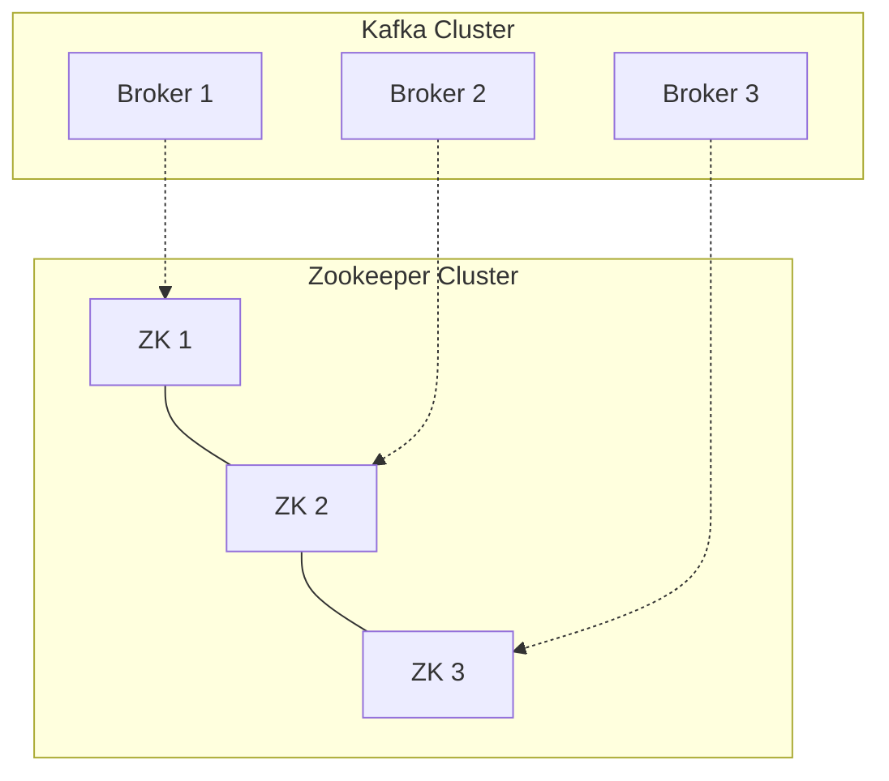

# Kafka Operations

Learn to deploy, manage, and secure Kafka clusters in production environments.

---

## Cluster Architecture

A production Kafka cluster typically consists of:
- **3+ Brokers**: For availability and replication.
- **3+ Zookeeper Nodes** (or KRaft controllers): For cluster coordination.



### Key Configurations (`server.properties`)

| Property | Description | Recommended |
|----------|-------------|-------------|
| `broker.id` | Unique integer ID | Unique per broker |
| `log.dirs` | Where data is stored | Separate disk/mount |
| `num.partitions` | Default partitions | 3 |
| `default.replication.factor` | Default replication | 3 |
| `min.insync.replicas` | Min replicas for ack | 2 |
| `auto.create.topics.enable` | Auto-create topics | `false` (Production) |

---

## High Availability & Replication

### Replication Factor
- **RF=3**: Standard for production. Allows 1 broker failure with no data loss.
- **Min ISR=2**: Ensures data is written to at least 2 brokers before ack.

### In-Sync Replicas (ISR)
Replicas that are caught up with the leader.
- If a follower falls too far behind, it's removed from ISR.
- If leader fails, only a member of ISR can become new leader.

---

## Monitoring & Observability

### Key Metrics (JMX)

<CardGroup cols={2}>
  <Card title="Under Replicated Partitions" icon="triangle-exclamation">
    **Critical**: Should be 0. >0 means data isn't fully replicated.
  </Card>
  <Card title="Active Controller Count" icon="crown">
    **Critical**: Should be 1 per cluster.
  </Card>
  <Card title="Offline Partitions" icon="ban">
    **Critical**: >0 means data is unavailable.
  </Card>
  <Card title="Request Latency" icon="stopwatch">
    Time to process produce/fetch requests.
  </Card>
</CardGroup>

### Consumer Lag
The most important metric for consumers.
- **Lag**: Difference between latest offset and consumer offset.
- **Monitoring**: Use `kafka-consumer-groups.sh` or tools like Prometheus/Grafana.

```bash
# Check lag
bin/kafka-consumer-groups.sh --bootstrap-server localhost:9092 --describe --group my-group
```

---

## Security

### 1. Encryption (SSL/TLS)
Encrypts data in transit between clients and brokers, and between brokers.

```properties
# server.properties
listeners=SSL://:9093
ssl.keystore.location=/var/private/ssl/server.keystore.jks
ssl.keystore.password=test1234
ssl.key.password=test1234
ssl.truststore.location=/var/private/ssl/server.truststore.jks
ssl.truststore.password=test1234
```

### 2. Authentication (SASL)
Verifies identity of clients.
- **SASL/PLAIN**: Username/Password.
- **SASL/SCRAM**: Salted Challenge Response (More secure).
- **SASL/GSSAPI (Kerberos)**: Enterprise integration.

### 3. Authorization (ACLs)
Controls what authenticated users can do.

```bash
# Allow 'alice' to write to 'finance-topic'
bin/kafka-acls.sh --bootstrap-server localhost:9092 --add \
    --allow-principal User:alice \
    --operation Write \
    --topic finance-topic
```

---

## Troubleshooting

### Broker Failure
1. **Check Logs**: `/var/log/kafka/server.log`.
2. **Check Disk**: Is disk full? Kafka stops accepting writes if disk is full.
3. **Check Zookeeper**: Is broker connected to ZK?

### Consumer Issues
- **Stuck Consumer**: Check if rebalancing is happening constantly ("stop-the-world").
- **High Lag**: Consumer is too slow.
  - Solution: Add more partitions and more consumer instances.
  - Solution: Optimize processing logic.

### Data Loss Scenarios
- **Unclean Leader Election**: If all ISRs fail, non-ISR replica becomes leader (data loss).
  - Config: `unclean.leader.election.enable=false` (Default).
- **Producer Acks=1**: Leader accepts write but crashes before replicating.
  - Config: `acks=all`.

---

## Maintenance Tasks

### Rebalancing Partitions
When adding new brokers, partitions don't automatically move. Use `kafka-reassign-partitions.sh`.

### Log Compaction
For topics where only the *latest* value for a key matters (e.g., user profile updates).
- Config: `cleanup.policy=compact`.

---

🎉 **Congratulations!** You've completed the Kafka Crash Course.

Next: [Kubernetes Crash Course →](/courses/devops-tools/kubernetes-overview)
