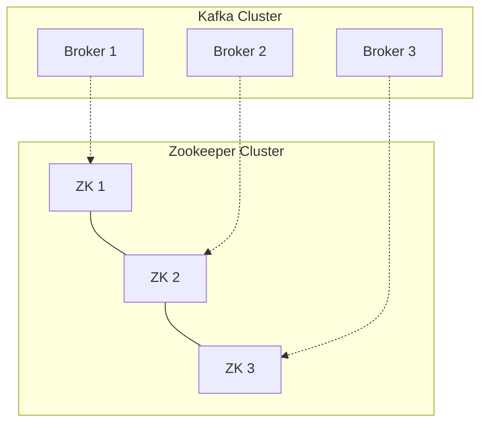
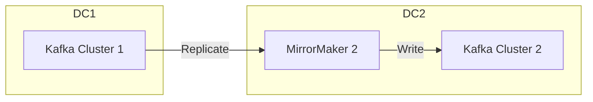

# Kafka Operations

Learn to deploy, manage, and secure Kafka clusters in production environments. Running Kafka in production is like running a commercial airline: the mechanics of flight are well understood, but operational discipline -- monitoring, maintenance, capacity planning, and incident response -- is what separates a smooth operation from a disaster.

---

## Cluster Architecture

A production Kafka cluster typically consists of:
- **3+ Brokers**: For availability and replication.
- **3+ Zookeeper Nodes** (or KRaft controllers): For cluster coordination.


```mermaid
graph TD
    subgraph Zookeeper Cluster
        Z1[ZK 1] --- Z2[ZK 2] --- Z3[ZK 3]
    end
    
    subgraph Kafka Cluster
        B1[Broker 1]
        B2[Broker 2]
        B3[Broker 3]
    end
    
    B1 -.-> Z1
    B2 -.-> Z2
    B3 -.-> Z3
```

### Key Configurations (`server.properties`)

| Property | Description | Recommended | Why |
|----------|-------------|-------------|-----|
| `broker.id` | Unique integer ID | Unique per broker | Identifies the broker in metadata. Cannot be changed after data is written. |
| `log.dirs` | Where data is stored | Separate disk/mount | Dedicated disks avoid I/O contention with OS or application logs. Use multiple dirs for JBOD. |
| `num.partitions` | Default partitions for auto-created topics | 3 | Only matters if `auto.create.topics.enable=true` (which it should not be in production). |
| `default.replication.factor` | Default replication for auto-created topics | 3 | RF=3 survives one broker failure with no data loss. |
| `min.insync.replicas` | Min replicas that must ack a write | 2 | With RF=3, this ensures writes survive one broker failure. Set to 1 and you risk silent data loss. |
| `auto.create.topics.enable` | Create topics on first produce/consume | `false` (Production) | A typo in a topic name silently creates a new topic. Debugging "where did my messages go?" at 3 AM is not fun. |

---

## High Availability & Replication

### Replication Factor
- **RF=3**: Standard for production. Allows 1 broker failure with no data loss.
- **Min ISR=2**: Ensures data is written to at least 2 brokers before ack.

### In-Sync Replicas (ISR)
Replicas that are caught up with the leader.
- If a follower falls too far behind, it's removed from ISR.
- If leader fails, only a member of ISR can become new leader.

---

## Monitoring & Observability

### Key Metrics (JMX)

<CardGroup cols={2}>
  <Card title="Under Replicated Partitions" icon="triangle-exclamation">
    **Critical**: Should be 0. >0 means data isn't fully replicated.
  </Card>
  <Card title="Active Controller Count" icon="crown">
    **Critical**: Should be 1 per cluster.
  </Card>
  <Card title="Offline Partitions" icon="ban">
    **Critical**: >0 means data is unavailable.
  </Card>
  <Card title="Request Latency" icon="stopwatch">
    Time to process produce/fetch requests.
  </Card>
</CardGroup>

### Consumer Lag
The most important metric for consumers.
- **Lag**: Difference between latest offset and consumer offset.
- **Monitoring**: Use `kafka-consumer-groups.sh` or tools like Prometheus/Grafana.

```bash
# Check lag
bin/kafka-consumer-groups.sh --bootstrap-server localhost:9092 --describe --group my-group
```

---

## Security

### 1. Encryption (SSL/TLS)
Encrypts data in transit between clients and brokers, and between brokers. Without TLS, every message is sent in plain text over the network -- including any sensitive data your applications produce. In regulated environments (PCI, HIPAA, SOC2), encryption in transit is mandatory.

```properties
# server.properties -- TLS configuration for broker-to-client encryption.
# In production, also enable inter-broker TLS with a separate listener.
listeners=SSL://:9093
# JKS keystore containing the broker's private key and certificate.
# Generate with: keytool -genkey -keyalg RSA -keystore server.keystore.jks
ssl.keystore.location=/var/private/ssl/server.keystore.jks
ssl.keystore.password=test1234      # Use a secret manager in production, not plaintext
ssl.key.password=test1234           # Password for the private key within the keystore
# Truststore contains the CA certificate(s) used to verify client certificates.
# Both brokers and clients need a truststore to verify each other's identity.
ssl.truststore.location=/var/private/ssl/server.truststore.jks
ssl.truststore.password=test1234
```

<Tip>
**Production gotcha**: TLS adds CPU overhead for encryption/decryption. On high-throughput clusters (100K+ messages/sec), this can increase produce latency by 20-40%. Benchmark with and without TLS to size your brokers appropriately. Modern CPUs with AES-NI hardware acceleration minimize this impact.
</Tip>

### 2. Authentication (SASL)
Verifies identity of clients.
- **SASL/PLAIN**: Username/Password.
- **SASL/SCRAM**: Salted Challenge Response (More secure).
- **SASL/GSSAPI (Kerberos)**: Enterprise integration.

### 3. Authorization (ACLs)
Controls what authenticated users can do. ACLs follow the principle of least privilege: deny everything by default, then grant specific permissions to specific principals.

```bash
# Allow 'alice' to write to 'finance-topic'.
# Without this ACL, alice gets "TopicAuthorizationException" on produce.
bin/kafka-acls.sh --bootstrap-server localhost:9092 --add \
    --allow-principal User:alice \
    --operation Write \
    --topic finance-topic

# Allow the 'analytics' consumer group to read from all topics prefixed with 'events-'
# The --resource-pattern-type prefixed flag is powerful for topic naming conventions.
bin/kafka-acls.sh --bootstrap-server localhost:9092 --add \
    --allow-principal User:analytics-service \
    --operation Read \
    --topic events- \
    --resource-pattern-type prefixed \
    --group analytics-group
```

---

## Troubleshooting

Kafka troubleshooting follows a systematic pattern: check the obvious first (disk, network, logs), then move to cluster-level health (ISR, controller), then application-level issues (consumer lag, producer errors).

### Broker Failure
1. **Check Logs**: `/var/log/kafka/server.log`. Look for `FATAL` or `ERROR` entries. The most common causes are disk failures, OOM kills, and GC pauses.
2. **Check Disk**: Is disk full? Kafka stops accepting writes when disk is full. This is the single most common cause of production Kafka outages. Run `df -h` on broker hosts and set alerts at 80% capacity.
3. **Check ZooKeeper/KRaft Connectivity**: Is the broker connected to the coordination layer? Run `echo ruok | nc zk-host 2181` for ZooKeeper, or check KRaft controller logs for lost quorum.
4. **Check Under-Replicated Partitions**: `kafka-topics.sh --describe --under-replicated-partitions`. If a broker is slow (not dead), you will see its partitions falling out of ISR before the broker actually fails.

### Consumer Issues
- **Stuck Consumer (Rebalance Storm)**: Check if rebalancing is happening constantly ("stop-the-world"). Common causes: GC pauses exceeding `session.timeout.ms`, slow processing exceeding `max.poll.interval.ms`, or a consumer that keeps crashing and rejoining. Check `kafka-consumer-groups.sh --describe` and look for rapidly changing partition assignments.
- **High Lag**: Consumer is too slow. Diagnose: is the bottleneck CPU (processing), I/O (database writes), or network (large messages)? Solutions ranked by effort: (1) Increase `max.poll.records` and batch database writes, (2) Optimize processing logic, (3) Add more partitions and consumer instances, (4) Consider async processing with a local buffer.
- **Duplicate Processing**: Usually caused by offsets being committed too late (consumer crashes after processing but before committing). Make your processing idempotent (e.g., upsert instead of insert, deduplicate by message ID).

### Data Loss Scenarios
- **Unclean Leader Election**: If all ISRs fail, a non-ISR replica becomes leader (data loss). Config: `unclean.leader.election.enable=false` (Default). This means the partition becomes unavailable rather than losing data -- availability is sacrificed for durability.
- **Producer acks=1**: Leader accepts write but crashes before replicating. Config: `acks=all`. This is the most common misconfiguration that leads to data loss in production.
- **min.insync.replicas=1 with RF=2**: Only one copy exists after a single broker failure. Config: RF=3, `min.insync.replicas=2`. This is the minimum safe configuration for production data.

---

## Maintenance Tasks

### Rebalancing Partitions
When adding new brokers, partitions don't automatically move. Use `kafka-reassign-partitions.sh`.

### Log Compaction
For topics where only the *latest* value for a key matters (e.g., user profile updates).
- Config: `cleanup.policy=compact`.

---

## Log Compaction Deep Dive

Log compaction ensures Kafka retains the **latest value for each key**, rather than retaining by time.

### How It Works

```
Before Compaction:
offset: 0  1  2  3  4  5  6  7
key:    A  B  A  C  B  A  C  B
value:  v1 v1 v2 v1 v2 v3 v2 v3

After Compaction:
offset: 5  6  7
key:    A  C  B
value:  v3 v2 v3
```

### Configuration

```properties
# Topic-level
cleanup.policy=compact
min.cleanable.dirty.ratio=0.5   # Compact when 50% is "dirty"
delete.retention.ms=86400000    # Keep tombstones for 24h
```

### Tombstones (Deletes)

To delete a key, produce a message with `null` value:

```java
producer.send(new ProducerRecord<>("topic", "key-to-delete", null));
```

The tombstone is kept for `delete.retention.ms`, then removed during compaction.

<Warning>
**Interview Tip**: Compacted topics are ideal for:
- Changelogs (database CDC)
- Configuration/feature flags
- User profile caches
- KTable backing in Kafka Streams
</Warning>

---

## Retention Strategies

### Time-Based Retention

```properties
retention.ms=604800000          # 7 days
retention.bytes=-1               # Unlimited size
```

### Size-Based Retention

```properties
retention.ms=-1                  # Unlimited time
retention.bytes=1073741824       # 1GB per partition
```

### Combined

```properties
retention.ms=604800000           # 7 days OR
retention.bytes=1073741824       # 1GB, whichever comes first
```

---

## Disaster Recovery

### Multi-Datacenter Replication

| Tool | Description |
|------|-------------|
| **MirrorMaker 2** | Kafka-native, replicates topics between clusters |
| **Confluent Replicator** | Commercial, more features |
| **Cluster Linking** | Confluent Cloud, byte-for-byte replication |

### MirrorMaker 2 Architecture


```mermaid
graph LR
    subgraph DC1
        K1[Kafka Cluster 1]
    end
    
    subgraph DC2
        MM[MirrorMaker 2]
        K2[Kafka Cluster 2]
    end
    
    K1 -->|Replicate| MM
    MM -->|Write| K2
```

### Backup Strategies

1. **Regular Backups**: Use tools like Kafka Connect to S3
2. **Topic Mirroring**: MirrorMaker 2 to standby cluster
3. **Retention Policy**: Set high retention for critical topics

---

## Performance Tuning

### Broker Tuning

```properties
# Socket buffers: increase for high-throughput, cross-datacenter replication.
# Default is OS-dependent (~128KB). Increase to match your network bandwidth.
socket.send.buffer.bytes=102400
socket.receive.buffer.bytes=102400

# Network threads handle reading requests from the socket.
# I/O threads handle writing to disk and replication.
# Rule of thumb: num.network.threads = number of NICs or cores (whichever is smaller).
# num.io.threads = number of disks * 2.
num.io.threads=8
num.network.threads=3

# Log flush settings: how often Kafka flushes data from OS page cache to disk.
# WARNING: Setting these too aggressively hurts throughput. Kafka relies on
# replication (not fsync) for durability. In most production setups, leave
# these at defaults and let the OS manage flushing.
log.flush.interval.messages=10000   # Flush after N messages (default: Long.MAX_VALUE)
log.flush.interval.ms=1000          # Flush every N ms (default: Long.MAX_VALUE)
```

### Producer Tuning

```properties
# Batching: the #1 lever for throughput. Larger batches = fewer network round trips.
batch.size=16384           # 16KB max batch size per partition
linger.ms=5                # Wait up to 5ms to fill the batch before sending.
                           # 0 = send immediately (lowest latency, worst throughput).
                           # 5-20ms is a good tradeoff for most workloads.

# Compression: reduces network and disk I/O at the cost of CPU.
# lz4 = best compression speed. zstd = best compression ratio. snappy = balanced.
compression.type=lz4

# Buffer memory: total memory available for batching across all partitions.
# If this fills up, producer.send() blocks for max.block.ms then throws.
buffer.memory=33554432     # 32MB. Increase for high-throughput producers.
```

### Consumer Tuning

```properties
# Fetch settings: control how aggressively the consumer pulls data.
fetch.min.bytes=1024       # Wait for 1KB of data before returning a fetch response.
                           # Higher = better throughput, higher latency.
fetch.max.wait.ms=500      # Maximum wait time for fetch.min.bytes to be satisfied.
                           # fetch completes when EITHER condition is met.
max.partition.fetch.bytes=1048576  # 1MB per partition per fetch. Increase for
                                   # large messages or high-throughput topics.
```

---

## Interview Questions & Answers

<AccordionGroup>
  <Accordion title="How do you monitor a Kafka cluster?" icon="circle-question">
    **Key Metrics to Monitor:**
    1. **Under-replicated partitions**: Should be 0
    2. **Active Controller Count**: Should be 1
    3. **Offline Partitions**: Should be 0
    4. **Request Latency**: Produce/Fetch p99
    5. **Consumer Lag**: Per consumer group
    
    **Tools:**
    - JMX + Prometheus + Grafana
    - Confluent Control Center
    - Burrow (consumer lag)
    - Cruise Control (auto-rebalancing)
  </Accordion>
  
  <Accordion title="How do you add a new broker to a cluster?" icon="circle-question">
    1. Configure new broker with unique `broker.id`
    2. Point to same ZooKeeper/KRaft controllers
    3. Start the broker
    4. **Partitions don't auto-move!** Use `kafka-reassign-partitions.sh`
    
    ```bash
    # Generate reassignment plan
    kafka-reassign-partitions.sh --generate \
      --topics-to-move-json-file topics.json \
      --broker-list "1,2,3,4"
    
    # Execute reassignment
    kafka-reassign-partitions.sh --execute \
      --reassignment-json-file plan.json
    ```
  </Accordion>
  
  <Accordion title="What is log compaction and when would you use it?" icon="circle-question">
    Log compaction keeps only the **latest value per key**, not by time.
    
    **Use Cases:**
    - Database changelog (CDC)
    - User profile cache
    - Configuration store
    - KTable backing store
    
    **Config:** `cleanup.policy=compact`
  </Accordion>
  
  <Accordion title="How do you handle a broker failure?" icon="circle-question">
    1. **Automatic**: Controller elects new leaders from ISR
    2. **Check Under-Replicated Partitions**: If > 0, replication is catching up
    3. **Bring broker back**: It will rejoin and catch up
    4. **If disk failed**: May need to reassign partitions
    
    **Prevent data loss:**
    - RF=3, min.insync.replicas=2
    - acks=all on producers
    - unclean.leader.election.enable=false
  </Accordion>
  
  <Accordion title="How do you upgrade Kafka without downtime?" icon="circle-question">
    **Rolling Upgrade Process:**
    1. Set `inter.broker.protocol.version` to current version
    2. Upgrade brokers one at a time (preferred replicas first)
    3. After all brokers upgraded, bump protocol version
    4. Upgrade clients (consumers first, then producers)
    
    **Key**: Never skip versions. 2.x → 3.0 → 3.5, not 2.x → 3.5
  </Accordion>
  
  <Accordion title="What is Cruise Control?" icon="circle-question">
    An open-source tool for Kafka cluster management:
    - **Auto-rebalancing**: Moves partitions for even load
    - **Self-healing**: Handles broker failures
    - **Goal-based optimization**: CPU, disk, network balance
    
    Reduces operational burden of managing large clusters.
  </Accordion>
</AccordionGroup>

---

## Common Pitfalls

<Warning>
**1. Disk Full**: Kafka stops accepting writes. Monitor disk usage and set retention appropriately.

**2. Under-Replicated Partitions**: Indicates slow broker or network issues. Don't ignore!

**3. Skipping Versions**: Can cause data corruption. Always follow upgrade path.

**4. No Monitoring**: Without metrics, you're flying blind. Set up alerting on key metrics.

**5. Manual Partition Management**: Use Cruise Control for large clusters to avoid imbalanced load.
</Warning>

---

**Congratulations!** You have completed the Kafka Crash Course.

Next: [Kubernetes Crash Course →](/courses/devops-tools/kubernetes-overview)
