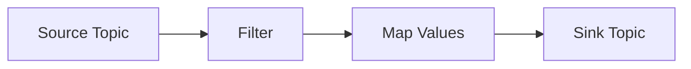
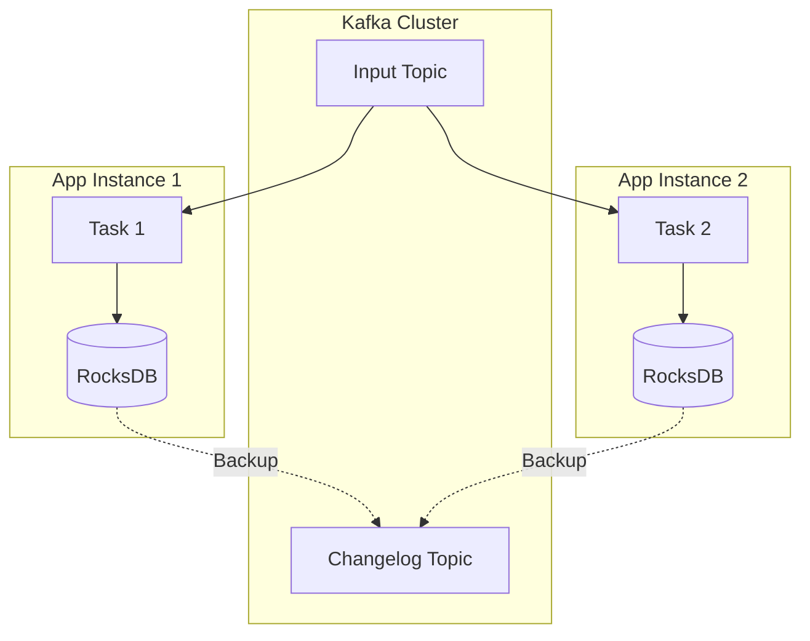

# Kafka Streams

Build real-time stream processing applications with the Kafka Streams API and ksqlDB.

---

## What is Kafka Streams?

Kafka Streams is a client library for building applications and microservices, where the input and output data are stored in Kafka clusters.

<CardGroup cols={2}>
  <Card title="Library, not Cluster" icon="book">
    Runs in your application (Java/Scala), not on Kafka brokers
  </Card>
  <Card title="Scalable" icon="arrows-maximize">
    Elastic scaling based on partitions
  </Card>
  <Card title="Stateful" icon="database">
    Built-in state management (RocksDB)
  </Card>
  <Card title="Exactly-Once" icon="check-double">
    Guaranteed processing semantics
  </Card>
</CardGroup>

---

## Core Concepts

### Streams vs Tables

- **KStream**: An infinite stream of records (insert-only).
  - Example: Credit card transactions.
- **KTable**: A changelog stream (upsert). Represents the *current state*.
  - Example: User account balances.

### Topology
A graph of processing nodes (sources, processors, sinks).



---

## Kafka Streams API (Java)

### Stateless Transformations
Operations that don't require memory of previous events (e.g., filter, map).

```java
Properties props = new Properties();
props.put(StreamsConfig.APPLICATION_ID_CONFIG, "my-stream-app");
props.put(StreamsConfig.BOOTSTRAP_SERVERS_CONFIG, "localhost:9092");
props.put(StreamsConfig.DEFAULT_KEY_SERDE_CLASS_CONFIG, Serdes.String().getClass());
props.put(StreamsConfig.DEFAULT_VALUE_SERDE_CLASS_CONFIG, Serdes.String().getClass());

StreamsBuilder builder = new StreamsBuilder();
KStream<String, String> source = builder.stream("input-topic");

// Filter and Map
source.filter((key, value) -> value.contains("important"))
      .mapValues(value -> value.toUpperCase())
      .to("output-topic");

KafkaStreams streams = new KafkaStreams(builder.build(), props);
streams.start();
```

### Stateful Transformations
Operations that require state (e.g., count, aggregate, join).

```java
// Word Count Example
KStream<String, String> textLines = builder.stream("text-input");

KTable<String, Long> wordCounts = textLines
    .flatMapValues(textLine -> Arrays.asList(textLine.toLowerCase().split("\\W+")))
    .groupBy((key, word) -> word)
    .count(Materialized.as("counts-store"));

wordCounts.toStream().to("word-counts-output", Produced.with(Serdes.String(), Serdes.Long()));
```

---

## ksqlDB: Streaming SQL

ksqlDB allows you to write stream processing applications using SQL syntax.

### Create a Stream

```sql
CREATE STREAM user_clicks (
    user_id VARCHAR,
    url VARCHAR,
    timestamp VARCHAR
) WITH (
    KAFKA_TOPIC = 'user_clicks_topic',
    VALUE_FORMAT = 'JSON'
);
```

### Create a Table (State)

```sql
CREATE TABLE user_locations (
    user_id VARCHAR PRIMARY KEY,
    city VARCHAR
) WITH (
    KAFKA_TOPIC = 'user_locations_topic',
    VALUE_FORMAT = 'JSON'
);
```

### Stream-Table Join

```sql
-- Enrich clicks with user location
CREATE STREAM enriched_clicks AS
SELECT 
    c.user_id, 
    c.url, 
    l.city
FROM user_clicks c
LEFT JOIN user_locations l ON c.user_id = l.user_id;
```

### Windowed Aggregation

```sql
-- Count clicks per user per minute
CREATE TABLE clicks_per_minute AS
SELECT 
    user_id, 
    COUNT(*) AS click_count
FROM user_clicks
WINDOW TUMBLING (SIZE 1 MINUTE)
GROUP BY user_id
EMIT CHANGES;
```

---

## Architecture

### Partitioning & Scaling
Kafka Streams automatically handles load balancing. If you run multiple instances of your application, they will share the partitions of the input topics.

### State Stores
Stateful operations (like `count()`) use local **RocksDB** instances to store state on disk. This state is also backed up to a Kafka "changelog topic" for fault tolerance.



---

## Use Cases

1.  **Real-time Fraud Detection**: Filter and analyze transaction streams.
2.  **Enrichment**: Join data streams with static data (e.g., user profiles).
3.  **Monitoring**: Aggregate logs and metrics in real-time.
4.  **ETL**: Transform data before loading into a data warehouse.

---

Next: [Kafka Operations →](/courses/devops-tools/kafka-operations)
