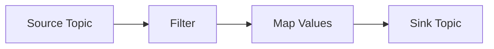
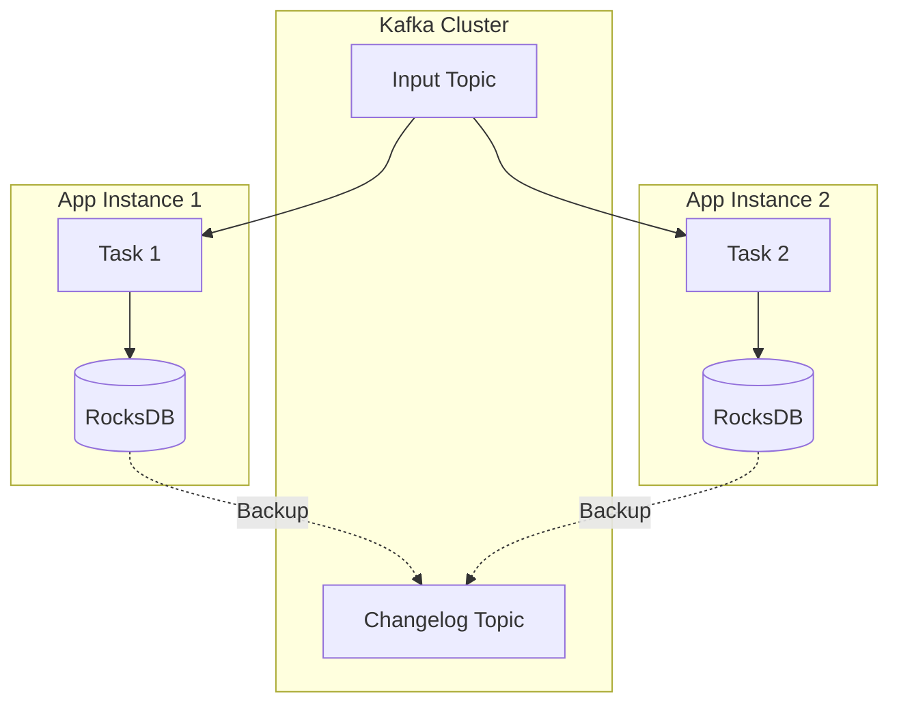

# Kafka Streams

Build real-time stream processing applications with the Kafka Streams API and ksqlDB.

---

## What is Kafka Streams?

Kafka Streams is a client library for building applications and microservices, where the input and output data are stored in Kafka clusters. Think of it as a spreadsheet that updates itself in real time: instead of running a batch job to recompute totals every night, Kafka Streams continuously processes events the moment they arrive. Unlike Spark or Flink, there is no separate cluster to manage -- Kafka Streams runs inside your application, the same way a JDBC driver runs inside your app. You scale by running more instances of your application, and Kafka handles partition assignment automatically.

<CardGroup cols={2}>
  <Card title="Library, not Cluster" icon="book">
    Runs in your application (Java/Scala), not on Kafka brokers
  </Card>
  <Card title="Scalable" icon="arrows-maximize">
    Elastic scaling based on partitions
  </Card>
  <Card title="Stateful" icon="database">
    Built-in state management (RocksDB)
  </Card>
  <Card title="Exactly-Once" icon="check-double">
    Guaranteed processing semantics
  </Card>
</CardGroup>

---

## Core Concepts

### Streams vs Tables

The duality between streams and tables is the single most important concept in stream processing. Think of it like this: a bank statement (stream) is a list of every deposit and withdrawal. Your account balance (table) is the result of applying all those transactions. You can always derive one from the other.

- **KStream**: An infinite stream of records (insert-only). Each record is a fact that happened -- it does not replace previous records with the same key.
  - Example: Credit card transactions. Two purchases by the same user are two separate events.
- **KTable**: A changelog stream (upsert). Represents the *current state* for each key. New records with the same key replace older ones.
  - Example: User account balances. You only care about the latest balance, not every intermediate state.

### Topology
A graph of processing nodes (sources, processors, sinks).


```mermaid
graph LR
    Source[Source Topic] --> Filter[Filter]
    Filter --> Map[Map Values]
    Map --> Sink[Sink Topic]
```

---

## Kafka Streams API (Java)

### Stateless Transformations
Operations that don't require memory of previous events (e.g., filter, map). These are the cheapest operations in stream processing because they examine each record in isolation -- no state store, no disk I/O, no checkpoint overhead. If your logic can be expressed as a stateless transformation, prefer it.

```java
Properties props = new Properties();
// APPLICATION_ID_CONFIG serves as the consumer group ID and the prefix
// for internal changelog topics. Choose a stable, descriptive name --
// changing it later means losing all committed offsets and state stores.
props.put(StreamsConfig.APPLICATION_ID_CONFIG, "my-stream-app");
props.put(StreamsConfig.BOOTSTRAP_SERVERS_CONFIG, "localhost:9092");
// Serdes (Serializer/Deserializer) tell Kafka Streams how to convert
// bytes on the wire into Java objects. Mismatched serdes are the #1
// cause of cryptic deserialization errors in production.
props.put(StreamsConfig.DEFAULT_KEY_SERDE_CLASS_CONFIG, Serdes.String().getClass());
props.put(StreamsConfig.DEFAULT_VALUE_SERDE_CLASS_CONFIG, Serdes.String().getClass());

StreamsBuilder builder = new StreamsBuilder();
KStream<String, String> source = builder.stream("input-topic");

// Filter keeps only records matching the predicate, then mapValues
// transforms the value without changing the key (preserving partitioning).
// Using mapValues instead of map is intentional -- map can re-partition
// data, which triggers an internal repartition topic and hurts performance.
source.filter((key, value) -> value.contains("important"))
      .mapValues(value -> value.toUpperCase())
      .to("output-topic");

KafkaStreams streams = new KafkaStreams(builder.build(), props);
streams.start();
```

### Stateful Transformations
Operations that require state (e.g., count, aggregate, join). These are where Kafka Streams truly shines -- and where most of the complexity lives. Under the hood, each stateful operation creates a local RocksDB instance and a changelog topic in Kafka. The changelog topic is your safety net: if the application crashes, a new instance can restore state by replaying the changelog.

```java
// Word Count Example -- the "Hello World" of stream processing.
// Despite its simplicity, this demonstrates the full stateful pipeline:
// split -> rekey -> group -> aggregate -> materialize.
KStream<String, String> textLines = builder.stream("text-input");

KTable<String, Long> wordCounts = textLines
    // flatMapValues emits zero or more output records per input record.
    // Splitting text into words means one input line produces many output records.
    .flatMapValues(textLine -> Arrays.asList(textLine.toLowerCase().split("\\W+")))
    // groupBy re-keys the stream by the word itself. WARNING: this triggers
    // a repartition (internal topic + network shuffle). For high-volume streams,
    // this is the most expensive step in the pipeline.
    .groupBy((key, word) -> word)
    // count() creates a state store named "counts-store" backed by RocksDB.
    // The Materialized parameter makes this store queryable via Interactive Queries.
    .count(Materialized.as("counts-store"));

// Convert the KTable back to a KStream for writing to an output topic.
// KTable changes are emitted as update events (same key = overwrite).
wordCounts.toStream().to("word-counts-output", Produced.with(Serdes.String(), Serdes.Long()));
```

---

## ksqlDB: Streaming SQL

ksqlDB allows you to write stream processing applications using SQL syntax. If Kafka Streams is a general-purpose programming language, ksqlDB is a domain-specific language -- it trades flexibility for dramatically lower development effort. For teams where data engineers know SQL but not Java, ksqlDB can reduce stream processing development time from weeks to hours.

### Create a Stream

```sql
-- Create a stream over an existing Kafka topic.
-- This is a schema declaration, not a data copy. No data moves.
-- The stream is a continuous, unbounded view of events as they arrive.
CREATE STREAM user_clicks (
    user_id VARCHAR,     -- Maps to JSON field "user_id"
    url VARCHAR,         -- Maps to JSON field "url"
    timestamp VARCHAR    -- Maps to JSON field "timestamp"
) WITH (
    KAFKA_TOPIC = 'user_clicks_topic',   -- Must match an existing topic name
    VALUE_FORMAT = 'JSON'                -- Also supports AVRO, PROTOBUF
);
```

### Create a Table (State)

```sql
-- A TABLE in ksqlDB is the stream/table duality in action.
-- The underlying topic is treated as a changelog: for each user_id,
-- only the latest record matters. This is how you model "current state."
CREATE TABLE user_locations (
    user_id VARCHAR PRIMARY KEY,  -- PRIMARY KEY is required for tables
    city VARCHAR
) WITH (
    KAFKA_TOPIC = 'user_locations_topic',
    VALUE_FORMAT = 'JSON'
);
```

### Stream-Table Join

```sql
-- Enrich clicks with user location in real time.
-- This is one of the most powerful patterns in stream processing:
-- join a fast-moving event stream against a slowly-changing lookup table.
-- The result is a new stream (CREATE STREAM, not TABLE) because each
-- click event produces exactly one enriched output event.
CREATE STREAM enriched_clicks AS
SELECT 
    c.user_id, 
    c.url, 
    l.city
FROM user_clicks c
LEFT JOIN user_locations l ON c.user_id = l.user_id;
```

### Windowed Aggregation

```sql
-- Count clicks per user per minute using a tumbling window.
-- Tumbling windows are fixed-size, non-overlapping time intervals.
-- A HOPPING window would overlap (e.g., 5-minute window every 1 minute).
-- A SESSION window groups events by inactivity gaps.
CREATE TABLE clicks_per_minute AS
SELECT 
    user_id, 
    COUNT(*) AS click_count
FROM user_clicks
WINDOW TUMBLING (SIZE 1 MINUTE)
GROUP BY user_id
EMIT CHANGES;   -- Emit updates as they happen, not just final results
```

---

## Architecture

### Partitioning & Scaling
Kafka Streams automatically handles load balancing. If you run multiple instances of your application, they will share the partitions of the input topics. The maximum parallelism equals the number of input partitions -- if your topic has 12 partitions, you can run up to 12 stream tasks across however many application instances you want. This is the same consumer group model you already know, which means scaling a Kafka Streams app is identical to scaling a consumer group: just start more instances.

### State Stores
Stateful operations (like `count()`) use local **RocksDB** instances to store state on disk. This state is also backed up to a Kafka "changelog topic" for fault tolerance. Think of it as a local database with an automatic backup to Kafka -- if an instance crashes and restarts on a different machine, it rebuilds its local state by replaying the changelog topic. This is why Kafka Streams can be stateful without requiring an external database.


```mermaid
graph TD
    subgraph App Instance 1
        Task1[Task 1] --> Store1[(RocksDB)]
    end
    subgraph App Instance 2
        Task2[Task 2] --> Store2[(RocksDB)]
    end
    subgraph Kafka Cluster
        Topic[Input Topic]
        Changelog[Changelog Topic]
    end
    
    Topic --> Task1
    Topic --> Task2
    Store1 -.->|Backup| Changelog
    Store2 -.->|Backup| Changelog
```

---

## Use Cases

1.  **Real-time Fraud Detection**: Filter and analyze transaction streams. Flag transactions that exceed a threshold within a time window (e.g., more than 5 purchases in 60 seconds from the same card).
2.  **Enrichment**: Join a fast-moving event stream with a slowly-changing lookup table (e.g., enrich click events with user profile data). This replaces what would otherwise be a database lookup on every event.
3.  **Monitoring**: Aggregate logs and metrics in real-time. Build dashboards that show request counts, error rates, and latency percentiles without waiting for a batch pipeline.
4.  **ETL**: Transform, filter, and reshape data before loading into a data warehouse. Unlike traditional batch ETL, data arrives in the warehouse within seconds of being produced.

---

## Kafka Streams vs Flink vs Spark Streaming

| Feature | Kafka Streams | Apache Flink | Spark Structured Streaming |
|---------|--------------|-------------|---------------------------|
| **Deployment** | Library (no cluster) | Dedicated cluster | Spark cluster |
| **Latency** | Milliseconds | Milliseconds | Seconds to minutes |
| **State Management** | RocksDB + changelog | RocksDB + checkpoints | In-memory + checkpoint |
| **Exactly-Once** | Yes (Kafka-only) | Yes (any source/sink) | Yes (with limitations) |
| **Language** | Java/Scala | Java/Scala/Python/SQL | Scala/Java/Python/SQL |
| **Best For** | Kafka-to-Kafka pipelines | Complex event processing | Batch + streaming unification |

**The honest take**: If your input and output are both Kafka, Kafka Streams is the simplest choice -- no cluster to manage, no separate deployment, and the exactly-once guarantees are native. If you need to read from non-Kafka sources, or you need advanced event-time processing with complex watermarks, Flink is the better tool. Spark Structured Streaming occupies a middle ground and is strongest when your team already runs Spark for batch.

---

## Common Pitfalls

<Warning>
**1. Changing the APPLICATION_ID**: The application ID is tied to consumer group offsets and internal topic names. Changing it means losing all state and reprocessing from scratch. Treat it like a database name -- pick it carefully and never change it in production.

**2. Ignoring RocksDB Tuning**: The default RocksDB configuration works for small state stores, but falls over at scale. If your state exceeds a few GB per instance, you need to tune block cache size, write buffer size, and compaction settings. Monitor RocksDB metrics via JMX.

**3. Using map() When mapValues() Suffices**: `map()` changes the key, which triggers a repartition (internal topic + network shuffle). `mapValues()` preserves the key and avoids repartitioning entirely. Only use `map()` when you genuinely need to change the key.

**4. Not Monitoring State Store Size**: State stores grow as your data grows. If a state store exceeds available disk, the application crashes. Set up alerts on disk usage for any machine running Kafka Streams.

**5. Forgetting Graceful Shutdown**: Call `streams.close()` on application shutdown. Without it, the consumer group takes `session.timeout.ms` to detect the dead instance and trigger a rebalance, causing a processing gap.
</Warning>

---

## Key Takeaways

- Kafka Streams is a **library**, not a cluster. It runs inside your application.
- **KStream** (events) and **KTable** (state) are dual representations of the same data.
- **Stateless** operations (filter, map) are cheap. **Stateful** operations (count, join) use RocksDB and changelog topics.
- ksqlDB gives you SQL over streams -- ideal for simple transformations without writing Java.
- Maximum parallelism equals the number of input partitions.
- For Kafka-to-Kafka pipelines, Kafka Streams is the simplest production choice. For non-Kafka sources or complex event-time processing, consider Flink.

---

Next: [Kafka Operations →](/courses/devops-tools/kafka-operations)
