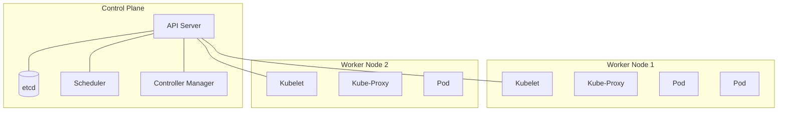

# Kubernetes Fundamentals

Master the core concepts of Kubernetes (K8s) container orchestration and understand its architecture.

---

## What is Kubernetes?

Kubernetes is an open-source system for automating deployment, scaling, and management of containerized applications. It groups containers that make up an application into logical units for easy management and discovery.

<CardGroup cols={2}>
  <Card title="Orchestration" icon="conductor">
    Manages container lifecycle, scheduling, and health
  </Card>
  <Card title="Scaling" icon="arrows-maximize">
    Automatically scales apps up or down based on demand
  </Card>
  <Card title="Self-healing" icon="kit-medical">
    Restarts failed containers, replaces and kills containers that don't respond
  </Card>
  <Card title="Load Balancing" icon="scale-balanced">
    Distributes network traffic to maintain stability
  </Card>
</CardGroup>

---

## Kubernetes Architecture

A Kubernetes cluster consists of a **Control Plane** and a set of **Worker Nodes**.



### Control Plane Components
The "brain" of the cluster.
- **API Server**: The frontend for the K8s control plane. Exposes the Kubernetes API.
- **etcd**: Consistent and highly-available key value store for all cluster data.
- **Scheduler**: Watches for newly created Pods with no assigned node, and selects a node for them to run on.
- **Controller Manager**: Runs controller processes (e.g., Node Controller, Job Controller).

### Node Components
Run on every node, maintaining running pods and providing the Kubernetes runtime environment.
- **Kubelet**: An agent that runs on each node. It ensures that containers are running in a Pod.
- **Kube-Proxy**: Maintains network rules on nodes. Allows network communication to your Pods.
- **Container Runtime**: The software that is responsible for running containers (e.g., Docker, containerd).

---

## Core Objects

### 1. Pods
The smallest deployable unit in Kubernetes.
- Represents a single instance of a running process.
- Can contain one or more containers (usually one).
- Containers in a Pod share:
  - **Network**: Same IP address and port space (can talk via `localhost`).
  - **Storage**: Shared volumes.

### 2. Namespaces
Virtual clusters backed by the same physical cluster.
- Used to divide cluster resources between multiple users/teams.
- Examples: `default`, `kube-system`, `dev`, `prod`.

---

## kubectl Basics

`kubectl` is the command-line tool for communicating with the Kubernetes API server.

### Cluster Info & Navigation

```bash
# Check cluster status
kubectl cluster-info

# List all nodes
kubectl get nodes

# List all namespaces
kubectl get namespaces

# Set default namespace context
kubectl config set-context --current --namespace=dev
```

### Viewing Resources

```bash
# List pods in current namespace
kubectl get pods

# List pods with more details (IP, Node)
kubectl get pods -o wide

# List pods in all namespaces
kubectl get pods -A

# Describe a specific pod (Crucial for debugging!)
kubectl describe pod my-pod

# View pod logs
kubectl logs my-pod
kubectl logs my-pod -c my-container  # If multi-container
kubectl logs -f my-pod  # Follow logs
```

### Interacting with Pods

```bash
# Execute command inside a container
kubectl exec -it my-pod -- /bin/bash
kubectl exec -it my-pod -- /bin/sh  # If bash isn't available

# Port forward (Access pod from localhost)
kubectl port-forward my-pod 8080:80
```

---

## Creating Your First Pod

Kubernetes objects are typically defined in YAML files.

### Imperative (CLI)
Quick for testing, but not recommended for production.

```bash
kubectl run nginx --image=nginx:latest --restart=Never
```

### Declarative (YAML)
The "Infrastructure as Code" way.

```yaml
# nginx-pod.yaml
apiVersion: v1
kind: Pod
metadata:
  name: nginx-pod
  labels:
    app: web
    env: dev
spec:
  containers:
  - name: nginx
    image: nginx:1.21
    ports:
    - containerPort: 80
    resources:
      limits:
        memory: "128Mi"
        cpu: "500m"
```

**Apply the configuration:**

```bash
# Create/Update resource
kubectl apply -f nginx-pod.yaml

# Verify
kubectl get pods -l app=web

# Delete
kubectl delete -f nginx-pod.yaml
```

---

## Pod Lifecycle

1.  **Pending**: Pod accepted by system, but container image not yet created.
2.  **Running**: Pod bound to a node, all containers created, at least one running.
3.  **Succeeded**: All containers terminated successfully (exit code 0).
4.  **Failed**: All containers terminated, at least one with failure.
5.  **Unknown**: State cannot be obtained.

---

## Resource Management

Every container should have **resource requests and limits** defined.

### Requests vs Limits

| Concept | Description | Interview Insight |
|---------|-------------|-------------------|
| **Request** | Minimum resources guaranteed | Used by Scheduler to place pods |
| **Limit** | Maximum resources allowed | Enforced at runtime; OOMKilled if exceeded |

```yaml
resources:
  requests:
    memory: "64Mi"
    cpu: "250m"      # 0.25 CPU cores
  limits:
    memory: "128Mi"
    cpu: "500m"      # 0.5 CPU cores
```

<Warning>
**Common Interview Question**: What happens when a container exceeds its memory limit?
- The container is **OOMKilled** (Out of Memory Killed) by the kernel.
- If CPU limit is exceeded, the container is **throttled**, not killed.
</Warning>

### Quality of Service (QoS) Classes

Kubernetes assigns QoS classes based on resource settings:

| QoS Class | Condition | Eviction Priority |
|-----------|-----------|-------------------|
| **Guaranteed** | requests = limits (both CPU and memory) | Last to be evicted |
| **Burstable** | requests < limits, or only one is set | Middle priority |
| **BestEffort** | No requests or limits | First to be evicted |

---

## Health Probes (Critical for Interviews!)

Probes allow Kubernetes to know when to restart or route traffic to a container.

### Liveness Probe
"Is the container alive?" - If it fails, the container is **restarted**.

```yaml
livenessProbe:
  httpGet:
    path: /healthz
    port: 8080
  initialDelaySeconds: 15
  periodSeconds: 10
  failureThreshold: 3
```

### Readiness Probe
"Is the container ready to receive traffic?" - If it fails, the Pod is **removed from Service endpoints**.

```yaml
readinessProbe:
  httpGet:
    path: /ready
    port: 8080
  initialDelaySeconds: 5
  periodSeconds: 5
```

### Startup Probe
"Has the application started?" - For slow-starting apps. Disables liveness/readiness probes until it succeeds.

```yaml
startupProbe:
  httpGet:
    path: /healthz
    port: 8080
  failureThreshold: 30
  periodSeconds: 10
```

<Tip>
**Interview Tip**: Always explain the difference between liveness and readiness probes. Liveness restarts containers; Readiness controls traffic routing.
</Tip>

---

## etcd Deep Dive

**etcd** is the "source of truth" for Kubernetes. Understanding it is crucial for interviews.

### Key Facts

- **Distributed key-value store** using Raft consensus
- Stores all cluster state: Pods, Services, Secrets, ConfigMaps
- **Strongly consistent** - reads return the most recent write
- Typically runs as a **3 or 5 node cluster** (odd numbers for quorum)

### Common Interview Questions

<AccordionGroup>
  <Accordion title="What happens if etcd goes down?" icon="database">
    - Existing workloads **continue running** (kubelet manages local pods)
    - **No new operations** possible (no scheduling, no API calls)
    - Cluster is in **read-only mode** until etcd recovers
  </Accordion>
  
  <Accordion title="How is etcd backed up?" icon="download">
    ```bash
    ETCDCTL_API=3 etcdctl snapshot save snapshot.db \
      --endpoints=https://127.0.0.1:2379 \
      --cacert=/etc/kubernetes/pki/etcd/ca.crt \
      --cert=/etc/kubernetes/pki/etcd/server.crt \
      --key=/etc/kubernetes/pki/etcd/server.key
    ```
  </Accordion>
  
  <Accordion title="What is the quorum?" icon="users">
    Quorum = (n/2) + 1. For 3 nodes, quorum is 2. If you lose quorum, etcd becomes read-only.
  </Accordion>
</AccordionGroup>

---

## RBAC Basics

Role-Based Access Control (RBAC) regulates access to Kubernetes resources.

### Key Components

| Resource | Scope | Description |
|----------|-------|-------------|
| **Role** | Namespace | Defines permissions within a namespace |
| **ClusterRole** | Cluster-wide | Defines permissions across all namespaces |
| **RoleBinding** | Namespace | Binds Role to users/groups/service accounts |
| **ClusterRoleBinding** | Cluster-wide | Binds ClusterRole cluster-wide |

```yaml
# Role: Can read pods in "dev" namespace
apiVersion: rbac.authorization.k8s.io/v1
kind: Role
metadata:
  namespace: dev
  name: pod-reader
rules:
- apiGroups: [""]
  resources: ["pods"]
  verbs: ["get", "watch", "list"]
---
# RoleBinding: Bind to user "jane"
apiVersion: rbac.authorization.k8s.io/v1
kind: RoleBinding
metadata:
  name: read-pods
  namespace: dev
subjects:
- kind: User
  name: jane
  apiGroup: rbac.authorization.k8s.io
roleRef:
  kind: Role
  name: pod-reader
  apiGroup: rbac.authorization.k8s.io
```

---

## Pod Lifecycle

1.  **Pending**: Pod accepted by system, but container image not yet created.
2.  **Running**: Pod bound to a node, all containers created, at least one running.
3.  **Succeeded**: All containers terminated successfully (exit code 0).
4.  **Failed**: All containers terminated, at least one with failure.
5.  **Unknown**: State cannot be obtained.

---

## Interview Questions & Answers

<AccordionGroup>
  <Accordion title="What is the difference between a Pod and a Container?" icon="circle-question">
    A **Container** is a single running process with its own filesystem and network namespace.
    A **Pod** is a Kubernetes abstraction that can contain one or more containers that share:
    - Network namespace (same IP, communicate via localhost)
    - Storage volumes
    - Lifecycle (created and destroyed together)
  </Accordion>
  
  <Accordion title="How does the Kubernetes Scheduler work?" icon="circle-question">
    1. Watches for unscheduled Pods (via API Server)
    2. **Filtering**: Eliminates nodes that don't meet requirements (resources, taints, nodeSelector)
    3. **Scoring**: Ranks remaining nodes based on priorities (least utilized, affinity rules)
    4. **Binding**: Assigns Pod to the highest-scoring node
  </Accordion>
  
  <Accordion title="What is the difference between kubectl apply and kubectl create?" icon="circle-question">
    - **create**: Creates a resource. Fails if it already exists.
    - **apply**: Creates or updates a resource. Idempotent. Recommended for GitOps workflows.
  </Accordion>
  
  <Accordion title="How does Kubernetes handle node failures?" icon="circle-question">
    1. **Node Controller** marks node as `NotReady` after 40s of no heartbeat
    2. After `pod-eviction-timeout` (default 5min), pods are evicted
    3. **Deployment/ReplicaSet** controllers create replacement pods on healthy nodes
  </Accordion>
  
  <Accordion title="What is a sidecar container?" icon="circle-question">
    A container that runs alongside the main application container in the same Pod to provide supporting functionality:
    - **Logging**: Collects and ships logs (e.g., Fluentd sidecar)
    - **Service Mesh**: Handles networking (e.g., Envoy proxy in Istio)
    - **Security**: Handles TLS termination or secrets injection
  </Accordion>
</AccordionGroup>

---

## Key Takeaways

- **Control Plane** manages the cluster; **Nodes** run the applications.
- **Pods** are the atomic unit of scheduling.
- Use **Declarative (YAML)** configuration for reproducibility.
- Always define **resource requests and limits**.
- Implement **liveness and readiness probes** for production workloads.
- `kubectl describe` and `kubectl logs` are your best friends for debugging.

---

Next: [Kubernetes Workloads →](/courses/devops-tools/kubernetes-workloads)
