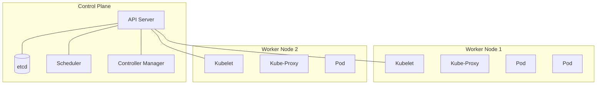

# Kubernetes Fundamentals

Master the core concepts of Kubernetes (K8s) container orchestration and understand its architecture.

---

## What is Kubernetes?

Kubernetes is an open-source system for automating deployment, scaling, and management of containerized applications. It groups containers that make up an application into logical units for easy management and discovery.

<CardGroup cols={2}>
  <Card title="Orchestration" icon="conductor">
    Manages container lifecycle, scheduling, and health
  </Card>
  <Card title="Scaling" icon="arrows-maximize">
    Automatically scales apps up or down based on demand
  </Card>
  <Card title="Self-healing" icon="kit-medical">
    Restarts failed containers, replaces and kills containers that don't respond
  </Card>
  <Card title="Load Balancing" icon="scale-balanced">
    Distributes network traffic to maintain stability
  </Card>
</CardGroup>

---

## Kubernetes Architecture

A Kubernetes cluster consists of a **Control Plane** and a set of **Worker Nodes**.



### Control Plane Components
The "brain" of the cluster.
- **API Server**: The frontend for the K8s control plane. Exposes the Kubernetes API.
- **etcd**: Consistent and highly-available key value store for all cluster data.
- **Scheduler**: Watches for newly created Pods with no assigned node, and selects a node for them to run on.
- **Controller Manager**: Runs controller processes (e.g., Node Controller, Job Controller).

### Node Components
Run on every node, maintaining running pods and providing the Kubernetes runtime environment.
- **Kubelet**: An agent that runs on each node. It ensures that containers are running in a Pod.
- **Kube-Proxy**: Maintains network rules on nodes. Allows network communication to your Pods.
- **Container Runtime**: The software that is responsible for running containers (e.g., Docker, containerd).

---

## Core Objects

### 1. Pods
The smallest deployable unit in Kubernetes.
- Represents a single instance of a running process.
- Can contain one or more containers (usually one).
- Containers in a Pod share:
  - **Network**: Same IP address and port space (can talk via `localhost`).
  - **Storage**: Shared volumes.

### 2. Namespaces
Virtual clusters backed by the same physical cluster.
- Used to divide cluster resources between multiple users/teams.
- Examples: `default`, `kube-system`, `dev`, `prod`.

---

## kubectl Basics

`kubectl` is the command-line tool for communicating with the Kubernetes API server.

### Cluster Info & Navigation

```bash
# Check cluster status
kubectl cluster-info

# List all nodes
kubectl get nodes

# List all namespaces
kubectl get namespaces

# Set default namespace context
kubectl config set-context --current --namespace=dev
```

### Viewing Resources

```bash
# List pods in current namespace
kubectl get pods

# List pods with more details (IP, Node)
kubectl get pods -o wide

# List pods in all namespaces
kubectl get pods -A

# Describe a specific pod (Crucial for debugging!)
kubectl describe pod my-pod

# View pod logs
kubectl logs my-pod
kubectl logs my-pod -c my-container  # If multi-container
kubectl logs -f my-pod  # Follow logs
```

### Interacting with Pods

```bash
# Execute command inside a container
kubectl exec -it my-pod -- /bin/bash
kubectl exec -it my-pod -- /bin/sh  # If bash isn't available

# Port forward (Access pod from localhost)
kubectl port-forward my-pod 8080:80
```

---

## Creating Your First Pod

Kubernetes objects are typically defined in YAML files.

### Imperative (CLI)
Quick for testing, but not recommended for production.

```bash
kubectl run nginx --image=nginx:latest --restart=Never
```

### Declarative (YAML)
The "Infrastructure as Code" way.

```yaml
# nginx-pod.yaml
apiVersion: v1
kind: Pod
metadata:
  name: nginx-pod
  labels:
    app: web
    env: dev
spec:
  containers:
  - name: nginx
    image: nginx:1.21
    ports:
    - containerPort: 80
    resources:
      limits:
        memory: "128Mi"
        cpu: "500m"
```

**Apply the configuration:**

```bash
# Create/Update resource
kubectl apply -f nginx-pod.yaml

# Verify
kubectl get pods -l app=web

# Delete
kubectl delete -f nginx-pod.yaml
```

---

## Pod Lifecycle

1.  **Pending**: Pod accepted by system, but container image not yet created.
2.  **Running**: Pod bound to a node, all containers created, at least one running.
3.  **Succeeded**: All containers terminated successfully (exit code 0).
4.  **Failed**: All containers terminated, at least one with failure.
5.  **Unknown**: State cannot be obtained.

---

## Key Takeaways

- **Control Plane** manages the cluster; **Nodes** run the applications.
- **Pods** are the atomic unit of scheduling.
- Use **Declarative (YAML)** configuration for reproducibility.
- `kubectl describe` and `kubectl logs` are your best friends for debugging.

---

Next: [Kubernetes Workloads →](/courses/devops-tools/kubernetes-workloads)
