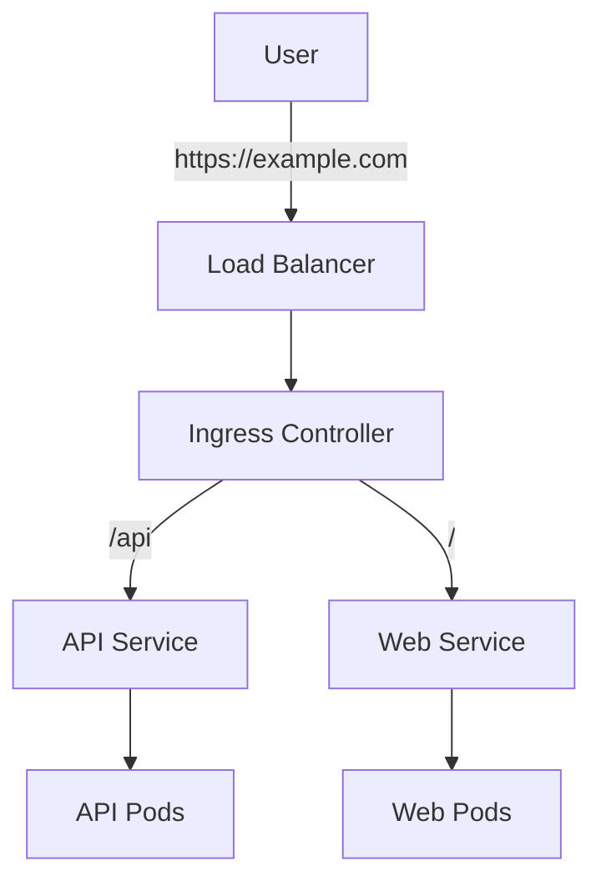

# Kubernetes Services

Learn how to expose your applications to the network and enable communication between microservices.

---

## Why Services?

Pods are **ephemeral**. They are created and destroyed, and their IP addresses change.
A **Service** provides a stable IP address and DNS name for a set of Pods.

<CardGroup cols={2}>
  <Card title="Stable IP" icon="anchor">
    Service IP never changes
  </Card>
  <Card title="Load Balancing" icon="scale-balanced">
    Distributes traffic across matching Pods
  </Card>
  <Card title="Service Discovery" icon="magnifying-glass">
    DNS names (e.g., `my-service.default.svc.cluster.local`)
  </Card>
  <Card title="Decoupling" icon="link-slash">
    Frontend talks to Backend Service, not individual Pods
  </Card>
</CardGroup>

---

## Service Types

### 1. ClusterIP (Default)
Exposes the Service on an **internal IP** in the cluster.
- Only reachable from within the cluster.
- Use case: Internal microservice communication (e.g., API talking to DB).

```yaml
apiVersion: v1
kind: Service
metadata:
  name: backend-service
spec:
  type: ClusterIP
  selector:
    app: backend
  ports:
  - port: 80        # Service Port
    targetPort: 8080 # Container Port
```

### 2. NodePort
Exposes the Service on each Node's IP at a static port (30000-32767).
- Reachable from outside the cluster via `<NodeIP>:<NodePort>`.
- Use case: Development, or when you don't have a Load Balancer.

```yaml
apiVersion: v1
kind: Service
metadata:
  name: frontend-service
spec:
  type: NodePort
  selector:
    app: frontend
  ports:
  - port: 80
    targetPort: 80
    nodePort: 30080
```

### 3. LoadBalancer
Exposes the Service externally using a cloud provider's Load Balancer (AWS ELB, Google Cloud LB).
- Use case: Production public-facing services.

```yaml
apiVersion: v1
kind: Service
metadata:
  name: public-service
spec:
  type: LoadBalancer
  selector:
    app: frontend
  ports:
  - port: 80
    targetPort: 80
```

### 4. ExternalName
Maps the Service to a DNS name (e.g., `foo.bar.example.com`).
- Use case: Accessing external services (like RDS) as if they were local services.

---

## Ingress

A Service (NodePort/LoadBalancer) exposes a **single** service.
**Ingress** exposes **multiple** services under a single IP address, using routing rules (path-based or host-based).

Requires an **Ingress Controller** (e.g., Nginx, Traefik) to be running in the cluster.



### Ingress Resource Example

```yaml
apiVersion: networking.k8s.io/v1
kind: Ingress
metadata:
  name: my-ingress
  annotations:
    nginx.ingress.kubernetes.io/rewrite-target: /
spec:
  rules:
  - host: myapp.com
    http:
      paths:
      - path: /api
        pathType: Prefix
        backend:
          service:
            name: api-service
            port:
              number: 80
      - path: /
        pathType: Prefix
        backend:
          service:
            name: web-service
            port:
              number: 80
```

---

## Service Discovery

Kubernetes has a built-in DNS server (CoreDNS).
Services get a DNS record in the format:
`my-service.my-namespace.svc.cluster.local`

### Example
If you have a pod in the `default` namespace, it can access the `database` service in the `prod` namespace via:
`database.prod`

---

## Key Takeaways

- Use **ClusterIP** for internal traffic.
- Use **LoadBalancer** (or Ingress) for public traffic.
- **Ingress** is a smart router for HTTP/HTTPS.
- Services provide **stable networking** for ephemeral pods.

---

Next: [Kubernetes Configuration →](/courses/devops-tools/kubernetes-config)
