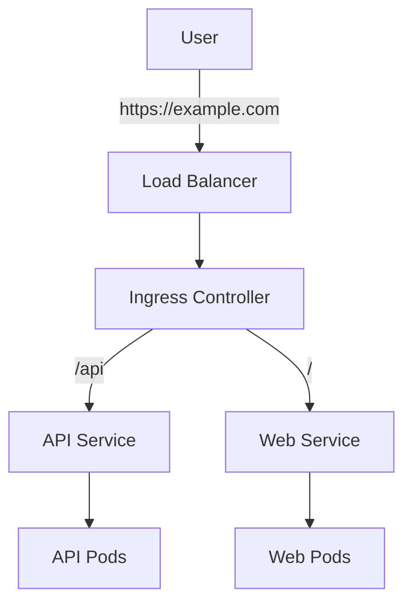

# Kubernetes Services

Learn how to expose your applications to the network and enable communication between microservices.

---

## Why Services?

Pods are **ephemeral**. They are created and destroyed, and their IP addresses change.
A **Service** provides a stable IP address and DNS name for a set of Pods.

<CardGroup cols={2}>
  <Card title="Stable IP" icon="anchor">
    Service IP never changes
  </Card>
  <Card title="Load Balancing" icon="scale-balanced">
    Distributes traffic across matching Pods
  </Card>
  <Card title="Service Discovery" icon="magnifying-glass">
    DNS names (e.g., `my-service.default.svc.cluster.local`)
  </Card>
  <Card title="Decoupling" icon="link-slash">
    Frontend talks to Backend Service, not individual Pods
  </Card>
</CardGroup>

---

## Service Types

### 1. ClusterIP (Default)
Exposes the Service on an **internal IP** in the cluster.
- Only reachable from within the cluster.
- Use case: Internal microservice communication (e.g., API talking to DB).

```yaml
apiVersion: v1
kind: Service
metadata:
  name: backend-service
spec:
  type: ClusterIP
  selector:
    app: backend
  ports:
  - port: 80        # Service Port
    targetPort: 8080 # Container Port
```

### 2. NodePort
Exposes the Service on each Node's IP at a static port (30000-32767).
- Reachable from outside the cluster via `<NodeIP>:<NodePort>`.
- Use case: Development, or when you don't have a Load Balancer.

```yaml
apiVersion: v1
kind: Service
metadata:
  name: frontend-service
spec:
  type: NodePort
  selector:
    app: frontend
  ports:
  - port: 80
    targetPort: 80
    nodePort: 30080
```

### 3. LoadBalancer
Exposes the Service externally using a cloud provider's Load Balancer (AWS ELB, Google Cloud LB).
- Use case: Production public-facing services.

```yaml
apiVersion: v1
kind: Service
metadata:
  name: public-service
spec:
  type: LoadBalancer
  selector:
    app: frontend
  ports:
  - port: 80
    targetPort: 80
```

### 4. ExternalName
Maps the Service to a DNS name (e.g., `foo.bar.example.com`).
- Use case: Accessing external services (like RDS) as if they were local services.

---

## Ingress

A Service (NodePort/LoadBalancer) exposes a **single** service.
**Ingress** exposes **multiple** services under a single IP address, using routing rules (path-based or host-based).

Requires an **Ingress Controller** (e.g., Nginx, Traefik) to be running in the cluster.



### Ingress Resource Example

```yaml
apiVersion: networking.k8s.io/v1
kind: Ingress
metadata:
  name: my-ingress
  annotations:
    nginx.ingress.kubernetes.io/rewrite-target: /
spec:
  rules:
  - host: myapp.com
    http:
      paths:
      - path: /api
        pathType: Prefix
        backend:
          service:
            name: api-service
            port:
              number: 80
      - path: /
        pathType: Prefix
        backend:
          service:
            name: web-service
            port:
              number: 80
```

---

## Service Discovery

Kubernetes has a built-in DNS server (CoreDNS).
Services get a DNS record in the format:
`my-service.my-namespace.svc.cluster.local`

### Example
If you have a pod in the `default` namespace, it can access the `database` service in the `prod` namespace via:
`database.prod`

---

## Headless Services

A **Headless Service** has no ClusterIP (`clusterIP: None`). Instead of load balancing, DNS returns the IPs of individual pods.

**Use Cases**:
- StatefulSets (clients need to connect to specific pods)
- Service discovery without load balancing
- Custom load balancing logic

```yaml
apiVersion: v1
kind: Service
metadata:
  name: mysql-headless
spec:
  clusterIP: None     # Headless!
  selector:
    app: mysql
  ports:
  - port: 3306
```

DNS records created:
- `mysql-headless.default.svc.cluster.local` → Returns all pod IPs
- `mysql-0.mysql-headless.default.svc.cluster.local` → Pod-specific

---

## Network Policies (Critical for Security!)

By default, all pods can communicate with all other pods. **NetworkPolicy** restricts traffic.

### Default Deny All Ingress

```yaml
apiVersion: networking.k8s.io/v1
kind: NetworkPolicy
metadata:
  name: default-deny-ingress
  namespace: production
spec:
  podSelector: {}      # Applies to all pods
  policyTypes:
  - Ingress
  # No ingress rules = deny all
```

### Allow Specific Traffic

```yaml
apiVersion: networking.k8s.io/v1
kind: NetworkPolicy
metadata:
  name: api-network-policy
spec:
  podSelector:
    matchLabels:
      app: api
  policyTypes:
  - Ingress
  - Egress
  ingress:
  - from:
    - podSelector:
        matchLabels:
          app: frontend
    - namespaceSelector:
        matchLabels:
          name: monitoring
    ports:
    - protocol: TCP
      port: 8080
  egress:
  - to:
    - podSelector:
        matchLabels:
          app: database
    ports:
    - protocol: TCP
      port: 5432
```

<Warning>
**Interview Tip**: NetworkPolicies require a CNI plugin that supports them (Calico, Cilium, Weave). The default Kubernetes networking (kubenet) does NOT enforce NetworkPolicies.
</Warning>

---

## Endpoints & EndpointSlices

**Endpoints** are automatically created when you create a Service. They track the IP addresses of pods matching the Service selector.

```bash
# View endpoints
kubectl get endpoints my-service

# Output
NAME         ENDPOINTS                           AGE
my-service   10.244.1.5:80,10.244.2.8:80        5m
```

### External Services (No Selector)

You can create a Service without a selector and manually define endpoints to route to external services:

```yaml
apiVersion: v1
kind: Service
metadata:
  name: external-database
spec:
  ports:
  - port: 5432
---
apiVersion: v1
kind: Endpoints
metadata:
  name: external-database
subsets:
- addresses:
  - ip: 192.168.1.100   # External DB IP
  ports:
  - port: 5432
```

---

## Service Mesh Overview

For complex microservice architectures, a **Service Mesh** provides:
- **mTLS**: Automatic encryption between services
- **Traffic Management**: Canary deployments, traffic splitting
- **Observability**: Distributed tracing, metrics
- **Resilience**: Retries, circuit breakers, timeouts

Popular options: **Istio**, **Linkerd**, **Cilium Service Mesh**

---

## Interview Questions & Answers

<AccordionGroup>
  <Accordion title="What is the difference between ClusterIP, NodePort, and LoadBalancer?" icon="circle-question">
    | Type | Accessible From | IP Address |
    |------|-----------------|------------|
    | **ClusterIP** | Inside cluster only | Internal cluster IP |
    | **NodePort** | External via `<NodeIP>:<30000-32767>` | Node IPs |
    | **LoadBalancer** | External via cloud LB | Cloud provider assigns |
    
    Each type builds on the previous: LoadBalancer → NodePort → ClusterIP
  </Accordion>
  
  <Accordion title="How does kube-proxy work?" icon="circle-question">
    kube-proxy runs on every node and implements Services using:
    - **iptables mode** (default): Creates iptables rules for routing
    - **IPVS mode**: Uses Linux IPVS for better performance at scale
    - **userspace mode** (legacy): Proxies in userspace (slow)
    
    It watches the API server for Service/Endpoint changes and updates rules accordingly.
  </Accordion>
  
  <Accordion title="What is a Headless Service and when would you use it?" icon="circle-question">
    A Headless Service (`clusterIP: None`) doesn't load balance. Instead:
    - DNS returns individual pod IPs
    - Used with StatefulSets where clients need specific pods
    - Example: Kafka brokers, database replicas
  </Accordion>
  
  <Accordion title="How do you expose a service externally without a cloud load balancer?" icon="circle-question">
    Options:
    1. **NodePort**: Expose on node IPs (ports 30000-32767)
    2. **Ingress with NodePort**: Use Ingress controller on NodePort
    3. **MetalLB**: Bare-metal load balancer for on-prem clusters
    4. **ExternalIPs**: Assign external IPs to Services (requires routing setup)
  </Accordion>
  
  <Accordion title="What is an Ingress Controller?" icon="circle-question">
    An Ingress Controller is a pod that:
    - Watches for Ingress resources via API server
    - Configures a reverse proxy (nginx, HAProxy, Envoy)
    - Implements routing rules defined in Ingress resources
    
    Popular options: **nginx-ingress**, **Traefik**, **HAProxy**, **AWS ALB Controller**
  </Accordion>
  
  <Accordion title="How do you implement rate limiting in Kubernetes?" icon="circle-question">
    At the Ingress level using annotations:
    ```yaml
    annotations:
      nginx.ingress.kubernetes.io/limit-rps: "10"
      nginx.ingress.kubernetes.io/limit-connections: "5"
    ```
    Or with a Service Mesh (Istio):
    ```yaml
    apiVersion: networking.istio.io/v1alpha3
    kind: EnvoyFilter
    # Rate limiting configuration
    ```
  </Accordion>
</AccordionGroup>

---

## Common Pitfalls

<Warning>
**1. Using LoadBalancer in Development**: Creates actual cloud resources (costs money!). Use NodePort or Ingress locally.

**2. Forgetting NetworkPolicies**: All pods can talk to each other by default. Implement zero-trust with default-deny policies.

**3. Not Understanding Service DNS**: `my-svc` works within the same namespace, but cross-namespace requires `my-svc.other-ns`.

**4. Ingress Without TLS**: Always configure TLS termination for production Ingress resources.

**5. Port Confusion**: Remember the difference:
- `port`: Service port (what clients connect to)
- `targetPort`: Container port (where traffic goes)
- `nodePort`: External port on nodes (NodePort services)
</Warning>

---

## Key Takeaways

- Use **ClusterIP** for internal traffic.
- Use **LoadBalancer** (or Ingress) for public traffic.
- **Ingress** is a smart router for HTTP/HTTPS.
- Services provide **stable networking** for ephemeral pods.
- **NetworkPolicies** are essential for security in production.
- **Headless Services** are needed for StatefulSets.

---

Next: [Kubernetes Configuration →](/courses/devops-tools/kubernetes-config)
