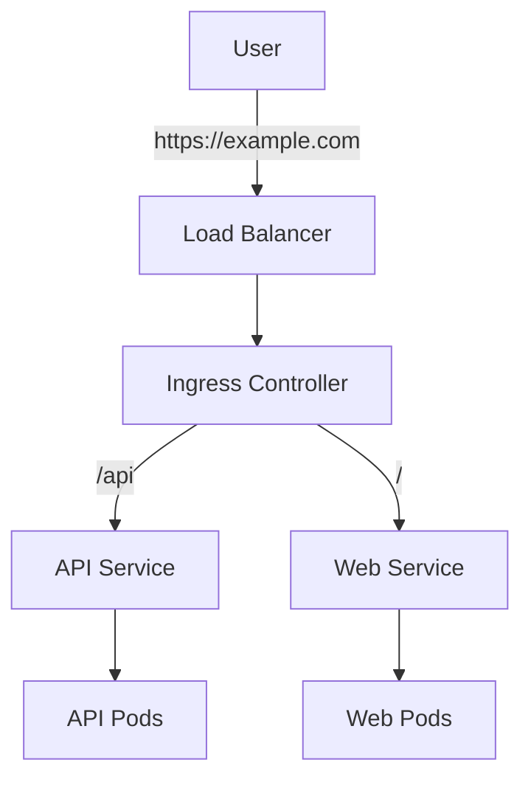

# Kubernetes Services

Learn how to expose your applications to the network and enable communication between microservices.

---

## Why Services?

Pods are **ephemeral**. They are created and destroyed, and their IP addresses change. Imagine trying to call a friend who changes phone numbers every few hours -- you would need a directory service that always knows the current number. That is exactly what a Kubernetes Service does: it provides a stable "phone number" (IP address and DNS name) for a set of Pods that may be constantly coming and going behind the scenes.

<CardGroup cols={2}>
  <Card title="Stable IP" icon="anchor">
    Service IP never changes
  </Card>
  <Card title="Load Balancing" icon="scale-balanced">
    Distributes traffic across matching Pods
  </Card>
  <Card title="Service Discovery" icon="magnifying-glass">
    DNS names (e.g., `my-service.default.svc.cluster.local`)
  </Card>
  <Card title="Decoupling" icon="link-slash">
    Frontend talks to Backend Service, not individual Pods
  </Card>
</CardGroup>

---

## Service Types

### 1. ClusterIP (Default)
Exposes the Service on an **internal IP** in the cluster. This IP is virtual -- it only exists in iptables/IPVS rules on each node, not as a network interface. Think of it as an internal phone extension that only works within the office building.
- Only reachable from within the cluster.
- Use case: Internal microservice communication (e.g., API talking to DB).

```yaml
apiVersion: v1
kind: Service
metadata:
  name: backend-service
spec:
  type: ClusterIP      # Default type; can be omitted
  selector:
    app: backend       # All pods with label app=backend receive traffic
  ports:
  - port: 80           # Port the Service listens on (what clients connect to)
    targetPort: 8080   # Port the container actually listens on (where traffic lands)
    # These are often different: the Service presents a standard port (80)
    # while the app runs on a non-privileged port (8080).
```

### 2. NodePort
Exposes the Service on each Node's IP at a static port (30000-32767). Every node in the cluster opens this port, even nodes that are not running the target pods. Traffic that arrives on any node is forwarded to a pod matching the selector, regardless of which node the pod is on.
- Reachable from outside the cluster via `<NodeIP>:<NodePort>`.
- Use case: Development, or when you don't have a Load Balancer.

```yaml
apiVersion: v1
kind: Service
metadata:
  name: frontend-service
spec:
  type: NodePort
  selector:
    app: frontend
  ports:
  - port: 80          # ClusterIP port (internal)
    targetPort: 80     # Container port
    nodePort: 30080    # External port on every node (30000-32767 range)
    # If you omit nodePort, Kubernetes assigns one randomly from the range.
    # In production, prefer Ingress or LoadBalancer over hardcoded NodePorts.
```

### 3. LoadBalancer
Exposes the Service externally using a cloud provider's Load Balancer (AWS ELB, Google Cloud LB).
- Use case: Production public-facing services.

```yaml
apiVersion: v1
kind: Service
metadata:
  name: public-service
spec:
  type: LoadBalancer
  selector:
    app: frontend
  ports:
  - port: 80
    targetPort: 80
```

### 4. ExternalName
Maps the Service to a DNS name (e.g., `foo.bar.example.com`).
- Use case: Accessing external services (like RDS) as if they were local services.

---

## Ingress

A Service (NodePort/LoadBalancer) exposes a **single** service. If you have 20 microservices, that means 20 LoadBalancers, 20 public IPs, and 20 cloud provider bills. **Ingress** solves this by exposing **multiple** services under a single IP address, using routing rules (path-based or host-based). Think of it as the receptionist at the front desk who directs visitors to the right office based on who they ask for.

Requires an **Ingress Controller** (e.g., Nginx, Traefik) to be running in the cluster. The Ingress resource itself is just a routing configuration -- without a controller to implement it, nothing happens.


```mermaid
graph TD
    User[User] -->|https://example.com| LB[Load Balancer]
    LB --> Ingress[Ingress Controller]
    Ingress -->|/api| API[API Service]
    Ingress -->|/| Web[Web Service]
    API --> Pod1[API Pods]
    Web --> Pod2[Web Pods]
```

### Ingress Resource Example

```yaml
apiVersion: networking.k8s.io/v1
kind: Ingress
metadata:
  name: my-ingress
  annotations:
    nginx.ingress.kubernetes.io/rewrite-target: /
spec:
  rules:
  - host: myapp.com
    http:
      paths:
      - path: /api
        pathType: Prefix
        backend:
          service:
            name: api-service
            port:
              number: 80
      - path: /
        pathType: Prefix
        backend:
          service:
            name: web-service
            port:
              number: 80
```

---

## Service Discovery

Kubernetes has a built-in DNS server (CoreDNS).
Services get a DNS record in the format:
`my-service.my-namespace.svc.cluster.local`

### Example
If you have a pod in the `default` namespace, it can access the `database` service in the `prod` namespace via:
`database.prod`

---

## Headless Services

A **Headless Service** has no ClusterIP (`clusterIP: None`). Instead of load balancing, DNS returns the IPs of individual pods. A regular Service is like calling a company switchboard -- you get connected to whoever is available. A headless Service is like having the direct phone number for every employee -- you choose who to call.

**Use Cases**:
- StatefulSets (clients need to connect to specific pods, e.g., "write to the primary, read from the replica")
- Service discovery without load balancing (your application handles routing)
- Peer-to-peer communication (e.g., Cassandra or Kafka nodes that need to discover each other)

```yaml
apiVersion: v1
kind: Service
metadata:
  name: mysql-headless
spec:
  clusterIP: None     # Headless! No virtual IP is assigned.
  selector:
    app: mysql
  ports:
  - port: 3306
```

DNS records created:
- `mysql-headless.default.svc.cluster.local` -- Returns all pod IPs (A records)
- `mysql-0.mysql-headless.default.svc.cluster.local` -- Pod-specific (only works with StatefulSets)

<Tip>
**Production gotcha**: Headless Services expose individual pod IPs, which means clients must handle the case where a pod IP disappears (pod restarted, rescheduled). Your application needs connection retry logic and health checking. Do not use headless Services as a shortcut to avoid understanding regular Service load balancing -- use them when you genuinely need pod-level addressability.
</Tip>

---

## Network Policies (Critical for Security!)

By default, all pods can communicate with all other pods -- zero network isolation. This is like having every room in an office building connected to every other room with no doors or locks. In production, you almost certainly want to restrict which pods can talk to which. **NetworkPolicy** is how you add those doors and locks.

### Default Deny All Ingress

```yaml
apiVersion: networking.k8s.io/v1
kind: NetworkPolicy
metadata:
  name: default-deny-ingress
  namespace: production
spec:
  podSelector: {}      # Applies to all pods
  policyTypes:
  - Ingress
  # No ingress rules = deny all
```

### Allow Specific Traffic

```yaml
apiVersion: networking.k8s.io/v1
kind: NetworkPolicy
metadata:
  name: api-network-policy
spec:
  podSelector:
    matchLabels:
      app: api
  policyTypes:
  - Ingress
  - Egress
  ingress:
  - from:
    - podSelector:
        matchLabels:
          app: frontend
    - namespaceSelector:
        matchLabels:
          name: monitoring
    ports:
    - protocol: TCP
      port: 8080
  egress:
  - to:
    - podSelector:
        matchLabels:
          app: database
    ports:
    - protocol: TCP
      port: 5432
```

<Warning>
**Interview Tip**: NetworkPolicies require a CNI plugin that supports them (Calico, Cilium, Weave). The default Kubernetes networking (kubenet) does NOT enforce NetworkPolicies.
</Warning>

---

## Endpoints & EndpointSlices

**Endpoints** are automatically created when you create a Service. They track the IP addresses of pods matching the Service selector.

```bash
# View endpoints
kubectl get endpoints my-service

# Output
NAME         ENDPOINTS                           AGE
my-service   10.244.1.5:80,10.244.2.8:80        5m
```

### External Services (No Selector)

You can create a Service without a selector and manually define endpoints to route to external services:

```yaml
apiVersion: v1
kind: Service
metadata:
  name: external-database
spec:
  ports:
  - port: 5432
---
apiVersion: v1
kind: Endpoints
metadata:
  name: external-database
subsets:
- addresses:
  - ip: 192.168.1.100   # External DB IP
  ports:
  - port: 5432
```

---

## Service Mesh Overview

For complex microservice architectures, a **Service Mesh** provides:
- **mTLS**: Automatic encryption between services
- **Traffic Management**: Canary deployments, traffic splitting
- **Observability**: Distributed tracing, metrics
- **Resilience**: Retries, circuit breakers, timeouts

Popular options: **Istio**, **Linkerd**, **Cilium Service Mesh**

---

## Interview Questions & Answers

<AccordionGroup>
  <Accordion title="What is the difference between ClusterIP, NodePort, and LoadBalancer?" icon="circle-question">
    | Type | Accessible From | IP Address |
    |------|-----------------|------------|
    | **ClusterIP** | Inside cluster only | Internal cluster IP |
    | **NodePort** | External via `<NodeIP>:<30000-32767>` | Node IPs |
    | **LoadBalancer** | External via cloud LB | Cloud provider assigns |
    
    Each type builds on the previous: LoadBalancer → NodePort → ClusterIP
  </Accordion>
  
  <Accordion title="How does kube-proxy work?" icon="circle-question">
    kube-proxy runs on every node and implements Services using:
    - **iptables mode** (default): Creates iptables rules for routing
    - **IPVS mode**: Uses Linux IPVS for better performance at scale
    - **userspace mode** (legacy): Proxies in userspace (slow)
    
    It watches the API server for Service/Endpoint changes and updates rules accordingly.
  </Accordion>
  
  <Accordion title="What is a Headless Service and when would you use it?" icon="circle-question">
    A Headless Service (`clusterIP: None`) doesn't load balance. Instead:
    - DNS returns individual pod IPs
    - Used with StatefulSets where clients need specific pods
    - Example: Kafka brokers, database replicas
  </Accordion>
  
  <Accordion title="How do you expose a service externally without a cloud load balancer?" icon="circle-question">
    Options:
    1. **NodePort**: Expose on node IPs (ports 30000-32767)
    2. **Ingress with NodePort**: Use Ingress controller on NodePort
    3. **MetalLB**: Bare-metal load balancer for on-prem clusters
    4. **ExternalIPs**: Assign external IPs to Services (requires routing setup)
  </Accordion>
  
  <Accordion title="What is an Ingress Controller?" icon="circle-question">
    An Ingress Controller is a pod that:
    - Watches for Ingress resources via API server
    - Configures a reverse proxy (nginx, HAProxy, Envoy)
    - Implements routing rules defined in Ingress resources
    
    Popular options: **nginx-ingress**, **Traefik**, **HAProxy**, **AWS ALB Controller**
  </Accordion>
  
  <Accordion title="How do you implement rate limiting in Kubernetes?" icon="circle-question">
    At the Ingress level using annotations:
    ```yaml
    annotations:
      nginx.ingress.kubernetes.io/limit-rps: "10"
      nginx.ingress.kubernetes.io/limit-connections: "5"
    ```
    Or with a Service Mesh (Istio):
    ```yaml
    apiVersion: networking.istio.io/v1alpha3
    kind: EnvoyFilter
    # Rate limiting configuration
    ```
  </Accordion>
</AccordionGroup>

---

## Common Pitfalls

<Warning>
**1. Using LoadBalancer in Development**: Creates actual cloud resources (costs money!). Use NodePort or Ingress locally.

**2. Forgetting NetworkPolicies**: All pods can talk to each other by default. Implement zero-trust with default-deny policies.

**3. Not Understanding Service DNS**: `my-svc` works within the same namespace, but cross-namespace requires `my-svc.other-ns`.

**4. Ingress Without TLS**: Always configure TLS termination for production Ingress resources.

**5. Port Confusion**: Remember the difference:
- `port`: Service port (what clients connect to)
- `targetPort`: Container port (where traffic goes)
- `nodePort`: External port on nodes (NodePort services)
</Warning>

---

## Key Takeaways

- Use **ClusterIP** for internal traffic.
- Use **LoadBalancer** (or Ingress) for public traffic.
- **Ingress** is a smart router for HTTP/HTTPS.
- Services provide **stable networking** for ephemeral pods.
- **NetworkPolicies** are essential for security in production.
- **Headless Services** are needed for StatefulSets.

---

## Interview Deep-Dive

<AccordionGroup>
  <Accordion title="You have a microservices architecture where service A calls service B. Latency between them suddenly spikes from 5ms to 500ms. Using your knowledge of Kubernetes networking internals, how would you diagnose this?" icon="circle-question">
    **Strong Answer:**
    - First, I would determine whether the issue is at the pod level or the Service/networking level. I would exec into a pod of service A and curl service B's ClusterIP directly, timing the response: `time curl http://service-b.default.svc.cluster.local:8080/health`. If this is fast, the problem is upstream (load balancer, ingress). If this is slow, the issue is in the cluster network.
    - Next, I would curl service B using a pod IP directly (bypassing the Service abstraction): `time curl http://10.244.1.15:8080/health`. If the pod IP is fast but the ClusterIP is slow, the issue is in kube-proxy's iptables/IPVS rules or DNS resolution.
    - For DNS: `time nslookup service-b.default.svc.cluster.local`. CoreDNS can be a bottleneck -- I have seen cases where CoreDNS pods are overloaded, causing 5-second DNS lookup delays (the default timeout before the resolver retries).
    - For iptables: on the node, I would check the number of iptables rules. In large clusters, the iptables chain can grow to thousands of rules, and traversal becomes O(n). Switching to IPVS mode (O(1) lookup) is the fix.
    - For the pod itself: check if service B's pods are CPU-throttled or overwhelmed. `kubectl top pods -l app=service-b` shows current usage. If pods are approaching limits, responses slow down.

    **Follow-up: What is the difference between iptables mode and IPVS mode in kube-proxy, and when would you switch?**

    iptables mode creates a chain of rules for each Service. For each Service with N endpoints, there are roughly N+2 rules. In a cluster with 5000 Services, you end up with hundreds of thousands of rules, and every packet traverses them linearly. IPVS mode uses a hash table for lookups -- O(1) regardless of Service count. The switch is transparent to applications. I would switch to IPVS when the cluster has more than a few hundred Services, or when node CPU spent in ksoftirqd starts climbing.
  </Accordion>

  <Accordion title="Explain Headless Services. When exactly would you use one, and what happens at the DNS level compared to a regular ClusterIP Service?" icon="circle-question">
    **Strong Answer:**
    - A regular ClusterIP Service gives you a single virtual IP that load-balances across all matching pods. DNS returns the ClusterIP, and kube-proxy handles the load balancing.
    - A Headless Service (clusterIP: None) has no virtual IP. Instead, DNS returns the IP addresses of all individual pods as multiple A records. The client gets a list and decides which pod to connect to.
    - Headless Services are essential for StatefulSets because each pod needs a stable, addressable identity. With a Headless Service named `mysql` and a StatefulSet, you get DNS records like `mysql-0.mysql.default.svc.cluster.local`. Clients can connect to specific replicas -- the primary for writes, a replica for reads.
    - Other use cases: Kafka brokers (clients need to discover all brokers), Elasticsearch nodes (cluster formation protocol needs specific node addresses), and gRPC services (which need all endpoints for client-side load balancing since gRPC multiplexes over a single HTTP/2 connection).

    **Follow-up: If a Headless Service pod restarts, what happens to clients holding the old pod IP?**

    Existing TCP connections to the old pod IP break immediately. The client must re-resolve DNS to discover the new pod IP. The catch is DNS caching: CoreDNS returns a 30-second TTL by default for pod records, but some application runtimes cache DNS longer. The JVM, for instance, caches DNS forever by default unless you set `networkaddress.cache.ttl=0`. Clients using Headless Services need short DNS TTLs and connection retry logic.
  </Accordion>

  <Accordion title="Your company wants to expose a Kubernetes application to the internet with TLS. Compare LoadBalancer Service versus Ingress. What are the cost, operational, and security trade-offs?" icon="circle-question">
    **Strong Answer:**
    - **LoadBalancer Service**: Each Service gets its own cloud load balancer. Simple to set up, but each one costs money. If you have 20 Services, you pay for 20 load balancers. At AWS, that is roughly $16/month per NLB plus data processing charges.
    - **Ingress controller**: One load balancer fronts one Ingress controller (nginx, Traefik). All HTTP/HTTPS traffic routes through this single entry point using host-based and path-based rules. TLS is terminated at the Ingress controller using cert-manager with Let's Encrypt for automatic certificate provisioning.
    - **Cost**: Ingress is dramatically cheaper at scale. One load balancer instead of 20. The trade-off is the Ingress controller becomes a shared bottleneck -- size it appropriately and run multiple replicas.
    - **Operational**: Ingress adds complexity. Configuration via annotations varies by controller. LoadBalancer Services are simpler but less flexible.
    - **Security**: Ingress controllers can enforce centralized policies (WAF rules, rate limiting, IP whitelisting) at the edge.

    **Follow-up: How does cert-manager automatically provision and renew TLS certificates?**

    cert-manager watches for Certificate resources and Ingress annotations. It creates an ACME order with Let's Encrypt, completes the HTTP-01 or DNS-01 challenge to prove domain ownership, and stores the certificate as a Kubernetes Secret. It tracks expiry and renews 30 days before expiration. The Ingress controller watches the Secret and picks up the new certificate without downtime. The most common failure is the challenge failing because DNS is not pointing to the Ingress controller's IP, or the HTTP-01 path is blocked by a firewall.
  </Accordion>
</AccordionGroup>

---

Next: [Kubernetes Configuration →](/courses/devops-tools/kubernetes-config)
