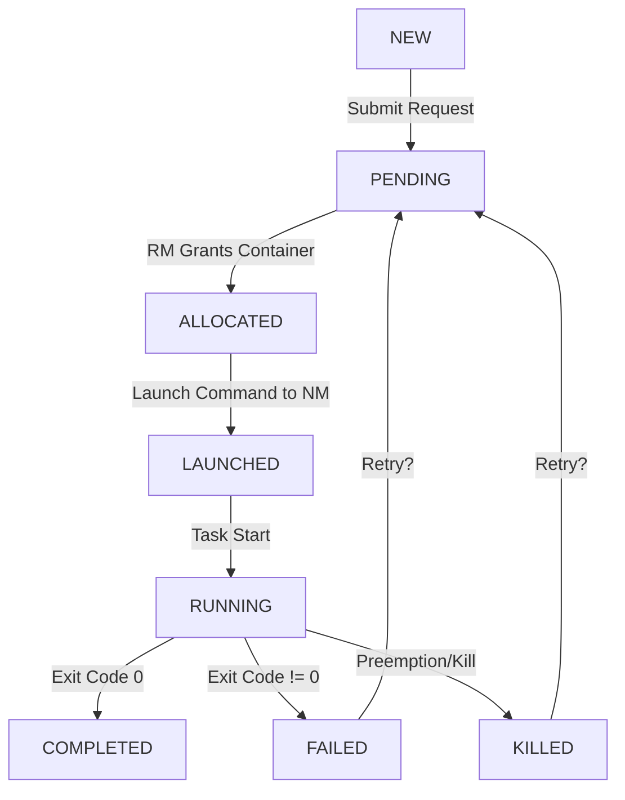

# Chapter 4: YARN - Yet Another Resource Negotiator

YARN (Yet Another Resource Negotiator) represents a fundamental redesign of Hadoop introduced in Hadoop 2.0. It decouples resource management from data processing, transforming Hadoop from a MapReduce-only system into a general-purpose cluster operating system capable of running diverse workloads.

<Info>
**Chapter Goals**:
- Understand why YARN was created and what problems it solves
- Master YARN architecture: ResourceManager, NodeManager, ApplicationMaster
- Learn resource allocation and scheduling algorithms
- Explore how different frameworks (MapReduce, Spark, Flink) run on YARN
- Compare YARN with Hadoop 1.x and modern alternatives like Kubernetes
</Info>

---

## Why YARN? The Evolution from Hadoop 1.x

### Problems with Hadoop 1.x (MRv1)

```text
+---------------------------------------------------------------+
|              HADOOP 1.x LIMITATIONS                           |
+---------------------------------------------------------------+
|                                                               |
|  1. TIGHT COUPLING TO MAPREDUCE                               |
|  ──────────────────────────────                               |
|                                                               |
|  ┌──────────────────────────────────────┐                     |
|  │       JobTracker                     │                     |
|  │  (Resource Manager + Job Scheduler)  │                     |
|  └──────────────────────────────────────┘                     |
|               ↓                                               |
|  ┌──────────────────────────────────────┐                     |
|  │       TaskTracker                    │                     |
|  │  (Resource + MapReduce Execution)    │                     |
|  └──────────────────────────────────────┘                     |
|                                                               |
|  Problem: Can ONLY run MapReduce jobs                         |
|  • Want to run iterative algorithms? → MapReduce inefficient  |
|  • Want to run streaming? → Not supported                     |
|  • Want to run graph processing? → Awkward fit                |
|                                                               |
|                                                               |
|  2. SCALABILITY BOTTLENECK                                    |
|  ─────────────────────────                                    |
|                                                               |
|  JobTracker handles EVERYTHING:                               |
|  • Resource management (allocate slots)                       |
|  • Job scheduling (FIFO, Fair, Capacity)                      |
|  • Task monitoring (heartbeats from TaskTrackers)             |
|  • Failure recovery (detect and reschedule)                   |
|  • Job state management (track progress)                      |
|                                                               |
|  Maximum cluster size: ~4000-5000 nodes                       |
|  • Single JVM can't scale beyond this                         |
|  • Memory pressure on JobTracker                              |
|  • CPU bottleneck from heartbeat processing                   |
|                                                               |
|                                                               |
|  3. RIGID SLOT ALLOCATION                                     |
|  ────────────────────────                                     |
|                                                               |
|  Each TaskTracker has FIXED slots:                            |
|                                                               |
|  TaskTracker:                                                 |
|  ┌──────────────────────────┐                                 |
|  │ Map Slots:    [8]        │                                 |
|  │ Reduce Slots: [4]        │                                 |
|  └──────────────────────────┘                                 |
|                                                               |
|  Problems:                                                    |
|  • Map-heavy job: Reduce slots idle                           |
|  • Reduce-heavy job: Map slots idle                           |
|  • Can't share slots between map and reduce                   |
|  • Fixed slot sizes (all maps get same memory)                |
|  • Poor resource utilization (~60-70% typical)                |
|                                                               |
|                                                               |
|  4. SINGLE POINT OF FAILURE                                   |
|  ──────────────────────────                                   |
|                                                               |
|  JobTracker dies → All running jobs lost                      |
|  • No HA in Hadoop 1.x                                        |
|  • Must restart all jobs from beginning                       |
|  • Production clusters need manual failover                   |
|                                                               |
+---------------------------------------------------------------+
```

### The YARN Solution

<Tabs>
  <Tab title="Separation of Concerns">
    **Decouple Resource Management from Processing**

    ```text
    HADOOP 1.x:
    ──────────

    JobTracker = Resource Manager + MapReduce Scheduler + Job Monitor
    TaskTracker = Resource Provider + Map/Reduce Executor


    HADOOP 2.x (YARN):
    ─────────────────

    ResourceManager = Cluster Resource Manager (ONLY)
    NodeManager = Resource Provider (ONLY)
    ApplicationMaster = Per-Application Scheduler and Monitor


    KEY INSIGHT: Resource Management is Generic
    ──────────────────────────────────────────

    ResourceManager doesn't know about MapReduce!
    It only knows about:
    • Resources: CPU, memory, disk, network
    • Containers: Resource abstractions
    • Applications: Things that request containers

    Processing logic (MapReduce, Spark, etc.) lives in
    ApplicationMaster, which is application-specific.


    BENEFITS:
    ────────

    ✓ Scalability: ResourceManager does less work
    ✓ Flexibility: Run any framework, not just MapReduce
    ✓ Isolation: Each app has its own ApplicationMaster
    ✓ Multi-tenancy: Different apps can coexist
    ✓ Innovation: New frameworks without changing core
    ```
  </Tab>

  <Tab title="Flexible Resources">
    **Containers Replace Slots**

    ```text
    HADOOP 1.x (SLOTS):
    ──────────────────

    Fixed Slots:
    ┌────────────────────────────────┐
    │ Map Slot 1:    1GB, 1 core     │
    │ Map Slot 2:    1GB, 1 core     │
    │ Reduce Slot 1: 2GB, 1 core     │
    └────────────────────────────────┘

    Problems:
    • Can't request 1.5 GB
    • Can't share between map/reduce
    • Rigid, wasteful


    HADOOP 2.x (CONTAINERS):
    ────────────────────────

    Flexible Containers:
    ┌────────────────────────────────┐
    │ Container 1: 512MB, 1 core     │
    │ Container 2: 2GB, 2 cores      │
    │ Container 3: 8GB, 4 cores      │
    └────────────────────────────────┘

    Benefits:
    • Request exactly what you need
    • Fine-grained resource allocation
    • Higher utilization (80-90%)
    • Support diverse workloads


    RESOURCE TYPES:
    ──────────────

    Primary:
    • Memory (MB)
    • Virtual cores (vCPUs)

    Future/Extended:
    • GPU
    • Network bandwidth
    • Disk I/O


    EXAMPLE:
    ───────

    Spark Application:
    • Driver: 1 container (4GB, 2 cores)
    • Executor 1: 1 container (8GB, 4 cores)
    • Executor 2: 1 container (8GB, 4 cores)
    • Executor 3: 1 container (8GB, 4 cores)

    Total: 28GB, 14 cores across 4 containers
    ```
  </Tab>

  <Tab title="Multi-Framework">
    **Not Just MapReduce**

    ```text
    FRAMEWORKS ON YARN:
    ──────────────────

    ┌────────────────────────────────────────┐
    │         YARN Cluster                   │
    ├────────────────────────────────────────┤
    │  ResourceManager + NodeManagers        │
    └────────────────────────────────────────┘
                     ↑
         ┌───────────┼───────────┐
         │           │           │
    ┌─────────┐ ┌────────┐ ┌─────────┐
    │MapReduce│ │ Spark  │ │ Flink   │
    │   v2    │ │        │ │         │
    └─────────┘ └────────┘ └─────────┘
         │           │           │
    ┌─────────┐ ┌────────┐ ┌─────────┐
    │  Hive   │ │  Tez   │ │ Storm   │
    └─────────┘ └────────┘ └─────────┘


    SUPPORTED FRAMEWORKS:
    ────────────────────

    Batch Processing:
    • MapReduce v2 (compatibility)
    • Apache Spark (most popular)
    • Apache Tez (Hive backend)

    Stream Processing:
    • Apache Flink
    • Apache Storm
    • Spark Streaming

    Interactive:
    • Apache Impala (via YARN)
    • Presto (can use YARN)

    Graph Processing:
    • Apache Giraph

    Machine Learning:
    • Spark MLlib
    • TensorFlow on YARN


    WHY THIS MATTERS:
    ────────────────

    Single cluster can run:
    • Batch jobs (Spark)
    • Streaming pipelines (Flink)
    • SQL queries (Hive/Tez)
    • ML training (TensorFlow)

    All sharing the same resources efficiently!
    ```
  </Tab>

  <Tab title="High Availability">
    **Eliminating Single Points of Failure**

    ```text
    RESOURCEMANAGER HA:
    ──────────────────

    ┌──────────────────────────────────┐
    │   Active ResourceManager         │
    │   (handles all requests)         │
    └──────────────────────────────────┘
                 ↓
         ┌──────────────┐
         │  ZooKeeper   │ (leader election)
         └──────────────┘
                 ↑
    ┌──────────────────────────────────┐
    │   Standby ResourceManager        │
    │   (ready to take over)           │
    └──────────────────────────────────┘


    FAILOVER PROCESS:
    ────────────────

    1. Active RM fails
    2. ZooKeeper detects failure (no heartbeat)
    3. Standby RM becomes Active
    4. Running applications reconnect
    5. New applications submitted to new Active

    Downtime: Seconds (not hours!)


    APPLICATION STATE RECOVERY:
    ──────────────────────────

    ApplicationMaster checkpoints state:
    • Completed tasks
    • Running tasks
    • Pending work

    On RM failover:
    • ApplicationMaster reconnects
    • Resumes from checkpoint
    • Only re-run in-flight work


    NODEMANAGER RESILIENCE:
    ──────────────────────

    If NodeManager fails:
    • ResourceManager detects via heartbeat
    • Containers on that node are lost
    • ApplicationMaster reschedules work
    • Other NodeManagers unaffected

    No global impact from single node failure!
    ```
  </Tab>
</Tabs>

---

## YARN Architecture

### Core Components

```text
+---------------------------------------------------------------+
|                    YARN ARCHITECTURE                          |
+---------------------------------------------------------------+
|                                                               |
|                                                               |
|        CLIENT                                                 |
|        ┌──────────────┐                                       |
|        │   Submit     │                                       |
|        │ Application  │                                       |
|        └──────┬───────┘                                       |
|               │                                               |
|               │ 1. Submit App                                 |
|               ↓                                               |
|        ┌──────────────────────────────────────┐               |
|        │      RESOURCEMANAGER                 │               |
|        │      (Cluster Master)                │               |
|        ├──────────────────────────────────────┤               |
|        │  • Resource Allocation               │               |
|        │  • Scheduling (Fair/Capacity/FIFO)   │               |
|        │  • ApplicationMaster Lifecycle       │               |
|        └───────┬─────────────────────┬────────┘               |
|                │                     │                        |
|                │ 2. Allocate         │ 3. Monitor             |
|                │    AM Container     │    Heartbeat           |
|                ↓                     ↑                        |
|        ┌────────────────────────────────────┐                 |
|        │    NODEMANAGER (Worker Node)      │                 |
|        ├────────────────────────────────────┤                 |
|        │  ┌──────────────────────────────┐  │                 |
|        │  │ APPLICATION MASTER           │  │                 |
|        │  │ (Per-Application)            │  │                 |
|        │  ├──────────────────────────────┤  │                 |
|        │  │ • Task Scheduling            │←─┼─────┐           |
|        │  │ • Resource Requests          │  │     │           |
|        │  │ • Task Monitoring            │  │     │           |
|        │  │ • Failure Handling           │  │     │           |
|        │  └──────────┬───────────────────┘  │     │           |
|        │             │ 4. Request Containers │     │           |
|        │             └───────────────────────┼─────┘           |
|        │                                     │                 |
|        │  ┌──────────┐  ┌──────────┐        │                 |
|        │  │Container │  │Container │        │                 |
|        │  │   (Task) │  │   (Task) │        │                 |
|        │  └──────────┘  └──────────┘        │                 |
|        └────────────────────────────────────┘                 |
|                     ↑                                         |
|                     │ 5. Launch Containers                    |
|                     │                                         |
|        ┌────────────┴───────────────────────┐                 |
|        │    NODEMANAGER (Worker Node)      │                 |
|        ├────────────────────────────────────┤                 |
|        │  ┌──────────┐  ┌──────────┐       │                 |
|        │  │Container │  │Container │       │                 |
|        │  │   (Task) │  │   (Task) │       │                 |
|        │  └──────────┘  └──────────┘       │                 |
|        └────────────────────────────────────┘                 |
|                                                               |
+---------------------------------------------------------------+

KEY CONCEPTS:
────────────

ResourceManager (RM):
• One per cluster (or 2+ for HA)
• Global resource scheduler
• Application lifecycle manager
• Does NOT know application logic

NodeManager (NM):
• One per worker node
• Manages containers on that node
• Reports resources to RM
• Monitors container health

ApplicationMaster (AM):
• One per application
• Application-specific logic
• Requests containers from RM
• Coordinates task execution
• Handles task failures

Container:
• Unit of resource allocation
• Defined by (memory, vCPUs, node)
• Runs in isolated JVM (or Docker/process)
• Can run any executable
```

### ResourceManager Deep Dive

<AccordionGroup>
  <Accordion title="ResourceManager Components" icon="gear">
    **Internal Architecture**

    ```text
    RESOURCEMANAGER INTERNALS:
    ─────────────────────────

    ┌────────────────────────────────────────────┐
    │           ResourceManager                  │
    ├────────────────────────────────────────────┤
    │                                            │
    │  ┌──────────────────────────────────────┐  │
    │  │    ApplicationsManager (ASM)         │  │
    │  ├──────────────────────────────────────┤  │
    │  │ • Accept application submissions     │  │
    │  │ • Negotiate first container for AM   │  │
    │  │ • Restart AM on failure              │  │
    │  └──────────────────────────────────────┘  │
    │                                            │
    │  ┌──────────────────────────────────────┐  │
    │  │    ApplicationMasterService (AMS)    │  │
    │  ├──────────────────────────────────────┤  │
    │  │ • AM registration                    │  │
    │  │ • Heartbeat from AMs                 │  │
    │  │ • Resource requests                  │  │
    │  │ • Container allocation responses     │  │
    │  └──────────────────────────────────────┘  │
    │                                            │
    │  ┌──────────────────────────────────────┐  │
    │  │    Scheduler                         │  │
    │  ├──────────────────────────────────────┤  │
    │  │ • Capacity Scheduler (default)       │  │
    │  │ • Fair Scheduler                     │  │
    │  │ • FIFO Scheduler                     │  │
    │  │ • Allocates containers to apps       │  │
    │  └──────────────────────────────────────┘  │
    │                                            │
    │  ┌──────────────────────────────────────┐  │
    │  │    Resource Tracker Service          │  │
    │  ├──────────────────────────────────────┤  │
    │  │ • NodeManager registration           │  │
    │  │ • Heartbeat from NMs                 │  │
    │  │ • Track node health and resources    │  │
    │  └──────────────────────────────────────┘  │
    │                                            │
    │  ┌──────────────────────────────────────┐  │
    │  │    Client Service                    │  │
    │  ├──────────────────────────────────────┤  │
    │  │ • Application submission             │  │
    │  │ • Application kill/status            │  │
    │  │ • Cluster metrics queries            │  │
    │  └──────────────────────────────────────┘  │
    │                                            │
    └────────────────────────────────────────────┘


    KEY RESPONSIBILITIES:
    ────────────────────

    1. Accept Applications:
       - Client submits ApplicationSubmissionContext
       - Validate submission (resources, queue, ACLs)
       - Assign application ID

    2. Allocate AM Container:
       - Find suitable NodeManager
       - Allocate first container for ApplicationMaster
       - Track AM container location

    3. Resource Scheduling:
       - Receive resource requests from AMs
       - Use scheduler to allocate containers
       - Respond with container grants

    4. Node Management:
       - Track available resources per node
       - Mark nodes as healthy/unhealthy
       - Decommission/recommission nodes

    5. Application Lifecycle:
       - Monitor AM health via heartbeat
       - Restart AM on failure (configurable attempts)
       - Clean up on application completion
    ```
  </Accordion>

  <Accordion title="Scheduling Algorithms" icon="calendar">
    **FIFO, Capacity, and Fair Schedulers**

    ```text
    SCHEDULER COMPARISON:
    ────────────────────

    ┌──────────┬─────────────────────────────────────┐
    │ Scheduler│ Characteristics                     │
    ├──────────┼─────────────────────────────────────┤
    │ FIFO     │ Simple queue, first-come first-serve│
    │          │ Good for: Single user, batch jobs   │
    │          │ Bad for: Multi-tenant, mixed SLAs   │
    ├──────────┼─────────────────────────────────────┤
    │ Capacity │ Multiple queues, guaranteed capacity│
    │          │ Good for: Orgs with resource quotas │
    │          │ Bad for: Dynamic, changing workloads│
    ├──────────┼─────────────────────────────────────┤
    │ Fair     │ Equal share for all apps/users      │
    │          │ Good for: Interactive, multi-tenant │
    │          │ Bad for: Strict capacity guarantees │
    └──────────┴─────────────────────────────────────┘


    CAPACITY SCHEDULER (Default):
    ────────────────────────────

    Queue Hierarchy:
    ┌─────────────────────────────────────────┐
    │ root (100%)                             │
    ├─────────────────────────────────────────┤
    │  ├─ engineering (60%)                   │
    │  │   ├─ dev (30%)                       │
    │  │   └─ prod (30%)                      │
    │  ├─ marketing (20%)                     │
    │  └─ finance (20%)                       │
    └─────────────────────────────────────────┘

    Properties:
    • Each queue guaranteed minimum capacity
    • Can use more if available (elasticity)
    • Can set max capacity (prevent starvation)
    • Hierarchical queues
    • ACLs per queue

    Configuration:
    ──────────────
    yarn.scheduler.capacity.root.queues=engineering,marketing,finance
    yarn.scheduler.capacity.root.engineering.capacity=60
    yarn.scheduler.capacity.root.marketing.capacity=20
    yarn.scheduler.capacity.root.finance.capacity=20
    yarn.scheduler.capacity.root.engineering.queues=dev,prod
    yarn.scheduler.capacity.root.engineering.dev.capacity=50
    yarn.scheduler.capacity.root.engineering.prod.capacity=50


    FAIR SCHEDULER:
    ──────────────

    Concept: All applications get equal share over time

    Without Fair Scheduler:
    ──────────────────────
    App A submitted at t=0: Gets all resources
    App B submitted at t=10: Waits for App A to finish

    With Fair Scheduler:
    ───────────────────
    App A at t=0: Gets 100% (no other apps)
    App B at t=10: Each app gets 50%
    App C at t=20: Each app gets 33%
    App A finishes at t=30: App B and C get 50% each


    Fair Share Calculation:
    ──────────────────────

    Total resources: 100 GB memory, 50 cores

    Apps:
    • App A (weight=1): 33.3 GB, 16 cores
    • App B (weight=1): 33.3 GB, 17 cores
    • App C (weight=1): 33.3 GB, 17 cores

    If App A doesn't use full share:
    • App B: 50 GB, 25 cores
    • App C: 50 GB, 25 cores


    Weighted Fair Share:
    ───────────────────

    Total: 100 GB, 50 cores
    App A (weight=1): 25 GB, 12.5 cores
    App B (weight=2): 50 GB, 25 cores
    App C (weight=1): 25 GB, 12.5 cores


    Configuration:
    ─────────────
    yarn.scheduler.fair.preemption=true
    (kill containers from over-allocated apps)

    yarn.scheduler.fair.sizebasedweight=true
    (larger jobs get more weight)


    FIFO SCHEDULER:
    ──────────────

    Simplest: First job gets all resources until done.

    Timeline:
    ─────────
    t=0:  Submit Job 1 (big) → runs
    t=10: Submit Job 2 (small) → waits
    t=20: Submit Job 3 (big) → waits
    t=100: Job 1 finishes
    t=100: Job 2 starts
    t=110: Job 2 finishes
    t=110: Job 3 starts

    Problem: Short jobs wait behind long jobs (poor turnaround)

    Use only for:
    • Single-user clusters
    • Batch processing with known schedule
    ```

    ## Deep Dive: Hierarchical Queues and Preemption

    In large production clusters, YARN is shared by multiple departments, teams, and project types. To manage this complexity, YARN uses **Hierarchical Queues**.

    ### 1. Capacity Scheduler: The Organizations Choice
    The `CapacityScheduler` is designed for organizations with strict resource quotas.

    - **Guaranteed Capacity**: Each queue is guaranteed a percentage of cluster resources.
    - **Elasticity**: If Queue A is idle, Queue B can use its resources.
    - **User Limits**: Prevent a single user from hogging all resources in a queue.

    ### 2. Fair Scheduler: The Interactive Choice
    The `FairScheduler` ensures that all applications get an equal share of resources over time.

    - **Fair Share**: If two apps are running, they each get 50%.
    - **Dominant Resource Fairness (DRF)**: Handles multi-dimensional resources. If App A is CPU-heavy and App B is Memory-heavy, DRF calculates fairness based on the "dominant" resource each app consumes.

    ### 3. Preemption: Reclaiming Resources
    What happens if Queue A is using its guaranteed 50%, and Queue B (also guaranteed 50%) is currently empty? Queue A will scale up to 100%. 
    If a job is then submitted to Queue B, YARN must reclaim resources from Queue A.

    - **Graceful Termination**: YARN sends a signal to the AM of the over-allocated containers, asking them to finish up.
    - **Hard Kill**: If the AM doesn't release containers within a timeout (e.g., 15 seconds), the RM will forcefully kill those containers to satisfy the guarantee of Queue B.

    | Strategy | When to use |
    | :--- | :--- |
    | **FIFO** | Small, private development clusters. |
    | **Capacity** | Large corporate environments with fixed budgets. |
    | **Fair** | Clusters with many interactive users (e.g., Spark Shells). |

  </Accordion>

  <Accordion title="Resource Requests" icon="inbox">
    **How Applications Request Containers**

    ```text
    RESOURCE REQUEST STRUCTURE:
    ──────────────────────────

    ResourceRequest:
    {
      priority: 1,               // Higher = more important
      resourceName: "node1",     // Specific node, rack, or "*"
      capability: {
        memory: 2048,            // MB
        vCores: 2
      },
      numContainers: 5,          // How many containers
      relaxLocality: true        // Can use other nodes?
    }


    LOCALITY LEVELS:
    ───────────────

    1. Node-local: Specific node
       resourceName = "datanode1.example.com"
       Best: Data locality (HDFS block on this node)

    2. Rack-local: Any node in rack
       resourceName = "/rack1"
       Good: Data on same rack (faster network)

    3. Off-rack: Any node in cluster
       resourceName = "*"
       OK: No data locality, but get resources


    RELAXED LOCALITY:
    ────────────────

    relaxLocality = true (default):
    • Try node-local first
    • If not available, try rack-local
    • If not available, use any node

    relaxLocality = false:
    • MUST get requested node/rack
    • Wait indefinitely if not available
    • Use for data-local workloads only


    EXAMPLE: MapReduce Request
    ─────────────────────────

    For Map Task (data on node3, rack /rack1):

    Request 1 (Preferred):
    {
      resourceName: "node3",
      capability: {memory: 1024, vCores: 1},
      numContainers: 1,
      relaxLocality: true
    }

    Request 2 (Fallback - rack):
    {
      resourceName: "/rack1",
      capability: {memory: 1024, vCores: 1},
      numContainers: 1,
      relaxLocality: true
    }

    Request 3 (Fallback - any):
    {
      resourceName: "*",
      capability: {memory: 1024, vCores: 1},
      numContainers: 1,
      relaxLocality: true
    }

    Scheduler will try to satisfy in order of preference.


    PRIORITY:
    ────────

    ApplicationMaster can assign priorities:
    • Priority 1: Map tasks (need locality)
    • Priority 2: Reduce tasks (locality less critical)

    Higher priority requests served first.


    RESOURCE REQUEST FLOW:
    ─────────────────────

    1. AM sends ResourceRequest to RM
       (via heartbeat, every 1 second)

    2. RM's Scheduler evaluates:
       - Check queue limits
       - Check node availability
       - Match resource requirements
       - Consider locality preferences

    3. RM responds with Container allocations:
       {
         containerId: "container_123",
         nodeId: "node3:8041",
         resource: {memory: 1024, vCores: 1},
         token: "..."
       }

    4. AM launches container on NodeManager

    5. AM sends container completion back to RM
    ```
  </Accordion>

  <Accordion title="High Availability" icon="shield">
    **Fault Tolerance and Failover**

    ```text
    RESOURCEMANAGER HA ARCHITECTURE:
    ───────────────────────────────

    ┌──────────────────────────────────────┐
    │  ResourceManager 1 (ACTIVE)          │
    │  • Handles all client requests       │
    │  • Schedules containers              │
    │  • Monitors applications             │
    └──────────────┬───────────────────────┘
                   │
                   ↓
           ┌───────────────┐
           │  ZooKeeper    │
           │  Ensemble     │ (leader election + coordination)
           └───────────────┘
                   ↑
                   │
    ┌──────────────┴───────────────────────┐
    │  ResourceManager 2 (STANDBY)         │
    │  • Waits for active to fail          │
    │  • Syncs state from ZooKeeper        │
    │  • Ready to become active            │
    └──────────────────────────────────────┘


    STATE STORAGE:
    ─────────────

    Stores in ZooKeeper or HDFS:
    • Running applications
    • Application attempts
    • Completed applications
    • Delegation tokens

    On failover, new active RM:
    • Reads state from ZooKeeper
    • Recovers application state
    • AMs re-register
    • NMs re-register


    FAILOVER PROCESS:
    ────────────────

    Normal Operation:
    1. Active RM processes requests
    2. Active RM writes state to ZK
    3. Standby RM monitors ZK

    Active RM Fails:
    1. ZooKeeper detects no heartbeat
    2. Standby RM wins leader election
    3. Standby becomes Active
    4. New Active loads state from ZK
    5. ApplicationMasters reconnect
    6. NodeManagers reconnect

    Downtime: Typically < 30 seconds


    CLIENT FAILOVER:
    ───────────────

    Clients configured with both RMs:
    yarn.resourcemanager.ha.rm-ids=rm1,rm2
    yarn.resourcemanager.hostname.rm1=host1
    yarn.resourcemanager.hostname.rm2=host2

    Client behavior:
    • Try rm1
    • If connection fails, try rm2
    • Automatic retry on failover


    APPLICATIONMASTER RECOVERY:
    ──────────────────────────

    When RM fails and restarts:

    Option 1: Work-Preserving Recovery
    • AM reconnects to new RM
    • Reports running containers
    • Continues from current state
    • Only in-flight work re-executed

    Option 2: Non-Work-Preserving
    • AM killed and restarted
    • Application restarts from beginning
    • Simpler, but more expensive


    CONFIGURATION:
    ─────────────

    Enable RM HA:
    yarn.resourcemanager.ha.enabled=true
    yarn.resourcemanager.ha.rm-ids=rm1,rm2

    Enable work-preserving recovery:
    yarn.resourcemanager.recovery.enabled=true
    yarn.resourcemanager.store.class=
      org.apache.hadoop.yarn.server.resourcemanager.recovery.ZKRMStateStore

    ZooKeeper connection:
    yarn.resourcemanager.zk-address=
      zk1:2181,zk2:2181,zk3:2181
    ```
  </Accordion>
</AccordionGroup>

### NodeManager Deep Dive

<Tabs>
  <Tab title="NodeManager Responsibilities">
    **Per-Node Resource Management**

    ```text
    NODEMANAGER ARCHITECTURE:
    ────────────────────────

    ┌────────────────────────────────────────┐
    │         NodeManager                    │
    ├────────────────────────────────────────┤
    │                                        │
    │  ┌──────────────────────────────────┐  │
    │  │ NodeStatusUpdater                │  │
    │  ├──────────────────────────────────┤  │
    │  │ • Heartbeat to RM (1 sec)        │  │
    │  │ • Report node health & resources │  │
    │  │ • Receive container commands     │  │
    │  └──────────────────────────────────┘  │
    │                                        │
    │  ┌──────────────────────────────────┐  │
    │  │ ContainerManager                 │  │
    │  ├──────────────────────────────────┤  │
    │  │ • Start/stop containers          │  │
    │  │ • Monitor container resources    │  │
    │  │ • Kill misbehaving containers    │  │
    │  └──────────────────────────────────┘  │
    │                                        │
    │  ┌──────────────────────────────────┐  │
    │  │ ContainerExecutor                │  │
    │  ├──────────────────────────────────┤  │
    │  │ • Launch container processes     │  │
    │  │ • Set up resource limits (cgroups)│ │
    │  │ • Isolate containers             │  │
    │  └──────────────────────────────────┘  │
    │                                        │
    │  ┌──────────────────────────────────┐  │
    │  │ NodeHealthChecker                │  │
    │  ├──────────────────────────────────┤  │
    │  │ • Run health check scripts       │  │
    │  │ • Monitor disk health            │  │
    │  │ • Report to RM                   │  │
    │  └──────────────────────────────────┘  │
    │                                        │
    │  ┌──────────────────────────────────┐  │
    │  │ DeletionService                  │  │
    │  ├──────────────────────────────────┤  │
    │  │ • Clean up completed containers  │  │
    │  │ • Delete application artifacts   │  │
    │  └──────────────────────────────────┘  │
    │                                        │
    └────────────────────────────────────────┘


    KEY RESPONSIBILITIES:
    ────────────────────

    1. Resource Management:
       - Track total node resources (memory, CPU)
       - Report available resources to RM
       - Enforce container resource limits

    2. Container Lifecycle:
       - Receive launch requests from AM
       - Start container processes
       - Monitor container execution
       - Kill containers on request or timeout

    3. Security:
       - Authenticate container launch requests
       - Run containers as appropriate user
       - Isolate containers from each other

    4. Log Management:
       - Capture container stdout/stderr
       - Aggregate logs (optional)
       - Serve logs to clients

    5. Health Monitoring:
       - Run periodic health checks
       - Report unhealthy status to RM
       - Quarantine unhealthy node
    ```
  </Tab>

  <Tab title="Container Execution">
    **How Containers Are Launched**

    ```text
    CONTAINER LAUNCH FLOW:
    ─────────────────────

    1. AM requests container from RM
       ↓
    2. RM allocates container on NodeManager
       ↓
    3. RM sends ContainerToken to AM
       ↓
    4. AM sends StartContainer to NodeManager
       ↓
    5. NodeManager validates token
       ↓
    6. NodeManager launches container


    CONTAINER LAUNCH REQUEST:
    ────────────────────────

    StartContainerRequest:
    {
      containerId: "container_1234_0001_01_000002",
      containerLaunchContext: {
        localResources: {
          "job.jar": {
            resource: "hdfs://namenode/path/to/job.jar",
            type: FILE,
            timestamp: 1234567890,
            size: 1048576
          }
        },
        environment: {
          "JAVA_HOME": "/usr/lib/jvm/java-8",
          "CLASSPATH": "job.jar:hadoop-libs/*"
        },
        command: "java -Xmx1024m MyTask",
        user: "hadoop",
        resource: {
          memory: 1024,
          vCores: 1
        }
      }
    }


    NODEMANAGER ACTIONS:
    ───────────────────

    1. Create Container Directory:
       /yarn/nm/usercache/hadoop/appcache/app_1234_0001/container_000002/

    2. Download Resources (localResources):
       - Fetch job.jar from HDFS
       - Cache locally for reuse
       - Verify checksums

    3. Set Up Environment:
       - Create isolated directory structure
       - Set environment variables
       - Prepare stdout/stderr log files

    4. Launch Process:
       - Fork subprocess
       - Set resource limits (cgroups)
       - Execute command

    5. Monitor:
       - Track memory usage
       - Track CPU usage
       - Kill if exceeds limits


    RESOURCE ISOLATION (Linux):
    ──────────────────────────

    Uses cgroups (control groups):

    Memory:
    /sys/fs/cgroup/memory/yarn/container_000002/
      memory.limit_in_bytes = 1073741824  (1GB)
      memory.oom_control = 1              (kill if OOM)

    CPU:
    /sys/fs/cgroup/cpu/yarn/container_000002/
      cpu.shares = 1024  (1 vCore = 1024 shares)


    PROCESS TREE:
    ────────────

    NodeManager monitors entire process tree:

    Container Process (PID 12345)
      ├─ Child Process (PID 12346)
      │  └─ Grandchild (PID 12347)
      └─ Child Process (PID 12348)

    Resource usage = sum of entire tree
    Kill container = kill all processes in tree


    CONTAINER COMPLETION:
    ────────────────────

    When container finishes:
    1. NM captures exit code
    2. NM sends completion to RM
    3. RM notifies AM
    4. NM cleans up container directory (after delay)
    5. Logs aggregated to HDFS (if enabled)


    EXIT CODES:
    ──────────

    0:   Success
    1:   Generic failure
    137: Killed due to exceeding memory (SIGKILL)
    143: Terminated (SIGTERM)
    -100: Killed by YARN (exceeded limits)
    ```
  </Tab>

  <Tab title="Resource Monitoring">
    **Tracking Container Resources**

    ```text
    RESOURCE MONITORING:
    ───────────────────

    NodeManager monitors each container:
    • Every 3 seconds (configurable)
    • Memory usage (RSS + cache)
    • CPU usage (percentage)
    • Disk usage (local dirs)


    MEMORY MONITORING:
    ─────────────────

    Container Allocated: 2048 MB

    Current Usage:
    ┌────────────────────────────────┐
    │ RSS (Resident Set Size): 1800  │
    │ Cache: 200                     │
    │ Total: 2000 MB                 │
    └────────────────────────────────┘

    Status: OK (under limit)


    If usage > limit:
    ┌────────────────────────────────┐
    │ RSS: 2100                      │
    │ Cache: 100                     │
    │ Total: 2200 MB                 │
    └────────────────────────────────┘

    Status: OVER LIMIT
    Action: Kill container (exit code -100)


    PHYSICAL vs VIRTUAL MEMORY:
    ──────────────────────────

    yarn.nodemanager.vmem-check-enabled=false
    (disable virtual memory check, default: false in modern versions)

    Virtual memory can be much larger than physical:
    • Java processes allocate large virtual memory
    • Most is never used (not resident)
    • Checking virtual memory causes false positives


    CPU MONITORING:
    ──────────────

    Container Allocated: 2 vCores

    Monitoring:
    • Measure CPU time used by process tree
    • Calculate percentage over monitoring interval

    Example:
    Interval: 3 seconds
    CPU time used: 4 seconds
    Percentage: 4/3 = 133% (using 1.33 cores)

    If < 2 cores: OK
    If > 2 cores: Warning (but not killed)

    Note: CPU is soft limit, memory is hard limit


    DISK MONITORING:
    ───────────────

    Container writes to local directories:
    /yarn/nm/usercache/hadoop/appcache/app_1234/container_002/

    Limits:
    • yarn.nodemanager.disk-health-checker.min-free-space-per-disk-mb
      (default: 0, no limit)
    • yarn.nodemanager.disk-health-checker.max-disk-utilization-per-disk-percentage
      (default: 90%)

    If disk usage exceeds:
    • Node marked unhealthy
    • No new containers launched
    • Running containers continue


    HEALTH REPORTING:
    ────────────────

    NodeManager → ResourceManager (heartbeat):
    {
      "nodeId": "node1:8041",
      "nodeHealthy": true,
      "availableResource": {
        "memory": 8192,
        "vCores": 4
      },
      "containerStatuses": [
        {
          "containerId": "container_001",
          "state": "RUNNING",
          "exitCode": -1000  (still running)
        },
        {
          "containerId": "container_002",
          "state": "COMPLETE",
          "exitCode": 0
        }
      ]
    }
    ```
  </Tab>

  <Tab title="Log Aggregation">
    **Collecting Container Logs**

    ```text
    LOG AGGREGATION:
    ───────────────

    Problem:
    • Container logs scattered across all NodeManagers
    • Hard to debug when containers spread over 100s of nodes
    • Local logs deleted after time period


    Solution: Log Aggregation
    • NodeManager collects all container logs
    • Aggregates into single file per application
    • Uploads to HDFS
    • Accessible after application completes


    LOG FLOW:
    ────────

    During Execution:
    ┌─────────────────────────────────────┐
    │ Container on NodeManager            │
    ├─────────────────────────────────────┤
    │ stdout → local file                 │
    │ stderr → local file                 │
    │ Log4j → local file                  │
    └─────────────────────────────────────┘


    After Container Finishes:
    ┌─────────────────────────────────────┐
    │ NodeManager                         │
    ├─────────────────────────────────────┤
    │ Collect: stdout, stderr, log4j      │
    │ Compress: gzip                      │
    │ Upload: HDFS                        │
    └─────────────────────────────────────┘


    After Application Completes:
    ┌─────────────────────────────────────┐
    │ HDFS                                │
    ├─────────────────────────────────────┤
    │ /yarn/logs/hadoop/app_1234_0001/    │
    │   ├─ node1/                         │
    │   │  ├─ container_001               │
    │   │  └─ container_002               │
    │   ├─ node2/                         │
    │   │  ├─ container_003               │
    │   │  └─ container_004               │
    │   └─ ...                            │
    └─────────────────────────────────────┘


    VIEWING LOGS:
    ────────────

    While Running:
    yarn logs -applicationId app_1234_0001 -log_files stdout

    After Completion:
    yarn logs -applicationId app_1234_0001 -containerId container_001


    CONFIGURATION:
    ─────────────

    Enable log aggregation:
    yarn.log-aggregation-enable=true

    HDFS directory:
    yarn.nodemanager.remote-app-log-dir=/yarn/logs

    Retention:
    yarn.log-aggregation.retain-seconds=604800  (7 days)

    Delete after:
    yarn.log-aggregation.retain-check-interval-seconds=86400


    PERFORMANCE IMPACT:
    ──────────────────

    • Log aggregation happens AFTER app completes
    • No impact on running application
    • HDFS space proportional to log volume
    • Use compression to reduce storage
    ```
  </Tab>
</Tabs>

### ApplicationMaster Deep Dive

<AccordionGroup>
  <Accordion title="ApplicationMaster Lifecycle" icon="arrows-spin">
    **From Launch to Completion**

    ```text
    APPLICATIONMASTER LIFECYCLE:
    ───────────────────────────

    1. CLIENT SUBMISSION
       ────────────────
       Client submits application to RM:
       • JAR file
       • ApplicationSubmissionContext
       • Resources needed for AM

    2. RM ALLOCATES AM CONTAINER
       ─────────────────────────
       • Find suitable NodeManager
       • Allocate container (typically 1GB, 1 core)
       • Send launch command to NM

    3. NM LAUNCHES AM
       ──────────────
       • Download application JAR
       • Start AM process
       • AM starts in container

    4. AM REGISTERS WITH RM
       ────────────────────
       • Establish heartbeat channel
       • Get applicationAttemptId
       • Receive cluster information

    5. AM REQUESTS CONTAINERS
       ──────────────────────
       • Calculate resource needs
       • Send ResourceRequests to RM
       • Specify locality preferences

    6. RM ALLOCATES CONTAINERS
       ───────────────────────
       • Scheduler evaluates requests
       • Returns Container grants
       • Provides NodeManager addresses

    7. AM LAUNCHES CONTAINERS
       ──────────────────────
       • Contact NodeManagers
       • Send ContainerLaunchContext
       • Containers start tasks

    8. AM MONITORS TASKS
       ─────────────────
       • Track task progress
       • Handle task failures
       • Request replacement containers

    9. APPLICATION COMPLETES
       ─────────────────────
       • All tasks finished
       • AM unregisters from RM
       • AM exits

    10. RM CLEANS UP
        ───────────
        • Release all containers
        • Clean up application state
        • Archive logs


    AM FAILURE AND RETRY:
    ────────────────────

    If AM fails:
    • RM detects (no heartbeat)
    • RM increments attempt number
    • RM allocates new AM container
    • New AM restarts (or recovers state)

    Max attempts: yarn.resourcemanager.am.max-attempts (default: 2)

    After max attempts: Application fails permanently
    ```
  </Accordion>

  <Accordion title="MapReduce AM (MRAppMaster)" icon="map">
    **MapReduce on YARN**

    ```text
    MAPREDUCE V2 (MRAppMaster):
    ──────────────────────────

    MRAppMaster is YARN ApplicationMaster for MapReduce.

    ┌─────────────────────────────────────┐
    │      MRAppMaster Container          │
    ├─────────────────────────────────────┤
    │                                     │
    │  ┌───────────────────────────────┐  │
    │  │ Job Initialization            │  │
    │  ├───────────────────────────────┤  │
    │  │ • Parse input splits          │  │
    │  │ • Create map/reduce tasks     │  │
    │  │ • Set up job configuration    │  │
    │  └───────────────────────────────┘  │
    │                                     │
    │  ┌───────────────────────────────┐  │
    │  │ Task Scheduler                │  │
    │  ├───────────────────────────────┤  │
    │  │ • Request containers from RM  │  │
    │  │ • Assign tasks to containers  │  │
    │  │ • Handle data locality        │  │
    │  └───────────────────────────────┘  │
    │                                     │
    │  ┌───────────────────────────────┐  │
    │  │ Progress Tracker              │  │
    │  ├───────────────────────────────┤  │
    │  │ • Monitor task progress       │  │
    │  │ • Report to JobHistoryServer  │  │
    │  │ • Update job counters         │  │
    │  └───────────────────────────────┘  │
    │                                     │
    │  ┌───────────────────────────────┐  │
    │  │ Failure Handler               │  │
    │  ├───────────────────────────────┤  │
    │  │ • Detect task failures        │  │
    │  │ • Re-launch failed tasks      │  │
    │  │ • Speculative execution       │  │
    │  └───────────────────────────────┘  │
    │                                     │
    │  ┌───────────────────────────────┐  │
    │  │ Shuffle Handler (for reduces) │  │
    │  ├───────────────────────────────┤  │
    │  │ • Coordinate shuffle          │  │
    │  │ • Track map output locations  │  │
    │  └───────────────────────────────┘  │
    │                                     │
    └─────────────────────────────────────┘


    TASK SCHEDULING:
    ───────────────

    MRAppMaster requests containers in rounds:

    Round 1: Map Tasks
    • One container per input split
    • Request with data locality
    • Launch map tasks as containers allocated

    Round 2: Reduce Tasks (after maps start)
    • Fixed number of reducers (set by user)
    • Locality less critical
    • Wait for maps to produce output before starting

    Example:
    ────────
    Job: 100 map tasks, 10 reduce tasks

    t=0: Request 100 containers for maps (with locality)
    t=10: Receive 20 containers → launch 20 maps
    t=20: Receive 30 more → launch 30 maps
    t=30: All 100 maps launched

    t=40: 33% of maps complete → request reduce containers
    t=50: Receive 10 reduce containers
    t=55: Launch 10 reduce tasks


    CONTAINER REUSE:
    ───────────────

    JVM Reuse (deprecated in YARN):
    • In MRv1, could reuse JVM for multiple tasks
    • In YARN, containers are isolated
    • Can't reuse across tasks
    • Each task gets fresh container


    FAILURE HANDLING:
    ────────────────

    Task Failure:
    • MRAppMaster gets notification
    • Re-request container
    • Re-launch task on different node
    • If task fails 4 times → fail job

    Map Task Failure:
    • Easy: just re-run
    • Output is on local disk (lost)

    Reduce Task Failure:
    • Re-run from beginning
    • Re-fetch all map outputs
    ```
  </Accordion>

  <Accordion title="Spark AM (SparkContext)" icon="fire">
    **Spark on YARN**

    ```text
    SPARK ON YARN:
    ─────────────

    Spark ApplicationMaster is the SparkContext.


    CLUSTER MODE:
    ────────────

    ┌─────────────────────────────────────┐
    │ Client Node                         │
    ├─────────────────────────────────────┤
    │ 1. Submit application               │
    │    spark-submit --master yarn       │
    │       --deploy-mode cluster         │
    │       app.jar                       │
    └───────────┬─────────────────────────┘
                │
                ↓
    ┌─────────────────────────────────────┐
    │ ResourceManager                     │
    ├─────────────────────────────────────┤
    │ 2. Allocate AM container            │
    └───────────┬─────────────────────────┘
                │
                ↓
    ┌─────────────────────────────────────┐
    │ NodeManager                         │
    ├─────────────────────────────────────┤
    │ 3. Launch Spark Driver (AM)         │
    │    ┌─────────────────────────────┐  │
    │    │ Spark Driver                │  │
    │    ├─────────────────────────────┤  │
    │    │ • SparkContext              │  │
    │    │ • DAG Scheduler             │  │
    │    │ • Task Scheduler            │  │
    │    └─────────────────────────────┘  │
    └─────────────────────────────────────┘
                │
                ↓
    ┌─────────────────────────────────────┐
    │ 4. Request executor containers      │
    │    (e.g., 10 executors x 4GB each)  │
    └───────────┬─────────────────────────┘
                │
                ↓
    ┌─────────────────────────────────────┐
    │ NodeManagers                        │
    ├─────────────────────────────────────┤
    │ 5. Launch Spark Executors           │
    │    ┌──────┐ ┌──────┐ ┌──────┐      │
    │    │ Exec │ │ Exec │ │ Exec │      │
    │    └──────┘ └──────┘ └──────┘      │
    └─────────────────────────────────────┘


    CLIENT MODE:
    ───────────

    Driver runs on client node (not in YARN).
    Only executors run as YARN containers.

    Use for:
    • Interactive shells (spark-shell, pyspark)
    • Jupyter notebooks
    • Development/debugging


    RESOURCE REQUESTS:
    ─────────────────

    Spark Driver requests executors:

    spark-submit \
      --master yarn \
      --deploy-mode cluster \
      --num-executors 10 \
      --executor-memory 4G \
      --executor-cores 4 \
      app.jar

    ResourceRequest:
    {
      numContainers: 10,
      capability: {
        memory: 4096,
        vCores: 4
      },
      resourceName: "*",  (any node)
      relaxLocality: true
    }


    DYNAMIC ALLOCATION:
    ──────────────────

    Spark can request/release executors dynamically:

    spark.dynamicAllocation.enabled=true
    spark.dynamicAllocation.minExecutors=2
    spark.dynamicAllocation.maxExecutors=20

    • Start with 2 executors
    • Add more when tasks queue up
    • Remove idle executors after timeout
    • Better cluster utilization


    SPARK vs MAPREDUCE ON YARN:
    ───────────────────────────

    Similarities:
    • Both have ApplicationMaster
    • Both request containers from RM
    • Both handle task failures

    Differences:
    • Spark: Long-running executors, cache data in memory
    • MR: Short-lived map/reduce tasks, disk-based

    • Spark: Fine-grained tasks (100s per executor)
    • MR: One task per container

    • Spark: Driver schedules tasks to executors
    • MR: MRAppMaster assigns tasks to containers
    ```
  </Accordion>
</AccordionGroup>

## Deep Dive: YARN State Machines and Lifecycle Internals

The robustness of YARN comes from its strict state-machine-driven design. Both the `ResourceManager` and `ApplicationMaster` operate as complex event-driven state machines.

### 1. ResourceManager Application State Machine

The RM tracks every application from submission to completion. If the RM restarts, it reconstructs this state from the `RMStateStore`.

| State | Transition Event | Description |
| :--- | :--- | :--- |
| **NEW** | Client Submission | Initial state when application is first received. |
| **SUBMITTED** | RM accepts app | Added to the scheduler's queue. |
| **ACCEPTED** | AM container allocated | The scheduler has assigned a node for the AM. |
| **RUNNING** | AM registers | The AM is alive and communicating with the RM. |
| **FINISHED** | AM unregisters | Success state. |
| **FAILED** | AM crashes (no retries left) | Error state. |
| **KILLED** | Admin/Client kill | Manual termination. |

### 2. ApplicationMaster Scheduling Lifecycle

The AM's primary job is to manage the lifecycle of individual tasks within its application.



### 3. The Resource Negotiation Loop (Heartbeat)

The "Negotiation" in YARN happens entirely through the heartbeat mechanism. 

- **NM -> RM Heartbeat (NodeStatusUpdater)**:
    - Reports: "I have 4GB RAM free and 2 vCores."
    - Receives: "Kill Container X" or "Launch Container Y."
- **AM -> RM Heartbeat (ApplicationMasterService)**:
    - Reports: "I need 10 containers with [1GB, 1Core] on Rack /Rack1."
    - Receives: "Here are 3 containers on Node A, B, and C."

---

## YARN Container Model

### Container Abstraction

```text
+---------------------------------------------------------------+
|                    YARN CONTAINER MODEL                       |
+---------------------------------------------------------------+
|                                                               |
|  Container = Isolated execution environment                   |
|                                                               |
|  ┌──────────────────────────────────────────────┐             |
|  │           Container                          │             |
|  ├──────────────────────────────────────────────┤             |
|  │  ID: container_1234_0001_01_000002           │             |
|  │  Node: node3.example.com:8041                │             |
|  │  Resource: {memory: 2048MB, vCores: 2}       │             |
|  │  User: hadoop                                │             |
|  │  Priority: 1                                 │             |
|  │  Token: <security token>                     │             |
|  ├──────────────────────────────────────────────┤             |
|  │  ┌────────────────────────────────────────┐  │             |
|  │  │  Process                               │  │             |
|  │  │  PID: 12345                            │  │             |
|  │  │  Command: java -Xmx1600m MyTask        │  │             |
|  │  │  Working Dir: /yarn/nm/.../container_  │  │             |
|  │  │  Environment: JAVA_HOME=/usr/lib/jvm   │  │             |
|  │  └────────────────────────────────────────┘  │             |
|  │                                              │             |
|  │  Resource Limits (cgroups):                 │             |
|  │  • memory.limit_in_bytes = 2147483648       │             |
|  │  • cpu.shares = 2048                        │             |
|  │                                              │             |
|  │  Files:                                      │             |
|  │  • job.jar (from HDFS)                       │             |
|  │  • config.xml                                │             |
|  │  • stdout                                    │             |
|  │  • stderr                                    │             |
|  └──────────────────────────────────────────────┘             |
|                                                               |
+---------------------------------------------------------------+


CONTAINER LIFECYCLE:
───────────────────

NEW → ALLOCATED → RUNNING → COMPLETED/FAILED/KILLED


States:
──────

NEW:
• Container requested from RM
• Not yet allocated

ALLOCATED:
• RM has assigned container to node
• Token generated
• AM can launch

RUNNING:
• NM has launched container process
• Task executing

COMPLETED:
• Container process exited normally (code 0)
• Success

FAILED:
• Container process exited with error (code != 0)
• Or exceeded resource limits

KILLED:
• AM requested kill
• Or RM/NM killed (preemption, node failure)


CONTAINER SECURITY:
──────────────────

Each container has token:
• Validates AM can launch on this NM
• Prevents unauthorized container launch
• Expires after time period

User Isolation:
• Container runs as submitting user (Linux user)
• File permissions enforced
• Can't access other users' containers
```

---

## Comparing YARN with Alternatives

### YARN vs Hadoop 1.x

<Tabs>
  <Tab title="Architecture">
    **Structural Differences**

    ```text
    HADOOP 1.x:
    ──────────

    ┌──────────────┐
    │ JobTracker   │ ← Single master for everything
    └──────────────┘
         ↓
    ┌──────────────┐
    │ TaskTracker  │ ← Fixed map/reduce slots
    └──────────────┘


    HADOOP 2.x (YARN):
    ─────────────────

    ┌──────────────────┐
    │ ResourceManager  │ ← Generic resource manager
    └──────────────────┘
         ↓
    ┌──────────────────┐
    │ NodeManager      │ ← Flexible containers
    └──────────────────┘
         ↓
    ┌──────────────────┐
    │ ApplicationMaster│ ← Per-app, framework-specific
    └──────────────────┘


    KEY DIFFERENCES:
    ───────────────

    1. Separation of Concerns:
       1.x: JobTracker = resource mgmt + MR logic
       2.x: RM = resource mgmt, AM = app logic

    2. Scalability:
       1.x: ~4000 nodes max
       2.x: 10,000+ nodes

    3. Frameworks:
       1.x: MapReduce only
       2.x: MapReduce, Spark, Flink, Tez, etc.

    4. Resources:
       1.x: Fixed slots
       2.x: Flexible containers

    5. HA:
       1.x: No built-in HA
       2.x: RM HA with ZooKeeper
    ```
  </Tab>

  <Tab title="Resource Utilization">
    **Efficiency Comparison**

    ```text
    EXAMPLE CLUSTER: 100 nodes, 8GB RAM each
    ─────────────────────────────────────────

    HADOOP 1.x CONFIGURATION:
    ────────────────────────

    Each TaskTracker:
    • 4 map slots (1GB each) = 4GB
    • 2 reduce slots (2GB each) = 4GB
    • Total: 8GB

    Cluster Total:
    • 400 map slots
    • 200 reduce slots


    SCENARIO: Map-heavy job (600 maps, 10 reduces)
    ──────────────────────────────────────────────

    Execution:
    • 400 map slots used (100% utilization)
    • 200 map tasks waiting
    • 10 reduce slots used (5% utilization)
    • 190 reduce slots IDLE

    Wasted Resources: ~190 * 2GB = 380GB idle!


    HADOOP 2.x (YARN) CONFIGURATION:
    ────────────────────────────────

    Each NodeManager:
    • 8GB available
    • Containers requested as needed

    Same Job on YARN:
    • Request 600 containers @ 1GB (maps)
    • Request 10 containers @ 2GB (reduces)

    Execution:
    • All 800GB allocated to maps initially
    • 800 map containers running (vs 400 on 1.x)
    • Job finishes in HALF the time
    • When reduces start, reallocate containers

    Utilization: ~95% (vs ~50% on 1.x)


    RESULT:
    ──────

    YARN: 2x faster, 2x better utilization
    ```
  </Tab>

  <Tab title="Failure Handling">
    **Fault Tolerance Comparison**

    ```text
    TASK FAILURE:
    ────────────

    Hadoop 1.x:
    • JobTracker detects failure
    • Reschedules task on different TaskTracker
    • Same as YARN

    Hadoop 2.x:
    • ApplicationMaster detects failure
    • Requests new container from RM
    • Launches task in new container
    • Same outcome, but AM handles it


    MASTER FAILURE:
    ──────────────

    Hadoop 1.x:
    • JobTracker dies → all jobs LOST
    • Must manually restart JobTracker
    • All jobs must be resubmitted
    • Expensive restart

    Hadoop 2.x:
    • Active RM dies → Standby RM takes over
    • ZooKeeper coordinates failover
    • ApplicationMasters reconnect
    • Jobs continue from checkpoint
    • Downtime: seconds

    YARN is production-grade HA!


    WORKER FAILURE:
    ──────────────

    Hadoop 1.x:
    • TaskTracker dies
    • All tasks on node fail
    • JobTracker reschedules
    • Completed map outputs LOST (re-run maps)

    Hadoop 2.x:
    • NodeManager dies
    • All containers on node fail
    • RM detects via heartbeat
    • ApplicationMasters reschedule tasks
    • Same behavior

    Both handle worker failures well.
    ```
  </Tab>
</Tabs>

### YARN vs Kubernetes

```text
+---------------------------------------------------------------+
|               YARN vs KUBERNETES COMPARISON                   |
+---------------------------------------------------------------+
|                                                               |
|  Feature         YARN              Kubernetes                 |
|  ────────────────────────────────────────────────────────     |
|                                                               |
|  Purpose         Big data apps     General containers         |
|                  (Hadoop ecosystem)(Any application)          |
|                                                               |
|  Workload        Batch/stream      Microservices, web apps,   |
|                  data processing   batch, stateful apps       |
|                                                               |
|  Scheduling      Resource-based    Pod-based, resource-aware  |
|                  (memory, CPU)     (requests + limits)        |
|                                                               |
|  Data Locality   First-class       Not built-in               |
|                  (HDFS awareness)  (requires CSI drivers)     |
|                                                               |
|  Storage         HDFS (tight       Pluggable (CSI)            |
|                  integration)      (S3, GCS, EBS, etc.)       |
|                                                               |
|  Networking      Simple (hostname) Advanced (CNI, services,   |
|                  TaskTracker IPC   ingress, network policies) |
|                                                               |
|  Ecosystem       Hadoop-specific   Language/framework agnostic|
|                  (Spark, Hive, etc)(Docker containers)        |
|                                                               |
|  Maturity        Stable, mature    Rapidly evolving           |
|                  (10+ years)       (5+ years)                 |
|                                                               |
|  Complexity      Moderate           High                      |
|                  (learning curve)  (steep learning curve)     |
|                                                               |
|  Multi-tenancy   Queue-based       Namespace-based            |
|                  (Fair/Capacity)   (RBAC, quotas)             |
|                                                               |
|  HA              Built-in (ZK)     Built-in (etcd)            |
|                                                               |
|  Adoption        Declining         Growing rapidly            |
|                  (legacy systems)  (cloud-native)             |
|                                                               |
+---------------------------------------------------------------+

WHEN TO USE YARN:
────────────────

✓ Existing Hadoop infrastructure
✓ Heavy HDFS usage
✓ Hadoop ecosystem tools (Hive, Spark, HBase)
✓ Data locality critical
✓ Team expertise in Hadoop
✓ On-premises clusters

WHEN TO USE KUBERNETES:
──────────────────────

✓ Cloud-native applications
✓ Microservices architecture
✓ Mixed workloads (not just data processing)
✓ Container-first strategy
✓ Modern DevOps practices
✓ Cloud deployments (EKS, GKE, AKS)

HYBRID APPROACH:
───────────────

• Spark on Kubernetes (replacing YARN)
• HDFS replaced by S3/GCS
• Best of both: Spark's processing + K8s orchestration
• Many companies migrating this direction
```

---

## Key Takeaways

<Note>
**Remember These Core Insights**:

1. **YARN Decoupled Resource Management**: ResourceManager knows only about resources, not applications. ApplicationMaster handles app-specific logic.

2. **Containers Not Slots**: Flexible resource allocation (any memory/CPU combination) vs rigid slots. This alone improves utilization by 30-40%.

3. **Multi-Framework Platform**: YARN enables Spark, Flink, Tez, and more to coexist, not just MapReduce.

4. **Scalability Beyond 10K Nodes**: Separation of concerns allows YARN to scale far beyond Hadoop 1.x limits.

5. **High Availability is Built-In**: ResourceManager HA and work-preserving recovery make YARN production-ready.

6. **ApplicationMaster Per App**: Isolates application failures. One bad app doesn't affect others.

7. **Data Locality Still Matters**: YARN preserves HDFS data locality awareness, critical for performance.

8. **Evolution Path to Cloud**: Understanding YARN helps understand Kubernetes, cloud resource management, and container orchestration.
</Note>

---

## Interview Questions

<AccordionGroup>
  <Accordion title="Basic: What problem does YARN solve that Hadoop 1.x couldn't?" icon="circle-question">
    **Expected Answer**:

    YARN solves several critical limitations of Hadoop 1.x:

    **1. Tight Coupling to MapReduce**:
    - Hadoop 1.x could ONLY run MapReduce jobs
    - YARN supports any distributed application (Spark, Flink, Tez, etc.)
    - Turns Hadoop into a general-purpose cluster OS

    **2. Scalability Bottleneck**:
    - JobTracker handled everything (resource mgmt + scheduling + monitoring)
    - Single JVM couldn't scale beyond ~4000-5000 nodes
    - YARN: ResourceManager focuses only on resources, scales to 10K+ nodes

    **3. Poor Resource Utilization**:
    - Fixed map/reduce slots led to idle resources (map slots unused while reduce slots busy)
    - YARN: Flexible containers can be allocated for any purpose
    - Utilization improved from ~60% to ~90%

    **4. No High Availability**:
    - JobTracker failure meant all jobs lost
    - YARN: Built-in RM HA with ZooKeeper, work-preserving recovery

    **Core Innovation**: Separation of concerns—resource management (RM) separate from application logic (ApplicationMaster).
  </Accordion>

  <Accordion title="Intermediate: Explain the role of ApplicationMaster in YARN" icon="code">
    **Expected Answer**:

    ApplicationMaster (AM) is a per-application coordinator that manages the lifecycle of a single application.

    **Responsibilities**:

    1. **Resource Negotiation**:
       - Calculates resource needs (memory, CPU per task)
       - Sends ResourceRequests to ResourceManager
       - Receives Container allocations

    2. **Task Scheduling**:
       - Decides which tasks run in which containers
       - Handles data locality (for HDFS-aware apps like MapReduce)
       - Manages task dependencies (map before reduce)

    3. **Task Monitoring**:
       - Tracks progress of all tasks
       - Detects task failures
       - Requests replacement containers

    4. **Failure Handling**:
       - Re-launches failed tasks
       - Implements speculative execution
       - Handles node failures

    5. **Lifecycle Management**:
       - Starts when application begins
       - Unregisters from RM when application completes
       - Exits and releases all resources

    **Key Insight**: AM is application-specific. MapReduce has MRAppMaster, Spark has SparkContext. This allows YARN to support any framework without changing core YARN code.

    **AM Failure**: If AM crashes, ResourceManager can restart it (configurable max attempts). On restart, AM can recover state and continue or restart application.
  </Accordion>

  <Accordion title="Advanced: How does YARN achieve data locality for HDFS-aware applications?" icon="map-location-dot">
    **Expected Answer**:

    Data locality is critical for performance—moving computation to data is far cheaper than moving data to computation.

    **YARN's Data Locality Mechanism**:

    **1. ResourceRequest with Locality Preferences**:
    ```
    ApplicationMaster sends:
    {
      resourceName: "node3.example.com",  // Preferred node
      capability: {memory: 2GB, vCores: 1},
      numContainers: 1,
      relaxLocality: true  // Can use other nodes if needed
    }
    ```

    **2. Locality Levels**:
    - **Node-local** (best): Container on same node as HDFS block
    - **Rack-local** (good): Container on same rack (faster network)
    - **Off-rack** (acceptable): Any available node

    **3. Scheduler Considers Locality**:
    - Capacity/Fair Schedulers try to satisfy locality first
    - Wait a configured delay for node-local (default: ~3 seconds)
    - If not available, relax to rack-local
    - Last resort: any node

    **4. Example (MapReduce)**:
    ```
    Input Split: 128MB block on [DN1, DN3, DN5]

    MRAppMaster sends 3 requests:
    1. resourceName="DN1" (preferred)
    2. resourceName="/rack1" (DN1's rack)
    3. resourceName="*" (any node)

    Scheduler tries DN1 first. If busy, tries rack1 nodes.
    If none available, allocates on any node.
    ```

    **5. Impact on Performance**:
    - Node-local: ~10 Gbps (local disk)
    - Rack-local: ~1 Gbps (rack switch)
    - Off-rack: ~500 Mbps (core switch)

    Reading 128MB:
    - Node-local: ~1 second
    - Rack-local: ~10 seconds
    - Off-rack: ~20 seconds

    **Configuration**:
    ```
    yarn.scheduler.capacity.node-locality-delay=40
    (number of missed opportunities before relaxing)
    ```

    **Key Takeaway**: YARN doesn't guarantee locality, but makes best effort. Framework (AM) provides preferences, scheduler tries to satisfy them.
  </Accordion>

  <Accordion title="System Design: Design a YARN scheduler for machine learning workloads" icon="brain">
    **Expected Answer**:

    ML workloads have unique requirements that differ from batch MapReduce:

    **Requirements Analysis**:

    1. **Long-Running Jobs**: ML training jobs run for hours/days (vs minutes for MR)
    2. **GPU Resources**: Need GPU allocation, not just CPU/memory
    3. **Gang Scheduling**: Distributed training needs all workers to start together
    4. **Preemption Concerns**: Can't kill ML job midway (lose expensive training progress)
    5. **Priority**: Critical experiments should preempt less important ones
    6. **Reservation**: Reserve resources for scheduled training runs

    **Design Approach**:

    **1. Custom Scheduler (extends CapacityScheduler)**:

    ```text
    MLScheduler:
    ├─ Supports GPU as first-class resource
    ├─ Gang scheduling for distributed training
    ├─ Checkpoint-aware preemption
    └─ Reservation system for large jobs
    ```

    **2. GPU Resource Allocation**:

    ```
    Container Resource Request:
    {
      memory: 16GB,
      vCores: 8,
      gpus: 2,  // NEW: GPU count
      gpuMemory: 16GB  // Per-GPU memory
    }

    NodeManager reports:
    {
      availableResources: {
        memory: 128GB,
        vCores: 32,
        gpus: 4  // NVIDIA GPUs on this node
      }
    }

    Scheduler allocates containers considering GPU availability.
    ```

    **3. Gang Scheduling**:

    Problem: Distributed TensorFlow needs 10 workers. If only 7 available, job can't start.

    Solution:
    ```
    AM requests 10 containers atomically:
    {
      numContainers: 10,
      gangScheduling: true,
      allOrNothing: true
    }

    Scheduler behavior:
    • Collect 10 available containers
    • Allocate ALL at once
    • If can't get 10, don't allocate any (prevent deadlock)
    • Timeout: If can't satisfy in N minutes, fail job
    ```

    **4. Checkpoint-Aware Preemption**:

    Traditional preemption: Kill container immediately (lose hours of training!)

    ML-aware preemption:
    ```
    1. Scheduler decides to preempt container
    2. Send PREEMPTION_WARNING to AM
    3. AM checkpoints model state to HDFS (5 minutes)
    4. AM signals CHECKPOINT_COMPLETE
    5. Scheduler kills container
    6. When resources available, AM resumes from checkpoint
    ```

    **5. Queue Structure**:

    ```
    root
    ├─ production (40%, preemption disabled)
    │  └─ inference (40%)
    ├─ research (40%, preemption enabled)
    │  ├─ critical (20%, min=10%, max=30%)
    │  ├─ normal (15%, min=5%, max=25%)
    │  └─ experimental (5%, min=0%, max=15%)
    └─ adhoc (20%, preemptable)
    ```

    **6. Reservation System**:

    For large, planned training jobs:
    ```
    yarn reservation-create \
      -queue research/critical \
      -start-time "2024-01-25T00:00:00" \
      -duration 36000 \  // 10 hours
      -resource-spec memory=160GB,vCores=32,gpus=8

    Scheduler reserves these resources.
    Other jobs can't use during reservation window.
    ```

    **Trade-offs**:

    | Feature | Benefit | Cost |
    |---------|---------|------|
    | Gang scheduling | Prevents partial allocation | Lower utilization (waiting for all resources) |
    | Checkpoint-aware preemption | Don't lose training progress | Slower preemption (wait for checkpoint) |
    | Reservation | Guaranteed resources | Idle resources if job doesn't start |
    | GPU as resource | Proper GPU allocation | Requires custom NodeManager plugins |

    **Alternative**: Use Kubernetes with Kubeflow. K8s has better GPU support, custom resource definitions, and ML-specific operators. Many companies moving ML workloads from YARN to K8s.
  </Accordion>

  <Accordion title="Deep Dive: How would you debug a YARN application that's stuck in ACCEPTED state?" icon="bug">
    **Expected Answer**:

    **Problem**: Application submitted, ResourceManager accepted it, but ApplicationMaster never starts.

    **Debugging Approach**:

    **1. Check ResourceManager Logs**:
    ```bash
    # Look for application ID
    yarn logs -applicationId app_1234_0001 -log_files resourcemanager.log

    # Common issues:
    # - "No nodes available" → All nodes full or unhealthy
    # - "Queue at max capacity" → Queue limits exceeded
    # - "User exceeded memory limit" → User quota exhausted
    ```

    **2. Check Queue Status**:
    ```bash
    yarn queue -status research

    # Check:
    # - Queue capacity used (at 100%?)
    # - Number of pending applications
    # - Max AM resource percentage
    ```

    **3. Check Cluster Capacity**:
    ```bash
    yarn node -list -all

    # Look for:
    # - Number of healthy nodes (enough resources?)
    # - Available memory/cores
    # - Unhealthy nodes (disk issues, heartbeat failures)
    ```

    **4. Check AM Resource Requirements**:
    ```bash
    yarn application -status app_1234_0001

    # Check AM container requirements:
    # - AM memory (default: 1.5GB)
    # - AM vCores (default: 1)
    # - Can cluster satisfy these requirements?
    ```

    **Common Root Causes**:

    **A. All Nodes Full**:
    ```
    Cluster: 10 nodes x 8GB = 80GB total
    Running apps using: 78GB
    New app needs: 4GB for AM

    Issue: Not enough free memory on any single node

    Solution:
    • Wait for running jobs to finish
    • Kill lower-priority jobs
    • Add more nodes
    • Reduce AM memory requirement
    ```

    **B. Queue at Capacity**:
    ```
    Queue "research" capacity: 40%
    Cluster total: 100GB
    Queue limit: 40GB
    Queue currently using: 40GB
    New app: Waiting...

    Solution:
    • Wait for jobs in queue to finish
    • Increase queue capacity
    • Use different queue
    • Enable queue elasticity (use spare capacity from other queues)
    ```

    **C. Max AM Percentage Exceeded**:
    ```
    Configuration:
    yarn.scheduler.capacity.maximum-am-resource-percent=0.1
    (Only 10% of cluster can be used for AMs)

    Cluster: 100GB
    Max for AMs: 10GB
    Current AM usage: 9.5GB
    New AM needs: 1GB

    Issue: Would exceed 10% limit

    Solution:
    • Increase max-am-resource-percent to 0.2
    • Wait for some applications to complete
    • Reduce AM memory for new application
    ```

    **D. Unhealthy Nodes**:
    ```bash
    yarn node -list -all

    node1: UNHEALTHY (disk failure)
    node2: UNHEALTHY (heartbeat lost)
    node3: HEALTHY
    ...

    Only 3/10 nodes healthy → not enough capacity

    Solution:
    • Fix unhealthy nodes (replace disks, network issues)
    • Decommission permanently failed nodes
    • Add new nodes
    ```

    **E. Insufficient Resources on Any Single Node**:
    ```
    AM needs: 4GB memory
    Nodes:
    • node1: 3GB available
    • node2: 2GB available
    • node3: 3GB available

    Issue: No single node has 4GB available

    Solution:
    • Reduce AM memory requirement
    • Wait for containers to finish on one node
    • Kill containers on a node to free space
    ```

    **Diagnostic Commands**:

    ```bash
    # 1. Application status
    yarn application -status app_1234_0001

    # 2. Cluster metrics
    yarn top

    # 3. Queue status
    yarn queue -status <queue-name>

    # 4. Node list
    yarn node -list -all

    # 5. RM logs
    yarn logs -applicationId app_1234_0001 -log_files resourcemanager.log

    # 6. Web UI
    http://resourcemanager:8088
    # Check:
    # - Cluster metrics
    # - Application details
    # - Scheduler page
    ```

    **Prevention**:

    - Set appropriate AM memory (don't request 10GB for AM!)
    - Monitor cluster utilization
    - Configure queue limits appropriately
    - Set up alerts for unhealthy nodes
    - Use preemption to free resources for high-priority apps
  </Accordion>
</AccordionGroup>

---

## Further Reading

<CardGroup cols={2}>
  <Card title="YARN Documentation" icon="book">
    Official Apache Hadoop YARN documentation
    Architecture, configuration, and administration
  </Card>

  <Card title="Hadoop: The Definitive Guide" icon="elephant">
    Tom White - Chapters on YARN
    Comprehensive YARN coverage
  </Card>

  <Card title="YARN Paper" icon="file-pdf">
    "Apache Hadoop YARN: Yet Another Resource Negotiator"
    Vavilapalli et al., 2013
  </Card>

  <Card title="Spark on YARN" icon="fire">
    Spark documentation on YARN cluster mode
    Real-world YARN application example
  </Card>
</CardGroup>

---

## Up Next

In **Chapter 5: Ecosystem**, we'll explore:
- Hive: SQL on Hadoop
- Pig: Data flow language
- HBase: NoSQL database on HDFS
- Oozie: Workflow scheduling
- Kafka: Stream ingestion
- How these tools integrate with YARN and HDFS

<Note>
We've mastered YARN, Hadoop's resource management layer. Next, we'll see how the rich ecosystem of tools builds on HDFS and YARN to provide higher-level abstractions for data processing.
</Note>
