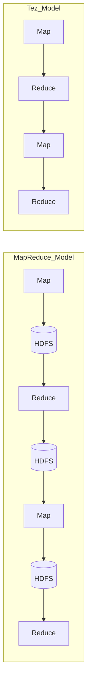
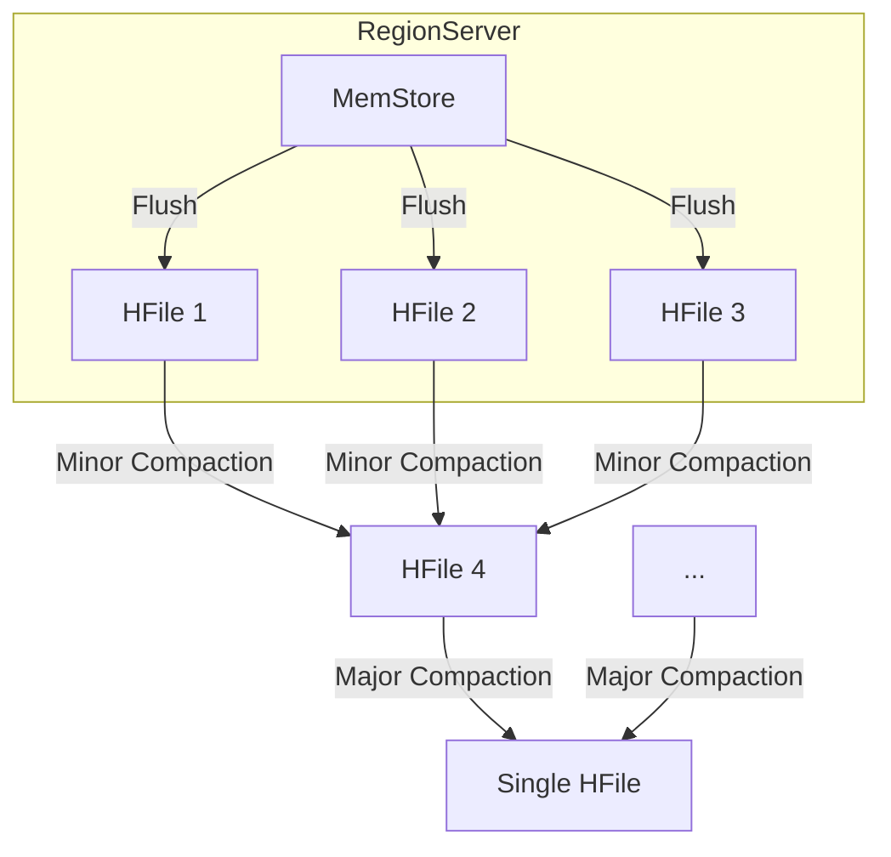

# Chapter 5: Hadoop Ecosystem

The true power of Hadoop lies not just in HDFS and MapReduce, but in the rich ecosystem of tools built on top of it. This chapter explores the key components that transform Hadoop from a low-level distributed file system and processing framework into a complete big data platform.

<Info>
**Chapter Goals**:
- Understand the Hadoop ecosystem landscape
- Master Hive for SQL on Hadoop
- Learn Pig for data flow programming
- Explore HBase for real-time NoSQL storage
- Study workflow orchestration with Oozie
- Understand data ingestion with Kafka and Flume
- Compare ecosystem tools and when to use each
</Info>

---

## Ecosystem Overview

### The Hadoop Stack

```text
+---------------------------------------------------------------+
|                  HADOOP ECOSYSTEM STACK                       |
+---------------------------------------------------------------+
|                                                               |
|  ┌─────────────────────────────────────────────────────────┐  |
|  │              APPLICATIONS & USE CASES                   │  |
|  │  Business Intelligence, Analytics, ML, ETL, Reporting   │  |
|  └─────────────────────────────────────────────────────────┘  |
|                           ↑                                   |
|  ┌─────────────────────────────────────────────────────────┐  |
|  │              HIGH-LEVEL TOOLS                           │  |
|  ├─────────────────────────────────────────────────────────┤  |
|  │  SQL Query:  │ Scripting:  │ ML:       │ Graph:        │  |
|  │  • Hive      │ • Pig       │ • Mahout  │ • Giraph      │  |
|  │  • Impala    │ • Cascading │ • Spark   │               │  |
|  │  • Presto    │             │   MLlib   │               │  |
|  └──────────────┴─────────────┴───────────┴───────────────┘  |
|                           ↑                                   |
|  ┌─────────────────────────────────────────────────────────┐  |
|  │         DATA PROCESSING FRAMEWORKS                      │  |
|  ├─────────────────────────────────────────────────────────┤  |
|  │  Batch:      │ Stream:     │ Interactive:              │  |
|  │  • MapReduce │ • Storm     │ • Impala                  │  |
|  │  • Spark     │ • Flink     │ • Presto                  │  |
|  │  • Tez       │ • Samza     │ • Drill                   │  |
|  └──────────────┴─────────────┴───────────────────────────┘  |
|                           ↑                                   |
|  ┌─────────────────────────────────────────────────────────┐  |
|  │         RESOURCE MANAGEMENT & ORCHESTRATION             │  |
|  ├─────────────────────────────────────────────────────────┤  |
|  │  • YARN (Resource Manager)                              │  |
|  │  • Oozie (Workflow Scheduler)                           │  |
|  │  • ZooKeeper (Coordination)                             │  |
|  └─────────────────────────────────────────────────────────┘  |
|                           ↑                                   |
|  ┌─────────────────────────────────────────────────────────┐  |
|  │              STORAGE LAYER                              │  |
|  ├─────────────────────────────────────────────────────────┤  |
|  │  Distributed FS:  │ NoSQL:    │ Ingestion:            │  |
|  │  • HDFS           │ • HBase   │ • Kafka               │  |
|  │  • S3             │ • Kudu    │ • Flume               │  |
|  │                   │           │ • Sqoop               │  |
|  └───────────────────┴───────────┴───────────────────────┘  |
|                                                               |
+---------------------------------------------------------------+

GUIDING PRINCIPLE:
─────────────────
Each layer builds on lower layers.
Higher layers provide easier abstractions.
Lower layers provide more control and flexibility.
```

### Why the Ecosystem Matters

<CardGroup cols={2}>
  <Card title="Abstraction" icon="layer-group">
    **Hide Complexity**:
    - MapReduce requires Java programming
    - Hive provides SQL interface
    - Easier onboarding, faster development
    - Reach more users (analysts, not just engineers)
  </Card>

  <Card title="Productivity" icon="rocket">
    **Faster Development**:
    - 100 lines of Java MapReduce → 5 lines of SQL
    - Pig reduces code by 10-20x
    - Faster iteration, fewer bugs
    - Focus on logic, not plumbing
  </Card>

  <Card title="Specialization" icon="screwdriver-wrench">
    **Right Tool for Job**:
    - Hive for SQL analytics
    - HBase for real-time access
    - Kafka for stream ingestion
    - Each optimized for specific use case
  </Card>

  <Card title="Innovation" icon="lightbulb">
    **Community-Driven**:
    - Open source enables experimentation
    - Best tools emerge organically
    - Spark displaced MapReduce
    - Ecosystem evolves with needs
  </Card>
</CardGroup>

---

## Apache Hive: SQL on Hadoop

### What is Hive?

Hive provides a SQL interface (HiveQL) to data stored in HDFS, translating SQL queries into MapReduce, Tez, or Spark jobs.

```text
+---------------------------------------------------------------+
|                    APACHE HIVE ARCHITECTURE                   |
+---------------------------------------------------------------+
|                                                               |
|  ┌──────────────────────────────────────────┐                 |
|  │  CLIENT (SQL Interface)                  │                 |
|  ├──────────────────────────────────────────┤                 |
|  │  • Hive CLI                              │                 |
|  │  • Beeline (JDBC client)                 │                 |
|  │  • JDBC/ODBC drivers                     │                 |
|  │  • BI tools (Tableau, PowerBI)           │                 |
|  └─────────────────┬────────────────────────┘                 |
|                    │                                          |
|                    │ HiveQL query                             |
|                    ↓                                          |
|  ┌──────────────────────────────────────────┐                 |
|  │  HIVE SERVER (HiveServer2)               │                 |
|  ├──────────────────────────────────────────┤                 |
|  │  ┌────────────────────────────────────┐  │                 |
|  │  │  Parser                            │  │                 |
|  │  │  (SQL → Abstract Syntax Tree)      │  │                 |
|  │  └────────────────────────────────────┘  │                 |
|  │  ┌────────────────────────────────────┐  │                 |
|  │  │  Semantic Analyzer                 │  │                 |
|  │  │  (Validate, resolve metadata)      │  │                 |
|  │  └────────────────────────────────────┘  │                 |
|  │  ┌────────────────────────────────────┐  │                 |
|  │  │  Logical Plan Generator            │  │                 |
|  │  │  (Operator tree)                   │  │                 |
|  │  └────────────────────────────────────┘  │                 |
|  │  ┌────────────────────────────────────┐  │                 |
|  │  │  Optimizer                         │  │                 |
|  │  │  (Predicate pushdown, join reorder)│  │                 |
|  │  └────────────────────────────────────┘  │                 |
|  │  ┌────────────────────────────────────┐  │                 |
|  │  │  Physical Plan (MapReduce/Tez)     │  │                 |
|  │  │  (Execution plan)                  │  │                 |
|  │  └────────────────────────────────────┘  │                 |
|  └──────────────────────────────────────────┘                 |
|                    │                                          |
|                    │ Submit MR/Tez job                        |
|                    ↓                                          |
|  ┌──────────────────────────────────────────┐                 |
|  │  EXECUTION ENGINE                        │                 |
|  ├──────────────────────────────────────────┤                 |
|  │  • MapReduce (slow)                      │                 |
|  │  • Tez (faster, DAG-based)               │                 |
|  │  • Spark (fastest, in-memory)            │                 |
|  └──────────────────────────────────────────┘                 |
|                    ↓                                          |
|  ┌──────────────────────────────────────────┐                 |
|  │  METASTORE                               │                 |
|  ├──────────────────────────────────────────┤                 |
|  │  Database: MySQL, PostgreSQL, Derby      │                 |
|  │  ┌────────────────────────────────────┐  │                 |
|  │  │  Tables:                           │  │                 |
|  │  │  • Table metadata                  │  │                 |
|  │  │  • Column types                    │  │                 |
|  │  │  • Partitions                      │  │                 |
|  │  │  • Storage location (HDFS path)    │  │                 |
|  │  │  • SerDe info                      │  │                 |
|  │  └────────────────────────────────────┘  │                 |
|  └──────────────────────────────────────────┘                 |
|                    ↓                                          |
|  ┌──────────────────────────────────────────┐                 |
|  │  STORAGE (HDFS)                          │                 |
|  ├──────────────────────────────────────────┤                 |
|  │  /user/hive/warehouse/                   │                 |
|  │    ├─ sales/                             │                 |
|  │    │  ├─ year=2023/                      │                 |
|  │    │  │  └─ month=01/                    │                 |
|  │    │  │     └─ data.parquet              │                 |
|  │    └─ users/                             │                 |
|  │       └─ data.orc                        │                 |
|  └──────────────────────────────────────────┘                 |
|                                                               |
+---------------------------------------------------------------+
```

### Hive Fundamentals

<Tabs>
  <Tab title="HiveQL Basics">
    **SQL-Like Syntax**

    ```sql
    -- CREATE TABLE
    CREATE TABLE employees (
      id INT,
      name STRING,
      salary DECIMAL(10,2),
      dept STRING,
      hire_date DATE
    )
    ROW FORMAT DELIMITED
    FIELDS TERMINATED BY ','
    STORED AS TEXTFILE;


    -- LOAD DATA
    LOAD DATA INPATH '/user/data/employees.csv'
    INTO TABLE employees;


    -- SELECT QUERY
    SELECT dept, AVG(salary) as avg_salary
    FROM employees
    WHERE hire_date >= '2020-01-01'
    GROUP BY dept
    HAVING AVG(salary) > 50000
    ORDER BY avg_salary DESC;


    -- JOIN
    SELECT e.name, e.salary, d.dept_name
    FROM employees e
    JOIN departments d
    ON e.dept = d.dept_id;


    -- SUBQUERY
    SELECT name, salary
    FROM employees
    WHERE salary > (
      SELECT AVG(salary) FROM employees
    );
    ```

    **Behind the Scenes**:

    Each query translates to MapReduce/Tez job:

    ```text
    SELECT dept, COUNT(*) FROM employees GROUP BY dept;

    ↓ Translates to:

    Map Phase:
    • Read employees table from HDFS
    • For each row, emit (dept, 1)

    Shuffle:
    • Group by dept

    Reduce Phase:
    • For each dept, sum counts
    • Write to HDFS

    Result written to temp HDFS location.
    ```
  </Tab>

  <Tab title="Partitioning">
    **Organizing Data for Performance**

    ```sql
    -- CREATE PARTITIONED TABLE
    CREATE TABLE sales (
      transaction_id STRING,
      amount DECIMAL(10,2),
      customer_id STRING
    )
    PARTITIONED BY (year INT, month INT)
    STORED AS PARQUET;


    -- LOAD DATA INTO PARTITION
    INSERT INTO TABLE sales
    PARTITION (year=2023, month=1)
    SELECT transaction_id, amount, customer_id
    FROM raw_sales
    WHERE year(transaction_date) = 2023
      AND month(transaction_date) = 1;
    ```

    **Directory Structure**:

    ```text
    /user/hive/warehouse/sales/
      ├─ year=2023/
      │  ├─ month=1/
      │  │  └─ 000000_0.parquet
      │  ├─ month=2/
      │  │  └─ 000000_0.parquet
      │  └─ month=3/
      │     └─ 000000_0.parquet
      └─ year=2024/
         ├─ month=1/
         │  └─ 000000_0.parquet
         └─ month=2/
            └─ 000000_0.parquet
    ```

    **Query with Partition Pruning**:

    ```sql
    SELECT SUM(amount)
    FROM sales
    WHERE year = 2023 AND month = 1;
    ```

    **Performance Impact**:

    ```text
    Without Partitioning:
    • Scan entire table (all 24 months)
    • Read: 10 TB
    • Time: 30 minutes

    With Partitioning:
    • Scan only year=2023/month=1/
    • Read: 400 GB
    • Time: 1 minute

    25x speedup!
    ```

    **Best Practices**:

    - Partition by frequently filtered columns (date, region, category)
    - Don't over-partition (too many small files)
    - Typical: 1-3 partition levels (e.g., year/month/day)
    - Avoid high-cardinality partitions (e.g., user_id)
  </Tab>

  <Tab title="File Formats">
    **Choosing Storage Format**

    ```sql
    -- TEXT (default, human-readable)
    CREATE TABLE users_text (
      id INT,
      name STRING
    )
    ROW FORMAT DELIMITED
    FIELDS TERMINATED BY ','
    STORED AS TEXTFILE;


    -- PARQUET (columnar, compressed)
    CREATE TABLE users_parquet (
      id INT,
      name STRING,
      age INT,
      email STRING
    )
    STORED AS PARQUET;


    -- ORC (Optimized Row Columnar)
    CREATE TABLE users_orc (
      id INT,
      name STRING,
      age INT,
      email STRING
    )
    STORED AS ORC;


    -- AVRO (schema evolution)
    CREATE TABLE users_avro
    STORED AS AVRO;
    ```

    **Format Comparison**:

    ```text
    ┌─────────┬──────────┬──────────┬─────────────┬────────┐
    │ Format  │ Type     │ Compress │ Query Speed │ Write  │
    ├─────────┼──────────┼──────────┼─────────────┼────────┤
    │ Text    │ Row      │ Poor     │ Slow        │ Fast   │
    │ Sequence│ Row      │ Good     │ Medium      │ Fast   │
    │ Avro    │ Row      │ Good     │ Medium      │ Medium │
    │ Parquet │ Columnar │ Excellent│ Fast        │ Medium │
    │ ORC     │ Columnar │ Excellent│ Fast        │ Medium │
    └─────────┴──────────┴──────────┴─────────────┴────────┘


    EXAMPLE: 1 Billion rows, 100 columns
    ─────────────────────────────────────

    Text (CSV):
    • Size: 1 TB
    • Compression: ~700 GB (gzip)
    • Query (SELECT col1, col2): Read 700 GB

    Parquet:
    • Size: 200 GB (built-in compression)
    • Query (SELECT col1, col2): Read 4 GB (only 2 columns!)
    • 175x faster query!


    WHEN TO USE:
    ───────────

    Text/CSV:
    • Human-readable debugging
    • One-time ingestion
    • Small datasets

    Parquet:
    • Analytical queries (SELECT few columns)
    • Long-term storage
    • Production data lakes

    ORC:
    • Hive-specific optimizations
    • ACID transactions (Hive 3+)
    • Slightly better than Parquet in Hive

    Avro:
    • Schema evolution (add/remove columns)
    • Streaming data (Kafka)
    • Row-based processing
    ```
  </Tab>

  <Tab title="Optimization">
    **Making Queries Faster**

    ```sql
    -- 1. BUCKETING (hash partitioning)
    CREATE TABLE users_bucketed (
      id INT,
      name STRING,
      email STRING
    )
    CLUSTERED BY (id) INTO 32 BUCKETS
    STORED AS PARQUET;

    -- Benefit: Efficient joins, sampling


    -- 2. MAP-SIDE JOIN (for small tables)
    SET hive.auto.convert.join=true;
    SET hive.mapjoin.smalltable.filesize=25000000; -- 25MB

    SELECT /*+ MAPJOIN(small_table) */
      big_table.*, small_table.name
    FROM big_table
    JOIN small_table
    ON big_table.id = small_table.id;

    -- Small table loaded into memory on each mapper
    -- No shuffle needed!


    -- 3. VECTORIZATION (process 1024 rows at once)
    SET hive.vectorized.execution.enabled=true;

    -- Benefit: 3-5x speedup on analytical queries


    -- 4. COST-BASED OPTIMIZATION (statistics)
    ANALYZE TABLE employees COMPUTE STATISTICS;
    ANALYZE TABLE employees COMPUTE STATISTICS FOR COLUMNS;

    -- Hive uses stats to:
    -- • Choose join order
    -- • Decide map-side vs reduce-side join
    -- • Optimize query plan


    -- 5. TEZ EXECUTION ENGINE
    SET hive.execution.engine=tez;  -- Default: mr

    -- Tez benefits:
    -- • DAG-based (vs multiple MR stages)
    -- • Container reuse
    -- • 2-10x faster than MapReduce


    -- 6. PARTITION PRUNING
    SELECT * FROM sales
    WHERE year = 2023 AND month = 1;

    -- Only reads year=2023/month=1/ partition


    -- 7. PREDICATE PUSHDOWN
    SELECT id, name FROM users
    WHERE age > 30;

    -- For Parquet/ORC:
    -- • Filter applied during file read
    -- • Skip entire row groups that don't match
    -- • Don't even read non-matching data
    ```

    **Query Performance Tips**:

    ```text
    SLOW QUERY:
    ──────────
    SELECT u.name, o.amount
    FROM big_orders o
    JOIN small_users u
    ON o.user_id = u.id
    WHERE u.region = 'US';

    Issues:
    • Big table on left (not optimal)
    • No hint for map-side join
    • Filter after join (wasteful)


    OPTIMIZED:
    ─────────
    SELECT /*+ MAPJOIN(u) */ u.name, o.amount
    FROM small_users u
    JOIN big_orders o
    ON u.id = o.user_id
    WHERE u.region = 'US';

    Improvements:
    • Map-side join (small table in memory)
    • Filter on small table first
    • Small table on left side
    • Result: 10-100x faster
    ```
  </Tab>
</Tabs>

### Hive Metastore

<AccordionGroup>
  <Accordion title="Metastore Architecture" icon="database">
    **Centralized Metadata Repository**

    ```text
    METASTORE ARCHITECTURE:
    ──────────────────────

    ┌──────────────────────────────────────┐
    │  Hive Clients                        │
    │  • Hive CLI                          │
    │  • Beeline                           │
    │  • Spark SQL                         │
    │  • Impala                            │
    │  • Presto                            │
    └───────────────┬──────────────────────┘
                    │
                    │ Thrift API
                    ↓
    ┌──────────────────────────────────────┐
    │  Metastore Service                   │
    │  (HiveMetastore)                     │
    └───────────────┬──────────────────────┘
                    │
                    │ JDBC
                    ↓
    ┌──────────────────────────────────────┐
    │  Metastore Database                  │
    │  (MySQL, PostgreSQL, Derby)          │
    ├──────────────────────────────────────┤
    │  Tables:                             │
    │  • DBS (databases)                   │
    │  • TBLS (tables)                     │
    │  • COLUMNS_V2 (columns)              │
    │  • PARTITIONS (partition metadata)   │
    │  • SDS (storage descriptors)         │
    │  • SERDES (serialization info)       │
    └──────────────────────────────────────┘


    STORED METADATA:
    ───────────────

    For each table:
    • Database name
    • Table name
    • Column names and types
    • Partition keys
    • Storage location (HDFS path)
    • File format (Parquet, ORC, etc.)
    • SerDe class
    • Bucket information
    • Table statistics
    ```

    **Example Metadata**:

    ```sql
    CREATE TABLE sales (
      id INT,
      amount DECIMAL(10,2)
    )
    PARTITIONED BY (year INT, month INT)
    STORED AS PARQUET
    LOCATION '/user/hive/warehouse/sales';
    ```

    **Metastore Entries**:

    ```text
    DBS table:
    ┌────────────────────────────────────┐
    │ DB_ID | NAME    | DESC | LOCATION  │
    ├───────┼─────────┼──────┼───────────┤
    │ 1     | default | ...  | /user/... │
    └────────────────────────────────────┘

    TBLS table:
    ┌───────────────────────────────────────────┐
    │ TBL_ID | DB_ID | TBL_NAME | TBL_TYPE   │
    ├────────┼───────┼──────────┼────────────┤
    │ 100    | 1     | sales    | MANAGED    │
    └───────────────────────────────────────────┘

    COLUMNS_V2 table:
    ┌─────────────────────────────────────────┐
    │ CD_ID | COLUMN_NAME | TYPE_NAME         │
    ├───────┼─────────────┼───────────────────┤
    │ 200   | id          | int               │
    │ 200   | amount      | decimal(10,2)     │
    └─────────────────────────────────────────┘

    PARTITIONS table:
    ┌───────────────────────────────────────┐
    │ PART_ID | TBL_ID | PART_NAME         │
    ├─────────┼────────┼───────────────────┤
    │ 300     | 100    | year=2023/month=1 │
    │ 301     | 100    | year=2023/month=2 │
    └───────────────────────────────────────┘

    SDS (Storage Descriptor):
    ┌──────────────────────────────────────────┐
    │ SD_ID | LOCATION                         │
    ├───────┼──────────────────────────────────┤
    │ 400   | /user/hive/warehouse/sales/...  │
    └──────────────────────────────────────────┘
    ```
  </Accordion>

  <Accordion title="Managed vs External Tables" icon="table">
    **Table Ownership**

    ```sql
    -- MANAGED TABLE (Hive owns data)
    CREATE TABLE managed_sales (
      id INT,
      amount DECIMAL
    );

    -- Data stored in Hive warehouse:
    -- /user/hive/warehouse/managed_sales/

    DROP TABLE managed_sales;
    -- Data DELETED from HDFS!


    -- EXTERNAL TABLE (Hive doesn't own data)
    CREATE EXTERNAL TABLE external_sales (
      id INT,
      amount DECIMAL
    )
    LOCATION '/data/sales';

    -- Data at /data/sales/ (outside Hive warehouse)

    DROP TABLE external_sales;
    -- Only metadata deleted, data remains!
    ```

    **When to Use Each**:

    ```text
    MANAGED TABLES:
    ──────────────

    Use when:
    • Hive is primary consumer
    • Want Hive to manage lifecycle
    • Data is temporary/intermediate

    Benefit:
    • DROP TABLE cleans everything
    • Simpler management


    EXTERNAL TABLES:
    ───────────────

    Use when:
    • Multiple tools access data (Hive, Spark, Impala)
    • Data produced outside Hive (Kafka, Flume)
    • Production data (don't want accidental deletion)

    Benefit:
    • Data survives table drop
    • Flexibility in storage location


    BEST PRACTICE:
    ─────────────

    Production: Use EXTERNAL tables
    Reason: Prevents accidental data loss
    ```
  </Accordion>

  <Accordion title="SerDe (Serializer/Deserializer)" icon="code">
    **Reading Custom Formats**

    ```sql
    -- Default: LazySimpleSerDe (CSV-like)
    CREATE TABLE default_format (
      id INT,
      name STRING
    )
    ROW FORMAT DELIMITED
    FIELDS TERMINATED BY ',';


    -- JSON SerDe
    CREATE TABLE json_data (
      id INT,
      name STRING,
      attributes MAP<STRING, STRING>
    )
    ROW FORMAT SERDE 'org.apache.hive.hcatalog.data.JsonSerDe';

    -- Can read JSON files directly!


    -- RegEx SerDe (parse logs)
    CREATE TABLE apache_logs (
      ip STRING,
      timestamp STRING,
      request STRING,
      status INT,
      bytes BIGINT
    )
    ROW FORMAT SERDE 'org.apache.hadoop.hive.serde2.RegexSerDe'
    WITH SERDEPROPERTIES (
      "input.regex" = "([^ ]*) [^ ]* [^ ]* \\[([^\\]]*)\\] \"([^\"]*)\" ([0-9]*) ([0-9]*)"
    );


    -- Parquet SerDe (built-in)
    CREATE TABLE parquet_data (
      id INT,
      name STRING
    )
    STORED AS PARQUET;
    -- Uses org.apache.hadoop.hive.ql.io.parquet.serde.ParquetHiveSerDe


    -- Custom SerDe (write your own!)
    CREATE TABLE custom_format (
      ...
    )
    ROW FORMAT SERDE 'com.company.CustomSerDe'
    WITH SERDEPROPERTIES (
      "field.delim" = "|",
      "escape.delim" = "\\"
    );
    ```

    **SerDe Flow**:

    ```text
    READ PATH:
    ─────────

    HDFS File
      ↓
    InputFormat (reads bytes)
      ↓
    SerDe (deserialize bytes → objects)
      ↓
    Hive Row Objects
      ↓
    Query Processing


    WRITE PATH:
    ──────────

    Query Results
      ↓
    Hive Row Objects
      ↓
    SerDe (serialize objects → bytes)
      ↓
    OutputFormat (write bytes)
      ↓
    HDFS File
    ```
  </Accordion>
</AccordionGroup>

### Deep Dive: Hive Metastore Scalability and the "Partition Explosion"

As data lakes grow to petabyte scale, the Hive Metastore often becomes the primary bottleneck in the entire stack.

#### 1. The Partition Bottleneck
In a standard RDBMS-backed Metastore (MySQL/PostgreSQL), a query like `SELECT * FROM sales WHERE year=2023` requires the Metastore to:
1.  Lookup the table `sales`.
2.  Scan the `PARTITIONS` table for all entries matching the filter.
3.  Fetch the `SDS` (Storage Descriptor) for each partition to find the HDFS paths.

**The Math of Failure**:
- If a table has **1,000,000 partitions** (common in high-cardinality data), a single ad-hoc query might force the Metastore to load 1GB of metadata into memory just to plan the scan.
- This leads to "Metastore OOM" and serialized query planning that can take minutes before a single mapper even starts.

#### 2. Scaling Strategies
- **Metastore Federation**: Splitting metadata across multiple Metastore instances based on database name.
- **Partition Pruning at the Source**: Ensuring clients use partition-bound filters to avoid full metadata scans.
- **Direct SQL**: Modern Hive versions use direct SQL queries to the backend DB instead of the slower DataNucleus ORM layer to fetch partitions.

---


## Deep Dive: Hive Query Lifecycle and Execution

To understand Hive's performance, one must look past the SQL interface into the transformation pipeline that converts a declarative query into a distributed DAG.

### 1. The Query Planning Pipeline

Hive's "Compiler" is a multi-stage engine that performs sophisticated optimizations before any data is touched.

| Stage | Action | Output |
| :--- | :--- | :--- |
| **Parser** | Tokenizes HiveQL using Antlr. | Abstract Syntax Tree (AST) |
| **Semantic Analyzer** | Resolves table names, column types, and partition metadata from the Metastore. | Query Block (QB) Tree |
| **Logical Plan Gen** | Converts QB tree into basic relational algebra operators (Filter, Join, Project). | Operator Tree (Initial) |
| **Optimizer** | Applies rules like Predicate Pushdown, Column Pruning, and Partition Pruning. | Operator Tree (Optimized) |
| **Physical Plan Gen** | Breaks the operator tree into executable tasks (MapReduce, Tez, or Spark). | Task Tree (DAG) |

### 2. Tez vs. MapReduce: The DAG Revolution

While Hive 1.x relied on MapReduce, modern Hive (2.x/3.x) uses **Apache Tez** to eliminate the "HDFS barrier" between jobs.

- **MapReduce Barrier**: Every stage in a complex query (e.g., multiple joins) must write intermediate data to HDFS, causing massive I/O overhead.
- **Tez DAG**: Tez allows data to flow directly from one task to the next (e.g., Map -> Reduce -> Reduce) without intermediate HDFS writes. It uses a **Directed Acyclic Graph** of tasks.



### 3. LLAP (Live Long and Process)

Introduced in Hive 2.0, **LLAP** is a hybrid architecture that combines persistent query servers with standard YARN containers.

- **Persistent Daemons**: Instead of starting a new JVM for every task (high latency), LLAP uses long-running daemons on worker nodes.
- **In-Memory Caching**: LLAP caches columnar data (ORC/Parquet) in a smart, asynchronous cache, avoiding repetitive HDFS reads.
- **Vectorized Execution**: LLAP processes data in batches of 1024 rows at a time using SIMD instructions, drastically reducing CPU cycles per row.

| Feature | Standard Hive | Hive with LLAP |
| :--- | :--- | :--- |
| **Startup Latency** | High (Container launch) | Ultra-low (Always-on daemons) |
| **Data Access** | HDFS Scan | In-Memory Cache + HDFS |
| **Execution** | MapReduce/Tez Tasks | Fragment-based execution |
| **Target Use Case** | Large Batch ETL | Interactive BI / Sub-second SQL |

---

## Apache Pig: Data Flow Language

### What is Pig?

Pig provides a high-level scripting language (Pig Latin) for data transformations, compiling to MapReduce/Tez jobs.

```text
+---------------------------------------------------------------+
|                      APACHE PIG ARCHITECTURE                  |
+---------------------------------------------------------------+
|                                                               |
|  ┌──────────────────────────────────────────┐                 |
|  │  PIG SCRIPT (Pig Latin)                  │                 |
|  ├──────────────────────────────────────────┤                 |
|  │  data = LOAD '/input' AS (id, name);     │                 |
|  │  filtered = FILTER data BY id > 100;     │                 |
|  │  grouped = GROUP filtered BY name;       │                 |
|  │  counts = FOREACH grouped GENERATE       │                 |
|  │             group, COUNT(filtered);      │                 |
|  │  STORE counts INTO '/output';            │                 |
|  └──────────────────┬───────────────────────┘                 |
|                     │                                         |
|                     │ Submit                                  |
|                     ↓                                         |
|  ┌──────────────────────────────────────────┐                 |
|  │  PIG COMPILER                            │                 |
|  ├──────────────────────────────────────────┤                 |
|  │  • Parser (Pig Latin → logical plan)     │                 |
|  │  • Optimizer (merge, push filters)       │                 |
|  │  • Physical plan (MR/Tez operators)      │                 |
|  │  • Generate MapReduce jobs               │                 |
|  └──────────────────┬───────────────────────┘                 |
|                     │                                         |
|                     │ Submit MR jobs                          |
|                     ↓                                         |
|  ┌──────────────────────────────────────────┐                 |
|  │  EXECUTION ENGINE                        │                 |
|  │  (MapReduce, Tez)                        │                 |
|  └──────────────────────────────────────────┘                 |
|                                                               |
+---------------------------------------------------------------+

DESIGN PHILOSOPHY:
─────────────────

• Procedural (not declarative like SQL)
• Dataflow-oriented (transformations on datasets)
• Schema-optional (can work without strict types)
• ETL-focused (Extract, Transform, Load)
```

### Pig Latin Basics

<Tabs>
  <Tab title="Core Operations">
    **Fundamental Pig Commands**

    ```pig
    -- LOAD data from HDFS
    users = LOAD '/data/users.csv'
            USING PigStorage(',')
            AS (id:int, name:chararray, age:int, city:chararray);


    -- FILTER rows
    adults = FILTER users BY age >= 18;


    -- FOREACH (transform each row)
    names_ages = FOREACH adults GENERATE name, age;


    -- GROUP BY
    by_city = GROUP users BY city;

    -- Result: {group: "NYC", users: {(1, "Alice", 30, "NYC"), (2, "Bob", 25, "NYC")}}


    -- JOIN
    orders = LOAD '/data/orders.csv'
             AS (order_id:int, user_id:int, amount:double);

    joined = JOIN users BY id, orders BY user_id;


    -- ORDER BY
    sorted = ORDER users BY age DESC;


    -- DISTINCT
    unique_cities = DISTINCT (FOREACH users GENERATE city);


    -- LIMIT
    top_10 = LIMIT sorted 10;


    -- STORE results
    STORE top_10 INTO '/output' USING PigStorage('\t');
    ```

    **Example: Word Count in Pig**

    ```pig
    -- Load input
    lines = LOAD '/input/books.txt' AS (line:chararray);

    -- Split into words
    words = FOREACH lines GENERATE FLATTEN(TOKENIZE(line)) AS word;

    -- Group by word
    grouped = GROUP words BY word;

    -- Count
    counts = FOREACH grouped GENERATE group AS word, COUNT(words) AS count;

    -- Sort by count descending
    sorted = ORDER counts BY count DESC;

    -- Store result
    STORE sorted INTO '/output/wordcount';
    ```

    **Equivalent in MapReduce: ~200 lines of Java!**
  </Tab>

  <Tab title="Advanced Features">
    **Power User Techniques**

    ```pig
    -- COGROUP (group multiple datasets)
    users = LOAD '/users' AS (id, name);
    orders = LOAD '/orders' AS (order_id, user_id, amount);

    cogrouped = COGROUP users BY id, orders BY user_id;

    -- Result: {group: 1, users: {(1,"Alice")}, orders: {(101,1,50), (102,1,75)}}


    -- FLATTEN (unnest)
    flattened = FOREACH cogrouped
                GENERATE group,
                         FLATTEN(users),
                         FLATTEN(orders);


    -- UDF (User Defined Function)
    REGISTER 'my_udfs.jar';

    processed = FOREACH users
                GENERATE id, com.company.MyUDF(name) AS processed_name;


    -- NESTED FOREACH
    by_city = GROUP users BY city;

    result = FOREACH by_city {
      sorted = ORDER users BY age DESC;
      top_3 = LIMIT sorted 3;
      GENERATE group AS city, top_3;
    }


    -- CROSS (Cartesian product)
    colors = LOAD '/colors' AS (color:chararray);
    sizes = LOAD '/sizes' AS (size:chararray);

    combinations = CROSS colors, sizes;


    -- UNION
    dataset1 = LOAD '/data1' AS (id, value);
    dataset2 = LOAD '/data2' AS (id, value);

    combined = UNION dataset1, dataset2;


    -- SAMPLE (random sampling)
    sampled = SAMPLE users 0.1;  -- 10% sample


    -- SPLIT (conditional split)
    SPLIT users INTO
      young IF age < 30,
      old IF age >= 30;
    ```
  </Tab>

  <Tab title="Pig vs Hive">
    **When to Use Each**

    ```text
    USE CASE: Calculate average order by city
    ─────────────────────────────────────────

    HIVE (Declarative SQL):
    ──────────────────────

    SELECT city, AVG(amount) as avg_order
    FROM users u
    JOIN orders o ON u.id = o.user_id
    GROUP BY city;


    PIG (Procedural Dataflow):
    ─────────────────────────

    users = LOAD '/users' AS (id, name, city);
    orders = LOAD '/orders' AS (order_id, user_id, amount);
    joined = JOIN users BY id, orders BY user_id;
    grouped = GROUP joined BY city;
    result = FOREACH grouped
             GENERATE group AS city, AVG(joined.amount) AS avg_order;
    STORE result INTO '/output';


    COMPARISON:
    ──────────

    ┌──────────────┬─────────────┬─────────────────┐
    │ Aspect       │ Hive        │ Pig             │
    ├──────────────┼─────────────┼─────────────────┤
    │ Language     │ SQL-like    │ Procedural      │
    │ Users        │ Analysts    │ Engineers       │
    │ Use Case     │ Analytics   │ ETL pipelines   │
    │ Learning     │ Easy (SQL)  │ Moderate        │
    │ Flexibility  │ Medium      │ High            │
    │ Schema       │ Required    │ Optional        │
    │ Optimization │ Automatic   │ Manual control  │
    └──────────────┴─────────────┴─────────────────┘


    CHOOSE HIVE WHEN:
    ────────────────

    • Users know SQL
    • Ad-hoc analytics
    • BI tool integration
    • Formal schemas
    • Let optimizer decide plan


    CHOOSE PIG WHEN:
    ───────────────

    • Complex data flows
    • ETL pipelines
    • Iterative development
    • Schema evolution
    • Need fine-grained control
    • Custom UDFs common


    TREND:
    ─────

    Both declining in favor of Apache Spark:
    • Faster (in-memory)
    • More expressive (DataFrames, SQL)
    • Unified API (batch + stream)

    But Hive/Pig still widely used in legacy systems.
    ```
  </Tab>
</Tabs>

---

## Apache HBase: NoSQL on HDFS

### What is HBase?

HBase is a distributed, column-oriented NoSQL database built on HDFS, modeled after Google's Bigtable.

```text
+---------------------------------------------------------------+
|                    APACHE HBASE ARCHITECTURE                  |
+---------------------------------------------------------------+
|                                                               |
|  ┌──────────────────────────────────────────┐                 |
|  │  CLIENT                                  │                 |
|  │  (HBase Shell, Java API, REST/Thrift)    │                 |
|  └───────────────┬──────────────────────────┘                 |
|                  │                                            |
|                  │ RPC                                        |
|                  ↓                                            |
|  ┌──────────────────────────────────────────┐                 |
|  │  HMASTER (Cluster Master)                │                 |
|  ├──────────────────────────────────────────┤                 |
|  │  • Assign regions to RegionServers       │                 |
|  │  • Handle region splits/merges           │                 |
|  │  • Schema changes (create/delete tables) │                 |
|  │  • Load balancing                        │                 |
|  └──────────────────────────────────────────┘                 |
|                  ↑                                            |
|  ┌───────────────┴──────────────────────┐                     |
|  │         ZOOKEEPER                    │                     |
|  ├──────────────────────────────────────┤                     |
|  │  • Cluster coordination              │                     |
|  │  • Master election                   │                     |
|  │  • Region assignment tracking        │                     |
|  └──────────────────────────────────────┘                     |
|                  ↑                                            |
|  ┌───────────────┴──────────────────────────────┐             |
|  │  REGIONSERVER 1  │  REGIONSERVER 2  │  ...   │             |
|  ├──────────────────┼──────────────────┼────────┤             |
|  │  ┌────────────┐  │  ┌────────────┐  │        │             |
|  │  │ Region A   │  │  │ Region B   │  │        │             |
|  │  ├────────────┤  │  ├────────────┤  │        │             |
|  │  │ MemStore   │  │  │ MemStore   │  │        │             |
|  │  │ (in-memory)│  │  │ (in-memory)│  │        │             |
|  │  ├────────────┤  │  ├────────────┤  │        │             |
|  │  │ BlockCache │  │  │ BlockCache │  │        │             |
|  │  │ (reads)    │  │  │ (reads)    │  │        │             |
|  │  └────────────┘  │  └────────────┘  │        │             |
|  └──────────────────┴──────────────────┴────────┘             |
|                  ↓                                            |
|  ┌──────────────────────────────────────────┐                 |
|  │  HDFS (Persistent Storage)               │                 |
|  ├──────────────────────────────────────────┤                 |
|  │  HFiles (SSTable format):                │                 |
|  │  • Immutable sorted files                │                 |
|  │  • Stored per column family              │                 |
|  │  • 3x replicated (HDFS)                  │                 |
|  └──────────────────────────────────────────┘                 |
|                                                               |
+---------------------------------------------------------------+

DATA MODEL:
──────────

Table: users
┌─────────────┬──────────────────────────────────────────┐
│ Row Key     │ Column Family: info    │ Column Family: │
│             │                        │ prefs          │
├─────────────┼────────────────────────┼────────────────┤
│ user_001    │ info:name = "Alice"    │ prefs:theme=   │
│             │ info:email= "a@x.com"  │   "dark"       │
│             │ ts=1234567890          │ ts=1234567891  │
├─────────────┼────────────────────────┼────────────────┤
│ user_002    │ info:name = "Bob"      │ prefs:lang=    │
│             │ info:email= "b@x.com"  │   "en"         │
│             │ ts=1234567892          │ ts=1234567893  │
└─────────────┴────────────────────────┴────────────────┘

KEY CONCEPTS:
────────────

• Row Key: Primary key, lexicographically sorted
• Column Family: Physical grouping of columns
• Column Qualifier: Column name within family
• Cell: (row, column family, column, timestamp) → value
• Timestamp: Version of cell (multi-versioning)
• Sparse: Rows can have different columns
```

### HBase Operations

<Tabs>
  <Tab title="Basic CRUD">
    **Create, Read, Update, Delete**

    ```java
    // CREATE TABLE
    HBaseAdmin admin = new HBaseAdmin(conf);
    HTableDescriptor tableDesc = new HTableDescriptor(TableName.valueOf("users"));
    tableDesc.addFamily(new HColumnDescriptor("info"));
    tableDesc.addFamily(new HColumnDescriptor("prefs"));
    admin.createTable(tableDesc);


    // PUT (insert or update)
    HTable table = new HTable(conf, "users");
    Put put = new Put(Bytes.toBytes("user_001"));
    put.addColumn(Bytes.toBytes("info"), Bytes.toBytes("name"),
                  Bytes.toBytes("Alice"));
    put.addColumn(Bytes.toBytes("info"), Bytes.toBytes("email"),
                  Bytes.toBytes("alice@example.com"));
    table.put(put);


    // GET (read single row)
    Get get = new Get(Bytes.toBytes("user_001"));
    Result result = table.get(get);
    byte[] name = result.getValue(Bytes.toBytes("info"), Bytes.toBytes("name"));
    System.out.println("Name: " + Bytes.toString(name));


    // SCAN (read multiple rows)
    Scan scan = new Scan();
    scan.setStartRow(Bytes.toBytes("user_000"));
    scan.setStopRow(Bytes.toBytes("user_100"));
    ResultScanner scanner = table.getScanner(scan);
    for (Result r : scanner) {
      // Process each row
    }
    scanner.close();


    // DELETE
    Delete delete = new Delete(Bytes.toBytes("user_001"));
    table.delete(delete);
    ```

    **HBase Shell**:

    ```bash
    # Create table
    create 'users', 'info', 'prefs'

    # Put data
    put 'users', 'user_001', 'info:name', 'Alice'
    put 'users', 'user_001', 'info:email', 'alice@example.com'

    # Get data
    get 'users', 'user_001'

    # Scan table
    scan 'users', {STARTROW => 'user_000', STOPROW => 'user_100'}

    # Count rows
    count 'users'

    # Delete row
    deleteall 'users', 'user_001'

    # Disable and drop table
    disable 'users'
    drop 'users'
    ```
  </Tab>

  <Tab title="Row Key Design">
    **Critical for Performance**

    ```text
    PROBLEM: Sequential Row Keys
    ───────────────────────────

    Bad Design:
    Row keys: timestamp_00001, timestamp_00002, ...

    Issue:
    • All writes go to SAME region (hotspot!)
    • Region 1: [timestamp_00001 to timestamp_10000]
    • Region 2: [timestamp_10001 to timestamp_20000]
    • New writes always hit Region 2
    • Other regions idle


    SOLUTION 1: Salting (hash prefix)
    ─────────────────────────────────

    Original: timestamp_00001
    Salted:   {hash(timestamp) % 10}_timestamp_00001

    Result:
    • Writes distributed across 10 regions
    • No hotspot!

    Trade-off:
    • Range scans more complex (need to query all salts)


    SOLUTION 2: Reverse Timestamp
    ─────────────────────────────

    For most recent data access:

    Row key: {Long.MAX_VALUE - timestamp}_userId

    Result:
    • Recent data has lowest row key
    • Scan from beginning gets newest first


    SOLUTION 3: Composite Keys
    ──────────────────────────

    userId_timestamp

    Benefits:
    • All user's data together
    • Can scan user's history efficiently
    • Natural distribution (different users)


    BEST PRACTICES:
    ──────────────

    1. Avoid sequential IDs
       Bad:  1, 2, 3, 4, ...
       Good: uuid(), hash(id), ...

    2. Consider access patterns
       • Frequent: Recent user events
       • Row key: userId_reverseTimestamp

    3. Pre-split table
       • Create regions upfront
       • Distribute load from start

    4. Keep row keys short
       • Stored in every cell
       • Long keys waste space


    EXAMPLE: URL Shortener
    ─────────────────────

    Bad:  shortCode (e.g., "abc123")
    Why:  All reads/writes hit same region initially

    Good: {hash(shortCode) % 100}_shortCode
    Why:  100-way distribution from start
    ```
  </Tab>

  <Tab title="HBase vs HDFS/RDBMS">
    **When to Use HBase**

    ```text
    HBASE vs HDFS:
    ─────────────

    ┌──────────────────┬───────────┬──────────────┐
    │ Feature          │ HDFS      │ HBase        │
    ├──────────────────┼───────────┼──────────────┤
    │ Access Pattern   │ Batch     │ Random R/W   │
    │ Latency          │ Minutes   │ Milliseconds │
    │ Updates          │ Append    │ Yes          │
    │ Deletes          │ No        │ Yes          │
    │ Point Lookups    │ Slow      │ Fast         │
    │ Full Scans       │ Fast      │ Slow         │
    │ Use Case         │ Analytics │ Serving      │
    └──────────────────┴───────────┴──────────────┘


    HBASE vs RDBMS:
    ──────────────

    ┌──────────────────┬────────────┬──────────────┐
    │ Feature          │ RDBMS      │ HBase        │
    ├──────────────────┼────────────┼──────────────┤
    │ Schema           │ Strict     │ Flexible     │
    │ Transactions     │ ACID       │ Row-level    │
    │ Joins            │ Yes        │ No (manual)  │
    │ Secondary Index  │ Yes        │ Limited      │
    │ Scale            │ Vertical   │ Horizontal   │
    │ Consistency      │ Strong     │ Eventual*    │
    │ Max Data         │ TBs        │ PBs          │
    └──────────────────┴────────────┴──────────────┘

    * HBase provides strong consistency within single row


    USE HBASE WHEN:
    ──────────────

    ✓ Need random read/write at scale (billions of rows)
    ✓ Sparse data (rows with different columns)
    ✓ Time-series data (append-heavy)
    ✓ Key-value lookups (user profiles, session data)
    ✓ Write-heavy workloads
    ✓ Horizontal scalability required


    DON'T USE HBASE WHEN:
    ────────────────────

    ✗ Need complex joins
    ✗ Need ACID transactions across rows
    ✗ Small dataset (< 1 billion rows)
    ✗ Primarily analytical queries (use Hive)
    ✗ Need secondary indexes (use Cassandra)


    COMMON USE CASES:
    ────────────────

    • User profiles (billions of users)
    • Message/email storage (Facebook Messages)
    • Time-series data (sensor data, logs)
    • Recommendation systems (feature vectors)
    • Content management (versioned documents)
    • Social graphs (following relationships)
    ```
  </Tab>
</Tabs>

## Deep Dive: HBase Internals and Storage Engine

HBase is not a relational database; it is a **Log-Structured Merge-Tree (LSM-Tree)** based storage system. This architecture is optimized for high-write throughput and sequential disk I/O.

### 1. The Write Path: WAL and MemStore

Every write to HBase follows a strict "Persistence First" protocol to ensure data durability even if a RegionServer crashes.

1.  **WAL (Write-Ahead Log)**: The write is first appended to a log on HDFS. If the server dies, this log is used to replay the data.
2.  **MemStore**: After the WAL is synced, the data is written to an in-memory sorted buffer called the **MemStore**.
3.  **Acknowledgement**: The client receives a success response as soon as the data is in the MemStore.

### 2. MemStore Flush and HFile Creation

When a MemStore reaches its threshold (e.g., 128MB), it is "flushed" to HDFS as an **HFile**.

- **HFile (SSTable)**: A sorted, immutable file. Once written, it is never changed.
- **BlockIndex**: Each HFile contains an index of its data blocks for fast binary search during lookups.

### 3. LSM-Tree and Read Amplification

Because HFiles are immutable, a single row might have data scattered across multiple HFiles (e.g., an update in HFile 3 overriding a value in HFile 1).

- **Read Path**: HBase must check the MemStore, then scan multiple HFiles, merging the results to find the latest version of a cell. This is known as **Read Amplification**.
- **Bloom Filters**: To speed this up, HBase uses Bloom Filters to skip HFiles that definitely do not contain a specific row key.

### 4. Compaction: Managing File Bloat

To prevent the number of HFiles from growing indefinitely, HBase performs **Compaction**.

| Type | Action | Impact |
| :--- | :--- | :--- |
| **Minor Compaction** | Picks a few small HFiles and merges them into one slightly larger HFile. | Low I/O; cleans up some "Read Amplification". |
| **Major Compaction** | Merges **ALL** HFiles in a Column Family into a single file. | High I/O; deletes expired cells and tombstones (deletes). |



### 5. Data Locality and HDFS Interaction

HBase achieves "Local Reads" by scheduling RegionServers on the same nodes as their HDFS DataNodes. When a MemStore flushes, the first replica is written to the local disk. Over time, as regions move, HBase relies on the HDFS **Balancer** and major compactions to restore data locality.

### 6. The Mathematics of Region Sizing

A common failure in production HBase clusters is "Region Squatting"—having too many regions per RegionServer, which fragments the available MemStore memory.

**The Capacity Formula**:
The maximum number of regions a RegionServer can safely handle is bounded by the total MemStore heap:

$$MaxRegions = \frac{RS\_Heap \times MemStore\_Fraction}{MemStore\_Flush\_Size \times Num\_Column\_Families}$$

*Example*:
- **Heap**: 32GB
- **MemStore Fraction**: 0.4 (40% of heap reserved for writes)
- **Flush Size**: 128MB
- **Column Families**: 2
- **Result**: $\frac{32,768 \times 0.4}{128 \times 2} \approx 51$ regions.

**Consequence of Over-provisioning**:
If you host 500 regions on this server, each region only gets ~2.5MB of MemStore. This causes "Thundering Flushes" where the server spends all its time writing tiny HFiles, leading to massive compaction pressure and I/O saturation.

### 7. The Region Split Protocol (State Machine)

When a region exceeds the `hbase.hregion.max.filesize` (e.g., 10GB), it must split. This is a complex distributed transaction coordinated via ZooKeeper:

1.  **PRE_SPLIT**: RegionServer (RS) creates a `split` znode in ZooKeeper.
2.  **OFFLINE**: RS takes the parent region offline, stopping all writes.
3.  **DAUGHTER_CREATION**: RS creates two "Reference Files" (daughter regions) pointing to the parent's HFiles. This is a metadata-only operation (very fast).
4.  **OPEN_DAUGHTERS**: RS opens the two daughter regions and begins serving requests.
5.  **POST_SPLIT**: RS updates the `.META.` table and deletes the parent region metadata.
6.  **Compaction (Background)**: Over time, the daughter regions undergo compaction, which physically splits the parent HFiles into new, independent HFiles, eventually deleting the reference files.

---

## Ecosystem Integration and Coordination

Beyond storage and processing, the ecosystem requires robust coordination and ingestion tools.

### 1. Apache ZooKeeper: The Glue
ZooKeeper is a distributed coordination service used by almost every component:
- **HBase**: Master election and region server tracking.
- **HDFS**: NameNode HA leader election.
- **YARN**: ResourceManager HA and state management.

### 2. Apache Oozie: Workflow Orchestration
Oozie manages complex pipelines of Hadoop jobs.
- **Workflow**: A DAG of actions (Hive query -> Pig script -> MapReduce job).
- **Coordinator**: Triggers workflows based on time or data availability (e.g., "Run every day at 2 AM" or "Run when the /sales/today folder exists").

### 3. Data Ingestion: Sqoop and Flume
- **Sqoop (SQL-to-Hadoop)**: Efficiently transfers bulk data between RDBMS (MySQL, Oracle) and HDFS/Hive.
- **Flume**: A distributed service for collecting, aggregating, and moving large amounts of streaming log data into HDFS.

---

## Conclusion: The Modern Hadoop Stack

Today, the "Hadoop Ecosystem" has evolved. While Hive remains the standard for SQL-on-HDFS, many processing tasks have shifted to **Apache Spark** due to its in-memory performance. However, the core principles of the Hadoop ecosystem—separation of storage (HDFS), resource management (YARN), and specialized processing engines—continue to define modern big data architecture.

