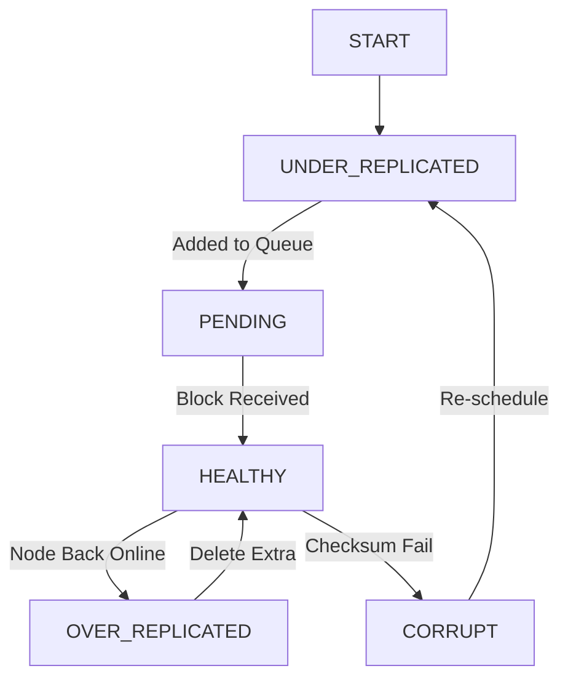

# Chapter 6: Fault Tolerance and Reliability

In distributed systems, failure is not an exception—it's the norm. Hadoop was designed from the ground up to operate reliably in environments where individual components fail regularly. This chapter explores the sophisticated fault tolerance mechanisms that make Hadoop one of the most resilient distributed systems ever built.

<Info>
**Chapter Goals**:
- Master HDFS replication and recovery mechanisms
- Understand MapReduce fault tolerance strategies
- Learn YARN reliability features
- Explore failure detection and handling
- Design fault-tolerant Hadoop applications
</Info>

---

## The Philosophy of Failure in Distributed Systems

### Why Fault Tolerance is Critical

```text
+---------------------------------------------------------------+
|              FAILURE PROBABILITY AT SCALE                     |
+---------------------------------------------------------------+
|                                                               |
|  Single Machine (99.9% uptime):                               |
|  ┌────────────────────────────────────────┐                   |
|  │ Downtime: ~8.7 hours/year             │                   |
|  │ Reliability: Good for single server    │                   |
|  └────────────────────────────────────────┘                   |
|                                                               |
|  1000-Node Cluster (each 99.9% uptime):                       |
|  ┌────────────────────────────────────────┐                   |
|  │ At any moment:                         │                   |
|  │ • 1 node down on average               │                   |
|  │ • Multiple failures per day likely     │                   |
|  │ • Correlated failures possible         │                   |
|  │                                        │                   |
|  │ Without fault tolerance:               │                   |
|  │ ✗ Jobs fail constantly                 │                   |
|  │ ✗ Data loss is inevitable              │                   |
|  │ ✗ System becomes unusable              │                   |
|  └────────────────────────────────────────┘                   |
|                                                               |
|  With Hadoop Fault Tolerance:                                 |
|  ┌────────────────────────────────────────┐                   |
|  │ ✓ Jobs complete despite failures       │                   |
|  │ ✓ Data is never lost                   │                   |
|  │ ✓ System remains operational           │                   |
|  │ ✓ Transparent recovery                 │                   |
|  └────────────────────────────────────────┘                   |
|                                                               |
+---------------------------------------------------------------+
```

### Types of Failures Hadoop Handles

<AccordionGroup>
  <Accordion title="Hardware Failures" icon="server">
    **Disk Failures**:
    - Individual disk corruption or crash
    - RAID controller failures
    - Storage network issues
    - Silent data corruption

    **Node Failures**:
    - Complete server crash
    - Power supply failure
    - Memory errors (ECC failures)
    - CPU/motherboard failure
    - Network interface card failure

    **Network Failures**:
    - Switch failures
    - Cable disconnections
    - Network partition (split-brain)
    - Bandwidth congestion
    - DNS resolution failures
  </Accordion>

  <Accordion title="Software Failures" icon="code">
    **Process Crashes**:
    - Out of memory errors
    - Segmentation faults
    - Uncaught exceptions
    - Resource exhaustion

    **Bugs**:
    - Data processing errors
    - Infinite loops
    - Deadlocks
    - Race conditions

    **Configuration Errors**:
    - Incorrect settings
    - Version mismatches
    - Permission issues
  </Accordion>

  <Accordion title="Performance Degradation" icon="gauge">
    **Slow Nodes (Stragglers)**:
    - Disk degradation
    - CPU thermal throttling
    - Memory pressure
    - Network congestion

    **Resource Contention**:
    - Competing workloads
    - Background processes
    - I/O bottlenecks
  </Accordion>
</AccordionGroup>

---

## HDFS Fault Tolerance Mechanisms

### Data Replication Architecture

```text
+---------------------------------------------------------------+
|                 HDFS REPLICATION STRATEGY                     |
+---------------------------------------------------------------+
|                                                               |
|  Block Placement Policy (Rack-Aware):                         |
|                                                               |
|    Rack 1              Rack 2              Rack 3             |
|  ┌─────────┐        ┌─────────┐        ┌─────────┐           |
|  │ Node A  │        │ Node C  │        │ Node E  │           |
|  │  Blk 1  │◄───────│  Blk 1  │        │         │           |
|  │ [Replica│   Copy │ [Replica│        │         │           |
|  │    1]   │        │    2]   │        │         │           |
|  └─────────┘        └─────────┘        └─────────┘           |
|  ┌─────────┐        ┌─────────┐        ┌─────────┐           |
|  │ Node B  │        │ Node D  │        │ Node F  │           |
|  │  Blk 1  │        │         │        │         │           |
|  │ [Replica│        │         │        │         │           |
|  │    3]   │        │         │        │         │           |
|  └─────────┘        └─────────┘        └─────────┘           |
|      ▲                                                        |
|      │                                                        |
|      └──────────────────────────────────┐                     |
|                                         │                     |
|  Placement Strategy:                    │                     |
|  1. First replica: Same node as writer (or random)            |
|  2. Second replica: Different rack                            |
|  3. Third replica: Same rack as #2, different node            |
|                                                               |
|  Benefits:                                                    |
|  • Survives rack failure (lose 1 replica)                     |
|  • Survives node failures (lose 1-2 replicas)                 |
|  • Fast local reads when possible                             |
|  • Balanced network usage                                     |
|                                                               |
+---------------------------------------------------------------+
```

## Deep Dive: Rack Awareness vs. DynamoDB AZ-Awareness

Hadoop's **Rack Awareness** and DynamoDB's **AZ-Awareness** share the same goal: ensuring that a single infrastructure failure (like a top-of-rack switch or a data center power outage) does not result in data loss.

### 1. The Strategy Comparison

| Feature | Hadoop Rack Awareness | DynamoDB AZ-Awareness |
| :--- | :--- | :--- |
| **Fault Domain** | Physical Server Rack (Power/Network) | AWS Availability Zone (Data Center) |
| **Data Placement** | 1st: Local, 2nd: Remote Rack, 3rd: Same as 2nd | Automatically spread across 3 AZs |
| **Distance Metric** | Network hops (Topology script) | Logical AZ IDs |
| **Consistency** | Eventual (Replication Pipeline) | Strong or Eventual (Paxos Quorum) |

### 2. Implementation Differences
- **Hadoop**: Relies on a **Topology Script** (typically `/etc/hadoop/conf/topology.sh`) that maps IP addresses to rack IDs (e.g., `/dc1/rack1`). The NameNode uses this map to calculate the "distance" between nodes.
- **DynamoDB**: Managed by AWS. The partitioning logic automatically ensures that replicas for a single partition are never placed in the same AZ. This is transparent to the user, unlike Hadoop where you must manually configure the topology.

### 3. Locality vs. Durability
- **Hadoop Locality**: Prioritizes "Local Reads" (Reading from the same node). If the local node is down, it falls back to the same rack.
- **DynamoDB Locality**: Prioritizes "AZ Locality" for reads. While you can't request a "Node Local" read, DynamoDB routes requests to the closest healthy replica to minimize latency.

---

### Replication Factor Configuration

```java
// HDFS replication configuration examples

// 1. Global default (hdfs-site.xml)
<property>
  <name>dfs.replication</name>
  <value>3</value>
  <description>Default block replication factor</description>
</property>

// 2. Per-file replication at write time
Configuration conf = new Configuration();
FileSystem fs = FileSystem.get(conf);

// Set replication for specific file
Path filePath = new Path("/data/important.txt");
FSDataOutputStream out = fs.create(
    filePath,
    true,        // overwrite
    4096,        // buffer size
    (short) 5,   // replication factor = 5 (critical data)
    134217728    // block size (128MB)
);

// 3. Change replication for existing file
fs.setReplication(new Path("/data/logs.txt"), (short) 2);

// 4. Directory-level replication policy
// All files in this directory get replication=2
fs.setReplication(new Path("/data/temp/"), (short) 2);

// 5. Programmatic replication management
public class ReplicationManager {

    public void adjustReplicationByImportance(
            FileSystem fs,
            Path path,
            String importance) throws IOException {

        short replication;
        switch (importance) {
            case "CRITICAL":
                replication = 5;  // High durability
                break;
            case "IMPORTANT":
                replication = 3;  // Standard
                break;
            case "TEMPORARY":
                replication = 2;  // Reduce storage
                break;
            case "CACHE":
                replication = 1;  // Minimal (risky)
                break;
            default:
                replication = 3;
        }

        fs.setReplication(path, replication);
    }

    // Monitor and maintain replication levels
    public void ensureReplication(FileSystem fs, Path path)
            throws IOException {

        FileStatus status = fs.getFileStatus(path);
        BlockLocation[] blocks = fs.getFileBlockLocations(
            status, 0, status.getLen()
        );

        for (BlockLocation block : blocks) {
            int currentReplicas = block.getHosts().length;
            int targetReplicas = status.getReplication();

            if (currentReplicas < targetReplicas) {
                System.err.println(
                    "Under-replicated block: " +
                    block.getNames()[0] +
                    " (has " + currentReplicas +
                    ", needs " + targetReplicas + ")"
                );
            }
        }
    }
}
```

## Deep Dive: Erasure Coding (Reed-Solomon) in Hadoop 3.x

One of the biggest limitations of standard 3-way replication is the **200% storage overhead**. For every 1TB of data, you need 3TB of physical disk space. Hadoop 3.x introduced **Erasure Coding (EC)** to solve this, providing the same level of fault tolerance with significantly less storage.

### 1. How Erasure Coding Works

Unlike replication, which copies the entire block, EC uses mathematical formulas (typically **Reed-Solomon**) to generate "parity" data.

- **Data Cells (d)**: The original data blocks.
- **Parity Cells (p)**: Calculated from the data cells.
- **Policy (d+p)**: A common policy is **RS-6-3** (6 data blocks, 3 parity blocks).

If you lose any 3 out of the 9 total blocks, you can mathematically reconstruct the missing data using the remaining 6.

```text
REPLICATION (3x) vs. ERASURE CODING (RS-6-3)
─────────────────────────────────────────────

REPLICATION:
[Block A] [Block A] [Block A]
Total: 3x Storage

ERASURE CODING (RS-6-3):
[d1] [d2] [d3] [d4] [d5] [d6] | [p1] [p2] [p3]
Total: 1.5x Storage (50% overhead)
```

### 2. Trade-offs: Durability vs. Performance

| Feature | 3x Replication | Erasure Coding (RS-6-3) |
| :--- | :--- | :--- |
| **Storage Overhead** | 200% | 50% |
| **Fault Tolerance** | Can lose 2 nodes | Can lose 3 nodes |
| **Write Performance** | High (Sequential I/O) | Lower (Requires parity calculation) |
| **Read Performance** | High (Local reads) | Lower (Requires network for reconstruction) |
| **CPU Usage** | Low | High (XOR and Galois Field math) |
| **Best For** | Hot data (frequent access) | Cold data (archives) |

### 3. Striped vs. Contiguous Layout

HDFS Erasure Coding uses a **Striped Layout**. Instead of coding across entire large blocks (128MB), it codes across small "cells" (typically 64KB or 1MB) within a block group. This allows for parallel I/O and reduces the "wait time" for reconstruction.

#### The Reed-Solomon (RS-6-3) Mathematical Proof
To understand why RS-6-3 can lose 3 blocks, we look at the Vandermonde matrix used in Galois Fields ($GF(2^8)$):

1.  **Data Vector ($D$)**: $[d_1, d_2, d_3, d_4, d_5, d_6]^T$
2.  **Coding Matrix ($A$)**: A $9 \times 6$ matrix where the top $6 \times 6$ is an Identity Matrix ($I$) and the bottom $3 \times 6$ is the Generator Matrix ($G$).
3.  **Resulting Code ($C$)**: $A \times D = [d_1, d_2, d_3, d_4, d_5, d_6, p_1, p_2, p_3]^T$

**Reconstruction**:
If blocks $d_1, d_4,$ and $p_2$ are lost, the NameNode identifies the remaining 6 blocks. It creates a new $6 \times 6$ matrix $A'$ by deleting the rows corresponding to the lost indices from $A$. Since $A$ is a Vandermonde matrix, any $6 \times 6$ sub-matrix is guaranteed to be invertible.
$$D = (A')^{-1} \times C'$$
Where $C'$ is the vector of the 6 surviving blocks. The missing data is recovered by a single matrix-vector multiplication.

---

### Block Recovery Process

```text
+---------------------------------------------------------------+
|              HDFS BLOCK RECOVERY WORKFLOW                     |
+---------------------------------------------------------------+
|                                                               |
|  Step 1: Failure Detection                                    |
|  ┌────────────────────────────────────────┐                   |
|  │ NameNode monitors DataNodes via        │                   |
|  │ heartbeats (every 3 seconds)           │                   |
|  │                                        │                   |
|  │ DataNode Timeout:                      │                   |
|  │ • Heartbeat interval: 3s               │                   |
|  │ • Timeout threshold: 10 min            │                   |
|  │ • Recheck interval: 5 min              │                   |
|  │                                        │                   |
|  │ If no heartbeat → Node marked DEAD     │                   |
|  └────────────────────────────────────────┘                   |
|           ↓                                                   |
|  Step 2: Identify Under-Replicated Blocks                     |
|  ┌────────────────────────────────────────┐                   |
|  │ NameNode scans block metadata:         │                   |
|  │                                        │                   |
|  │ Block B1:                              │                   |
|  │   Expected replicas: 3                 │                   |
|  │   Current replicas: 2 (Node3 died)     │                   |
|  │   Status: UNDER-REPLICATED             │                   |
|  │                                        │                   |
|  │ Priority Queue:                        │                   |
|  │   1. Blocks with 0 replicas (HIGHEST)  │                   |
|  │   2. Blocks with 1 replica             │                   |
|  │   3. Blocks below target               │                   |
|  └────────────────────────────────────────┘                   |
|           ↓                                                   |
|  Step 3: Select Replication Source & Target                   |
|  ┌────────────────────────────────────────┐                   |
|  │ Source Selection:                      │                   |
|  │ • Choose healthy DataNode with copy    │                   |
|  │ • Prefer nodes with low load           │                   |
|  │ • Consider network topology            │                   |
|  │                                        │                   |
|  │ Target Selection:                      │                   |
|  │ • Choose node with free space          │                   |
|  │ • Follow rack-awareness policy         │                   |
|  │ • Balance cluster utilization          │                   |
|  └────────────────────────────────────────┘                   |
|           ↓                                                   |
|  Step 4: Copy Block                                           |
|  ┌────────────────────────────────────────┐                   |
|  │   Source DN          →        Target DN│                   |
|  │  ┌──────────┐              ┌──────────┐│                   |
|  │  │ Block B1 │─────Copy────→│ Block B1 ││                   |
|  │  │ (Replica)│              │  (New)   ││                   |
|  │  └──────────┘              └──────────┘│                   |
|  │                                        │                   |
|  │ • Stream block data                    │                   |
|  │ • Verify checksum                      │                   |
|  │ • Report to NameNode                   │                   |
|  └────────────────────────────────────────┘                   |
|           ↓                                                   |
|  Step 5: Update Metadata                                      |
|  ┌────────────────────────────────────────┐                   |
|  │ NameNode updates:                      │                   |
|  │                                        │                   |
|  │ Block B1:                              │                   |
|  │   Replicas: 3 ✓                        │                   |
|  │   Locations: [Node1, Node2, Node5]     │                   |
|  │   Status: HEALTHY                      │                   |
|  └────────────────────────────────────────┘                   |
|                                                               |
+---------------------------------------------------------------+
```

### 4. The Block Lifecycle State Machine

The NameNode maintains a state machine for every block in the system. Understanding these transitions is key to debugging "missing" or "corrupt" data.



- **UNDER_REPLICATED**: Replicas < configured replication factor ($RF$).
- **PENDING**: The NameNode has commanded a DataNode to copy the block, but the DataNode hasn't reported back yet.
- **HEALTHY**: Replicas = $RF$.
- **CORRUPT**: A client or DataNode background scanner reported a checksum mismatch. The NameNode will NOT use this block for replication; it will only use healthy replicas to fix it.

---
```

## Deep Dive: The Replication Pipeline

When a client writes a block, it doesn't send data to all three DataNodes simultaneously. Instead, it uses a **Pipeline** to minimize network bottlenecks.

### 1. Chain Replication
The client sends the data in 64KB packets to the first DataNode in the pipeline. The first DataNode receives the packet, writes it to its local disk, and immediately forwards it to the second DataNode. This continues until the last DataNode in the chain.

- **Pipeline Ordering**: The NameNode orders the pipeline to optimize for distance (Local -> Same Rack -> Remote Rack).
- **Acknowledge Pipeline**: ACKs flow in the reverse direction. The client only considers the packet "done" once it receives an ACK from the first DataNode (meaning all nodes have the packet).

### 2. Handling Pipeline Failures
If a DataNode fails during the write:
1.  **Close Pipeline**: The client stops sending data and closes the current pipeline.
2.  **Report Failure**: The client notifies the NameNode of the failed node.
3.  **Bypass/Resume**: The client removes the bad node from the list and opens a new pipeline with the remaining healthy nodes.
4.  **Re-replicate**: After the file is closed, the NameNode notices the replication factor is below target (e.g., 2 instead of 3) and triggers a background re-replication to a new node.

## Deep Dive: Heartbeats, Block Reports, and Scaling the NameNode

The NameNode's primary job is keeping the **Block Map** in sync with reality. It relies on three communication channels from every DataNode:

### 1. Heartbeats (Liveness)
- **Frequency**: Every 3 seconds (`dfs.heartbeat.interval`).
- **Content**: Node status (Disk space, CPU, Load).
- **Failure Detection**: If no heartbeat is received for 10 minutes, the NameNode marks the DataNode as "Dead".

### 2. Full Block Reports (Initial & Periodic)
- **Frequency**: Every 6 hours (`dfs.blockreport.intervalMsec`).
- **Content**: A complete list of ALL blocks stored on that DataNode.
- **Purpose**: This is the source of truth for the NameNode. On startup, the NameNode enters **Safe Mode** until a threshold percentage of blocks are reported by DataNodes.

### 3. Incremental Block Reports (Dynamic)
- **Trigger**: Whenever a block is received, deleted, or moved.
- **Content**: Only the changes since the last report.
- **Why it matters**: Full block reports are massive and can crash a NameNode if thousands of nodes report at once (the "Block Report Storm"). Incremental reports allow the NameNode to stay updated with minimal CPU overhead.

### NameNode High Availability

```text
+---------------------------------------------------------------+
|           NAMENODE HA ARCHITECTURE (QJM)                      |
+---------------------------------------------------------------+
|                                                               |
|  Active NameNode              Standby NameNode                |
|  ┌─────────────────┐          ┌─────────────────┐            |
|  │  • Serves reads │          │  • Warm standby │            |
|  │  • Handles writes│         │  • Applies edits│            |
|  │  • Updates edits│          │  • Ready to take│            |
|  │  • Sends to QJM │          │    over         │            |
|  └────────┬────────┘          └────────┬────────┘            |
|           │                            │                     |
|           │  Write                Read │                     |
|           │  Edits                Edits│                     |
|           ▼                            ▼                     |
|  ┌──────────────────────────────────────────┐                |
|  │      Quorum Journal Manager (QJM)        │                |
|  │  ┌──────┐    ┌──────┐    ┌──────┐       │                |
|  │  │ JN 1 │    │ JN 2 │    │ JN 3 │       │                |
|  │  │      │    │      │    │      │       │                |
|  │  │ Edit │    │ Edit │    │ Edit │       │                |
|  │  │ Log  │    │ Log  │    │ Log  │       │                |
|  │  └──────┘    └──────┘    └──────┘       │                |
|  │                                          │                |
|  │  Quorum: Majority must acknowledge       │                |
|  │  (2 out of 3 in this example)            │                |
|  └──────────────────────────────────────────┘                |
|           │                            │                     |
|           ▼                            ▼                     |
|  ┌─────────────────┐          ┌─────────────────┐            |
|  │  ZooKeeper      │          │  ZooKeeper      │            |
|  │  Failover       │◄────────►│  Failover       │            |
|  │  Controller     │  Monitor │  Controller     │            |
|  │  (ZKFC)         │          │  (ZKFC)         │            |
|  └─────────────────┘          └─────────────────┘            |
|           │                            │                     |
|           └──────────┬─────────────────┘                     |
|                      ▼                                       |
|           ┌──────────────────────┐                           |
|           │  ZooKeeper Ensemble  │                           |
|           │  ┌────┐ ┌────┐ ┌────┐│                           |
|           │  │ ZK │ │ ZK │ │ ZK ││                           |
|           │  │ 1  │ │ 2  │ │ 3  ││                           |
|           │  └────┘ └────┘ └────┘│                           |
|           │  (Leader Election)   │                           |
|           └──────────────────────┘                           |
|                                                               |
+---------------------------------------------------------------+

Failover Process:
1. Active NN fails
2. ZKFC detects failure (via health checks)
3. ZKFC releases ZooKeeper lock
4. Standby ZKFC acquires lock
5. Standby promotes itself to Active
6. Reads latest edits from QJM
7. Begins serving requests
8. Total failover time: ~seconds
9. **Epoch Fencing**: To prevent a "Zombie" Active NameNode (one that is slow but not dead) from corrupting the edits, QJM uses **Epoch Numbers**.
    - When a NameNode is promoted, it is assigned a unique, monotonically increasing **Epoch Number** (e.g., Epoch 5).
    - It sends this number to all JournalNodes (JNs).
    - The JNs will reject any write requests from NameNodes with an Epoch < 5.
    - If the old Active NN (Epoch 4) tries to write, it receives an "Unauthorized" error and immediately shuts itself down (fencing).
```

### NameNode HA Configuration

```xml
<!-- hdfs-site.xml for NameNode HA -->

<!-- HA Configuration -->
<property>
  <name>dfs.nameservices</name>
  <value>mycluster</value>
  <description>Logical name for the cluster</description>
</property>

<property>
  <name>dfs.ha.namenodes.mycluster</name>
  <value>nn1,nn2</value>
  <description>Unique identifiers for each NameNode</description>
</property>

<!-- NameNode RPC addresses -->
<property>
  <name>dfs.namenode.rpc-address.mycluster.nn1</name>
  <value>namenode1.example.com:8020</value>
</property>

<property>
  <name>dfs.namenode.rpc-address.mycluster.nn2</name>
  <value>namenode2.example.com:8020</value>
</property>

<!-- NameNode HTTP addresses -->
<property>
  <name>dfs.namenode.http-address.mycluster.nn1</name>
  <value>namenode1.example.com:50070</value>
</property>

<property>
  <name>dfs.namenode.http-address.mycluster.nn2</name>
  <value>namenode2.example.com:50070</value>
</property>

<!-- Journal Node configuration -->
<property>
  <name>dfs.namenode.shared.edits.dir</name>
  <value>qjournal://jn1.example.com:8485;jn2.example.com:8485;jn3.example.com:8485/mycluster</value>
  <description>URIs of Journal Nodes</description>
</property>

<property>
  <name>dfs.journalnode.edits.dir</name>
  <value>/data/hadoop/journal</value>
  <description>Local path for Journal Node edits</description>
</property>

<!-- Client failover configuration -->
<property>
  <name>dfs.client.failover.proxy.provider.mycluster</name>
  <value>org.apache.hadoop.hdfs.server.namenode.ha.ConfiguredFailoverProxyProvider</value>
</property>

<!-- Automatic failover -->
<property>
  <name>dfs.ha.automatic-failover.enabled</name>
  <value>true</value>
</property>

<!-- Fencing configuration (prevents split-brain) -->
<property>
  <name>dfs.ha.fencing.methods</name>
  <value>
    sshfence
    shell(/bin/true)
  </value>
</property>

<property>
  <name>dfs.ha.fencing.ssh.private-key-files</name>
  <value>/home/hadoop/.ssh/id_rsa</value>
</property>

<!-- ZooKeeper configuration -->
<property>
  <name>ha.zookeeper.quorum</name>
  <value>zk1.example.com:2181,zk2.example.com:2181,zk3.example.com:2181</value>
</property>
```

### Checksum Verification

```java
// HDFS checksum mechanisms

public class ChecksumVerification {

    /**
     * HDFS Checksum Architecture:
     * - Every 512 bytes of data → 4 bytes CRC32C checksum
     * - Checksums stored separately from data
     * - Verified on read and write
     */

    // 1. Write with checksum verification
    public void writeWithChecksumVerification() throws IOException {
        Configuration conf = new Configuration();

        // Enable checksum verification (enabled by default)
        conf.setBoolean("dfs.client.read.checksum.verify", true);

        FileSystem fs = FileSystem.get(conf);
        Path path = new Path("/data/verified-file.txt");

        // Write data - checksums automatically created
        FSDataOutputStream out = fs.create(path);

        byte[] data = "Important data".getBytes();
        out.write(data);

        // Before close, checksums are computed and stored
        out.close();

        System.out.println("File written with checksums");
    }

    // 2. Read with checksum verification
    public void readWithChecksumVerification() throws IOException {
        Configuration conf = new Configuration();
        FileSystem fs = FileSystem.get(conf);
        Path path = new Path("/data/verified-file.txt");

        FSDataInputStream in = fs.open(path);

        try {
            byte[] buffer = new byte[1024];
            int bytesRead;

            // Each read verifies checksums
            while ((bytesRead = in.read(buffer)) != -1) {
                // If checksum fails, IOException thrown
                processData(buffer, bytesRead);
            }

            System.out.println("File read successfully, all checksums valid");

        } catch (ChecksumException e) {
            // Checksum mismatch detected
            System.err.println("Checksum verification failed: " + e.getMessage());

            // HDFS will automatically try another replica
            // and report corrupted block to NameNode
        } finally {
            in.close();
        }
    }

    // 3. Disable checksum for performance (risky)
    public void readWithoutChecksum() throws IOException {
        Configuration conf = new Configuration();
        conf.setBoolean("dfs.client.read.checksum.verify", false);

        FileSystem fs = FileSystem.get(conf);

        // Raw read without checksum verification
        // Faster but no corruption detection
        FSDataInputStream in = fs.open(new Path("/data/file.txt"));
        // ... read data ...
        in.close();
    }

    // 4. Manual checksum verification
    public void manualChecksumCheck() throws IOException {
        Configuration conf = new Configuration();
        FileSystem fs = FileSystem.get(conf);
        Path dataPath = new Path("/data/file.txt");

        // Get checksum file
        FileChecksum checksum = fs.getFileChecksum(dataPath);

        System.out.println("Algorithm: " + checksum.getAlgorithmName());
        System.out.println("Length: " + checksum.getLength());
        System.out.println("Bytes: " +
            java.util.Arrays.toString(checksum.getBytes()));
    }

    // 5. Handle corrupted blocks
    public void handleCorruption() throws IOException {
        Configuration conf = new Configuration();
        FileSystem fs = FileSystem.get(conf);
        Path path = new Path("/data/possibly-corrupt.txt");

        // Set number of retries for checksum failures
        conf.setInt("dfs.client.read.checksum.retries", 3);

        FSDataInputStream in = fs.open(path);

        try {
            byte[] buffer = new byte[4096];
            in.read(buffer);

        } catch (ChecksumException e) {
            System.err.println("Corruption detected: " + e.getPos());

            // HDFS automatically:
            // 1. Tries other replicas
            // 2. Reports bad block to NameNode
            // 3. Schedules re-replication from good replica
            // 4. Marks corrupted replica for deletion
        }
    }

    private void processData(byte[] buffer, int length) {
        // Process the data
    }
}
```

---

## MapReduce Fault Tolerance

### Task Failure Handling

```text
+---------------------------------------------------------------+
|           MAPREDUCE TASK FAILURE RECOVERY                     |
+---------------------------------------------------------------+
|                                                               |
|  Scenario 1: Map Task Failure                                |
|  ┌────────────────────────────────────────┐                   |
|  │  Node 1: Running Map Task M1           │                   |
|  │  ┌──────────┐                          │                   |
|  │  │  Map M1  │ ─ CRASH! ─► X            │                   |
|  │  │ Progress │                          │                   |
|  │  │   47%    │                          │                   |
|  │  └──────────┘                          │                   |
|  └────────────────────────────────────────┘                   |
|           │                                                   |
|           ▼                                                   |
|  ┌────────────────────────────────────────┐                   |
|  │  ApplicationMaster Detects Failure     │                   |
|  │  • No heartbeat from task              │                   |
|  │  • Task timeout (10 min default)       │                   |
|  │  • Mark task as FAILED                 │                   |
|  └────────────────────────────────────────┘                   |
|           │                                                   |
|           ▼                                                   |
|  ┌────────────────────────────────────────┐                   |
|  │  Retry Decision:                       │                   |
|  │                                        │                   |
|  │  Attempt 1: FAILED                     │                   |
|  │  Max Attempts: 4 (configurable)        │                   |
|  │  Decision: RETRY on different node     │                   |
|  └────────────────────────────────────────┘                   |
|           │                                                   |
|           ▼                                                   |
|  ┌────────────────────────────────────────┐                   |
|  │  Node 2: Retry Map Task M1             │                   |
|  │  ┌──────────┐                          │                   |
|  │  │  Map M1  │ ─ SUCCESS ─► ✓           │                   |
|  │  │ (Attempt │                          │                   |
|  │  │    2)    │                          │                   |
|  │  └──────────┘                          │                   |
|  └────────────────────────────────────────┘                   |
|                                                               |
|  Scenario 2: Reduce Task Failure                             |
|  ┌────────────────────────────────────────┐                   |
|  │  Reduce Task R1 fails at 85%           │                   |
|  │                                        │                   |
|  │  Recovery:                             │                   |
|  │  1. Fetch phase restarts (get map     │                   |
|  │     outputs again)                     │                   |
|  │  2. Sort phase restarts                │                   |
|  │  3. Reduce phase restarts from 0%      │                   |
|  │                                        │                   |
|  │  Note: Must re-fetch all map outputs   │                   |
|  │  (Map outputs may be on failed nodes)  │                   |
|  └────────────────────────────────────────┘                   |
|                                                               |
+---------------------------------------------------------------+
```

### ApplicationMaster Failure Recovery

```text
+---------------------------------------------------------------+
|        APPLICATIONMASTER FAILURE & RECOVERY                   |
+---------------------------------------------------------------+
|                                                               |
|  Normal Operation:                                            |
|  ┌──────────────────────────────────────────────────┐         |
|  │           ApplicationMaster (AM)                 │         |
|  │  ┌────────────────────────────────────┐          │         |
|  │  │ Job State:                         │          │         |
|  │  │ • Task tracking                    │          │         |
|  │  │ • Progress monitoring              │          │         |
|  │  │ • Resource negotiation             │          │         |
|  │  │ • Intermediate data locations      │          │         |
|  │  └────────────────────────────────────┘          │         |
|  │              │                                   │         |
|  │              ▼ Checkpoint to HDFS               │         |
|  │  ┌────────────────────────────────────┐          │         |
|  │  │ /tmp/hadoop/job_12345/state.dat    │          │         |
|  │  └────────────────────────────────────┘          │         |
|  └──────────────────────────────────────────────────┘         |
|                      │                                        |
|                      │ CRASH!                                 |
|                      ▼                                        |
|  ┌──────────────────────────────────────────────────┐         |
|  │  ResourceManager Detects AM Failure              │         |
|  │  • No heartbeat received                         │         |
|  │  • Timeout threshold exceeded                    │         |
|  └──────────────────────────────────────────────────┘         |
|                      │                                        |
|                      ▼                                        |
|  ┌──────────────────────────────────────────────────┐         |
|  │  Recovery Process:                               │         |
|  │                                                  │         |
|  │  1. Start new AM on different node               │         |
|  │                                                  │         |
|  │  2. New AM reads checkpoint from HDFS:           │         |
|  │     • Completed tasks → Don't re-run             │         |
|  │     • Running tasks → Re-schedule                │         |
|  │     • Failed tasks → Retry                       │         |
|  │     • Pending tasks → Schedule                   │         |
|  │                                                  │         |
|  │  3. New AM reconstructs job state:               │         |
|  │     • Contact running tasks                      │         |
|  │     • Verify task status                         │         |
|  │     • Re-fetch map output locations              │         |
|  │                                                  │         |
|  │  4. Continue job execution                       │         |
|  │                                                  │         |
|  │  Max AM failures: 2 (configurable)               │         |
|  │  If exceeded → Job FAILED                        │         |
|  └──────────────────────────────────────────────────┘         |
|                                                               |
+---------------------------------------------------------------+
```

### Speculative Execution

```text
+---------------------------------------------------------------+
|              SPECULATIVE EXECUTION MECHANISM                  |
+---------------------------------------------------------------+
|                                                               |
|  Problem: Slow Tasks (Stragglers)                             |
|  ┌────────────────────────────────────────┐                   |
|  │  10 Map Tasks Running:                 │                   |
|  │                                        │                   |
|  │  Tasks 1-9:  [████████████] 100% ✓    │                   |
|  │  Task 10:    [███░░░░░░░░░]  25%      │                   |
|  │              (Slow disk, high load)    │                   |
|  │                                        │                   |
|  │  Without speculation:                  │                   |
|  │  • Job waits for Task 10               │                   |
|  │  • Entire job delayed                  │                   |
|  │  • Resources underutilized             │                   |
|  └────────────────────────────────────────┘                   |
|           │                                                   |
|           ▼                                                   |
|  ┌────────────────────────────────────────┐                   |
|  │  Detection: AM monitors progress       │                   |
|  │                                        │                   |
|  │  Average task time: 2 minutes          │                   |
|  │  Task 10 time: 5 minutes (still 25%)   │                   |
|  │                                        │                   |
|  │  Heuristic:                            │                   |
|  │  • Task significantly slower than avg  │                   |
|  │  • Not due to different input size     │                   |
|  │  • Resources available for duplicate   │                   |
|  │                                        │                   |
|  │  Decision: Launch speculative copy     │                   |
|  └────────────────────────────────────────┘                   |
|           │                                                   |
|           ▼                                                   |
|  ┌────────────────────────────────────────┐                   |
|  │  Speculative Execution:                │                   |
|  │                                        │                   |
|  │  Node A:  Task 10    [███░░░░░░░░░]   │                   |
|  │           (Original)      25%          │                   |
|  │                                        │                   |
|  │  Node B:  Task 10    [░░░░░░░░░░░░]   │                   |
|  │           (Backup)        0%           │                   |
|  │                                        │                   |
|  │  Both tasks process same input         │                   |
|  │  First to complete wins                │                   |
|  │  Slower task is killed                 │                   |
|  └────────────────────────────────────────┘                   |
|           │                                                   |
|           ▼                                                   |
|  ┌────────────────────────────────────────┐                   |
|  │  Outcome:                              │                   |
|  │                                        │                   |
|  │  Node B completes first: ✓             │                   |
|  │  Node A task killed                    │                   |
|  │                                        │                   |
|  │  Result: Job completes faster          │                   |
|  │  Cost: Extra resource usage            │                   |
|  │  (Usually worth it for job completion) │                   |
|  └────────────────────────────────────────┘                   |
|                                                               |
+---------------------------------------------------------------+
```

### MapReduce Fault Tolerance Configuration

```java
// MapReduce fault tolerance settings

import org.apache.hadoop.conf.Configuration;
import org.apache.hadoop.mapreduce.Job;
import org.apache.hadoop.mapreduce.MRJobConfig;

public class FaultToleranceConfig {

    public static Job configureFaultTolerance() throws Exception {
        Configuration conf = new Configuration();
        Job job = Job.getInstance(conf, "Fault Tolerant Job");

        // ============================================
        // TASK FAILURE HANDLING
        // ============================================

        // Max attempts for map tasks (default: 4)
        conf.setInt(MRJobConfig.MAP_MAX_ATTEMPTS, 4);

        // Max attempts for reduce tasks (default: 4)
        conf.setInt(MRJobConfig.REDUCE_MAX_ATTEMPTS, 4);

        // Max % of failed maps before job fails (default: 0)
        // 0 means any map failure causes job failure
        // Set to 5 = allow 5% of maps to fail
        conf.setInt(MRJobConfig.MAP_FAILURES_MAX_PERCENT, 0);

        // Max % of failed reduces before job fails
        conf.setInt(MRJobConfig.REDUCE_FAILURES_MAXPERCENT, 0);

        // Max failed task attempts before blacklisting node
        conf.setInt(MRJobConfig.MAX_TASK_FAILURES_PER_TRACKER, 3);

        // ============================================
        // TIMEOUT CONFIGURATION
        // ============================================

        // Task timeout (milliseconds)
        // Kill task if no progress for this duration
        // Default: 600000 (10 minutes)
        conf.setLong(MRJobConfig.TASK_TIMEOUT, 600000);

        // Set to 0 to disable timeout (risky)
        // conf.setLong(MRJobConfig.TASK_TIMEOUT, 0);

        // For long-running tasks, increase timeout
        conf.setLong(MRJobConfig.TASK_TIMEOUT, 1800000); // 30 min

        // ============================================
        // SPECULATIVE EXECUTION
        // ============================================

        // Enable speculative execution for maps
        conf.setBoolean(MRJobConfig.MAP_SPECULATIVE, true);

        // Enable speculative execution for reduces
        conf.setBoolean(MRJobConfig.REDUCE_SPECULATIVE, true);

        // Disable speculation for non-idempotent tasks
        // (tasks with side effects)
        // conf.setBoolean(MRJobConfig.MAP_SPECULATIVE, false);
        // conf.setBoolean(MRJobConfig.REDUCE_SPECULATIVE, false);

        // Speculation threshold (default: 1.0)
        // Launch backup if task is this many times slower than average
        conf.setDouble("mapreduce.job.speculative.slowtaskthreshold", 1.0);

        // ============================================
        // APPLICATION MASTER FAILURE
        // ============================================

        // Max AM attempts (default: 2)
        conf.setInt(MRJobConfig.MR_AM_MAX_ATTEMPTS, 2);

        // For critical jobs, allow more AM retries
        conf.setInt(MRJobConfig.MR_AM_MAX_ATTEMPTS, 4);

        // ============================================
        // DATA LOCALITY
        // ============================================

        // Node-local attempts before rack-local
        conf.setInt(MRJobConfig.MAP_MAX_ATTEMPTS, 5);

        // Rack-local attempts before off-rack
        // Helps ensure tasks run near data even with failures

        // ============================================
        // MEMORY SETTINGS (Prevent OOM failures)
        // ============================================

        // Map memory (MB)
        conf.setInt(MRJobConfig.MAP_MEMORY_MB, 2048);

        // Reduce memory (MB)
        conf.setInt(MRJobConfig.REDUCE_MEMORY_MB, 4096);

        // Java heap size (as fraction of container memory)
        conf.setFloat(MRJobConfig.MAP_JAVA_OPTS, 0.8f);
        conf.setFloat(MRJobConfig.REDUCE_JAVA_OPTS, 0.8f);

        // ============================================
        // INTERMEDIATE DATA PROTECTION
        // ============================================

        // Number of fetch failures before blacklisting map output
        conf.setInt(MRJobConfig.SHUFFLE_FETCH_FAILURES, 10);

        // Re-run map tasks if reduce cannot fetch output
        // (map node may have failed)

        // ============================================
        // JOB RECOVERY
        // ============================================

        // Enable job recovery (AM restart)
        conf.setBoolean(MRJobConfig.MR_AM_JOB_RECOVERY_ENABLE, true);

        // Store recovery state in HDFS
        conf.set(MRJobConfig.MR_AM_STAGING_DIR,
                 "/tmp/hadoop-yarn/staging");

        return job;
    }

    /**
     * Example: Critical job with aggressive fault tolerance
     */
    public static Job criticalJobConfig() throws Exception {
        Configuration conf = new Configuration();
        Job job = Job.getInstance(conf, "Critical Job");

        // Allow multiple retries
        conf.setInt(MRJobConfig.MAP_MAX_ATTEMPTS, 8);
        conf.setInt(MRJobConfig.REDUCE_MAX_ATTEMPTS, 8);

        // Longer timeout for complex operations
        conf.setLong(MRJobConfig.TASK_TIMEOUT, 3600000); // 1 hour

        // More AM retry attempts
        conf.setInt(MRJobConfig.MR_AM_MAX_ATTEMPTS, 5);

        // Enable speculation
        conf.setBoolean(MRJobConfig.MAP_SPECULATIVE, true);
        conf.setBoolean(MRJobConfig.REDUCE_SPECULATIVE, true);

        // Extra memory to prevent OOM
        conf.setInt(MRJobConfig.MAP_MEMORY_MB, 4096);
        conf.setInt(MRJobConfig.REDUCE_MEMORY_MB, 8192);

        return job;
    }

    /**
     * Example: Fast job with minimal overhead
     */
    public static Job fastJobConfig() throws Exception {
        Configuration conf = new Configuration();
        Job job = Job.getInstance(conf, "Fast Job");

        // Fewer retries for fast failure
        conf.setInt(MRJobConfig.MAP_MAX_ATTEMPTS, 2);
        conf.setInt(MRJobConfig.REDUCE_MAX_ATTEMPTS, 2);

        // Shorter timeout
        conf.setLong(MRJobConfig.TASK_TIMEOUT, 300000); // 5 min

        // Disable speculation (save resources)
        conf.setBoolean(MRJobConfig.MAP_SPECULATIVE, false);
        conf.setBoolean(MRJobConfig.REDUCE_SPECULATIVE, false);

        return job;
    }
}
```

---

## YARN Fault Tolerance

### NodeManager Failure Handling

```text
+---------------------------------------------------------------+
|           YARN NODEMANAGER FAILURE HANDLING                   |
+---------------------------------------------------------------+
|                                                               |
|  Healthy Cluster:                                             |
|  ┌─────────────────────────────────────────┐                  |
|  │         ResourceManager (RM)            │                  |
|  │  ┌───────────────────────────┐          │                  |
|  │  │ Node Health Tracker       │          │                  |
|  │  │ • Monitors all NMs        │          │                  |
|  │  │ • Heartbeat every 1 sec   │          │                  |
|  │  └───────────────────────────┘          │                  |
|  └──────────┬──────────────────────────────┘                  |
|             │                                                 |
|        Heartbeats                                             |
|             │                                                 |
|    ┌────────┼────────┬───────────┐                            |
|    ▼        ▼        ▼           ▼                            |
|  ┌────┐  ┌────┐  ┌────┐      ┌────┐                          |
|  │ NM │  │ NM │  │ NM │  ... │ NM │                          |
|  │ 1  │  │ 2  │  │ 3  │      │ N  │                          |
|  └────┘  └────┘  └────┘      └────┘                          |
|    ✓       ✓       ✗           ✓                             |
|                    │                                          |
|                  CRASH!                                       |
|                    │                                          |
|                    ▼                                          |
|  ┌─────────────────────────────────────────┐                  |
|  │  RM Detection (NM3 failed):             │                  |
|  │                                         │                  |
|  │  1. No heartbeat for 10 minutes         │                  |
|  │     (dfs.heartbeat.interval × 10)       │                  |
|  │                                         │                  |
|  │  2. Mark NM3 as LOST                    │                  |
|  │                                         │                  |
|  │  3. Identify affected containers:       │                  |
|  │     • Container C1 (AM for Job1)        │                  |
|  │     • Container C2 (Map task)           │                  |
|  │     • Container C3 (Reduce task)        │                  |
|  └─────────────────────────────────────────┘                  |
|                    │                                          |
|                    ▼                                          |
|  ┌─────────────────────────────────────────┐                  |
|  │  Recovery Actions:                      │                  |
|  │                                         │                  |
|  │  For ApplicationMaster (C1):            │                  |
|  │  ├─ Restart AM on different node        │                  |
|  │  ├─ Restore state from checkpoint       │                  |
|  │  └─ Continue job execution              │                  |
|  │                                         │                  |
|  │  For Map Task (C2):                     │                  |
|  │  ├─ Mark task as FAILED                 │                  |
|  │  ├─ Re-schedule on healthy node         │                  |
|  │  └─ Restart from beginning              │                  |
|  │                                         │                  |
|  │  For Reduce Task (C3):                  │                  |
|  │  ├─ Mark task as FAILED                 │                  |
|  │  ├─ Re-schedule on healthy node         │                  |
|  │  ├─ Re-fetch map outputs                │                  |
|  │  └─ Restart reduce phase                │                  |
|  └─────────────────────────────────────────┘                  |
|                                                               |
+---------------------------------------------------------------+
```

### ResourceManager High Availability

```text
+---------------------------------------------------------------+
|          RESOURCEMANAGER HA ARCHITECTURE                      |
+---------------------------------------------------------------+
|                                                               |
|  Active RM                    Standby RM                      |
|  ┌─────────────────┐         ┌─────────────────┐             |
|  │  • Serves clients│         │  • Monitors     │             |
|  │  • Schedules     │         │  • Warm standby │             |
|  │  • Tracks apps   │         │  • Ready to take│             |
|  │  • Writes state  │         │    over         │             |
|  └────────┬────────┘         └────────┬────────┘             |
|           │                           │                      |
|           │   Write State    Read State                      |
|           │                           │                      |
|           ▼                           ▼                      |
|  ┌──────────────────────────────────────────┐                |
|  │      State Store (ZooKeeper)             │                |
|  │  ┌────────────────────────────────┐      │                |
|  │  │ Application State:             │      │                |
|  │  │ • Running applications         │      │                |
|  │  │ • Completed applications       │      │                |
|  │  │ • Node membership              │      │                |
|  │  │ • Security tokens              │      │                |
|  │  │ • Delegation tokens            │      │                |
|  │  └────────────────────────────────┘      │                |
|  └──────────────────────────────────────────┘                |
|           │                           │                      |
|           │                           │                      |
|           └───────────┬───────────────┘                      |
|                       ▼                                      |
|           ┌──────────────────────┐                           |
|           │  ZooKeeper Ensemble  │                           |
|           │  ┌────┐ ┌────┐ ┌────┐│                           |
|           │  │ ZK │ │ ZK │ │ ZK ││                           |
|           │  │ 1  │ │ 2  │ │ 3  ││                           |
|           │  └────┘ └────┘ └────┘│                           |
|           │  (Active RM election)│                           |
|           └──────────────────────┘                           |
|                                                               |
|  Failover Process:                                            |
|  1. Active RM fails                                           |
|  2. ZK detects missing heartbeat                              |
|  3. Standby RM promoted to Active                             |
|  4. New Active loads state from ZK                            |
|  5. Clients automatically redirect                            |
|  6. Jobs continue without interruption                        |
|                                                               |
|  Failover time: < 1 minute                                    |
|                                                               |
+---------------------------------------------------------------+
```

### YARN HA Configuration

```xml
<!-- yarn-site.xml for ResourceManager HA -->

<!-- Enable RM HA -->
<property>
  <name>yarn.resourcemanager.ha.enabled</name>
  <value>true</value>
</property>

<!-- RM cluster ID -->
<property>
  <name>yarn.resourcemanager.cluster-id</name>
  <value>yarn-cluster</value>
</property>

<!-- RM IDs -->
<property>
  <name>yarn.resourcemanager.ha.rm-ids</name>
  <value>rm1,rm2</value>
</property>

<!-- RM1 addresses -->
<property>
  <name>yarn.resourcemanager.hostname.rm1</name>
  <value>resourcemanager1.example.com</value>
</property>

<property>
  <name>yarn.resourcemanager.address.rm1</name>
  <value>resourcemanager1.example.com:8032</value>
</property>

<property>
  <name>yarn.resourcemanager.scheduler.address.rm1</name>
  <value>resourcemanager1.example.com:8030</value>
</property>

<property>
  <name>yarn.resourcemanager.webapp.address.rm1</name>
  <value>resourcemanager1.example.com:8088</value>
</property>

<!-- RM2 addresses -->
<property>
  <name>yarn.resourcemanager.hostname.rm2</name>
  <value>resourcemanager2.example.com</value>
</property>

<property>
  <name>yarn.resourcemanager.address.rm2</name>
  <value>resourcemanager2.example.com:8032</value>
</property>

<property>
  <name>yarn.resourcemanager.scheduler.address.rm2</name>
  <value>resourcemanager2.example.com:8030</value>
</property>

<property>
  <name>yarn.resourcemanager.webapp.address.rm2</name>
  <value>resourcemanager2.example.com:8088</value>
</property>

<!-- ZooKeeper configuration -->
<property>
  <name>yarn.resourcemanager.zk-address</name>
  <value>zk1.example.com:2181,zk2.example.com:2181,zk3.example.com:2181</value>
</property>

<property>
  <name>yarn.resourcemanager.zk-state-store.parent-path</name>
  <value>/rmstore</value>
</property>

<!-- State store configuration -->
<property>
  <name>yarn.resourcemanager.store.class</name>
  <value>org.apache.hadoop.yarn.server.resourcemanager.recovery.ZKRMStateStore</value>
</property>

<!-- Enable automatic failover -->
<property>
  <name>yarn.resourcemanager.ha.automatic-failover.enabled</name>
  <value>true</value>
</property>

<!-- Embedded leader election -->
<property>
  <name>yarn.resourcemanager.ha.automatic-failover.embedded</name>
  <value>true</value>
</property>

<!-- Client failover -->
<property>
  <name>yarn.client.failover-proxy-provider</name>
  <value>org.apache.hadoop.yarn.client.ConfiguredRMFailoverProxyProvider</value>
</property>

<!-- Retry settings -->
<property>
  <name>yarn.client.failover-max-attempts</name>
  <value>15</value>
</property>

<property>
  <name>yarn.client.failover-sleep-base-ms</name>
  <value>500</value>
</property>

<property>
  <name>yarn.client.failover-sleep-max-ms</name>
  <value>2000</value>
</property>

<!-- Work-preserving RM restart -->
<property>
  <name>yarn.resourcemanager.recovery.enabled</name>
  <value>true</value>
</property>

<property>
  <name>yarn.resourcemanager.work-preserving-recovery.enabled</name>
  <value>true</value>
</property>

<!-- NodeManager recovery -->
<property>
  <name>yarn.nodemanager.recovery.enabled</name>
  <value>true</value>
</property>

<property>
  <name>yarn.nodemanager.recovery.dir</name>
  <value>/var/log/hadoop-yarn/nodemanager/recovery-state</value>
</property>
```

---

## Building Fault-Tolerant Applications

### Idempotent Operations

```java
// Designing idempotent MapReduce operations

import org.apache.hadoop.io.*;
import org.apache.hadoop.mapreduce.*;
import java.io.IOException;
import java.util.*;

/**
 * Idempotent operations produce the same result
 * when executed multiple times.
 * Critical for fault tolerance with task retries.
 */
public class IdempotentDesign {

    // ============================================
    // GOOD: Idempotent Mapper
    // ============================================

    public static class IdempotentMapper
            extends Mapper<LongWritable, Text, Text, IntWritable> {

        private final IntWritable one = new IntWritable(1);
        private Text word = new Text();

        @Override
        protected void map(LongWritable key, Text value, Context context)
                throws IOException, InterruptedException {

            // Parse input
            String line = value.toString();
            String[] words = line.split("\\s+");

            // Emit each word
            for (String w : words) {
                word.set(w.toLowerCase());
                context.write(word, one);
            }

            // ✓ Idempotent: Same input → Same output
            // ✓ No side effects
            // ✓ No external state modification
            // ✓ Safe to retry
        }
    }

    // ============================================
    // GOOD: Idempotent Reducer
    // ============================================

    public static class IdempotentReducer
            extends Reducer<Text, IntWritable, Text, IntWritable> {

        @Override
        protected void reduce(Text key, Iterable<IntWritable> values,
                Context context) throws IOException, InterruptedException {

            int sum = 0;
            for (IntWritable val : values) {
                sum += val.get();
            }

            context.write(key, new IntWritable(sum));

            // ✓ Idempotent: Same input values → Same sum
            // ✓ No external dependencies
            // ✓ Safe to retry
        }
    }

    // ============================================
    // BAD: Non-Idempotent Mapper (Database writes)
    // ============================================

    public static class NonIdempotentMapper
            extends Mapper<LongWritable, Text, Text, IntWritable> {

        private java.sql.Connection dbConnection;

        @Override
        protected void setup(Context context) throws IOException {
            // Connect to database
            try {
                dbConnection = java.sql.DriverManager.getConnection(
                    "jdbc:mysql://db.example.com/analytics",
                    "user", "password"
                );
            } catch (Exception e) {
                throw new IOException("DB connection failed", e);
            }
        }

        @Override
        protected void map(LongWritable key, Text value, Context context)
                throws IOException, InterruptedException {

            try {
                // ✗ BAD: Writing to database
                // If task retries, duplicate records created!
                String sql = "INSERT INTO events (data) VALUES (?)";
                java.sql.PreparedStatement stmt =
                    dbConnection.prepareStatement(sql);
                stmt.setString(1, value.toString());
                stmt.executeUpdate();

                // ✗ Non-idempotent operation
                // ✗ Side effects
                // ✗ Task retry creates duplicates

            } catch (Exception e) {
                throw new IOException("DB write failed", e);
            }
        }
    }

    // ============================================
    // FIXED: Make Database Writes Idempotent
    // ============================================

    public static class IdempotentDatabaseMapper
            extends Mapper<LongWritable, Text, Text, IntWritable> {

        private java.sql.Connection dbConnection;

        @Override
        protected void map(LongWritable key, Text value, Context context)
                throws IOException, InterruptedException {

            try {
                // ✓ Use unique key from input
                String recordId = key.toString(); // File offset is unique
                String data = value.toString();

                // ✓ Use REPLACE or INSERT ... ON DUPLICATE KEY UPDATE
                // This makes operation idempotent
                String sql =
                    "REPLACE INTO events (record_id, data) VALUES (?, ?)";

                java.sql.PreparedStatement stmt =
                    dbConnection.prepareStatement(sql);
                stmt.setString(1, recordId);
                stmt.setString(2, data);
                stmt.executeUpdate();

                // ✓ Idempotent: Retry produces same result
                // ✓ No duplicates on retry

            } catch (Exception e) {
                throw new IOException("DB write failed", e);
            }
        }
    }

    // ============================================
    // BAD: Non-Idempotent Counter Update
    // ============================================

    public static class NonIdempotentCounterMapper
            extends Mapper<LongWritable, Text, Text, IntWritable> {

        @Override
        protected void map(LongWritable key, Text value, Context context)
                throws IOException, InterruptedException {

            // ✗ BAD: Increment counter in external system
            // If task retries, counter incremented multiple times!
            incrementExternalCounter("records_processed");

            // Process record...
            context.write(new Text("result"), new IntWritable(1));
        }

        private void incrementExternalCounter(String name) {
            // External counter increment (Redis, Memcached, etc.)
            // ✗ Non-idempotent
        }
    }

    // ============================================
    // GOOD: Use Hadoop Counters (Idempotent)
    // ============================================

    public static class IdempotentCounterMapper
            extends Mapper<LongWritable, Text, Text, IntWritable> {

        enum RecordCounters {
            PROCESSED,
            SKIPPED,
            ERRORS
        }

        @Override
        protected void map(LongWritable key, Text value, Context context)
                throws IOException, InterruptedException {

            try {
                // Process record
                String result = processRecord(value.toString());

                // ✓ Use Hadoop counters
                // Framework handles idempotency during task retries
                context.getCounter(RecordCounters.PROCESSED).increment(1);

                context.write(new Text(result), new IntWritable(1));

            } catch (Exception e) {
                context.getCounter(RecordCounters.ERRORS).increment(1);
            }

            // ✓ Counters are automatically deduplicated on task retry
            // ✓ Idempotent behavior
        }

        private String processRecord(String record) {
            return record.toUpperCase();
        }
    }
}
```

### Handling External Systems

```java
// Safe interaction with external systems

import org.apache.hadoop.mapreduce.*;
import org.apache.hadoop.io.*;
import java.io.IOException;
import java.sql.*;

public class ExternalSystemIntegration {

    // ============================================
    // Pattern 1: Write Only in OutputFormat
    // ============================================

    /**
     * Keep mappers/reducers idempotent.
     * Write to external systems only in OutputFormat.
     * OutputFormat is called once per task attempt success.
     */
    public static class SafeDatabaseOutputFormat
            extends OutputFormat<Text, IntWritable> {

        @Override
        public RecordWriter<Text, IntWritable> getRecordWriter(
                TaskAttemptContext context) throws IOException {

            return new DatabaseRecordWriter(context);
        }

        private static class DatabaseRecordWriter
                extends RecordWriter<Text, IntWritable> {

            private Connection connection;
            private PreparedStatement statement;
            private int batchSize = 1000;
            private int recordCount = 0;

            public DatabaseRecordWriter(TaskAttemptContext context)
                    throws IOException {
                try {
                    // Connect to database
                    connection = DriverManager.getConnection(
                        context.getConfiguration().get("db.url"),
                        context.getConfiguration().get("db.user"),
                        context.getConfiguration().get("db.password")
                    );

                    connection.setAutoCommit(false);

                    statement = connection.prepareStatement(
                        "INSERT INTO results (key, value) VALUES (?, ?)"
                    );

                } catch (SQLException e) {
                    throw new IOException("Failed to connect to database", e);
                }
            }

            @Override
            public void write(Text key, IntWritable value)
                    throws IOException {
                try {
                    statement.setString(1, key.toString());
                    statement.setInt(2, value.get());
                    statement.addBatch();

                    recordCount++;

                    if (recordCount % batchSize == 0) {
                        statement.executeBatch();
                        connection.commit();
                    }

                } catch (SQLException e) {
                    throw new IOException("Failed to write record", e);
                }
            }

            @Override
            public void close(TaskAttemptContext context) throws IOException {
                try {
                    // Final batch
                    if (recordCount % batchSize != 0) {
                        statement.executeBatch();
                        connection.commit();
                    }

                    statement.close();
                    connection.close();

                } catch (SQLException e) {
                    throw new IOException("Failed to close database", e);
                }
            }
        }

        @Override
        public void checkOutputSpecs(JobContext context)
                throws IOException {
            // Verify database is accessible
        }

        @Override
        public OutputCommitter getOutputCommitter(TaskAttemptContext context)
                throws IOException {
            return new DatabaseOutputCommitter();
        }
    }

    // ============================================
    // Pattern 2: Two-Phase Commit
    // ============================================

    /**
     * Write to staging area first, commit in OutputCommitter.
     * Provides atomicity.
     */
    public static class DatabaseOutputCommitter extends OutputCommitter {

        @Override
        public void setupJob(JobContext jobContext) throws IOException {
            // Create staging tables if needed
        }

        @Override
        public void setupTask(TaskAttemptContext taskContext)
                throws IOException {
            // Create task-specific staging table
            String stagingTable = "results_staging_" +
                taskContext.getTaskAttemptID();

            // CREATE TABLE results_staging_taskid (...);
        }

        @Override
        public boolean needsTaskCommit(TaskAttemptContext taskContext)
                throws IOException {
            return true;
        }

        @Override
        public void commitTask(TaskAttemptContext taskContext)
                throws IOException {
            // Move data from staging to final table
            // This is called once per successful task attempt

            String stagingTable = "results_staging_" +
                taskContext.getTaskAttemptID();

            try {
                Connection conn = getConnection(taskContext);

                // Atomic insert from staging
                String sql =
                    "INSERT INTO results SELECT * FROM " + stagingTable;
                conn.createStatement().executeUpdate(sql);

                // Drop staging table
                sql = "DROP TABLE " + stagingTable;
                conn.createStatement().executeUpdate(sql);

                conn.commit();
                conn.close();

            } catch (SQLException e) {
                throw new IOException("Commit failed", e);
            }
        }

        @Override
        public void abortTask(TaskAttemptContext taskContext)
                throws IOException {
            // Drop staging table on failure
            String stagingTable = "results_staging_" +
                taskContext.getTaskAttemptID();

            try {
                Connection conn = getConnection(taskContext);
                String sql = "DROP TABLE IF EXISTS " + stagingTable;
                conn.createStatement().executeUpdate(sql);
                conn.close();

            } catch (SQLException e) {
                // Log but don't throw
            }
        }

        private Connection getConnection(TaskAttemptContext context)
                throws SQLException {
            return DriverManager.getConnection(
                context.getConfiguration().get("db.url"),
                context.getConfiguration().get("db.user"),
                context.getConfiguration().get("db.password")
            );
        }
    }

    // ============================================
    // Pattern 3: Deterministic Output Paths
    // ============================================

    /**
     * Use task attempt ID in output paths to avoid conflicts.
     * Failed attempts write to different locations.
     */
    public static class SafeFileMapper
            extends Mapper<LongWritable, Text, Text, IntWritable> {

        private String outputPath;

        @Override
        protected void setup(Context context) throws IOException {
            // Include task attempt ID in path
            TaskAttemptID attemptId = context.getTaskAttemptID();

            // Each task attempt writes to unique location
            outputPath = "/temp/processing/" +
                attemptId.getJobID() + "/" +
                attemptId.getTaskID() + "/" +
                attemptId.getId();

            // If task retries, new attempt writes to different path
            // Old attempt's data can be safely ignored/deleted
        }

        @Override
        protected void map(LongWritable key, Text value, Context context)
                throws IOException, InterruptedException {

            // Process and emit
            context.write(new Text("result"), new IntWritable(1));

            // Any side-effect files written to attempt-specific path
            // Failed attempts don't interfere with successful retry
        }
    }
}
```

### Checkpointing Strategies

```java
// Application-level checkpointing for fault tolerance

import org.apache.hadoop.conf.Configuration;
import org.apache.hadoop.fs.*;
import org.apache.hadoop.io.*;
import java.io.*;

public class CheckpointingExample {

    // ============================================
    // Pattern 1: Periodic Checkpointing
    // ============================================

    public static class CheckpointedMapper
            extends Mapper<LongWritable, Text, Text, IntWritable> {

        private Path checkpointPath;
        private FileSystem fs;
        private long lastCheckpoint;
        private int recordsProcessed;
        private int checkpointInterval = 10000; // Records

        @Override
        protected void setup(Context context) throws IOException {
            fs = FileSystem.get(context.getConfiguration());

            TaskAttemptID attemptId = context.getTaskAttemptID();
            checkpointPath = new Path(
                "/checkpoints/" + attemptId.toString()
            );

            // Try to restore from checkpoint
            if (fs.exists(checkpointPath)) {
                restoreCheckpoint();
            }
        }

        @Override
        protected void map(LongWritable key, Text value, Context context)
                throws IOException, InterruptedException {

            // Skip if already processed (based on checkpoint)
            if (key.get() <= lastCheckpoint) {
                return; // Already processed
            }

            // Process record
            processRecord(key, value, context);
            recordsProcessed++;

            // Checkpoint periodically
            if (recordsProcessed % checkpointInterval == 0) {
                checkpoint(key.get());
            }
        }

        @Override
        protected void cleanup(Context context) throws IOException {
            // Final checkpoint
            checkpoint(lastCheckpoint);

            // Delete checkpoint file
            fs.delete(checkpointPath, false);
        }

        private void processRecord(
                LongWritable key, Text value, Context context)
                throws IOException, InterruptedException {
            // Process and emit
            context.write(new Text(value.toString()), new IntWritable(1));
        }

        private void checkpoint(long position) throws IOException {
            // Write checkpoint to HDFS
            FSDataOutputStream out = fs.create(checkpointPath, true);
            out.writeLong(position);
            out.writeInt(recordsProcessed);
            out.close();

            lastCheckpoint = position;
        }

        private void restoreCheckpoint() throws IOException {
            FSDataInputStream in = fs.open(checkpointPath);
            lastCheckpoint = in.readLong();
            recordsProcessed = in.readInt();
            in.close();

            System.out.println("Restored from checkpoint: " +
                "position=" + lastCheckpoint +
                ", records=" + recordsProcessed);
        }
    }

    // ============================================
    // Pattern 2: State Snapshot
    // ============================================

    public static class StatefulReducer
            extends Reducer<Text, IntWritable, Text, IntWritable> {

        private Map<String, Integer> state = new HashMap<>();
        private Path statePath;
        private FileSystem fs;

        @Override
        protected void setup(Context context) throws IOException {
            fs = FileSystem.get(context.getConfiguration());

            statePath = new Path(
                "/state/" + context.getTaskAttemptID() + ".state"
            );

            // Restore state if exists
            if (fs.exists(statePath)) {
                restoreState();
            }
        }

        @Override
        protected void reduce(Text key, Iterable<IntWritable> values,
                Context context) throws IOException, InterruptedException {

            int sum = 0;
            for (IntWritable val : values) {
                sum += val.get();
            }

            // Update state
            state.put(key.toString(), sum);

            // Emit result
            context.write(key, new IntWritable(sum));

            // Checkpoint state every N keys
            if (state.size() % 100 == 0) {
                saveState();
            }
        }

        @Override
        protected void cleanup(Context context) throws IOException {
            // Final state save
            saveState();

            // Clean up
            fs.delete(statePath, false);
        }

        private void saveState() throws IOException {
            FSDataOutputStream out = fs.create(statePath, true);
            ObjectOutputStream oos = new ObjectOutputStream(out);
            oos.writeObject(state);
            oos.close();
        }

        @SuppressWarnings("unchecked")
        private void restoreState() throws IOException {
            FSDataInputStream in = fs.open(statePath);
            try {
                ObjectInputStream ois = new ObjectInputStream(in);
                state = (Map<String, Integer>) ois.readObject();
                ois.close();

                System.out.println("Restored state: " +
                    state.size() + " entries");

            } catch (ClassNotFoundException e) {
                throw new IOException("Failed to restore state", e);
            }
        }
    }

    // ============================================
    // Pattern 3: Progress Tracking
    // ============================================

    public static class ProgressTrackingMapper
            extends Mapper<LongWritable, Text, Text, IntWritable> {

        private Path progressPath;
        private FileSystem fs;
        private BufferedWriter progressWriter;
        private int recordCount = 0;

        @Override
        protected void setup(Context context) throws IOException {
            fs = FileSystem.get(context.getConfiguration());

            progressPath = new Path(
                "/progress/" + context.getTaskAttemptID() + ".progress"
            );

            FSDataOutputStream out = fs.create(progressPath);
            progressWriter = new BufferedWriter(
                new OutputStreamWriter(out)
            );
        }

        @Override
        protected void map(LongWritable key, Text value, Context context)
                throws IOException, InterruptedException {

            // Process record
            context.write(new Text(value.toString()), new IntWritable(1));

            recordCount++;

            // Log progress every 1000 records
            if (recordCount % 1000 == 0) {
                logProgress(key.get());

                // Report progress to framework (prevents timeout)
                context.progress();
            }
        }

        @Override
        protected void cleanup(Context context) throws IOException {
            progressWriter.close();

            // Progress file can be used for debugging/monitoring
            // Delete or keep based on policy
        }

        private void logProgress(long position) throws IOException {
            String progress = String.format(
                "%d,%d,%d%n",
                System.currentTimeMillis(),
                position,
                recordCount
            );
            progressWriter.write(progress);
            progressWriter.flush();
        }
    }
}
```

---

## Monitoring and Health Checks

### Health Check Scripts

```bash
#!/bin/bash
# Hadoop cluster health monitoring script

# ============================================
# HDFS Health Checks
# ============================================

check_hdfs_health() {
    echo "=== HDFS Health Check ==="

    # 1. Check NameNode status
    echo "NameNode Status:"
    hdfs dfsadmin -report | grep -A 5 "Live datanodes"

    # 2. Check for under-replicated blocks
    echo -e "\nUnder-Replicated Blocks:"
    under_rep=$(hdfs fsck / | grep "Under-replicated blocks")
    echo "$under_rep"

    if echo "$under_rep" | grep -q "0 "; then
        echo "✓ All blocks properly replicated"
    else
        echo "⚠ WARNING: Under-replicated blocks found"
    fi

    # 3. Check for missing blocks
    echo -e "\nMissing Blocks:"
    missing=$(hdfs fsck / | grep "Missing blocks")
    echo "$missing"

    if echo "$missing" | grep -q "0 "; then
        echo "✓ No missing blocks"
    else
        echo "✗ CRITICAL: Missing blocks detected!"
    fi

    # 4. Check for corrupt blocks
    echo -e "\nCorrupt Blocks:"
    corrupt=$(hdfs fsck / | grep "Corrupt blocks")
    echo "$corrupt"

    if echo "$corrupt" | grep -q "0 "; then
        echo "✓ No corrupt blocks"
    else
        echo "✗ CRITICAL: Corrupt blocks detected!"
    fi

    # 5. Check DataNode health
    echo -e "\nDataNode Health:"
    dead_nodes=$(hdfs dfsadmin -report | grep "Dead datanodes")
    echo "$dead_nodes"

    # 6. Check disk space
    echo -e "\nCluster Capacity:"
    hdfs dfsadmin -report | grep -E "DFS Used%|DFS Remaining"

    capacity=$(hdfs dfsadmin -report | grep "DFS Used%" | awk '{print $3}' | tr -d '%')
    if [ "$capacity" -gt 80 ]; then
        echo "⚠ WARNING: Disk usage above 80%"
    else
        echo "✓ Disk usage healthy"
    fi
}

# ============================================
# YARN Health Checks
# ============================================

check_yarn_health() {
    echo -e "\n=== YARN Health Check ==="

    # 1. Check NodeManager status
    echo "NodeManagers:"
    yarn node -list -all | grep -E "RUNNING|UNHEALTHY|LOST"

    # 2. Check ResourceManager HA status
    echo -e "\nResourceManager HA Status:"
    yarn rmadmin -getAllServiceState

    # 3. Check running applications
    echo -e "\nRunning Applications:"
    yarn application -list -appStates RUNNING | wc -l

    # 4. Check failed applications
    echo -e "\nRecent Failed Applications:"
    yarn application -list -appStates FAILED | head -5

    # 5. Check queue capacity
    echo -e "\nQueue Usage:"
    yarn queue -status default
}

# ============================================
# Service Status Checks
# ============================================

check_service_status() {
    echo -e "\n=== Service Status Check ==="

    services=(
        "hadoop-hdfs-namenode"
        "hadoop-hdfs-datanode"
        "hadoop-yarn-resourcemanager"
        "hadoop-yarn-nodemanager"
    )

    for service in "${services[@]}"; do
        if systemctl is-active --quiet "$service"; then
            echo "✓ $service: RUNNING"
        else
            echo "✗ $service: NOT RUNNING"
        fi
    done
}

# ============================================
# Log Analysis
# ============================================

check_recent_errors() {
    echo -e "\n=== Recent Errors ==="

    # Check NameNode logs
    echo "NameNode Errors (last hour):"
    find /var/log/hadoop-hdfs -name "hadoop-*-namenode-*.log" \
        -mmin -60 -exec grep -i "error\|exception" {} \; | \
        tail -10

    # Check ResourceManager logs
    echo -e "\nResourceManager Errors (last hour):"
    find /var/log/hadoop-yarn -name "yarn-*-resourcemanager-*.log" \
        -mmin -60 -exec grep -i "error\|exception" {} \; | \
        tail -10
}

# ============================================
# Network Connectivity
# ============================================

check_network() {
    echo -e "\n=== Network Connectivity ==="

    # Check NameNode connectivity
    namenode_host="namenode.example.com"
    namenode_port=8020

    if timeout 5 bash -c "cat < /dev/null > /dev/tcp/$namenode_host/$namenode_port"; then
        echo "✓ NameNode reachable ($namenode_host:$namenode_port)"
    else
        echo "✗ Cannot reach NameNode"
    fi

    # Check ResourceManager connectivity
    rm_host="resourcemanager.example.com"
    rm_port=8032

    if timeout 5 bash -c "cat < /dev/null > /dev/tcp/$rm_host/$rm_port"; then
        echo "✓ ResourceManager reachable ($rm_host:$rm_port)"
    else
        echo "✗ Cannot reach ResourceManager"
    fi
}

# ============================================
# Performance Metrics
# ============================================

collect_metrics() {
    echo -e "\n=== Performance Metrics ==="

    # HDFS metrics
    echo "HDFS Metrics:"
    hdfs dfsadmin -report | grep -E "Live datanodes|DFS Used|DFS Remaining"

    # YARN metrics
    echo -e "\nYARN Metrics:"
    yarn node -list | grep "Total Nodes"

    # JVM metrics
    echo -e "\nNameNode JVM Heap:"
    jps | grep NameNode | awk '{print $1}' | xargs -I {} jstat -gc {} | tail -1
}

# ============================================
# Main Execution
# ============================================

main() {
    echo "Hadoop Cluster Health Check"
    echo "Timestamp: $(date)"
    echo "========================================"

    check_hdfs_health
    check_yarn_health
    check_service_status
    check_recent_errors
    check_network
    collect_metrics

    echo -e "\n========================================"
    echo "Health check complete"
}

# Run all checks
main

# Exit with error if critical issues found
if grep -q "CRITICAL" <<< "$(main)"; then
    exit 1
fi

exit 0
```

### Monitoring Configuration

```java
// Programmatic health monitoring

import org.apache.hadoop.conf.Configuration;
import org.apache.hadoop.fs.*;
import org.apache.hadoop.hdfs.DFSClient;
import org.apache.hadoop.hdfs.protocol.*;

public class ClusterMonitoring {

    /**
     * Monitor HDFS health
     */
    public static class HDFSHealthMonitor {

        private FileSystem fs;
        private DFSClient dfsClient;

        public HDFSHealthMonitor(Configuration conf) throws Exception {
            this.fs = FileSystem.get(conf);
            this.dfsClient = new DFSClient(
                FileSystem.getDefaultUri(conf), conf
            );
        }

        public HealthStatus checkHealth() throws Exception {
            HealthStatus status = new HealthStatus();

            // 1. Check NameNode availability
            try {
                fs.getFileStatus(new Path("/"));
                status.nameNodeAvailable = true;
            } catch (Exception e) {
                status.nameNodeAvailable = false;
                status.addError("NameNode unavailable: " + e.getMessage());
            }

            // 2. Check for missing blocks
            HdfsFileStatus[] files = dfsClient.listPaths("/", new byte[0]);
            for (HdfsFileStatus file : files) {
                checkFileHealth(file.getFullPath(new Path("/")), status);
            }

            // 3. Check DataNode health
            DatanodeInfo[] datanodes = dfsClient.datanodeReport(
                HdfsConstants.DatanodeReportType.ALL
            );

            int liveNodes = 0;
            int deadNodes = 0;

            for (DatanodeInfo dn : datanodes) {
                if (dn.isAlive()) {
                    liveNodes++;
                } else {
                    deadNodes++;
                    status.addWarning("Dead DataNode: " + dn.getName());
                }
            }

            status.liveDataNodes = liveNodes;
            status.deadDataNodes = deadNodes;

            // 4. Check cluster capacity
            FsStatus fsStatus = fs.getStatus();
            long capacity = fsStatus.getCapacity();
            long used = fsStatus.getUsed();
            long remaining = fsStatus.getRemaining();

            double usedPercent = (double) used / capacity * 100;

            status.capacity = capacity;
            status.used = used;
            status.usedPercent = usedPercent;

            if (usedPercent > 90) {
                status.addError("Disk usage critical: " + usedPercent + "%");
            } else if (usedPercent > 80) {
                status.addWarning("Disk usage high: " + usedPercent + "%");
            }

            return status;
        }

        private void checkFileHealth(Path path, HealthStatus status)
                throws Exception {

            FileStatus fileStatus = fs.getFileStatus(path);

            if (fileStatus.isDirectory()) {
                return; // Skip directories
            }

            // Get block locations
            BlockLocation[] blocks = fs.getFileBlockLocations(
                fileStatus, 0, fileStatus.getLen()
            );

            for (BlockLocation block : blocks) {
                int replicas = block.getHosts().length;
                int expectedReplicas = fileStatus.getReplication();

                if (replicas < expectedReplicas) {
                    status.underReplicatedBlocks++;
                    status.addWarning(
                        "Under-replicated: " + path +
                        " (has " + replicas + ", needs " + expectedReplicas + ")"
                    );
                }

                if (replicas == 0) {
                    status.missingBlocks++;
                    status.addError("Missing block: " + path);
                }
            }
        }
    }

    /**
     * Health status data structure
     */
    public static class HealthStatus {
        public boolean nameNodeAvailable;
        public int liveDataNodes;
        public int deadDataNodes;
        public int underReplicatedBlocks;
        public int missingBlocks;
        public long capacity;
        public long used;
        public double usedPercent;

        private List<String> errors = new ArrayList<>();
        private List<String> warnings = new ArrayList<>();

        public void addError(String error) {
            errors.add(error);
        }

        public void addWarning(String warning) {
            warnings.add(warning);
        }

        public boolean isHealthy() {
            return errors.isEmpty() &&
                   underReplicatedBlocks == 0 &&
                   missingBlocks == 0 &&
                   nameNodeAvailable &&
                   deadDataNodes == 0;
        }

        public String getReport() {
            StringBuilder report = new StringBuilder();

            report.append("=== HDFS Health Report ===\n");
            report.append("NameNode: ")
                  .append(nameNodeAvailable ? "AVAILABLE" : "UNAVAILABLE")
                  .append("\n");
            report.append("Live DataNodes: ").append(liveDataNodes).append("\n");
            report.append("Dead DataNodes: ").append(deadDataNodes).append("\n");
            report.append("Under-replicated blocks: ")
                  .append(underReplicatedBlocks).append("\n");
            report.append("Missing blocks: ").append(missingBlocks).append("\n");
            report.append("Capacity: ").append(formatBytes(capacity)).append("\n");
            report.append("Used: ").append(formatBytes(used))
                  .append(" (").append(String.format("%.2f%%", usedPercent))
                  .append(")\n");

            if (!errors.isEmpty()) {
                report.append("\nERRORS:\n");
                for (String error : errors) {
                    report.append("  ✗ ").append(error).append("\n");
                }
            }

            if (!warnings.isEmpty()) {
                report.append("\nWARNINGS:\n");
                for (String warning : warnings) {
                    report.append("  ⚠ ").append(warning).append("\n");
                }
            }

            return report.toString();
        }

        private String formatBytes(long bytes) {
            String[] units = {"B", "KB", "MB", "GB", "TB", "PB"};
            int unit = 0;
            double size = bytes;

            while (size >= 1024 && unit < units.length - 1) {
                size /= 1024;
                unit++;
            }

            return String.format("%.2f %s", size, units[unit]);
        }
    }

    /**
     * Example usage
     */
    public static void main(String[] args) throws Exception {
        Configuration conf = new Configuration();

        HDFSHealthMonitor monitor = new HDFSHealthMonitor(conf);
        HealthStatus status = monitor.checkHealth();

        System.out.println(status.getReport());

        if (!status.isHealthy()) {
            System.exit(1); // Alert monitoring system
        }
    }
}
```

---

## Interview Questions

<AccordionGroup>
  <Accordion title="Q1: Explain how HDFS handles DataNode failures. What happens to blocks stored on a failed node?" icon="circle-1">
    **Answer**:

    **Detection**:
    - NameNode monitors DataNodes via heartbeats (every 3 seconds)
    - After 10 missed heartbeats (30 seconds), DataNode marked as stale
    - After 10 minutes of no heartbeat, DataNode marked as dead

    **Recovery Process**:

    1. **Identify affected blocks**: NameNode scans metadata to find all blocks that were stored on the failed DataNode

    2. **Determine under-replicated blocks**: For each affected block, check if it now has fewer replicas than the configured replication factor

    3. **Prioritize re-replication**:
       - Blocks with 0 replicas (highest priority - data loss risk)
       - Blocks with 1 replica (high priority)
       - Blocks below target replication (normal priority)

    4. **Schedule re-replication**:
       - Select source DataNode (has healthy replica, low load)
       - Select target DataNode (free space, follows rack-awareness)
       - Issue replication command

    5. **Copy blocks**: Source DataNode streams block data to target DataNode

    6. **Verify and update**: Target verifies checksum, reports to NameNode, metadata updated

    **Example**:
    ```
    Before failure:
    Block B1: [DN1, DN2, DN3] (3 replicas) ✓

    DN2 fails:
    Block B1: [DN1, DN3] (2 replicas) - Under-replicated!

    Re-replication:
    NameNode: "DN1, copy B1 to DN4"

    After recovery:
    Block B1: [DN1, DN3, DN4] (3 replicas) ✓
    ```

    **Key Points**:
    - No data loss if at least one replica survives
    - Recovery happens automatically
    - Client reads are not affected (can use remaining replicas)
    - Process is gradual to avoid network saturation
  </Accordion>

  <Accordion title="Q2: What is speculative execution in MapReduce? When should you disable it?" icon="circle-2">
    **Answer**:

    **Speculative Execution**:
    - Mechanism to handle slow tasks (stragglers)
    - Framework launches duplicate task on different node
    - First task to complete wins, other is killed
    - Improves job completion time at cost of extra resources

    **How It Works**:
    ```
    10 map tasks running:
    Tasks 1-9: Complete in 2 minutes
    Task 10: Still at 30% after 5 minutes (slow disk)

    Framework detects:
    - Task 10 significantly slower than average
    - Resources available

    Action:
    - Launch backup of Task 10 on faster node
    - Both tasks process same input
    - Faster one completes first
    - Slower one killed

    Result:
    - Job completes in ~6 minutes instead of ~15 minutes
    ```

    **When to Disable**:

    1. **Non-Idempotent Operations**:
       - Tasks with side effects (database writes, API calls)
       - Duplicate execution causes problems
       - Example: Incrementing external counter

    2. **High Resource Utilization**:
       - Cluster near capacity
       - Extra task copies compete for resources
       - May actually slow down job

    3. **Tasks with External Dependencies**:
       - Rate-limited API calls
       - License-limited software
       - Shared external resources

    4. **Known Data Skew**:
       - Some tasks legitimately take longer (processing more data)
       - Speculation wastes resources
       - Better to handle via custom partitioning

    5. **Debugging**:
       - Investigating task failures
       - Want to see actual failure, not masked by successful backup

    **Configuration**:
    ```java
    // Disable speculation
    conf.setBoolean("mapreduce.map.speculative", false);
    conf.setBoolean("mapreduce.reduce.speculative", false);

    // Adjust speculation threshold
    conf.setDouble("mapreduce.job.speculative.slowtaskthreshold", 1.5);
    ```

    **Best Practice**: Enable for pure computation, disable for side effects.
  </Accordion>

  <Accordion title="Q3: How does NameNode High Availability work? Explain the role of QJM and ZooKeeper." icon="circle-3">
    **Answer**:

    **Architecture Components**:

    1. **Active NameNode**: Serves all client requests
    2. **Standby NameNode**: Hot standby, ready to take over
    3. **Quorum Journal Manager (QJM)**: Shared edit log storage
    4. **ZooKeeper**: Leader election and fencing
    5. **ZooKeeper Failover Controller (ZKFC)**: Monitors NameNode health

    **Quorum Journal Manager (QJM)**:
    ```
    Role: Shared edit log storage

    Components:
    - 3+ Journal Nodes (odd number)
    - Quorum: Majority must acknowledge writes

    Write Process:
    Active NN writes edit → QJM
    ↓
    QJM replicates to all Journal Nodes
    ↓
    Wait for majority ACK (2 of 3)
    ↓
    Acknowledge to Active NN

    Read Process:
    Standby NN reads edits from QJM
    ↓
    Applies edits to its in-memory state
    ↓
    Stays synchronized with Active

    Benefits:
    - No single point of failure
    - Guaranteed durability (quorum)
    - Shared storage without NFS
    ```

    **ZooKeeper's Role**:
    ```
    1. Leader Election:
       - Only one NN can be Active
       - Active holds ephemeral lock in ZK
       - If Active fails, lock released
       - Standby acquires lock, becomes Active

    2. Fencing (Prevent Split-Brain):
       - Ensures old Active can't serve requests
       - SSH fence: Kill old NN process
       - Shell fence: Custom script
       - Prevents two Active NNs

    3. Health Monitoring:
       - ZKFC monitors NN health
       - Heartbeat checks
       - RPC connectivity tests
       - Initiates failover if unhealthy
    ```

    **Failover Process**:
    ```
    Normal Operation:
    Active NN (nn1) ← Client requests
           ↓
    Write edits to QJM
           ↓
    Standby NN (nn2) reads edits from QJM

    Failure Detected:
    ZKFC detects nn1 failure
           ↓
    ZKFC releases ZK lock
           ↓
    Standby ZKFC acquires lock
           ↓
    Fence old Active (SSH kill)
           ↓
    Standby reads latest edits from QJM
           ↓
    Standby promotes to Active
           ↓
    Begin serving requests

    Failover time: Typically < 1 minute
    ```

    **Why Both QJM and ZooKeeper?**:
    - QJM: Data plane (edit log storage and replication)
    - ZooKeeper: Control plane (coordination, leader election)
    - Separation of concerns
    - Each specialized for its task
  </Accordion>

  <Accordion title="Q4: How do you make MapReduce tasks idempotent? Why is idempotency important for fault tolerance?" icon="circle-4">
    **Answer**:

    **Why Idempotency Matters**:
    - Tasks may be retried on failure
    - Speculative execution runs duplicate tasks
    - Non-idempotent operations cause:
      - Duplicate records
      - Incorrect counters
      - Data corruption
      - Side effect chaos

    **Idempotent Design Patterns**:

    **1. Pure Functions (No Side Effects)**:
    ```java
    // GOOD: Idempotent
    public void map(LongWritable key, Text value, Context context) {
        String word = value.toString().toLowerCase();
        context.write(new Text(word), new IntWritable(1));
        // Same input → Same output
        // No external state modification
    }

    // BAD: Non-idempotent
    public void map(LongWritable key, Text value, Context context) {
        database.insert(value); // Retry = duplicate!
        externalCounter.increment(); // Retry = wrong count!
    }
    ```

    **2. Use Hadoop Counters**:
    ```java
    // GOOD: Framework handles deduplication
    context.getCounter("MyCounters", "PROCESSED").increment(1);

    // BAD: External counter
    redis.incr("processed_count"); // Not deduplicated on retry
    ```

    **3. Deterministic Output Paths**:
    ```java
    // GOOD: Include task attempt ID
    String outputPath = "/output/" +
        context.getTaskAttemptID().toString();
    // Each retry writes to different location

    // BAD: Shared path
    String outputPath = "/output/task-" + taskId;
    // Retries overwrite each other
    ```

    **4. Database Operations - Use Unique Keys**:
    ```java
    // GOOD: REPLACE or UPSERT with unique key
    String sql = "REPLACE INTO results (record_id, value) VALUES (?, ?)";
    stmt.setString(1, key.toString()); // Unique key from input
    stmt.setString(2, value.toString());
    // Retry produces same result

    // BAD: INSERT without unique key
    String sql = "INSERT INTO results (value) VALUES (?)";
    // Retry creates duplicate record
    ```

    **5. Write in OutputFormat, Not Map/Reduce**:
    ```java
    // GOOD: OutputFormat called once per successful task
    public class MyOutputFormat extends OutputFormat {
        public RecordWriter getRecordWriter(TaskAttemptContext context) {
            return new RecordWriter() {
                public void write(K key, V value) {
                    // Write to external system
                    // Called only for successful task attempt
                }
            };
        }
    }

    // BAD: Writing in map() or reduce()
    // Called multiple times if task retries
    ```

    **6. Two-Phase Commit**:
    ```java
    // Write to staging area in task
    public void map(K key, V value, Context context) {
        String stagingPath = "/staging/" + context.getTaskAttemptID();
        writeToStaging(stagingPath, value);
    }

    // Commit in OutputCommitter
    public void commitTask(TaskAttemptContext context) {
        // Move from staging to final location
        // Called once per successful task
        String stagingPath = "/staging/" + context.getTaskAttemptID();
        String finalPath = "/output/data";
        fs.rename(stagingPath, finalPath);
    }
    ```

    **Testing for Idempotency**:
    ```java
    @Test
    public void testMapperIdempotency() {
        MyMapper mapper = new MyMapper();
        Context context = mock(Context.class);

        LongWritable key = new LongWritable(1);
        Text value = new Text("test");

        // Run twice with same input
        mapper.map(key, value, context);
        List<Pair<Text, IntWritable>> output1 = captureOutput(context);

        mapper.map(key, value, context);
        List<Pair<Text, IntWritable>> output2 = captureOutput(context);

        // Should produce identical output
        assertEquals(output1, output2);
    }
    ```

    **Key Principle**: Design tasks as if they will be executed multiple times, because they might be.
  </Accordion>

  <Accordion title="Q5: A MapReduce job is running slowly because one reducer is processing 80% of the data (data skew). The ApplicationMaster keeps killing and restarting this reducer. How would you diagnose and fix this?" icon="circle-5">
    **Answer**:

    **Diagnosis**:

    **1. Identify the Problem**:
    ```bash
    # Check job progress
    yarn application -status <application_id>

    # Look for:
    # - Most reducers at 100%, one at low %
    # - One reducer with much higher input size
    # - Task timeout errors for specific reducer

    # Check task logs
    yarn logs -applicationId <app_id> -containerId <container_id>

    # Look for:
    # - "Task timeout" errors
    # - Large shuffle size for one reducer
    # - Memory errors (GC overhead, OOM)
    ```

    **2. Analyze Data Distribution**:
    ```java
    // Add counters to mapper to see key distribution
    public void map(K key, V value, Context context) {
        // Count records per key
        context.getCounter("KeyDistribution", key.toString())
              .increment(1);

        context.write(key, value);
    }

    // After job, check counters
    // Will show which keys have most data
    ```

    **Root Cause**: Data skew - one key has disproportionate amount of data

    **Solutions**:

    **1. Custom Partitioner (Salting)**:
    ```java
    // Add random salt to hot keys
    public static class SaltingMapper
            extends Mapper<Text, Text, Text, Text> {

        private Set<String> hotKeys = new HashSet<>(
            Arrays.asList("popular_key1", "popular_key2")
        );
        private Random random = new Random();

        @Override
        protected void map(Text key, Text value, Context context)
                throws IOException, InterruptedException {

            String keyStr = key.toString();

            if (hotKeys.contains(keyStr)) {
                // Add random salt to distribute across reducers
                int salt = random.nextInt(10); // 10 reducers for hot key
                Text saltedKey = new Text(keyStr + "_salt_" + salt);
                context.write(saltedKey, value);
            } else {
                // Normal keys unchanged
                context.write(key, value);
            }
        }
    }

    // Desalting reducer
    public static class DesaltingReducer
            extends Reducer<Text, Text, Text, Text> {

        @Override
        protected void reduce(Text key, Iterable<Text> values,
                Context context) throws IOException, InterruptedException {

            // Process partial results
            String result = processValues(values);

            // Remove salt from key
            String originalKey = key.toString().replaceAll("_salt_\\d+$", "");

            context.write(new Text(originalKey), new Text(result));
        }
    }

    // Second job to combine partial results
    ```

    **2. Combiner (Reduce Hot Key Volume)**:
    ```java
    // Add combiner to reduce data volume before shuffle
    job.setCombinerClass(MyReducer.class);

    // For associative operations (sum, count, max, min)
    // Combiner pre-aggregates on map side
    // Reduces shuffle data volume
    ```

    **3. Increase Reducer Memory/Timeout**:
    ```java
    Configuration conf = new Configuration();

    // Increase reducer memory
    conf.setInt("mapreduce.reduce.memory.mb", 8192); // 8GB

    // Increase task timeout
    conf.setLong("mapreduce.task.timeout", 3600000); // 60 min

    // Increase JVM heap
    conf.set("mapreduce.reduce.java.opts", "-Xmx6g");

    // More reducers to distribute load
    job.setNumReduceTasks(100); // Increase from default
    ```

    **4. Use Composite Keys (For Joins)**:
    ```java
    // If skew is from join, use composite key
    public static class CompositeKey implements WritableComparable {
        private Text joinKey;
        private Text tableName;

        // Secondary sort ensures order
        // Process in multiple passes
    }
    ```

    **5. Separate Hot Keys**:
    ```java
    // Process hot keys separately

    // Job 1: Filter out hot keys
    public void map(Text key, Text value, Context context) {
        if (isHotKey(key)) {
            // Write to separate output
            multipleOutputs.write(key, value, "hot-keys");
        } else {
            context.write(key, value);
        }
    }

    // Job 2: Process normal keys (distributed)
    // Job 3: Process hot keys (single reducer or in-memory)
    ```

    **6. Disable Speculative Execution**:
    ```java
    // Prevent wasting resources on backup tasks
    // for legitimately slow reducer
    conf.setBoolean("mapreduce.reduce.speculative", false);
    ```

    **Prevention**:
    ```java
    // Monitor key distribution during development
    public static class MonitoringMapper extends Mapper {
        private Map<String, Long> keyCount = new HashMap<>();

        @Override
        protected void map(K key, V value, Context context) {
            keyCount.merge(key.toString(), 1L, Long::sum);
            context.write(key, value);
        }

        @Override
        protected void cleanup(Context context) {
            // Log key distribution
            keyCount.entrySet().stream()
                .sorted((e1, e2) -> e2.getValue().compareTo(e1.getValue()))
                .limit(10)
                .forEach(e ->
                    System.out.println("Top key: " + e.getKey() +
                                     " count: " + e.getValue())
                );
        }
    }
    ```

    **Best Solution**: Depends on use case
    - **Aggregation**: Use salting + two-stage aggregation
    - **Joins**: Use map-side join for hot keys
    - **Counting**: Use combiner
    - **One-off**: Increase resources/timeout
  </Accordion>
</AccordionGroup>

---

## Summary

Fault tolerance is the cornerstone of Hadoop's reliability. The system is designed with the assumption that failures are normal, not exceptional. Through sophisticated mechanisms like data replication, task retries, speculative execution, and high availability architectures, Hadoop achieves remarkable resilience.

**Key Takeaways**:

1. **HDFS Protection**: Multi-replica storage, rack awareness, and automatic recovery ensure no data loss

2. **MapReduce Resilience**: Task-level retries, ApplicationMaster recovery, and speculative execution handle compute failures

3. **YARN Reliability**: ResourceManager HA, work-preserving restart, and container recovery maintain cluster availability

4. **Design Principles**: Idempotent operations, checkpointing, and proper external system handling make applications fault-tolerant

5. **Monitoring**: Continuous health checks and proactive monitoring catch issues before they become critical

Understanding and properly configuring these mechanisms is essential for running production Hadoop clusters at scale.

---

**Next Chapter**: [Chapter 7 - Performance Optimization](/courses/engineering-papers/hadoop-chapter-7-performance) - Tuning and optimizing Hadoop for maximum performance.
