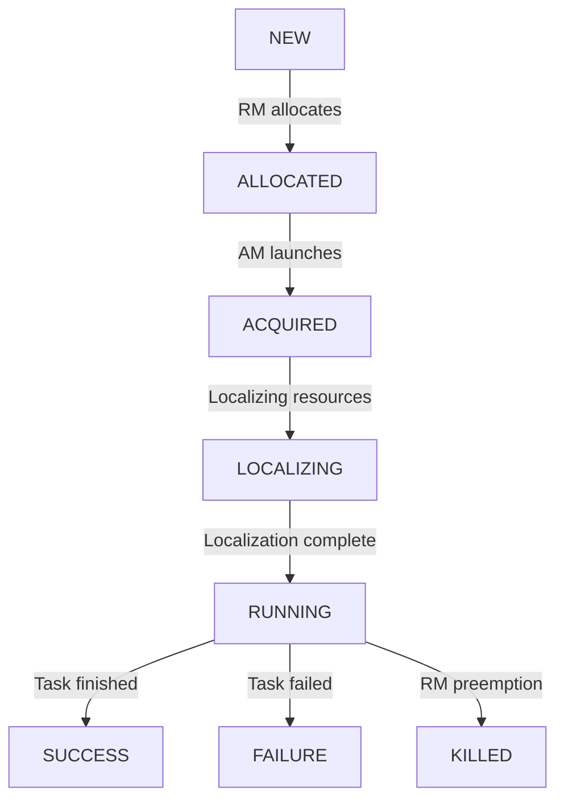

# Chapter 7: Performance Tuning and Optimization

Performance optimization in Hadoop is both an art and a science. A well-tuned Hadoop cluster can process data orders of magnitude faster than a poorly configured one. This chapter provides comprehensive strategies for maximizing Hadoop performance across all components.

<Info>
**Chapter Goals**:
- Master configuration tuning for HDFS, MapReduce, and YARN
- Understand JVM optimization and garbage collection tuning
- Learn compression strategies and their performance impact
- Implement benchmarking and performance monitoring
- Apply best practices for production optimization
</Info>

---

## Performance Tuning Philosophy

### The Performance Triangle

```text
+---------------------------------------------------------------+
|                  HADOOP PERFORMANCE FACTORS                   |
+---------------------------------------------------------------+
|                                                               |
|                        Performance                            |
|                            △                                  |
|                           ╱ ╲                                 |
|                          ╱   ╲                                |
|                         ╱     ╲                               |
|                        ╱       ╲                              |
|                       ╱         ╲                             |
|                      ╱  Balance  ╲                            |
|                     ╱    Point     ╲                          |
|                    ╱               ╲                          |
|                   ╱                 ╲                         |
|                  ╱                   ╲                        |
|                 ╱                     ╲                       |
|                ╱                       ╲                      |
|               ╱                         ╲                     |
|              ╱                           ╲                    |
|             ╱                             ╲                   |
|            ╱                               ╲                  |
|           ╱                                 ╲                 |
|          ╱                                   ╲                |
|         ╱                                     ╲               |
|        △───────────────────────────────────────△              |
|    Resources                              Workload            |
|                                                               |
|  Key Principles:                                              |
|  • No single configuration fits all workloads                 |
|  • Trade-offs exist between throughput and latency            |
|  • Hardware capabilities set performance ceiling              |
|  • Application design impacts more than tuning                |
|  • Measure before and after every optimization                |
|                                                               |
+---------------------------------------------------------------+
```

### Performance Optimization Hierarchy

<CardGroup cols={2}>
  <Card title="Level 1: Design" icon="drafting-compass">
    **80% of Performance Gains**
    - Algorithm selection
    - Data model design
    - Job structure
    - Data locality
  </Card>

  <Card title="Level 2: Configuration" icon="sliders">
    **15% of Performance Gains**
    - Memory allocation
    - Parallelism tuning
    - I/O optimization
    - Resource allocation
  </Card>

  <Card title="Level 3: Hardware" icon="microchip">
    **5% of Performance Gains**
    - CPU upgrades
    - Memory expansion
    - Faster disks
    - Network improvements
  </Card>

  <Card title="Level 4: Code" icon="code">
    **Fine-tuning**
    - Algorithm optimization
    - Custom serialization
    - Combiner functions
    - Data structures
  </Card>
</CardGroup>

---

### 1. The "Small Files Problem": Architectural Impact

One of the most common performance killers in Hadoop is the proliferation of small files (files significantly smaller than the block size of 128MB).

#### A. The NameNode Memory Math
Every file, directory, and block in HDFS is an object in the NameNode's heap, occupying approximately **150 bytes**.

- **Scenario A**: One 128GB file.
  - Blocks: 1,024.
  - NameNode Memory: $1,025 \text{ objects} \times 150 \text{ bytes} \approx 150\text{ KB}$.
- **Scenario B**: 1,000,000 files of 128KB each (total 128GB).
  - Blocks: 1,000,000.
  - NameNode Memory: $2,000,000 \text{ objects} \times 150 \text{ bytes} \approx 300\text{ MB}$.

**Impact**: 1 million small files consume **2000x** more memory than one large file of the same total size. At scale (billions of files), this causes the NameNode to run out of RAM, regardless of physical disk capacity.

#### B. MapReduce Overhead
Each small file is usually treated as a separate `InputSplit`, launching a separate Map task.
- Processing 1 million small files triggers 1 million JVM startups (if not reused), leading to massive YARN overhead and task scheduling delays.

---

## 2. Block Size Optimization

```text
+---------------------------------------------------------------+
|                    HDFS BLOCK SIZE IMPACT                     |
+---------------------------------------------------------------+
|                                                               |
|  Small Blocks (64MB):                                         |
|  ┌─────────────────────────────────────────────────────────┐  |
|  │ File: 1GB = 16 blocks                                   │  |
|  │                                                         │  |
|  │ Pros:                           Cons:                   │  |
|  │ ✓ Better for small files        ✗ More NameNode memory │  |
|  │ ✓ More parallelism              ✗ More metadata ops    │  |
|  │ ✓ Faster small jobs              ✗ Seek overhead       │  |
|  │                                                         │  |
|  │ NameNode Memory: 16 × 150 bytes = 2.4 KB              │  |
|  └─────────────────────────────────────────────────────────┘  |
|                                                               |
|  Large Blocks (256MB):                                        |
|  ┌─────────────────────────────────────────────────────────┐  |
|  │ File: 1GB = 4 blocks                                    │  |
|  │                                                         │  |
|  │ Pros:                           Cons:                   │  |
|  │ ✓ Less NameNode memory          ✗ Less parallelism     │  |
|  │ ✓ Fewer metadata ops            ✗ Wasted space on small│  |
|  │ ✓ Better sequential I/O         ✗ Longer task startup  │  |
|  │                                                         │  |
|  │ NameNode Memory: 4 × 150 bytes = 600 bytes            │  |
|  └─────────────────────────────────────────────────────────┘  |
|                                                               |
|  Optimal Block Size Formula:                                  |
|  ┌─────────────────────────────────────────────────────────┐  |
|  │                                                         │  |
|  │  Block Size = MAX(                                      │  |
|  │    128MB (default),                                     │  |
|  │    Average File Size / 10,                              │  |
|  │    Map Task Runtime × Disk Throughput                   │  |
|  │  )                                                      │  |
|  │                                                         │  |
|  │  Example: 5 min task × 100 MB/s = 30 GB too large!    │  |
|  │  Practical: 128-512 MB range                           │  |
|  └─────────────────────────────────────────────────────────┘  |
|                                                               |
+---------------------------------------------------------------+
```

### HDFS Configuration Parameters

<Tabs>
  <Tab title="Core Settings">
    ```xml
    <!-- hdfs-site.xml -->

    <!-- Block Size (default: 128MB) -->
    <property>
      <name>dfs.blocksize</name>
      <value>134217728</value> <!-- 128MB for general workloads -->
      <description>
        Larger blocks (256MB+) for sequential analytics
        Default (128MB) for mixed workloads
        Smaller blocks (64MB) for many small jobs
      </description>
    </property>

    <!-- Replication Factor -->
    <property>
      <name>dfs.replication</name>
      <value>3</value>
      <description>
        3 for production (balance reliability/space)
        2 for temporary data
        1 for easily reproducible data
      </description>
    </property>

    <!-- DataNode Handler Threads -->
    <property>
      <name>dfs.datanode.handler.count</name>
      <value>10</value> <!-- Increase for high concurrency -->
      <description>
        Number of threads to handle RPC requests
        Increase for high concurrent job count
        Formula: max(10, log2(cluster_size) * 20)
      </description>
    </property>

    <!-- NameNode Handler Threads -->
    <property>
      <name>dfs.namenode.handler.count</name>
      <value>100</value> <!-- Critical for metadata operations -->
      <description>
        More handlers = better metadata operation concurrency
        Formula: 20 * ln(cluster_size)
      </description>
    </property>
    ```
  </Tab>

  <Tab title="I/O Optimization">
    ```xml
    <!-- Performance I/O Settings -->

    <!-- Read Buffer Size -->
    <property>
      <name>io.file.buffer.size</name>
      <value>131072</value> <!-- 128KB -->
      <description>
        Buffer size for read operations
        64KB for low memory, 128KB standard, 256KB for high throughput
      </description>
    </property>

    <!-- Write Packet Size -->
    <property>
      <name>dfs.client-write-packet-size</name>
      <value>524288</value> <!-- 512KB -->
      <description>
        Larger packets reduce overhead but increase memory
      </description>
    </property>

    <!-- DataNode Transfer Threads -->
    <property>
      <name>dfs.datanode.max.transfer.threads</name>
      <value>8192</value>
      <description>
        Maximum threads for data transfer
        Increase for high concurrent reads/writes
      </description>
    </property>

    <!-- Balance Bandwidth -->
    <property>
      <name>dfs.datanode.balance.bandwidthPerSec</name>
      <value>10485760</value> <!-- 10 MB/s -->
      <description>
        Bandwidth for rebalancing operations
        Higher values = faster rebalancing but more impact
      </description>
    </property>
    ```
  </Tab>

  <Tab title="Advanced">
    ```xml
    <!-- Advanced Performance Settings -->

    <!-- Short Circuit Reads -->
    <property>
      <name>dfs.client.read.shortcircuit</name>
      <value>true</value>
      <description>
        Bypass DataNode protocol for local reads
        Requires Unix domain sockets
      </description>
    </property>

    <property>
      <name>dfs.domain.socket.path</name>
      <value>/var/lib/hadoop-hdfs/dn_socket</value>
    </property>

    <!-- Caching -->
    <property>
      <name>dfs.datanode.max.locked.memory</name>
      <value>4294967296</value> <!-- 4GB -->
      <description>
        Memory for centralized cache management
      </description>
    </property>

    <!-- Erasure Coding (Hadoop 3.x) -->
    <property>
      <name>dfs.namenode.ec.policies.enabled</name>
      <value>RS-6-3-1024k</value>
      <description>
        Reed-Solomon 6+3: 50% storage overhead vs 200% for replication
        Use for cold data
      </description>
    </property>
    ```
  </Tab>
</Tabs>

### NameNode Memory Optimization

<AccordionGroup>
  <Accordion title="NameNode Memory Calculation" icon="memory">
    **Memory Requirements Per Object**:

    ```text
    Object Type                 Memory per Object
    ─────────────────────────────────────────────
    File/Directory Inode        ~150 bytes
    Block                       ~150 bytes
    Additional metadata         ~50 bytes/object
    ```

    **Calculation Example**:
    ```
    Scenario: 100 million files, average 2 blocks each

    Files:    100M × 150 bytes = 15 GB
    Blocks:   200M × 150 bytes = 30 GB
    Metadata: 100M × 50 bytes  = 5 GB
    ─────────────────────────────────
    Total:                       50 GB

    Recommended Heap: 50 GB × 1.5 (overhead) = 75 GB
    ```

    **Optimization Strategies**:
    - Merge small files into larger ones
    - Use larger block sizes
    - Implement file compaction
    - Consider federation for massive scale
  </Accordion>

  <Accordion title="NameNode Heap Configuration" icon="server">
    ```bash
    # hadoop-env.sh

    # NameNode Heap Size
    export HADOOP_NAMENODE_OPTS="-Xms${NAMENODE_HEAP}g -Xmx${NAMENODE_HEAP}g"

    # For 50GB metadata requirement
    NAMENODE_HEAP=75  # 50GB + 50% overhead

    # GC Configuration for NameNode
    export HADOOP_NAMENODE_OPTS="${HADOOP_NAMENODE_OPTS}
      -XX:+UseG1GC
      -XX:MaxGCPauseMillis=200
      -XX:ParallelGCThreads=20
      -XX:ConcGCThreads=5
      -XX:InitiatingHeapOccupancyPercent=45
      -XX:+PrintGCDetails
      -XX:+PrintGCTimeStamps
      -XX:+PrintGCDateStamps
      -Xloggc:${HADOOP_LOG_DIR}/gc-namenode.log"

    # Off-heap memory for large clusters
    export HADOOP_NAMENODE_OPTS="${HADOOP_NAMENODE_OPTS}
      -XX:MaxDirectMemorySize=8g"
    ```
  </Accordion>
</AccordionGroup>

---

## MapReduce Performance Tuning

### Map and Reduce Task Tuning

```text
+---------------------------------------------------------------+
|              MAPREDUCE PERFORMANCE FLOW                       |
+---------------------------------------------------------------+
|                                                               |
|  Input → Map → Spill → Merge → Shuffle → Reduce → Output     |
|          ↓      ↓       ↓        ↓        ↓                  |
|       [Tune] [Tune]  [Tune]   [Tune]   [Tune]               |
|                                                               |
|  Map Phase Bottlenecks:                                       |
|  ┌─────────────────────────────────────────────────────────┐  |
|  │                                                         │  |
|  │  Input Split Size:                                      │  |
|  │    Too Small → Overhead dominates (100s of maps)       │  |
|  │    Too Large → Poor parallelism, long tasks            │  |
|  │    Optimal: 128-256 MB per map                         │  |
|  │                                                         │  |
|  │  Map Memory:                                            │  |
|  │    ├─ Heap Memory: Algorithm + data structures         │  |
|  │    └─ Buffer Memory: Output sorting (default 100MB)    │  |
|  │                                                         │  |
|  │  Spill Behavior:                                        │  |
|  │    Buffer full → Sort → Spill to disk → Repeat         │  |
|  │    Multiple spills → Merge overhead                    │  |
|  │    Solution: Larger buffer, better compression         │  |
|  │                                                         │  |
|  └─────────────────────────────────────────────────────────┘  |
|                                                               |
|  Shuffle Phase Bottlenecks:                                   |
|  ┌─────────────────────────────────────────────────────────┐  |
|  │                                                         │  |
|  │  Data Transfer:                                         │  |
|  │    ├─ Network bandwidth saturation                     │  |
|  │    ├─ Too many concurrent fetches                      │  |
|  │    └─ Small transfer sizes (overhead)                  │  |
|  │                                                         │  |
|  │  Memory Pressure:                                       │  |
|  │    ├─ Shuffle buffer limits                            │  |
|  │    ├─ Merge memory constraints                         │  |
|  │    └─ GC thrashing during shuffle                      │  |
|  │                                                         │  |
|  └─────────────────────────────────────────────────────────┘  |
|                                                               |
|  Reduce Phase Bottlenecks:                                    |
|  ┌─────────────────────────────────────────────────────────┐  |
|  │                                                         │  |
|  │  Data Skew:                                             │  |
|  │    Few reducers get most data → Stragglers             │  |
|  │    Solution: Better partitioning, combiners            │  |
|  │                                                         │  |
|  │  Memory Sizing:                                         │  |
|  │    In-memory merge limit                               │  |
|  │    Spill to disk if exceeded                           │  |
|  │                                                         │  |
|  └─────────────────────────────────────────────────────────┘  |
|                                                               |
+---------------------------------------------------------------+
```

### MapReduce Configuration Parameters

<Tabs>
  <Tab title="Memory Settings">
    ```xml
    <!-- mapred-site.xml -->

    <!-- Map Task Memory -->
    <property>
      <name>mapreduce.map.memory.mb</name>
      <value>2048</value>
      <description>
        Physical memory for map container
        Rule: 1.5-2x map heap size
      </description>
    </property>

    <property>
      <name>mapreduce.map.java.opts</name>
      <value>-Xmx1536m</value>
      <description>
        Heap size for map JVM (75-80% of container)
      </description>
    </property>

    <!-- Reduce Task Memory -->
    <property>
      <name>mapreduce.reduce.memory.mb</name>
      <value>4096</value>
      <description>
        Reducers typically need 2x map memory
      </description>
    </property>

    <property>
      <name>mapreduce.reduce.java.opts</name>
      <value>-Xmx3072m</value>
    </property>

    <!-- Sort Buffer -->
    <property>
      <name>mapreduce.task.io.sort.mb</name>
      <value>256</value>
      <description>
        Buffer for sorting map output
        Larger = fewer spills
        Default 100MB, increase to 200-512MB
      </description>
    </property>

    <!-- Spill Threshold -->
    <property>
      <name>mapreduce.map.sort.spill.percent</name>
      <value>0.85</value>
      <description>
        Spill when buffer is 85% full
        Higher = fewer spills but GC risk
      </description>
    </property>
    ```
  </Tab>

  <Tab title="Parallelism">
    ```xml
    <!-- Task Parallelism Configuration -->

    <!-- Number of Map Tasks -->
    <property>
      <name>mapreduce.input.fileinputformat.split.minsize</name>
      <value>134217728</value> <!-- 128MB -->
      <description>
        Controls map task count
        Smaller = more maps = more parallelism
      </description>
    </property>

    <!-- Number of Reduce Tasks -->
    <property>
      <name>mapreduce.job.reduces</name>
      <value>-1</value> <!-- Calculate dynamically -->
      <description>
        Formula: 0.95 * (nodes * mapreduce.tasktracker.reduce.tasks.maximum)
        Or: 1.75 * (nodes * maximum reduces per node)
        Ensures even distribution and room for retries
      </description>
    </property>

    <!-- Speculative Execution -->
    <property>
      <name>mapreduce.map.speculative</name>
      <value>true</value>
      <description>
        Launch duplicate tasks for stragglers
        Enable for homogeneous clusters
      </description>
    </property>

    <property>
      <name>mapreduce.reduce.speculative</name>
      <value>false</value>
      <description>
        Usually disabled for reduces (writes output)
      </description>
    </property>

    <!-- JVM Reuse -->
    <property>
      <name>mapreduce.job.jvm.numtasks</name>
      <value>5</value>
      <description>
        Number of tasks per JVM before restart
        -1 = unlimited (memory leak risk)
        5-10 good balance
      </description>
    </property>
    ```
  </Tab>

  <Tab title="Shuffle">
    ```xml
    <!-- Shuffle Phase Optimization -->

    <!-- Shuffle Parallelism -->
    <property>
      <name>mapreduce.reduce.shuffle.parallelcopies</name>
      <value>10</value>
      <description>
        Concurrent map output fetches per reducer
        Higher = faster shuffle but more memory/network
        Range: 5-50 depending on cluster size
      </description>
    </property>

    <!-- Shuffle Buffer -->
    <property>
      <name>mapreduce.reduce.shuffle.input.buffer.percent</name>
      <value>0.7</value>
      <description>
        % of reduce heap for shuffle buffer
        Higher = more in-memory merge
      </description>
    </property>

    <!-- Merge Threshold -->
    <property>
      <name>mapreduce.reduce.merge.inmem.threshold</name>
      <value>1000</value>
      <description>
        Number of files before in-memory merge
        0 = no limit (use buffer percent only)
      </description>
    </property>

    <property>
      <name>mapreduce.reduce.shuffle.merge.percent</name>
      <value>0.66</value>
      <description>
        Start merge when shuffle buffer 66% full
      </description>
    </property>

    <!-- I/O Sort Factor -->
    <property>
      <name>mapreduce.task.io.sort.factor</name>
      <value>100</value>
      <description>
        Streams to merge at once
        Higher = fewer merge passes
        Default 10, increase to 64-100
      </description>
    </property>
    ```
  </Tab>

  <Tab title="Compression">
    ```xml
    <!-- Compression Configuration -->

    <!-- Map Output Compression -->
    <property>
      <name>mapreduce.map.output.compress</name>
      <value>true</value>
      <description>
        ALWAYS enable - reduces shuffle I/O
      </description>
    </property>

    <property>
      <name>mapreduce.map.output.compress.codec</name>
      <value>org.apache.hadoop.io.compress.SnappyCodec</value>
      <description>
        Snappy: Fast, moderate compression (recommended)
        LZ4: Fastest, lower compression
        Gzip: Slower, high compression
      </description>
    </property>

    <!-- Final Output Compression -->
    <property>
      <name>mapreduce.output.fileoutputformat.compress</name>
      <value>true</value>
      <description>
        Enable for final output
      </description>
    </property>

    <property>
      <name>mapreduce.output.fileoutputformat.compress.codec</name>
      <value>org.apache.hadoop.io.compress.GzipCodec</value>
      <description>
        Gzip for archival/cold data
        Snappy for data that will be reprocessed
      </description>
    </property>

    <property>
      <name>mapreduce.output.fileoutputformat.compress.type</name>
      <value>BLOCK</value>
      <description>
        BLOCK = splittable (better for large files)
        RECORD = smaller files
      </description>
    </property>
    ```
  </Tab>
</Tabs>

---

## 4. YARN Performance and Container Orchestration

Performance in YARN is determined by how quickly containers can be allocated, launched, and cleaned up.

### 1. The Container Lifecycle State Machine
Understanding the lifecycle of a container helps identify where latency is introduced (e.g., slow localization vs. slow startup).



- **LOCALIZING**: The NodeManager is downloading jars and files from HDFS. If this takes too long, check `yarn.nodemanager.localizer.fetch.thread-count`.
- **KILLED**: Usually happens due to **Preemption** (Fair Scheduler) or the container exceeding memory limits.

### 2. YARN Configuration for High Throughput

| Parameter | Description | Recommended Value |
| :--- | :--- | :--- |
| `yarn.resourcemanager.scheduler.client.thread-count` | Threads for RM RPC | 50-100 (high concurrency) |
| `yarn.nodemanager.container-manager.thread-count` | Threads for container launch | 20-50 per NodeManager |
| `yarn.nodemanager.resource.memory-mb` | Physical RAM for YARN | (Total RAM - 8GB) |
| `yarn.nodemanager.vmem-check-enabled` | Virtual memory check | FALSE (often causes false failures) |

---

## 5. JVM and Garbage Collection Tuning

### Garbage Collection Strategies

<AccordionGroup>
  <Accordion title="G1GC (Recommended for Most Cases)" icon="recycle">
    **Best For**: General purpose, predictable pause times

    ```bash
    # G1 Garbage Collector Configuration

    # Basic G1GC
    -XX:+UseG1GC
    -XX:MaxGCPauseMillis=200        # Target max pause time
    -XX:ParallelGCThreads=20        # Parallel GC threads
    -XX:ConcGCThreads=5             # Concurrent marking threads
    -XX:InitiatingHeapOccupancyPercent=45  # When to start marking

    # G1 Region Sizing
    -XX:G1HeapRegionSize=32m        # Region size (1-32MB)

    # Detailed Logging
    -XX:+PrintGCDetails
    -XX:+PrintGCTimeStamps
    -XX:+PrintGCDateStamps
    -XX:+PrintAdaptiveSizePolicy
    -Xloggc:/var/log/hadoop/gc.log
    ```

    **Tuning Tips**:
    - Increase `ParallelGCThreads` for more cores
    - Lower `InitiatingHeapOccupancyPercent` if seeing long pauses
    - Increase `MaxGCPauseMillis` if throughput is priority
  </Accordion>

  <Accordion title="CMS (Older, Still Used)" icon="clock-rotate-left">
    **Best For**: Low latency requirements, older Hadoop versions

    ```bash
    # Concurrent Mark Sweep Configuration

    -XX:+UseConcMarkSweepGC
    -XX:+UseParNewGC                # Parallel young generation
    -XX:CMSInitiatingOccupancyFraction=70  # When to start CMS
    -XX:+UseCMSInitiatingOccupancyOnly
    -XX:+CMSParallelRemarkEnabled   # Parallel remark phase
    -XX:+CMSScavengeBeforeRemark    # Clean young gen before remark
    -XX:ParallelGCThreads=20
    -XX:ConcGCThreads=5

    # Young Generation Sizing
    -XX:NewRatio=2                  # Old:Young = 2:1
    -XX:SurvivorRatio=8             # Eden:Survivor = 8:1
    ```

    **Issues**:
    - Fragmentation over time
    - Occasional full GC pauses
    - Deprecated in Java 14+
  </Accordion>

  <Accordion title="Parallel GC (Throughput)" icon="gauge-high">
    **Best For**: Batch processing, throughput over latency

    ```bash
    # Parallel Throughput Collector

    -XX:+UseParallelGC
    -XX:ParallelGCThreads=20
    -XX:+UseAdaptiveSizePolicy      # Auto-tune generations
    -XX:GCTimeRatio=99              # 1% time in GC
    -XX:MaxGCPauseMillis=100

    # Generation Sizing
    -XX:NewRatio=2
    -XX:SurvivorRatio=8
    ```

    **Characteristics**:
    - High throughput
    - Longer pause times acceptable
    - Good for map/reduce tasks
  </Accordion>

  <Accordion title="ZGC (Hadoop 3.x, Java 11+)" icon="bolt">
    **Best For**: Very large heaps (100GB+), ultra-low latency

    ```bash
    # Z Garbage Collector (Experimental)

    -XX:+UseZGC
    -XX:ZCollectionInterval=60      # Force GC every 60s
    -XX:ZAllocationSpikeTolerance=2
    -Xlog:gc*:file=/var/log/hadoop/gc.log
    ```

    **Benefits**:
    - Sub-10ms pause times
    - Scales to TB heaps
    - Concurrent compaction

    **Considerations**:
    - Higher CPU usage
    - Requires Java 11+
    - Still maturing
  </Accordion>
</AccordionGroup>

---

## Compression Strategies

### Compression Codec Comparison

```text
+---------------------------------------------------------------+
|              COMPRESSION CODEC COMPARISON                     |
+---------------------------------------------------------------+
|                                                               |
|  Codec      Speed   Ratio   Splittable   Use Case            |
|  ────────────────────────────────────────────────────────────|
|                                                               |
|  None       ████    0%      ✓            Testing only        |
|             Fast    None    Always       Not for production  |
|                                                               |
|  LZ4        ████    ~2.0x   ✗            Real-time processing|
|             Fastest Light   No*          Low-latency         |
|                                                               |
|  Snappy     ███     ~2.0x   ✗            MapReduce output   |
|             Fast    Light   No*          Hot data            |
|                                                               |
|  Gzip       ██      ~2.5x   ✗            Cold storage       |
|             Medium  Good    No*          Archival            |
|                                                               |
|  Bzip2      █       ~3.0x   ✓            Large archival     |
|             Slow    Best    Yes          Rarely processed    |
|                                                               |
|  Zstd       ███     ~2.7x   ✗            Modern alternative |
|             Fast    Good    No*          Hadoop 3.2+         |
|                                                               |
|  * Can be splittable with block compression in container     |
|    formats like SequenceFile, Avro, Parquet, ORC            |
|                                                               |
+---------------------------------------------------------------+
```

---

## Benchmarking and Performance Testing

### Standard Benchmarks

<Tabs>
  <Tab title="TestDFSIO">
    ```bash
    # TestDFSIO - HDFS I/O Benchmark

    # Write Test
    hadoop jar $HADOOP_HOME/share/hadoop/mapreduce/hadoop-mapreduce-client-jobclient-*-tests.jar \
      TestDFSIO \
      -write \
      -nrFiles 10 \
      -fileSize 10GB \
      -resFile /tmp/TestDFSIOwrite.txt

    # Read Test
    hadoop jar $HADOOP_HOME/share/hadoop/mapreduce/hadoop-mapreduce-client-jobclient-*-tests.jar \
      TestDFSIO \
      -read \
      -nrFiles 10 \
      -fileSize 10GB \
      -resFile /tmp/TestDFSIOread.txt

    # Clean up
    hadoop jar $HADOOP_HOME/share/hadoop/mapreduce/hadoop-mapreduce-client-jobclient-*-tests.jar \
      TestDFSIO -clean
    ```
  </Tab>

  <Tab title="TeraSort">
    ```bash
    # TeraSort - Industry Standard Benchmark

    # 1. Generate 1TB of data
    hadoop jar $HADOOP_HOME/share/hadoop/mapreduce/hadoop-mapreduce-examples-*.jar \
      teragen \
      -Dmapreduce.job.maps=1000 \
      10000000000 \
      /benchmarks/tera/input

    # 2. Sort the data
    time hadoop jar $HADOOP_HOME/share/hadoop/mapreduce/hadoop-mapreduce-examples-*.jar \
      terasort \
      /benchmarks/tera/input \
      /benchmarks/tera/output

    # 3. Validate results
    hadoop jar $HADOOP_HOME/share/hadoop/mapreduce/hadoop-mapreduce-examples-*.jar \
      teravalidate \
      /benchmarks/tera/output \
      /benchmarks/tera/validate
    ```
  </Tab>
</Tabs>

---

## Interview Questions

<AccordionGroup>
  <Accordion title="Question 1: How would you optimize a MapReduce job experiencing poor shuffle phase performance?" icon="1">
    **Answer**:

    Shuffle phase optimization requires a systematic approach:

    **1. Enable Map Output Compression** (Biggest impact):
    ```xml
    <property>
      <name>mapreduce.map.output.compress</name>
      <value>true</value>
    </property>
    <property>
      <name>mapreduce.map.output.compress.codec</name>
      <value>org.apache.hadoop.io.compress.SnappyCodec</value>
    </property>
    ```

    **2. Use Combiners**: If reduce function is associative and commutative, implement a combiner.

    **3. Tune Shuffle Parallelism**:
    ```xml
    <property>
      <name>mapreduce.reduce.shuffle.parallelcopies</name>
      <value>20</value>
    </property>
    ```

    **4. Increase Shuffle Buffer** and optimize merge settings.

    **5. Check for Data Skew**: Monitor reducer input distribution and implement custom partitioner if needed.
  </Accordion>

  <Accordion title="Question 2: Explain compression codec trade-offs in Hadoop. When would you choose Snappy vs Gzip vs Bzip2?" icon="2">
    **Answer**:

    **Snappy**:
    - Speed: Very fast (400+ MB/s)
    - Ratio: Moderate (2:1)
    - Use Cases: Map output (ALWAYS), hot data, real-time processing

    **Gzip**:
    - Speed: Medium (100 MB/s)
    - Ratio: Good (2.5-3:1)
    - Use Cases: Final output for archival, cold storage

    **Bzip2**:
    - Speed: Slow (20 MB/s)
    - Ratio: Best (3-4:1)
    - Splittable: YES (natively)
    - Use Cases: Large files needing parallelism, maximum compression

    **Decision Matrix**:
    - Frequent processing: Snappy/LZ4
    - Archival: Gzip or Bzip2
    - Map output: ALWAYS Snappy
    - Network transfer: Gzip
  </Accordion>

  <Accordion title="Question 3: How do you calculate optimal container size for a YARN cluster?" icon="3">
    **Answer**:

    **Example Calculation**:

    Node: 128 GB RAM, 32 cores

    **Step 1**: Calculate available resources
    ```
    Reserved (OS/Daemons): 16 GB, 4 cores
    Available for YARN: 112 GB, 28 cores
    ```

    **Step 2**: Determine container sizes
    ```
    Min: 2 GB (balance overhead)
    Max: 16 GB (node capacity)
    Increment: 1 GB
    ```

    **Step 3**: Calculate container counts
    ```
    Memory-based: 112 / 2 = 56
    CPU-based: 28 / 1 = 28
    Limiting factor: CPU (28 containers)
    ```

    **Step 4**: Optimize for workload type (small jobs vs large jobs vs mixed).
  </Accordion>

  <Accordion title="Question 4: Describe troubleshooting approach for a Hadoop job that suddenly runs 10x slower." icon="4">
    **Answer**:

    **Phase 1: Gather Information**
    - Check job metrics and counters
    - Verify cluster health
    - Compare with historical runs
    - Check for data size changes

    **Phase 2: Identify Bottleneck**
    - Map phase slow: Check data locality, input format, faulty nodes
    - Shuffle phase slow: Network issues, map output size, reducer count
    - Reduce phase slow: Data skew, memory issues, output commit

    **Phase 3: Root Cause Analysis**
    - Investigate specific symptoms
    - Check configuration changes
    - Verify HDFS health

    **Phase 4: Implement Fix**
    - Enable compression
    - Increase memory
    - Add combiner
    - Custom partitioner
    - Blacklist bad nodes

    **Phase 5**: Verify and document solution.
  </Accordion>

  <Accordion title="Question 5: How would you design a performance testing framework for Hadoop?" icon="5">
    **Answer**:

    **Components**:

    1. **Benchmark Suite**: Standard (TeraSort, TestDFSIO), application-specific, micro-benchmarks

    2. **Test Data Generator**: Synthetic data, production samples, edge cases

    3. **Execution Engine**: Automated job submission, configuration variations

    4. **Metrics Collection**: Job metrics, system metrics, counters

    5. **Analysis & Reporting**: Regression detection, performance trends, optimization recommendations

    **Implementation**:
    - Automated CI/CD integration
    - Historical tracking
    - Alert system for regressions
    - Performance dashboard
    - Configuration testing

    **Key Principles**:
    - Automate everything
    - Continuous testing
    - Representative workloads
    - Isolated environment
    - Actionable results
  </Accordion>
</AccordionGroup>

---

## Key Takeaways

<CardGroup cols={2}>
  <Card title="Design Over Configuration" icon="lightbulb">
    80% of performance comes from good design. Choose right algorithms, optimize data models, leverage locality, minimize data movement.
  </Card>

  <Card title="Measure Everything" icon="chart-line">
    Baseline before tuning, A/B test changes, monitor continuously. Every optimization needs validation.
  </Card>

  <Card title="Compression is Critical" icon="file-zipper">
    Map output: ALWAYS Snappy. Final output depends on use case. Compression typically gives 2-3x improvement.
  </Card>

  <Card title="Memory Management" icon="memory">
    Container = Heap + Off-heap + OS. Heap should be 75-80% of container. Tune GC for workload.
  </Card>

  <Card title="Data Locality" icon="location-dot">
    NODE_LOCAL: Best (1.0x), RACK_LOCAL: Good (0.7x), OFF_RACK: Poor (0.3x). Configure topology properly.
  </Card>

  <Card title="Avoid Antipatterns" icon="ban">
    Watch for small files, data skew, excessive spilling, missing combiners, poor partitioning.
  </Card>

  <Card title="Benchmark Regularly" icon="stopwatch">
    Standard benchmarks, application benchmarks, automated testing. Build into CI/CD.
  </Card>

  <Card title="Holistic Optimization" icon="circle-nodes">
    Optimize entire pipeline: HDFS, MapReduce, YARN, Network, Hardware. Bottleneck moves when you optimize one component.
  </Card>
</CardGroup>

---

## Next Steps

With performance tuning mastered, you're ready for the final chapter on production deployment and real-world best practices.

**Chapter 8 Preview**: Production deployment strategies, cluster management, monitoring, security, and real-world use cases.
