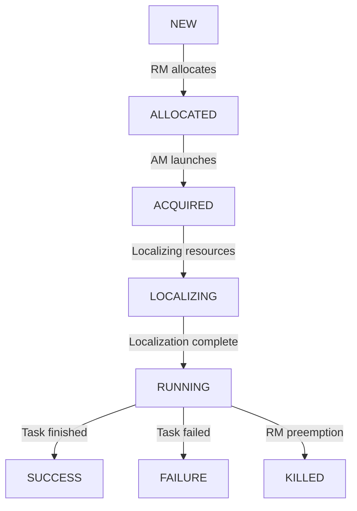

# Chapter 7: Performance Tuning and Optimization

Performance optimization in Hadoop is both an art and a science. A well-tuned Hadoop cluster can process data orders of magnitude faster than a poorly configured one. This chapter provides comprehensive strategies for maximizing Hadoop performance across all components.

The history of Hadoop performance optimization is really the history of the industry discovering, one painful lesson at a time, that distributed systems do not automatically get faster when you add more machines. Yahoo's early Hadoop clusters in 2006-2008 were notoriously slow -- processing terabytes took hours even on hundreds of nodes because the default configurations were designed for correctness, not speed. The TeraSort benchmark became the industry's standard yardstick after Yahoo set the first world record in 2008 by sorting 1TB in 209 seconds on a 910-node cluster. That record was broken repeatedly (by Google, then by a University of California team, then by Databricks using Spark) as the community learned where the real bottlenecks were: not CPU, but network shuffle; not disk I/O, but metadata operations; not algorithm choice, but data layout.

The single most important insight from two decades of Hadoop performance tuning is that **80% of performance gains come from design decisions (data model, algorithm choice, file format, partitioning scheme), not from configuration tuning**. Tuning JVM flags and buffer sizes is necessary but marginal. The teams that achieve order-of-magnitude improvements do so by fundamentally rethinking how their data flows through the system.

<Info>
**Chapter Goals**:
- Master configuration tuning for HDFS, MapReduce, and YARN
- Understand JVM optimization and garbage collection tuning
- Learn compression strategies and their performance impact
- Implement benchmarking and performance monitoring
- Apply best practices for production optimization
</Info>

---

## Performance Tuning Philosophy

Performance tuning in Hadoop is a discipline that draws from decades of systems engineering wisdom. The key insight -- that most performance gains come from design decisions, not configuration knobs -- was articulated by Jon Bentley in his 1982 book "Writing Efficient Programs" and reinforced by every generation of systems engineers since. In the Hadoop world, this manifests as a clear hierarchy: choosing the right algorithm (e.g., map-side join vs. reduce-side join) will outperform any amount of JVM tuning by an order of magnitude. The same principle applies to modern cloud-native systems: choosing the right DynamoDB partition key matters more than tweaking read capacity units, and designing a Spark job to avoid shuffles matters more than allocating extra executor memory. The performance triangle below is not Hadoop-specific -- it is a universal framework for reasoning about system optimization.

### The Performance Triangle

```text
+---------------------------------------------------------------+
|                  HADOOP PERFORMANCE FACTORS                   |
+---------------------------------------------------------------+
|                                                               |
|                        Performance                            |
|                            △                                  |
|                           ╱ ╲                                 |
|                          ╱   ╲                                |
|                         ╱     ╲                               |
|                        ╱       ╲                              |
|                       ╱         ╲                             |
|                      ╱  Balance  ╲                            |
|                     ╱    Point     ╲                          |
|                    ╱               ╲                          |
|                   ╱                 ╲                         |
|                  ╱                   ╲                        |
|                 ╱                     ╲                       |
|                ╱                       ╲                      |
|               ╱                         ╲                     |
|              ╱                           ╲                    |
|             ╱                             ╲                   |
|            ╱                               ╲                  |
|           ╱                                 ╲                 |
|          ╱                                   ╲                |
|         ╱                                     ╲               |
|        △───────────────────────────────────────△              |
|    Resources                              Workload            |
|                                                               |
|  Key Principles:                                              |
|  • No single configuration fits all workloads                 |
|  • Trade-offs exist between throughput and latency            |
|  • Hardware capabilities set performance ceiling              |
|  • Application design impacts more than tuning                |
|  • Measure before and after every optimization                |
|                                                               |
+---------------------------------------------------------------+
```

### Performance Optimization Hierarchy

<CardGroup cols={2}>
  <Card title="Level 1: Design" icon="drafting-compass">
    **80% of Performance Gains**
    - Algorithm selection
    - Data model design
    - Job structure
    - Data locality
  </Card>

  <Card title="Level 2: Configuration" icon="sliders">
    **15% of Performance Gains**
    - Memory allocation
    - Parallelism tuning
    - I/O optimization
    - Resource allocation
  </Card>

  <Card title="Level 3: Hardware" icon="microchip">
    **5% of Performance Gains**
    - CPU upgrades
    - Memory expansion
    - Faster disks
    - Network improvements
  </Card>

  <Card title="Level 4: Code" icon="code">
    **Fine-tuning**
    - Algorithm optimization
    - Custom serialization
    - Combiner functions
    - Data structures
  </Card>
</CardGroup>

---

### 1. The "Small Files Problem": Architectural Impact

The small files problem is arguably the most frequently encountered and least understood performance issue in Hadoop deployments. It has bitten nearly every organization that has adopted Hadoop, from Yahoo (who first documented the problem extensively around 2009) to modern data lake architectures on cloud storage. The root cause is an impedance mismatch: Hadoop was designed for large sequential scans of multi-gigabyte files (the original GFS paper describes workloads dominated by large streaming reads), but real-world data often arrives in small increments -- log files rotated hourly, IoT sensor readings, individual event records. This same tension exists in modern systems: S3 charges per-request fees that make millions of small objects expensive, Delta Lake and Apache Iceberg both include compaction features specifically to combat the small file problem, and even Kafka's log segment design addresses this by batching messages into large contiguous segments rather than storing them individually.

One of the most common performance killers in Hadoop is the proliferation of small files (files significantly smaller than the block size of 128MB).

#### A. The NameNode Memory Math
Every file, directory, and block in HDFS is an object in the NameNode's heap, occupying approximately **150 bytes**.

- **Scenario A**: One 128GB file.
  - Blocks: 1,024.
  - NameNode Memory: $1,025 \text{ objects} \times 150 \text{ bytes} \approx 150\text{ KB}$.
- **Scenario B**: 1,000,000 files of 128KB each (total 128GB).
  - Blocks: 1,000,000.
  - NameNode Memory: $2,000,000 \text{ objects} \times 150 \text{ bytes} \approx 300\text{ MB}$.

**Impact**: 1 million small files consume **2000x** more memory than one large file of the same total size. At scale (billions of files), this causes the NameNode to run out of RAM, regardless of physical disk capacity.

The small files problem is not theoretical -- it was the number one operational issue at Yahoo, LinkedIn, and Facebook during the early Hadoop era. LinkedIn's Hadoop cluster reportedly had over 150 million small files at one point, consuming most of the NameNode's 100GB heap just for metadata. The problem typically arises from three sources: ingestion pipelines that write one file per event or per minute, MapReduce jobs that produce one output file per reducer (creating thousands of small files per job), and Hive tables with over-partitioned schemas (partitioning by hour or user_id). Modern solutions include **HAR files** (Hadoop Archives, which pack small files into larger ones while preserving the logical file structure), **CombineFileInputFormat** (which groups multiple small files into a single map task), and **compaction jobs** (periodic MapReduce or Spark jobs that merge small files into larger ones). In contemporary data lake architectures, Apache Iceberg and Delta Lake provide automatic small file compaction as a built-in feature, addressing this problem at the table format level.

#### B. MapReduce Overhead
Each small file is usually treated as a separate `InputSplit`, launching a separate Map task.
- Processing 1 million small files triggers 1 million JVM startups (if not reused), leading to massive YARN overhead and task scheduling delays. The JVM startup cost alone (typically 2-5 seconds per task) means that scheduling 1 million tasks adds thousands of seconds of overhead before any actual data processing begins.

---

## 2. Block Size Optimization

```text
+---------------------------------------------------------------+
|                    HDFS BLOCK SIZE IMPACT                     |
+---------------------------------------------------------------+
|                                                               |
|  Small Blocks (64MB):                                         |
|  ┌─────────────────────────────────────────────────────────┐  |
|  │ File: 1GB = 16 blocks                                   │  |
|  │                                                         │  |
|  │ Pros:                           Cons:                   │  |
|  │ ✓ Better for small files        ✗ More NameNode memory │  |
|  │ ✓ More parallelism              ✗ More metadata ops    │  |
|  │ ✓ Faster small jobs              ✗ Seek overhead       │  |
|  │                                                         │  |
|  │ NameNode Memory: 16 × 150 bytes = 2.4 KB              │  |
|  └─────────────────────────────────────────────────────────┘  |
|                                                               |
|  Large Blocks (256MB):                                        |
|  ┌─────────────────────────────────────────────────────────┐  |
|  │ File: 1GB = 4 blocks                                    │  |
|  │                                                         │  |
|  │ Pros:                           Cons:                   │  |
|  │ ✓ Less NameNode memory          ✗ Less parallelism     │  |
|  │ ✓ Fewer metadata ops            ✗ Wasted space on small│  |
|  │ ✓ Better sequential I/O         ✗ Longer task startup  │  |
|  │                                                         │  |
|  │ NameNode Memory: 4 × 150 bytes = 600 bytes            │  |
|  └─────────────────────────────────────────────────────────┘  |
|                                                               |
|  Optimal Block Size Formula:                                  |
|  ┌─────────────────────────────────────────────────────────┐  |
|  │                                                         │  |
|  │  Block Size = MAX(                                      │  |
|  │    128MB (default),                                     │  |
|  │    Average File Size / 10,                              │  |
|  │    Map Task Runtime × Disk Throughput                   │  |
|  │  )                                                      │  |
|  │                                                         │  |
|  │  Example: 5 min task × 100 MB/s = 30 GB too large!    │  |
|  │  Practical: 128-512 MB range                           │  |
|  └─────────────────────────────────────────────────────────┘  |
|                                                               |
+---------------------------------------------------------------+
```

### HDFS Configuration Parameters

<Tabs>
  <Tab title="Core Settings">
    ```xml
    <!-- hdfs-site.xml -->

    <!-- Block Size (default: 128MB) -->
    <property>
      <name>dfs.blocksize</name>
      <value>134217728</value> <!-- 128MB for general workloads -->
      <description>
        Larger blocks (256MB+) for sequential analytics
        Default (128MB) for mixed workloads
        Smaller blocks (64MB) for many small jobs
      </description>
    </property>

    <!-- Replication Factor -->
    <property>
      <name>dfs.replication</name>
      <value>3</value>
      <description>
        3 for production (balance reliability/space)
        2 for temporary data
        1 for easily reproducible data
      </description>
    </property>

    <!-- DataNode Handler Threads -->
    <property>
      <name>dfs.datanode.handler.count</name>
      <value>10</value> <!-- Increase for high concurrency -->
      <description>
        Number of threads to handle RPC requests
        Increase for high concurrent job count
        Formula: max(10, log2(cluster_size) * 20)
      </description>
    </property>

    <!-- NameNode Handler Threads -->
    <property>
      <name>dfs.namenode.handler.count</name>
      <value>100</value> <!-- Critical for metadata operations -->
      <description>
        More handlers = better metadata operation concurrency
        Formula: 20 * ln(cluster_size)
      </description>
    </property>
    ```
  </Tab>

  <Tab title="I/O Optimization">
    ```xml
    <!-- Performance I/O Settings -->

    <!-- Read Buffer Size -->
    <property>
      <name>io.file.buffer.size</name>
      <value>131072</value> <!-- 128KB -->
      <description>
        Buffer size for read operations
        64KB for low memory, 128KB standard, 256KB for high throughput
      </description>
    </property>

    <!-- Write Packet Size -->
    <property>
      <name>dfs.client-write-packet-size</name>
      <value>524288</value> <!-- 512KB -->
      <description>
        Larger packets reduce overhead but increase memory
      </description>
    </property>

    <!-- DataNode Transfer Threads -->
    <property>
      <name>dfs.datanode.max.transfer.threads</name>
      <value>8192</value>
      <description>
        Maximum threads for data transfer
        Increase for high concurrent reads/writes
      </description>
    </property>

    <!-- Balance Bandwidth -->
    <property>
      <name>dfs.datanode.balance.bandwidthPerSec</name>
      <value>10485760</value> <!-- 10 MB/s -->
      <description>
        Bandwidth for rebalancing operations
        Higher values = faster rebalancing but more impact
      </description>
    </property>
    ```
  </Tab>

  <Tab title="Advanced">
    ```xml
    <!-- Advanced Performance Settings -->

    <!-- Short Circuit Reads -->
    <property>
      <name>dfs.client.read.shortcircuit</name>
      <value>true</value>
      <description>
        Bypass DataNode protocol for local reads
        Requires Unix domain sockets
      </description>
    </property>

    <property>
      <name>dfs.domain.socket.path</name>
      <value>/var/lib/hadoop-hdfs/dn_socket</value>
    </property>

    <!-- Caching -->
    <property>
      <name>dfs.datanode.max.locked.memory</name>
      <value>4294967296</value> <!-- 4GB -->
      <description>
        Memory for centralized cache management
      </description>
    </property>

    <!-- Erasure Coding (Hadoop 3.x) -->
    <property>
      <name>dfs.namenode.ec.policies.enabled</name>
      <value>RS-6-3-1024k</value>
      <description>
        Reed-Solomon 6+3: 50% storage overhead vs 200% for replication
        Use for cold data
      </description>
    </property>
    ```
  </Tab>
</Tabs>

### NameNode Memory Optimization

<AccordionGroup>
  <Accordion title="NameNode Memory Calculation" icon="memory">
    **Memory Requirements Per Object**:

    ```text
    Object Type                 Memory per Object
    ─────────────────────────────────────────────
    File/Directory Inode        ~150 bytes
    Block                       ~150 bytes
    Additional metadata         ~50 bytes/object
    ```

    **Calculation Example**:
    ```
    Scenario: 100 million files, average 2 blocks each

    Files:    100M × 150 bytes = 15 GB
    Blocks:   200M × 150 bytes = 30 GB
    Metadata: 100M × 50 bytes  = 5 GB
    ─────────────────────────────────
    Total:                       50 GB

    Recommended Heap: 50 GB × 1.5 (overhead) = 75 GB
    ```

    **Optimization Strategies**:
    - Merge small files into larger ones
    - Use larger block sizes
    - Implement file compaction
    - Consider federation for massive scale
  </Accordion>

  <Accordion title="NameNode Heap Configuration" icon="server">
    ```bash
    # hadoop-env.sh

    # NameNode Heap Size
    export HADOOP_NAMENODE_OPTS="-Xms${NAMENODE_HEAP}g -Xmx${NAMENODE_HEAP}g"

    # For 50GB metadata requirement
    NAMENODE_HEAP=75  # 50GB + 50% overhead

    # GC Configuration for NameNode
    export HADOOP_NAMENODE_OPTS="${HADOOP_NAMENODE_OPTS}
      -XX:+UseG1GC
      -XX:MaxGCPauseMillis=200
      -XX:ParallelGCThreads=20
      -XX:ConcGCThreads=5
      -XX:InitiatingHeapOccupancyPercent=45
      -XX:+PrintGCDetails
      -XX:+PrintGCTimeStamps
      -XX:+PrintGCDateStamps
      -Xloggc:${HADOOP_LOG_DIR}/gc-namenode.log"

    # Off-heap memory for large clusters
    export HADOOP_NAMENODE_OPTS="${HADOOP_NAMENODE_OPTS}
      -XX:MaxDirectMemorySize=8g"
    ```
  </Accordion>
</AccordionGroup>

---

## MapReduce Performance Tuning

MapReduce performance tuning is fundamentally about managing the flow of data through a pipeline of transformations: map, sort, spill, merge, shuffle, and reduce. Each stage has its own bottleneck profile, and the art of tuning is identifying which stage dominates your job's runtime. The shuffle phase -- where map outputs are transferred across the network to reducers -- is typically the most expensive stage and the one that benefits most from optimization. Google's original MapReduce paper (2004) noted that the shuffle was "the single most important bottleneck" in their internal jobs. This observation led to the development of combiners (which reduce shuffle volume by pre-aggregating on the map side), map output compression (which trades CPU for network bandwidth), and eventually to shuffle-free frameworks like Apache Spark's broadcast joins and Flink's network buffer management. Understanding the MapReduce shuffle deeply is valuable even if you never write a MapReduce job, because the same data movement patterns appear in Spark (shuffle partitions), Flink (network exchanges), and distributed SQL engines (hash-based redistribution for joins).

### Map and Reduce Task Tuning

```text
+---------------------------------------------------------------+
|              MAPREDUCE PERFORMANCE FLOW                       |
+---------------------------------------------------------------+
|                                                               |
|  Input → Map → Spill → Merge → Shuffle → Reduce → Output     |
|          ↓      ↓       ↓        ↓        ↓                  |
|       [Tune] [Tune]  [Tune]   [Tune]   [Tune]               |
|                                                               |
|  Map Phase Bottlenecks:                                       |
|  ┌─────────────────────────────────────────────────────────┐  |
|  │                                                         │  |
|  │  Input Split Size:                                      │  |
|  │    Too Small → Overhead dominates (100s of maps)       │  |
|  │    Too Large → Poor parallelism, long tasks            │  |
|  │    Optimal: 128-256 MB per map                         │  |
|  │                                                         │  |
|  │  Map Memory:                                            │  |
|  │    ├─ Heap Memory: Algorithm + data structures         │  |
|  │    └─ Buffer Memory: Output sorting (default 100MB)    │  |
|  │                                                         │  |
|  │  Spill Behavior:                                        │  |
|  │    Buffer full → Sort → Spill to disk → Repeat         │  |
|  │    Multiple spills → Merge overhead                    │  |
|  │    Solution: Larger buffer, better compression         │  |
|  │                                                         │  |
|  └─────────────────────────────────────────────────────────┘  |
|                                                               |
|  Shuffle Phase Bottlenecks:                                   |
|  ┌─────────────────────────────────────────────────────────┐  |
|  │                                                         │  |
|  │  Data Transfer:                                         │  |
|  │    ├─ Network bandwidth saturation                     │  |
|  │    ├─ Too many concurrent fetches                      │  |
|  │    └─ Small transfer sizes (overhead)                  │  |
|  │                                                         │  |
|  │  Memory Pressure:                                       │  |
|  │    ├─ Shuffle buffer limits                            │  |
|  │    ├─ Merge memory constraints                         │  |
|  │    └─ GC thrashing during shuffle                      │  |
|  │                                                         │  |
|  └─────────────────────────────────────────────────────────┘  |
|                                                               |
|  Reduce Phase Bottlenecks:                                    |
|  ┌─────────────────────────────────────────────────────────┐  |
|  │                                                         │  |
|  │  Data Skew:                                             │  |
|  │    Few reducers get most data → Stragglers             │  |
|  │    Solution: Better partitioning, combiners            │  |
|  │                                                         │  |
|  │  Memory Sizing:                                         │  |
|  │    In-memory merge limit                               │  |
|  │    Spill to disk if exceeded                           │  |
|  │                                                         │  |
|  └─────────────────────────────────────────────────────────┘  |
|                                                               |
+---------------------------------------------------------------+
```

### MapReduce Configuration Parameters

<Tabs>
  <Tab title="Memory Settings">
    ```xml
    <!-- mapred-site.xml -->

    <!-- Map Task Memory -->
    <property>
      <name>mapreduce.map.memory.mb</name>
      <value>2048</value>
      <description>
        Physical memory for map container
        Rule: 1.5-2x map heap size
      </description>
    </property>

    <property>
      <name>mapreduce.map.java.opts</name>
      <value>-Xmx1536m</value>
      <description>
        Heap size for map JVM (75-80% of container)
      </description>
    </property>

    <!-- Reduce Task Memory -->
    <property>
      <name>mapreduce.reduce.memory.mb</name>
      <value>4096</value>
      <description>
        Reducers typically need 2x map memory
      </description>
    </property>

    <property>
      <name>mapreduce.reduce.java.opts</name>
      <value>-Xmx3072m</value>
    </property>

    <!-- Sort Buffer -->
    <property>
      <name>mapreduce.task.io.sort.mb</name>
      <value>256</value>
      <description>
        Buffer for sorting map output
        Larger = fewer spills
        Default 100MB, increase to 200-512MB
      </description>
    </property>

    <!-- Spill Threshold -->
    <property>
      <name>mapreduce.map.sort.spill.percent</name>
      <value>0.85</value>
      <description>
        Spill when buffer is 85% full
        Higher = fewer spills but GC risk
      </description>
    </property>
    ```
  </Tab>

  <Tab title="Parallelism">
    ```xml
    <!-- Task Parallelism Configuration -->

    <!-- Number of Map Tasks -->
    <property>
      <name>mapreduce.input.fileinputformat.split.minsize</name>
      <value>134217728</value> <!-- 128MB -->
      <description>
        Controls map task count
        Smaller = more maps = more parallelism
      </description>
    </property>

    <!-- Number of Reduce Tasks -->
    <property>
      <name>mapreduce.job.reduces</name>
      <value>-1</value> <!-- Calculate dynamically -->
      <description>
        Formula: 0.95 * (nodes * mapreduce.tasktracker.reduce.tasks.maximum)
        Or: 1.75 * (nodes * maximum reduces per node)
        Ensures even distribution and room for retries
      </description>
    </property>

    <!-- Speculative Execution -->
    <property>
      <name>mapreduce.map.speculative</name>
      <value>true</value>
      <description>
        Launch duplicate tasks for stragglers
        Enable for homogeneous clusters
      </description>
    </property>

    <property>
      <name>mapreduce.reduce.speculative</name>
      <value>false</value>
      <description>
        Usually disabled for reduces (writes output)
      </description>
    </property>

    <!-- JVM Reuse -->
    <property>
      <name>mapreduce.job.jvm.numtasks</name>
      <value>5</value>
      <description>
        Number of tasks per JVM before restart
        -1 = unlimited (memory leak risk)
        5-10 good balance
      </description>
    </property>
    ```
  </Tab>

  <Tab title="Shuffle">
    ```xml
    <!-- Shuffle Phase Optimization -->

    <!-- Shuffle Parallelism -->
    <property>
      <name>mapreduce.reduce.shuffle.parallelcopies</name>
      <value>10</value>
      <description>
        Concurrent map output fetches per reducer
        Higher = faster shuffle but more memory/network
        Range: 5-50 depending on cluster size
      </description>
    </property>

    <!-- Shuffle Buffer -->
    <property>
      <name>mapreduce.reduce.shuffle.input.buffer.percent</name>
      <value>0.7</value>
      <description>
        % of reduce heap for shuffle buffer
        Higher = more in-memory merge
      </description>
    </property>

    <!-- Merge Threshold -->
    <property>
      <name>mapreduce.reduce.merge.inmem.threshold</name>
      <value>1000</value>
      <description>
        Number of files before in-memory merge
        0 = no limit (use buffer percent only)
      </description>
    </property>

    <property>
      <name>mapreduce.reduce.shuffle.merge.percent</name>
      <value>0.66</value>
      <description>
        Start merge when shuffle buffer 66% full
      </description>
    </property>

    <!-- I/O Sort Factor -->
    <property>
      <name>mapreduce.task.io.sort.factor</name>
      <value>100</value>
      <description>
        Streams to merge at once
        Higher = fewer merge passes
        Default 10, increase to 64-100
      </description>
    </property>
    ```
  </Tab>

  <Tab title="Compression">
    ```xml
    <!-- Compression Configuration -->

    <!-- Map Output Compression -->
    <property>
      <name>mapreduce.map.output.compress</name>
      <value>true</value>
      <description>
        ALWAYS enable - reduces shuffle I/O
      </description>
    </property>

    <property>
      <name>mapreduce.map.output.compress.codec</name>
      <value>org.apache.hadoop.io.compress.SnappyCodec</value>
      <description>
        Snappy: Fast, moderate compression (recommended)
        LZ4: Fastest, lower compression
        Gzip: Slower, high compression
      </description>
    </property>

    <!-- Final Output Compression -->
    <property>
      <name>mapreduce.output.fileoutputformat.compress</name>
      <value>true</value>
      <description>
        Enable for final output
      </description>
    </property>

    <property>
      <name>mapreduce.output.fileoutputformat.compress.codec</name>
      <value>org.apache.hadoop.io.compress.GzipCodec</value>
      <description>
        Gzip for archival/cold data
        Snappy for data that will be reprocessed
      </description>
    </property>

    <property>
      <name>mapreduce.output.fileoutputformat.compress.type</name>
      <value>BLOCK</value>
      <description>
        BLOCK = splittable (better for large files)
        RECORD = smaller files
      </description>
    </property>
    ```
  </Tab>
</Tabs>

---

## 4. YARN Performance and Container Orchestration

YARN's container model represents a fundamental shift from the fixed-slot architecture of Hadoop 1.x, and understanding the performance implications of this shift is critical. In Hadoop 1.x, each TaskTracker had a fixed number of "map slots" and "reduce slots." If all map slots were full but reduce slots were idle, the idle reduce slots could not be used for map tasks -- a significant source of resource waste. YARN replaced this with flexible containers that can be sized to any combination of CPU and memory, eliminating the rigid slot boundaries. However, this flexibility introduces its own tuning challenges: container sizes that are too small waste resources on JVM startup overhead, while containers that are too large reduce parallelism and increase the blast radius of individual task failures. The container lifecycle (NEW, ALLOCATED, ACQUIRED, LOCALIZING, RUNNING, COMPLETED) also introduces latency at each transition -- particularly during the LOCALIZING phase where distributed cache resources are downloaded from HDFS. This same tension between flexibility and predictability appears in Kubernetes pod scheduling, where resource requests and limits serve the same function as YARN container sizing.

Performance in YARN is determined by how quickly containers can be allocated, launched, and cleaned up.

### 1. The Container Lifecycle State Machine
Understanding the lifecycle of a container helps identify where latency is introduced (e.g., slow localization vs. slow startup).


```mermaid
graph TD
    NEW[NEW] -- "RM allocates" --> ALLOCATED[ALLOCATED]
    ALLOCATED -- "AM launches" --> ACQUIRED[ACQUIRED]
    ACQUIRED -- "Localizing resources" --> LOCALIZING[LOCALIZING]
    LOCALIZING -- "Localization complete" --> RUNNING[RUNNING]
    RUNNING -- "Task finished" --> EXITED_SUCCESS[SUCCESS]
    RUNNING -- "Task failed" --> EXITED_FAILURE[FAILURE]
    RUNNING -- "RM preemption" --> KILLED[KILLED]
```

- **LOCALIZING**: The NodeManager is downloading jars and files from HDFS (application jars, distributed cache files, configuration archives). If this takes too long, check `yarn.nodemanager.localizer.fetch.thread-count`. A common production issue is that large application jars (hundreds of MBs for Spark applications with many dependencies) cause localization to take 30+ seconds per container. The fix is to use shared cache (`yarn.sharedcache.enabled=true` in Hadoop 3.x) or pre-stage common libraries.
- **KILLED**: Usually happens due to **Preemption** (Fair Scheduler reclaiming resources for higher-priority queues) or the container exceeding memory limits. The virtual memory check (`yarn.nodemanager.vmem-check-enabled`) is notorious for killing healthy containers because Java's virtual memory usage is typically 2-3x physical memory usage. Most production clusters disable this check.

Understanding this lifecycle is crucial for diagnosing "slow job starts." If you see jobs spending minutes before any tasks run, the bottleneck is typically in the ALLOCATED-to-RUNNING transition: either the ResourceManager is slow to allocate (check scheduler queue contention), localization is slow (check HDFS read performance and jar sizes), or container launch is slow (check NodeManager thread counts).

### 2. YARN Configuration for High Throughput

| Parameter | Description | Recommended Value |
| :--- | :--- | :--- |
| `yarn.resourcemanager.scheduler.client.thread-count` | Threads for RM RPC | 50-100 (high concurrency) |
| `yarn.nodemanager.container-manager.thread-count` | Threads for container launch | 20-50 per NodeManager |
| `yarn.nodemanager.resource.memory-mb` | Physical RAM for YARN | (Total RAM - 8GB) |
| `yarn.nodemanager.vmem-check-enabled` | Virtual memory check | FALSE (often causes false failures) |

---

## 5. JVM and Garbage Collection Tuning

Garbage collection tuning is where Hadoop performance optimization intersects with JVM internals, and it is one of the areas where incorrect configuration can cause the most dramatic failures. The NameNode is particularly sensitive to GC pauses because it holds the entire filesystem namespace in memory (often 50-100GB of heap) and must respond to heartbeats from thousands of DataNodes. A long GC pause on the NameNode can cause DataNodes to miss heartbeat acknowledgments, triggering false failure detection and unnecessary block re-replication -- a cascading failure triggered by a garbage collector. The evolution of Java garbage collectors mirrors the evolution of Hadoop's requirements: the Parallel GC (Java 6 era) prioritized throughput but produced unpredictable pause times, CMS (Java 7-8 era) reduced pause times but suffered from fragmentation, G1GC (Java 9+) provided more predictable pauses for large heaps, and ZGC (Java 11+) promises sub-10ms pauses even for terabyte-scale heaps. In modern deployments, G1GC is the default recommendation for most Hadoop components, with ZGC being adopted for NameNodes on very large clusters.

### Garbage Collection Strategies

<AccordionGroup>
  <Accordion title="G1GC (Recommended for Most Cases)" icon="recycle">
    **Best For**: General purpose, predictable pause times

    ```bash
    # G1 Garbage Collector Configuration

    # Basic G1GC
    -XX:+UseG1GC
    -XX:MaxGCPauseMillis=200        # Target max pause time
    -XX:ParallelGCThreads=20        # Parallel GC threads
    -XX:ConcGCThreads=5             # Concurrent marking threads
    -XX:InitiatingHeapOccupancyPercent=45  # When to start marking

    # G1 Region Sizing
    -XX:G1HeapRegionSize=32m        # Region size (1-32MB)

    # Detailed Logging
    -XX:+PrintGCDetails
    -XX:+PrintGCTimeStamps
    -XX:+PrintGCDateStamps
    -XX:+PrintAdaptiveSizePolicy
    -Xloggc:/var/log/hadoop/gc.log
    ```

    **Tuning Tips**:
    - Increase `ParallelGCThreads` for more cores
    - Lower `InitiatingHeapOccupancyPercent` if seeing long pauses
    - Increase `MaxGCPauseMillis` if throughput is priority
  </Accordion>

  <Accordion title="CMS (Older, Still Used)" icon="clock-rotate-left">
    **Best For**: Low latency requirements, older Hadoop versions

    ```bash
    # Concurrent Mark Sweep Configuration

    -XX:+UseConcMarkSweepGC
    -XX:+UseParNewGC                # Parallel young generation
    -XX:CMSInitiatingOccupancyFraction=70  # When to start CMS
    -XX:+UseCMSInitiatingOccupancyOnly
    -XX:+CMSParallelRemarkEnabled   # Parallel remark phase
    -XX:+CMSScavengeBeforeRemark    # Clean young gen before remark
    -XX:ParallelGCThreads=20
    -XX:ConcGCThreads=5

    # Young Generation Sizing
    -XX:NewRatio=2                  # Old:Young = 2:1
    -XX:SurvivorRatio=8             # Eden:Survivor = 8:1
    ```

    **Issues**:
    - Fragmentation over time
    - Occasional full GC pauses
    - Deprecated in Java 14+
  </Accordion>

  <Accordion title="Parallel GC (Throughput)" icon="gauge-high">
    **Best For**: Batch processing, throughput over latency

    ```bash
    # Parallel Throughput Collector

    -XX:+UseParallelGC
    -XX:ParallelGCThreads=20
    -XX:+UseAdaptiveSizePolicy      # Auto-tune generations
    -XX:GCTimeRatio=99              # 1% time in GC
    -XX:MaxGCPauseMillis=100

    # Generation Sizing
    -XX:NewRatio=2
    -XX:SurvivorRatio=8
    ```

    **Characteristics**:
    - High throughput
    - Longer pause times acceptable
    - Good for map/reduce tasks
  </Accordion>

  <Accordion title="ZGC (Hadoop 3.x, Java 11+)" icon="bolt">
    **Best For**: Very large heaps (100GB+), ultra-low latency

    ```bash
    # Z Garbage Collector (Experimental)

    -XX:+UseZGC
    -XX:ZCollectionInterval=60      # Force GC every 60s
    -XX:ZAllocationSpikeTolerance=2
    -Xlog:gc*:file=/var/log/hadoop/gc.log
    ```

    **Benefits**:
    - Sub-10ms pause times
    - Scales to TB heaps
    - Concurrent compaction

    **Considerations**:
    - Higher CPU usage
    - Requires Java 11+
    - Still maturing
  </Accordion>
</AccordionGroup>

---

## Compression Strategies

Compression is arguably the highest-ROI optimization in Hadoop because it reduces both storage costs and processing time simultaneously. In a MapReduce job, the shuffle phase -- where map outputs are transferred over the network to reducers -- is almost always the bottleneck. Compressing map output with a fast codec like Snappy reduces the data transferred by roughly 50%, which directly translates to faster shuffle. The trade-off is CPU time for compression/decompression, but modern codecs (Snappy, LZ4, Zstandard) are designed to be faster than network I/O, meaning the CPU cost of compression is less than the time saved on network transfer.

The splittability question is important for MapReduce parallelism. A "splittable" format means that Hadoop can start reading from any arbitrary byte offset in the file, which allows multiple map tasks to process different parts of the same file in parallel. Non-splittable formats (gzip, Snappy when used as a file-level codec) require a single map task to read the entire file sequentially. The workaround is to use block-level compression within a container format (SequenceFile, Avro, Parquet, ORC), where each block is independently compressed and decompressible. This is the standard practice in production.

### Compression Codec Comparison

```text
+---------------------------------------------------------------+
|              COMPRESSION CODEC COMPARISON                     |
+---------------------------------------------------------------+
|                                                               |
|  Codec      Speed   Ratio   Splittable   Use Case            |
|  ────────────────────────────────────────────────────────────|
|                                                               |
|  None       ████    0%      ✓            Testing only        |
|             Fast    None    Always       Not for production  |
|                                                               |
|  LZ4        ████    ~2.0x   ✗            Real-time processing|
|             Fastest Light   No*          Low-latency         |
|                                                               |
|  Snappy     ███     ~2.0x   ✗            MapReduce output   |
|             Fast    Light   No*          Hot data            |
|                                                               |
|  Gzip       ██      ~2.5x   ✗            Cold storage       |
|             Medium  Good    No*          Archival            |
|                                                               |
|  Bzip2      █       ~3.0x   ✓            Large archival     |
|             Slow    Best    Yes          Rarely processed    |
|                                                               |
|  Zstd       ███     ~2.7x   ✗            Modern alternative |
|             Fast    Good    No*          Hadoop 3.2+         |
|                                                               |
|  * Can be splittable with block compression in container     |
|    formats like SequenceFile, Avro, Parquet, ORC            |
|                                                               |
+---------------------------------------------------------------+
```

---

## Benchmarking and Performance Testing

Benchmarking is where performance tuning transitions from art to science. Without a reproducible baseline measurement, every configuration change is guesswork. The Hadoop ecosystem has standardized on a handful of benchmarks that test different dimensions of performance. TeraSort, in particular, has become the industry-standard benchmark for distributed systems -- it was the basis for the "sort benchmark" competition where Google, Yahoo, and later Databricks and Alibaba competed for the fastest time to sort 100TB of data. Yahoo set an early record in 2009 by sorting 1TB in 62 seconds on a 910-node Hadoop cluster, demonstrating that Hadoop could achieve throughput competitive with purpose-built sorting systems. The benchmark remains relevant because sorting exercises every component of the system: HDFS reads, map processing, shuffle (which is essentially a distributed sort), and HDFS writes. If TeraSort performs well, your cluster is well-tuned for general-purpose analytics workloads. If it performs poorly, the bottleneck it reveals (I/O, network, CPU, or memory) will be the same bottleneck your production jobs hit.

### Standard Benchmarks

<Tabs>
  <Tab title="TestDFSIO">
    ```bash
    # TestDFSIO - HDFS I/O Benchmark

    # Write Test
    hadoop jar $HADOOP_HOME/share/hadoop/mapreduce/hadoop-mapreduce-client-jobclient-*-tests.jar \
      TestDFSIO \
      -write \
      -nrFiles 10 \
      -fileSize 10GB \
      -resFile /tmp/TestDFSIOwrite.txt

    # Read Test
    hadoop jar $HADOOP_HOME/share/hadoop/mapreduce/hadoop-mapreduce-client-jobclient-*-tests.jar \
      TestDFSIO \
      -read \
      -nrFiles 10 \
      -fileSize 10GB \
      -resFile /tmp/TestDFSIOread.txt

    # Clean up
    hadoop jar $HADOOP_HOME/share/hadoop/mapreduce/hadoop-mapreduce-client-jobclient-*-tests.jar \
      TestDFSIO -clean
    ```
  </Tab>

  <Tab title="TeraSort">
    ```bash
    # TeraSort - Industry Standard Benchmark

    # 1. Generate 1TB of data
    hadoop jar $HADOOP_HOME/share/hadoop/mapreduce/hadoop-mapreduce-examples-*.jar \
      teragen \
      -Dmapreduce.job.maps=1000 \
      10000000000 \
      /benchmarks/tera/input

    # 2. Sort the data
    time hadoop jar $HADOOP_HOME/share/hadoop/mapreduce/hadoop-mapreduce-examples-*.jar \
      terasort \
      /benchmarks/tera/input \
      /benchmarks/tera/output

    # 3. Validate results
    hadoop jar $HADOOP_HOME/share/hadoop/mapreduce/hadoop-mapreduce-examples-*.jar \
      teravalidate \
      /benchmarks/tera/output \
      /benchmarks/tera/validate
    ```
  </Tab>
</Tabs>

---

## Interview Questions

<AccordionGroup>
  <Accordion title="Question 1: How would you optimize a MapReduce job experiencing poor shuffle phase performance?" icon="1">
    **Answer**:

    Shuffle phase optimization requires a systematic approach:

    **1. Enable Map Output Compression** (Biggest impact):
    ```xml
    <property>
      <name>mapreduce.map.output.compress</name>
      <value>true</value>
    </property>
    <property>
      <name>mapreduce.map.output.compress.codec</name>
      <value>org.apache.hadoop.io.compress.SnappyCodec</value>
    </property>
    ```

    **2. Use Combiners**: If reduce function is associative and commutative, implement a combiner.

    **3. Tune Shuffle Parallelism**:
    ```xml
    <property>
      <name>mapreduce.reduce.shuffle.parallelcopies</name>
      <value>20</value>
    </property>
    ```

    **4. Increase Shuffle Buffer** and optimize merge settings.

    **5. Check for Data Skew**: Monitor reducer input distribution and implement custom partitioner if needed.
  </Accordion>

  <Accordion title="Question 2: Explain compression codec trade-offs in Hadoop. When would you choose Snappy vs Gzip vs Bzip2?" icon="2">
    **Answer**:

    **Snappy**:
    - Speed: Very fast (400+ MB/s)
    - Ratio: Moderate (2:1)
    - Use Cases: Map output (ALWAYS), hot data, real-time processing

    **Gzip**:
    - Speed: Medium (100 MB/s)
    - Ratio: Good (2.5-3:1)
    - Use Cases: Final output for archival, cold storage

    **Bzip2**:
    - Speed: Slow (20 MB/s)
    - Ratio: Best (3-4:1)
    - Splittable: YES (natively)
    - Use Cases: Large files needing parallelism, maximum compression

    **Decision Matrix**:
    - Frequent processing: Snappy/LZ4
    - Archival: Gzip or Bzip2
    - Map output: ALWAYS Snappy
    - Network transfer: Gzip
  </Accordion>

  <Accordion title="Question 3: How do you calculate optimal container size for a YARN cluster?" icon="3">
    **Answer**:

    **Example Calculation**:

    Node: 128 GB RAM, 32 cores

    **Step 1**: Calculate available resources
    ```
    Reserved (OS/Daemons): 16 GB, 4 cores
    Available for YARN: 112 GB, 28 cores
    ```

    **Step 2**: Determine container sizes
    ```
    Min: 2 GB (balance overhead)
    Max: 16 GB (node capacity)
    Increment: 1 GB
    ```

    **Step 3**: Calculate container counts
    ```
    Memory-based: 112 / 2 = 56
    CPU-based: 28 / 1 = 28
    Limiting factor: CPU (28 containers)
    ```

    **Step 4**: Optimize for workload type (small jobs vs large jobs vs mixed).
  </Accordion>

  <Accordion title="Question 4: Describe troubleshooting approach for a Hadoop job that suddenly runs 10x slower." icon="4">
    **Answer**:

    **Phase 1: Gather Information**
    - Check job metrics and counters
    - Verify cluster health
    - Compare with historical runs
    - Check for data size changes

    **Phase 2: Identify Bottleneck**
    - Map phase slow: Check data locality, input format, faulty nodes
    - Shuffle phase slow: Network issues, map output size, reducer count
    - Reduce phase slow: Data skew, memory issues, output commit

    **Phase 3: Root Cause Analysis**
    - Investigate specific symptoms
    - Check configuration changes
    - Verify HDFS health

    **Phase 4: Implement Fix**
    - Enable compression
    - Increase memory
    - Add combiner
    - Custom partitioner
    - Blacklist bad nodes

    **Phase 5**: Verify and document solution.
  </Accordion>

  <Accordion title="Question 5: How would you design a performance testing framework for Hadoop?" icon="5">
    **Answer**:

    **Components**:

    1. **Benchmark Suite**: Standard (TeraSort, TestDFSIO), application-specific, micro-benchmarks

    2. **Test Data Generator**: Synthetic data, production samples, edge cases

    3. **Execution Engine**: Automated job submission, configuration variations

    4. **Metrics Collection**: Job metrics, system metrics, counters

    5. **Analysis & Reporting**: Regression detection, performance trends, optimization recommendations

    **Implementation**:
    - Automated CI/CD integration
    - Historical tracking
    - Alert system for regressions
    - Performance dashboard
    - Configuration testing

    **Key Principles**:
    - Automate everything
    - Continuous testing
    - Representative workloads
    - Isolated environment
    - Actionable results
  </Accordion>
</AccordionGroup>

---

## Key Takeaways

<CardGroup cols={2}>
  <Card title="Design Over Configuration" icon="lightbulb">
    80% of performance comes from good design. Choose right algorithms, optimize data models, leverage locality, minimize data movement.
  </Card>

  <Card title="Measure Everything" icon="chart-line">
    Baseline before tuning, A/B test changes, monitor continuously. Every optimization needs validation.
  </Card>

  <Card title="Compression is Critical" icon="file-zipper">
    Map output: ALWAYS Snappy. Final output depends on use case. Compression typically gives 2-3x improvement.
  </Card>

  <Card title="Memory Management" icon="memory">
    Container = Heap + Off-heap + OS. Heap should be 75-80% of container. Tune GC for workload.
  </Card>

  <Card title="Data Locality" icon="location-dot">
    NODE_LOCAL: Best (1.0x), RACK_LOCAL: Good (0.7x), OFF_RACK: Poor (0.3x). Configure topology properly.
  </Card>

  <Card title="Avoid Antipatterns" icon="ban">
    Watch for small files, data skew, excessive spilling, missing combiners, poor partitioning.
  </Card>

  <Card title="Benchmark Regularly" icon="stopwatch">
    Standard benchmarks, application benchmarks, automated testing. Build into CI/CD.
  </Card>

  <Card title="Holistic Optimization" icon="circle-nodes">
    Optimize entire pipeline: HDFS, MapReduce, YARN, Network, Hardware. Bottleneck moves when you optimize one component.
  </Card>
</CardGroup>

---

## Interview Deep-Dive

<AccordionGroup>
  <Accordion title="A Hive query that previously ran in 10 minutes is now taking 2 hours. Nothing in the query or schema has changed. Walk me through your systematic debugging process.">
    **Strong Answer:**

    When a query regresses without code changes, the problem is almost always in one of four categories: data volume change, cluster resource contention, infrastructure degradation, or configuration drift. I would investigate in order of likelihood and diagnostic speed.

    Step 1 -- Check data volume. The most common cause is that the underlying data grew significantly. A query over a non-partitioned table or a query with incorrect partition pruning will read the entire table. I would check the input size in the YARN application metrics or the Hive query log. If the query was reading 500GB last month and is now reading 5TB, the problem is data growth, not a performance regression. The fix is either adding partition pruning to the WHERE clause, switching to a columnar format (Parquet/ORC) if using text format, or restructuring the table with proper partitioning.

    Step 2 -- Check cluster resource contention. Open the YARN ResourceManager UI and check queue utilization. If the production queue is at capacity because a rogue job is consuming all resources, the Hive query is simply waiting for containers. Check how long the query spent in the ACCEPTED state versus RUNNING. A long ACCEPTED time means scheduling delay, not query performance. The fix is either killing the rogue job, adjusting queue capacity limits, or enabling preemption.

    Step 3 -- Check for data skew in the query execution. Open the Hive/Tez UI and look at the DAG visualization. If 99 of 100 reducers finished in 30 seconds but one reducer is still running after 90 minutes, you have data skew. Check which key the slow reducer is processing. The fix depends on the operation: for joins, use a broadcast join (map-side join) if the smaller table fits in memory; for aggregations, use Hive's skew join optimization (`set hive.optimize.skewjoin=true`).

    Step 4 -- Check infrastructure health. Run `hdfs dfsadmin -report` and look for dead DataNodes, under-replicated blocks, or high disk utilization. If DataNodes are degraded, HDFS read performance drops, which slows every Hive query. Check NameNode RPC latency -- if the NameNode is under memory pressure (GC pauses), every metadata operation slows down, causing cascading delays.

    Step 5 -- Check for configuration drift. Compare the current Hive/Tez/YARN configuration with the configuration from when the query last ran successfully. Someone may have changed the execution engine (from Tez back to MapReduce), disabled vectorization, reduced container sizes, or changed the default file format. This is why configuration management tools (Ansible, Puppet, Cloudera Manager) and version-controlled configuration repositories are essential.

    **Follow-up: You found that the query is doing a full table scan instead of partition pruning. The WHERE clause includes a partition column. Why might partition pruning still fail?**

    Several subtle reasons. First, type mismatch: if the partition column is defined as STRING but the WHERE clause compares it as INT (e.g., `WHERE year = 2023` instead of `WHERE year = '2023'`), the implicit type cast can prevent partition pruning. Second, function wrapping: `WHERE year(event_date) = 2023` cannot be pushed down as a partition filter because `year()` is a function, not a direct partition column reference. Third, subquery in the filter: `WHERE partition_col IN (SELECT ... FROM ...)` may prevent static partition pruning depending on the Hive version and optimizer. Fourth, the table may be a view that adds a transformation on top of the partitioned table, breaking the pruning chain.
  </Accordion>

  <Accordion title="Explain the shuffle phase in MapReduce in detail. Why is it typically the biggest performance bottleneck, and what are the top three optimizations?">
    **Strong Answer:**

    The shuffle phase is the process of getting each reducer the data it needs. After all map tasks complete, each map output is partitioned by key (using the hash of the key modulo the number of reducers). The shuffle phase transfers each partition to its corresponding reducer across the network. This involves: map tasks sorting their output by key and writing it to local disk (spill and merge), reducers pulling (HTTP fetch) their partition from every map task, and reducers merging all fetched data into a single sorted stream.

    The shuffle is typically the bottleneck because it is the only phase that requires network transfer. Map tasks read local data (HDFS data locality). Reduce tasks process data already in memory or on local disk. But the shuffle must move data from every map node to every reduce node -- this is an all-to-all communication pattern. For a job with 1000 mappers and 100 reducers, each reducer must fetch data from all 1000 mappers -- that is 100,000 individual network transfers. The aggregate shuffle data volume can be enormous: if each mapper produces 100MB of output, the total shuffle is 100GB flowing across the network.

    The top three optimizations, in order of impact:

    First, enable map output compression. This is the single highest-impact optimization and should always be enabled in production. Setting `mapreduce.map.output.compress=true` with Snappy codec typically reduces shuffle volume by 40-60%. Since network bandwidth is the bottleneck, reducing the data on the wire directly reduces shuffle time. The CPU cost of Snappy compression is trivial compared to the network time saved.

    Second, use Combiners. A Combiner is a "mini reducer" that runs on the map side before the shuffle. For associative and commutative operations (sum, count, max, min), a Combiner pre-aggregates map output locally. If a mapper produces 1 million (word, 1) pairs for a word count, the Combiner might reduce that to 50,000 unique (word, count) pairs -- a 20x reduction in shuffle volume. This is free performance that many developers forget to enable.

    Third, tune the number of reducers. Too few reducers means each reducer processes too much data (long reduce phase, potential OOM). Too many reducers means excessive overhead from container launches, too many output files (small files problem), and underutilized containers. The rule of thumb is `0.95 * (number of nodes * max reduces per node)` for full-cluster jobs, or target 256MB-1GB of input per reducer for typical workloads. In practice, I profile the shuffle data volume and aim for each reducer to process 500MB-2GB of shuffled data.

    **Follow-up: Why does Spark often outperform MapReduce even on disk-bound workloads that do not benefit from in-memory caching?**

    Three reasons beyond caching. First, Spark uses a DAG execution model instead of MapReduce's rigid map-then-reduce pattern. A multi-stage query in MapReduce materializes intermediate results to HDFS between every stage (map output to disk, shuffle, reduce, write to HDFS, next map reads from HDFS). Spark pipelines operations within a stage and only materializes at shuffle boundaries, eliminating redundant I/O. Second, Spark's shuffle implementation is more efficient -- it uses a sort-based shuffle with optional unsafe memory operations and a more sophisticated memory management model that reduces GC pressure. Third, Spark's query optimizer (Catalyst) can apply optimizations across the entire query plan (predicate pushdown, join reordering, broadcast join selection) while MapReduce treats each map-reduce pair as an independent job with no cross-stage optimization.
  </Accordion>

  <Accordion title="Your cluster has 200 nodes, each with 256GB RAM and 48 cores. Design the optimal YARN container sizing strategy for a mixed workload of Spark SQL queries and ETL MapReduce jobs.">
    **Strong Answer:**

    The container sizing strategy must balance between giving individual tasks enough resources to be efficient and maximizing cluster-wide parallelism. This is fundamentally a bin-packing problem with multiple resource dimensions (memory and CPU).

    Step 1 -- Calculate available resources per node. Reserve memory for the OS (8GB), DataNode daemon (4GB), NodeManager daemon (2GB), and other system services (2GB). Available for YARN: 256 - 16 = 240GB RAM. Reserve CPU cores for system services: 4 cores. Available for YARN: 48 - 4 = 44 cores.

    Step 2 -- Choose the minimum container size. This is the most important decision because it determines maximum parallelism. I would set `yarn.scheduler.minimum-allocation-mb = 4096` (4GB) and `yarn.scheduler.minimum-allocation-vcores = 2`. This gives a maximum of 60 containers per node (240GB / 4GB), but CPU-limited to 22 containers (44 cores / 2 vcores). The limiting factor is CPU at 22 containers per node.

    Step 3 -- Configure for the MapReduce ETL workload. Map tasks typically need 2-4GB of memory. I would set map container to 4GB with 2 vcores (`mapreduce.map.memory.mb=4096`, `mapreduce.map.cpu.vcores=2`, `mapreduce.map.java.opts=-Xmx3072m` -- 75% of container for heap). Reduce tasks typically need more memory for the merge phase: 8GB with 2 vcores (`mapreduce.reduce.memory.mb=8192`, `mapreduce.reduce.java.opts=-Xmx6144m`). This means each node can run 22 map tasks simultaneously, or 11 reduce tasks, or a mix.

    Step 4 -- Configure for the Spark SQL workload. Spark executors should be larger than MapReduce containers to amortize JVM overhead and benefit from in-memory caching. I would configure Spark executors at 20GB with 5 vcores (`spark.executor.memory=16g`, `spark.executor.memoryOverhead=4g`, `spark.executor.cores=5`). This gives 12 executors per node (240GB / 20GB) but CPU-limited to 8 executors (44 cores / 5 vcores). Each executor runs 5 concurrent tasks.

    Step 5 -- Queue isolation. Create separate YARN queues: "etl" queue gets 40% capacity for MapReduce jobs, "interactive" queue gets 40% for Spark SQL, "default" queue gets 20% for ad-hoc work. Enable preemption so the interactive queue can reclaim resources from the ETL queue for time-sensitive queries.

    The critical insight: do not use a single container size for both workloads. MapReduce benefits from many small containers (high parallelism, many tasks processing small splits). Spark benefits from fewer, larger containers (in-memory caching, reduced shuffle overhead, less executor coordination). YARN's flexible container model supports this naturally -- each application requests its own container sizes.

    **Follow-up: What is the danger of setting executor memory too high in Spark, say 64GB per executor?**

    Large JVM heaps cause severe GC pauses. With a 64GB heap, a full GC can pause the executor for 30-60 seconds, during which all tasks on that executor stall, shuffle connections from that executor time out (causing fetch failures on downstream tasks), and the executor may be marked as lost by the driver. The recommended maximum executor heap is 32-40GB. For nodes with more RAM, run multiple smaller executors rather than one large one. Additionally, with 64GB heap and 10 cores, you have only 6.4GB per concurrent task, which may not be enough for memory-intensive operations. The sweet spot for Spark executors on a 256GB node is typically 4-6 executors of 32-40GB each with 8-10 cores each.
  </Accordion>

  <Accordion title="Compare the performance characteristics of short-circuit reads, centralized cache management, and erasure coding. When would each provide the most benefit?">
    **Strong Answer:**

    These are three different HDFS performance features that optimize different parts of the read path, and they address different bottlenecks.

    Short-circuit reads bypass the DataNode network protocol when the client (mapper task) and the data are on the same physical node. Normally, even a local read goes through the DataNode's RPC stack: client sends a read request to the DataNode over a TCP socket, DataNode reads the data from disk, and DataNode sends the data back over the socket. With short-circuit reads enabled (`dfs.client.read.shortcircuit=true`), the DataNode hands the client a Unix domain socket file descriptor to the raw block file, and the client reads directly from the local filesystem, eliminating the DataNode as a middleman. This reduces local read latency by 30-50% and is one of the most impactful single-configuration optimizations for data-local MapReduce and Spark tasks. The prerequisite is that the client and DataNode are on the same machine and Unix domain sockets are configured (`dfs.domain.socket.path`). There is no downside other than slightly increased complexity in configuration -- it should be enabled on every production cluster.

    Centralized cache management (`hdfs cacheadmin`) allows administrators to pin specific HDFS files or directories into the DataNode's off-heap memory (using `mmap` and `mlock`). Once cached, reads of those files skip disk I/O entirely and read directly from RAM. This is valuable for "hot" datasets that are read repeatedly -- for example, a dimension table that is joined with every Spark query, or HBase HFiles that serve real-time lookups. The benefit is eliminating disk I/O latency (sub-microsecond memory reads vs. millisecond disk reads), but the cost is memory consumption on DataNodes. The cache is managed globally by the NameNode, which ensures that cached blocks are distributed across the cluster respecting rack awareness.

    Erasure coding (discussed in Chapter 6) is primarily a storage optimization, not a read performance optimization. In fact, erasure coding makes reads slower in the failure case because degraded reads require reading multiple blocks from different nodes and performing mathematical reconstruction. However, erasure coding enables more efficient use of disk space (50% overhead vs. 200%), which indirectly improves performance by allowing you to store more data on the same hardware, reducing the need for data movement and cross-cluster copies. Use erasure coding for cold data where the slightly higher read latency is acceptable.

    When to use each: Short-circuit reads should be enabled always -- it is a configuration change with no trade-off on tasks that read local data. Centralized cache management should be used for specific hot datasets that are read frequently by multiple jobs (the "join dimension table" use case is the most common). Erasure coding should be used for archival and cold data where storage efficiency matters more than read latency.

    **Follow-up: How does short-circuit reads interact with Spark's off-heap memory and Project Tungsten?**

    Spark's Project Tungsten introduced off-heap memory management to avoid JVM garbage collection overhead. When Spark reads HDFS data with short-circuit reads enabled, the data flows directly from the local filesystem into Spark's off-heap memory buffers, bypassing both the DataNode RPC stack and the JVM heap. This is particularly effective for columnar formats like Parquet, where Spark's vectorized reader can decode Parquet pages directly into Tungsten's binary format in off-heap memory. The combination of short-circuit reads, off-heap memory, and vectorized decoding is what gives Spark-on-HDFS performance that approaches native code execution speeds for analytical queries.
  </Accordion>
</AccordionGroup>

---

## Next Steps

With performance tuning mastered, you're ready for the final chapter on production deployment and real-world best practices.

**Chapter 8 Preview**: Production deployment strategies, cluster management, monitoring, security, and real-world use cases.
