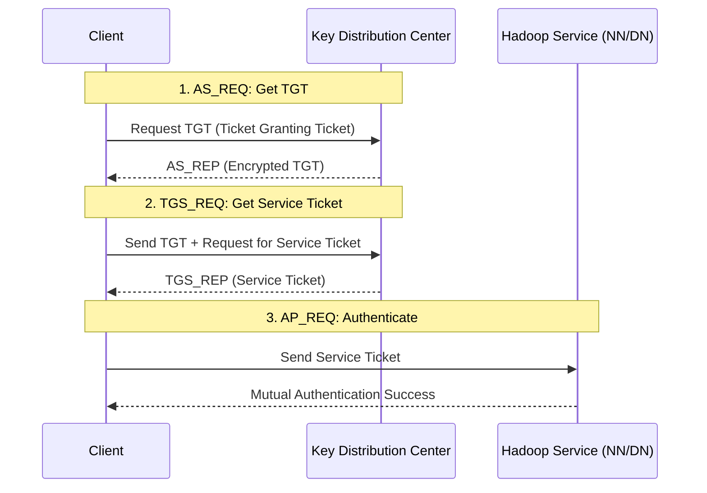

# Chapter 8: Hadoop in Production

Transitioning from a development sandbox to a production-grade Hadoop cluster requires a shift from "functional" thinking to "operational" thinking. This chapter covers the critical pillars of enterprise Hadoop: Security, Monitoring, Multi-tenancy, and Disaster Recovery.

<Info>
**Chapter Goals**:
- Master Kerberos Authentication and Delegation Tokens
- Implement fine-grained authorization with Apache Ranger
- Design a high-availability Monitoring and Alerting stack
- Calculate RPO/RTO for Disaster Recovery strategies
- Learn the protocol for Zero-Downtime Rolling Upgrades
</Info>

---

## 1. Enterprise Security: The Kerberos Protocol

In a production Hadoop cluster, IP-based security is insufficient. Kerberos provides strong authentication using a trusted third party (the KDC).

### A. The Kerberos "Handshake" in Hadoop
Every interaction between a client and a Hadoop service (or between two services) involves a multi-step ticket exchange.

### B. Delegation Tokens (The Secret to Scalability)
If every Map task (thousands of them) had to talk to the KDC for every block read, the KDC would crash. Hadoop solves this with **Delegation Tokens**.

1.  **Job Submission**: The client gets a Delegation Token from the NameNode.
2.  **Task Distribution**: The token is shipped to the ApplicationMaster and then to every Map/Reduce task.
3.  **Authentication**: Tasks use the Delegation Token to talk to HDFS, bypassing the KDC entirely for the duration of the job.

---

## 2. Authorization and Perimeter Security

### A. Apache Knox: The Gateway
Apache Knox provides a single REST API gateway for the cluster. It hides the complexity of internal service URLs and Kerberos behind a standard LDAP/AD-backed interface.

- **Perimeter Defense**: Only one port needs to be open to the outside world.
- **SSO Integration**: Map Hadoop identities to enterprise Active Directory groups.

### B. Apache Ranger: Fine-Grained Policies
Ranger handles the **Internal Authorization**. It uses a plugin architecture where every Hadoop service (Hive, HBase, HDFS) queries the Ranger agent for permission before executing a command.

| Feature | HDFS ACLs | Apache Ranger |
| :--- | :--- | :--- |
| **Granularity** | Directory/File level | Column/Row level (Hive) |
| **Management** | CLI (hdfs dfs -setfacl) | Centralized Web UI |
| **Dynamic Masking** | No | Yes (Mask SSN/Credit Card) |
| **Auditing** | Raw logs | Centralized Solr search |

---

## 3. Monitoring and Alerting at Scale

A production cluster generates millions of metrics. You must distinguish between "noise" and "actionable alerts."

### The "Golden Signals" of Hadoop
1.  **Latency**: NameNode RPC Queue Time (Target: < 20ms).
2.  **Traffic**: Bytes read/written per second across the cluster.
3.  **Errors**: Under-replicated blocks, DataNode dead count, YARN job failures.
4.  **Saturation**: NameNode Heap Usage (Target: < 80%), HDFS Capacity.

### Mathematical Alerting: The 80/20 Rule
Do not alert on "Node Down" if it's just one node in a 1000-node cluster. Instead, alert on **Relative Health**:
$$HealthScore = \frac{Nodes_{Live}}{Nodes_{Total}}$$
*Alert when $HealthScore < 0.95$* (more than 5% of the cluster is missing).

---

## 4. Disaster Recovery: RPO and RTO

A robust DR plan is measured by two metrics:
- **RPO (Recovery Point Objective)**: How much data can we afford to lose? (e.g., 1 hour).
- **RTO (Recovery Time Objective)**: How long can the system be down? (e.g., 4 hours).

### DR Strategies in Hadoop

| Strategy | RPO | RTO | Cost |
| :--- | :--- | :--- | :--- |
| **HDFS Snapshots** | Minutes | Minutes | Low (Metadata only) |
| **DistCp (Periodic)** | Hours | Hours | High (Network/Storage) |
| **Active-Active Cluster** | Zero | Zero | Very High (2x Hardware) |

**Recommendation**: Use **HDFS Snapshots** for accidental deletion protection (human error) and **DistCp** to a separate physical cluster for catastrophic site failure.

---

## 5. Maintenance: The Rolling Upgrade Protocol

Hadoop 2.x/3.x supports **Rolling Upgrades**, allowing you to patch the cluster without stopping all jobs.

1.  **Upgrade Standby NameNode**: Shut down Standby, upgrade software, restart as Standby.
2.  **Failover**: Promote the upgraded Standby to Active.
3.  **Upgrade Old Active**: Shut down old Active, upgrade, restart as Standby.
4.  **Upgrade DataNodes**: Use `hdfs dfsadmin -shutdownDatanode` on a small batch (e.g., 5% of nodes), upgrade, and restart. Wait for blocks to replicate before the next batch.

---

## Conclusion: The Path to Mastery

Running Hadoop in production is not about avoiding failure—it's about building a system that treats failure as a mundane event. By mastering Kerberos, Ranger, and robust DR strategies, you ensure that your big data platform is not just powerful, but also reliable and secure.
