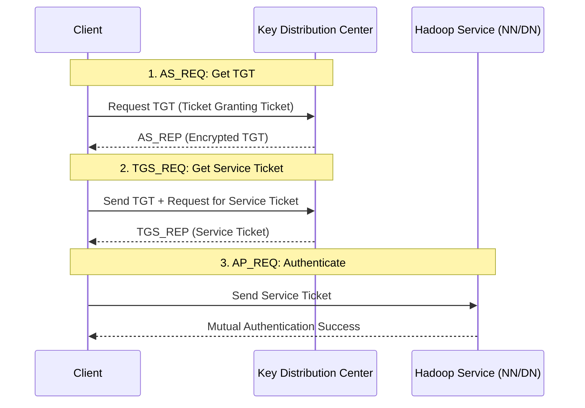

# Chapter 8: Hadoop in Production

Transitioning from a development sandbox to a production-grade Hadoop cluster requires a shift from "functional" thinking to "operational" thinking. This chapter covers the critical pillars of enterprise Hadoop: Security, Monitoring, Multi-tenancy, and Disaster Recovery.

The difference between a development Hadoop cluster and a production one is roughly the same as the difference between a hobby airplane and a commercial airliner. Both fly, but only one has redundant systems, certified maintenance schedules, air traffic control integration, and black box recorders. Most Hadoop clusters that fail in production do not fail because of HDFS bugs or MapReduce limitations -- they fail because security was bolted on as an afterthought, monitoring was "someone will check the logs," and nobody tested the disaster recovery plan until the disaster happened. The engineering that makes Hadoop production-ready is less glamorous than the distributed algorithms in earlier chapters, but it is what separates a toy from a platform that handles petabytes of regulated financial data or healthcare records.

<Info>
**Chapter Goals**:
- Master Kerberos Authentication and Delegation Tokens
- Implement fine-grained authorization with Apache Ranger
- Design a high-availability Monitoring and Alerting stack
- Calculate RPO/RTO for Disaster Recovery strategies
- Learn the protocol for Zero-Downtime Rolling Upgrades
</Info>

---

## 1. Enterprise Security: The Kerberos Protocol

In a production Hadoop cluster, IP-based security is insufficient. The default Hadoop security model essentially trusts anyone who can reach the cluster on the network -- a client can claim to be any user by simply setting the `HADOOP_USER_NAME` environment variable. This is the "Simple" authentication mode, and it is fundamentally broken for any environment where multiple users share the cluster or where data has access control requirements.

Kerberos provides strong, cryptographic authentication using a trusted third party (the Key Distribution Center, or KDC). Kerberos was developed at MIT in the 1980s as part of Project Athena and has been the standard authentication protocol for enterprise networks (Active Directory uses Kerberos internally) for decades. Hadoop adopted Kerberos in version 0.20.2 (around 2009) after Yahoo discovered that their multi-tenant clusters had no real security boundary between users.

The practical reality of Kerberos in Hadoop is that it is powerful but operationally painful. Kerberos configuration errors (expired keytabs, clock skew between nodes, incorrect principal names) are the single most common category of production Hadoop support tickets. Many organizations have adopted managed Hadoop distributions (Cloudera, Hortonworks/now Cloudera) largely because they automate Kerberos configuration. In cloud-managed services like Amazon EMR or Google Dataproc, Kerberos setup is handled by the platform.

### A. The Kerberos "Handshake" in Hadoop
Every interaction between a client and a Hadoop service (or between two services) involves a multi-step ticket exchange.

```mermaid
sequenceDiagram
    participant Client
    participant KDC as Key Distribution Center
    participant Service as Hadoop Service (NN/DN)
    
    Note over Client, KDC: 1. AS_REQ: Get TGT
    Client->>KDC: Request TGT (Ticket Granting Ticket)
    KDC-->>Client: AS_REP (Encrypted TGT)
    
    Note over Client, KDC: 2. TGS_REQ: Get Service Ticket
    Client->>KDC: Send TGT + Request for Service Ticket
    KDC-->>Client: TGS_REP (Service Ticket)
    
    Note over Client, Service: 3. AP_REQ: Authenticate
    Client->>Service: Send Service Ticket
    Service-->>Client: Mutual Authentication Success
```

### B. Delegation Tokens (The Secret to Scalability)
If every Map task (thousands of them) had to talk to the KDC for every block read, the KDC would crash. Hadoop solves this with **Delegation Tokens**.

1.  **Job Submission**: The client gets a Delegation Token from the NameNode.
2.  **Task Distribution**: The token is shipped to the ApplicationMaster and then to every Map/Reduce task.
3.  **Authentication**: Tasks use the Delegation Token to talk to HDFS, bypassing the KDC entirely for the duration of the job.

---

## 2. Authorization and Perimeter Security

### A. Apache Knox: The Gateway
Apache Knox provides a single REST API gateway for the cluster. It hides the complexity of internal service URLs and Kerberos behind a standard LDAP/AD-backed interface.

- **Perimeter Defense**: Only one port needs to be open to the outside world.
- **SSO Integration**: Map Hadoop identities to enterprise Active Directory groups.

### B. Apache Ranger: Fine-Grained Policies
Ranger was developed at Hortonworks (open-sourced around 2014) to address a critical gap: Kerberos tells you *who* a user is, but it does not tell you *what* they are allowed to do. HDFS has POSIX-style permissions (owner/group/other with read/write/execute), but these are far too coarse for enterprise requirements. When a financial services company stores customer PII in the same cluster as marketing analytics data, they need column-level access control, dynamic data masking (show "XXX-XX-1234" instead of full SSN), and centralized audit trails for regulatory compliance (SOX, HIPAA, GDPR).

Ranger handles the **Internal Authorization**. It uses a plugin architecture where every Hadoop service (Hive, HBase, HDFS) queries the Ranger agent for permission before executing a command. The Ranger Admin provides a centralized web UI where security administrators define policies like "Data Engineers can read all columns in the sales table, but Analysts can only see columns where PII_flag = false." These policies are pushed to Ranger agents running inside each service, so authorization decisions are made locally (low latency) while policy management is centralized.

An alternative to Ranger is **Apache Sentry** (developed at Cloudera), which provides similar fine-grained authorization. After Cloudera and Hortonworks merged in 2018, Ranger became the unified authorization platform for the combined Cloudera Data Platform (CDP).

| Feature | HDFS ACLs | Apache Ranger |
| :--- | :--- | :--- |
| **Granularity** | Directory/File level | Column/Row level (Hive) |
| **Management** | CLI (hdfs dfs -setfacl) | Centralized Web UI |
| **Dynamic Masking** | No | Yes (Mask SSN/Credit Card) |
| **Auditing** | Raw logs | Centralized Solr search |

---

## 3. Monitoring and Alerting at Scale

A production cluster generates millions of metrics. The challenge is not collecting metrics -- Hadoop exposes extensive JMX metrics from every daemon -- but rather distinguishing between "noise" and "actionable alerts." Google's SRE book formalized this as the "Golden Signals" framework (latency, traffic, errors, saturation), and it maps directly to Hadoop monitoring. A common mistake is alerting on every metric threshold breach, which leads to "alert fatigue" -- operators stop paying attention because 95% of alerts are noise, and then miss the 5% that matter.

The modern monitoring stack for Hadoop production clusters typically uses **Prometheus** (or Datadog/CloudWatch in cloud environments) for metric collection, **Grafana** for dashboards, and **PagerDuty** or **OpsGenie** for alert routing. Cloudera Manager and Ambari (now deprecated) provided built-in monitoring, but most large-scale deployments supplement or replace them with the Prometheus/Grafana stack because it integrates with the broader infrastructure monitoring ecosystem.

### The "Golden Signals" of Hadoop
1.  **Latency**: NameNode RPC Queue Time (Target: < 20ms).
2.  **Traffic**: Bytes read/written per second across the cluster.
3.  **Errors**: Under-replicated blocks, DataNode dead count, YARN job failures.
4.  **Saturation**: NameNode Heap Usage (Target: < 80%), HDFS Capacity.

### Mathematical Alerting: The 80/20 Rule
Do not alert on "Node Down" if it's just one node in a 1000-node cluster. Instead, alert on **Relative Health**:
$$HealthScore = \frac{Nodes_{Live}}{Nodes_{Total}}$$
*Alert when $HealthScore < 0.95$* (more than 5% of the cluster is missing).

---

## 4. Disaster Recovery: RPO and RTO

A robust DR plan is measured by two metrics that directly map to business cost:
- **RPO (Recovery Point Objective)**: How much data can we afford to lose? (e.g., 1 hour). This is a business decision, not a technical one -- losing one hour of clickstream data might cost nothing, but losing one hour of financial transactions could be a regulatory violation.
- **RTO (Recovery Time Objective)**: How long can the system be down? (e.g., 4 hours). Again, business-driven -- a data warehouse that serves morning reports has a natural 8-hour RTO window, while a real-time fraud detection pipeline might need sub-minute RTO.

The most common mistake teams make is defining RPO and RTO targets without actually testing them. Your HDFS snapshots mean nothing if you have never practiced restoring from one. LinkedIn famously runs "Game Day" exercises where they deliberately kill components in production (in a controlled way) to verify that recovery procedures actually work within their stated RTO. If you cannot restore from your DR plan in a scheduled drill, you definitely cannot do it at 3 AM during a real incident.

### DR Strategies in Hadoop

| Strategy | RPO | RTO | Cost |
| :--- | :--- | :--- | :--- |
| **HDFS Snapshots** | Minutes | Minutes | Low (Metadata only) |
| **DistCp (Periodic)** | Hours | Hours | High (Network/Storage) |
| **Active-Active Cluster** | Zero | Zero | Very High (2x Hardware) |

**Recommendation**: Use **HDFS Snapshots** for accidental deletion protection (human error -- which is, statistically, the most common cause of data loss in production clusters) and **DistCp** to a separate physical cluster for catastrophic site failure. For cloud-based Hadoop deployments, DistCp to a different region's S3/GCS bucket provides geographic redundancy without the cost of a full standby cluster. The Active-Active pattern is typically reserved for mission-critical, revenue-impacting workloads where even hours of downtime carry significant business cost.

---

## 5. Maintenance: The Rolling Upgrade Protocol

Hadoop 2.x/3.x supports **Rolling Upgrades**, allowing you to patch the cluster without stopping all jobs.

1.  **Upgrade Standby NameNode**: Shut down Standby, upgrade software, restart as Standby.
2.  **Failover**: Promote the upgraded Standby to Active.
3.  **Upgrade Old Active**: Shut down old Active, upgrade, restart as Standby.
4.  **Upgrade DataNodes**: Use `hdfs dfsadmin -shutdownDatanode` on a small batch (e.g., 5% of nodes), upgrade, and restart. Wait for blocks to replicate before the next batch.

---

## Conclusion: The Path to Mastery

Running Hadoop in production is not about avoiding failure -- it is about building a system that treats failure as a mundane event. By mastering Kerberos, Ranger, and robust DR strategies, you ensure that your big data platform is not just powerful, but also reliable and secure.

It is worth noting that many of the operational challenges discussed in this chapter are why organizations have migrated to managed big data services. Amazon EMR, Google Dataproc, Azure HDInsight, and Cloudera Data Platform handle Kerberos configuration, rolling upgrades, monitoring integration, and disaster recovery as platform-level features. The trade-off is vendor lock-in and reduced control. But the principles in this chapter -- authentication vs. authorization layering, golden signal monitoring, RPO/RTO-driven DR design, and zero-downtime upgrade protocols -- apply regardless of whether you are running on bare metal, VMs, or managed cloud services. The concepts transfer directly to Kubernetes-based data platforms, cloud data warehouses, and any distributed system at scale.

---

## Interview Deep-Dive

<AccordionGroup>
  <Accordion title="Your company is migrating a production Hadoop cluster to a Kerberized environment. Walk me through the risks, the rollout plan, and how you would handle the transition without downtime.">
    **Strong Answer:**

    Kerberizing a running production cluster is one of the highest-risk operational changes you can make to a Hadoop deployment, because it fundamentally changes how every service and every client authenticates. A botched Kerberos rollout can lock every user and every automated pipeline out of the cluster simultaneously.

    Risks: First, keytab distribution -- every service principal (NameNode, DataNode, ResourceManager, NodeManager, HiveServer2, etc.) needs a unique keytab file, and these must be securely distributed and have correct file permissions. A single missing or misconfigured keytab means that service cannot authenticate. Second, clock skew -- Kerberos requires clocks to be synchronized within 5 minutes by default, so NTP must be configured and verified on every node before enabling Kerberos. Third, client migration -- every scheduled job, every Hive query from a BI tool, every application that talks to HDFS must be updated to use Kerberos authentication. This is the long tail of the migration and the part most teams underestimate. Fourth, delegation token expiration -- long-running jobs (multi-hour Spark jobs, HBase compactions) may fail when delegation tokens expire if token renewal is not properly configured.

    Rollout plan: Phase 1, deploy the KDC (or integrate with existing Active Directory) and verify it works in isolation. Phase 2, create all service principals and keytabs, distribute them to every node, and verify connectivity. Phase 3, enable Kerberos in "permissive" mode if your distribution supports it (Cloudera allows this) -- authentication is attempted but not required, which lets you identify which clients and services have not been migrated yet. Phase 4, migrate clients in batches, starting with non-critical pipelines and monitoring for authentication failures. Phase 5, switch to "strict" mode where Kerberos authentication is required. Phase 6, enable authorization (Ranger) on top of authentication.

    The key insight is that authentication (Kerberos) and authorization (Ranger) should be rolled out in separate phases. Trying to do both at once doubles the debugging surface area.

    **Follow-up: What happens to long-running Spark jobs when delegation tokens expire?**

    Delegation tokens have a configurable maximum lifetime (default 7 days) and renewal interval (default 24 hours). For long-running Spark Streaming or Spark on YARN jobs, the ApplicationMaster is responsible for renewing delegation tokens before they expire. If renewal fails (because the KDC is temporarily unavailable, or the renewer principal's keytab is misconfigured), the job will fail with an authentication error the next time it tries to access HDFS. The fix is to configure `spark.yarn.keytab` and `spark.yarn.principal` so that Spark can obtain new delegation tokens autonomously, and to set `spark.hadoop.fs.hdfs.impl.disable.cache = true` to avoid stale cached tokens.
  </Accordion>

  <Accordion title="Design a monitoring and alerting strategy for a 500-node Hadoop cluster. What would you alert on, and what would you explicitly not alert on?">
    **Strong Answer:**

    The guiding principle is Google's "Golden Signals" framework adapted to Hadoop, combined with aggressive alert suppression to avoid alert fatigue. On a 500-node cluster, individual node failures are expected events (at 99.9% per-node uptime, you expect roughly one node failure every 17 hours). Alerting on every node failure would generate constant noise.

    What I would alert on -- these are the "stop what you are doing" alerts: First, NameNode RPC queue time exceeding 100ms sustained for 5 minutes. The NameNode is the single point of serialization for metadata operations, and high RPC latency means every client in the cluster is slowing down. Second, missing blocks (blocks with zero live replicas). This is actual data loss or imminent data loss and is the most critical HDFS alert. Third, HDFS capacity above 85%. HDFS performance degrades severely above 85% because the balancer cannot move data and DataNodes cannot accept new blocks. Fourth, cluster health score below 95% (more than 25 nodes dead simultaneously), which suggests a correlated failure like a rack switch outage or a bad software push. Fifth, YARN queue starvation -- if a production queue has pending applications but zero allocated containers for more than 10 minutes, something is blocking resource allocation.

    What I would explicitly not alert on: Individual DataNode failures (self-healing via re-replication). Under-replicated blocks below a threshold (say, fewer than 100 blocks under-replicated is normal during DataNode restarts and rebalancing). Individual job failures (the job owners should monitor their own jobs). GC pauses under 500ms on TaskTracker JVMs (normal operational noise).

    The monitoring stack: JMX metrics from all Hadoop daemons exported to Prometheus via the JMX Exporter. Grafana dashboards organized by service (HDFS, YARN, Hive, HBase) with drill-down capability. PagerDuty integration with severity tiers: P1 (missing blocks, NameNode down) pages immediately, P2 (capacity warnings, degraded performance) creates a ticket for next business day. Weekly capacity planning reviews based on growth trends in the Grafana dashboards.

    **Follow-up: How would you detect and handle a "slow node" that is technically alive but degrading cluster performance?**

    Slow nodes are harder to detect than dead nodes because they pass heartbeat checks but perform poorly. I would monitor DataNode block transfer rates and flag nodes where the 95th percentile transfer time is more than 3x the cluster median. For YARN, I would track per-node task completion times and flag nodes where tasks consistently take more than 2x the cluster average. These "gray failure" nodes should be automatically decommissioned or at least deprioritized for new task scheduling. Hadoop's speculative execution handles some of this at the task level, but proactive node detection prevents the slow node from dragging down many jobs simultaneously.
  </Accordion>

  <Accordion title="Explain the difference between RPO and RTO, and design a disaster recovery strategy for a Hadoop cluster that stores regulated financial data with an RPO of 15 minutes and an RTO of 2 hours.">
    **Strong Answer:**

    RPO (Recovery Point Objective) is the maximum acceptable data loss measured in time -- an RPO of 15 minutes means that after recovery, the system must contain all data up to at most 15 minutes before the disaster. RTO (Recovery Time Objective) is the maximum acceptable downtime -- an RTO of 2 hours means the system must be fully operational within 2 hours of the disaster being declared. These are business requirements, not technical specifications, and they directly drive the architecture and cost of the DR solution.

    For regulated financial data with RPO=15min and RTO=2h, I would design a three-tier strategy.

    Tier 1 -- HDFS Snapshots (RPO: minutes, RTO: minutes, covers: human error). Enable snapshots on all critical directories. Schedule automatic snapshots every 15 minutes. This protects against the most common disaster: someone running `hdfs dfs -rm -r /production/` by accident. Recovery is instant -- just restore from the snapshot. Cost is negligible because snapshots are metadata-only.

    Tier 2 -- Cross-site DistCp with WAL replication (RPO: 15 minutes, RTO: 2 hours, covers: site failure). Maintain a standby cluster in a separate data center or cloud region. Run DistCp every 15 minutes to synchronize data. For the Hive Metastore, replicate the backing database (MySQL replication or pg_basebackup). For HBase, enable WAL replication to the standby cluster for near-zero RPO on the serving layer. The 2-hour RTO budget is spent on: validating the standby cluster is consistent (30 min), updating DNS or load balancer to point clients to the standby (15 min), running validation queries to confirm data integrity (30 min), and buffer for unexpected issues (45 min).

    Tier 3 -- Immutable backups to cold storage (covers: ransomware, compliance). Weekly full backups of critical datasets to an air-gapped storage system (S3 Glacier with Object Lock, or tape). These are not for operational recovery but for regulatory compliance and protection against ransomware that might encrypt both primary and standby clusters.

    The critical operational practice that makes this work: quarterly DR drills where you actually fail over to the standby cluster, run the full validation suite, and measure whether you met the 2-hour RTO. Document every deviation and fix it before the next drill.

    **Follow-up: How does DistCp work under the hood, and what are its limitations for meeting a 15-minute RPO?**

    DistCp (Distributed Copy) is a MapReduce job that copies files between HDFS clusters (or between HDFS and S3). Each mapper copies a set of files, so the copy is parallelized across the cluster. The limitation for tight RPOs is that DistCp copies files, not changes -- it does a full or incremental copy based on file modification timestamps. If a 100GB file is appended with 1MB of new data, DistCp copies the entire 100GB file again. For workloads with large, frequently modified files, this makes 15-minute RPO expensive in bandwidth. The mitigation is to use HDFS snapshots to identify only the changed files between runs (`hdfs snapshotDiff`), and to structure data as immutable files (append-only partitioned tables rather than mutable files) so that incremental DistCp only copies new files.
  </Accordion>

  <Accordion title="Walk me through a zero-downtime rolling upgrade of a production Hadoop cluster from version 3.2 to 3.3. What can go wrong?">
    **Strong Answer:**

    A rolling upgrade replaces software on nodes one at a time (or in small batches) while the cluster continues serving requests. Hadoop 2.x and 3.x support this natively, but "zero downtime" is aspirational -- there will be brief periods of degraded capacity as nodes restart.

    The sequence: First, upgrade the standby NameNode. Stop it, replace binaries, start it with the new version. It will read the edit log and catch up. Second, trigger a failover so the upgraded standby becomes the active NameNode. The old active becomes standby. Third, upgrade the old active (now standby) NameNode. At this point, both NameNodes are running the new version. Fourth, upgrade DataNodes in rolling batches of 5-10% of the cluster. For each batch: gracefully decommission the DataNodes (telling the NameNode they are going away so it starts re-replicating their blocks), stop them, upgrade binaries, restart them, and wait for them to register with the NameNode and begin serving blocks before proceeding to the next batch. Fifth, upgrade YARN ResourceManagers using the same active/standby failover pattern as NameNodes. Sixth, upgrade NodeManagers in rolling batches similar to DataNodes.

    What can go wrong: First, wire protocol incompatibility. If the new version changes the RPC protocol between clients and servers, upgraded DataNodes may not be able to communicate with not-yet-upgraded NameNodes (or vice versa). Hadoop versions maintain backward compatibility within minor versions, but you should always check the release notes for protocol changes. Second, feature flag changes. New versions may change default configuration values that alter behavior. For example, Hadoop 3.x changed the default block placement policy behavior. Always do a diff of default configuration between versions. Third, JVM compatibility. A Hadoop version upgrade may require or recommend a different JVM version. Changing JVM and Hadoop simultaneously doubles the risk surface. Upgrade JVM first, stabilize, then upgrade Hadoop. Fourth, downstream compatibility. Hive, HBase, Spark, and other ecosystem components may not be certified for the new Hadoop version. Verify compatibility matrices before starting.

    The critical safety net: before starting the rolling upgrade, create an HDFS snapshot of the fsimage and edit logs, and verify that you can roll back the NameNode to the old version. Hadoop's rolling upgrade support includes a `rollback` command, but you should test it on a staging cluster before touching production. I have seen upgrades where rollback was theoretically supported but practically broken because the new version had already modified on-disk formats.

    **Follow-up: What is the difference between upgrading DataNodes in a rolling fashion versus using HDFS's built-in rolling upgrade support?**

    HDFS's built-in rolling upgrade (`hdfs dfsadmin -rollingUpgrade prepare/start/finalize`) creates a snapshot of the NameNode's namespace before the upgrade begins, allowing a clean rollback to the pre-upgrade state if something goes wrong. It also puts the cluster in a special "rolling upgrade" mode where DataNodes can be restarted with new software and the NameNode will accept both old and new protocol versions during the transition period. The manual approach of decommissioning and restarting DataNodes works but does not provide the atomic rollback capability. For production upgrades, always use the built-in rolling upgrade protocol because the rollback safety net is worth the slight additional complexity.
  </Accordion>
</AccordionGroup>
